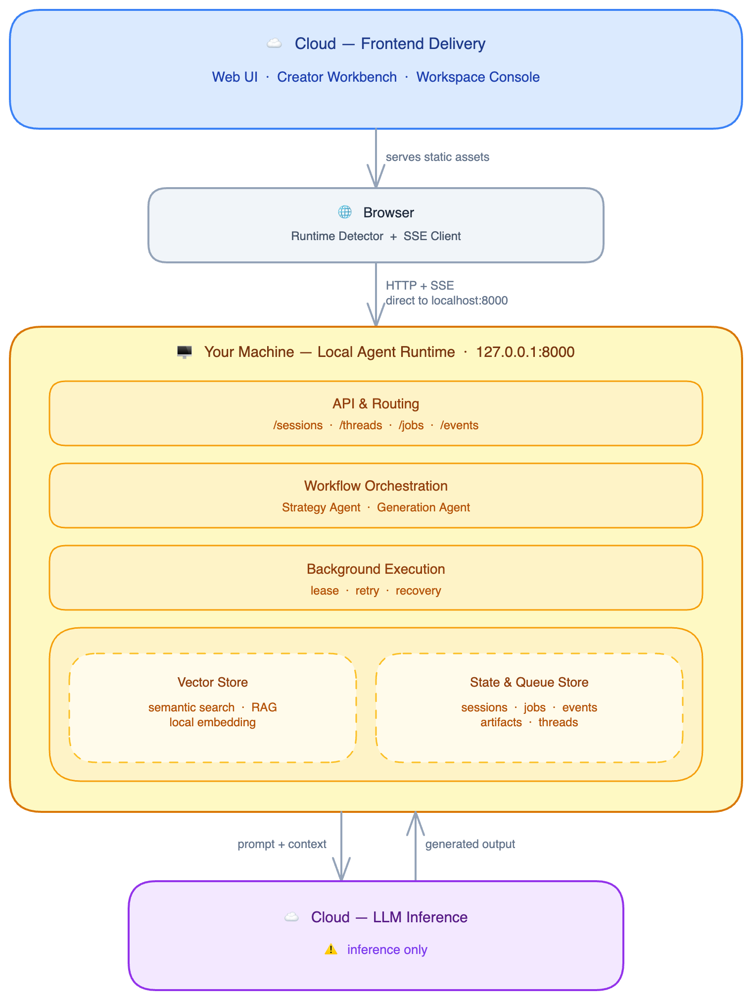
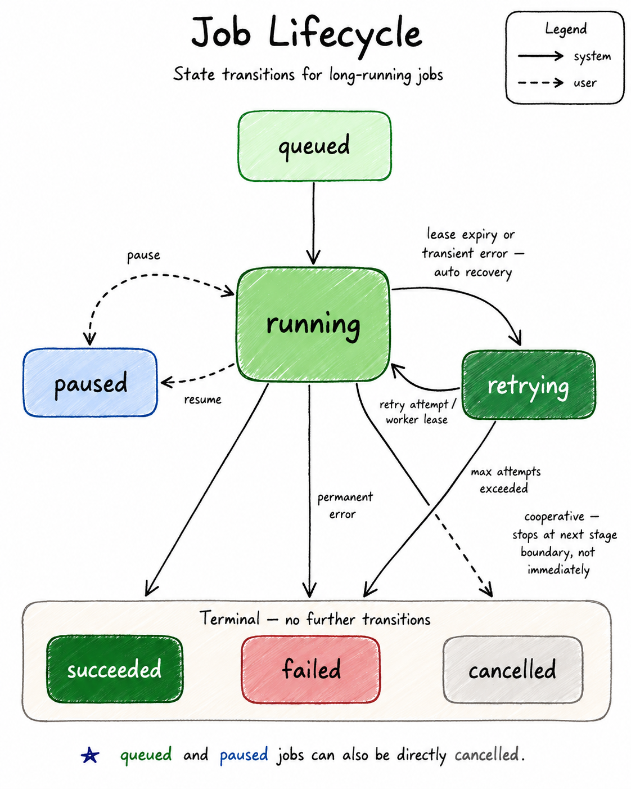
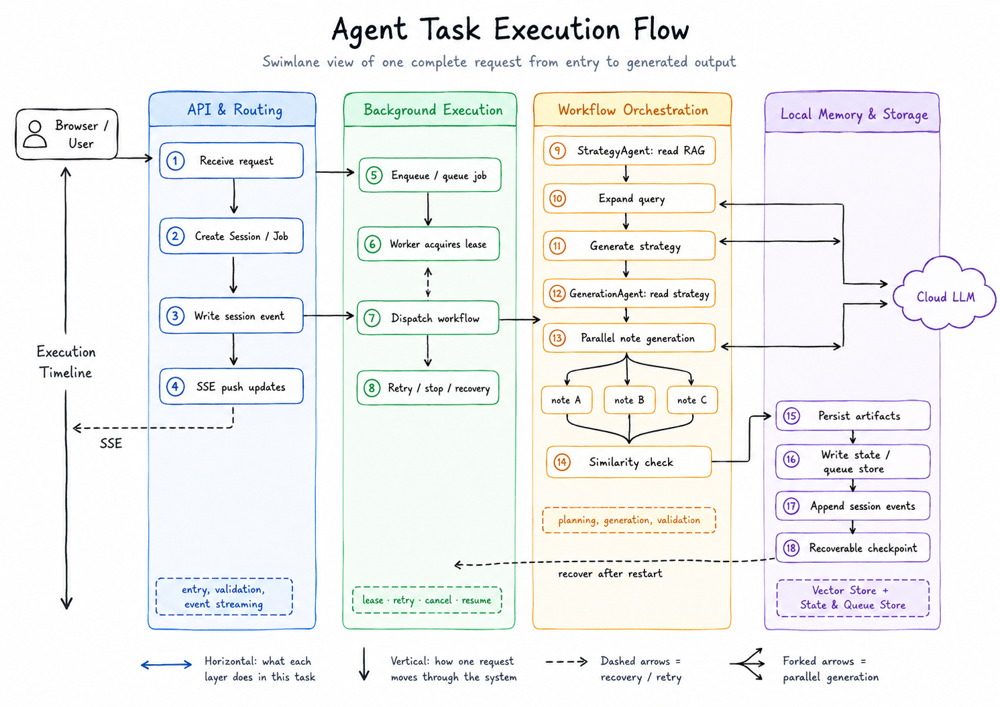
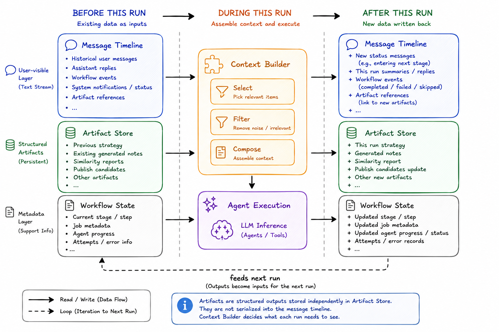

# XHS Growth Agent

[](LICENSE)
[](https://www.python.org/downloads/)
[](https://fastapi.tiangolo.com)
[](https://langchain-ai.github.io/langgraph/)

> Cloud UI · Local Agent Runtime · Cloud LLM Inference

A content strategy and note generation system for Xiaohongshu (Little Red Book) creators. The agent workflow runs on your machine — not in the cloud.



Most AI content tools host the entire agent service in the cloud. This project takes a different approach: **the frontend is on Vercel, LLM inference calls the cloud, but the agent runtime runs locally**. Workflow orchestration, job queue, RAG index, vector search, and task recovery all live on your machine.

This isn't a cost optimization. It's an architectural boundary: orchestration belongs where your data and context live.

---

## Quick Start

**Requirements**: Python 3.10+, macOS or Linux

> **First-time install note**: `setup_env.sh` installs `sentence-transformers` and `torch` for local embedding. Expect 5–10 minutes on first install. On the first strategy run, the embedding model (~400 MB) downloads automatically — subsequent runs start in seconds.

```bash
# 1. Setup
./setup_env.sh && source .venv/bin/activate

# 2. Configure
cp .env.example .env
# Set LLM_PROVIDER and the corresponding API key
# e.g. ANTHROPIC_API_KEY, OPENAI_API_KEY, etc.

# 3. Start local runtime
uvicorn app.main:create_app --factory --host 127.0.0.1 --port 8000

# 4. Verify
curl http://127.0.0.1:8000/health
```

Open the frontend (`cd frontend && npm run dev`) — the browser auto-detects the local runtime at `127.0.0.1:8000`. If the runtime isn't running, the UI shows an explicit startup prompt rather than silently falling back to mock data.

---

## Two Surfaces

**Creator Workbench** (`/creator`)

Chat-first content creation. Send a message, a multi-stage workflow-v2 run starts in the background — spider search, RAG indexing, strategy generation, note generation — while the chat window stays interactive. Task controls (pause, resume, cancel) are real backend operations backed by persistent workflow state, not UI-only changes.

**Workspace Console** (`/brands`, `/topic-pool`, `/decisions`, `/publish`)

Brand growth operating loop. Manage data sources, topic pool decisions, publish records, and performance feedback. All data reads happen from the browser directly to the local runtime — the Vercel server never proxies calls to your local machine.

---

## How to Use

### Generate content in Creator Workbench

1. Open `/creator` and start a new conversation
2. Describe what you want — topic, platform tone, target audience, any constraints
   > e.g. "帮我生成三篇敏感肌护肤笔记，风格偏干货，适合25-35岁女性"
3. The system runs a multi-stage workflow in the background:
   - Searches Xiaohongshu for reference content on your topic
   - Indexes and scores retrieved content for quality
   - Generates a content strategy (positioning, angles, structure)
   - Generates full notes based on the strategy
4. Watch live progress in the task strip at the top of the chat — each stage updates in real time via SSE
5. While the workflow runs, the chat stays open — you can ask for status, add constraints, or pause/cancel
6. When generation completes, review the strategy and generated notes inline
7. Click **完成** to accept — notes become publish candidates in the Workspace Console

### Manage publish candidates in Workspace Console

- Open `/publish` to see all accepted notes from Creator sessions
- Notes carry their source strategy and topic metadata
- Use `/decisions` and `/performance` to close the feedback loop for future sessions

### Control a running task

| What you want | How |
|---|---|
| Check progress | Ask in chat: "现在进度怎么样？" |
| Add a constraint | Type it in chat while the task runs — it's saved and linked to the job |
| Pause | Click the stop button in the task strip, or type "暂停" |
| Resume | Click resume in the task strip, or type "继续" |
| Cancel and restart | Type "取消" or click cancel, then start a new message with updated requirements |

### Creator workflow-v2 API contract

Natural-language intent goes through the message endpoint:

```text
POST /threads/{thread_id}/messages
```

The response includes `command_result` and `active_run_snapshot`. The frontend restores state from:

```text
GET /threads/{thread_id}/timeline
GET /workflow-runs/{run_id}/snapshot
GET /workflow-runs/{run_id}/events
```

`POST /threads/{thread_id}/workflow` remains as a legacy compatibility endpoint for old callers. It now forwards to the workflow-v2 message/orchestrator path and returns the created `run_id`; new tasks must not use old session/job fields as the source of truth.

---

## Architecture

### Deployment Model

Three regions with clearly separated responsibilities:

- **Cloud Frontend**: Vercel serves static UI assets only. No server-side calls to the local runtime.
- **Your Machine**: FastAPI router, job worker, LangGraph workflow, SQLite, ChromaDB, local embedding. Owns all workflow state and execution.
- **Cloud LLM**: Inference only. Receives prompt and context, returns generated output. Holds no session state.

The browser is the bridge — it detects the local runtime, calls `127.0.0.1:8000` directly, and subscribes to SSE for live task progress.

### Job Lifecycle



Jobs are the unit of recoverable execution. A workflow session runs strategy and generation as sequential jobs, each independently restartable.

Three design properties worth noting:

- **Lease-based recovery**: the worker holds a time-bounded lease per job. If the worker crashes or restarts, the lease expires and the job automatically returns to `retrying` — no manual intervention needed.
- **Cooperative cancellation**: cancelling a running job sets a flag; the job stops at the next safe stage boundary rather than being killed mid-execution. A cancelled job cannot transition to `succeeded`, preventing partial results from being surfaced as complete.
- **Reversible pause**: `paused` jobs return to `queued` on resume. Pause applies to `queued` and `retrying` states; stopping a running job requires cancel.

### Workflow Execution Chain



A user message triggers a workflow session. The job worker leases the job, invokes the appropriate agent, and writes results back to SQLite. SSE events push progress to the browser at each stage boundary.

The **Strategy Agent** queries ChromaDB for relevant content, optionally calls the LLM for query expansion when retrieval quality is low, generates a strategy JSON, and persists it as a typed artifact. The **Generation Agent** reads the strategy, generates proposals, scores and selects top-k candidates, runs parallel note generation across slots, and performs similarity checks before persisting results. Each slot checks cancellation state before writing.

### Context Assembly



The system maintains three separate stores rather than a single message history:

- **Message Timeline**: the conversation the user sees — user messages, assistant replies, and workflow status events.
- **Artifact Store**: structured task outputs — strategy JSON, generated notes, similarity reports, publish candidates.
- **Context Builder**: assembles what each agent run needs from both stores plus current workflow state, then composes the context passed to the agent.

This separation exists because generated artifacts are not chat messages. Strategy JSON needs to be independently queryable and referenceable across multiple agent runs. Mixing artifacts into a message array conflates what the user sees with what the agent needs to reason about — an approach that works for short conversations but breaks down in multi-stage, long-running workflows.

---

## Why Local-First

Cloud-hosted agent services work well for stateless, short-lived tasks. Content strategy workflows are neither: they run for minutes, depend on a local RAG index, produce structured artifacts that persist across sessions, and need to recover cleanly from worker restarts or network interruptions.

Splitting orchestration from inference lets each part run where it fits best. The LLM cloud is excellent at generating output given a prompt. The local runtime is the right place to manage state, coordinate retries, query a vector index, and decide what context to include in each agent call.

The migration path is explicit: SQLite → Postgres, ChromaDB → pgvector, local worker → cloud worker fleet. The runtime boundaries stay the same.

---

## Technical Decisions

| Decision | Choice | Reason |
|---|---|---|
| Frontend deployment | Vercel / Cloudflare Pages | Static delivery; Vercel server never calls local runtime |
| Local API | FastAPI | Async I/O, SSE, Pydantic schema contracts |
| State store | SQLite | Zero operational overhead; supports recoverable job queue |
| Vector store | ChromaDB | Local single-node indexing; no external API dependency |
| Embedding | bge-base-zh-v1.5 | Chinese semantic retrieval; runs fully local |
| Workflow engine | LangGraph | State graph, conditional routing, checkpoint |
| Background execution | SQLite queue + worker | No Redis or Celery required for local deployment |
| LLM inference | Cloud provider (pluggable) | Quality output; no local GPU requirement; swappable per task |
| SSE | Standard EventSource | Simple one-way progress streaming with `Last-Event-ID` replay |

---

## Future Plans

These are real architectural gaps. Worth discussing if you're working on similar problems:

- **Running job soft pause** — pause currently applies to `queued` and `retrying` jobs only. Pausing a running job requires a `pause_requested` column and cooperative checking inside the agent execution loop. Not yet implemented.
- **Session reuse** — each workflow start creates a new session. Reusing an existing session for follow-up generation is not implemented.
- **Rule-based intent classification** — the intent router uses keyword matching. Edge cases exist (e.g. "继续努力" incorrectly routes to `resume_job`). The async interface is designed to allow model-based classification as a drop-in replacement.
- **No SSE auth** — `GET /threads/{id}/events` has no auth gate. Acceptable for local single-user deployment; cloud deployment needs a pairing token or cookie-based auth.
- **Constraints don't trigger replanning** — additional constraints sent during a running workflow are persisted but don't cause the strategy agent to replan. Replanning requires cancelling and restarting the session.

---

## Running Tests

```bash
pytest tests/unit -q         # unit tests
pytest tests/integration -q  # integration tests
pytest tests/e2e -q          # end-to-end tests
pytest -q                    # all
```

---

## Discussion & Contributing

If you're working on similar problems — local-first agent runtimes, resumable job queues, context assembly for long-running workflows, or the local orchestration + cloud inference boundary — feel free to open a [GitHub Discussion](../../discussions). Questions, alternative approaches, and critiques are all welcome.

For bugs and feature requests, open an issue. For pull requests, please open an issue first to align on the change before writing code.

---

## Docs

- [Deployment Spec](docs/deployment/deployment_spec.md)
- [Architecture Refactor 0.1.0](docs/refactor/20260517_refactor_0.1.0.md)
- [Frontend Scope Alignment](docs/changes/2026-05-16-frontend-scope-v1-v2-alignment.md)
