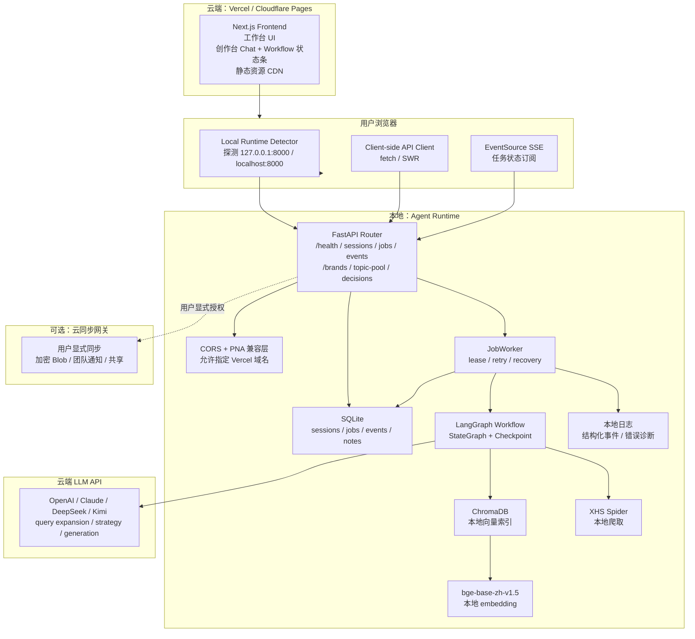
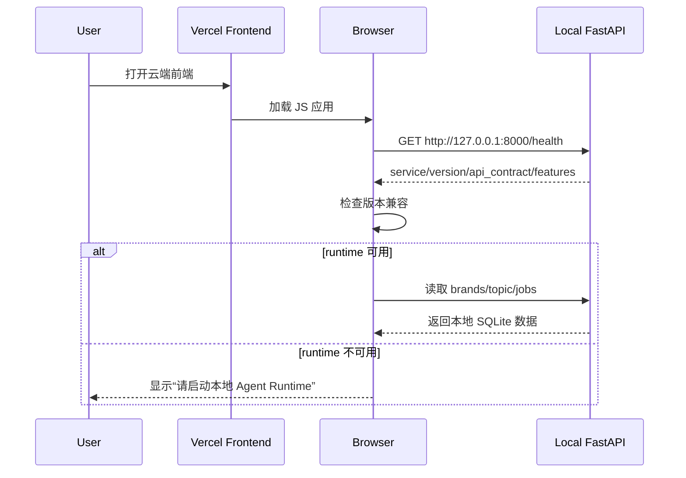
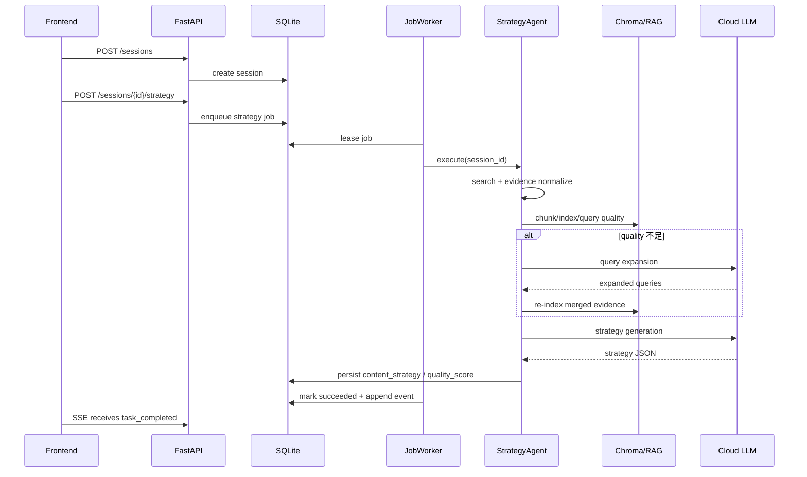
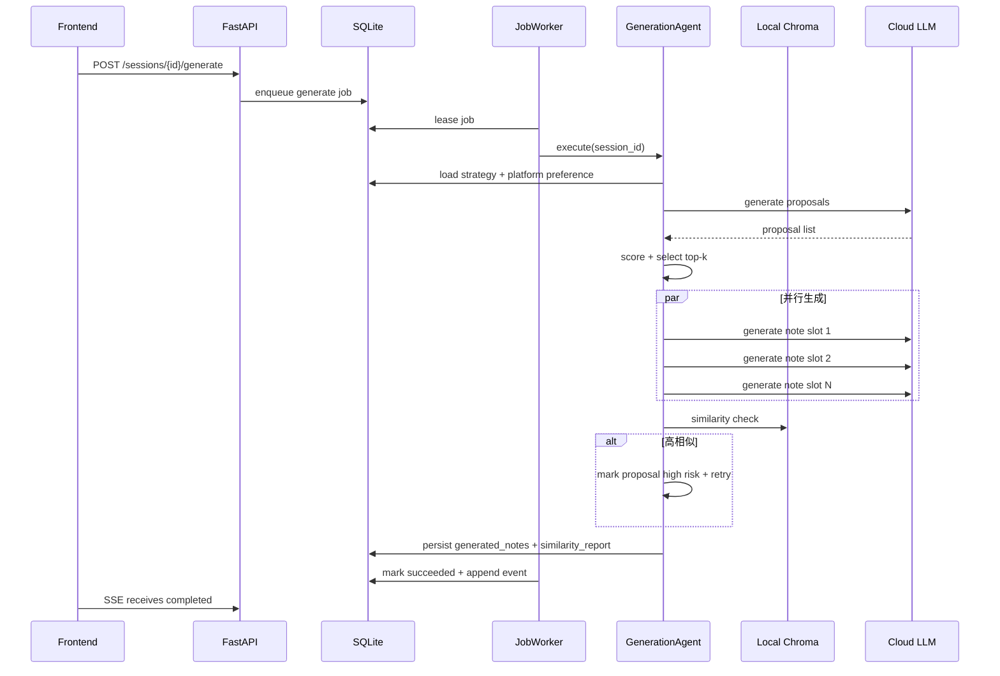
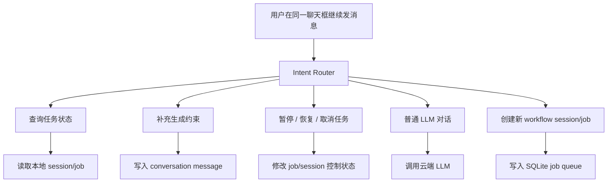

# XHS Growth Agent Deployment Spec

## 1. Product & Deployment Definition

### 1.1 Overview

This document defines the deployment-state architecture for XHS Growth Agent. The deployment model is a **cloud UI + local Agent Runtime + cloud LLM inference** architecture.

The goal is not to turn the system into a cloud-hosted SaaS Agent platform at this stage. The goal is to make the product genuinely deployable and usable while balancing:

- deployment simplicity
- local long-running task recovery
- local RAG and memory control
- cloud model output quality
- low infrastructure and operations cost
- future migration path toward cloud collaboration

### 1.2 Core Positioning

The system is a **local-first Agent Runtime with cloud-hosted frontend delivery and cloud LLM inference**.

Core boundary:

> Agent workflow execution happens locally. Cloud LLM APIs are remote inference services. `StrategyAgent` and `GenerationAgent` control flow, state updates, RAG query, similarity checks, retry logic, and result persistence all run inside the local runtime.

This means:

- The cloud frontend only hosts and serves UI assets.
- The browser talks directly to the local FastAPI runtime.
- The local runtime owns workflow state, queue state, memory, vector index, logs, and recovery.
- The cloud LLM provider only receives the prompt context needed for inference and returns generated output.
- Optional cloud synchronization is explicit and not part of the default MVP path.

### 1.3 Non-Goals

- This is not a cloud SaaS Agent service in the MVP deployment state.
- This does not require a cloud Postgres, Redis, hosted vector database, or cloud worker fleet for MVP.
- This does not promise that all data stays on the local machine, because prompts sent to cloud LLM APIs contain necessary task context.
- This does not include default automatic cloud synchronization of notes, SQLite data, or Chroma indexes.

### 1.4 Deployment Model

| Area | Deployment | Responsibility |
|---|---|---|
| Frontend UI | Vercel / Cloudflare Pages | Workspace console, creator workbench, static asset delivery |
| Browser | User device | Detect local runtime, call local API, subscribe to SSE |
| Agent API | Local machine | FastAPI router, task APIs, SSE, runtime health |
| State store | Local machine | SQLite sessions, jobs, events, notes |
| Vector store | Local machine | Chroma collection and local RAG index |
| Embedding | Local machine | `bge-base-zh-v1.5` embedding model |
| Workflow | Local machine | LangGraph state graph and checkpoint |
| Background execution | Local machine | JobWorker, lease, retry, recovery |
| LLM inference | Cloud provider | Query expansion, strategy generation, proposal generation, note generation |
| Cloud synchronization | Optional cloud service | Explicit user-triggered sync only |

---

## 2. High-Level Architecture

### 2.1 Overall Architecture



### 2.2 Runtime Regions

#### Cloud Frontend

The cloud frontend serves the Next.js application. It is responsible for UI rendering, browser-side runtime detection, and client-side API orchestration. It does not own workflow state.

#### Browser

The browser is the bridge between the cloud-hosted UI and the local Agent Runtime. It detects local runtime availability and sends requests directly to `127.0.0.1:8000` or `localhost:8000`.

#### Local Runtime

The local runtime is the real Agent backend. It owns:

- FastAPI routes
- SQLite state
- background job execution
- LangGraph workflow orchestration
- Chroma vector index
- embedding model loading
- XHS spider execution
- structured logs

#### Cloud LLM

Cloud LLM APIs provide inference only. They do not host the Agent service and do not own session/job state.

#### Optional Cloud Sync

Cloud sync is an explicit action. It is not enabled by default and must not block MVP deployment.

### 2.3 Core Call Chain

The primary request chain is:

```text
Vercel UI
-> Browser JavaScript
-> Local FastAPI Runtime
-> Local JobWorker / LangGraph / RAG
-> Cloud LLM inference when needed
-> Local persistence
-> Browser SSE progress update
```

---

## 3. Module Design

### 3.1 Cloud Frontend Modules

| Module | Responsibility |
|---|---|
| Workspace Console | Brand management, data sources, topic pool, decision runs, publish records, performance feedback, offline evaluation |
| Creator Workbench | Chat UI, workflow status strip, pause/resume/cancel controls, same-window task interaction |
| Local Runtime Detector | Detect whether local FastAPI runtime is running and compatible |
| Client API Layer | Send all local runtime requests from the browser side using fetch/SWR |
| Runtime Error UI | Show runtime missing, version mismatch, CORS failure, and task failure states |

Key constraints:

- Pages that access the local runtime must use Client Components or client-side data fetching.
- Vercel Server Components must not call `http://localhost:8000`, because that resolves to the Vercel container rather than the user machine.
- Mock/static fallback may be kept for demos, but the real deployment path must use browser-side calls to the local runtime.

### 3.2 Local Agent Runtime Modules

| Module | Responsibility | Runtime Location |
|---|---|---|
| FastAPI Router | Local API entry, CORS, health check, task submission, SSE | Local |
| SessionManager | Workflow session lifecycle and state persistence | Local |
| JobStore | SQLite-backed persistent queue and job status transitions | Local |
| JobWorker | Polling, lease acquisition, retry, recovery, execution dispatch | Local |
| LangGraph Workflow | Agent state graph and checkpoint orchestration | Local |
| StrategyAgent | Retrieval, RAG indexing, quality scoring, query expansion, strategy generation | Local orchestration + cloud inference |
| GenerationAgent | Proposal generation, scoring, parallel note generation, similarity checks, budget degradation | Local orchestration + cloud inference |
| RAGService | Chroma collection, embedding, vector query, similarity scoring | Local |
| XHSSpider | Local XHS crawling using local cookie/IP/runtime environment | Local |
| LLMClient | Provider abstraction for cloud model calls | Local client, cloud provider |
| Structured Logs | Local diagnosis for worker, lifecycle, retry, budget, and RAG events | Local |

### 3.3 Cloud LLM Modules

| Inference Task | Model Strategy | Reason |
|---|---|---|
| Query Expansion | Low-cost model | Short structured output, cost-sensitive |
| Strategy Generation | High-quality model | Strategy quality depends on reasoning and analysis |
| Proposal Generation | Balanced model | Needs diversity and structure, but can control cost |
| Note Generation | Low-cost or mixed model routing | Parallel generation can multiply inference cost |
| Fallback Generic Strategy | Stable balanced model | Used when data quality is insufficient or RAG is degraded |

### 3.4 Optional Cloud Sync Module

| Module | Responsibility |
|---|---|
| Sync Gateway | Accept explicit user-triggered sync payloads |
| Encryption Layer | Encrypt payloads before upload when enabled |
| Workspace Notification | Notify workspace members in future collaboration scenarios |
| Sync Status UI | Show success/failure without affecting local result availability |

Cloud sync must remain optional in MVP. Local task success must not depend on sync success.

---

## 4. Core Data Models

### 4.1 Local Runtime Health

Purpose:

- Let the cloud frontend detect whether the local runtime is available.
- Let the frontend validate backend compatibility before calling business APIs.
- Let the UI enable/disable features based on local runtime capabilities.

Shape:

```json
{
  "service": "xhs-agent-runtime",
  "status": "healthy",
  "version": "0.1.0",
  "api_contract": "local-runtime-v1",
  "runtime_id": "local-dev",
  "features": {
    "sse": true,
    "rag": true,
    "creator_thread": false,
    "job_cancel": false
  }
}
```

Rules:

- `service` must identify the local backend as XHS Agent Runtime.
- `version` must be compared against the frontend minimum runtime version.
- `api_contract` must match the frontend expected local runtime contract.
- `features` allows progressive rollout of RAG, creator thread, and job cancellation.

### 4.2 ConversationThread

Purpose:

- Represent the chat window in Creator Workbench.
- Keep conversation UI state separate from workflow execution state.
- Link a conversation to the currently active workflow session/job when needed.

Shape:

```ts
interface ConversationThread {
  id: string;
  title: string;
  active_workflow_session_id?: string;
  active_job_id?: string;
  created_at: string;
  updated_at: string;
}
```

Rules:

- A conversation thread is not the same as a workflow session.
- One thread may reference one active workflow session and one active job.
- Future versions may allow multiple historical workflow sessions under one thread.

### 4.3 WorkflowSession

Purpose:

- Represent a long-running Agent workflow session.
- Track business stage and lifecycle state.
- Provide the stable anchor for strategy/generation output.

Shape:

```ts
interface WorkflowSession {
  session_id: string;
  user_id: string;
  user_query: string;
  stage: "init" | "strategy" | "generation" | "completed" | "failed";
  lifecycle_state: "alive" | "frozen" | "purged";
  current_job_id?: string;
  quality_score?: number;
  used_fallback?: boolean;
  created_at: string;
  updated_at: string;
}
```

Rules:

- `stage` expresses workflow progress.
- `lifecycle_state` expresses whether the session can continue interacting.
- `current_job_id` points to the active or latest job.

### 4.4 WorkflowJob

Purpose:

- Represent one executable background job in the local queue.
- Track lease, retry, cancellation, and terminal status.

Shape:

```ts
interface WorkflowJob {
  job_id: string;
  session_id: string;
  job_type: "strategy" | "generate";
  status: "queued" | "paused" | "running" | "retrying" | "succeeded" | "failed" | "cancelled";
  attempts: number;
  max_attempts: number;
  last_error_code?: string;
  cancel_reason?: string;
}
```

Rules:

- `queued`, `retrying`, and `paused` jobs can be directly transitioned by queue control operations.
- `running` jobs require cooperative cancellation.
- `succeeded`, `failed`, and `cancelled` are terminal states.

### 4.5 SessionEvent

Purpose:

- Provide persistent event replay for SSE.
- Keep progress observable even when the browser disconnects.

Shape:

```ts
interface SessionEvent {
  event_id: number;
  event_name:
    | "stage_changed"
    | "task_progress"
    | "task_failed"
    | "task_completed"
    | "session_frozen"
    | "session_resumed"
    | "heartbeat";
  session_id: string;
  job_id?: string;
  stage?: string;
  payload: {
    message: string;
    progress?: number;
    error_code?: string;
    details?: Record<string, unknown>;
  };
}
```

Rules:

- Persisted events must have monotonically increasing `event_id`.
- SSE reconnect uses `Last-Event-ID` to replay events after the last received id.
- Heartbeats keep connections alive but should not advance persisted event state unless intentionally persisted.

---

## 5. Supported Data Flows

### 5.1 Frontend Connects to Local Runtime



Interpretation:

- Vercel only serves the frontend.
- Browser JavaScript probes local runtime.
- Runtime compatibility must be checked before business API calls.
- If runtime is unavailable, the UI must show an actionable startup prompt.

### 5.2 Strategy Generation Job



Interpretation:

- Strategy workflow orchestration is local.
- Retrieval, RAG, quality scoring, and session persistence are local.
- Cloud LLM is called only when query expansion or strategy generation requires model inference.

### 5.3 Content Generation Job



Interpretation:

- Generation workflow orchestration is local.
- Parallel LLM calls happen against cloud providers.
- Similarity checks and generated result persistence happen locally.
- Budget degradation and partial failure handling remain local runtime responsibilities.

### 5.4 Same-Window Creator Chat While Workflow Runs



Interpretation:

- The chat window must remain interactive while a background workflow job runs.
- The chat input and workflow control buttons are separate UI concepts.
- Follow-up messages are classified into status queries, additional constraints, job controls, free chat, or new workflow creation.
- Backend thread/message APIs are required for productized persistence of this model.

---

## 6. Technical Decisions

| Decision Point | Choice | Reason |
|---|---|---|
| Frontend deployment | Vercel / Cloudflare Pages | UI deployment is simple, stable, globally reachable, and easy to iterate. |
| Local API | FastAPI | Existing implementation already uses FastAPI; it supports async I/O, SSE, and Pydantic contracts. |
| Local state | SQLite | Lowest MVP operational cost; supports local sessions, jobs, events, and recoverable queues. |
| Local vector store | Chroma | Existing implementation already uses Chroma; suitable for single-node local vector indexing. |
| Local embedding | `bge-base-zh-v1.5` | Chinese semantic retrieval is good enough for MVP; no embedding API cost; supports local similarity checks. |
| Workflow engine | LangGraph | State graph, conditional routing, and checkpointing fit long-running Agent workflows. |
| Background execution | SQLite Queue + Worker | Avoids Redis/Celery for MVP and keeps local deployment simpler. |
| LLM inference | Cloud LLM API | Better output quality, no local GPU requirement, supports task-based model routing. |
| SSE | Standard EventSource for MVP | Simple one-way progress streaming; enough for task state updates; can later migrate to fetch streaming. |
| Authentication | Local loopback binding + CORS allowlist for MVP | Keeps MVP simple; pairing token remains a productization enhancement. |
| Cloud sync | Optional later phase | Current priority is a usable local runtime; collaboration/sync should not block MVP. |

Additional decisions:

- Vercel only hosts UI.
- FastAPI, SQLite, Chroma, LangGraph, and Worker run locally.
- Cloud LLM only performs inference calls.
- MVP does not use wildcard CORS.
- MVP uses fixed Vercel domains and local development domains in the CORS allowlist.
- Pairing token is not part of MVP, but the runtime contract should leave space for it.

---

## 7. Technical Risks & Mitigations

### 7.1 PNA and Browser Access to Localhost

Risk:

- Private Network Access is not an authentication mechanism.
- PNA support and enforcement differ across browser vendors and versions.
- Chrome/Edge behavior is the first target, while Safari/Firefox may not behave identically.
- Returning `Access-Control-Allow-Private-Network: true` signals the server's willingness but does not guarantee that every browser will allow the request.

Mitigation:

- Do not rely on PNA as the core security or availability mechanism.
- Make FastAPI compatible with PNA preflight.
- Prioritize Chrome/Edge support in MVP.
- Provide clear runtime startup guidance when probing fails.
- Keep a local frontend fallback path for future packaging if browser access becomes unreliable.

### 7.2 CORS and Local Security Boundary

Risk:

- Binding to `127.0.0.1` prevents direct public network access, but browser-based cross-origin requests can still be initiated by pages the user visits.
- CORS controls whether the browser exposes the response to frontend JavaScript; it is not a full authentication mechanism.
- Overly broad CORS would allow unexpected origins to interact with the local runtime.

Mitigation:

- Bind FastAPI only to `127.0.0.1` by default.
- Allow only local development origins and the configured Vercel production domain.
- Do not use `allow_origins=["*"]` for the deployment runtime.
- Keep pairing token as a productization path after MVP.

### 7.3 Server Components Accessing Local API

Risk:

- A Vercel Server Component calling `http://localhost:8000` reaches the Vercel execution environment rather than the user's local machine.
- Existing SSR-based local API calls will fail after cloud deployment.

Mitigation:

- All local runtime API calls must be moved to browser-side execution.
- Pages such as `/brands` and `/brands/[id]` need Client Component or SWR-based data fetching when they depend on the local runtime.
- Server-side mock/demo data may remain for non-runtime demos but must not be treated as the real deployed runtime path.

### 7.4 Version Compatibility

Risk:

- The Vercel frontend may deploy faster than users update their local runtime.
- New frontend code may call APIs that older local runtimes do not implement.
- API shape mismatch can appear as 404, missing fields, or silent UI errors.

Mitigation:

- `/health` must return `version`, `api_contract`, and `features`.
- The frontend must define `MIN_BACKEND_VERSION` and `REQUIRED_API_CONTRACT`.
- If version or contract checks fail, the UI must show an upgrade prompt and avoid business API calls.

### 7.5 Chroma and Embedding Resource Usage

Risk:

- `bge-base-zh-v1.5` initial load can slow down the first strategy task.
- `sentence-transformers`, `torch`, and Chroma add heavier local installation and runtime requirements than a plain FastAPI service.
- Lower-spec machines may experience memory pressure or slow vector indexing.

Mitigation:

- Lazy-load the embedding model instead of loading it on runtime startup.
- Show UI status such as "initializing local vector model" when embedding is first loaded.
- Provide a lightweight mode where RAG failure skips vector quality scoring and similarity checks.
- Mark degraded outputs explicitly with `rag_degraded=true`.
- Log RAG and embedding initialization failures locally.

### 7.6 Running Job Cancellation Semantics

Risk:

- A running job may be waiting for a third-party LLM API, Spider request, embedding computation, or Chroma write to return.
- Once an external call has been sent, the local runtime cannot guarantee that the remote provider has stopped processing it, nor can it guarantee that already-created cost or side effects are rolled back.
- Parallel generation may have some slots completed while other slots are still in progress.
- If cancellation only changes the database status to `cancelled`, the worker might later receive an external response and incorrectly write results or mark the job as `succeeded`.

Mitigation:

- Use **cooperative cancellation**.
- `queued`, `retrying`, and `paused` jobs can be cancelled directly.
- A `running` job does not promise immediate termination of an in-flight external call; it stops further workflow progress at safe stage boundaries.
- The worker must check job state after LLM/Spider/RAG calls return, before SQLite writes, and at the start/end of parallel generation slots.
- A cancelled job may persist partial/cancelled results but must not transition to `succeeded`.

### 7.7 SSE Authentication and Connection Strategy

Risk:

- Native `EventSource` does not support custom Authorization headers.
- Query-token authentication is easy to implement but may expose tokens in logs.
- Fetch streaming supports headers but is more complex than standard SSE.

Mitigation:

- Use standard EventSource for MVP.
- MVP may run without SSE token authentication, relying on local loopback binding and CORS allowlist.
- Productized versions can add pairing token and migrate to fetch streaming or cookie-based auth.

---

## 8. Rollout Plan

### 8.1 Phase 1: Cloud Frontend Connects to Local Runtime

Goal:

- The Vercel frontend can access the local FastAPI runtime from the user's browser.

Implementation:

- Extend `/health` with `service`, `version`, `api_contract`, and `features`.
- Bind FastAPI to `127.0.0.1:8000` by default.
- Add CORS allowlist for local development domains and the configured Vercel domain.
- Make FastAPI compatible with PNA preflight.
- Add frontend local runtime detector.

Acceptance Criteria:

- Opening the Vercel app triggers a browser-side probe to `http://127.0.0.1:8000/health`.
- If the runtime is not started, the UI shows "please start local Agent Runtime" guidance.
- If the runtime version is incompatible, the UI shows an upgrade prompt.
- Chrome/Edge can successfully read the health response.

### 8.2 Phase 2: Move Workspace Console to Browser-Side Runtime API

Goal:

- Workspace console pages read real local SQLite-backed data through the browser.

Implementation:

- Convert pages that depend on `server-api.ts` to Client Components or SWR-based fetching.
- Fetch `/brands`, `/topic-pool`, `/decisions`, and related endpoints through detected local runtime base URL.
- Add loading, runtime-missing, CORS-failed, version-mismatch, and API-error states.
- Keep mock/demo fallback only for non-runtime demos.

Acceptance Criteria:

- Vercel-deployed `/brands` reads data from the user's local runtime.
- Vercel server no longer calls `localhost:8000`.
- Stopping the local runtime does not crash the UI; it shows an actionable local runtime prompt.

### 8.3 Phase 3: Connect Creator Workbench to V1 Workflow

Goal:

- Creator Workbench can start a workflow, subscribe to progress, and keep the chat window interactive while the workflow runs.

Implementation:

- Creator Workbench calls `/sessions` to create a workflow session.
- Creator Workbench calls `/strategy` and `/generate` to enqueue jobs.
- Creator Workbench subscribes to `/sessions/{id}/events` using SSE.
- The workflow status strip shows queued/running/retrying/succeeded/failed states.
- Chat input remains available while workflow jobs run.
- User messages are initially stored in frontend thread state until backend thread/message APIs exist.

Acceptance Criteria:

- Starting a generation task produces live SSE progress updates.
- The user can send additional messages in the same creator window during the running task.
- Disconnecting and reconnecting SSE can replay events using `Last-Event-ID`.

### 8.4 Phase 4: Add Clear Task Control Semantics

Goal:

- Provide clear, recoverable, and observable control for long-running tasks so frontend workflow state and backend job state remain consistent.

Implementation:

- Add public pause/resume/cancel APIs for job/session control.
- `queued`, `retrying`, and `paused` jobs transition directly.
- `running` jobs use cooperative cancellation.
- GenerationAgent parallel slots check cancellation state at safe boundaries.
- Cancelled jobs cannot later overwrite their status with `succeeded`.

Acceptance Criteria:

- A cancelled running task does not write `completed`.
- A cancelled queued task is not leased by the worker.
- A paused job can be resumed back to `queued`.
- SSE correctly replays pause/resume/cancel events.
- Partial completed output is marked as partial/cancelled rather than full success.

### 8.5 Phase 5: RAG Lightweight Mode and Resource Diagnostics

Goal:

- Reduce the impact of local embedding and Chroma resource requirements on product availability.

Implementation:

- Lazy-load the embedding model.
- Expose RAG initialization status through `/health.features` or `/runtime/status`.
- If RAG initialization fails, continue with degraded strategy/generation mode.
- Show RAG status and lightweight-mode message in UI.

Acceptance Criteria:

- Strategy generation can still run when embedding model loading fails.
- Degraded results are explicitly marked.
- Local logs identify Chroma/embedding initialization failure causes.

### 8.6 Phase 6: Optional Cloud Synchronization

Goal:

- Allow explicit user-triggered synchronization without changing the local-first MVP behavior.

Implementation:

- Add "sync to cloud" UI.
- Upload generated results or encrypted blobs only after explicit user action.
- Do not automatically upload full SQLite or Chroma data.
- Add future workspace notification and sharing behavior.

Acceptance Criteria:

- Default behavior does not upload local data.
- User-triggered sync is explicit.
- Sync failure does not affect local task result availability.

---

## 9. MVP Defaults & Constraints

- Primary browser support: Chrome/Edge.
- Local backend default address: `127.0.0.1:8000`.
- Production frontend domain must be configured in the local runtime CORS allowlist.
- MVP does not implement complex pairing token authentication.
- MVP must not use wildcard CORS for deployment runtime.
- MVP uses standard EventSource for SSE.
- Cloud LLM prompts include necessary task context.
- The deployment goal is cost and quality balance, not a guarantee that all data remains local.
- Cloud synchronization is not included in MVP.
- Optional cloud sync must not affect local workflow success.

---

## 10. Project Positioning Statement

Recommended project statement:

> This deployment model is not a cloud SaaS Agent platform. It is a cloud-frontend + local Agent Runtime architecture. The frontend is deployed to Vercel to reduce distribution cost and improve accessibility. The local FastAPI + SQLite + Chroma + LangGraph runtime owns state, memory, RAG, and long-running task recovery. Cloud LLM APIs provide inference only. This gives the product high-quality generation without requiring a full multi-tenant cloud backend at the MVP stage. If multi-user collaboration becomes necessary later, SQLite can migrate to Postgres, Chroma can migrate to pgvector or a managed vector database, and local workers can migrate to cloud workers while preserving the runtime boundaries.

Key clarification:

> Saying "strategy generation and content generation run in the cloud" can be misunderstood as "the Agent service runs in the cloud." The precise statement is: `StrategyAgent` and `GenerationAgent` are orchestrated by the local worker; only LLM inference calls happen in the cloud.

