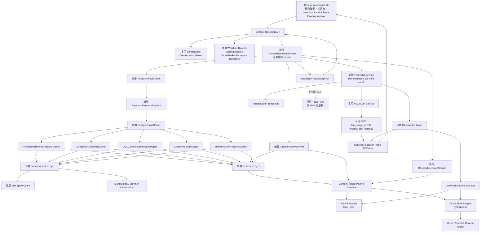
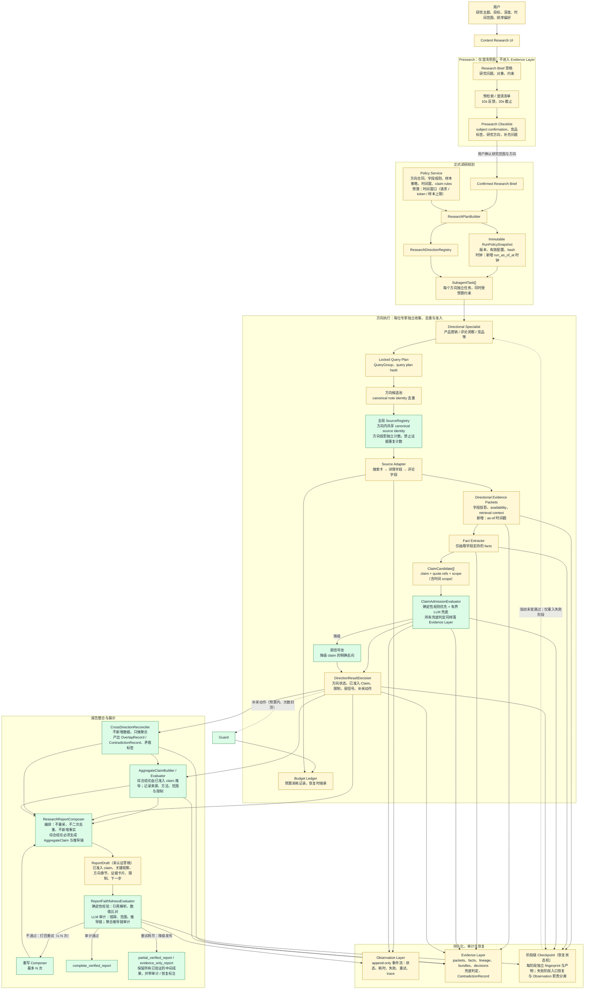

# F003 Content Research Architecture(小红书调研证据链与 Agent Workflow)

**文档状态**:设计中  
**版本**:v0.2  
**日期**:2026-07-17  
**关联 PRD**:[F003_content_research_prd.md](./F003_content_research_prd.md)

---

## 1. 架构目标

F003 不是新增一个独立应用,而是在 Creator Workbench 中新增一个 Content Research workflow mode。架构目标是:

- 复用现有 Creator Workbench conversation 和 workflow runtime。
- 新增 `app/content_research` 业务模块,采用 hybrid-ready runtime / store 边界。
- MVP 可以用本地 SQLite adapter 跑通,但 store、API、observation、benchmark、priority/evidence-boundary policy 均按未来 Cloud Research Runtime 设计。
- 在正式调研阶段建立 Evidence Layer,保证证据结构化、可追溯、可查询、可审计。
- 将不同调研方向编译成可并发执行、可观测、可恢复的 subagent tasks。
- 用 Observation Layer 记录任务执行状态、耗时、当前阶段、异常和 token 用量。
- 复用 F002 LLM usage tracking 能力,在 Content Research 前端提供独立 Trace 悬浮窗。
- 将 priority / evidence-boundary 判断从 agent prompt 中抽离出来,由可版本化的 policy service 统一生成。

---

## 2. 核心架构决策

### ADR-001:复用现有 workflow runtime,采用 hybrid-ready store/runtime 边界

F003 复用当前已有能力:

- Creator Workbench thread / conversation。
- `WorkflowStore` / `WorkflowRunManager` / `JobWorker`。
- workflow steps / child tasks / events。
- F002 LLM Service 与 usage tracking。

F003 新增:

- `ContentResearchStore`:业务数据持久化。
- `ContentResearchService`:业务编排 facade。
- `ContentResearchObservationStore`:调研任务观测数据。
- `ContentResearchEvidenceStore`:正式调研证据层。

原则:

- MVP 不另造一套 workflow runtime。
- `local_mvp` 是部署形态,不是长期架构边界。
- 业务 service 依赖 store / runtime interface,不得直接依赖 SQLite。
- Content Research 特有的 brief、plan、evidence、decision、priority / evidence-boundary snapshot 进入新增业务 store interface。

部署形态:

```text
local_mvp
  本地 Creator Workbench + 本地 workflow runtime + SQLite adapters。

hybrid
  本地 Creator Workbench UI + 云端 research execution / evidence / benchmark / decision policy。
  本地保留 draft、result cache 和 UI 状态。

cloud_managed
  云端 workflow / evidence / benchmark / decision policy / trace 全托管。
  Creator Workbench 只消费 remote workflow state/events。
```

### ADR-002:Presearch 是同步体验 + 异步容错

Presearch 只用于意图澄清,不作为正式调研结果。

约束:

- 10 秒内用户必须得到反馈。
- 20 秒是预检索硬截止。
- Presearch 不进入 Evidence Layer。
- Presearch 必须进入 Observation Layer。

超时策略:

```text
T0: 用户提交 Research Seed
  ↓
启动 presearch attempt
  ↓
T1 = 10s
  如果未完成:
    - 返回“仍在继续检索”的状态反馈或兜底 checklist
    - 不立即暂停 LLM / search
    - 用户可以手动填写 checklist
    - 记录 presearch_first_timeout
  ↓
T2 = 20s
  如果仍未完成:
    - 自动取消所有 presearch 子任务
    - 返回 timeout_reason 和最终兜底 checklist
    - 记录 presearch_final_timeout
```

### ADR-003:正式调研全程进入 Evidence Layer

用户确认 Research Brief 后,系统进入正式调研阶段。从这一刻开始,所有正式检索、解析、抽取和派生结果都必须进入 Evidence Layer。

Presearch 和 Formal Research 的边界:

```text
Presearch
  目的:确认用户意图
  存储:Observation only
  不记录:evidence / source lineage / evidence bundle

Formal Research
  目的:生成可追溯调研结果
  存储:Observation + Evidence + Result Snapshot
  必须记录:raw / normalized / derived evidence
```

### ADR-004:Main agent 类似 associate,subagent 类似 analyst

Main Research orchestration:

- 理解 Research Brief。
- 拆解 Research Plan。
- 分派 subagent tasks。
- 将方向结果交给只读的跨方向协调与报告整合流程。
- 只消费已准入的方向 claim、矛盾/重叠记录和已准入聚合 claim。
- 不绕过 Evidence Layer 生成正式洞察。

Subagent:

- 只负责一个明确调研方向。
- 收集信息。
- 写入 evidence。
- 抽取结构化 facts。
- 标记 missing evidence。
- 输出方向内 findings。
- 不负责全局排序和最终结论。

边界:

- Subagent 输出 `finding + evidence_refs`。
- 方向专家输出 `DirectionResultDecision + AdmittedClaim[]`。
- `CrossDirectionReconciler` 只产出关系记录，不重写方向结论。
- `ResearchReportComposer` 只编排已准入 claim；跨方向综合句必须成为可审计的
  `AggregateClaim`，不能作为自由文本绕过证据链。

### ADR-005:Research Plan 编译成 subagent tasks

用户确认后的 Research Brief 会先生成 Research Plan,再通过 Direction Registry 映射为多个 subagent tasks。

```text
Research Brief
  ↓
ResearchPlanBuilder
  ↓
ResearchDirectionRegistry
  ↓
SubagentTask[]
  ↓
Workflow child tasks
```

这样做的原因:

- 支持并发执行。
- 支持每个方向独立重试、恢复和观察。
- 支持后续新增调研方向时只扩展 registry 和 agent。
- 避免 main agent 承担所有上下文和所有检索逻辑。

### ADR-006:Observation 记录任务怎么跑, Evidence 记录拿到了什么

Observation Layer 和 Evidence Layer 必须分离。

```text
Observation
  append-only 遥测事件流:
  调用、耗时、token 用量、异常、重试和操作审计。

Evidence
  记录调研证据:
  原始数据、归一数据、派生 facts、source URL、lineage、bundle。

Checkpoint
  恢复状态机:
  每个阶段的输入 fingerprint、产物引用、执行状态、失败原因和重试次数。
  “run 进行到哪里”以 Checkpoint 为唯一事实源，不从 Observation 推导。
```

### ADR-007:Priority / Evidence-Boundary Policy 版本化

Priority 和 evidence boundary 不由 agent 自由决定,而由统一 policy service 生成。

要求:

- 支持 policy 版本。
- 支持按调研方向配置 allowed claims、forbidden claims、minimum evidence requirements。
- 支持后续 policy 升级后生成新 snapshot。
- 历史结果必须能知道使用了哪个 priority / evidence-boundary policy version。

### ADR-008:不混用 app/v2 业务域

F003 不和现有 `app/v2` 业务模块混在一起。

约束:

- F003 不 import `app/v2/decision`。
- F003 不 import `app/v2/topic_pool`。
- F003 不以 `app/v2/ingestion` 作为长期正式边界。
- F003 的正式业务代码必须位于 `app/content_research`。

可以复用的是横向基础设施:

- `app/services/xhs_spider.py`
- `app/services/llm/*`
- `app/memory/workflow_store.py`
- `app/services/workflow_run_manager.py`
- `app/memory/thread_store.py`

如果 `app/v2/ingestion` 或 `experiments/xhs_extension_mvp` 中有可用代码,应迁移到 `app/content_research` 后再使用,不得长期跨域 import。

### ADR-009:人工决策是 workflow event,不是纯 UI 状态

前端点击 `selected / rejected / watchlist` 后,必须写入业务 decision、observation event 和 workflow event。

原则:

- 决策 API 必须幂等。
- 决策历史 append-only。
- 当前有效决策取 latest。
- workflow 根据当前有效决策推进下一步。

### ADR-010:archive 和 soft delete 分离

`archived` 是业务状态,表示仍然有效但默认收起。  
`deleted_at` 是软删除字段,表示业务上视为删除,只为审计、debug 或恢复保留。

不要把 `deleted` 混入普通 status 枚举。

```text
archived:
  有效历史记录
  默认列表不展示
  可搜索、可恢复、可作为历史参考

deleted_at:
  业务查询默认排除
  不参与 priority / result / recommendation
  只有审计、debug、恢复工具可查
```

### ADR-011:小红书 Cookie 有效期按 7 天处理

小红书 cookie 默认按 7 天有效期管理。

Cookie 来源复用现有小红书采集机制。F003 不新建独立 cookie 管理系统,也不在 P0 做自动续期。

Source Adapter 必须记录:

```text
cookie_status: valid | expiring_soon | expired | invalid
cookie_expires_at
last_validated_at
```

策略:

- 小于 24 小时过期:前端提示即将失效。
- 已过期或无效:adapter 返回 `auth_required`。
- 正式调研阶段的 `auth_required` 必须写入 failure evidence。
- UI 需要明确区分“没有发现”和“登录态失效没拿到”。
- 前端不提供显式登录态管理入口;用户第一次使用 Content Research 时,页面顶部居中弹出提示,引导用户先登录小红书网页端。

### ADR-012:支持多 Search API / MCP / Model Profile

F003 的 runtime 不是小红书专用 agent,而是可配置 Content Research Runtime。MVP 当前 focus on 小红书,但架构必须支持:

- 多 Search API。
- 多 MCP / tool server。
- 多 Source Adapter。
- 多模型配置。
- 不同 research direction 使用不同 tool/model/profile。

默认 source profile:

```text
source_profile: xiaohongshu_default
search_providers:
  - xhs_spider
  - browser_observation
  - manual_link
mcp_servers: []
model_profiles:
  presearch: cheap_fast
  extraction: balanced
  synthesis: quality
```

借鉴来源与原因:

- [STORM GitHub](https://github.com/stanford-oval/storm):STORM 将 LM、retriever、search top-k 等组件配置化,说明 research runtime 不应把模型和检索工具写死在单个 agent 中。F003 借鉴这一点,把小红书作为默认 source profile,但保留多 search provider / model profile 扩展位。
- [Enterprise Deep Research GitHub](https://github.com/SalesforceAIResearch/enterprise-deep-research):EDR 使用 specialized search agents 和 MCP-based tool ecosystem,适合企业内部多工具 research 场景。F003 借鉴其 tool ecosystem 思路,但 P0 只启用小红书相关 adapter。

### ADR-013:引入 Context Compression Pipeline

Main agent 不直接消费 raw evidence。正式调研需要分层压缩:

```text
L0 Raw Evidence
  原始笔记、评论、作者页、搜索结果、人工链接。

L1 Normalized Evidence
  统一字段、URL、作者、互动数、时间、source kind。

L2 Extracted Facts
  品牌名、卖点、痛点、价格、活动、UGC 信号等结构化事实。

L3 Direction Result
  每个方向输出 ClaimAdmissionDecision、AdmittedClaim、weak signals、限制和
  recovery action。

L4 Governed Cross-direction Report
  CrossDirectionReconciler 输出关系记录；AggregateClaimEvaluator 准入跨方向
  推导；ResearchReportComposer 只编排已准入对象，并由 faithfulness evaluator
  审计最终文本。
```

借鉴来源与原因:

- [STORM paper](https://arxiv.org/abs/2402.14207):STORM 在写作前先做 knowledge curation 和 outline generation,避免直接从检索结果跳到最终文章。F003 借鉴其“先整理知识,再综合输出”的顺序,将 raw evidence 压缩为 facts 和 finding summaries 后再交给 main agent。
- [Open Deep Research GitHub](https://github.com/langchain-ai/open_deep_research):Open Deep Research 将 search、summarization、compression、final synthesis 分阶段执行。F003 借鉴其 compression 思路,避免 main agent 消费过量 raw context。

### ADR-014:最终输出以可审计 Decision Card 为核心，不以长篇报告或单一总分替代证据

F003 不以无证据边界的长篇 report 为主输出,也不把所有判断压成一个 0-100
总分。最终报告由可展开的 Direction / Aggregate Decision Card 组成，把优先级、
证据状态、结论边界和下一步动作分开呈现；报告整合层只能编排已准入对象:

```text
1. Priority
   当前 finding 是否值得优先进入下一步研究、选题或实验。

2. Evidence Status
   finding 是 verified、partially supported、case only、signal 还是 unsupported。

3. Claim Scope
   当前证据允许系统说什么,明确禁止系统外推什么。

4. Supporting Evidence
   可展开 Evidence Bundle、source links、supporting / conflicting facts 和
   missing evidence。

5. Next Action
   补证、继续深挖、进入选题库、生成内容 brief 或设计内容实验。
```

Decision Card 示例:

```json
{
  "priority_label": "high_potential_needs_more_evidence",
  "evidence_grade": "B",
  "verification_status": "partially_supported",
  "claim_scope": {
    "allowed": ["值得进入下一轮内容实验"],
    "not_allowed": ["不能预测爆款概率", "不能证明转化提升"]
  },
  "next_action": {
    "type": "content_experiment",
    "proposal": "对比测试重量表达与收纳抗皱表达"
  }
}
```

借鉴来源与原因:

- [STORM GitHub](https://github.com/stanford-oval/storm):STORM 的 outline generation 强调先形成结构化框架。F003 借鉴 outline 的结构感,但不照搬 Wikipedia-style long article,因为用户需要可筛选、可排序、可展开证据的运营洞察。
- RAGAS / ARES-style evaluation:检索相关性、证据忠实性和回答相关性应分开评估。F003 借鉴这一点,将 priority、evidence grade 和 claim scope 分开呈现,避免一个总分掩盖证据不足或过度外推。

### ADR-015:Benchmark 分 objective / subjective,且 subjective 从多视角问题开始量化

F003 需要自己的 `ContentResearchBench`。Benchmark 不只评价 final insight,也评价 Research Brief、multi-perspective question asking、检索覆盖、证据支撑、priority / evidence-boundary 校准和 workflow reliability。

Objective metrics:

- 检索数量。
- 平台覆盖。
- source kind 覆盖。
- evidence count。
- bundle count。
- token / cost / latency。
- subagent completion rate。
- required target recall。

Subjective metrics:

- 主体识别是否符合用户预期。
- multi-perspective questions 是否覆盖用户真正关心的维度。
- 调研方向推荐是否合理。
- insight 是否有业务含义。
- 深入分析是否解释了为什么重要。
- 排序是否符合用户优先级。
- 证据不足是否被正确表达为线索、case 或 limitation,而非确定结论。

主观评价要从 Research Brief 阶段开始,不是只评最终输出。

借鉴来源与原因:

- [STORM paper](https://arxiv.org/abs/2402.14207):STORM 用 multi-perspective question asking 改善研究广度和深度,并评估 pre-writing/outline 阶段。F003 借鉴这一点,将 subjective evaluation 前移到 Research Brief 阶段,评估系统提出的问题是否覆盖用户真实关注面。
- [DeepResearch Bench paper](https://arxiv.org/abs/2506.11763):DeepResearch Bench 使用专家构造任务和 reference/golden reports。F003 借鉴其专家任务集思想,但不使用长报告作为唯一 gold output。
- [Enterprise Deep Research paper](https://arxiv.org/abs/2510.17797):EDR 评估 agentic research trajectories,不只看最终报告。F003 借鉴其过程评估思想,但因 local-first 存储约束,普通运行只保存摘要级 trace,benchmark/debug 才保存更详细轨迹。

### ADR-016:Benchmark 不默认保存全量轨迹

local-first 架构下,不能把完整 benchmark trajectory 作为普通运行的默认持久化策略。

普通运行只保存:

- 恢复任务所需状态。
- 审计所需 decision context。
- evidence bundle 和必要 lineage。
- priority / evidence-boundary policy version。
- trace summary 和必要 observation events。

Benchmark mode 才额外保存:

- evaluation_case_id。
- objective metric snapshot。
- subjective rubric scores。
- evaluator notes。
- sampled trace references。
- benchmark result snapshot。

详细 trajectories 只在以下情况保存:

- benchmark mode 显式开启。
- debug mode 显式开启。
- 失败样本采样。
- 用户允许保存完整 trace。

### ADR-017:Research 执行数据默认可上传云端

Content Research 不再以 local-first 作为长期约束。启动 Content Research 服务后,默认开启云端执行数据与静默评测数据采集。

数据策略:

- evidence、observation、trace summary、benchmark metrics 都可以上传云端。
- 用户输入在本地 UI 中先可见,但执行指令实时发送到云端 runtime。
- 用户手动补充的竞品、链接、观察说明可以进入 workspace cloud。
- benchmark live evaluation 不要求用户逐次显式授权;服务启动后默认静默收集摘要级评测数据。
- Cloud Research Runtime 的账户、配额、计费边界后续单独设计;MVP 先打通 workflow 和数据边界。
- P0 只预留 cloud sync 字段,不实际上传数据。

注意:

- 这是一条产品/部署决策,不是要求 P0 必须完成云端 runtime。
- P0 仍可用 local adapter 实现,但接口和数据模型必须 cloud-ready。
- Live Evaluation 默认开启是产品策略;P0 可先不实现上传链路。

### ADR-018:SourceRegistry 全局解析身份，方向独立计数

`SourceRegistry` 将平台 source identity 解析为全局稳定的
`canonical_source_id`，但不合并方向样本，也不替方向重算证据数。每个方向
持有自己的 `DirectionSourceProjection`、selection reason、field projection 和
eligibility。任何“笔记数”必须同时声明 run、查询范围、as-of 时间和 eligibility
口径。

### ADR-019:实际用量账本只记录、不拦截

Day1 不设置调用前预算预占、硬成本阀门或 source API 次数上限。每个正式研究
LLM 调用完成后，以 usage event id 幂等写入 provider 实际返回的 token/cost；
provider 未返回 usage 时写入 `cost_unknown`，绝不估算为零。并发安全由账本的
唯一 idempotency key 保证；避免重复调用则由阶段 checkpoint 和既有专家/查询/
详情/评论限制负责。Trace 向用户显示调用数、token、已知成本和未知成本状态，
用户可暂停或终止运行。

### ADR-020:阶段级 Checkpoint 是唯一恢复事实源

正式方向执行按 `collect → packet → facts → admission → reconcile → aggregate
→ compose → faithfulness` 保存独立 checkpoint。每一阶段记录 input fingerprint、
output refs、status、failure reason 和 retry count；指纹未变则跳过。Observation
只记录遥测，不能作为运行进度或恢复依据。

### ADR-021:跨方向协调只读，关系记录可审计

`CrossDirectionReconciler` 仅消费已准入 `AdmittedClaim`，产出
`OverlapRecord` 与 `ContradictionRecord`。它不改变任何方向的 admission state，
不将跨方向引用相加为更强证据，也不代替业务判断。Composer 只渲染这些关系。

### ADR-022:跨方向综合使用 AggregateClaim

当报告生成跨方向综合观察或行动假设时，必须创建 `AggregateClaim`，记录来源
claim IDs、推导方法、适用范围交集和继承限制。`AggregateClaimEvaluator` 验证其
输入均已准入、范围兼容、同一底层 source 未伪装为独立佐证，并禁止从共同出现
升级为因果。单纯编排方向卡片不产生 AggregateClaim。

### ADR-023:报告审计失败以部分已验证报告降级

`ReportFaithfulnessEvaluator` 先做确定性的引用解析与数值比对，再用 LLM 审计
措辞、范围和推导链。失败时 Composer 最多重写 N 次；耗尽后发布
`partial_verified_report` 或 `evidence_only_report`：保留所有已准入方向结果、
聚合 claim、弱信号、限制和恢复动作，仅撤下未通过审计的自由叙述。不得发布包含
未追溯事实、数值错误、范围扩大或因果升级的草稿。

### ADR-024:灰区 LLM 判定有界且不静默丢弃弱信号

确定性 admission 规则优先。仅在 policy 定义的有限灰区，LLM 可输出带模型版本、
输入 evidence IDs、理由和置信信息的审计资产；它不得绕过 blocking field 或将
claim 提升为 formal。降级的可引用材料进入 `WeakSignalPool`，由报告的
“证据不足但值得注意”部分消费。

### ADR-025:RunPolicySnapshot 固定全局时间语义

`RunPolicySnapshot` 持有不可变的 `run_as_of_at`。Spider 返回的发布时间规范化为
`source_published_at`，系统采集时间记录为 `source_collected_at`。所有时间窗、
关键词比较、互动快照解释和报告“截至何时”均基于这三个不同语义的字段。

---

## 3. 模块架构图



---

### 3.1 Evidence-admission target flow

The following flow refines the module diagram above for formal research. It
supersedes the former implicit “main agent synthesis” path while retaining the
existing workflow runtime and direction registry.



---

## 4. 新增模块

建议新增业务目录:

```text
app/content_research/
  __init__.py
  bootstrap.py
  api_schemas.py
  service.py

  stores/
    base.py
    sqlite_store.py
    cloud_store.py
    sync.py

  presearch/
    service.py
    prompts.py
    fallback_templates.py

  workflow/
    plan_builder.py
    direction_registry.py
    task_router.py
    executors.py

  agents/
    base.py
    product_marketing.py
    competitor_discovery.py
    ugc_community.py
    comment_insight.py
    brand_activity.py

  sources/
    base.py
    registry.py
    source_registry.py
    budget_guard.py
    budget_ledger.py
    search_providers.py
    mcp_registry.py
    model_profiles.py
    xiaohongshu/
      adapter.py
      normalizer.py
      url_resolver.py
      types.py

  compression/
    pipeline.py
    fact_extractor.py
    finding_summarizer.py
    bundle_summarizer.py

  admission/
    claim_admission_evaluator.py
    aggregate_claim_evaluator.py
    weak_signal_pool.py

  reconciliation/
    cross_direction_reconciler.py

  reporting/
    aggregate_claim_builder.py
    report_composer.py
    faithfulness_evaluator.py
    safe_fallback_renderer.py

  recovery/
    stage_checkpoint.py
    recovery_state_machine.py

  evidence/
    models.py
    service.py
    store.py
    resolver.py

  observation/
    models.py
    service.py
    store.py
    trace_service.py

  decision_policy/
    evidence_boundary.py
    priority.py
    policies.py

  decisions/
    service.py

  benchmark/
    cases.py
    objective_metrics.py
    subjective_rubrics.py
    evaluator.py
    reports.py
```

---

## 5. 可复用能力

### 5.1 Creator Workbench

复用方式:

- F003 作为 Creator Workbench 内的 workflow mode。
- 不新增独立一级页面。
- 对话线程继续使用现有 thread/conversation 能力。
- workflow 控制和事件流复用现有 workflow runtime。

前端形态:

```text
左侧:会话列表
中间:对话流 + Research Brief Checklist + 结果摘要
右侧:Workflow 状态面板
悬浮窗:Agent 决策日志 / Trace / Token usage
```

### 5.2 Workflow Runtime

复用:

- `workflow_runs`:一次 Content Research workflow。
- `workflow_steps`:presearch、plan、subagent research、priority/evidence-boundary、decision 等阶段。
- `workflow_child_tasks`:每个 subagent task。
- `workflow_events`:运行状态变更和事件回放。

新增 Content Research store 只保存业务对象,不替代 workflow runtime。

### 5.3 F002 LLM Usage Tracking

F003 不重新实现 token 统计。

复用:

- `llm_usage_events`
- `LLMUsageTracker`
- `GET /jobs/{job_id}/usage`
- `GET /jobs/{job_id}/usage/steps`
- `GET /jobs/{job_id}/usage/events`
- `GET /sessions/{session_id}/usage*`

F003 需要新增的是前端展示和 trace 聚合:

```text
Content Research Trace Floating Window
  ↓
读取 Observation events + F002 usage events
  ↓
展示当前阶段、耗时、token、模型调用次数、agent 日志
```

### 5.4 XHS Spider

复用:

- `app/services/xhs_spider.py`
- `XHSSpiderClient`
- search 能力和已有错误分类。

约束:

- subagent 不直接调用 spider。
- 必须通过 `XiaohongshuSourceAdapter`。
- adapter 负责统一返回 evidence-ready payload。
- P0 必须支持真实小红书采集。
- P1 Source Adapter 至少支持 `search_result`、`note_detail`、`comment`、`topic_or_keyword_page`。

### 5.5 app/v2 边界

F003 不复用 `app/v2` 业务域,避免新的 Content Research 与已有 V2 Topic Pool / Decision 逻辑混在一起。

约束:

- 不从 F003 正式代码 import `app/v2/topic_pool`。
- 不从 F003 正式代码 import `app/v2/decision`。
- 不长期依赖 `app/v2/ingestion`。
- 如果旧模块中有 normalization、dedupe、review status 等可用实现,迁移到 `app/content_research` 后再使用。

后续如果 F003 结果要进入 Topic Pool,应通过显式 export/import API 或 artifact handoff,而不是在运行时直接耦合 V2 service。

---

## 6. Runtime Flow

### 6.1 Presearch Flow

```text
1. 用户在 Creator Workbench 选择「内容调研」
2. 用户输入 Research Seed
3. API 创建 workflow run 和 presearch observation attempt
4. PresearchService 调用 LLM 做轻量主体识别和 brief checklist 生成
5. 10s 内:
   - 如果完成,返回 checklist
   - 如果未完成,返回 first_timeout 状态或兜底 checklist
6. 20s 内:
   - 如果完成,更新 checklist
   - 如果未完成,取消 presearch,返回 timeout_reason
7. 用户确认或修改 checklist
8. 系统创建 confirmed Research Brief
```

用户提交 seed 起即创建 workflow run。Presearch 是该 workflow 的第一个 stage,不是 workflow 外的临时请求。

Presearch 输出:

```text
subject_confirmation
competitor_tags
custom_competitor_input
research_directions
custom_research_question
timeout_status
```

Presearch 不写:

```text
evidence_records
evidence_bundles
formal findings
```

### 6.2 Formal Research Flow

```text
1. 用户确认 Research Brief
2. ResearchPlanBuilder 创建 Research Plan
3. DirectionRegistry 将方向映射为 subagent task specs
4. Workflow runtime 创建 workflow steps 和 child tasks
5. SubagentTaskRouter 并发调度 subagent
6. Subagent 通过 Source Adapter 获取数据
7. Source Adapter 写入 raw / normalized evidence
8. Subagent 提取 findings 并写入 derived evidence
9. EvidenceBundleService 聚合 evidence bundle
10. EvidenceBoundaryPolicyService 更新 evidence state / grade
11. 所有 subagent 完成后,RankingService 全局排序
12. 输出第一轮 ResearchResultSnapshot
13. 用户进行品牌筛选
14. 系统对 selected 品牌继续完整深入调研,watchlist 品牌进入观察池或轻量补证
15. 用户进行内容筛选
16. 输出最终洞察
```

### 6.3 Human Decision Flow

品牌筛选:

```text
brand_candidate
  ↓
user decision: selected | watchlist | rejected
  ↓
ResearchDecisionService
  ↓
decision evidence + observation event
  ↓
selected 进入下一轮品牌内容调研;watchlist 进入观察池或轻量补证
```

内容筛选:

```text
recommended_content
  ↓
user decision: selected | watchlist | rejected
  ↓
ResearchDecisionService
  ↓
decision evidence + observation event
  ↓
最终洞察和后续 priority feedback
```

实现要求:

- 前端点击或输入决策后,调用 decision API。
- `ResearchDecisionService` 写入 decision 业务记录。
- `ObservationService` 记录 `human_decision_submitted`。
- `WorkflowRunManager` 追加 workflow event。
- workflow 根据 latest decision 推进或重算下一步。

品牌决策推进规则:

```text
selected      进入品牌内容深入调研
watchlist     保留观察,可轻量补证,不默认消耗完整深入调研资源
rejected      不进入下一阶段,但保留为反馈信号
```

内容决策推进规则:

```text
selected      进入最终重点内容池
watchlist     进入观察池,后续可转为 selected 或 rejected
rejected      不进入最终重点内容
```

幂等规则:

- 同一 `workflow_run_id + target_type + target_id + decision_request_id` 重复提交时,返回同一结果。
- 用户改主意时创建新的 decision record,不覆盖旧记录。
- 当前有效决策由 latest `decided_at` 或显式 `is_current` 标记决定。

---

## 7. Observation Layer

Observation Layer 是 F003 的运行观测层,负责回答:

- 任务现在进行到哪一步?
- 每个阶段耗时多少?
- 哪个 subagent 正在运行?
- 哪个节点失败或重试?
- 当前累计 token 用量是多少?
- LLM 调用了几次,分别由哪个 agent / step 触发?
- 用户刷新、断线、重连后如何恢复 UI 状态?

### 7.1 Observation 和 Evidence 的边界

```text
Observation:
  任务执行状态、耗时、token、进度、异常、重试、恢复。

Evidence:
  小红书笔记、作者、评论、人工链接、归一 facts、派生 findings。
```

Observation 可以记录“CommentInsightAgent 正在抓取评论,耗时 18.2s”。  
Evidence 记录“某条评论说尺码偏小,来源 URL 是什么”。

### 7.2 Presearch Observation

关键字段:

```text
attempt_id
workflow_run_id
thread_id
seed_text
seed_type_guess
status                    # running | first_timeout | completed | final_timeout | cancelled | failed
started_at
first_timeout_at
completed_at
final_timeout_at
cancelled_at
duration_ms
timeout_reason
fallback_used
llm_call_count
total_tokens
total_cost
current_stage             # classify_subject | suggest_competitors | suggest_directions | build_checklist
last_error
created_at
updated_at
```

事件:

```text
presearch_started
presearch_stage_changed
presearch_first_timeout
presearch_completed
presearch_final_timeout
presearch_cancelled
presearch_failed
fallback_checklist_returned
```

### 7.3 Subagent Task Observation

每个 subagent task 都必须可跟踪。

关键字段:

```text
observation_id
workflow_run_id
workflow_step_id
workflow_child_task_id
research_plan_id
direction_id
agent_type
agent_name
status                    # queued | running | waiting_retry | completed | failed | cancelled | recovered
current_stage             # collect_sources | ingest_evidence | extract_findings | build_bundle | summarize
progress_percent
started_at
heartbeat_at
completed_at
duration_ms
retry_count
last_error_code
last_error_message
recoverable
resume_cursor
input_snapshot
output_artifact_id
evidence_count
finding_count
llm_call_count
prompt_tokens
completion_tokens
total_tokens
estimated_cost
created_at
updated_at
```

事件:

```text
subagent_task_created
subagent_task_started
subagent_stage_changed
source_collection_started
source_collection_completed
evidence_ingested
finding_extracted
evidence_boundary_updated
subagent_task_completed
subagent_task_failed
subagent_task_retry_scheduled
subagent_task_recovered
subagent_task_cancelled
```

### 7.4 Workflow Trace View

Content Research 前端需要一个独立 Trace 悬浮窗,用于展示 agent 决策日志和 token 消耗。

位置:

- 在 Creator Workbench / Content Research 页面内悬浮。
- 不替代右侧 Workflow Panel。
- 默认折叠,用户可以展开查看详细 trace。

展示内容:

```text
标题: Agent 决策日志 · Trace
当前步数: 例如 3 步
累计 tokens
累计 LLM calls
预计 cost
当前 workflow 阶段
每个 step / subagent 的:
  - 状态
  - 耗时
  - agent name
  - model
  - tokens
  - 简要日志
  - error / retry 标记
```

UI 行为:

- Trace 悬浮窗显示的是 Observation + F002 usage 聚合结果。
- 用户可以最小化、关闭、重新打开。
- 关闭不停止任务。
- 任务断线重连后,Trace 从 observation events 和 usage events 恢复。

数据来源:

```text
Observation Layer:
  当前阶段、任务状态、耗时、进度、异常、恢复状态。

F002 LLM Usage:
  tokens、cost、latency、provider、model、agent_name、step_name。
```

### 7.5 Token Usage 复用策略

F003 的 token 用量不新建独立计费表。

所有 LLM 调用必须带上 F002 的 `LLMCallContext`:

```text
session_id      = thread_id or workflow session id
job_id          = workflow_run_id or active job id
step_id         = workflow_step_id / child_task_id
step_name       = presearch / product_marketing / competitor_discovery / ...
agent_name      = MainResearchAgent / CommentInsightAgent / ...
```

这样 F002 已有 usage API 可以直接按 job/session/step 聚合。

Content Research 新增 Trace API 只做聚合和展示适配:

```text
GET /content-research/workflows/{workflow_run_id}/trace
  -> observation events
  -> usage summary
  -> usage steps
  -> usage events
```

---

## 8. Evidence Layer

Evidence Layer 负责正式调研证据的可信存储。

职责:

- 结构化保存所有正式调研证据。
- 保存 raw / normalized / derived evidence。
- 保存 evidence lineage。
- 支持 task / agent 查询自己的 evidence。
- 防止证据被随意覆盖或篡改。
- 支持 Evidence Bundle 生成。
- 支持 stale / archived / TTL 清理策略。

删除策略:

```text
已被 result / decision / bundle 引用的 evidence:
  不物理删除,只能 archived 或 soft delete。

未被引用的临时 raw evidence:
  可按 TTL 清理。

失败、限流、空结果 evidence:
  保留一段时间,用于解释“没有发现”和“没有拿到”的差异。

过期 evidence:
  标记 stale,不参与默认 priority ordering,但仍可审计查询。
```

Evidence 查询边界:

```text
by workflow_run_id
by research_plan_id
by subagent_task_id
by direction_id
by evidence_bundle_id
by source_url / canonical_id
```

---

## 9. Main/Subagent Execution Model

### 9.1 Direction Registry

每个调研方向都由 registry 定义。

```text
direction_id
label
agent_type
default_query_strategy
required_sources
optional_sources
output_types
evidence_requirements
priority_policy
evidence_boundary_policy
timeout_seconds
max_retries
```

示例:

```text
direction_id: product_marketing
label: 产品卖点表达
agent_type: ProductMarketingResearchAgent
required_sources: search_result, note_detail
optional_sources: comment (only for a separately requested user-reaction claim)
output_types: value_proposition_observations, use_context_observations, target_audience_framing, message_angle_observations
priority_policy: product_marketing_priority_v1
evidence_boundary_policy: marketing_phrase_boundary_v1
```

### 9.2 Subagent Task Spec

Research Plan 编译后的 task spec:

```text
task_id
workflow_run_id
research_plan_id
direction_id
agent_type
subject
subject_type
selected_competitors
custom_competitors
custom_research_question
query_plan
source_plan
output_schema
evidence_requirements
priority_policy_id
evidence_boundary_policy_id
```

### 9.3 并发与恢复

执行原则:

- 不同方向的 subagent task 可并发执行。
- 单个 subagent 内部可以串行采集和抽取。
- MVP 暂不按 workspace / user 设置并发上限。
- 并发上限按模型、search provider、source adapter 的最大吞吐能力和限流策略决定。
- 每个 task 必须定期 heartbeat。
- 失败后根据 `recoverable` 和 `resume_cursor` 决定是否恢复。
- 重连后前端通过 trace + workflow events 恢复状态。

---

## 10. Ranking & Confidence

### 10.1 计算时机

Confidence:

```text
evidence ingested
  ↓
bundle updated
  ↓
evidence boundary incrementally recalculated
```

Ranking:

```text
all selected subagent tasks completed
  ↓
collect DirectionResultDecision records
  ↓
reconcile overlap / contradiction without rewriting directions
  ↓
evaluate permitted AggregateClaim candidates
  ↓
compose and audit ResearchResultSnapshot
```

人工决策后:

```text
brand/content decision submitted
  ↓
decision feedback saved
  ↓
rerank related candidate set if needed
```

### 10.2 算法版本化

Ranking profile:

```text
profile_id
version
direction_id
target_type
weights
enabled_at
created_at
```

Confidence policy:

```text
policy_id
version
target_type
rules
enabled_at
created_at
```

每个结果项记录:

```text
priority_label
rank_position
priority_policy_id
priority_policy_version
evidence_state
evidence_grade
evidence_boundary_policy_id
evidence_boundary_policy_version
claim_scope
missing_evidence
next_action
calculated_at
```

### 10.3 版本升级策略

- 新算法发布后不静默覆盖历史结果。
- 可以创建新的 result snapshot。
- 历史 snapshot 保留原算法版本。
- 前端默认展示最新 snapshot,但可以回看历史版本。

---

## 11. Context Compression Pipeline

正式调研阶段,信息进入受治理报告整合前必须被逐层压缩。

```text
L0 Raw Evidence
  ↓
L1 Normalized Evidence
  ↓
L2 Extracted Facts
  ↓
L3 Direction Result
  ↓
L4 Governed Cross-direction Report
```

### 11.1 L0 Raw Evidence

来源:

- 小红书搜索结果。
- 笔记详情。
- 作者页。
- 评论。
- 浏览器观察。
- 人工链接。

要求:

- 保留 source_url、captured_at、source_kind、raw_payload_hash。
- raw payload 只进入 Evidence Store,不直接喂给 main agent。

### 11.2 L1 Normalized Evidence

处理:

- URL 归一。
- canonical id 识别。
- 作者、互动数、时间字段归一。
- canonical identity 解析。
- 方向内 candidate dedupe；跨方向仅共享 canonical identity，不重算方向样本。

### 11.3 L2 Extracted Facts

从 normalized evidence 中抽取结构化 facts:

```text
brand_mention
product_signal
marketing_phrase
user_pain_point
ugc_signal
campaign_signal
price_signal
ecommerce_signal
```

### 11.4 L3 Direction Result

每个 subagent 输出方向内的已准入结果:

```text
direction_id
claim_admission_decisions
admitted_claims
weak_signals
limitations
recovery_actions
```

### 11.5 L4 Governed Cross-direction Report

跨方向治理和报告整合输入:

- Research Brief。
- Research Plan。
- Direction Result records。
- CrossDirectionReconciler relation records。
- 已准入 AggregateClaim。
- Priority / evidence-boundary policy snapshots。

Composer 不直接读取全部 raw evidence，不能重写 admission；所有自由文本须通过
faithfulness evaluation，并在失败时降级为部分已验证报告。

---

## 12. ContentResearchBench

ContentResearchBench 是 F003 的产品质量仪表盘。它不只评最终输出,而是评完整 research workflow:

```text
1. 有没有问对问题
2. 有没有找对信息
3. 有没有把证据变成有用洞察
4. 有没有让用户更容易做决策
```

Benchmark 分为 objective 和 subjective。

- Objective:系统做了多少、做得多稳、找到了多少明确目标。
- Subjective:系统是否符合用户研究预期,是否有业务价值。

Subjective 评价从 multi-perspective question asking / Research Brief 阶段开始,不只评最终结果。

### 12.1 Benchmark Modes

```text
Dev Benchmark
  本地或云端均可跑。
  小样本,用于开发回归。
  建议 10-20 个 case。

Golden Benchmark
  云端维护。
  共享 case set、rubric、judge 结果和历史版本对比。
  用于发布前评估。

Live Evaluation
  云端静默采集真实任务摘要级指标。
  不默认保存完整 trajectory。
  用于发现线上失败模式、priority 偏差和用户决策摩擦。
```

### 12.2 Benchmark Case

一个 case 代表一个用户真实调研意图,不是只有 seed。

```text
case_id
  稳定 ID,用于跨版本回归。

seed_text
  用户原始输入,例如“徒步短裤”或“Satisfy Running”。

seed_type
  category_sku | brand | product | scenario | unknown。

user_context
  用户背景和本轮目的,用于判断主观 fit。

selected_directions
  用户确认的调研方向。

expected_subject
  期望主体识别结果。

expected_perspectives
  本 case 希望系统提出或覆盖的视角,用于评估 multi-perspective question asking。

must_find_targets
  必须发现的品牌、内容、卖点、痛点或信号。

nice_to_find_targets
  发现会加分,但不是硬性要求。

must_not_claim
  没有证据时不得声称的结论。

reference_sources
  人工维护或历史任务沉淀的参考来源。

subjective_rubric
  本 case 使用的主观评分维度和权重。
```

### 12.3 Objective Metrics

Objective metrics 用于回答“系统有没有认真、稳定、可控地跑完任务”。

Presearch:

```text
first_feedback_within_10s
  是否 10 秒内给用户反馈。

hard_cutoff_within_20s
  是否 20 秒内完成或硬截止。

fallback_used
  是否使用兜底 checklist。

presearch_latency_ms
  从 seed 提交到 checklist ready / timeout 的耗时。
```

Retrieval:

```text
platform_count
  覆盖的平台数量。MVP 通常为 1: xiaohongshu。

source_provider_count
  调用的 search provider / adapter 数量。

source_kind_count
  覆盖 search_result / note_detail / comment / author_profile / manual_link 等 source kind 数量。

search_result_count
note_detail_count
comment_count
author_profile_count
manual_link_count
  各 source kind 的数量。

failure_evidence_count
  失败证据数量,用于观察 auth_required / rate_limited / parser_error 等问题。
```

Evidence:

```text
evidence_record_count
normalized_evidence_count
derived_evidence_count
evidence_bundle_count
result_items_with_bundle_ratio
source_url_coverage_ratio
stale_evidence_ratio
```

Retrieval quality:

```text
required_target_recall
  must_find_targets 命中率。

required_signal_recall
  must_find signal types 命中率。

forbidden_claim_violation_count
  违反 must_not_claim 的次数。

duplicate_candidate_rate
  重复候选比例。

evidence_grounding_rate
  insight 绑定 evidence_bundle_id 的比例。
```

Workflow reliability:

```text
subagent_task_count
subagent_completion_rate
partial_completed_count
retry_count
workflow_duration_ms
total_tokens
estimated_cost
```

### 12.4 Subjective Metrics

Subjective metrics 用于回答“用户会不会觉得这个调研有用”。所有主观指标使用 1-5 分 rubric。

评分来源:

```text
LLM judge 初评
人工抽检
用户行为信号校准
专家 gold case 复核
```

Presearch / Research Brief:

```text
subject_identification_fit
  主体识别是否符合用户真实意图。

competitor_tag_usefulness
  推荐竞品 tag 是否有用,不是泛泛列大牌。

multi_perspective_question_coverage
  系统提出的问题是否覆盖用户可能关心的维度。

direction_recommendation_fit
  推荐调研方向是否符合 seed 和 user_context。

clarification_efficiency
  是否用尽量少的问题帮助用户明确调研重点。
```

Formal Research:

```text
insight_relevance
  insight 是否围绕用户选择的方向。

insight_specificity
  insight 是否具体,不是泛泛而谈。

analysis_depth
  是否解释了为什么重要。

business_actionability
  用户看完是否知道下一步可以做什么。

evidence_interpretability
  证据是否容易理解和追溯。

missing_evidence_transparency
  是否诚实标注缺失证据、冲突证据和证据不足的线索。
```

Priority / Evidence Boundary:

```text
priority_preference_fit
  priority label 和排序是否符合用户优先级。

evidence_boundary_fit
  evidence state / grade 是否与证据强度和 claim scope 匹配。

unsupported_claim_framing_fit
  证据不足内容是否被表达为线索、case 或 limitation,而不是确定结论。
```

Final Output:

```text
core_observation_quality
  核心观察是否抓住本轮调研最重要的问题。

direction_section_quality
  每个调研方向下的 insights + 深入分析是否清楚。

next_action_usefulness
  后续动作是否具体。

overall_user_satisfaction_proxy
  综合满意度代理分。
```

### 12.5 Human Decision Metrics

Human decision metrics 用于衡量系统是否真的帮助用户做决策。

```text
brand_selection_rate
  用户是否能从第一轮结果中选出品牌。

content_selection_rate
  用户是否能选出重点内容。

decision_reversal_rate
  用户后续频繁改选择,可能说明排序或证据解释不好。

evidence_open_rate
  用户是否打开 evidence bundle。

manual_correction_rate
  用户是否频繁补竞品、改主体、纠错。

needs_more_evidence_rate
  系统是否把不确定性暴露出来。

selected_item_evidence_state_distribution
  用户选择的结果集中 verified / partially_supported / signal / case_only 分布,用于校准 evidence boundary。
```

### 12.6 Subjective Quantification

主观量化不是只靠最终评分。F003 将 subjective signal 拆成三类:

```text
Explicit rating
  人工 reviewer / 用户对 brief、insight、priority / evidence-boundary 打分。

Behavioral proxy
  用户选择、打开证据、补充竞品、修改决策、继续追问。

LLM judge
  基于 case rubric 对结构化输出进行初评。
```

主观评分公式:

```text
subjective_score =
  brief_quality_score * w_brief
  + research_quality_score * w_research
  + priority_evidence_boundary_score * w_priority
  + decision_helpfulness_score * w_decision
```

P0 权重建议:

```text
w_brief = 0.25
w_research = 0.35
w_priority = 0.20
w_decision = 0.20
```

### 12.7 Benchmark Storage Policy

普通运行不保存完整 benchmark trajectory,但 Live Evaluation 默认静默采集摘要级指标。

普通运行保存:

```text
必要 workflow state
必要 observation summary
必要 evidence / bundle / lineage
必要 decision context
algorithm versions
objective metric summary
subjective proxy summary
```

Benchmark mode 保存:

```text
evaluation_case_id
objective metric snapshot
subjective rubric scores
judge/evaluator notes
sampled trace references
benchmark result snapshot
```

详细 trajectory 只在以下场景保存:

```text
benchmark mode
debug mode
sampled failure
cloud live evaluation 抽样
```

---

## 13. State Model

### 13.1 Research Brief 状态

```text
draft             已创建,尚未开始预检索
presearching      正在预检索
ready_to_confirm  checklist 已生成,等待用户确认
confirmed         用户已确认,可生成 Research Plan
timed_out         预检索 20s 硬截止
cancelled         用户取消
expired           长时间未确认,需要重新预检索
```

### 13.2 Research Plan 状态

```text
draft              已创建,尚未调度
created            已生成正式计划
scheduled          已创建 workflow steps / child tasks
running            至少一个 required task 仍在执行
completed          required tasks 全部完成
partial_completed  已停止执行,已有部分结果,但存在 required task 失败/超时/跳过
failed             没有可用结果且无法继续
cancelled          用户取消
superseded         被新的 plan 替代
archived           有效历史记录,默认收起
```

`running` 和 `partial_completed` 的区别:

```text
running:
  任务仍在执行中,还有 worker / subagent 会继续产出。

partial_completed:
  任务已经停止执行,不会再自动产出更多结果;
  但已有一部分结果可用,同时有一部分目标失败/跳过/超时。
```

### 13.3 Subagent Task 状态

```text
queued
running
waiting_retry
recovered
completed
partial_completed
failed
cancelled
```

Subagent task 的 `partial_completed` 表示该 task 已停止,但保留了部分 evidence 或 findings。例如搜索结果已拿到,评论抓取失败。

### 13.4 Evidence / Bundle / Snapshot 状态

EvidenceRecord:

```text
active
stale
archived
invalid
```

EvidenceBundle:

```text
active
stale
superseded
archived
```

ResearchResultSnapshot:

```text
generating
ready
partial
stale
superseded
archived
failed
```

### 13.5 archived / superseded / deleted_at

`archived` 是业务状态,`deleted_at` 是软删除字段。

```text
archived:
  仍然是有效历史记录。
  默认列表不展示。
  可搜索、可恢复、可作为历史参考。

superseded:
  被新的计算结果或新版本替代。
  不是用户归档,也不是删除。
  用于保留历史版本和算法重算前后的结果。

deleted_at:
  业务上视为已删除。
  默认所有业务查询都排除。
  不参与 priority / result / recommendation。
  只有审计、debug、恢复工具可查。
```

不要把 `deleted` 放入 status 枚举。

### 13.6 TTL 策略

未引用 raw evidence TTL 为 20 天。  
已被 bundle / result / decision 引用的 evidence 不受 TTL 影响。

---

## 14. API Boundary

API 必须 remote-ready。前端调用同一组 Content Research API,不关心 workflow 在 local、hybrid 还是 cloud_managed 模式执行。

每个 workflow 需要返回:

```text
execution_mode        # local | hybrid | cloud
remote_run_id
local_cache_id
sync_status           # local_only | syncing | synced | sync_failed
```

### 14.1 P0/P1 API

建议新增 API:

```text
POST /content-research/presearch
GET  /content-research/presearch/{attempt_id}
POST /content-research/briefs/{brief_id}/confirm

POST /content-research/workflows
GET  /content-research/workflows/{workflow_run_id}
GET  /content-research/workflows/{workflow_run_id}/events
GET  /content-research/workflows/{workflow_run_id}/trace

GET  /content-research/workflows/{workflow_run_id}/report
GET  /content-research/evidence-bundles/{bundle_id}

POST /content-research/workflows/{workflow_run_id}/brand-decisions
POST /content-research/workflows/{workflow_run_id}/content-decisions

POST /content-research/workflows/{workflow_run_id}/manual-links
POST /content-research/workflows/{workflow_run_id}/browser-observations
```

`/content-research/workflows/{workflow_run_id}/results` 已由 R4 删除；该旧路径必须返回
`404`，不能作为 Creator 或任何正式读取链的回退。

### 14.2 Trace API

Trace API 可以复用并聚合:

```text
GET /jobs/{job_id}/usage
GET /jobs/{job_id}/usage/steps
GET /jobs/{job_id}/usage/events
workflow_events
content_research_observation_events
```

新增聚合接口:

```text
GET /content-research/workflows/{workflow_run_id}/trace
```

该接口只做展示聚合,不重复存储 F002 token usage。

### 14.3 SSE Events

正式调研阶段使用 SSE 推送 workflow / observation / trace 更新。

```text
GET /content-research/workflows/{workflow_run_id}/events
```

事件:

```text
presearch_started
presearch_stage_changed
presearch_first_timeout
presearch_completed
presearch_final_timeout
brief_ready
brief_confirmed
research_plan_created
subagent_task_created
subagent_task_started
subagent_stage_changed
source_collection_started
source_collection_completed
evidence_ingested
evidence_boundary_updated
subagent_task_completed
subagent_task_failed
priority_completed
brand_decision_required
brand_decision_submitted
content_decision_required
content_decision_submitted
final_snapshot_ready
trace_updated
```

前端右侧 Workflow Panel 和 Trace 悬浮窗都从 SSE + trace API 恢复状态。

---

## 15. 数据归属与持久化

```text
Thread / conversation:
  existing ThreadStore

Workflow run / steps / child tasks / events:
  existing WorkflowStore

Token usage:
  existing F002 llm_usage_events

Content research brief / plan / decisions / evidence / results:
  new ContentResearchStore

Observation / trace business events:
  new ContentResearchObservationStore
```

### 15.1 Hybrid Data Ownership

Local:

```text
Creator Workbench UI state
draft input
local result cache
local private note cache
```

Cloud:

```text
research execution state
source/evidence store
observation / trace aggregation
benchmark cases and results
priority / evidence-boundary policy versions
source provider / MCP / model profiles
```

Shared / synced:

```text
confirmed brief
research plan
human decisions
result snapshots
manual links
browser observations
```

当前产品决策:

- 所有 evidence 都可以上传云端。
- 用户输入先在本地 UI 中可见,但执行指令实时发送到云端。
- 用户手动补充内容默认可以进入 workspace cloud。
- Live Evaluation 静默采集默认开启,不要求用户逐次显式授权。

### 15.2 必要快照

F003 不保存一切,但必须保存支持恢复、审计、重算和解释用户决策的必要快照。

P0 必须保存:

```text
confirmed_brief_snapshot
research_plan_snapshot
subagent_task_input_snapshot
decision_context: target_id + evidence_bundle_id
priority_policy_version
evidence_boundary_policy_version
```

原因:

- 用户可能修改 brief,但历史 workflow 必须知道当时确认了什么。
- subagent 失败、重试、恢复时需要原始输入。
- 用户选择或拒绝某个品牌/内容时,必须能追溯当时看到的 evidence bundle。
- priority / evidence-boundary policy 会更新,历史结果不能被静默改写。

P0 暂不强制保存:

```text
完整 prompt snapshot
完整 UI 展示快照
完整 source payload variants
```

这些可以在 P1/P2 根据审计和调试需求补充。

---

## 16. Edge Cases & Recovery

### 16.1 用户修改已确认 Brief

```text
旧 ResearchPlan -> superseded
新 ResearchPlan -> active
未完成 subagent tasks -> cancelled
已产生 evidence -> 保留,但不进入新 plan 默认 priority ordering
```

### 16.2 用户在第一轮结果后补充竞品

不重新 presearch。系统应:

```text
append competitor constraint
create new subagent task
reuse same workflow
```

### 16.3 Cookie 过期或 auth_required

```text
cookie expired / invalid
  ↓
Source Adapter 返回 auth_required
  ↓
Observation 记录 source_auth_failed
  ↓
正式调研阶段写 failure evidence
  ↓
相关 task 可变为 partial_completed
  ↓
UI 提示更新 cookie 后重试失败部分
```

### 16.4 Subagent 部分成功

例如搜索成功、笔记详情部分成功、评论失败:

```text
保留已写入 evidence
保留可用 findings
失败部分写 failure evidence
subagent task -> partial_completed
ResearchPlan 根据 required task 汇总为 completed / partial_completed / failed
```

### 16.5 多个 subagent 产出重复候选

需要 merge/dedupe 层。

结果项应记录:

```text
canonical_target_id
merged_from_subagent_task_ids
merged_evidence_bundle_ids
```

### 16.6 用户修改人工决策

决策 append-only:

```text
旧 decision 保留
新 decision 追加
current decision = latest 或 is_current
workflow 根据最新有效决策推进
```

### 16.7 Priority / Evidence-Boundary Policy 升级

不覆盖旧结果。

```text
snapshot_v1 -> superseded
snapshot_v2 -> ready
历史 snapshot 保留原 priority / evidence-boundary policy version
```

### 16.8 Evidence 过期但仍被引用

```text
evidence -> stale
bundle / decision / snapshot 保留引用
默认 priority 降权或提示需补采
UI 显示“证据已过期,建议重新补采”
```

### 16.9 source 为空 vs source 获取失败

必须区分:

```text
empty_result       搜索完成但没有发现
auth_required      登录态失效或权限不足
rate_limited       被限流
transient_error    临时网络/服务错误
parser_error       拿到数据但解析失败
```

---

## 17. 失败与恢复策略

### 17.1 Presearch

- 10 秒未完成:返回 first timeout 状态或兜底 checklist,任务继续。
- 20 秒未完成:取消 presearch 子任务,返回 timeout reason。
- 用户可以基于兜底 checklist 手动确认 brief。

### 17.2 Subagent

- 可恢复错误:记录 resume cursor,进入 `waiting_retry`。
- 不可恢复错误:写 observation failure,如已进入正式调研,同时写 failure evidence。
- 部分成功:保留已写入 evidence 和 findings,结果标记 partial。

### 17.3 前端重连

前端恢复时读取:

```text
workflow run status
workflow events
observation events
trace summary
latest research result snapshot
```

恢复后 UI 应能还原:

- 当前进行到哪一步。
- 哪些 subagent 完成/失败。
- 当前 token 用量。
- 是否有 partial results。
- 用户是否已做品牌/内容决策。

### 17.4 Hybrid / Cloud Failure

hybrid/cloud 模式还需要处理:

```text
cloud_unavailable
  云端 runtime 暂不可用。UI 应显示服务不可用,并允许保留本地 draft。

sync_failed
  本地输入或决策同步失败。需要保留 local pending event,稍后重试。

remote_run_lost
  本地知道 workflow,但云端 run 不存在或已过期。需要提示用户重新发起或恢复本地缓存。

local_cache_stale
  本地 snapshot 不是最新。需要从云端重新拉取。

permission_denied
  workspace / user 无权访问云端 run 或 evidence。

quota_exceeded
  云端配额不足。P0 可提示任务失败;后续接入计费/配额系统。
```

---

## 18. 迁移策略

现在开始迁移,迁移完成后删除旧 shim。

迁移阶段:

```text
Phase 1: local_mvp
  新建 app/content_research,使用 SQLite adapters 跑通 workflow。

Phase 2: hybrid execution
  本地 Creator Workbench 调用云端 research execution。
  本地保留 draft/cache,云端执行 subagent/evidence/decision policy。

Phase 3: cloud benchmark/decision-policy/trace
  云端托管 Golden Benchmark、Live Evaluation、Ranking/Confidence profile、Trace aggregation。

Phase 4: cloud_managed research runtime
  云端托管 workflow/evidence/benchmark/decision-policy/trace 全链路。
```

步骤:

```text
1. 新建 app/content_research
2. 从 experiments/xhs_extension_mvp 迁移可用逻辑,不得长期 import experiments
3. 从 app/v2/ingestion 迁移可用 normalization / dedupe 思路或代码
4. 正式调用全部切到 app/content_research
5. 确认没有 runtime import app/v2/ingestion
6. 删除旧 shim
```

验收:

- F003 正式链路只依赖 `app/content_research` 和横向基础设施。
- `experiments.xhs_extension_mvp.*` 不再被正式业务代码 import。
- `app/v2/ingestion` 不再作为 F003 runtime dependency。

---

## 19. 已收敛事项

- Priority / evidence-boundary v1 具体规则在
  [F003_content_research_schema_domain_objects.md](./F003_content_research_schema_domain_objects.md)
  中定义。
