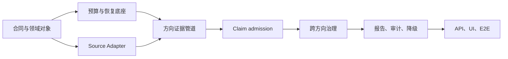

# F003 Content Research Development Plan

**状态**: Active refactor plan
**版本**: v1.0
**日期**: 2026-07-17
**适用范围**: Creator Workbench 内的 Content Research 正式调研链路
**目标完成窗口**: 4 个连续开发日（以 Codex 持续实现、现有本地依赖可用为前提）

关联文档：

- [PRD](./F003_content_research_prd.md)
- [Architecture](./F003_content_research_architecture.md)
- [Schema and domain objects](./F003_content_research_schema_domain_objects.md)
- [Evidence admission design](./F003_evidence_admission_design.md)

---

## 1. 计划决定

本计划以完整交付、价值与结果为导向，不按 MVP 切分，也不为尚未上线的旧实现保留兼容成本。当前 `EvidenceBundle` 主导的链路不满足新 contract 时，应直接替换正式调研路径；旧对象最多作为历史证据展示对象，不能再承担 claim 准入、跨方向推导或正式报告生成职责。

**重构删除原则**：发现仍按旧规格运行的正式代码、存储路径、API payload、fixture 或测试时，不编写兼容 adapter、双写、回填转换或新旧路径 fallback。先确认最新合同已覆盖其用户可见职责，再删除旧实现及仅服务于它的测试，并以最新合同对象重建所需能力；历史展示数据如需保留，必须与正式 admission/aggregate/report 链路隔离。

最终用户结果必须是：

```text
确认研究范围
  -> 收集可审计证据
  -> 仅生成规则准入的方向结论
  -> 形成可追溯的跨方向综合结论
  -> 发布完整或部分已验证报告
  -> 任意可恢复失败均从 checkpoint 继续，且不重复执行已完成外部采集
```

本计划中的阶段是不可逆依赖的交付切片，而不是可上线的临时版本。后一阶段不得以绕过前一阶段合同的方式提前实现。



---

## 2. 当前基线与切换范围

### 2.1 已确认的现实约束

1. 当前正式代码仍以 `collect() -> EvidenceBundle -> synthesize_snapshot()` 为主要推导路径；`DirectionalResearchAgent._create_bundle()`、`FactExtractor` 与 `DecisionPolicyService` 的 bundle 级判断不能继续作为新路径基础。
2. Content Research SQLite 当前是 bootstrap 式 `CREATE TABLE IF NOT EXISTS`，尚未具备版本化 migration 机制。
3. `XiaohongshuSourceAdapter` 目前只正式支持搜索卡；底层 spider 虽包含笔记详情、评论能力，但 `XHSSpiderClient` 尚未提供稳定 facade。搜索卡不得被误当作详情或评论证据。
4. 现有多数 E2E 会注入 fake source 或直接写入 `EvidenceBundle`。这些测试可作为入口/UI 回归参考，不能证明新正式证据链的正确性。

### 2.2 明确替换与删除

- 删除 `_create_bundle()` 的“一个 finding 等于一个 bundle 结论”正式路径。
- 删除 `synthesize_snapshot()` 从 bundle 直接生成正式报告的正式路径。
- 不再使用标题、搜索卡摘要、孤立指标或 `title + metric` 作为方向结论的充分证据。
- 不再从 Observation/Trace 推断恢复位置；`StageCheckpoint` 是唯一恢复事实源。
- 不为未上线的旧表、旧 API payload 或旧 fixture 编写兼容转换。测试也必须改为生成新合同对象。

### 2.3 完成定义
ß
F003 只有在以下条件同时满足时才算完成：

1. 七个方向都通过同一条 contract-driven pipeline 运行。
2. 所有用户可见实质结论均能回溯到 admitted `ClaimCandidate` 或 admitted `AggregateClaim`。
3. 收集、预算、恢复、方向准入、综合、报告和 UI 都以新对象为唯一事实来源。
4. 默认 CI、回放验收、真实依赖 canary 三层验证均有明确、可审计的证据；“外部服务曾被调用”不算验收通过。

---

## 3. 四日交付节奏

该估算按 Codex 连续开发和验证计算。任何需要新 XHS 权限、Cookie、服务端 API 修复或人工确认的外部状态，不计入纯实现时间；它们以结构化 `unavailable` 或 canary 告警交付，不允许阻塞或伪造成功。

| 日程 | 主交付 | 当日不可跳过的验收 gate |
| --- | --- | --- |
| Day 1 | 新领域合同、migration、policy snapshot、checkpoint/实际用量账本；旧正式主路径切断 | 从空数据库创建 run；并发账本不重复计费；在 collect 与 packet 中断后重启不重复采集 |
| Day 2 | 三类 Source Adapter 操作、XHS detail/comment facade、canonical registry、方向 packet 和确定性采样 | 搜索/详情/评论证据类型可区分；缺字段与能力缺失可见；同输入重放 fingerprint 不变 |
| Day 3 | Foundation 收口、七方向 admission（先五个笔记方向，再两个评论方向）、弱信号、跨方向治理 | Foundation 的 run 隔离与 packet-only gate 通过；七方向的 accepted/rejected/insufficient 对抗矩阵通过；重叠不重复计数，矛盾不被吞掉 |
| Day 4 | 报告审计、降级发布、API/UI 切换、浏览器 E2E、回放与真实 canary | 篡改报告被阻止；成本/调用量可见、暂停恢复可由 UI 操作；全量默认 E2E 和受保护 canary 均留存产物 |

每天结束时必须完成数据库 migration 升级、默认测试、阶段 E2E 和失败路径 E2E。若某项未通过，不进入下一日功能开发；应先修复合同或减少同日的非关键整饰，不得以 bypass 跳过 gate。

---

## 4. 实施阶段、产物与验收

### 4.1 阶段 A：合同、领域骨架与可迁移持久化（Day 1 上午）

**目标**：让后续所有模块共享不含混的事实、判断、结论和恢复语义。

**实现内容**：

- 实现并持久化 `RunPolicySnapshot`、`DirectionContract`、`SamplePolicy`。
- 实现 `CanonicalSource`、`DirectionSourceProjection`、`DirectionalEvidencePacket`。
- 实现 `ClaimCandidate`、`ClaimAdmissionDecision`、`DirectionResultDecision`、`WeakSignal`。
- 实现 `StageCheckpoint`、`BudgetLedgerEntry`、`OverlapRecord`、`ContradictionRecord`、`AggregateClaim` 与报告审计对象。
- 用有序、幂等、记录版本的 SQLite migrations 替代仅 bootstrap 建表；新建环境直接创建新 schema。
- 更新 Store protocol、transport schema、fixture builder 与 API contract。

**E2E 验收**：

1. 浏览器/API 创建并确认 brief 后，读取到被冻结的 policy、`run_as_of_at`、七个 direction contract 和 sample policy。
2. 重启应用后，同一 run 的 snapshot 字节语义不变；新 policy 不影响既有 run。
3. 尝试让一个对象同时充当 raw source、claim 和 final report 时，schema/store 明确拒绝。
4. 新数据库与从当前开发库升级的数据库均能启动；不导入或转换旧未上线业务数据。

### 4.2 阶段 B：预算、checkpoint 与恢复（Day 1 下午）

**目标**：正式调研的 LLM 花费和外部调用可见、可暂停、可恢复；失败恢复不重放已完成或有风险的采集。

**实现内容**：

- 冻结 `llm_cost_policy`：仅定义货币、提示阈值和最大报告重写次数；不设置阻断式预算阀门、预留或 source API 硬次数预算。每次 LLM 调用完成后按 provider 返回的实际 usage 写入 append-only cost ledger；未获得 usage 的异常记录 `cost_unknown`，不得猜测成本。
- 固定阶段序列：`collect -> packet -> facts -> admission -> reconcile -> aggregate -> compose -> faithfulness`。
- checkpoint 的 `input_fingerprint` 为 canonical JSON 的 SHA-256，输入仅包含 snapshot/contract 版本、规范化阶段输入和上游 output refs/hashes；记录 `output_refs[]`、failure、usage event IDs 和 retry count。checkpoint 是唯一恢复事实来源。
- Observation 仍为 append-only 诊断事件，但不承担恢复判断；Trace 展示 source API 调用次数/成功失败、LLM token 与实际 cost。Trace 的“停止”复用创作台 `pause_run`，在安全阶段边界暂停；“恢复”复用 `resume_run`。`end_content_research` 仍是终止性 cancel/cleanup，不可恢复。
- **共享 Provider Operation Runtime（正式交付合同）**：外部调用的运行事实在写时持久化，Trace 只读投影，不允许由 Observation、日志或 checkpoint 状态在读时猜测历史。每个 search/detail/comment 调用都有 `ProviderOperationOutcome` 语义（可由增强后的 operation checkpoint 实现）：稳定 fingerprint、run/task/provider/operation identity、脱敏请求摘要、开始/结束时间、唯一终态、failure code/脱敏 reason、retryability、retry count、recovery action 与关联 checkpoint。状态机固定为 `planned -> started -> succeeded|failed|timed_out|auth_required|rate_limited|cancelled|outcome_unknown`；超过 lease 的 `started` 只能转 `outcome_unknown`，未确认幂等性前不得自动重放。
- 不做后台自动重试；用户主动恢复触发 retry，每阶段最多两次。timeout/5xx/暂时 provider error 可恢复；auth/cookie、输入合同错误和用户取消不可恢复。

**E2E 验收**：

- 并发方向完成 LLM 调用后，cost ledger 的每个 idempotency key 只记录一次实际 usage；Trace 的累计 token/cost 与 usage events 一致。
- 在八个阶段各注入一次进程中断；恢复后从正确 checkpoint 继续，collect invocation count 不增加。
- admission/reconcile/report 任意重试均不产生第二次 adapter 调用。
- LLM 调用失败或用户暂停后，已获得的证据/阶段产物保留；恢复或后续 partial/evidence-only 发布不得重复已完成阶段。

### 4.3 阶段 C：真实 Source Adapter 与证据投影（Day 2 上午）

**目标**：来源能力与方向证据需求一致，绝不将 search card 升格为详情证据。

**实现内容**：

- 将 adapter contract 拆为 `discover_candidates`、`collect_note_detail`、`collect_comments`。
- 为 `XHSSpiderClient` 正式封装底层笔记详情和评论 API；adapter 只通过此 facade 调用。
- 发布 provider capability matrix：操作、source kind、字段、失败原因和限制。
- 标准化 `source_published_at`、`source_collected_at`、`run_as_of_at`、field availability、retrieval context 与 payload hash。
- 建立全局 `CanonicalSourceRegistry`，同时保留方向独立的 `DirectionSourceProjection`。

**已确认的实现规格**：

- 三类操作使用独立的强类型 request/result，而不是复用泛化 `collect()`：
  - `discover_candidates` 请求 `run_id`、query、sort、candidate limit 和 page/cursor；结果返回候选卡、query/rank、分页完成状态和 next cursor。
  - `collect_note_detail` 请求 `run_id`、稳定 note ID、可访问 URL/token 和合同所需字段；结果返回一个 `note_detail` 及每个字段的 availability。
  - `collect_comments` 请求 `run_id`、parent note ID、URL/token、排序、评论上限、reply-depth policy 和 cursor；结果返回 comment、comment ID、parent note ID、分页/截断完整性和 next cursor。
- 分页只为达到合同上限而进行：搜索候选超过单页时翻页；评论超过单页时按 cursor 翻页；详情单笔获取不分页。达到 `candidate_limit` 或 `comments_per_note_cap` 即停止；未取完必须记录 `truncated_by_cap`，不得表述为全部评论。
- canonical identity 按平台对象而不是 evidence kind 建立：同一 note 的搜索卡与详情共享一个 note canonical source；每条 comment 以 comment ID 形成独立 canonical source，并保存 `parent_note_canonical_source_id`。并发解析采用数据库唯一约束和原子 upsert；同一方向的重放不重复创建 projection/packet，内容确有变化时新增 packet version，旧 packet 不覆盖。
- `collect` 在外部调用前记录稳定 operation fingerprint 与 `running` checkpoint；响应/最小产物持久化后才完成 checkpoint。恢复必须明确处理“调用已发生、完成记录未写入”的 in-flight 状态，不能静默重复采集。`unsupported` 不重试；`auth_required` 在凭据更新前不重试；暂时错误按用户恢复策略重试。
- adapter 的 typed failure code 与安全脱敏 reason 必须进入 Provider Operation Runtime，并由 collect-page/detail/comment checkpoint 引用；不得把 timeout、auth、rate limit、provider 5xx、parser failure 或空结果压缩成同一个 `failed/unavailable`。正式 Trace 以此投影最后失败操作、已完成阶段、重试和唯一恢复动作；报告 read model 不读取内部诊断。
- capability matrix 随 run 冻结为紧凑的 capability snapshot：adapter version、三个操作的 supported/unavailable/unsupported 状态、可取字段、限制、认证前提及 failure/retryability mapping。它是 `RunPolicySnapshot` 的一部分，正式执行启动、每阶段 fingerprint 计算和恢复时均按 `workflow_run_id` 读取；不保存完整 provider 文档，也不在运行中临时改变语义。
- 时间与哈希分层：`raw_payload_hash` 只哈希 canonical raw payload，绝不包含采集时间；`source_published_at`、`source_collected_at` 与动态 metrics 的观测时间分别保存；`field_projection_hash` 哈希合同字段、availability、identity 和必要 retrieval context。发布时间晚于 `run_as_of_at` 的对象排除正式样本并记录原因；无法解析的发布时间标为 `missing`，不得猜测。
- 本地 SQLite 是 P0 默认持久化实现（可替换为同一 store contract 的云端实现），不是常驻 RAM。永久保存 snapshot/checkpoint、identity/lineage、选择理由、被选中对象的合同字段与 quote、facts/decisions；未选中候选只保存 selection manifest（ID、rank、query、排除理由、hash）；完整 raw response、未选中全文和冗长 trace 默认不永久保存，仅用于受控回放或短期故障排查并按 TTL 清理。所有读取按 run/direction/packet 分页，禁止为报告全量载入 evidence。

**E2E 验收**：

- 同一个 note 的搜索卡、详情、评论形成三个不同 source kind；评论携带 parent note lineage。
- detail/comment 缺字段、权限失效、空结果、解析异常和 `unsupported/unavailable` 可区分，并在 API/UI 中保留原因。
- 三类调用都必须有 checkpoint、operation 级 trace 与既定的专家/候选/详情/评论/分页限制；Day1 不以 source API 次数预算拦截调用，用户可依据 Trace 的调用量、LLM token/cost 停止或恢复任务。
- 对 timeout、auth、rate-limit、parser failure 和调用后进程中断分别验证：持久化 outcome 有唯一 terminal state；Trace 能解释根因并给出安全恢复动作；恢复不重放成功操作，也不对 `outcome_unknown` 盲目重试。
- 验证同一 note 的 search/detail 解析为同一 canonical source、comment 为独立 source 且具有 parent lineage；两个方向并发解析同一 note 仅产生一条 canonical source。
- 验证搜索或评论的分页部分成功保留已有项目、cursor 与 completeness；字段 `missing`、`not_requested`、`unavailable`、`not_applicable` 不互相混淆。
- 验证调用后持久化前中断时恢复遵循 in-flight 规则；相同回放输入的 selection manifest、payload/projection hash 和 packet fingerprint 不变。

### 4.4 阶段 D：统一方向证据执行管道（Day 2 下午）

**目标**：七方向不再复制采样、事实和状态逻辑。

```text
locked query plan
  -> candidate pool
  -> deterministic direction-local selection
  -> detail/comment collection
  -> directional packet
  -> fact extraction
  -> ClaimCandidate
  -> admission
  -> DirectionResultDecision
```

**实现内容**：

- 持久化 QueryGroup、query plan hash、候选和选择理由、author/sample cap、排除原因。
- selection 为确定性规则，不允许 LLM 在运行中随意变更样本。
- 方向内以 canonical identity 去重；跨方向允许引用同一 source，但不把它重复算作独立佐证。
- 新 `DirectionalExecutionPipeline` 替换旧 `DirectionalResearchAgent` 正式执行职责。

**未完成 TODO（仅在真实代码功能与对应验收均满足后勾选）**：

- [ ] direction contract 要求评论时，正式 pipeline 必须在候选/详情阶段后调用 `collect_comments`，持久化评论 packet 的 parent note、采样/分页/截断与去重计数；不得以笔记详情代替评论证据。
- [ ] 以 DirectionContract/SamplePolicy 的 `minimum_samples`、`minimum_independent_authors`、`author_cap`、blocking field 与时间窗共同作为每方向的停止检索条件；达到全部条件即停止翻页、补位和后续详情/评论采集，不新增任意 sample cap。
- [ ] detail 后出现 blocking field 缺失、时间窗不合格或其他 eligibility 失败时，必须在 detail fetch cap 内按冻结排序补位，并追加不可覆盖的 selection revision；需要中断恢复与 API 证据。
- [ ] 至少两个方向共享同一 canonical source 的真实 API/E2E 场景必须证明：每个方向保留独立 projection/selection，而所有方向 read model 的 `independent_source_count` 均为运行级 canonical union；后续 Day 3 只消费 directional packet，不能重新落回 bundle/snapshot 路径。

**已确认的实现规格**：

- locked query plan 用确定性模板从确认的研究主体、方向问题、竞品和用户补充词编译为 `QueryGroup`；冻结后不得由 LLM 在运行中新增、删除或改写 query。每个 group 持久化规范化 query、方向、sort、时间窗、上限与 query plan hash。
- selection checkpoint 只保存可恢复的最小摘要：snapshot/contract version、query plan hash、candidate manifest hash、selection policy hash、`run_as_of_at` 和上游 refs。candidate manifest 保存 canonical ID、命中 query/rank、稳定作者 ID、发布时间及选择/排除理由；不保存候选全文或完整 raw response。
- selection 排序必须是全序：先按冻结的 query priority 和确定性 relevance rule，再按 `source_published_at`，最后按 `canonical_source_id`；缺失值也使用固定 fallback。不得依赖 provider 返回顺序、数据库插入顺序或当前时间。
- author cap 高于 query coverage：若为满足某个 query 的覆盖而必须突破 author cap，则保留 coverage gap，写入 `query_coverage_unmet` 与 `author_cap_reached`，方向后续以 `incomplete/insufficient_evidence` 处理，不伪造跨作者覆盖。
- 每个方向的检索停止条件由其 `DirectionContract/SamplePolicy` 决定：达到 `minimum_samples`、`minimum_independent_authors`，且未违反 `author_cap`、blocking field 和时间窗条件后即停止；不另设任意 sample cap。
- 同一 canonical note 在多页或多个 query 命中时，候选池只保留一条 direction-local identity，但保留全部 query/rank 命中。搜索卡可判定的时间窗不合格项在 selection 前排除；仅详情可判定的时间窗不合格项在 detail 后写 `out_of_time_window` 并按冻结排序补位。
- 确认 Brief 时必须为每个已请求方向把 `subject_anchors`、`category_anchors`、受控 `allowed_synonyms`、`matching_mode=normalized_substring_any_anchor_v1`、claim-type 可引用字段和全部 `query_group_ids` 同时冻结到 `RunPolicySnapshot` 与对应 `DirectionContract`；两份 payload 必须完全一致。这里的 anchor 来自确认主体和受控品类词表，不得把包含方向问题的完整 query 当作字面匹配词。
- detail/comment blocking field 不可用时不得把搜索卡降级为正式 evidence。真实 run 记录 capability limitation 并以 `incomplete/insufficient_evidence` 结束；Day 2 的确定性验收可使用已审查 replay detail/comment fixture。详情缺 blocking field、时间窗不合格或其他 eligibility 失败时，允许在 detail fetch cap 内按冻结候选排序补位；每次补位追加 selection revision，原 selection manifest 不覆盖。
- 评论 packet 必须记录 parent note、实际/目标评论数、cursor、排序、top-level/reply-depth policy、截断原因、去重后 comment/author 数；部分集只能表述为按策略采样，不能表述为全部评论。
- 每方向分别报告 `selected_source_count`（被选中并尝试采集）、`eligible_source_count`（通过字段/时间/作者规则）和 `independent_source_count`（跨方向汇总后去除同一底层 source 的独立数）。
- 中断恢复至少覆盖 candidate pool 已落盘、selection 已落盘、部分 detail 已落盘、packet 已落盘四个边界；恢复只复用已有产物，不重复 adapter 调用。packet 不可覆盖：同一 source 后续采集到不同内容或 metrics 时创建新 packet version，并显式记录方向当前使用的版本。
- Day 2 下午交付的是可查询 read model/API：按方向分页展开候选、选择、排除、字段状态与 packet，默认摘要、按 packet ID 展开最小字段/quote，不返回完整 raw response 或访问 token。Day 4 UI 直接消费该 read model，不在 UI 层重算采样或字段状态。

**E2E 验收**：

- 同一 Snapshot、同一回放 payload 得到相同 selection、packet 和 fingerprint。
- 打乱候选返回顺序不会改变 selection 或独立来源计数。
- API 能展开每方向的候选、选择、排除、字段状态与 packet；不允许只展示摘要而隐藏缺口。
- 同分候选、缺失发布时间、重复 query 命中、作者 cap 与 query coverage 冲突、详情后时间窗排除以及详情 capability 缺口，均得到确定性 selection manifest 和结构化 `incomplete/insufficient_evidence` 结果。
- 在 candidate、selection、detail、packet 四个中断边界恢复后不增加对应 adapter 调用；同一 canonical source 内容变化时创建新 packet version，历史 packet 和引用保持不变。

### 4.5 阶段 E：七方向 Claim Admission（Day 3）

**目标**：每个用户可见方向结论都受 direction contract、字段规则和样本门槛限制。

#### Day 3 Foundation gate（必须先完成）

Day 3 不得直接在旧 `EvidenceBundle` 路径上叠加 evaluator。以下 checklist 是单一 Foundation 任务的有序子项；每一项完成后，必须勾选本项，并在 §9 执行记录更新测试证据、未完成项和 carry-forward target。后续子项不得绕过此前合同。

- [x] **F003-D3-FDN-1：统一 admission 合同与 capability preflight**（2026-07-19）：已冻结唯一的 claim evidence state / direction result state / reason code 映射；七方向 blocking、warning、comment 字段已写入 executable contract，并在创建 run 时将 adapter capability 与 preflight 结果冻结进 `RunPolicySnapshot.validation_result`。旧 `DecisionCard` 枚举不作为 admission state。验证：contract、adapter、snapshot API、pipeline integration 共 22 项相关测试，Ruff 与 `git diff --check` 通过。
- [x] **F003-D3-FDN-2：run-scoped packet-only reader 与旧路径删除**（2026-07-19）：新增 immutable migration `0007`，packet/projection/checkpoint 均持久化 `workflow_run_id` 并按 run + direction 查询；pipeline ID 与 replay 也纳入 run。方向 API 只经 `PacketEvidenceReader` 读取，旧 runtime checkpoint 双写路径已删除。`EvidenceBundle` 不再参与结果生成：结果在 admission 完成前明确为 `evidence_only`、零 claim/finding。验证：双 run packet 隔离、router/pipeline replay、方向 API、旧 bundle 不可晋升结果、migration 以及 contract/snapshot 定向集共 35 项通过；Ruff 与 `git diff --check` 通过。
- [x] **F003-D3-FDN-3：Fact / ClaimCandidate 可复算模型**（2026-07-19）：migration `0008` 为 candidate 增加 run/intent/type/request-state 可查询身份；packet-only Fact extractor 与 candidate factory 持久化 scope、refs、quote/span/hash/URL、metrics/limitations。store 保存前确定性校验 packet 的 run/direction、quote/span/hash/URL 和评论 parent lineage；不读取 bundle 或 LLM。验证：Fact/candidate unit 与 contract-store integration 共 10 项、Ruff、`git diff --check` 通过。
- [x] **F003-D3-FDN-4：确定性 admission 与恢复 identity**（2026-07-19）：新增 packet-only `ClaimAdmissionEvaluator`；fingerprint 冻结 candidate、packet hash、policy hash、contract version 与算法版本。输出 admitted/downgraded/rejected、唯一 evidence state、重算样本/作者/缺字段指标、reason codes、disclosure/recovery action，并保存为 immutable admission decision payload；未使用 LLM/bundle。验证：admission、Fact/candidate 与 contract-store 12 项通过，Ruff、`git diff --check` 通过。
- [x] **F003-D3-FDN-5：WeakSignal / DirectionResult / API 与 checkpoint**（2026-07-19）：正式 direction pipeline 已串接 packet→Fact/Candidate→admission→WeakSignal/DirectionResult，写入 `facts`、`admission` checkpoint；重放命中 admission checkpoint，不重复收集且不新增 decision checkpoint。DirectionResult 仅含 admitted claim ID，非 admitted decision 转为弱信号；方向证据 API 按 candidate→decision→snapshot 关系隔离展示 governed state。验证：pipeline/router replay、admission/result unit、方向 API 共 19 项通过，Ruff、`git diff --check` 通过。

**Foundation 对抗验收**：跨 run 同方向 packet 不可见；搜索卡或缺 blocking field 不可成为正式 claim；引用的 quote/span/hash/source URL 任一不匹配即拒绝；同一 packet/policy 重放只得到同一 decision，任一 policy/packet version 改变只重算下游；旧 bundle/snapshot 被作为 admission 输入时测试必须失败。

**实现顺序**：

Foundation 全部勾选后，按以下 checklist 串行实现并逐项更新 §9；不得把后一个方向的特殊规则预先混入前一个方向。

- [x] **F003-D3-AR：Admission strategy registry 架构收口**（2026-07-19，C1 前置）：以一个 direction-id → strategy 的注册表收口全部既有方向的 candidate 构造与 evidence-boundary 校验；pipeline 与 evaluator 只能通过 registry 分派，不得继续新增 `if/elif direction_id`。strategy 对外统一暴露“由 packet 生成 candidates”和“对 candidate 返回稳定 boundary reason”两项能力；产品、内容表现、竞品、品牌活动、关键词和 UGC 的具体取证规则继续保留在方向专用模块，不引入继承模板或可执行规则 DSL。所有既有行为、reason code、candidate identity、packet-only/replay 语义保持；未知/尚未实现方向仍走 Foundation generic fallback，不能被注册表静默吞掉。验证：registry unit、既有方向 admission/pipeline integration 共 67 项通过，Ruff、`git diff --check` 通过。C1 必须直接通过 registry 接入，不再添加新的中心分派分支。
- [x] **F003-D3-AR-2：专家自持 `AdmissionStrategy`**（2026-07-19，C1 前置）：将 AR 的函数装配收口为统一 `AdmissionStrategy` 基类；六个专家模块分别定义其唯一 strategy 实例，并在类内实现 `build_candidates(packet)` 与 `boundary_reason(candidate)`。registry 只导入/注册 strategy 实例，不再导入专家的独立 factory/validator 函数；原有函数保留为专家模块的实现/测试入口，但 pipeline/evaluator 只认识基类接口。未采用 import-time 自注册或可变全局注册。验证：六方向 strategy 委托、registry 注册/重复/键不匹配/未注册、pipeline/evaluator 回归共 67 项通过，Ruff、`git diff --check` 通过。
- [x] **F003-D3-N1：`product_marketing`**（2026-07-19）：正式 pipeline 已改用方向专用的 note-only candidate factory，不再采用 Foundation 的“首个通用 fact”回退。仅正文可支撑产品价值/使用语境/受众框架，标题或正文可支撑内容角度；metrics、tags、comments、错误字段、偏好/转化/因果/效果性表述均被拒绝并保留 admission 审计。验证：N1 unit、Foundation evaluator、方向 pipeline integration 共 27 项通过；Ruff 与 `git diff --check` 通过。
- [x] **F003-D3-N2：`content_performance`**（2026-07-19）：正式 pipeline 已接入方向专用 factory。候选只能是带正文/标题直接引文的 `observed_high_engagement_sample` 或 `visible_content_format`，并将 metrics/`metrics_observed_at` 作为样本上下文；metrics、tags、comments、media 猜测及表现更好/点击/转化/因果/效果性表述均被拒绝，不能进入 admitted result。验证：N2 unit、N1/Foundation evaluator、方向 pipeline integration 共 40 项通过；Ruff 与 `git diff --check` 通过。
- [x] **F003-D3-N3：`competitor_discovery`**（2026-07-19）：正式 pipeline 已接入方向专用 factory，并将 `competitor_names` 作为最小候选名称字段保留在 packet。名称必须逐字命中 title/body/tags 引文，且正文、作者、metrics/`metrics_observed_at` 同时存在；作者、canonical ID 与互动仅是样本上下文。metrics/作者/ID 单独不能生成 claim，官方身份、市场领导/市占及竞争表现表述均被拒绝；相同 author/canonical 的选择不会增加独立佐证。验证：N3、N1/N2/Foundation evaluator、方向 pipeline integration 共 52 项通过；Ruff 与 `git diff --check` 通过。
- [x] **F003-D3-N4：`brand_activity`**（2026-07-19）：正式 pipeline 已接入方向专用 factory，并保留 `activity_signals` 作为冻结候选类型输入。campaign/launch/collaboration/dissemination signal 必须有 title/body/tags 直接引文、`source_published_at` 与互动快照；类型输入、metrics 或评论不能单独成为活动事实。超 `run_as_of_at` 的 future note 由 selection 排除，缺发布时间/其他 blocking field 不能 admitted 且保留降级/补采语义；触达、销量、成功、增长与因果表述被拒绝。验证：N4、N1-N3/Foundation evaluator、方向 pipeline integration 共 64 项通过；Ruff 与 `git diff --check` 通过。
- [x] **F003-D3-N5：`keyword_growth`**（2026-07-19）：正式 pipeline 已接入方向专用 factory。当前关键词模式必须由 title/body/tags 的 literal quote 支撑；`keyword_growth_with_comparable_baseline` 仅在冻结 `reference_window` 同时具备非重叠、可比性、正分母/关键词计数和 bias disclosure 时生成。参考窗不足时仅保留当期模式，不产生 growth claim（`reference_window_insufficient`）；metrics 不支持增长结论。验证：N5 unit、方向 pipeline baseline-insufficient replay、相关 admission 回归共 31 项通过；Ruff 与 `git diff --check` 通过。
- [x] **F003-D3-C1：`ugc_community`**（2026-07-19）：UGC strategy 仅从 comment packet 建立候选，并要求 parent-note lineage、`reply_depth`、排序、cap、完整性及最终去重集合元数据。评论持久化先完成去重与作者统计，再将同一份最终 collection 元数据写入每条 packet；admission 自动从 comment packet 重算样本/作者数，并按 comment blocking fields 校验，不再以笔记字段/笔记数充数。30 条/5 作者可 admitted；29 条、4 作者或缺回复关系不生成正式 candidate，仅保留 insufficient/lead；replay 不重复采集或写 admission checkpoint。验证：UGC unit、contract/evaluator/registry、方向 pipeline integration 共 37 项通过，Ruff、`git diff --check` 通过。
- [x] **F003-D3-C2：`comment_insight`**（2026-07-19）：闭合了此前错误标记为 CLEAN 的验收缺口。30 条/5 作者的完整评论集合可使 direct question、objection/failure 与 repeated need language（额外要求 3 条/2 作者）均产生 admitted decision 和 `formal_directional_result`；replay 不重复 collect、decision、result 或 admission checkpoint。29 条、4 作者、缺 reply relation 与 `completeness != complete` 皆不生成正式 candidate/decision，并留下 `insufficient_evidence` result。修复：`partial` collection 不再因非空字符串被误判完整。验证：13 项 C2 unit/pipeline integration 定向集、Ruff、`git diff --check` 通过。
- [x] **F003-D3-X：跨方向治理**（CLEAN，2026-07-19）：CL-07～10 已完成。正式 workflow 只以 admitted claim 执行 run-scoped reconciliation/aggregate，冻结 quote-backed governance key，提供 run+plan scoped read model/API，并由公开 API 的七方向 formal-workflow E2E 验证 packet-only admission、governance、governed snapshot、脱敏 trace 与成功后 replay no-op。完整 Content Research regression：235 passed；Ruff、`git diff --check` 通过。

**共同实现内容**：

- 确定性 `ClaimAdmissionEvaluator`，明确 blocking/warning field、样本量、独立作者、可推导范围及禁止推导。
- 正式主体相关性采用双层 admission gate：source packet 必须保存命中冻结 `QueryGroup` 的谱系，但该谱系只是必要条件；candidate 的直接 quote 还必须按冻结 matching mode 命中该方向的 subject/category anchor 或受控同义词，并来自该 claim type 允许的字段。任一条件不满足即以稳定 reason code `query_subject_not_supported` rejected，互动指标不能覆盖该拒绝。`product_marketing.message_angle` 继续允许 title 或正文直接支撑，但 quote 本身仍须命中 anchor。
- 仅在合同定义的灰区使用 LLM；其输入、输出、版本、证据引用和理由均写入 Evidence Layer。
- 被拒绝但有价值的材料进入 `WeakSignalPool`，不可静默丢弃。
- `DirectionResultDecision` 只消费 admitted claim 与明确标识的 weak signal。

**评论额外要求**：

- comment text、parent note lineage、回复关系、排序、采样 cap 与完整性必须存在。
- 30 条合格评论、至少 5 位作者和第一人称动机/收益边界按 contract 重算；不达标只能产生 lead 或 insufficient。

**E2E 验收**：

- 每个方向都有 `formal`、`repeated`、`case`、`provisional`、`insufficient` fixture；每条正式 claim 可重算引用数、独立作者数、字段资格与范围。
- 标题加互动指标推断偏好、同一作者重复计数、没有 parent note 的评论结论、双窗口不足仍声称 keyword growth 等对抗样本全部被拒绝。
- 七方向都通过正式 adapter capability 产生字段，不得使用专为测试写入的 bundle/finding 特例。

### 4.6 阶段 F：跨方向治理与 AggregateClaim（Day 3 下午）

**目标**：综合结论增加价值但不突破方向证据边界。

**实现内容**：

- `CrossDirectionReconciler` 只读取 admitted claims，生成 overlap 和 contradiction records。
- `AggregateClaimBuilder/Evaluator` 只生成 `cross_direction_corroboration`、`cross_direction_tension`、`action_hypothesis` 三种结论。
- evaluator 校验输入准入状态、范围兼容性、限制继承、同 source 去重和因果边界。

**E2E 验收**：

- 同一 source 在两个方向出现时不提高独立证据数。
- 冲突证据可见且可展开，摘要不得吞掉冲突。
- 每个 aggregate 可回溯到 claim IDs、source IDs、推导方法和继承限制；共同出现不能升级为因果。

### 4.7 阶段 G：报告、审计与降级发布（Day 4 上午）

**目标**：报告只表达已成立内容；审计失败也不丢失研究成果。

**实现内容**：

- `ResearchReportComposer` 编排方向结果、AggregateClaim、WeakSignal、限制、缺口和补采建议。
- `ReportFaithfulnessEvaluator` 提供两层审计：确定性校验 claim ID、quote、数值、状态与范围；有界 LLM 校验措辞、因果和跨方向推导。
- 最多 N 次定向重写，发布类型为 `complete_verified_report`、`partial_verified_report`、`evidence_only_report`。
- 未通过审计的自由文本只能作为 audit artifact，绝不混入正式报告。

**E2E 验收**：

- 直接篡改数字、引文、状态、范围或因果措辞，报告审计必须失败并阻止完整发布。
- 修复文本后可完成发布；无法修复时仍显示所有已验证方向与证据卡，并发布部分/仅证据报告。

### 4.8 阶段 H：产品面、全链路回归和上线准备（Day 4 下午）

**目标**：新能力真实可操作、可观察、可恢复。

**实现内容**：

- API 暴露 direction states、claim cards、weak signals、aggregate claims、contradictions、report audit、checkpoint、budget 和 recovery actions。
- UI 展示完整/部分报告、方向章节、展开证据、弱信号、预算、审计和恢复状态。
- Trace 改为直接呈现 checkpoint 与 ledger，而不是由 Observation 猜测阶段。
- 删除旧正式 API/Service 路径及相应 fixture；保留的旧测试必须改为验证新用户入口，而非写入 bundle。

**E2E 验收**：

- Playwright 从确认研究范围开始，到查看方向证据、处理失败、恢复、查看报告完成全流程；不得通过直接写 SQLite 预置最终结果。
- 覆盖七方向成功、cookie/auth 失败、detail/comment 缺字段、预算耗尽、阶段恢复、跨方向重叠/矛盾、AggregateClaim、报告审计重试与降级。

#### Day 4 执行 checklist（报告、审计、产品面与上线 gate）

**规格确认（2026-07-19）**：以下 R1～Q1 的报告对象、发布、对话呈现与旧路径删除规则已经过确认，属于正式 Day 4 开发合同；实现不得以临时前端推导、旧 bundle fallback 或未审计自由文本替代。

Day 3 已完成的唯一正式输入是 append-only、run-scoped `GovernedResearchSnapshot` 与其 governance read model。Day 4 不得回读 packet、decision、typed-record 泛型表或 `EvidenceBundle` 来拼接报告；不得为旧 `items` / bundle 前端模型保留 adapter、双写或 fallback。以下按依赖顺序执行；每项完成后勾选、更新 §9 执行记录和验证证据，未完成前不得跳到后项。

#### Lite 正式子集共享合同修订（v2，2026-07-22，待实现）

Lite 是上述正式报告链路的首个发布配置，而非平行 MVP。以下修订适用于所有消费者，并在 F003-LITE Gate 1 以 policy、Composer、FaithfulnessEvaluator、read model、迁移和 fixture 的单一原子变更交付：

- `RunPolicySnapshot` 冻结发布级 `direction_set_version` 与 `direction_ids`。首个集合为 `direction_set_v1 = [product_marketing, competitor_discovery, content_performance]`；正式版以新版本扩展，仅影响新 run。方向集合不得由前端、canary 或报告发现反推。
- 新增共享 `report_compose_mode ∈ {prose, template_only}`。`prose` 保持本节既有必需章节与 deterministic + semantic 审计；`template_only` 只渲染 `main_findings`、`limitations_scope` 与有对应对象的 `weak_signals`，内容仅为结构化 card refs、冻结 citation groups 和受限计数模板。它仍使用 `complete_verified_report`、`partial_verified_report`、`evidence_only_report` 三个正式 publication state。
- `template_only` 的 complete 只要求必需结构化章节通过 deterministic audit；semantic audit 对该模式为 `not_applicable`，必须如实记录，不能伪造通过。它不生成 `core_conclusions`、`cross_direction_tensions` 或 `next_steps`。
- 已发布报告与 workflow 恢复严格分离：仅 terminal-success workflow 可 materialize report artifact；`publication: none` 的可恢复 workflow 只通过共享 checkpoint/recovery projection 呈现为 run 卡，绝不伪造报告状态或第二个 artifact/run。
- 共享 report read model 的 citation navigation 固定为 `available`、`missing_source_url`、`navigation_unavailable`。引用始终保留 quote、`field_path`、采集时间和安全来源标识；Lite 只投影 `title`、`content_text`，但不创建 Lite-local enum。

- [x] **F003-D4-R1：报告领域对象、版本与发布合同**（CLEAN，2026-07-20）
  - 建立 `ReportDraft`、`ReportFaithfulnessDecision`、`ReportPublication` 三个 append-only 对象；每个对象绑定 `workflow_run_id`、`research_plan_id`、`governed_snapshot_id/version`、输入 fingerprint、policy/algorithm version、创建时间与前序版本 ID。
  - `ReportDraft` 固定保存 section 列表；每节至少有 `section_id`、`section_kind`、正文或结构化 card refs、`claim_candidate_ids`、`aggregate_claim_ids`、`cross_direction_record_ids`、`weak_signal_ids`、`limitation_ids`、`citation_group_ids`。正文必须能反向解析到允许的输入对象。
  - 冻结 publication 必需章节矩阵：`prose` mode 的 `complete_verified_report` 必须通过 `core_conclusions`、`main_findings`、`limitations_scope`；`template_only` mode 的矩阵以本节 v2 共享合同修订为准。存在对应对象时才可出现 `cross_direction_tensions`、`weak_signals`、`next_steps`。`partial_verified_report` 保留全部已验证结构化 cards，允许撤下失败的自由文本 section，并列出 audit/recovery 状态。`evidence_only_report` 不包含未经审计的自由叙述，只渲染 cards、限制、弱信号和 recovery actions。
  - 采用 Creator 已有 Artifact Store / Message Timeline 原则：已发布报告为 materialized `snapshot` artifact，最终只写一条 `artifact_result` assistant message；重写草稿/失败审计只能保留内部 artifact lineage，不能覆盖已发布版本。
  - **确认理由**：草稿、审计与发布拆为独立 append-only 对象，才能保留“不可信草稿为何被撤下”的审计事实，同时让用户始终读取不可覆盖的已发布版本；这与 Creator 的 Artifact version lineage 和 final materialization 合同一致。
  - **确认理由**：必需章节矩阵只要求核心结论、主要发现和范围/限制；张力、弱信号、行动建议均为有对应对象才出现的条件章节。这样“没有张力”不会阻止完整发布，而范围限制不会在完整报告中被遗漏。
  - 验收：同一 governed snapshot + policy 输入得到稳定 draft identity；snapshot/policy 改变只使 compose 后续失效；旧 artifact 可回看；无 bundle-to-report 表或 payload。

- [x] **F003-D4-R2：Packet-only `ResearchReportComposer` 与引用锚点**（CLEAN，2026-07-20）
  - 新 Composer 的唯一 interface 是冻结 governed snapshot；内部可以读取其已投影的 governance read model，但不能自行重新 admission、重新计数、重新抽取或创建 AggregateClaim。
  - 按最终报告 mock 和 evidence-admission display contract 生成固定 sections：`core_conclusions`、`main_findings`、`cross_direction_tensions`、`weak_signals`、`next_steps`、`limitations_scope`。方向卡只来自 admitted claim cards；跨方向张力只来自 `cross_direction_records`；同方向相反材料只在相关 claim limitation 中称“证据张力”。
  - “下一步建议”只可渲染显式 `request_origin=user_requested_next_steps` 的 `action_hypothesis` 或已有 recovery action；不得从共现、互动、同源 overlap 自动生成业务行动。
  - 建立持久化 citation anchor：每段/句记录 `section_id`、稳定文本 span 或 block ID、`citation_group_id`；citation group 保持 snapshot 内冻结的 display index 和安全 quote/span/hash/source URL。前端不得按数组顺序重新编号。
  - **确认理由**：正文 `[n]`、hover 与证据 drawer 必须在刷新、重放和报告版本变化后指向同一证据；持久化 anchor 让 FaithfulnessEvaluator 可以审计“这句话引用了什么”，而非信任前端临时排序。
  - **确认理由**：行动建议不是由信号共现自动推导。只有用户明确索要下一步建议时才渲染 action hypothesis；未请求时不渲染该章节，只保留证据收集/验证的 recovery action。
  - 验收：Composer 尝试使用 weak signal 作为正式结论、把同方向矛盾写成跨方向矛盾、无 provenance 的行动建议或无 citation 的材料时确定性失败；同一输入重放生成相同 section/citation IDs。

- [x] **F003-D4-R3：`ReportFaithfulnessEvaluator`、重写与三档发布**（CLEAN，2026-07-20）
  - Deterministic audit 校验每个 material conclusion 的 claim/aggregate ID、citation anchor/quote/span/hash、数值与 computed metrics、claim state、scope、required limitation、aggregate derivation 和禁止因果升级；任何不一致生成稳定 reason code 和受影响 section ID。
  - 有界 semantic audit 仅检查释义、范围扩大、未经允许的实体/比较、因果措辞及 aggregate 文案；记录 model/prompt version、输入 draft ID、结果、原因和 usage。它不能 admission、修改 count 或覆盖 deterministic failure。
  - 明确状态机：`prose` mode 的所有必需 section 的 deterministic 与 semantic audit 均通过才 `complete_verified_report`；`template_only` mode 的规则以本节 v2 共享合同修订为准。可撤下的自由文本 section 审计失败且结构化已验证成果仍可渲染时为 `partial_verified_report`；Composer/semantic audit 不可用或没有可发布自由叙述时为 `evidence_only_report`。LLM timeout、provider unavailable、格式非法、预算未知/耗尽均不得伪造 complete。
  - 每次 compose/faithfulness 写独立 checkpoint；允许至 policy `max_report_rewrites` 的定向重写。重放命中 checkpoint 不重复 LLM 调用或写第二条最终 message；重写耗尽后仅发布降级结果，失败草稿仅作为 audit artifact。
  - **确认理由**：deterministic audit 是完整发布的不可绕过门槛；semantic audit 只补充审查释义/范围/因果。semantic LLM timeout、不可用或格式非法时，不允许“只靠 deterministic 通过”发布 complete，必须降级为 partial 或 evidence-only，避免将不可验证的自由文本标为已验证。
  - **确认理由**：重写产生新 draft/audit 版本，已发布版本不可覆盖；checkpoint replay 不重复 LLM 调用或最终消息，保证审计可追溯、成本不重复且 Timeline 不出现多份同一报告。
  - 验收：篡改数字、引用、状态、范围、实体或因果措辞必阻止 complete；修复后可 complete；耗尽后保留 admitted cards/weak signals/limitations 并降级；compose 或 audit 中断恢复不重采集。

- [x] **F003-D4-R4：报告 read model、API 与 Trace/Budget 投影**（CLEAN，2026-07-20）
  - 提供唯一的已发布报告 read model/API，返回 materialized report artifact、publication/audit identity、section/citation anchor、方向 cards、weak signals、cross-direction records、aggregate、limitations/recovery；不返回 draft 原文、prompt、raw provider payload、cookie 或凭据。报告业务字段不返回 token；**唯一例外**是用户主动展开的 `trace.faithfulness.usage`，其只能返回脱敏的聚合已知 token/cost 与 `cost_unknown`。
  - `checkpoint_summary` / Trace 直接投影 collect 至 faithfulness 的状态、fingerprint、retry、阶段耗时、output refs、已知 token/cost 与 `cost_unknown`；审计面板不进入叙述性结论。
  - API 区分 workflow terminal 与 publication state；**workflow 必须先进入 terminal success，再 materialize/publish 最终 `artifact_result`**。报告可在 workflow 结束后以 `partial`/`evidence_only` 发布，不能把 `succeeded` 伪装成 complete。
  - 删除旧 results `items` / `recommendations` / evidence-bundle-to-report 正式 payload、service 入口、frontend types/view models 和仅验证旧路径的 fixture；历史 bundle 如保留，只允许独立证据查看。
  - **确认理由**：F003 最终报告必须落入 Creator 的 materialized artifact + 单条 `artifact_result` Timeline 合同，不能把完整报告塞进普通 assistant text 或让前端从多个旧 API 拼接。
  - **确认理由**：成本、调用数与审计状态只在用户主动展开 Trace 时显示；报告正文只显示研究范围、证据与限制。Trace 只投影安全聚合数据，`cost_unknown` 必须如实显示，不能估算或隐藏。
  - **确认理由**：旧 `items` / `recommendations` / bundle-to-report 路径直接删除，不做兼容转换；历史 `EvidenceBundle` 若保留，仅作为与正式报告隔离的证据查看入口。
  - 验收：run/plan/report-version 隔离、稳定分页/引用、缺 source URL 的不可跳转展示、trace 脱敏、snapshot 更新后旧报告可读且新报告不复用旧 draft。

- [ ] **F003-D4-U1：Creator Workbench 对话报告与证据交互**（IP，2026-07-21；审计重新打开，当前修复未完成验收）
  - 前端仅消费 D4-R4 read model，并将最终报告以一条 `artifact_result` assistant message 渲染到 Message Timeline；后台进度只更新 workflow 卡片，不刷屏为普通 assistant message。
  - 按 `f003-final-report-chat-mock.html` 实现对话内：核心结论、主要发现、跨方向张力、初步信号、下一步建议、研究范围与限制；`publication_state` 只作为消息旁轻量状态。
  - 实现 citation popover、证据 drawer、原笔记安全跳转/不可跳转、方向/aggregate card 展开、weak signal 原因与 recovery、审计/Trace 展开。完整、部分、仅证据三种状态均有独立可访问的空/省略 section 表现。
  - **确认理由**：最终用户结果是对话流中的正常报告消息，`publication_state` 只作消息旁轻量状态，不可替代报告正文或单独做成结果 Banner。
  - **确认理由**：`complete` 呈现完整通过审计的叙述与证据；`partial` 保留通过审计的叙述、结构化 cards 和被撤下 section 的审计说明；`evidence_only` 不展示自由叙述，只展示结构化 cards、弱信号、限制与 recovery。三种状态均必须可展开证据和范围，不能仅靠颜色区分。
  - **确认理由**：同方向相反材料只能在关联 claim 的 limitation/recovery 中显示为“证据张力”；只有 `cross_direction_records` 才能生成“跨方向张力”卡，避免 UI 误导用户其已被治理层确认。
  - 验收：浏览器刷新后从 Timeline/Artifact 恢复同一报告；citation 编号与后端一致；弱信号不显示为“主要发现”；同方向证据张力不伪装为跨方向治理记录。

- [ ] **U1 真实审计问题台账（2026-07-21，必须以本表而非旧完成叙述判断状态）**

  | 区域 | 当前实现 | Mock | 差异 | 影响/证据 | 修复进度 |
  | --- | --- | --- | --- | --- | --- |
  | URL run 恢复与线程列表 | 启动改为单条有序路径：先从 URL `contentResearchRunId` 读取 workflow 的 `brief.thread_id`，再加载列表并选中该 thread | 进入已发布报告 thread 后稳定恢复同一 Timeline artifact | 与 mock 的 Timeline 归属语义一致；不再由列表首项决定报告归属 | **已修复/P0**：真实 FastAPI + SQLite + Chromium E2E 验证 URL 直达、Timeline artifact、刷新和不调用 `/results`（2026-07-21，1 passed） | 已修复；保留后续全量视觉回归 |
  | 线程切换与 active-run scope | 新 canonical localStorage map 按 `thread_id → workflow_run_id` 保存；`resetConversation()` 仅清内存状态 | 每个对话独立保留自己的历史与研究上下文 | 不再有全局单值 run 被任一切换删除；终止/重建仅移除所属 thread entry | **已修复/P1**：真实浏览器在报告 thread ↔ 其他 thread 切换后验证报告不会串入、返回后可恢复；静态契约确认旧 key 已删除 | 已修复；后续复杂多 run 历史由 Q1 覆盖 |
  | Citation 分页与可访问性 | section 内和分页后未挂载 section 的 citation 均复用同一 trigger，统一为 `aria-label="打开引用 N"` | 所有 `[n]` 均以稳定编号、统一入口进入证据层 | 入口与冻结编号已一致；证据层位置仍与 mock drawer 不同 | **已修复/P1**：第 2 页 group 8 可打开自身 preview/evidence、关闭重开不重复；完整 Creator UI mock-browser 契约 13 passed（2026-07-21） | 已修复；正式全流程/真实分页数据的发布 gate 仍归 Q1 |
  | 右侧栏信息架构 | 已改为“研究运行 / Trace”运行摘要卡、三项阶段进度、完整 Trace action 和“本次研究摘要”卡 | 展示研究运行摘要、阶段进度列表、研究摘要卡与"查看完整 workflow trace" | 层级与 mock 对齐；仅使用现有 report/workflow projection，未新增或编造指标 | **已修复/P1**：Creator UI mock-browser 验证已发布和报告不可用状态（2 new scenarios；全套 15 passed）；真实 FastAPI + SQLite + Chromium 验证恢复报告的侧栏与 Trace action（1 passed，2026-07-21） | 已修复；Trace 详细内容/指标差异按下一行继续处理 |
  | Trace 弹窗关闭 UX | 绿色标题栏显示 subject 与 `workflow_run · <id>`，保留明确 `×`、点击遮罩和 Escape 关闭 | 绿色 sticky header、关闭按钮、遮罩点击/Escape 退出 | workflow run 身份细节已补齐；关闭模型保持一致 | **已修复/P1**：Trace/报告 mock-browser 子集 6 passed；`npm run build` 通过；真实 FastAPI + SQLite + Chromium E2E 重跑后验证 run ID 与关闭通过（2026-07-21） | 后续视觉基线归 U1 窄屏项；Q1 继续覆盖完整旅程 |
  | Trace 内容与指标 | 已从 `trace.faithfulness.usage` 显示累计 tokens、成本 known/unknown 与“LLM 调用：未公开”；checkpoint 映射为可读生命周期阶段 | workflow run、累计 tokens、LLM calls、成本、四阶段日志 | 对齐所有现有安全字段与阶段层级；公开 schema 尚无 LLM 调用数，明确显示未公开而非伪造；仅已发布报告显示审计 Trace 仍是既定 R4 合同 | **已修复/P1**：已知/未知 usage、空 checkpoint、缺时长都有 mock-browser 覆盖；构建通过；真实恢复报告 Trace 重跑通过 | 新增真实 LLM calls 前必须扩展公开 schema，禁止前端编造；Q1 覆盖完整旅程 |
  | 最终报告头部 | 已改为核心结论标题、研究范围副标题、轻量 publication state；artifact/snapshot identity 仅保留在审计数据属性 | 面向用户的结论标题、业务 subtitle、日期、方向完成数、轻量状态 | 现有 read model 未公开发布日期或权威方向总数，明确显示“发布日期未公开 / 方向覆盖未公开”，不从 ID 或当前时间推断 | **已修复/P1**：partial/evidence-only mock-browser 头部契约已纳入 6 passed 子集；构建通过；真实 FastAPI + SQLite + Chromium 恢复 Timeline artifact 头部重跑通过 | 正文结构差异按下一行继续处理 |
  | 最终报告正文结构 | 已将 core conclusion 从通用循环中分离为 lead；主要发现、跨方向张力、初步信号与行动 cards 各有独立语义/视觉边界 | 固定核心结论、主要发现、跨方向张力、初步信号、下一步建议、限制的专用视觉层级 | 避免 core conclusion 重复；weak signal 不进入主要发现；仅 `cross_direction_records` 渲染张力 | **实现/mock/构建通过，待真实 E2E 复跑/P1**：partial/evidence-only/complete mock-browser 3 passed；`npx tsc --noEmit` 与 `npm run build` 通过；构建后 E2E 被环境跳过 | 在未执行的真实 E2E 恢复后补齐浏览器证据；证据 drawer 和视觉基线仍归后续项 |
  | 引用与证据交互 | 点击 citation 后在报告底部内嵌 evidence 区展开 | 正文内 `[n]` → 按需进入右侧 evidence drawer | 证据层位置和关闭/回退模型不同 | **确认差异/P1**：当前 `Content Research citation evidence` 为内嵌 `<aside>`，mock 为 `.drawer` | 未开始；前端状态重构，继续使用冻结 `citation_groups`/`evidence_refs`，不应影响后端连接 |
  | 旧 Creator 调研 UI 残留 | `ContentResearchFlowMessages`、`failedFormalResearchTasks` 及其重试/修改/结束卡已从 `page.tsx` 删除 | 无旧结果/控制卡残留 | 旧交互实现不再保留；当前报告和 workflow 卡片仍走现行路径 | **已修复/P1**：静态 UI contract 校验旧 renderer、`runtime_child_tasks` 和旧 helper 均不存在；`pytest -q tests/acceptance/test_content_research_creator_ui_contract.py -k 'legacy_flow_message_renderer or run_restore_storage'` 2 passed（2026-07-21） | 已修复；U1 其余报告/视觉/真实浏览器验收仍 OPEN |
  | orphan run 错误呈现与生命周期 | 结束调研不再删除 Creator thread；孤儿 run 预检并显示不可重试状态 | mock 未定义该异常态，但不应伪装成采集失败 | 正常生命周期已修，历史孤儿任务仍不可恢复 | **已修复待真实历史数据回归**：生命周期单测 2 passed；孤儿 UI 契约通过 | 已修复；保留"新建有效对话重新发起"路径验证 |
  | U1 文档/验收记录 | 当前记录覆盖 Sidebar、Trace 与头部本轮构建/浏览器证据 | 真实进度必须反映当前验收 | 旧“9 passed, 1 failed”叙述已删除；本轮先出现一次真实 E2E 线程列表选择超时，独立重跑通过，已保留为 Q1 稳定性关注点 | **已更新/P2**：`npm run build` 通过；Trace/报告 mock-browser 子集 6 passed；真实 FastAPI + SQLite + Chromium E2E 重跑 1 passed（2026-07-21） | Q1 应覆盖线程列表启动竞态与完整用户旅程，避免单次重跑替代稳定性 gate |
  | 窄屏、三种发布状态与视觉基线 | 有部分 mock/契约覆盖，未完成真实浏览器视觉基线 | mock 明确包含 desktop 三栏与移动端隐藏侧栏 | 尚未证明 complete/partial/evidence-only、宽屏/窄屏均与目标信息层级一致 | **未验证/P2**：当前没有完整截图/视觉断言闭环 | 未开始；在恢复链与 renderer 修复后补截图/Playwright 验收 |
  | Hook 依赖告警 | `page.tsx` 的 `selectThread`、`task` 依赖告警仍存在 | 不适用 | 非当前 UI 断裂的直接证据，但会增加初始化/状态时序维护风险 | **已知风险/P2**：`npm run build` 通过但报告既存 React hook warnings | 未修复；与 URL/thread 状态收口时一并消除或证明安全 |

- [ ] **F003-D4-Q1：报告链路 E2E、回放与发布前 gate**
  - API E2E 必须从公开入口驱动：确认范围 → 七方向 formal research → governance → compose → faithfulness → artifact/timeline report；不得直接持久化 claim、draft、publication 或最终 message。
  - 覆盖 complete、partial、evidence-only；audit 篡改/重写/耗尽；compose/faithfulness 中断恢复；跨 run 与 snapshot version；citation stability；weak signal/contradiction/action-hypothesis 归属；auth/rate-limit/detail-comment 缺字段、budget known/unknown/exhausted。
  - Playwright 覆盖最终用户旅程、页面重载、重复点击幂等、recovery action、审计/Trace 展开；复杂组合仍以 API E2E 参数化覆盖。
  - 交付脱敏 search/detail/comment replay 样本及 hash/version、迁移新库/升级库验证、JUnit/JSON/截图/trace/checkpoint/ledger 产物；受保护真实 XHS canary 记录 capability、availability、调用量、成本与审计结果，外部不可用必须显式记录风险。
  - 只有 D4-R1～Q1 全部完成且 §8 最终发布判定无未勾选项时，F003 才可宣布正式链路完成。

---

## 5. E2E 真实性与分支覆盖策略

### 5.1 三层验证，不以单一“真实接口测试”为准

| 层级 | 运行频率 | 依赖 | 通过定义 |
| --- | --- | --- | --- |
| 确定性全栈 E2E | 每次 PR | 真 FastAPI、SQLite、runtime、浏览器；替换外部 XHS transport | 用户入口到终态、数据库和 UI 一致；所有业务状态可重复 |
| Payload 回放验收 | 每次 PR/每日 | 从真实采集脱敏、冻结的 search/detail/comment payload | schema、normalizer、字段资格、采样、准入和报告可重放 |
| 真实依赖 canary | 受保护环境定时或发布前 | 专用 cookie、低预算、独立数据库、真实 XHS | cookie 有效时必须获得满足 capability contract 的字段；失败生成告警和诊断，而不是宽松通过 |

真实 canary 不允许继续使用“`completed`、`empty`、`failed` 都算通过”的 smoke 定义。外部状态不稳定时，测试应报告 availability，而非把失败伪装成质量通过。每次 canary 归档 request fingerprint、adapter/policy 版本、字段可用性、payload hash、checkpoint、ledger 与审计结果；原始内容仅保留业务必要且已脱敏的最小数据。

### 5.2 业务状态覆盖表

以下矩阵是 PR gate。每一行至少有一个确定性 E2E，所有新分支都必须标注其对应 case ID；同一 UI 文字断言不能替代状态断言。

| 领域 | 必覆盖状态 |
| --- | --- |
| 采集 | `completed`、`empty`、`auth_required`、`rate_limited`、`transient_error`、`parser_error`、`unavailable` |
| 实际用量账本 | 并发重复写入、已知成本、`cost_unknown`、重试不重复记录同一 usage event、Trace 汇总 |
| 恢复 | collect、packet、facts、admission、reconcile、aggregate、compose、faithfulness 八处中断/恢复 |
| 方向结论 | `formal`、`repeated`、`case`、`provisional`、`insufficient` 及每方向特有 blocking field |
| 评论合同 | 评论不足、作者不足、parent note 缺失、分页不完整、达到门槛 |
| 跨方向 | 独立 corroboration、同 source 重叠、contradiction、范围不兼容、禁止因果升级 |
| 报告 | 完整发布、部分发布、仅证据发布、重写成功、重写耗尽/审计失败 |
| 产品恢复 | 页面重载、重复点击幂等、恢复 action、用户可见限制和补采建议 |

### 5.3 必须持续执行的性质测试

除示例型 E2E 外，以下性质测试防止“恰好通过 fixture”的假象：

1. **可重现性**：相同 Snapshot、payload 与 policy，selection、packet、claim 和 report 的稳定标识与结果一致。
2. **幂等性**：任意 checkpoint 重跑不产生额外 source call、ledger commit 或 claim。
3. **置换不变性**：候选列表顺序变化不改变确定性 selection、准入或独立来源计数。
4. **单调证据边界**：移除 required field、独立作者或 parent lineage 后，结论等级只能保持或降级，不能升级。
5. **可追溯性**：每个正式报告句子的 claim/aggregate 引用都可解析，且引用对象必须仍为 admitted。

### 5.4 测试实现规则

- 默认 E2E 只能从公开 API 或真实 UI 发起业务动作；测试可注入 adapter transport，但不得直接持久化最终 claim、result 或 report。
- fixture 必须经过与真实来源完全相同的 normalizer 和 adapter contract；禁止手写“已准入”的内部对象绕过采集和 packet。
- 浏览器测试仅验证用户旅程和关键可见状态；复杂组合分支通过 API 全栈 E2E 参数化覆盖，避免用大量脆弱 UI case 冒充覆盖率。
- 每次失败保存 trace、checkpoint、ledger、响应 payload、截图和浏览器 console/network 摘要，便于定位是产品回归、合同回归还是外部依赖问题。

---

## 6. 每日验收命令与产物

具体命令随测试目录调整，但验收必须分组运行并产生机器可读产物：

```text
1. migration/domain/unit tests
2. deterministic API E2E
3. deterministic Playwright E2E
4. payload replay acceptance
5. protected real-XHS canary (only with configured credentials)
```

每个组输出 JUnit/JSON 结果、coverage matrix case IDs、失败时的 trace/checkpoint/ledger，以及浏览器截图。代码行覆盖率可作为回归指标，但不得替代上述业务状态覆盖表。

Day 4 的交付包必须包含：

- migration 版本清单和新数据库启动验证；
- 七方向 acceptance matrix 与对应测试；
- 一组脱敏回放样本及其 hash/版本；
- canary 操作说明、调用量/成本观测规则、凭据前置条件和产物位置；
- 已删除旧正式路径和不再可信旧 E2E 的清单。

---

## 7. 风险、降级与范围纪律

1. **XHS facade 能力未封装**：Day 2 优先实现 detail/comment facade。若真实服务暂时不可用，adapter 返回 `unavailable`，并用已审查回放样本完成确定性验收；不得以搜索卡填充详情/评论字段。
2. **Cookie 或限流**：只影响 canary 可用性，不影响默认确定性 E2E。系统保留已有证据并提供恢复/重试，不重复执行已完成采集。
3. **四日窗口压力**：压缩 UI 的视觉整饰与非关键文案，不压缩 migration、budget、checkpoint、detail/comment contract、admission 或审计 gate。
4. **旧测试误导**：任何依赖 `_persist_bundle`、直接 seed 最终结果或把外部失败视为成功的测试，在新路径下必须重写或降级为历史回归，不得计入完成度。

---

## 8. 最终发布判定

满足以下全部条件才可宣布 F003 新正式调研链路完成：

- [ ] 旧 bundle-as-claim 与 bundle-to-report 正式路径已删除或不可达。
- [ ] 新 schema/migrations、snapshot、budget 和 checkpoint 已在新库与升级库验证。
- [ ] XHS search/detail/comment 的 capability matrix 与 structured failures 已实现。
- [ ] 七方向使用统一 pipeline，且各自 admission matrix 完整通过。
- [ ] AggregateClaim、contradiction、report faithfulness 与三档发布均可追溯。
- [ ] 默认 API + browser E2E、payload replay 均通过，且覆盖表无缺口。
- [ ] 发布前真实 canary 有当次审计产物；若外部不可用，发布决策明确记录为外部可用性风险，而非测试通过。

完成后，F003 的质量标准不再是“页面可显示一个总结”，而是“每一条正式结论可重算、可追溯、可恢复，并经真实能力与确定性验收共同证明”。

---

## 9. 执行记录

| 任务 | 状态 | 日期 | 证据与剩余项 |
| --- | --- | --- | --- |
| F003-D1-A：合同、migration 与 Policy Snapshot 基础（含 A3 实体表收口） | CLEAN | 2026-07-17 | 已完成不可变 snapshot、七方向 contract/sample policy、typed store 的 save/get/list、父引用预检与独立实体表。migration `0001`–`0006` 已冻结：`0005` 仅删除未上线阶段产生的通用角色临时表并重建为最终 role-specific 表，不触碰 legacy business 表或转换旧 bundle 数据。验证：临时 SQLite 的新建/旧库升级/中断重试/幂等/最终无 `relation_a`、`relation_b`、`state` 通用列；API snapshot E2E；全量 Content Research unit/integration/E2E 127 项通过；Ruff（改动文件）与 `git diff --check` 通过。 |
| F003-D1-B：实际用量账本、checkpoint 与恢复 | CLEAN | 2026-07-19 | CL-01 已补齐正式 pipeline 的 operation in-flight 恢复：discover/detail/comments 在调用前写入 append-only `running` operation checkpoint；无已持久化 provider idempotency key 的中断调用恢复为 `outcome_unknown`，禁止自动重试。调用结果安全落盘后才追加 `completed`；评论父 packet 已落盘但方向 checkpoint 中断时复用该产物。router 输出 recoverable 的 `collection_outcome_pending_confirmation` 与确认动作。验证：27 项方向 pipeline/router integration、28 项相关 unit/contract/runtime integration、Ruff、`git diff --check` 通过。 |
| F003-D2-PM：统一方向证据执行管道 | CLEAN | 2026-07-19 | Day 2 的正式执行闭合：router、canonical registry、detail/comment packet、selection revision、operation in-flight 恢复、搜索/评论 cursor 分页与 cap 停止、冻结 comment policy 传递及完整 run-level canonical union 均已接入。方向 evidence API 的独立来源计数使用 run-scoped storage aggregate，不受单页 50 projection 限制。验证见 §9.1 CL-01～04。 |
| F003-D3-FDN：packet-only admission Foundation | CLEAN | 2026-07-19 | CL-06 已将 run-scoped policy、DirectionResult、admitted ClaimCandidate/Decision、packet evidence 与 WeakSignal 固化为唯一的 `GovernedResearchSnapshot` 正式结果输入；旧 bundle-to-result/synthesis 路径已从正式 snapshot 删除。跨方向治理、citation 与 faithfulness 的生产值仍由 CL-07～10 在 snapshot 的明确 pending 字段中补齐。验证：52 项 governed snapshot、admission、store 与 results/direction/workflow API 回归通过，Ruff、`git diff --check` 通过。 |
| F003-D3-N1：product_marketing admission | CLEAN | 2026-07-19 | 已以方向专用 factory 替换产品营销的 generic first-fact candidate 路径：正文仅生成直接产品价值表达，标题仅生成内容角度；公开工厂可对正文的使用语境/受众框架作同样的字段边界校验。metrics/tags/comments、错误字段或偏好/转化/因果/效果性结果均拒绝，不进入 admitted result；原有缺字段/样本不足降级与 admission checkpoint replay 保持有效。验证：27 项 N1/Foundation/pipeline 定向单元与集成测试通过，Ruff、`git diff --check` 通过。下一项 F003-D3-N2。 |
| F003-D3-N2：content_performance admission | CLEAN | 2026-07-19 | 已以方向专用 factory 替换 content_performance 的 generic first-fact candidate 路径。仅标题/正文可成为直接引文，互动快照仅作为记录的样本上下文；允许 cohort/visible-format 两类观察，不允许由互动指标推出效果、点击、转化或因果。缺 snapshot/缺 blocking field 仍沿用 Foundation 降级和补采提示，admission checkpoint 重放不重复写入。验证：40 项 N2/N1/Foundation/pipeline 定向单元与集成测试通过，Ruff、`git diff --check` 通过。下一项 F003-D3-N3。 |
| F003-D3-N3：competitor_discovery admission | CLEAN | 2026-07-19 | 已以 explicit-name factory 替换 competitor_discovery 的 generic first-fact candidate 路径。`competitor_names` 仅是候选输入，名称必须落在 title/body/tags 的可复核引文中；正文、作者、互动快照同时为 gating evidence，且作者/canonical/metrics 不可单独生成竞品结论。candidate 与 selection 均维持 canonical/author 去重，重复输入不抬高独立作者数；身份、市场地位或竞争表现说法被拒绝。验证：52 项 N3/N2/N1/Foundation/pipeline 定向单元与集成测试通过，Ruff、`git diff --check` 通过。下一项 F003-D3-N4。 |
| F003-D3-N4：brand_activity admission | CLEAN | 2026-07-19 | 已以 dated-signal factory 替换 brand_activity 的 generic first-fact candidate 路径。`activity_signals` 仅标识待验证类型，每个活动/上新/合作/传播信号仍须有 title/body/tags 引文和发布时间；metrics 为样本上下文。future note 被冻结 as-of selection 排除，缺发布日期/字段不进入 admitted result；触达、销量、成功、增长或因果结论均拒绝。验证：64 项 N4/N1-N3/Foundation/pipeline 定向单元与集成测试通过，Ruff、`git diff --check` 通过。下一项 F003-D3-N5。 |
| F003-D3-N5：keyword_growth admission | CLEAN | 2026-07-19 | 已以 comparable-window factory 替换 keyword_growth 的 generic first-fact candidate 路径。title/body/tags 引文只支撑当期关键词模式；增长 claim 必须有两窗口非重叠、字段/政策可比、正分母/关键词计数和 bias disclosure。参考窗不足时不写增长 claim，仅留 current pattern 并返回 `reference_window_insufficient` 语义；重放不重复 admission。验证：31 项 N5/unit/pipeline 定向回归通过，Ruff、`git diff --check` 通过。下一项 F003-D3-C1。 |
| F003-D3-AR：Admission strategy registry 架构收口 | CLEAN | 2026-07-19 | 新增不可变 `AdmissionStrategyRegistry`，注册产品、内容表现、竞品、品牌活动、关键词与 UGC 六个既有 specialist factory/boundary validator。pipeline 对所有已收集 packet 统一经 registry 构造候选；evaluator 同样经 registry 获取边界理由，中心流程不再按上述 direction id 分派。未注册的 `comment_insight` 等方向仍保持 Foundation generic fallback。验证：新增 registry lookup/重复/键不匹配/未注册测试，连同既有 admission/pipeline integration 共 67 项通过；Ruff、`git diff --check` 通过。下一项恢复 F003-D3-C1。 |
| F003-D3-AR-2：专家自持 AdmissionStrategy | CLEAN | 2026-07-19 | 新增抽象 `AdmissionStrategy`，以统一 `direction_id`、`build_candidates(packet)`、`boundary_reason(candidate)` 作为唯一扩展接口。六个既有专家模块分别持有唯一 `STRATEGY` 实例并委托其既有规则函数；registry 仅显式组合这些实例，保留不可变 lookup/重复与键不匹配保护，未启用 import-time 自注册。pipeline/evaluator 继续仅通过 registry 调用。验证：67 项 strategy/registry/admission/pipeline 定向测试通过；Ruff、`git diff --check` 通过。下一项恢复 F003-D3-C1。 |
| F003-D3-C1：ugc_community admission | CLEAN | 2026-07-19 | UGC 正式路径已消费 comment packet：完整 collection metadata 在去重后一次性冻结到每条 packet，包含排序、cap、完整性和最终评论/作者计数；strategy 要求评论引文、parent lineage 与 reply relation。evaluator 对 comment-scoped candidate 使用 required comment fields，并从 comment packet 重算 30 条/5 作者阈值，笔记 selection 不再抬高样本数。30/5 fixture 可 admitted；29 条、4 作者和缺 relation 均不构造正式 candidate；replay 不重复 comment collect/admission checkpoint。验证：37 项 UGC/contract/evaluator/registry/pipeline 定向测试通过，Ruff、`git diff --check` 通过。下一项 F003-D3-C2。 |
| F003-D3-C2：comment_insight admission | CLEAN | 2026-07-19 | 已重新验收并修复 `partial` completeness 被当作完整集合的缺陷。完整 30 条/5 作者集合下，三类 C2 claim 都有 admitted decision、formal direction result 和幂等 replay；3 条/2 作者仅是重复语言的附加门槛。29 条、4 作者、缺 reply relation 和 partial collection 不产生正式 candidate/decision，result 为 insufficient。验证：`tests/unit/test_content_research_comment_insight_admission.py` 与 C2 pipeline integration 共 13 项通过；Ruff、`git diff --check` 通过。下一项 F003-D3-X。 |
| F003-D3-X：cross-direction governance | CLEAN | 2026-07-19 | CL-07/08 已将 run-scoped reconcile/aggregate 接入 formal workflow，并以冻结、quote-backed governance keys 限制 contradiction/corroboration；CL-09 已补齐 run+plan scoped governance reader/API、安全 pagination 和 snapshot v2 projection。CL-10 现已通过公开 API 的七方向 E2E，并验证成功 replay 是无 adapter 调用的安全 no-op。验证：235 项 Content Research unit/integration/API-E2E 测试、Ruff、`git diff --check`。 |
| F003-D4-R1：报告领域对象、版本与发布合同 | CLEAN | 2026-07-20 | 领域对象、migration 与 typed store 保持 append-only；`ReportPublicationMaterializer` 只从持久化 publication → draft → faithfulness decision → governed snapshot 谱系生成 Creator `final_result` snapshot artifact，并通过幂等 Timeline API 仅写一条 `artifact_result` assistant message。后续 R4 已统一最终时序：formal workflow 先完成 run，再 materialize 已发布报告；成功 replay 不再写第二个 snapshot/artifact/message。验证：formal workflow API E2E 覆盖真实时序与重放。 |
| F003-D4-R2：packet-only Composer 与 citation anchors | CLEAN | 2026-07-20 | Composer 保持 snapshot-only；已在真实 formal workflow/API E2E 中验证 governed citation group 的 quote、field path、span、hash 和 source URL，并让 Composer anchor 指向同一冻结 group。补齐评论无 permalink 时继承父笔记 URL，避免 citation source 缺失。R1 materializer 现在只复制 retained sections 实际引用的冻结 citation groups（不重新编号），并在 group/source/anchor 不完整或不一致时写 artifact/message 前失败。验证：25 项 report contract/composer/store/execution/materializer/Timeline/formal workflow 定向测试通过，Ruff、`git diff --check` 通过。下一项 F003-D4-R3。 |
| F003-D4-R3：faithfulness、重写与三档发布 | CLEAN | 2026-07-20 | 已重新打开并完成原验收缺口：生产 `ContentResearchService` 在配置 analysis LLM 时使用受限 JSON `LLMReportSemanticAuditor`，记录 model/prompt/draft/usage；超时、格式非法、未知成本或预算耗尽均不能 complete。deterministic evaluator 还校验 computed metrics、scope 与 limitation/recovery refs。每次失败现在生成实际不同的 append-only 定向重写 draft（按受影响 section 撤 prose/anchor；无目标失败撤全部 prose），重写后通过审计只能 partial，不会误标 complete；耗尽只发 partial/evidence-only。formal completion event 现在写实际 publication state/id，缺 Creator thread 在 live run 上显式失败而非静默跳过。验证：35 项 report/governed-completion/store/execution/materializer/Timeline/formal-workflow 定向测试通过；Ruff、`git diff --check` 通过。下一项 F003-D4-R4。 |
| F003-D4-R4：报告 read model、API 与 Trace/Budget 投影 | CLEAN | 2026-07-20 | 已删除旧 `synthesis`、Creator results/decision/evidence 注释死代码和旧 `results_payload` fixture；`/results` 保持 404，正式 `/report` 读取链及 Timeline artifact 回归通过。checkpoint 现持久化 start/end 边界，Trace 仅在边界齐全时返回诚实的 `duration_ms`；Trace usage 明确为唯一可返回脱敏聚合 token/cost 的例外。报告仅在 workflow `succeeded` 后 materialize，read model 覆盖同 run 跨 plan、publication id/version、旧 publication 回读与 snapshot 更新后新 draft 隔离。验证：73 项 report/read-model/formal-workflow/contract 定向测试通过，frontend lint/build 通过，`git diff --check` 通过。 |
| F003-D4-U1：Creator Workbench 对话报告与证据交互 | IP | 2026-07-21 | 真实刷新：当前问题与验证状态以 §4 的“U1 真实审计问题台账”为准。已修复 URL run 恢复、thread-scoped active run、citation 分页、右侧栏信息架构、Trace 关闭/安全指标与报告业务头部；旧 Creator 调研 UI 已删除。`npm run build` 通过（保留既存 hook-dependency warnings）；Trace/报告 mock-browser 子集 6 passed；真实 FastAPI + SQLite + Chromium E2E 在一次线程列表选择超时后重跑 1 passed。最终报告正文结构、证据 drawer、窄屏/三态视觉基线和 Hook 风险仍 OPEN。因此不得标记 CLEAN；Q1 的公开入口全流程、replay、线程列表启动竞态与 canary 仍 OPEN。 |

### 9.1 Day 3 交付闭合 backlog（2026-07-19 代码审计）

以下每项已包含本次确认的实现规格与验收场景；不另设独立规格文件，也不改变既有 Day 2/Day 3/Day 4 阶段归属。

状态说明：`CLEAN` 仅表示该任务自身的已声明模块测试通过；本表是进入 Day 4 前必须完成的正式交付链路 gate。`原规划` 表示已在 Day 1–3 合同/验收中出现但实现或验收不完整；`审计新发现` 表示原计划没有拆成独立任务、却会使后续接入返工的断裂。

| 顺序 | ID / 来源 | 优先级 | 未完成场景 | 实际状态 | 不完成的影响 | 依赖 |
| --- | --- | --- | --- | --- | --- | --- |
| 1 | F003-CL-01 / 原规划（D1-B、D2） | P0 | discover/detail/comments 在外部调用前写 operation `running` checkpoint；处理中断按 in-flight 规则恢复。 | **CLEAN**：append-only operation lifecycle 已接入正式 pipeline 与 router；无 provider idempotency key 时中断转为 `outcome_unknown`，不调用 adapter。 | 已关闭；为 CL-02 提供安全恢复前置。 | 无 |
| 2 | F003-CL-02 / 原规划（D2） | P0 | 搜索与评论 cursor 分页、达到 candidate/comment cap 的停止、`truncated_by_cap` 和 cursor 恢复。 | **CLEAN**：每页安全结果单独 checkpoint；search 以 query cap、comments 以方向总 cap 停止并持久化 cursor/provenance，恢复从下一 cursor 继续。 | 已关闭；为 CL-03 的冻结参数传递提供可执行分页 seam。 | CL-01 |
| 3 | F003-CL-03 / 原规划（D2） | P0 | 将冻结的 comment limit、top-level/reply policy 传给 adapter，并将其写入 packet collection provenance。 | **CLEAN**：`SamplePolicy` 冻结并校验总 limit、top-level 与最大 reply depth；router、comments fingerprint、operation/page checkpoint 与 packet provenance 使用同一 policy ID/值，分页仅缩小剩余额度。 | 已关闭；C1/C2 admission 可从 packet 重算实际采集策略。 | CL-02 |
| 4 | F003-CL-04 / 原规划（D2） | P1 | 运行级 canonical union 的完整分页/查询计数。 | **CLEAN**：store 以 run-scoped `COUNT(DISTINCT canonical_source_id)` 计算，方向 API 不再扫描每方向的前 50 条 projection。 | 已关闭；大样本、跨方向同源与跨 run 均得到正确计数。 | CL-02 |
| 5 | F003-CL-05 / 原规划（D3 Foundation） | P0 | formal workflow completion 以 DirectionResult、admitted claims、WeakSignal 为 artifact，而非 EvidenceBundle。 | **CLEAN**：direction child 与 parent `formal_research` completion 仅写 packet、DirectionResult、admitted decision、WeakSignal refs；reconcile/aggregate 以 pending group 保留给 CL-07。 | 已关闭；正式 workflow 不再以 bundle 为完成产物，CL-06 可在此 governed completion 边界上建立 snapshot。 | CL-01～04 |
| 6 | F003-CL-06 / 原规划（D3 Foundation / Day 4 前置） | P0 | 建立 run-scoped `GovernedResearchSnapshot` read model，作为 report/API/UI 的唯一输入；删除 bundle-to-result/synthesis 正式路径。 | **CLEAN**：snapshot 仅从冻结 policy、DirectionResult、admitted candidate/decision、packet 与 WeakSignal 构造；无 admitted claim 为 `evidence_only_report`，否则为 `partial_verified_report`。citation/governance/faithfulness 以明确 empty/pending 字段保留给后续任务；旧 snapshot 不会被读取或转换。 | 已关闭；Day 4 可只消费 snapshot，不必扫描 packet/decision/bundle。 | CL-05 |
| 7 | F003-CL-07 / 原规划（D3-X） | P0 | 在全部方向 terminal 后自动执行 reconcile/aggregate，并将 checkpoint/records 作为 workflow artifact。 | **CLEAN**：所有非失败方向 terminal 后，formal workflow 在 parent completion 前调用 `CrossDirectionGovernanceService`；reconcile/aggregate checkpoint replay 保证幂等，completion/event 仅含实际 record refs。自动路径不生成 action hypothesis。 | 已关闭；CL-08 可为该生产 seam 提供受控治理键。 | CL-05、06 |
| 8 | F003-CL-08 / 审计新发现 | P0 | 由方向 strategy 或一个受限归类模块产生可审计的 `aggregate_key`、`reconciliation_key`、polarity；明确哪些 claim 不允许治理。 | **CLEAN**：run policy 冻结 governance version/vocabulary；键仅由 admitted candidate 的直接 quote 及受控 scope 派生，overlap/contradiction/aggregate 均保存版本、键、极性、field path 和 literal ref。scope 注入、缺 quote、同源、unknown/rejected 都被拒绝升级。 | 已关闭；CL-09 可安全读取治理 records。 | CL-07 |
| 9 | F003-CL-09 / 审计新发现 | P1 | run + plan scoped 的 CrossDirection/Aggregate 查询、分页 read model 与 API 合同。 | **CLEAN**：专用 reader 在内部完成 strict run+plan filter、安全投影、稳定排序和独立分页；service/API 不暴露泛型 store。snapshot v2 同时提供 citation groups、section refs、weak-signal display、治理集合与安全 trace summary；v1 snapshot 不再作为正式报告输入。 | 已关闭；Day 4 只能消费该 reader/API 或 governed snapshot。 | CL-06、07 |
| 10 | F003-CL-10 / 原规划（D3/D4 gate） | P0 | 真实 workflow/API E2E：七方向 → admission → governance → governed snapshot；覆盖中断恢复、跨 run、被拒绝 claim、同源去重与旧 bundle 不可达。 | **CLEAN**：公开 API fake-adapter E2E 驱动七方向 formal workflow，验证 packet-only snapshot、governance、safe trace、稳定 citation 与成功 replay no-op；其余对抗组合由同一 Content Research full regression 覆盖。 | 已关闭；Day 4 可基于 governed snapshot/read model 开发报告与产品面。 | CL-01～09 |

#### F003-CL-01：operation in-flight 恢复

**状态：CLEAN（2026-07-19）**。实现使用按 run/task/operation fingerprint 隔离的 append-only lifecycle：`running → completed` 或 `running → outcome_unknown`。discover/detail/comments 均在 callable 前写入 `running`；已完成的评论 parent artifact 可在方向 checkpoint 中断后复用。正式 router 将未知结果显示为 `collection_outcome_pending_confirmation`，并提供 `confirm_collection_outcome_before_retry` recovery action。验证：方向 pipeline/router integration 27 项、相关 unit/contract/runtime integration 28 项、Ruff、`git diff --check`。

- discover、detail、comments 必须在外部调用**之前**写入带 operation fingerprint 的 `running` checkpoint。
- 调用后、完成产物持久化前中断时，恢复状态为 `outcome_unknown`，默认不得自动重试。
- 仅当 adapter 明确支持稳定 provider idempotency key、且该 key 已持久化时，允许自动重试。
- 用户可见语义为“采集结果待确认”，并附用户触发恢复动作。
- 验收：外部调用完成但未写 completed checkpoint 后中断；无幂等键时不得再次调用 adapter。

#### F003-CL-02：搜索/评论分页、cap 与 cursor 恢复

**状态：CLEAN（2026-07-19）**。`QueryGroup` 现将稳定 query identity 与 cursor 分开；collect/comments 每页保存最小安全 page checkpoint，包含请求 cursor、next cursor、实际/目标数量、sort、provider status 与 completeness。search 达到每 query 冻结候选 cap 时保留最后 cursor 并标记 `truncated_by_cap`；comments 按方向总 comment cap 传入剩余额度，达到 cap 后不再访问其他父笔记。页面 checkpoint 已落盘时的中断会从后续 cursor 继续，不重复第一页。验证：30 项方向 pipeline/router integration、21 项 query-group/contract/API E2E 回归、Ruff、`git diff --check`。

- search 与 comments 读取 `next_cursor`；未达冻结 cap 时继续翻页，达到 candidate/comment cap 时停止。
- 未取完时保存 `truncated_by_cap`、最后 cursor、实际/目标数量、sort 与 completeness；恢复从 cursor 继续而非重新第一页。
- 方向级总 sample cap 优先于单 query / 单父笔记 cap；达到评论方向 30 条/5 作者门槛后不得无边界继续采集其他父笔记。
- 验收：存在 next cursor 且未达 cap 时继续；达到 cap 时保留 cursor 与 `truncated_by_cap`，不暗示已取完全部评论。

#### F003-CL-03：评论采集合同参数

**状态：CLEAN（2026-07-19）**。`SamplePolicy` 将 `comment_limit`、`comment_top_level_only` 和 `comment_reply_depth_limit` 作为不可变、校验后的冻结属性；默认 snapshot 显式写入 `30 / true / 0`。router 将该 policy 及 cursor/每页剩余额度传给 `CollectCommentsRequest`。comments checkpoint fingerprint、operation、page checkpoint 与每个 comment packet 的 collection provenance 同时保存 policy ID 和三个值。验证：54 项 contract、pipeline、store/API E2E 定向测试通过；Ruff、`git diff --check` 通过。

- router 必须将冻结 `comment_limit`、`top_level_only`、reply-depth policy 与 cursor 传给 `CollectCommentsRequest`。
- 同一冻结参数必须写入每个 comment packet 的 collection provenance，并参与 comment checkpoint fingerprint。
- 验收：adapter 收到的 request 与 RunPolicySnapshot/DirectionContract 一致；packet 可重算实际采集策略。

#### F003-CL-04：运行级 canonical union

**状态：CLEAN（2026-07-19）**。存储层新增 run-scoped canonical aggregate，方向 evidence API 直接使用该值而不依赖 paginated projection read。51 个 product projection、一个跨方向共享 source 和一个新增 source 的 API E2E 在首页、后页和另一个方向均返回 52；独立 store 测试覆盖同源去重和跨 run 隔离。验证：56 项 contract、pipeline、store/API E2E 定向测试通过；Ruff、`git diff --check` 通过。

- `independent_source_count` 定义为同一 `workflow_run_id` 下所有持久化 direction projection 的 canonical source 去重数。
- 该计数不得受 API 单页 limit 影响；store/read model 必须分页遍历或用 scoped aggregate query 计算。
- 验收：任一方向超过 50 projection 时，方向 API 仍返回完整运行级 union；同 source 在两方向出现只计一次。

#### F003-CL-05：正式 workflow completion 接入 governed artifacts

**状态：CLEAN（2026-07-19）**。`_execute_formal_research` 已删除 `evidence_bundle_id` completion path，逐 child 从 run-scoped packet、DirectionResult、admitted decision 和 WeakSignal 持久化对象派生 refs；parent completion 去重汇总并显式标记 reconciliation/aggregate 为 pending（CL-07）。完成事件固定写 `workflow_execution_state=completed` 与 `publication_state=pending_governed_snapshot`，不将运行结束伪装成报告发布。partial child 仍可完成 parent；failed child 保持原有 retry 语义。验证：37 项 governed completion、admission result、pipeline、workflow events/results 定向测试通过，Ruff、`git diff --check` 通过。

- 所有方向进入 terminal（`completed`、`partial_completed` 或 `failed`）后，workflow 才能进入治理与发布；完成产物必须包含 DirectionResult、admitted claim、WeakSignal、reconcile/aggregate refs，而非 `evidence_bundle_id`。
- 部分成功允许生成 governed snapshot：有 admitted claim 时发布 `partial_verified_report`；没有 admitted claim 时发布 `evidence_only_report`。
- 必须分别持久化 `workflow_execution_state` 与 `publication_state`：全部方向均 terminal 仅表示 workflow 可结束，**不**表示证据已完整验证。对话顶部可显示“研究流程已完成”，但报告消息必须同时按 `publication_state` 显示 `complete` / `partial` / `evidence_only`，并给出 `publication_reason`。
- failed、缺字段、样本不足、`outcome_unknown` 均保留为 limitation/recovery action，不得提升为正式结论。
- 验收：部分方向 admitted、部分失败/不足时只显示 admitted 内容且保留限制；无 admitted claim 时不生成自由文本结论；workflow terminal 与 partial/evidence-only 发布状态不得互相冒充。

#### F003-CL-06：GovernedResearchSnapshot 与对话式最终报告输入

**状态：CLEAN（2026-07-19）**。`create_result_snapshot` 与 results API 已只生成/返回 append-only、run-scoped 的 `content_research_governed_snapshot_v2`：其 claim card 只来自 admitted decision，downgraded/rejected material 只以 WeakSignal 展示，并保留方向 limitation/recovery。旧 bundle-derived 或缺 CL-09 governance/citation/trace 合同的 v1 snapshot 不会被转换或读取为正式报告，而是重新生成 v2 governed snapshot。验证：52 项 governed snapshot、admission、store 与 results/direction/workflow API 回归通过，Ruff、`git diff --check` 通过。

- `GovernedResearchSnapshot` 是 report/API/UI 的唯一输入；Composer 不得自行扫描 packet、decision、bundle 来拼接结论。
- Snapshot 字段合同：

| 字段组 | 必需字段 / 内容 | 对话报告与 UI 的消费位置 |
| --- | --- | --- |
| identity | `snapshot_id`、`workflow_run_id`、`research_plan_id`、`version`、`created_at` | 消息审计元数据、历史版本入口；不得作为正文结论。 |
| publication | `workflow_execution_state`、`publication_state`（complete/partial/evidence-only）、`publication_reason` | 前者显示 workflow 是否已结束；后两者显示助手报告消息旁的轻量状态说明；均不替代报告正文。 |
| policy_scope | `policy_snapshot_id`、policy hash、contract/algorithm versions、`run_as_of_at` | “研究范围与方法”展开区、审计导出。 |
| direction_results | direction id/state、admitted claim IDs、limitations、recovery actions | 对话正文内的方向 Decision Cards 与方向状态。 |
| claim_cards | admitted claim text/type/scope、quote/span/hash/source URL、evidence refs、computed metrics | 可展开的正式证据卡；每条报告观察必须可回链到此处。 |
| citation_groups | `citation_id`、报告文本 span、冻结有序 evidence refs、预览 ref、展开顺序 | 正文稳定 `[n]` 引用、hover 预览与“查看全部证据”抽屉；同一 snapshot version 内编号和顺序不得由前端临时重算。 |
| weak_signals | decision/evidence ref、reason、limitation、recovery action、样本/作者计数与门槛状态 | “初步信号 / 证据不足但值得注意”段落；必须显示为何未正式准入，不得混入正式结论。 |
| cross_direction_records | overlap/contradiction、claim/source IDs、classification、reason、resolution state | “跨方向张力”可展开卡；冲突不得在摘要中被吞掉。 |
| aggregate_claims | aggregate type/statement、source claim/source IDs、derivation method、scope intersection、inherited limitations、`hypothesis_only` | 综合观察与行动假设段落；行动假设必须带待验证标记。 |
| limitations_recovery | 全局/方向 limitation、缺口、recovery action、关联对象 IDs | 报告限制和“下一步”建议。 |
| checkpoint_summary | collect 至 faithfulness 的 state、fingerprint、output refs、失败/重试信息、阶段耗时、聚合 token/cost | Workflow/Trace 审计面板，不进入叙述性结论；不得含 prompt、raw provider payload、凭据或完整内部日志。 |
| faithfulness_audit | deterministic/LLM audit status、失败原因、重写次数、可发布对象 refs | 发布说明和审计展开；决定 complete/partial/evidence-only。 |
- 最终呈现是 Creator Workbench 对话流中的助手报告消息；`publication_state` 仅为消息旁轻量状态，不能替代报告正文。报告消息内可展开 Direction/Aggregate Decision Card、引用、范围、张力和审计。
- Composer 固定按对象归属组织报告：核心结论/主要发现只消费 admitted `claim_cards` 或 aggregate；“初步信号”只消费 `weak_signals`；“需要保留的**跨方向**张力”只消费 `cross_direction_records`；“下一步建议”只消费带 provenance 的 `action_hypothesis` 或 recovery action。任何段落不得混用其他对象来抬高证据状态。
- 同一方向内的相反观察只能附着在受影响 claim 的 limitation/recovery action 上，并标为“证据张力”；不得渲染为独立的跨方向张力卡、不得获得 `CrossDirectionRecord` 或抬高/降低 admission state。
- citation group 的每个 evidence ref 必须含可验证 quote/span/hash、field path、source URL 与安全展示元数据（标题/来源类型/日期）。“查看原笔记”仅使用安全 `source_url`；URL 缺失或不可访问时显式不可跳转，绝不返回 raw payload、cookie、token 或凭据。
- 交互参考：[f003-final-report-chat-mock.html](../../frontend/f003-final-report-chat-mock.html)。
- 验收：UI/API 仅消费 GovernedResearchSnapshot；旧 bundle 无法形成正式报告；同一 snapshot 的 `[n]` 引用稳定、可按组展开；Trace 仅展示脱敏的聚合审计信息。

#### F003-CL-07：自动 reconcile/aggregate 与行动假设

**状态：CLEAN（2026-07-19）**。`_execute_formal_research` 在所有方向 completed/partial_completed 后、parent completion 前调用 `CrossDirectionGovernanceService`，并将实际 reconciliation/aggregate record IDs 写入 completion artifact 与 governed-completed event。服务自身的 reconcile/aggregate checkpoint 保障 run-scoped append-only replay；failed direction 仍保持 retry 路径，绝不运行治理。自动调用不传入 `action_hypotheses`，因此不生成业务行动假设。验证：formal workflow completion 单元、cross-direction governance integration 共 4 项通过，Ruff、`git diff --check` 通过。

- 全部方向 terminal 后自动执行 reconcile/aggregate，并将 output refs 写为正式 workflow artifact 与独立 checkpoint；重放不重复产生 records。
- `action_hypothesis` 只能来自显式用户请求或 policy 明确允许的受控策略请求，必须保存请求来源、statement、admitted claim/source IDs、derivation method、policy/version 与 `hypothesis_only=true`。
- 用户在研究请求中明确索要“下一步建议 / 建议行动”可作为 `request_origin=user_requested_next_steps`；否则 Composer 只能显示收集/验证的 recovery action，不能生成“先做一条内容”等业务行动假设。
- 不得由 claim 共现、同源 overlap 或互动指标自动生成 action hypothesis；文案不得表述为因果、预测或已验证效果。
- 验收：显式请求形成带 `request_origin` 的 hypothesis；无请求时不会自动生成业务行动建议；相同输入重放不重写 reconcile/aggregate 产物。

#### F003-CL-08：结构化治理键与 contradiction

**状态：CLEAN（2026-07-19）**。冻结 policy 现在包含 `content_research_governance_keys_v1` 与受控 topic/format vocabulary。`derive_governance_key` 只为 capability table 允许的 admitted claim，从单一、可验证 quote ref 与方向专用 scope 派生键；不再读取 caller 注入的 aggregate/reconciliation scope。overlap、contradiction 与 aggregate 都保存 key version、aggregate/reconciliation key、polarity、source field path 与 literal evidence ref。contradiction 必须跨方向、不同 canonical source、同一 reconciliation key 且正负相反；同源正负、unknown/requested、rejected、缺 quote 与无键材料不会触发。验证：governance integration、formal completion/admission/workflow API 定向集共 9 项通过，Ruff、`git diff --check` 通过。

- 治理键是跨方向的受控比较标识，不是 LLM 对自由文本的主题猜测。每个 run 冻结 `governance_key_version`、capability table 与 vocabulary version。
- 治理键字段合同：

| 字段 | 含义与允许值 | 产生条件 / 约束 | 消费规则 |
| --- | --- | --- | --- |
| `governance_key_version` | 冻结的 capability table + vocabulary 版本 | 每个 run 固定；不得回写历史 claim | replay、审计和历史解释使用同一版本。 |
| `aggregate_key` | `key_family:normalized_value`，表示同一观察维度 | 仅 capability table 允许的 claim type、直接字段 literal/enum 映射 | corroboration 至少要求两个 distinct canonical source；同源只形成 overlap。 |
| `reconciliation_key` | `key_family:normalized_value`，表示同一可正反比较的问题 | 必须有可定位的原文字段与允许 topic | 仅与完全相同 key 的 claim 比较。 |
| `reconciliation_polarity` | `positive` / `negative` / `unknown` / `requested` | 只有词表明确正反语义时可写 positive/negative；问题为 unknown、需求为 requested | 只有正负相反才可产生 contradiction；unknown/requested 不得触发。 |
| `source_field_path` | 产生键的 title/body/tags/comment field path | 必须属于该 claim 的 admitted evidence field | 审计时定位规范化前的字段。 |
| `literal_evidence_ref` | quote ref、span、hash 与 source URL | 键值或 polarity 必须由该引文直接支持 | 没有该 ref 的 claim 不写治理键。 |

- claim type capability table v1：

| 方向 / claim type | 允许键 | 直接来源 | 可 corroborate | 可 contradiction |
| --- | --- | --- | --- | --- |
| brand activity：campaign / launch / collaboration / dissemination | `activity_type` | 冻结 `activity_signals` | 是，须不同 source | 否 |
| competitor discovery | `competitor_entity` | 引文中逐字出现的 `competitor_names` | 是，须不同 source | 否 |
| content performance：visible content format | `content_format` | title/body 的 literal format term | 是，须不同 source | 否 |
| keyword growth | `keyword_literal` | title/body/tags 的规范化关键词原文 | 是，须不同 source | 否 |
| comment insight：objection_or_failure | `comment_topic + negative` | comment_text 的 literal topic/objection term | 仅作张力一侧 | 是 |
| comment insight：explicit_question | `comment_topic + unknown` | comment_text 的直接问题 | 否 | 否 |
| comment insight：repeated_need_language | `comment_topic + requested` | 已达 3 条/2 作者的需求表达 | 是，限需求重复观察 | 否 |
| UGC community | `community_topic` | 已达 30/5 的 comment_text topic | 是 | 仅明确正/负词表时 |
| product marketing | 无自动跨方向键 | 品牌/笔记表达不等于独立事实真值 | 否 | 否 |
- vocabulary v1：`sizing_fit`、`price_value`、`material`、`durability`、`comfort`、`function`、`style_design`、`delivery_service`；format 为 `comparison_demo`、`tutorial`、`scenario_demo`、`unboxing`、`review`、`listicle`；activity 为 `campaign`、`launch`、`collaboration`、`dissemination`。新增词必须升级 vocabulary version、增加 quote-level fixture，仅在新 run 生效。
- contradiction 仅在**不同方向**的同 run admitted claim、完全相同 reconciliation key、相反 positive/negative polarity、不同 canonical source 且双方都有 literal evidence ref 时产生；`scope` 固定为 `cross_direction`。同一方向内的相反评论/观察不是 `CrossDirectionRecord`，Composer 只能称为“证据张力”，并通过 claim/weak-signal 的 limitation 与补采动作展示，不得冒充跨方向治理记录。
- 它不裁定哪方正确，不改 admission；它阻止 Composer 输出覆盖双方的普遍化结论，保留正反证据并生成范围限制/补采动作。文字相似、共现、同源重复、unknown/requested 均不得触发。
- 验收：相同 key + 正负 polarity + 不同 direction/source 产生可展开 cross-direction contradiction；同方向相反文本、没有允许键/polarity 的看似相反文本均不产生 contradiction。

#### F003-CL-09：治理 read model 与 API

**状态：CLEAN（2026-07-19）**。新增专用 `GovernanceReadModelReader`，由 service 和 `/content-research/workflows/{workflow_run_id}/governance` API 提供唯一治理读取入口。它在内部严格以 `workflow_run_id + research_plan_id` 过滤 CrossDirection/Aggregate records，按 ID 稳定排序并对两个集合分别分页/计数；递归剔除 raw provider payload、prompt、cookie、token、授权和凭据。governed snapshot v2 通过此 seam 输出治理 records，以及 admitted-card 稳定 citation group、report section refs、安全 weak-signal display 和仅含 IDs/status/counts 的 trace summary。API 返回冻结 snapshot identity。验证：16 项 reader、governed snapshot、results API、cross-direction integration 定向测试通过，Ruff、`git diff --check` 通过。

- 提供 run + plan scoped 的 CrossDirection/Aggregate 查询、稳定排序、分页与最小安全 payload；同时由 GovernedResearchSnapshot 暴露 citation group、weak-signal display data、report section refs 与脱敏 Trace summary；不允许 UI 扫描泛型 typed records。
- API 输出必须保留 claim/source IDs、classification、reason、resolution state、derivation method、scope intersection、inherited limitations、`request_origin` 与 snapshot identity；不得返回 raw provider payload、prompt、cookie、token 或凭据。
- 验收：两个 run 使用同一方向/同一 source 时相互隔离；分页不丢记录；API 能展开 cross-direction contradiction、aggregate 推导链、稳定 citation group 与安全 Trace summary。

#### F003-CL-10：正式链路 E2E gate

**状态：CLEAN（2026-07-19）**。新增公开 API E2E：确定性高能力 fake adapter 从 presearch/brief confirm/start formal research 驱动七方向完整执行，验证 packet-only admission → governance → governed snapshot，且不直接写入 claim、decision、snapshot 或报告。该 gate 同时验证 action hypothesis 的显式 `request_origin`、稳定 citation group、safe trace、旧 bundle 非正式输入、结果 publication 与 workflow terminal 分离，以及成功后的 retry 为不调用 adapter 的安全 no-op。其余跨 run、同源去重、contradiction/no-key 和 weak/rejected 对抗组合继续由同一 Content Research unit/integration/API-E2E 回归覆盖。验证：235 passed、Ruff、`git diff --check`。

- 必须从公开 API 或实际 UI 发起：七方向 → admission → governance → GovernedResearchSnapshot → 对话报告。
- 覆盖：CL-01 in-flight、跨 run、被拒绝 claim、同源去重、explicit cross-direction contradiction、同方向相反文本不触发 contradiction、无 key 不触发 contradiction、partial/evidence-only 发布与 workflow terminal 分离、citation 编号/组稳定、weak signal 不混入正式发现、action hypothesis `request_origin`、Trace 脱敏、旧 bundle 不可达、所有阶段重放幂等。
- adapter transport 可使用确定性 fake/replay fixture；测试不得直接持久化最终 claim、governed snapshot 或报告来伪造通过。
