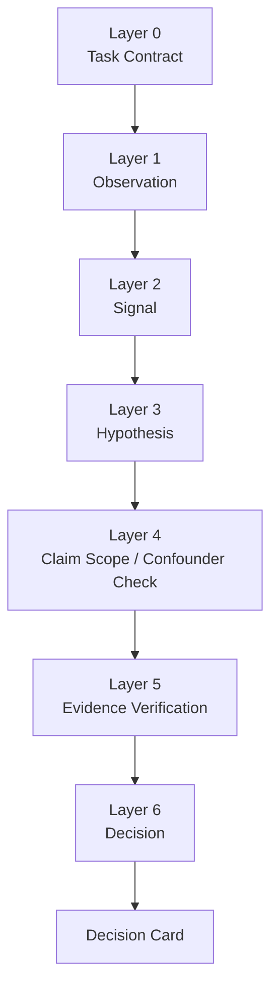
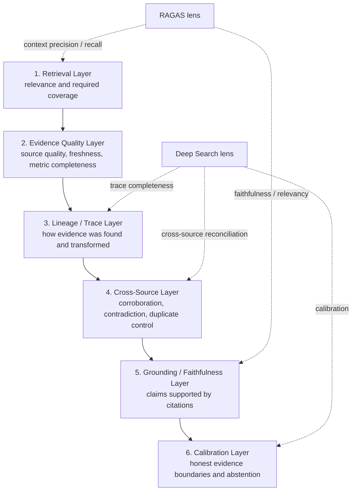

# F003 Content Research Schema Domain Objects

This document defines the content-research schema from domain objects first. Table
DDL is an adapter projection, not the source of truth.

The goal is to keep the research model stable across:

- local SQLite MVP runtime
- future Cloud / Postgres runtime
- benchmark and policy iteration
- priority / evidence-boundary policy changes

## 1. Modeling Principles

1. Domain objects are defined before tables.
2. JSON payload shapes are versioned and portable across SQLite and Cloud stores.
3. Objects that represent events, lineage, human choices, or result snapshots are append-only.
4. Priority and evidence-boundary decisions are deterministic, versioned policy outputs, not free-form agent output.
5. Research results must be traceable from final claims back to evidence, task, trace, and source.
6. SQLite stores high-frequency query fields as columns and complex structured data as JSON text.
7. Cloud stores may use JSONB, generated columns, vector indexes, or event streams, but must preserve the same object semantics.

## 2. Relationship Map

```mermaid
flowchart TD
    RB["ResearchBrief<br/>research request"]
    RP["ResearchPlan<br/>execution plan"]
    RD["ResearchDirection<br/>research lane"]
    SAT["SubagentTask<br/>worker assignment"]
    TR["Trace<br/>execution trace"]
    OBS["ObservationEvent<br/>append-only event"]
    EV["EvidenceRecord<br/>atomic evidence"]
    CS["CanonicalSource<br/>global source identity"]
    DSP["DirectionSourceProjection<br/>direction-local eligibility"]
    EL["EvidenceLineage<br/>source and transformation history"]
    EB["EvidenceBundle<br/>evidence set"]
    CAD["ClaimAdmissionDecision<br/>directional claim gate"]
    AC["AggregateClaim<br/>cross-direction derivation"]
    CR["ContradictionRecord<br/>cross-direction relation"]
    SCP["StageCheckpoint<br/>recoverable stage state"]
    BL["BudgetLedgerEntry<br/>reservation and consumption"]
    RRS["ResearchResultSnapshot<br/>immutable result"]
    HD["HumanDecision<br/>human choice / override"]
    PP["PriorityPolicy<br/>priority policy config"]
    EBP["EvidenceBoundaryPolicy<br/>claim scope config"]
    BC["BenchmarkCase<br/>evaluation case"]
    BRN["BenchmarkRun<br/>evaluation result"]

    RB --> RP
    RP --> RD
    RD --> SAT
    SAT --> TR
    TR --> OBS
    SAT --> EV
    CS --> DSP
    RD --> DSP
    DSP --> EV
    OBS --> EV
    EV --> EL
    EL --> EB
    EV --> EB
    EV --> CAD
    CAD --> AC
    CAD --> CR
    CR --> EB
    AC --> EB
    SAT --> SCP
    SCP --> BL
    EB --> RRS
    RRS --> HD
    RP --> PP
    RP --> EBP
    PP --> EB
    EBP --> EB
    EBP --> RRS
    BC --> BRN
    BRN --> PP
    BRN --> EBP
    BRN --> RRS
```



## 3. Common Fields

Most persistent objects use:

```text
id
workspace_id
brand_id
schema_version
object_version
status
created_at
updated_at
created_by_type
created_by_id
metadata
```

Event-like objects may omit `updated_at` and must be append-only.

## 4. ID Prefixes

| Object | Prefix |
| --- | --- |
| `ResearchBrief` | `rb_` |
| `ResearchPlan` | `rp_` |
| `RunPolicySnapshot` | `rps_` |
| `ResearchDirection` | `rd_` |
| `SubagentTask` | `sat_` |
| `ObservationEvent` | `obs_` |
| `Trace` | `trc_` |
| `EvidenceRecord` | `ev_` |
| `CanonicalSource` | `cs_` |
| `DirectionSourceProjection` | `dsp_` |
| `EvidenceLineage` | `el_` |
| `EvidenceBundle` | `eb_` |
| `ClaimAdmissionDecision` | `cad_` |
| `AggregateClaim` | `ac_` |
| `ContradictionRecord` | `cr_` |
| `StageCheckpoint` | `scp_` |
| `BudgetLedgerEntry` | `ble_` |
| `WeakSignal` | `ws_` |
| `ResearchResultSnapshot` | `rrs_` |
| `HumanDecision` | `hd_` |
| `PriorityPolicy` | `pp_` |
| `EvidenceBoundaryPolicy` | `ebp_` |
| `BenchmarkCase` | `bc_` |
| `BenchmarkRun` | `brn_` |

IDs may be UUID-backed internally, but API-visible IDs should preserve these prefixes
for debugging, logs, and operator-facing references.

## 5. Domain Objects

### 5.1 ResearchBrief

Represents the research request and business question.

Fields:

```text
id
workspace_id
brand_id
schema_version
title
user_goal
research_question
business_context
target_audience_context
platform_scope
time_window
constraints
success_criteria
input_payload
subject_structure
status
created_by_type
created_by_id
created_at
updated_at
metadata
```

`subject_structure` is a versioned, user-confirmed value object produced by
Pre-research rather than a fixed business vocabulary lookup:

```text
schema_version
canonical_subject
subject_type
core_entities[]
research_intents[]
context_modifiers[]
synonym_groups{}
generation:
  provider
  model
  prompt_version
  output_schema_version
  input_fingerprint
confirmed_at
```

Each synonym group belongs to one core entity. Intent and context values may
constrain planning but cannot substitute for a core entity during evidence
admission. A changed subject or structure creates a new confirmed Brief/version;
formal collection never mutates the confirmed value in place.

Status:

```text
draft
ready
planning
in_progress
completed
cancelled
archived
```

Relationships:

- one `ResearchBrief` may have many `ResearchPlan` versions
- one `ResearchBrief` may have many `HumanDecision` events
- one `ResearchBrief` may have many `ResearchResultSnapshot` versions

### 5.2 ResearchPlan

Represents how a brief is decomposed into research directions and executable work.

Fields:

```text
id
workspace_id
brand_id
research_brief_id
schema_version
plan_version
objective
strategy_summary
directions_payload
task_generation_policy
priority_policy_id
evidence_boundary_policy_id
status
created_at
updated_at
metadata
```

Status:

```text
draft
approved
active
superseded
completed
failed
cancelled
```

### 5.3 ResearchDirection

Represents a research lane, such as competitor content, audience pain, or comment signal.

Fields:

```text
id
workspace_id
brand_id
research_brief_id
research_plan_id
schema_version
name
direction_type
hypothesis
questions
source_scope
expected_evidence_types
priority
coverage_target
status
created_at
updated_at
metadata
```

`direction_type` values:

```text
competitor_scan
market_trend
audience_pain
content_pattern
comment_signal
brand_fit
topic_gap
```

Status:

```text
proposed
approved
active
covered
insufficient
dropped
```

### 5.4 SubagentTask

Represents one executable assignment for an agent or deterministic worker.

Fields:

```text
id
workspace_id
brand_id
research_brief_id
research_plan_id
research_direction_id
schema_version
agent_name
agent_version
task_type
input_payload
expected_output_schema
status
attempt_count
max_attempts
started_at
finished_at
error_code
error_message
output_payload
trace_id
created_at
updated_at
metadata
```

Status:

```text
queued
running
succeeded
failed
retrying
cancelled
skipped
```

### 5.5 Trace

Represents one execution chain for task audit and benchmark replay.

Fields:

```text
id
workspace_id
brand_id
research_brief_id
research_plan_id
research_direction_id
subagent_task_id
schema_version
trace_type
status
started_at
finished_at
summary
trace_metrics
metadata
```

`trace_metrics` may include:

```json
{
  "tool_call_count": 8,
  "failed_tool_call_count": 1,
  "evidence_found_count": 15,
  "trace_completeness_score": 0.92,
  "drift_or_forgetting_events": 0
}
```

### 5.6 ObservationEvent

Represents one append-only event inside a trace.

Fields:

```text
id
workspace_id
brand_id
trace_id
schema_version
event_type
event_name
actor_type
actor_id
sequence_no
timestamp
input_ref
output_ref
payload
severity
```

`event_type` values:

```text
task_started
tool_called
source_queried
evidence_found
evidence_rejected
priority_applied
evidence_boundary_updated
human_decision_recorded
task_completed
task_failed
```

### 5.7 EvidenceRecord

Represents one atomic piece of evidence. It is not a summary and not an agent opinion.

Fields:

```text
id
workspace_id
brand_id
schema_version
source_type
source_platform
source_url
source_id
canonical_source_id
source_author_id
source_author_name
source_published_at
collected_at
run_as_of_at
title
text_excerpt
raw_content_ref
normalized_payload
evidence_type
claim
metrics
language
content_hash
dedupe_key
retrieval_query
retrieval_rank
retrieval_score
context_precision_score
context_recall_label
citation_support_score
faithfulness_score
source_authority_score
source_freshness_score
source_independence_key
contradiction_group_id
lineage_reliability_score
quality_score
freshness_score
relevance_score
status
created_at
updated_at
metadata
```

`evidence_type` values:

```text
post
comment
metric_snapshot
profile
search_result
manual_note
agent_observation
```

Status:

```text
candidate
accepted
rejected
deprecated
merged
```

### 5.8 EvidenceLineage

Represents where evidence came from and how it was transformed.

Fields:

```text
id
workspace_id
brand_id
schema_version
evidence_record_id
research_brief_id
research_plan_id
research_direction_id
subagent_task_id
trace_id
parent_evidence_record_id
transformation_type
transformation_version
lineage_payload
created_at
metadata
```

`transformation_type` values:

```text
captured
imported
normalized
deduplicated
clustered
summarized
ordered
included_in_bundle
used_in_result
```

Lineage is append-only.

### 5.9 EvidenceBundle

Represents a deduplicated evidence set for a direction, claim, or result.

Fields:

```text
id
workspace_id
brand_id
research_brief_id
research_plan_id
research_direction_id
schema_version
bundle_type
bundle_version
evidence_ids
summary
coverage
retrieval_metrics
faithfulness_metrics
cross_source_metrics
contradiction_summary
citation_coverage
unsupported_claim_count
missing_evidence
priority_policy_id
evidence_boundary_policy_id
decision_card
priority
evidence_state
evidence_grade
claim_scope
next_action
status
created_at
updated_at
metadata
```

Status:

```text
building
ready
insufficient
superseded
archived
```

Example `coverage`:

```json
{
  "source_count": 12,
  "accepted_evidence_count": 28,
  "direction_coverage": {
    "competitor_scan": "covered",
    "audience_pain": "partial"
  },
  "missing_questions": []
}
```

### 5.10 ResearchResultSnapshot

Represents an immutable result presented to a human or downstream service.

Fields:

```text
id
workspace_id
brand_id
research_brief_id
research_plan_id
run_policy_snapshot_id
schema_version
snapshot_version
result_type
title
executive_summary
findings
recommendations
evidence_bundle_ids
aggregate_claim_ids
source_claim_ids
claim_count
supported_claim_count
unsupported_claim_count
citation_coverage_score
faithfulness_score
report_faithfulness_decision
answer_relevancy_score
derivation_completeness_score
calibration_score
decision_summary
decision_card
priority_summary
evidence_boundary_summary
limitations
abstentions
status
created_at
created_by_type
created_by_id
metadata
```

Status:

```text
draft
presented
accepted
rejected
superseded
archived
```

Example `findings`:

```json
[
  {
    "finding_id": "fnd_001",
    "claim": "Commuting scenarios outperform pure outdoor scenarios for this brand's current audience.",
    "support_level": "medium",
    "evidence_ids": ["ev_001", "ev_002"],
    "evidence_state": "partially_supported",
    "evidence_grade": "B",
    "risk_flags": ["limited_owned_history"]
  }
]
```

### 5.11 HumanDecision

Represents a human approval, rejection, override, or revision request.

Fields:

```text
id
workspace_id
brand_id
research_brief_id
research_plan_id
research_result_snapshot_id
schema_version
target_object_type
target_object_id
decision_type
decision_status
decision_payload
rationale
created_by_type
created_by_id
created_at
metadata
```

`decision_type` values:

```text
approve_plan
reject_plan
choose_direction
drop_direction
accept_result
request_revision
approve_evidence
reject_evidence
override_priority
```

Human decisions are append-only. Current state is derived from the latest applicable
decision, not by overwriting historical choices.

### 5.12 PriorityPolicy

Represents a versioned priority policy for eligible findings or bundles. In the
latest P1 design, it is a policy holder for gates, candidate ordering, tie
breakers, and future calibration metadata. It must not define a universal content
quality formula or viral probability model.

Fields:

```text
id
workspace_id
brand_id
schema_version
profile_name
profile_version
scope
task_fit_policy
candidate_gate_policy
top_k_policy
priority_label_policy
evidence_quality_policy
diversity_policy
freshness_policy
citation_policy
decision_value_policy
thresholds
tie_breakers
ablation_flags
status
created_at
updated_at
metadata
```

`scope` values:

```text
evidence_record
evidence_bundle
research_direction
finding
research_result
topic_candidate
```

### 5.13 EvidenceBoundaryPolicy

Represents a versioned evidence-boundary policy. It decides whether the system
may express a claim as verified, partially supported, case-only, signal-only, or
unsupported. In the latest P1 design, it governs claim scope, missing evidence,
contradiction handling, and abstention. It must not be used to hide evidence
weakness behind a single numeric score.

Fields:

```text
id
workspace_id
brand_id
schema_version
policy_name
policy_version
scope
minimum_evidence_count
minimum_independent_source_count
required_citation_coverage
required_context_precision
required_faithfulness
claim_scope_rules
forbidden_claims
allowed_finding_types
contradiction_policy
abstention_policy
evidence_states
status
created_at
updated_at
metadata
```

### 5.14 BenchmarkCase

Represents one reusable evaluation case.

Fields:

```text
id
workspace_id
brand_id
schema_version
case_name
case_version
brief_payload
expected_outputs
evaluation_criteria
golden_evidence_ids
difficulty
status
created_at
updated_at
metadata
```

Status:

```text
draft
active
deprecated
archived
```

### 5.15 BenchmarkRun

Represents one evaluation execution and calibration record.

Fields:

```text
id
workspace_id
brand_id
benchmark_case_id
schema_version
run_name
run_version
system_version
priority_policy_id
evidence_boundary_policy_id
input_payload
output_snapshot_id
metrics
failure_cases
status
started_at
finished_at
created_at
metadata
```

Status:

```text
queued
running
passed
failed
error
cancelled
```

### 5.16 RunPolicySnapshot

Represents the immutable effective policy for one formal research run. It is the
sole owner of the run's time semantics and is never overwritten when defaults
change.

```text
id
workspace_id
brand_id
research_brief_id
research_plan_id
schema_version
base_policy_ids_and_versions
effective_policy
effective_policy_hash
run_as_of_at
requested_overrides
validation_result
created_at
metadata
```

### 5.17 CanonicalSource and DirectionSourceProjection

`CanonicalSource` is the global platform identity resolved by `SourceRegistry`.
It does not encode direction eligibility or aggregate evidence counts.

```text
CanonicalSource:
id
platform
platform_source_kind
platform_source_id
canonical_url
first_seen_at
last_seen_at
metadata
```

`DirectionSourceProjection` records how one direction selected and used that
identity. Multiple projections may reference the same canonical source without
becoming independent corroboration.

```text
DirectionSourceProjection:
id
research_direction_id
canonical_source_id
evidence_packet_id
query_group_ids
selection_reasons
field_availability
eligibility_state
eligibility_reason_codes
created_at
metadata
```

### 5.18 ClaimAdmissionDecision and WeakSignal

`ClaimAdmissionDecision` is the deterministic, reproducible result of applying
the directional contract to a claim candidate.

```text
id
research_direction_id
claim_candidate_id
schema_version
decision: admitted | downgraded | rejected
claim_evidence_state: case_level | repeated_observation | provisional | insufficient_evidence
satisfied_rule_ids
violated_rule_ids
computed_metrics
evidence_refs
required_disclosures
recovery_action
policy_snapshot_id
policy_snapshot_hash
created_at
metadata
```

`WeakSignal` preserves useful downgraded material rather than silently dropping
it. It references the admission decision, evidence, missing gate, limitation,
and recovery action. It is reportable only in an explicitly non-conclusive
section.

### 5.19 Cross-direction records and AggregateClaim

`ContradictionRecord` and `OverlapRecord` are append-only, read-only outputs of
`CrossDirectionReconciler`; they never rewrite directional admission decisions.

```text
id
research_plan_id
record_type: contradiction | overlap
claim_ids
canonical_source_ids
classification
reason
resolution_state
created_at
metadata
```

`AggregateClaim` is a new, derived claim used only when a report connects
multiple admitted directional claims. Simple report ordering does not create one.

```text
id
research_plan_id
schema_version
aggregate_type: cross_direction_corroboration | cross_direction_tension | action_hypothesis
statement
source_claim_ids
derivation_method
scope_intersection
inherited_limitations
admission_decision_id
policy_snapshot_id
created_at
metadata
```

### 5.20 StageCheckpoint and BudgetLedgerEntry

`StageCheckpoint` is the single recoverable-progress record. Observation events
remain append-only telemetry and cannot substitute for it.

```text
id
subagent_task_id
stage_name: collect | packet | facts | admission | reconcile | aggregate | compose | faithfulness
input_fingerprint
output_refs
status
failure_reason
retry_count
budget_reservation_refs
started_at
finished_at
created_at
updated_at
metadata
```

`BudgetLedgerEntry` represents one atomic external-call reservation and its
final disposition.

```text
id
research_plan_id
research_direction_id
idempotency_key
reservation_status: reserved | committed | released | expired
budget_type
reserved_amount
consumed_amount
source_request_ref
stage_checkpoint_id
created_at
updated_at
metadata
```

### 5.21 Report faithfulness and result status

`ResearchResultSnapshot.result_type` must distinguish:

```text
complete_verified_report
partial_verified_report
evidence_only_report
```

The snapshot stores the applicable `ReportFaithfulnessDecision`: deterministic
check results, semantic-audit result, retry count, omitted free-text sections,
and all source directional/aggregate claim IDs. A failed free-text section does
not remove already admitted evidence or direction results from the snapshot.

## 6. Ranking and Confidence Model

The schema adapts useful ideas from RAGAS and Deep Search / Deep Research benchmarks,
but does not copy all benchmark claims directly.

RAGAS contributes the retrieval and grounding lens:

- context precision: retrieved evidence should be relevant
- context recall: required evidence coverage should not be obviously missing
- faithfulness: claims should stay grounded in cited evidence
- answer relevancy: output should answer the research question

Deep Search style benchmarks contribute the research-process lens:

- trace completeness
- citation support
- cross-source corroboration and contradiction handling
- long-chain derivation completeness
- evidence-boundary calibration and abstention

For this project, these are adapted to Xiaohongshu content strategy research. The
system should optimize for useful, evidence-grounded brand decisions rather than
open-domain QA exact match, generic long-answer fluency, or agent-planning spectacle.

### 6.1 Decision-Oriented Research Model

F003 does not try to compute intrinsic content quality, viral probability,
purchase conversion, or causal content effect from Xiaohongshu engagement data.
Likes, saves, comments, shares, publication time, and partial author data are
useful observations, but they are affected by unobserved exposure, platform
ranking, seasonality, creator baseline, paid amplification, and social context.

The product goal is therefore:

```text
From incomplete and platform-mediated observations,
produce evidence-bounded research findings that help the user decide what to
investigate, test, or execute next.
```

Priority answers:

```text
Is this finding worth looking at before the other eligible findings?
```

Evidence state / evidence grade answers:

```text
How strongly is this finding supported by the available evidence?
```

These two questions must remain separate. A finding can be high priority but low
weak evidence, in which case it should be framed as a promising signal that needs
more evidence. A finding can also be strongly supported but low priority, in which
case it should remain available but not dominate the result list.

F003 uses the following layered model:



Layer summary:

| Layer | One-line purpose | Input | Output | Design reason |
| --- | --- | --- | --- | --- |
| Layer 0 Task Contract | Define what this run is allowed to judge. | Seed, brief, user goal, selected directions, allowed finding types. | Allowed claims, forbidden claims, minimum evidence requirements. | Relevance and usefulness only make sense relative to a task. |
| Layer 1 Observation | Record what was observed without interpreting it. | Notes, comments, author fields, timestamps, engagement metrics, retrieval context. | Validated `EvidenceRecord` rows, dedupe status, data quality flags. | Keeps observable facts separate from business interpretation. |
| Layer 2 Signal | Group repeated observations into named patterns. | Evidence records, text, comments, tags, embeddings, time windows. | Signal clusters with representative evidence and distribution. | A single note is noisy; repeated patterns are better research units. |
| Layer 3 Hypothesis | Turn a signal into a bounded candidate finding. | Signal cluster, task contract, representative evidence. | Claim, audience, scenario, possible action, assumptions, evidence refs. | Signals become useful only when expressed as testable hypotheses. |
| Layer 4 Claim Scope / Confounder Check | Decide what the evidence permits and forbids saying. | Candidate hypothesis plus available context and missing context. | Allowed inferences, disallowed inferences, confounders, missing context. | Prevents engagement observations from becoming causal or predictive claims. |
| Layer 5 Evidence Verification | Check how strongly evidence supports the hypothesis. | Hypothesis, supporting evidence, conflicting evidence, citation coverage. | Verification status, supported parts, unsupported parts, contradictions, missing evidence, evidence grade. | Evidence strength is independent from business priority. |
| Layer 6 Decision | Decide which eligible findings deserve attention first. | Verified findings, task fit, evidence grade, decision value. | Priority label, relative rank, next action. | Ranking should happen after eligibility and evidence boundaries are clear. |
| Decision Card | Present the result as a decision aid. | Priority, evidence grade, claim scope, next action. | User-facing result item. | Users need "what to do next" and "why", not just a naked score. |

P1 should treat deterministic metrics as control signals for filtering,
explanation, and verification, not as a claim that the system has measured true
content quality. Full pairwise ranking, Bradley-Terry aggregation, judge
calibration, historical learning-to-rank, and causal debiasing are P2+ concerns.

### 6.2 Evidence Quality Stack



### 6.3 Included and Excluded Benchmark Claims

Included:

- context precision
- direction coverage as the project-specific form of context recall
- faithfulness / groundedness
- citation support rate
- unsupported claim rate
- cross-source corroboration and contradiction handling
- evidence-boundary calibration
- trace completeness for audit and replay

Adapted:

- `answer_relevancy` becomes `business_goal_relevance`, `research_question_alignment`,
  and `brand_context_alignment`
- `answer_correctness` becomes `evidence_supported_correctness`,
  `decision_usefulness`, and post-hoc outcome alignment
- `tool_use_efficiency` becomes a cost and reliability diagnostic, not a core
  business quality score

Excluded from core schema:

- open-domain factual exact match
- generic long-form answer fluency
- multi-hop reasoning depth as a goal by itself
- web-scale source breadth
- agent autonomy or planning sophistication as a business metric
- generic hallucination score separate from `unsupported_claim_rate`

### 6.4 Priority and Evidence Boundary v1

P1 uses Decision Card semantics instead of a universal weighted ranking formula.
The system first determines whether a candidate can become a finding, then
decides how strongly it is supported, then decides whether it deserves attention
before other eligible findings.

The P1 decision states are:

```text
invalid
case_only
signal
partially_supported
verified
```

Decision state meanings:

| State | Meaning | Allowed expression |
| --- | --- | --- |
| `invalid` | The candidate is irrelevant, duplicated, malformed, or unsupported. | Do not show as a result. |
| `case_only` | Evidence supports only a single example or narrow case. | "Example / sample worth inspecting." |
| `signal` | Evidence suggests a pattern, but support is thin or context is missing. | "Promising signal, needs more evidence." |
| `partially_supported` | Some parts of the claim are supported, while stronger claims are not. | "Supported within a limited scope." |
| `verified` | The claim is supported by enough independent evidence for the current task. | "Evidence-backed finding." |

P1 gates are non-compensatory. A severe failure cannot be offset by high
engagement or topical interest:

```text
if claim has no supporting evidence:
  state = invalid

if evidence is from only one note or one author:
  max_state = case_only

if claim extrapolates to viral probability, purchase conversion, or causal effect:
  remove the extrapolation or mark unsupported

if source links or evidence lineage are missing:
  max_state = signal

if unresolved contradiction exists:
  max_state = partially_supported
```

P1 priority is a label over eligible findings, not a content-quality score:

```text
priority_label:
  high_priority
  high_potential_needs_more_evidence
  useful_but_lower_priority
  evidence_backed_reference
  do_not_prioritize
```

Priority labels combine task fit, decision value, and evidence state:

| Evidence state | Task / decision value | Priority label |
| --- | --- | --- |
| `verified` or `partially_supported` | High | `high_priority` |
| `signal` or `case_only` | High | `high_potential_needs_more_evidence` |
| `verified` or `partially_supported` | Medium / low | `evidence_backed_reference` |
| `signal` | Medium | `useful_but_lower_priority` |
| `invalid` | Any | `do_not_prioritize` |

Internal deterministic signals may be used to filter and explain candidates:

```text
valid_evidence_count
unique_note_count
unique_author_count
comment_sample_size
source_freshness
engagement_percentile_within_cohort
citation_coverage
unsupported_claim_count
contradiction_status
missing_required_sources
```

These signals are not a final business-value formula. They are used for gates,
candidate ordering, evidence grade, and explanations.

### 6.5 Decision Card Payload Contract

Every displayed result should be expressible as a Decision Card:

```json
{
  "finding_id": "finding_001",
  "priority": {
    "label": "high_potential_needs_more_evidence",
    "rank": 2,
    "method": "p1_gate_and_top_k_ordering",
    "reasons": [
      "Directly answers the selected content-angle direction",
      "Can become a concrete content experiment"
    ]
  },
  "evidence": {
    "state": "partially_supported",
    "grade": "B",
    "supported_parts": [
      "Users discuss wrinkles after packing lightweight jackets"
    ],
    "unsupported_parts": [
      "Anti-wrinkle positioning will outperform weight-focused positioning"
    ],
    "missing_evidence": [
      "No controlled comparison between weight-focused and anti-wrinkle content"
    ]
  },
  "claim_scope": {
    "allowed": [
      "Worth testing as the next content angle"
    ],
    "not_allowed": [
      "Cannot predict viral probability",
      "Cannot prove purchase conversion lift"
    ],
    "confounders": [
      "exposure_unknown",
      "creator_baseline_unknown"
    ]
  },
  "next_action": {
    "type": "content_experiment",
    "proposal": "Compare weight-focused and packability/anti-wrinkle content angles."
  }
}
```

If a later phase adds pairwise comparison or Bradley-Terry aggregation, that
output must remain a `priority.method` detail and must not replace evidence
state, claim scope, or next action.

### 6.6 P1 Minimal Retained Design

To avoid over-engineering the P1 research system, the following design elements
are mandatory because they directly prevent low-quality or over-claimed output:

- Task Contract: defines allowed finding types and forbidden claims before
  collection and priority decisions.
- Observation / Interpretation separation: `EvidenceRecord` stores observations;
  interpretations must be represented as signals, hypotheses, findings, or
  result items.
- Signal to Hypothesis transition: F003 delivers research findings, not a raw
  note leaderboard.
- Claim Scope Check: every finding must state what can and cannot be inferred
  from the current evidence.
- Evidence Verification: every finding must expose support level, missing
  evidence, contradictions, and evidence state / grade.
- Decision Card: final results must combine priority, evidence status, claim
  scope, and next action.

The following are intentionally deferred unless a later phase proves they are
needed for quality, calibration, or user value:

- full pairwise comparison over all candidates
- Bradley-Terry aggregation for every run
- multi-model judge calibration
- selective escalation across several model tiers
- causal debiasing of platform exposure or popularity
- complex author authority modeling
- historical learning-to-rank from accepted decisions and content experiments
- complex Pareto optimization beyond simple eligibility gates

These deferred items are not unimportant. They are unnecessary for proving the
P1 value loop:

```text
evidence -> signal -> hypothesis -> evidence boundary -> decision card
```

## 7. JSON Payload Shapes

### 7.1 EvidenceBundle Payload

```json
{
  "schema_version": "evidence_bundle_v1",
  "bundle_type": "research_direction",
  "evidence_ids": ["ev_001", "ev_002"],
  "summary": "Commuting content shows stronger save and comment intent than pure outdoor content.",
  "coverage": {
    "source_count": 12,
    "accepted_evidence_count": 28,
    "direction_coverage": {
      "competitor_scan": "covered",
      "comment_signal": "partial"
    },
    "missing_questions": ["owned-account performance is limited"]
  },
  "retrieval_metrics": {
    "context_precision": 0.78,
    "direction_coverage_proxy": 0.67
  },
  "cross_source_metrics": {
    "source_diversity_score": 0.74,
    "corroboration_score": 0.71,
    "duplicate_rate": 0.08
  },
  "contradiction_summary": {
    "has_unresolved_contradiction": false,
    "groups": []
  },
  "decision_card": {
    "priority": {
      "label": "high_potential_needs_more_evidence",
      "rank": 2,
      "method": "p1_gate_and_top_k_ordering"
    },
    "evidence": {
      "state": "partially_supported",
      "grade": "B",
      "missing_evidence": ["owned-account performance is limited"]
    },
    "claim_scope": {
      "allowed": ["Worth testing as a content angle"],
      "not_allowed": ["Cannot predict viral probability"]
    }
  }
}
```

### 7.2 ResearchResultSnapshot Payload

```json
{
  "schema_version": "research_result_snapshot_v1",
  "snapshot_version": "1",
  "result_type": "topic_research",
  "title": "Urban commuting topic opportunities",
  "executive_summary": "The strongest opportunity is practical commuting scenarios with lightweight product proof.",
  "findings": [
    {
      "finding_id": "fnd_001",
      "claim": "Practical commuting scenarios have stronger audience intent than pure outdoor positioning.",
      "support_level": "medium",
      "evidence_ids": ["ev_001", "ev_002"],
      "evidence_bundle_ids": ["eb_001"],
      "evidence_state": "partially_supported",
      "evidence_grade": "B",
      "risk_flags": ["limited_owned_history"]
    }
  ],
  "recommendations": [
    {
      "recommendation_id": "rec_001",
      "action": "Prioritize two commuting-scenario topic candidates in the next decision batch.",
      "based_on_findings": ["fnd_001"]
    }
  ],
  "limitations": ["Owned historical performance data is sparse."],
  "abstentions": []
}
```

### 7.3 BenchmarkRun Metrics Payload

```json
{
  "schema_version": "benchmark_run_metrics_v1",
  "context_precision": 0.8,
  "direction_coverage": 0.7,
  "faithfulness": 0.82,
  "business_goal_relevance": 0.76,
  "citation_support_rate": 0.88,
  "unsupported_claim_rate": 0.04,
  "contradiction_resolution_rate": 0.9,
  "derivation_completeness_score": 0.72,
  "evidence_boundary_calibration_error": 0.11,
  "trace_completeness_rate": 0.93,
  "tool_error_rate": 0.03,
  "cost_per_supported_finding": 0.42
}
```

## 8. Indexes and Query Paths

Required query paths:

1. Load active research for a brand:
   - `workspace_id + brand_id + status`
   - objects: `ResearchBrief`, `ResearchPlan`, `ResearchResultSnapshot`
2. Resume a task:
   - `workspace_id + status + created_at`
   - objects: `SubagentTask`
3. Inspect a trace:
   - `trace_id + sequence_no`
   - objects: `ObservationEvent`
4. Build evidence view for a direction:
   - `research_direction_id + status + priority`
   - objects: `EvidenceRecord`, `EvidenceBundle`
5. Explain a finding:
   - `research_result_snapshot_id -> evidence_bundle_ids -> evidence_ids`
6. Audit evidence provenance:
   - `evidence_record_id + created_at`
   - objects: `EvidenceLineage`
7. Review human choices:
   - `target_object_type + target_object_id + created_at`
   - objects: `HumanDecision`
8. Calibrate algorithms:
   - `benchmark_case_id + priority_policy_id + evidence_boundary_policy_id + created_at`
   - objects: `BenchmarkRun`

Suggested SQLite indexes:

```text
research_briefs(workspace_id, brand_id, status, created_at)
research_plans(research_brief_id, status, created_at)
research_directions(research_plan_id, status, priority)
subagent_tasks(workspace_id, status, created_at)
traces(subagent_task_id, started_at)
observation_events(trace_id, sequence_no)
evidence_records(workspace_id, brand_id, status, collected_at)
evidence_records(dedupe_key)
evidence_records(source_independence_key)
evidence_lineage(evidence_record_id, created_at)
evidence_bundles(research_direction_id, status, created_at)
research_result_snapshots(research_brief_id, status, created_at)
human_decisions(target_object_type, target_object_id, created_at)
priority_policies(workspace_id, brand_id, profile_name, profile_version)
evidence_boundary_policies(workspace_id, brand_id, policy_name, policy_version)
benchmark_runs(benchmark_case_id, created_at)
```

## 9. SQLite and Cloud Adapter Constraints

SQLite adapter:

- stores IDs as `TEXT`
- stores structured payloads as JSON `TEXT`
- stores frequent filters, joins, and ordering keys as first-class columns
- uses append-only rows for lineage, observation events, decisions, and snapshots
- avoids relying on database-specific JSON query behavior for correctness
- enforces core integrity in service code when SQLite cannot express it cleanly

Cloud / Postgres adapter:

- may store structured payloads as `JSONB`
- may add generated columns for frequently queried JSON fields
- may add vector indexes for semantic retrieval
- may add partial indexes and foreign keys where SQLite keeps service-level checks
- must not change object names, field semantics, status meanings, or JSON schema versions

Compatibility rules:

1. Every JSON payload must include `schema_version`.
2. Every algorithm-controlled object must record the decision / evidence policy version.
3. Historical snapshots must not be silently recalculated when priority or evidence-boundary logic changes.
4. New priority or evidence-boundary policies require a new version.
5. Cloud migration must be able to replay from SQLite rows without semantic loss.

## 10. Non-Negotiable Constraints

1. Every research result claim must trace to at least one `EvidenceBundle`, or be marked as an abstention / unsupported limitation.
2. Every `EvidenceBundle` must trace to `EvidenceRecord` rows.
3. Every `EvidenceRecord` must trace to source, task, or import lineage.
4. `HumanDecision` is append-only.
5. `ResearchResultSnapshot` is immutable.
6. Priority and evidence-boundary policies are versioned.
7. `BenchmarkRun` records the system, priority, and evidence-boundary versions used at run time.
8. Every displayed finding must expose evidence state, supported / unsupported parts, reasons, and missing evidence, not only one number.
9. Every displayed finding must expose priority label, method, claim scope, and next action.
10. The schema should support stronger future algorithms without changing the domain object names.
