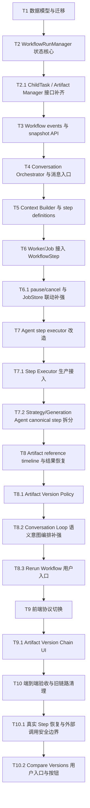

# 架构重构 0.1.0 实现计划

日期：2026-05-17

关联蓝图：[20260517_refactor_0.1.0.md](20260517_refactor_0.1.0.md)

关联蓝图为唯一Ground Truth。本文档只负责任务拆分、完成进展和 bugfix 记录；若本文档与蓝图不一致，以蓝图为准并修正本文档。

本文档把架构重构方案拆成可执行任务。拆分原则：

1. 每个任务完成后都能独立测试。
2. 任务之间有明确依赖顺序。
3. 不按“模块名”泛泛拆分，而按可交付的闭环能力拆分。
4. 新模型先兼容旧链路，再逐步切换入口。

## 总体顺序



## T1 数据模型与迁移

### 目标

新增 workflow 六表，并为旧表增加必要兼容字段，但不改变现有业务入口。

### 范围

新增表：

```text
workflow_runs
workflow_steps
workflow_child_tasks
workflow_events
workflow_artifacts
workflow_constraints
```

修改旧表：

```text
creator_threads.active_run_id
jobs.run_id
jobs.step_id
jobs.child_task_id
```

### 交付

- 数据表初始化逻辑。
- Pydantic / dataclass 模型。
- Store 层基础 CRUD。
- 幂等建表与旧库兼容迁移。

### 测试

新增单测：

```text
tests/unit/test_workflow_schema.py
tests/unit/test_workflow_store.py
```

覆盖：

- 空库能创建所有新表。
- 旧库缺列时能自动补列。
- workflow run / step / child task / event / artifact / constraint 可创建和读取。
- 重复初始化不报错。

### 完成标准

```bash
pytest -q tests/unit/test_workflow_schema.py tests/unit/test_workflow_store.py
```

通过。

### 完成进展

- 状态：Done
- 完成日期：2026-05-17
- 开发指南：[instructions/T1_guide.md](../../instructions/T1_guide.md)
- 交付代码：
  - `app/models/workflow.py`
  - `app/memory/workflow_store.py`
  - `app/memory/thread_store.py`
  - `app/memory/job_store.py`
- 交付测试：
  - `tests/unit/test_workflow_schema.py`
  - `tests/unit/test_workflow_store.py`
- 验证结果：
  - `pytest -q tests/unit/test_workflow_schema.py tests/unit/test_workflow_store.py`：10 passed
  - `pytest -q tests/unit/test_thread_store.py tests/unit/test_job_store.py`：22 passed
- 说明：已完成 workflow 六表、Pydantic 模型、Store 层基础 CRUD、幂等建表、旧库兼容补列；未进入 T2 的状态机/事务语义。

### Bugfix 记录

- 2026-05-17：修正进度回填遗漏，将 T1 guide 的 AC/checklist 全部标记为完成，并在本文档补充 T1 完成进展。

## T2 WorkflowRunManager 状态核心

### 依赖

T1。

### 目标

实现集中状态转换，不接入真实 Agent，只验证状态机和事务。

### 范围

实现：

```text
WorkflowRunManager.start_run
WorkflowRunManager.pause_run
WorkflowRunManager.resume_run
WorkflowRunManager.cancel_run
WorkflowRunManager.complete_run
WorkflowRunManager.fail_run
WorkflowRunManager.initialize_steps
WorkflowRunManager.start_step
WorkflowRunManager.complete_step
WorkflowRunManager.retry_step
WorkflowRunManager.fail_step
WorkflowRunManager.cancel_step
WorkflowRunManager.skip_step
WorkflowRunManager.advance_to_next_step
```

状态转换必须：

```text
BEGIN IMMEDIATE
更新 run/step/child_task/artifact/constraint
插入 workflow_event
COMMIT
```

### 交付

- `WorkflowRunManager`。
- 状态转换校验。
- 事务封装。
- commit guard：`cancelling/cancelled` 下禁止成功 commit。

### 测试

新增单测：

```text
tests/unit/test_workflow_run_manager.py
tests/unit/test_workflow_transitions.py
```

覆盖：

- 合法 run 状态转换。
- 非法状态转换被拒绝。
- 重复 pause/cancel 幂等。
- cancel 与 complete_step 竞态下 cancel 优先。
- 状态更新和 event append 同事务成功。
- 人为制造 event append 失败时状态回滚。

### 完成标准

```bash
pytest -q tests/unit/test_workflow_run_manager.py tests/unit/test_workflow_transitions.py
```

通过。

### 完成进展

- 状态：Done
- 完成日期：2026-05-17
- 开发指南：[instructions/T2_guide.md](../../instructions/T2_guide.md)
- 交付代码：
  - `app/services/workflow_run_manager.py`
- 交付测试：
  - `tests/unit/test_workflow_run_manager.py`
  - `tests/unit/test_workflow_transitions.py`
- 验证结果：
  - `pytest -q tests/unit/test_workflow_run_manager.py tests/unit/test_workflow_transitions.py`：13 passed
  - `pytest -q tests/unit/test_workflow_schema.py tests/unit/test_workflow_store.py tests/unit/test_workflow_run_manager.py tests/unit/test_workflow_transitions.py`：23 passed
- 说明：已完成 `WorkflowRunManager`、run/step 状态转换校验、`BEGIN IMMEDIATE` 事务封装、同事务 event append、`complete_step` commit guard、pause/cancel 幂等语义，以及蓝图要求的 constraint/event/snapshot manager 入口；未进入 T6+ 的 child task/artifact 执行入口。

### Bugfix 记录

- 2026-05-17：修正 `advance_to_next_step` 在同一秒初始化多个 step 时排序不稳定的问题，改用 `created_at ASC, rowid ASC` 保持同批插入顺序。
- 2026-05-17：按蓝图审计补齐 `WorkflowRunManager.add_constraint`、`mark_constraint_applied`、`append_event`、`list_events`、`get_run_snapshot`，确保 constraint_version 更新和 event append 同事务完成。
- 2026-05-18：按 implementation 测试审计补充正向事务断言，验证成功 transition 后状态更新和 workflow event 同时可见。

## T2.1 ChildTask / Artifact Manager 接口补齐

### 依赖

T1、T2。

### 目标

补齐蓝图中 `WorkflowRunManager` 的 ChildTask 与 Artifact 接口，使 child task 状态转换、artifact 写入、event append 都收口到 manager，而不是由 executor 或 store 直接改 workflow 状态表。

### 范围

新增或收口：

```text
WorkflowRunManager.create_child_tasks
WorkflowRunManager.start_child_task
WorkflowRunManager.complete_child_task
WorkflowRunManager.retry_child_task
WorkflowRunManager.fail_child_task
WorkflowRunManager.cancel_child_task
WorkflowRunManager.attach_artifact
```

### 交付

- ChildTask 状态转换校验。
- ChildTask event append。
- `attach_artifact` 同事务写 artifact reference / artifact row / workflow event。
- Generation executor 不再直接更新 `workflow_child_tasks`。

### 测试

新增/改造：

```text
tests/unit/test_workflow_child_task_manager.py
tests/unit/test_workflow_artifact_manager.py
tests/integration/test_workflow_generation_steps.py
```

覆盖：

- child task pending/running/retrying/succeeded/failed/cancelled 转换。
- child task retry/fail 与 event 同事务。
- artifact attach 后 snapshot 可见。
- generation executor 通过 manager 更新 child task，不直接写表。

### 完成标准

测试闭环：

```bash
pytest -q tests/unit/test_workflow_child_task_manager.py tests/unit/test_workflow_artifact_manager.py tests/integration/test_workflow_generation_steps.py
```

权责闭环：

- `WorkflowRunManager` 覆盖蓝图定版的 ChildTask 与 Artifact 接口。
- workflow child task 状态变化不再由 executor/store 直接写表。
- artifact 写入和 workflow event 追加同事务完成。

### 完成进展

- 状态：Done
- 完成日期：2026-05-19
- 开发指南：[instructions/T2.1_guide.md](../../instructions/T2.1_guide.md)
- 交付代码：
  - `app/services/workflow_run_manager.py`
  - `app/services/step_executors.py`
- 交付测试：
  - `tests/unit/test_workflow_child_task_manager.py`
  - `tests/unit/test_workflow_artifact_manager.py`
  - `tests/integration/test_workflow_generation_steps.py`
- 验证结果：
  - `pytest -q tests/unit/test_workflow_child_task_manager.py tests/unit/test_workflow_artifact_manager.py tests/integration/test_workflow_generation_steps.py`：9 passed
  - `pytest -q tests/unit/test_workflow_run_manager.py tests/unit/test_workflow_transitions.py`：13 passed
  - `pytest -q tests/integration/test_workflow_strategy_steps.py tests/integration/test_workflow_job_worker.py`：5 passed
- 说明：已按蓝图定版接口补齐 `WorkflowRunManager` 的 ChildTask 与 Artifact manager 能力；child task 状态转换、artifact attach、workflow event append 均在 manager 的 `BEGIN IMMEDIATE` 事务中完成；Generation executor 不再直接插入或更新 `workflow_child_tasks`，artifact 写入也改走 `WorkflowRunManager.attach_artifact`。T3/T4/T5 中因 T2.1 缺失导致的 Incomplete 状态可在后续任务中单独重验。

### Bugfix 记录

- 暂无。

## T3 Workflow Events 与 Snapshot API

### 依赖

T1、T2、T2.1。

### 目标

前端和测试可以通过新 API 读取 workflow 权威状态和事件流。

### 范围

新增 API：

```text
GET /workflow-runs/{run_id}/snapshot
GET /workflow-runs/{run_id}/events
```

Snapshot 返回：

```text
run
steps
child_tasks
artifacts
constraints
active_job
```

SSE 只读取 `workflow_events`，支持 `Last-Event-ID` 或 `after_event_id`。

### 交付

- Snapshot response schema。
- Workflow event SSE。
- event replay。
- thread/run 不匹配时返回清晰错误。

### 测试

新增测试：

```text
tests/e2e/test_workflow_snapshot_api.py
tests/e2e/test_workflow_events_api.py
```

覆盖：

- 创建 run 后 snapshot 能恢复当前状态。
- 多个 event 按 event_id 顺序返回。
- SSE replay 只返回指定 event_id 之后的事件。
- run 不存在返回 404。

### 完成标准

```bash
pytest -q tests/e2e/test_workflow_snapshot_api.py tests/e2e/test_workflow_events_api.py
```

通过。

### 完成进展

- 状态：Done
- 完成日期：2026-05-20
- 开发指南：[instructions/T3_guide.md](../../instructions/T3_guide.md)
- 交付代码：
  - `app/memory/workflow_store.py`
  - `app/api/routes/router.py`
- 交付测试：
  - `tests/e2e/test_workflow_snapshot_api.py`
  - `tests/e2e/test_workflow_events_api.py`
- 验证结果：
  - `pytest -q tests/e2e/test_workflow_snapshot_api.py tests/e2e/test_workflow_events_api.py`：8 passed
  - `pytest -q tests/unit/test_workflow_run_manager.py tests/unit/test_workflow_transitions.py tests/unit/test_workflow_child_task_manager.py tests/unit/test_workflow_artifact_manager.py tests/e2e/test_workflow_snapshot_api.py tests/e2e/test_workflow_events_api.py`：28 passed
  - `pytest -q tests/unit/test_workflow_schema.py tests/unit/test_workflow_store.py tests/unit/test_workflow_run_manager.py tests/unit/test_workflow_transitions.py tests/unit/test_workflow_child_task_manager.py tests/unit/test_workflow_artifact_manager.py tests/e2e/test_workflow_snapshot_api.py tests/e2e/test_workflow_events_api.py`：38 passed
- 说明：已完成 workflow snapshot API、workflow event SSE/replay、`after_event_id` 与 `Last-Event-ID` cursor 支持、run 缺失与 thread/run mismatch 错误。T2.1 已完成后重新验收，snapshot 测试已改为通过 `WorkflowRunManager` 写入 child task、artifact、constraint 后再读取，证明 child task/artifact 权责闭环与 API 恢复链路符合蓝图。

### Bugfix 记录

- 暂无。

## T4 Conversation Orchestrator 与消息入口

### 依赖

T1、T2、T3。

### 目标

后端接管对话意图判断和 workflow command 分发，前端不再用关键词决定启动任务。

### 范围

新增：

```text
ConversationOrchestrator
IntentRouter v2
ConstraintClassifier v1
ArtifactReferenceResolver v1
```

改造：

```text
POST /threads/{thread_id}/messages
```

使其返回：

```text
message
assistant_reply
command_result
active_run_snapshot
```

### 第一版规则

规则优先处理：

```text
暂停
取消
继续
完成
查进度
重新生成
```

自然语言约束用 LLM structured output；测试中使用 fake classifier。

### 交付

- `start_workflow` 从后端触发 `WorkflowRunManager.start_run`。
- `add_constraint` 写入 `workflow_constraints`。
- pause/resume/cancel 变成 run command。
- ask_status 读取 snapshot 并生成简短回复。

### 测试

新增测试：

```text
tests/unit/test_conversation_orchestrator.py
tests/e2e/test_creator_message_workflow_v2.py
```

覆盖：

- 生成需求创建 active_run。
- 运行中补充要求写入 constraint。
- 暂停/继续/取消调用 run command。
- 查状态返回 snapshot 摘要。
- 低置信度 constraint 不改变 workflow 状态。

### 完成标准

```bash
pytest -q tests/unit/test_conversation_orchestrator.py tests/e2e/test_creator_message_workflow_v2.py
```

通过。

### 完成进展

- 状态：Done
- 完成日期：2026-05-20
- 开发指南：[instructions/T4_guide.md](../../instructions/T4_guide.md)
- 交付代码：
  - `app/services/conversation_orchestrator.py`
  - `app/api/routes/router.py`
  - `app/models/schemas.py`
  - `app/memory/thread_store.py`
- 交付测试：
  - `tests/unit/test_conversation_orchestrator.py`
  - `tests/e2e/test_creator_message_workflow_v2.py`
- 验证结果：
  - `pytest -q tests/unit/test_conversation_orchestrator.py tests/e2e/test_creator_message_workflow_v2.py`：11 passed
  - `pytest -q tests/e2e/test_creator_message_workflow_v2.py tests/e2e/test_workflow_snapshot_api.py`：9 passed
  - `pytest -q tests/e2e/test_workflow_snapshot_api.py tests/e2e/test_workflow_events_api.py tests/unit/test_conversation_orchestrator.py tests/e2e/test_creator_message_workflow_v2.py tests/e2e/test_creator_message_intent_api.py`：22 passed
  - `pytest -q tests/unit/test_workflow_schema.py tests/unit/test_workflow_store.py tests/unit/test_workflow_run_manager.py tests/unit/test_workflow_transitions.py tests/unit/test_workflow_child_task_manager.py tests/unit/test_workflow_artifact_manager.py tests/e2e/test_workflow_snapshot_api.py tests/e2e/test_workflow_events_api.py tests/unit/test_conversation_orchestrator.py tests/e2e/test_creator_message_workflow_v2.py tests/e2e/test_creator_message_intent_api.py`：52 passed
- 说明：已完成后端 message 入口 workflow-v2 编排、start_workflow、add_constraint、pause/resume/cancel/status 命令、低置信度 constraint 拦截、active_run_snapshot 返回；`start_workflow` 会初始化 canonical steps 并让 snapshot 暴露 `current_step=intake.capture_request`；已预留 `LLMStructuredConstraintClassifier` 作为后续 LLM structured output 接入点；旧 session/job message 兼容分支保留。T3 已在 T2.1 后重新验收，T4 的 `ask_status` / `active_run_snapshot` 已通过权威 snapshot 链路回归，并新增 message response snapshot 与 `GET /workflow-runs/{run_id}/snapshot` 一致性用例。后续剩余工作不属于 T4：运行中 job 暂停/取消安全边界归入 T6.1，真实 LLM structured output 接入归入后续 LLM 集成任务。

### Bugfix 记录

- 2026-05-17：将 legacy `job_store` 获取延后到旧 session/job 分支，避免 workflow-v2 message 入口在无 job store app state 时返回 500。
- 2026-05-17：补充 `LLMStructuredConstraintClassifier` 适配器和 structured-output schema 占位，明确后续 LLM 约束解析接入位置。
- 2026-05-17：按蓝图审计修正三处漂移：`add_constraint` 改走 `WorkflowRunManager.add_constraint` 并递增 `run.constraint_version`；intent 名称从 `regenerate` 对齐为 `regenerate_artifact`；`start_workflow` 后立即初始化 canonical workflow steps，并通过 `WorkflowRunManager.get_run_snapshot` 读取快照。
- 2026-05-18：按 implementation 测试审计补强 e2e constraint 断言，验证默认分类结果和 `constraint_added` event。

## T5 Context Builder 与 Step Definitions

### 依赖

T1、T2、T4。

### 目标

定义每个 step 的上下文输入、约束吸收策略、安全边界和重试策略。

### 范围

新增：

```text
StepDefinition
StepContext
ContextBuilder
BoundaryEvaluator
```

Step definitions（与蓝图“建议 step 枚举”同步）：

```text
intake.capture_request
context.build_context
context.load_constraints
context.load_previous_artifacts
discovery.plan_queries
discovery.spider_search
discovery.assess_source_quality
discovery.expand_queries
discovery.persist_sources
retrieval.rag_index
retrieval.rag_retrieve
strategy.prepare_prompt
strategy.llm_synthesize
strategy.validate_strategy
strategy.persist_strategy
generation.plan_proposals
generation.select_proposals
generation.generate_notes_parallel
generation.similarity_check
generation.rewrite_or_reselect
generation.aggregate_notes
finalization.persist_artifacts
finalization.emit_result_ready
review.await_user_acceptance
review.publish_candidates
```

### 交付

- `build_context(run_id, step_name)`。
- step 输入版本和 input_hash。
- constraint filtering。
- boundary decision：commit / pause / cancel / rerun_step / apply_downstream。

### 测试

新增测试：

```text
tests/unit/test_context_builder.py
tests/unit/test_boundary_evaluator.py
```

覆盖：

- 不同 step 只取所需 context。
- style constraint 在 generation step 生效。
- topic_change 在中后期建议 restart/rerun。
- cancel 在 before_commit 被 commit guard 拦截。
- input_hash 对相同输入稳定。

### 完成标准

```bash
pytest -q tests/unit/test_context_builder.py tests/unit/test_boundary_evaluator.py
```

通过。

### 完成进展

- 状态：Done
- 完成日期：2026-05-20
- 开发指南：[instructions/T5_guide.md](../../instructions/T5_guide.md)
- 交付代码：
  - `app/services/context_builder.py`
  - `app/services/boundary_evaluator.py`
- 交付测试：
  - `tests/unit/test_context_builder.py`
  - `tests/unit/test_boundary_evaluator.py`
- 验证结果：
  - `pytest -q tests/unit/test_context_builder.py tests/unit/test_boundary_evaluator.py`：11 passed
  - `pytest -q tests/unit/test_workflow_schema.py tests/unit/test_workflow_store.py tests/unit/test_workflow_run_manager.py tests/unit/test_workflow_transitions.py tests/unit/test_workflow_child_task_manager.py tests/unit/test_workflow_artifact_manager.py tests/e2e/test_workflow_snapshot_api.py tests/e2e/test_workflow_events_api.py tests/unit/test_conversation_orchestrator.py tests/e2e/test_creator_message_workflow_v2.py tests/e2e/test_creator_message_intent_api.py tests/unit/test_context_builder.py tests/unit/test_boundary_evaluator.py`：64 passed
- 说明：已完成与蓝图“建议 step 枚举”同步的 step definitions、`StepContext`、`ContextBuilder.build_context`、约束/产物/消息筛选、稳定 `input_hash` 回写，以及 `BoundaryEvaluator` 的 commit/pause/cancel/rerun_step/apply_downstream 决策；未进入 T6 的 Worker/Job 执行接入。`revision.rewrite_note` 目前只出现在 Context Builder 示例中，但蓝图未定义 `revision` phase，暂不纳入 canonical step enum。T2.1/T3/T4 已完成后重新验收，ContextBuilder 测试已改为通过 `WorkflowRunManager` 写入 constraint/artifact 后再构建上下文，证明 context 输入来源接入 manager 权威写入链路。

### Bugfix 记录

- 2026-05-17：修正 `input_hash` 把 builder 自己写入的 `step.input_hash/updated_at` 纳入计算导致重复构建不稳定的问题。
- 2026-05-17：新增 `pending_constraints`，避免 topic_change 这类未被当前 step 直接吸收的约束在 boundary 评估中不可见。
- 2026-05-17：修正 T5 step definitions 与蓝图“建议 step 枚举”不同步的问题，补充 `context.load_constraints`、`context.load_previous_artifacts`、`review.publish_candidates`，并去掉“第一版”造成的误导表述。
- 2026-05-18：按 implementation 测试审计补充 `pending_constraints` 直接断言，确保 topic_change 在 generation step 不被过滤丢失，并驱动 BoundaryEvaluator 返回 `rerun_step`。

## T6 Worker/Job 接入 WorkflowStep

### 依赖

T1、T2、T2.1、T5。

### 目标

Job 不再直接代表业务阶段，而是执行某个 `WorkflowStep` 或 `WorkflowChildTask`。

### 范围

改造：

```text
JobStore.enqueue
JobWorker.run_once
JobWorker._execute_job
Orchestrator.run_job
```

Job payload 绑定：

```text
run_id
step_id
child_task_id nullable
step_name
```

### 交付

- Worker lease job 后调用 `WorkflowRunManager.start_step`。
- step 执行成功后调用 `complete_step`。
- retryable error 调用 `retry_step`。
- fatal error 调用 `fail_step`。
- running job lease expired 时同步 step retrying/failed。

### 测试

新增/改造：

```text
tests/integration/test_workflow_job_worker.py
tests/unit/test_job_store.py
```

覆盖：

- queued job 执行后 step succeeded。
- retryable error 后 job/step retrying。
- permanent error 后 job/step failed。
- cancel_run 后 running job 返回成功也不能 complete_step。
- lease expired 同步 step 状态。

### 完成标准

```bash
pytest -q tests/integration/test_workflow_job_worker.py tests/unit/test_job_store.py
```

通过。

### 完成进展

- 状态：Done
- 完成日期：2026-05-20
- 开发指南：[instructions/T6_guide.md](../../instructions/T6_guide.md)
- 交付代码：
  - `app/memory/job_store.py`
  - `app/workers/job_worker.py`
- 交付测试：
  - `tests/integration/test_workflow_job_worker.py`
  - `tests/unit/test_job_store.py`
- 验证结果：
  - `pytest -q tests/integration/test_workflow_job_worker.py tests/unit/test_job_store.py`：20 passed
  - `pytest -q tests/integration/test_job_worker.py tests/unit/test_job_worker.py tests/unit/test_orchestrator.py`：8 passed
  - `pytest -q tests/unit/test_workflow_schema.py tests/unit/test_workflow_store.py tests/unit/test_workflow_run_manager.py tests/unit/test_workflow_transitions.py tests/unit/test_workflow_child_task_manager.py tests/unit/test_workflow_artifact_manager.py tests/e2e/test_workflow_snapshot_api.py tests/e2e/test_workflow_events_api.py tests/unit/test_conversation_orchestrator.py tests/e2e/test_creator_message_workflow_v2.py tests/e2e/test_creator_message_intent_api.py tests/unit/test_context_builder.py tests/unit/test_boundary_evaluator.py tests/integration/test_workflow_job_worker.py tests/unit/test_job_store.py`：84 passed
- 说明：已完成 workflow-bound job payload/ref 持久化、Worker lease 后 `WorkflowRunManager.start_step`、成功 `complete_step`、retryable `retry_step`、fatal `fail_step`、cancel commit guard，以及 running job lease expired 后同步 step `retrying/failed`。旧 session/job worker 路径保持兼容；未进入 T7 的真实 Agent Step Executor 拆分。T2.1 和 T5 已完成后重新验收，T6 worker 执行链路已接入 manager 权威状态边界。

### Bugfix 记录

- 暂无。

## T6.1 pause/cancel 与 JobStore 联动补强

### 依赖

T2.1、T6。

### 目标

补齐蓝图中的 pause/cancel 安全边界语义：用户 command 进入 `WorkflowRunManager` 后，相关 queued/retrying/running jobs 与 workflow steps/child tasks 必须同步进入可恢复状态。

### 范围

改造：

```text
WorkflowRunManager.pause_run
WorkflowRunManager.cancel_run
JobStore.pause/cancel workflow-bound jobs
JobWorker safe-boundary ack
```

### 交付

- `pause_run` 后 queued/retrying workflow jobs 暂停，running job 在 safe boundary ack 后 run 进入 `paused`。
- `cancel_run` 后 workflow-bound active jobs cancelled，late success 不能提交 artifact。
- Worker 到达 safe boundary 时统一通过 manager ack pause/cancel。
- SSE event 可以表达 pause_requested / paused / cancel_requested / cancelled。

### 测试

新增/改造：

```text
tests/integration/test_workflow_pause_cancel_jobs.py
tests/integration/test_workflow_job_worker.py
```

覆盖：

- pause_run 暂停 queued/retrying workflow jobs。
- running job 到 safe boundary 后 run 进入 paused。
- cancel_run 取消 queued/running workflow jobs。
- late worker success 被 commit guard 拦截，不写 artifact。

### 完成标准

测试闭环：

```bash
pytest -q tests/integration/test_workflow_pause_cancel_jobs.py tests/integration/test_workflow_job_worker.py
```

权责闭环：

- pause/cancel command 的权威状态只来自 `WorkflowRun / WorkflowStep / WorkflowChildTask`。
- JobStore 只表达技术队列状态，不再反推业务阶段。
- pause/cancel 所有 workflow 状态转换通过 `WorkflowRunManager`。

### 完成进展

- 状态：Done
- 完成日期：2026-05-22
- 开发指南：[instructions/T6.1_guide.md](../../instructions/T6.1_guide.md)
- 交付代码：
  - `app/services/workflow_run_manager.py`
  - `app/memory/job_store.py`
  - `app/workers/job_worker.py`
- 交付测试：
  - `tests/integration/test_workflow_pause_cancel_jobs.py`
  - `tests/integration/test_workflow_job_worker.py`
  - `tests/unit/test_job_store.py`
  - `tests/unit/test_workflow_run_manager.py`
- 验证结果：
  - `pytest -q tests/integration/test_workflow_pause_cancel_jobs.py tests/integration/test_workflow_job_worker.py`：9 passed
  - `pytest -q tests/unit/test_workflow_run_manager.py tests/unit/test_workflow_transitions.py tests/unit/test_job_store.py tests/e2e/test_creator_message_workflow_v2.py`：36 passed
  - `pytest -q tests/unit/test_workflow_schema.py tests/unit/test_workflow_store.py tests/unit/test_workflow_run_manager.py tests/unit/test_workflow_transitions.py tests/unit/test_workflow_child_task_manager.py tests/unit/test_workflow_artifact_manager.py tests/e2e/test_workflow_snapshot_api.py tests/e2e/test_workflow_events_api.py tests/unit/test_conversation_orchestrator.py tests/e2e/test_creator_message_workflow_v2.py tests/e2e/test_creator_message_intent_api.py tests/unit/test_context_builder.py tests/unit/test_boundary_evaluator.py tests/integration/test_workflow_job_worker.py tests/integration/test_workflow_pause_cancel_jobs.py tests/unit/test_job_store.py`：90 passed
  - `pytest -q tests/integration/test_job_worker.py tests/unit/test_job_worker.py tests/unit/test_orchestrator.py`：8 passed
- 说明：已完成 pause/cancel 与 workflow-bound jobs 的联动：`pause_run` 会暂停 queued/retrying workflow jobs；running job 在 worker safe boundary ack 后使 run 进入 `paused`、step 回到 `retrying`、job 进入 `paused`；`resume_run` 会恢复 paused workflow jobs；`cancel_run` 会取消 queued/running workflow jobs 与未完成 child tasks；worker late success 会通过 cancel ack / commit guard 阻止 artifact commit。JobStore 仍只表达技术队列状态，业务真相仍来自 `WorkflowRun / WorkflowStep / WorkflowChildTask`。

### Bugfix 记录

- 暂无。

## T7 Agent Step Executor 改造

### 依赖

T5、T6、T6.1。

### 目标

把现有 StrategyAgent / GenerationAgent 从“大函数执行”改造成可跟踪 step 执行。

### 范围

按 step 拆执行器：

```text
DiscoveryStepExecutor
RetrievalStepExecutor
StrategyStepExecutor
GenerationStepExecutor
FinalizationStepExecutor
```

保留现有 agent 内部能力，但通过 `StepContext` 输入、`Artifact` 输出。

### 交付

- Spider 搜索结果写 source artifact。
- RAG 写 rag artifact。
- strategy 写 strategy artifact。
- proposal/note/similarity 写对应 artifacts。
- 并行生成使用 child task。

### 测试

新增/改造：

```text
tests/integration/test_workflow_strategy_steps.py
tests/integration/test_workflow_generation_steps.py
tests/unit/test_generation_agent.py
tests/unit/test_strategy_agent.py
```

覆盖：

- strategy step 链路可从 fake spider/fake llm 生成 artifact。
- generation 并行 child tasks 可部分成功、部分重试。
- succeeded child task 恢复时跳过。
- similarity rewrite 生成新 artifact version。

### 完成标准

```bash
pytest -q tests/integration/test_workflow_strategy_steps.py tests/integration/test_workflow_generation_steps.py
pytest -q tests/unit/test_generation_agent.py tests/unit/test_strategy_agent.py
```

通过。

### 完成进展

- 状态：Done
- 完成日期：2026-05-23
- 开发指南：[instructions/T7_guide.md](../../instructions/T7_guide.md)
- 交付代码：
  - `app/services/step_executors.py`
  - `app/memory/workflow_store.py`
  - `app/services/web_search/providers/xhs_spider.py`
- 交付测试：
  - `tests/integration/test_workflow_strategy_steps.py`
  - `tests/integration/test_workflow_generation_steps.py`
- 验证结果：
  - `pytest -q tests/integration/test_workflow_strategy_steps.py tests/integration/test_workflow_generation_steps.py tests/unit/test_generation_agent.py tests/unit/test_strategy_agent.py`：39 passed
  - `pytest -q tests/unit/test_workflow_schema.py tests/unit/test_workflow_store.py tests/unit/test_workflow_run_manager.py tests/unit/test_workflow_transitions.py tests/e2e/test_workflow_snapshot_api.py tests/e2e/test_workflow_events_api.py tests/unit/test_conversation_orchestrator.py tests/e2e/test_creator_message_workflow_v2.py tests/e2e/test_creator_message_intent_api.py tests/unit/test_context_builder.py tests/unit/test_boundary_evaluator.py tests/integration/test_workflow_job_worker.py tests/unit/test_job_store.py tests/integration/test_workflow_strategy_steps.py tests/integration/test_workflow_generation_steps.py tests/unit/test_generation_agent.py tests/unit/test_strategy_agent.py`：115 passed
- 说明：已完成 `DiscoveryStepExecutor`、`RetrievalStepExecutor`、`StrategyStepExecutor`、`GenerationStepExecutor`、`FinalizationStepExecutor`，执行器通过 `ContextBuilder` 读取结构化上下文并通过 `WorkflowRunManager.attach_artifact` 写入 workflow artifacts；generation 并行执行使用 `WorkflowRunManager` child task transition API 表达 slot 状态，支持 succeeded child task 恢复跳过、retrying/pending/failed child task 重跑，以及 rewrite 生成 parent-linked 新 artifact version。现有 session 级 Strategy/Generation Agent 保持兼容。T2.1/T5/T6/T6.1 已完成后重新验收，T7 任务级测试通过。生产 worker registry 接入归入 T7.1，真实 Strategy/Generation canonical step 拆分归入 T7.2，artifact timeline/result recovery 归入 T8。

### T7 遗留问题

- [-] `ContentStrategyAgent.execute` 仍是 session 级端到端策略流程，尚未拆成 `discovery.plan_queries`、`discovery.spider_search`、`retrieval.rag_index`、`retrieval.rag_retrieve`、`strategy.prepare_prompt`、`strategy.llm_synthesize`、`strategy.validate_strategy`、`strategy.persist_strategy` 的生产实现。
- [-] `ContentGenerationAgent.execute` 仍是 session 级端到端生成流程，尚未拆成 `generation.plan_proposals`、`generation.select_proposals`、`generation.generate_notes_parallel`、`generation.similarity_check`、`generation.rewrite_or_reselect`、`generation.aggregate_notes` 的生产实现。
- [-] 当前 step executors 通过 injectable runners 完成测试闭环；真实 spider/RAG/LLM adapter 接入这些 executor 接口归入 T7.1/T7.2。
- [-] `FinalizationStepExecutor` 目前只从已有 artifact refs 生成 `final_result` artifact；结果选择、用户 accept、publish candidate、artifact reference message 属于 T8 继续完成。
- [x] child task 已覆盖 note-generation slot 的 succeeded 跳过和 incomplete 重跑，并已通过 `WorkflowRunManager` child task transition API 收口状态转换。
- [-] artifact versioning 已支持 `parent_artifact_id` 和 generated-note rewrite 新版本；版本 lineage、冲突策略、同一 parent 多次 rewrite 的版本号分配归入 T8.1 细化。
- [-] T6 已建立 job-to-step transition，T7 已建立 executor 合约；把所有生产 worker job 统一路由到 executor registry 归入 T7.1。

### Bugfix 记录

- 2026-05-19：补充 `WorkflowStore.create_artifact` 的 `artifact_version` 与 `parent_artifact_id` 参数，用于 rewrite/reselect 产物版本链。
- 2026-05-19：修复 `XhsSpiderDiscoverProvider` 对旧 fake spider client 的兼容性；当 fake 不支持 `on_page` 参数时回退到无 `on_page` 调用，保证旧 strategy agent 单测继续覆盖原逻辑。

## T7.1 Step Executor 生产接入

### 依赖

T6.1、T7。

### 目标

把生产 worker job 从旧 `Orchestrator.run_job` 大函数路径切到 step executor registry，使 workflow-bound jobs 按 `step_name` 调用对应生产 executor。

### 范围

新增/改造：

```text
StepExecutorRegistry
Orchestrator.run_workflow_step
JobWorker._execute_job workflow-bound branch
production spider/RAG/LLM runner adapters
```

### 交付

- workflow-bound job 根据 `step_name` 路由到 executor registry。
- executor runner 接入真实 spider/RAG/LLM adapter，但保留 fake runner 测试注入能力。
- executor 输出 artifact refs 后由 `WorkflowRunManager.complete_step` 提交。
- legacy session job 路径保留到 T10 清理。

### 测试

新增/改造：

```text
tests/integration/test_workflow_step_executor_registry.py
tests/integration/test_workflow_job_worker.py
tests/unit/test_orchestrator.py
```

覆盖：

- workflow job 按 `step_name` 调用正确 executor。
- strategy/generation fake production runner 经 `JobWorker` 完成 artifact 写入和 step complete。
- unsupported step 返回明确错误并 fail_step。
- legacy job 仍走旧路径。

### 完成标准

测试闭环：

```bash
pytest -q tests/integration/test_workflow_step_executor_registry.py tests/integration/test_workflow_job_worker.py tests/unit/test_orchestrator.py
```

权责闭环：

- 生产 workflow-bound job 不再绕过 Step Executor。
- Agent 执行入口从 raw session/message 迁移到 `StepContext`。
- Job 只负责 lease/retry，业务产物只通过 executor + Artifact Store 写入。

### 完成进展

- 状态：Done
- 完成日期：2026-05-23
- 开发指南：[instructions/T7.1_guide.md](../../instructions/T7.1_guide.md)
- 交付代码：
  - `app/services/step_executors.py`
  - `app/agents/orchestrator.py`
  - `app/workers/job_worker.py`
- 交付测试：
  - `tests/integration/test_workflow_step_executor_registry.py`
  - `tests/integration/test_workflow_job_worker.py`
  - `tests/unit/test_orchestrator.py`
- 验证结果：
  - `pytest -q tests/integration/test_workflow_step_executor_registry.py tests/integration/test_workflow_job_worker.py tests/unit/test_orchestrator.py`：12 passed
  - `pytest -q tests/integration/test_workflow_strategy_steps.py tests/integration/test_workflow_generation_steps.py tests/unit/test_generation_agent.py tests/unit/test_strategy_agent.py`：39 passed
- 说明：已新增 `StepExecutorRegistry`，`Orchestrator.run_job` 在 workflow-bound job 上按 `step_name` 进入 registry，executor 输出的 artifact refs 继续由 `JobWorker` 通过 `WorkflowRunManager.complete_step` 提交；unsupported step 会以 `WORKFLOW_STEP_UNSUPPORTED` 非重试错误失败 job/step；legacy session job 仍走旧 `ContentStrategyAgent` / `ContentGenerationAgent` 路径；workflow-bound strategy step 不再自动 enqueue 旧 generate job。真实 Strategy/Generation canonical step 内部拆分归入 T7.2。

### Bugfix 记录

- 暂无。

## T7.2 Strategy/Generation Agent canonical step 拆分

### 依赖

T7.1。

### 目标

把现有 session 级 `ContentStrategyAgent.execute` / `ContentGenerationAgent.execute` 内部能力拆成蓝图 canonical workflow steps 的生产实现，避免 executor 只停留在测试合约层。

### 范围

拆分 strategy 侧：

```text
discovery.plan_queries
discovery.spider_search
discovery.assess_source_quality
discovery.expand_queries
discovery.persist_sources
retrieval.rag_index
retrieval.rag_retrieve
strategy.prepare_prompt
strategy.llm_synthesize
strategy.validate_strategy
strategy.persist_strategy
```

拆分 generation 侧：

```text
generation.plan_proposals
generation.select_proposals
generation.generate_notes_parallel
generation.similarity_check
generation.rewrite_or_reselect
generation.aggregate_notes
```

### 交付

- 每个 production step 只读取 `StepContext`。
- 每个 production step 明确输入 artifact、输出 artifact、retry policy、skip/recovery 规则。
- 旧 `execute` 保留兼容包装，但内部调用 canonical step 能力或标明 deprecated。

### 测试

新增/改造：

```text
tests/integration/test_workflow_strategy_steps.py
tests/integration/test_workflow_generation_steps.py
tests/unit/test_strategy_agent.py
tests/unit/test_generation_agent.py
```

覆盖：

- strategy canonical steps 可以从 fake spider/fake llm 产出完整 artifact 链。
- generation canonical steps 可以从 strategy/proposal artifact 产出 notes、similarity report、aggregate result。
- succeeded step 可通过 artifact refs 跳过。
- rewrite/reselect 不覆盖旧 artifact。

### 完成标准

测试闭环：

```bash
pytest -q tests/integration/test_workflow_strategy_steps.py tests/integration/test_workflow_generation_steps.py tests/unit/test_strategy_agent.py tests/unit/test_generation_agent.py
```

权责闭环：

- 真实 Strategy/Generation 能力不再只能通过 session 级大函数执行。
- canonical step 与蓝图 step enum 一一对应。
- 每个 step 的上下文来源、artifact 输出、恢复/跳过策略都有测试覆盖。

### 完成进展

- 状态：Done
- 完成日期：2026-05-24
- 开发指南：[instructions/T7.2_guide.md](../../instructions/T7.2_guide.md)
- 交付代码：
  - `app/services/step_executors.py`
  - `app/agents/content_generation_agent.py`
- 交付测试：
  - `tests/integration/test_workflow_strategy_steps.py`
  - `tests/integration/test_workflow_generation_steps.py`
  - `tests/unit/test_strategy_agent.py`
  - `tests/unit/test_generation_agent.py`
- 验证结果：
  - `pytest -q tests/integration/test_workflow_strategy_steps.py tests/integration/test_workflow_generation_steps.py tests/unit/test_strategy_agent.py tests/unit/test_generation_agent.py`：41 passed
  - `pytest -q tests/integration/test_workflow_step_executor_registry.py tests/integration/test_workflow_job_worker.py tests/unit/test_orchestrator.py`：12 passed
- 说明：已完成真实 Strategy/Generation agent 的 canonical step runner 接入：`build_agent_step_executor_registry` 会注册 T7.2 定义的 strategy/generation canonical steps；Strategy 侧已有 step runner 通过 registry 产出 source/RAG/strategy artifacts；Generation 侧新增 proposal planning、proposal selection、note child task generation、similarity check、rewrite/reselect、aggregate notes runner，并通过 executor 写入 proposal/generated_note/similarity_report/final_result artifacts。旧 `ContentStrategyAgent.execute` / `ContentGenerationAgent.execute` 保留兼容包装，legacy session job 路径仍可用。

### Bugfix 记录

- 暂无。

## T8 Artifact Reference Timeline 与结果恢复

### 依赖

T4、T7.2。

### 目标

结果以 artifact reference message 进入 Message Timeline，恢复时能从 timeline + artifact refs 渲染结果。

### 范围

改造：

```text
creator_messages
thread timeline API
thread result API
complete endpoint
publish candidate creation
```

### 交付

- message 支持 `message_type`、`run_id`、`artifact_refs_json`。
- workflow 完成后写 assistant artifact_result message。
- `GET /threads/{thread_id}/timeline` 返回普通消息和 artifact reference。
- 完成时从 accepted artifacts 创建 publish candidates。

### 测试

新增测试：

```text
tests/e2e/test_thread_timeline_artifacts.py
tests/e2e/test_creator_complete_workflow_v2.py
```

覆盖：

- 结果不塞进普通 text，但有 artifact_result message。
- 刷新后 timeline 能恢复结果卡片引用。
- complete 后 artifacts accepted，并生成 publish candidate。
- revision 后旧 artifact 不被覆盖。

### 完成标准

```bash
pytest -q tests/e2e/test_thread_timeline_artifacts.py tests/e2e/test_creator_complete_workflow_v2.py
```

通过。

### 完成进展

- 状态：Done
- 完成日期：2026-05-24
- 开发指南：[instructions/T8_guide.md](../../instructions/T8_guide.md)
- 交付代码：
  - `app/memory/thread_store.py`
  - `app/models/schemas.py`
  - `app/api/routes/router.py`
  - `app/services/conversation_orchestrator.py`
- 交付测试：
  - `tests/e2e/test_thread_timeline_artifacts.py`
  - `tests/e2e/test_creator_complete_workflow_v2.py`
- 验证结果：
  - `pytest -q tests/e2e/test_thread_timeline_artifacts.py tests/e2e/test_creator_complete_workflow_v2.py`：5 passed
  - `pytest -q tests/e2e/test_creator_message_workflow_v2.py tests/e2e/test_creator_publish_candidate.py`：10 passed
- 说明：已完成 creator message artifact reference 字段迁移、`artifact_result` assistant message、`GET /threads/{thread_id}/timeline`、workflow-v2 result 从 `workflow_artifacts` 恢复 strategy/notes、workflow-v2 complete 从 final/generated artifacts 幂等创建 publish candidates；旧 thread/result/complete 兼容路径保留。artifact version lineage、accepted/superseded 状态和冲突策略仍按计划归入 T8.1。

### Bugfix 记录

- 暂无。

## T8.1 Artifact Version Policy

### 依赖

T8。

### 目标

补齐 artifact version lineage、冲突策略、多次 rewrite 的版本分配规则，以及 revision 的增量存储策略，确保结果恢复和后续 revision 不依赖隐式约定，同时避免每次改写都复制完整 payload 造成不必要的存储膨胀。

### 范围

定义/实现：

```text
parent_artifact_id lineage
artifact_version allocation
accepted/rejected/superseded status
same parent multiple rewrites
artifact conflict policy
payload_mode: snapshot / patch
patch materialization
```

### 交付

- 同一 parent 多次 rewrite 生成单调递增版本。
- accepted artifact 与 superseded artifact 状态明确。
- timeline 恢复时可展示版本链和当前推荐版本。
- publish candidates 只来自 accepted/final artifacts。
- 初始产物、accepted/final 产物使用 `snapshot` payload，保证结果恢复和发布读取不依赖长链计算。
- revision/rewrite 默认使用 `patch` payload，只记录相对 `parent_artifact_id` 的增量修改；旧 artifact 不被覆盖。
- timeline/result API 对外返回 materialized artifact：读取 patch artifact 时沿 `parent_artifact_id` 解析父版本并应用 patch，前端不需要理解 patch 细节。
- materialization 有深度/缺失父版本/循环引用保护，异常时返回清晰错误或降级为可诊断 payload。

### Payload Policy

artifact 版本采用“逻辑全版本，物理可增量”的策略：

```text
initial artifact
  payload_mode = snapshot
  payload_json = 完整可渲染内容

revision / rewrite artifact
  payload_mode = patch
  parent_artifact_id = 被修改版本
  payload_json = {
    patch_type,
    operations 或 changed_fields,
    base_artifact_id,
    base_artifact_version
  }

accepted / final artifact
  payload_mode = snapshot
  payload_json = materialized 完整内容
```

约束：

- `artifact_id` 仍然每个版本一条新记录，版本事实不能只藏在 patch 文本里。
- patch 只表达变化，不负责决定当前推荐版本；推荐/发布读取依赖 artifact status 与 version policy。
- 同一 parent 多次 rewrite 时，每个 patch artifact 都保留独立 lineage，不能覆盖 sibling rewrite。
- finalization 或 accept 阶段应把最终选择 materialize 成 snapshot，避免 publish candidate 读取时沿长链回放。

### 测试

新增/改造：

```text
tests/unit/test_workflow_artifact_version_policy.py
tests/e2e/test_thread_timeline_artifacts.py
tests/e2e/test_creator_complete_workflow_v2.py
```

覆盖：

- 多次 rewrite 版本号分配。
- accepted 后旧版本不被误发布。
- timeline 能恢复版本链。
- conflict policy 在并发或重复提交下幂等。
- patch artifact materialize 后与预期完整内容一致。
- final/accepted artifact 固化 snapshot，不依赖 patch 链才能发布。
- 父版本缺失、patch 链循环或超过最大深度时不会静默返回错误结果。

### 完成标准

测试闭环：

```bash
pytest -q tests/unit/test_workflow_artifact_version_policy.py tests/e2e/test_thread_timeline_artifacts.py tests/e2e/test_creator_complete_workflow_v2.py
```

权责闭环：

- Artifact Store 是版本真相，不从 message text 或 event history 反推版本。
- publish candidate 只读取明确 accepted/final artifact。
- revision/rewrite 不覆盖旧产物。
- revision/rewrite 不强制复制完整 payload；默认写入 patch artifact，并由恢复层 materialize。
- 对外 API 返回完整可渲染 artifact，patch 存储策略不泄漏给前端协议。

### 完成进展

- 状态：Done
- 完成日期：2026-05-24
- 开发指南：[instructions/T8.1_guide.md](../../instructions/T8.1_guide.md)
- 交付代码：
  - `app/models/workflow.py`
  - `app/memory/workflow_store.py`
  - `app/services/workflow_run_manager.py`
  - `app/services/workflow_artifact_policy.py`
  - `app/api/routes/router.py`
- 交付测试：
  - `tests/unit/test_workflow_artifact_version_policy.py`
  - `tests/e2e/test_thread_timeline_artifacts.py`
  - `tests/e2e/test_creator_complete_workflow_v2.py`
- 验证结果：
  - `pytest -q tests/unit/test_workflow_artifact_version_policy.py tests/e2e/test_thread_timeline_artifacts.py tests/e2e/test_creator_complete_workflow_v2.py`：12 passed
  - `pytest -q tests/e2e/test_creator_message_workflow_v2.py tests/e2e/test_creator_publish_candidate.py tests/unit/test_workflow_artifact_manager.py tests/integration/test_workflow_generation_steps.py`：16 passed
  - `pytest -q tests/unit/test_workflow_schema.py tests/unit/test_workflow_store.py tests/unit/test_workflow_run_manager.py tests/unit/test_workflow_transitions.py`：23 passed
- 说明：已完成 artifact `payload_mode` schema/模型迁移、revision/rewrite 默认 patch、same-parent rewrite 单调版本分配、patch materialization、parent 缺失/循环/max depth/base mismatch 保护、timeline/snapshot/result materialized artifact 输出，以及 complete 只从 final_result snapshot 或 accepted generated_note 创建 publish candidates。T9 前端协议切换的后端前置契约已满足。

### Bugfix 记录

- 暂无。

## T8.2 Conversation Loop 语义意图编排补强

### 依赖

T4、T5、T7.2、T8、T8.1。

### 目标

补齐蓝图 `## 5. Agent Loop 与对话循环` 中没有被 T4/T8 覆盖完整的后端 Conversation Loop：运行中用户消息必须能通过语义意图识别、artifact reference resolver 和 workflow command dispatcher 进入真实后端执行，而不是只落到 `add_constraint` 或占位返回。

### 范围

新增/改造：

```text
IntentRouterV2
ArtifactReferenceResolverV1
ConversationOrchestrator revision/regenerate dispatch
ConstraintClassifier fake structured semantic classifier
ContextBuilder / StepExecutor integration tests
```

第一版覆盖：

```text
revise_artifact
regenerate_artifact
运行中消息影响 Agent 输出
semantic intent router / LLM structured classifier 第一版规则 + fake
```

### 交付

- `IntentRouterV2` 不再把所有 active_run 普通文本都归为 `add_constraint`；能区分 `revise_artifact`、`regenerate_artifact`、`add_constraint`、`ask_status`、pause/resume/cancel/complete。
- `ArtifactReferenceResolverV1` 能基于 Message Timeline 的 `artifact_result` refs 和 timeline 顺序解析：
  - “第 2 篇”
  - “第二篇”
  - “这篇”
  - “上一版”
  - 显式 artifact id（测试辅助）
- `regenerate_artifact` 不再返回 `not_implemented_in_t4`，至少能进入明确的 accepted command 分发路径。
- `revise_artifact` 通过 message/orchestrator 触发，不新增专用 revision API；前端不负责识别 revise/regenerate。
- revise flow 能创建 patch artifact 或 enqueue/call canonical `generation.rewrite_or_reselect`，并写入 revision result artifact message。
- 运行中消息写入 constraint 后，后续 fake Agent step 能读取该 constraint 并体现在 artifact output 中。
- `LLMStructuredConstraintClassifier` 第一版用 fake/adapter 测试 structured semantic result，不接真实 LLM。

### 测试

新增/改造：

```text
tests/unit/test_conversation_orchestrator.py
tests/unit/test_artifact_reference_resolver.py
tests/e2e/test_creator_message_revision_workflow.py
tests/integration/test_workflow_generation_steps.py
```

覆盖：

- “把第 2 篇改生活化”识别为 `revise_artifact`，不会落到 `add_constraint`。
- `ArtifactReferenceResolverV1` 从最近一次 `artifact_result` message 中解析第 N 篇 generated_note。
- revise 生成 `payload_mode=patch` 的新 artifact，`parent_artifact_id` 指向原 artifact，旧 artifact 不被覆盖。
- timeline/result 返回 materialized revision payload。
- “重新生成一版”不再返回 `not_implemented_in_t4`，进入 `regenerate_artifact` command result。
- 运行中补充风格/格式要求后，后续 fake generation runner 的 `StepContext.constraints` 包含该要求，并产出带约束痕迹的 artifact。
- fake structured semantic classifier 可驱动 `add_constraint` / `revise_artifact` 分流。

### 完成标准

```bash
pytest -q tests/unit/test_conversation_orchestrator.py tests/unit/test_artifact_reference_resolver.py tests/e2e/test_creator_message_revision_workflow.py tests/integration/test_workflow_generation_steps.py
```

权责闭环：

- 自然语言 revision/regenerate 统一走 `POST /threads/{thread_id}/messages + ConversationOrchestrator`。
- 前端不新增专用 revision API，不承担 revise/regenerate 意图识别。
- artifact 引用解析权威来源是 Message Timeline + Artifact Store，不从前端 UI state 猜测。
- 运行中消息能进入后续 Agent step 输入并被测试证明。

### 完成进展

- 状态：Done
- 完成日期：2026-05-24
- 开发指南：[instructions/T8.2_guide.md](../../instructions/T8.2_guide.md)
- 交付代码：
  - `app/services/conversation_orchestrator.py`
  - `app/memory/thread_store.py`
- 交付测试：
  - `tests/unit/test_conversation_orchestrator.py`
  - `tests/unit/test_artifact_reference_resolver.py`
  - `tests/e2e/test_creator_message_revision_workflow.py`
  - `tests/integration/test_workflow_generation_steps.py`
- 验证结果：
  - `pytest -q tests/unit/test_conversation_orchestrator.py tests/unit/test_artifact_reference_resolver.py tests/e2e/test_creator_message_revision_workflow.py tests/integration/test_workflow_generation_steps.py`：15 passed
- 说明：已完成 message 入口语义意图补强，`IntentRouterV2` 可区分 revise/regenerate/add_constraint/status/run command；`ArtifactReferenceResolverV1` 可从 artifact result timeline 与 artifact store 解析第 N 篇、这篇、上一版、显式 artifact id；revision 走 `ConversationOrchestrator` 创建 `payload_mode=patch` 的 generated_note，并保留 `parent_artifact_id` 供后续版本解析和 timeline hydration；regenerate 已进入明确 accepted command dispatch；运行中补充约束已通过 fake generation runner 证明会进入 `StepContext.constraints` 并影响 artifact output。真实 LLM structured classifier 接入和完整 rerun workflow 仍按后续任务处理。

### Bugfix 记录

- 2026-05-24：修正 revision artifact result message 未保留 `parent_artifact_id` 的缺口，避免后续“上一版”解析无法沿版本链回到原 artifact。

## T8.3 Rerun Workflow 用户入口

### 依赖

T8.2。

### 目标

补齐 `rerun_workflow` 用户入口：当用户推翻主题、目标人群或大方向时，Conversation Orchestrator 应创建新的 WorkflowRun，而不是把请求误判为 revision 或普通 constraint。

### 范围

新增/改造：

```text
IntentRouterV2 rerun_workflow
ConversationOrchestrator rerun dispatch
WorkflowRun parent/run_type metadata（如当前 schema 不支持则先放 checkpoint/payload）
Thread.active_run_id 切换
```

### 交付

- 识别强 topic change / full rerun 语义，例如“不要防晒衣了，改成徒步鞋”。
- 创建新的 WorkflowRun，`Thread.active_run_id` 指向新 run。
- 新 run 继承 Thread 和必要 brand context，不继承旧 strategy/generation artifacts 作为当前结果。
- 旧 run、旧 artifact、旧 timeline message 保留可恢复。
- assistant reply 清晰说明已开启新一轮任务。

### 测试

新增/改造：

```text
tests/e2e/test_creator_message_rerun_workflow.py
tests/unit/test_conversation_orchestrator.py
```

覆盖：

- “不要 A，改成 B”识别为 `rerun_workflow`。
- rerun 后创建新 run，并切换 `active_run_id`。
- 旧 run/artifact/timeline 仍可读取。
- 新 run 不继承旧 generated_note/final_result 作为当前 result。

### 完成标准

```bash
pytest -q tests/e2e/test_creator_message_rerun_workflow.py tests/unit/test_conversation_orchestrator.py
```

权责闭环：

- rerun 是新 WorkflowRun，不是覆盖旧 artifact，也不是在旧 run 上写普通 constraint。
- 前端仍只通过 message endpoint 表达自然语言意图。

### 完成进展

- 状态：Done
- 完成日期：2026-05-24
- 开发指南：[instructions/T8.3_guide.md](../../instructions/T8.3_guide.md)
- 交付代码：
  - `app/services/conversation_orchestrator.py`
- 交付测试：
  - `tests/unit/test_conversation_orchestrator.py`
  - `tests/e2e/test_creator_message_rerun_workflow.py`
- 验证结果：
  - `pytest -q tests/e2e/test_creator_message_rerun_workflow.py tests/unit/test_conversation_orchestrator.py`：11 passed
- 说明：已完成 `rerun_workflow` 用户入口；强 topic change / full rerun 文本如“不要防晒衣了，改成徒步鞋”会通过 message endpoint 进入后端意图编排，创建新的 `WorkflowRun` 并切换 `Thread.active_run_id`，而不是落到旧 run 的 constraint 或 revision。旧 run、旧 artifact、旧 timeline message 保持可读；新 run 不继承旧 generated_note/final_result 作为当前 result。当前 schema 尚无 `parent_run_id/run_type` 字段，按任务范围将 lineage metadata 写入新 run 的 `intake.capture_request` step checkpoint。

### Bugfix 记录

- 暂无。

## T9 前端协议切换

### 依赖

T3、T4、T8、T8.1、T8.2、T8.3。

### 目标

前端从旧 `thread.active_job_id + session events` 切到新 `active_run_id + snapshot + timeline + workflow events`。

### 范围

改造：

```text
frontend/src/lib/api.ts
frontend/src/app/creator/page.tsx
```

显式覆盖缺口：

```text
前端 timeline/artifact refs 恢复
前端 SSE 切到 workflow events
前端删除关键词启动 workflow
active_run_id 前端切换
```

### 交付

- 页面加载读取 timeline 和 active run snapshot。
- 页面刷新/切换 Thread 后只通过 timeline + active_run_snapshot 恢复结果和运行状态，不从 `thread.active_job_id`、session events 或前端本地 task state 推断业务状态。
- 发送消息后使用 `active_run_snapshot` 更新 UI。
- SSE 改订阅 `/workflow-runs/{run_id}/events`。
- 结果气泡由 artifact reference message 渲染。
- 前端删除关键词 `inferTaskIntent` 启动 workflow 逻辑；所有自然语言意图只发送到 `POST /threads/{thread_id}/messages`，由后端返回 `command_result`。
- 前端使用 `thread.active_run_id` / message response `active_run_snapshot` 作为 workflow-v2 入口；旧 `active_workflow_session_id` / `active_job_id` 只能作为兼容显示，不参与新任务状态判断。

### 测试

新增/改造：

```text
frontend lint/build
tests/e2e/test_creator_thread_api.py
tests/e2e/test_creator_message_workflow_v2.py
```

如有 Playwright 环境，再补：

```text
frontend creator page smoke
```

### 完成标准

```bash
cd frontend && npm run lint && npm run build
pytest -q tests/e2e/test_creator_thread_api.py tests/e2e/test_creator_message_workflow_v2.py
```

通过。

### 完成进展

- 状态：Pending（依赖已满足；未开始实现）
- 完成日期：-
- 开发指南：-
- 交付代码：-
- 交付测试：-
- 验证结果：-
- 说明：未开始实现。T3/T4/T8/T8.1/T8.2/T8.3 后端前置契约已完成，下一步可进入前端协议切换。

### Bugfix 记录

- 暂无。

## T9.1 Artifact Version Chain UI

### 依赖

T9、T8.1。

### 目标

在前端结果气泡/结果卡片中展示 artifact version chain，让用户能看见 revision 历史、当前推荐版本和旧版本，不把 artifact version 信息藏在后端不可见状态里。

### 范围

改造：

```text
frontend/src/lib/api.ts
frontend/src/app/creator/page.tsx
artifact result card / version selector components
```

如后端 timeline payload 不足，补充只读 API 或 timeline 字段，但不新增自然语言 revision API。

### 交付

- artifact result card 展示当前版本、parent/sibling version 信息。
- 用户可展开查看版本链，至少能看到原版与 revision 版本。
- 当前推荐/accepted/final 状态在 UI 上可区分。
- patch artifact 对前端显示为 materialized 完整内容，不暴露 patch operations。

### 测试

新增/改造：

```text
frontend lint/build
frontend creator page artifact version smoke（如 Playwright 环境可用）
tests/e2e/test_thread_timeline_artifacts.py
```

覆盖：

- timeline 中含 parent/patch artifact 时，前端能渲染版本链。
- 当前版本显示 materialized 内容。
- 旧版本仍可查看。

### 完成标准

```bash
cd frontend && npm run lint && npm run build
pytest -q tests/e2e/test_thread_timeline_artifacts.py
```

通过。

### 完成进展

- 状态：Incomplete（前置依赖不满足；未开始实现）
- 完成日期：-
- 开发指南：-
- 交付代码：-
- 交付测试：-
- 验证结果：-
- 说明：未开始实现。前置 T9 尚未完成，artifact result card 尚未切到 timeline/artifact refs 新协议。
- 前置依赖缺失：
  - [-] T9 尚未完成，前端尚未渲染 artifact reference message。

### Bugfix 记录

- 暂无。

## T10 端到端验收与旧链路清理

### 依赖

T1 - T9.1。

### 目标

验证完整创作台闭环，清理旧推断逻辑，保留必要兼容层。

### 范围

新增验收：

```text
tests/acceptance/test_creator_workflow_v2_full_loop.py
```

覆盖完整路径：

```text
创建 Thread
发送生成需求
创建 WorkflowRun
执行 strategy/generation fake workflow
SSE replay
刷新恢复 snapshot
运行中 add_constraint
运行中 revise_artifact
运行中 regenerate_artifact
rerun_workflow 创建新 run
cancel / resume / retry 分支
生成 artifact_result message
展示 artifact version chain
点击完成进入 publish candidates
```

显式覆盖缺口：

```text
旧 session/job fallback 清理
旧 /threads/{id}/workflow 兼容转发到新 workflow
README/API 文档更新
```

### 清理

- 前端不再使用 `inferTaskIntent`。
- 后端不再从 job/event 推断业务阶段。
- 旧 `/threads/{id}/workflow` 只作为兼容入口，内部必须转发到新 workflow-v2：`ConversationOrchestrator` / `WorkflowRunManager.start_run` / canonical steps；不能再创建旧 session 作为新任务真相。
- 清理或降级旧 `active_workflow_session_id`、`active_job_id`、session events fallback：保留历史读取兼容，但新创建任务和前端状态恢复不得依赖这些字段。
- README / API 文档更新。
- 更新 API 文档，明确自然语言意图只走 message endpoint；按钮式低歧义 command 才允许专用 API。

### 完成标准

```bash
pytest -q tests/acceptance/test_creator_workflow_v2_full_loop.py
pytest -q tests/e2e/test_creator_message_workflow_v2.py tests/e2e/test_creator_message_revision_workflow.py tests/e2e/test_creator_message_rerun_workflow.py tests/e2e/test_thread_timeline_artifacts.py
cd frontend && npm run lint && npm run build
```

通过。

### 完成进展

- 状态：Incomplete（前置依赖不满足；未开始实现）
- 完成日期：-
- 开发指南：-
- 交付代码：-
- 交付测试：-
- 验证结果：-
- 说明：未开始实现。未能进入开发：前置 T9/T9.1 未完成，端到端验收不能在前端协议尚未切换、artifact version UI 尚未形成时启动。
- 前置依赖缺失：
  - [-] T9 尚未完成，前端仍未证明只消费 workflow snapshot/events/artifact timeline 新协议。
  - [-] T9.1 尚未完成，artifact version chain UI 尚未验收。
  - [-] 旧 session/job 链路清理需等待 T9 前端协议切换后再启动。

### Bugfix 记录

- 暂无。

## T10.1 真实 Step 恢复与外部调用安全边界

### 依赖

T10。

### 目标

补齐真实用户场景下的 step e2e 与外部调用安全边界：验证真实 LLM、真实 Spider 抓取、真实/生产配置 RAG step 在 pause/cancel/retry/lease expired 下遵守 cooperative boundary、commit guard、幂等/skip/recovery 规则。该任务不允许用 fake、mock、fallback provider 规避真实依赖失败。

### 范围

新增/改造：

```text
tests/integration/test_workflow_real_step_boundaries.py
tests/integration/test_workflow_step_recovery_e2e.py
LLMStructuredConstraintClassifier real adapter
real Spider / real LLM / real RAG cooperative boundary hooks
```

覆盖缺口：

```text
step 幂等/skip/recovery 的真实 step e2e
真实外部 LLM/Spider 长调用 cooperative boundary
semantic intent router / LLM structured classifier 真实判断
```

### 交付

- 所有 strategy/generation canonical steps 在真实用户场景下运行：真实意图识别、真实 LLM structured classifier、真实 spider 抓取、真实 RAG index/retrieve、真实 LLM synthesis/generation。
- 真实 LLM/Spider/RAG adapter 在 safe boundary 检查 run status。
- cancel/pause 后外部调用 late success 不提交 artifact。
- lease expired 后真实 step 能按幂等策略 retry/skip/recover。
- `LLMStructuredConstraintClassifier` 接入真实 structured-output 客户端；测试必须证明真实模型返回的 structured result 能驱动 intent/constraint 分流。
- 不允许 fake provider、mock spider、mock LLM、fallback classifier 让测试通过；真实依赖缺失时任务状态必须是 `BLOCKED`，不能标记 Done。
- 记录真实依赖测试的 marker、环境变量、预算限制、外部服务失败重试策略和人工验收记录。

### 测试

新增/改造：

```text
tests/integration/test_workflow_real_step_boundaries.py
tests/integration/test_workflow_step_recovery_e2e.py
tests/unit/test_conversation_orchestrator.py
```

覆盖：

- 真实 spider step 到达 boundary 后响应 pause/cancel。
- 真实 LLM step late success 被 commit guard 拦截。
- 真实 RAG index/retrieve 在恢复/重试后保持 artifact refs 幂等。
- succeeded step 可通过 artifact refs skip。
- lease expired running job 可恢复到 retrying/failed 并与 WorkflowStep 一致。
- semantic classifier 真实 adapter 可输出结构化 intent/constraint，且不会走 fallback。

### 完成标准

```bash
pytest -q tests/integration/test_workflow_real_step_boundaries.py tests/integration/test_workflow_step_recovery_e2e.py
pytest -q tests/unit/test_conversation_orchestrator.py
```

真实依赖验收必须执行，不能作为可选项：

```bash
pytest -q -m real_dependency tests/integration/test_workflow_real_step_boundaries.py tests/integration/test_workflow_step_recovery_e2e.py
```

权责闭环：

- 真实外部调用不能绕过 WorkflowRunManager commit guard。
- fake runner 测试通过不再是唯一恢复/安全边界证据。
- 没有真实依赖执行证据时，本任务不能标记 Done。

### 完成进展

- 状态：Incomplete（前置依赖不满足；未开始实现）
- 完成日期：-
- 开发指南：-
- 交付代码：-
- 交付测试：-
- 验证结果：-
- 说明：未开始实现。前置 T10 尚未完成，完整工作流与旧链路清理未进入验收闭环。
- 前置依赖缺失：
  - [-] T10 尚未完成，真实 step hardening 缺少稳定端到端基线。

### Bugfix 记录

- 暂无。

## T10.2 Compare Versions 用户意图与按钮

### 依赖

T9.1、T10。

### 目标

补齐 compare_versions 的用户入口与 UI：支持用户通过自然语言或按钮比较 artifact 版本，并在前端展示对比结果，但不把自然语言意图拆成一组前端驱动 API。

### 范围

新增/改造：

```text
ConversationOrchestrator compare_versions intent
ArtifactReferenceResolver version pair resolution
artifact version compare service
frontend version compare button/panel
```

### 交付

- 自然语言“对比一下两版哪个好”通过 message endpoint 进入 `compare_versions`。
- 前端版本链 UI 提供低歧义 compare button，可调用明确 command/query。
- 后端生成结构化 comparison artifact 或 assistant comparison message。
- compare 不改变 accepted/final 状态，除非用户明确 accept。

### 测试

新增/改造：

```text
tests/e2e/test_creator_message_compare_versions.py
frontend artifact version compare smoke
```

覆盖：

- message intent 解析 compare_versions。
- resolver 能定位两个版本。
- compare result 写入 timeline，不覆盖原 artifact。
- button compare 与自然语言 compare 使用同一后端 command 语义。

### 完成标准

```bash
pytest -q tests/e2e/test_creator_message_compare_versions.py
cd frontend && npm run lint && npm run build
```

通过。

### 完成进展

- 状态：Incomplete（前置依赖不满足；未开始实现）
- 完成日期：-
- 开发指南：-
- 交付代码：-
- 交付测试：-
- 验证结果：-
- 说明：未开始实现。前置 T9.1/T10 尚未完成，artifact version chain UI 与完整验收基线尚未稳定。
- 前置依赖缺失：
  - [-] T9.1 尚未完成，前端尚无 version chain UI 可承载 compare button。
  - [-] T10 尚未完成，完整 workflow v2 验收尚未稳定。

### Bugfix 记录

- 暂无。

## 任务依赖总结

| 任务 | 可独立测试 | 依赖 |
| --- | --- | --- |
| T1 数据模型与迁移 | 是 | 无 |
| T2 WorkflowRunManager 状态核心 | 是 | T1 |
| T2.1 ChildTask / Artifact Manager 接口补齐 | 是 | T1, T2 |
| T3 Workflow events 与 snapshot API | 是 | T1, T2, T2.1 |
| T4 Conversation Orchestrator 与消息入口 | 是 | T1, T2, T3 |
| T5 Context Builder 与 step definitions | 是 | T1, T2, T4 |
| T6 Worker/Job 接入 WorkflowStep | 是 | T1, T2, T2.1, T5 |
| T6.1 pause/cancel 与 JobStore 联动补强 | 是 | T2.1, T6 |
| T7 Agent Step Executor 改造 | 是 | T5, T6, T6.1 |
| T7.1 Step Executor 生产接入 | 是 | T6.1, T7 |
| T7.2 Strategy/Generation Agent canonical step 拆分 | 是 | T7.1 |
| T8 Artifact Reference Timeline 与结果恢复 | 是 | T4, T7.2 |
| T8.1 Artifact Version Policy | 是 | T8 |
| T8.2 Conversation Loop 语义意图编排补强 | 是 | T4, T5, T7.2, T8, T8.1 |
| T8.3 Rerun Workflow 用户入口 | 是 | T8.2 |
| T9 前端协议切换 | 是 | T3, T4, T8, T8.1, T8.2, T8.3 |
| T9.1 Artifact Version Chain UI | 是 | T9, T8.1 |
| T10 端到端验收与旧链路清理 | 是 | T1 - T9.1, 含新增子阶段 |
| T10.1 真实 Step 恢复与外部调用安全边界 | 是 | T10 |
| T10.2 Compare Versions 用户意图与按钮 | 是 | T9.1, T10 |

## 实施原则

1. 每个任务必须带测试一起提交。
2. 每个任务完成后旧主流程不能破坏，直到 T10 统一切换。
3. 所有新状态转换必须通过 `WorkflowRunManager`。
4. 每个任务的完成标准必须同时满足测试闭环和权责闭环：测试闭环证明行为可回归，权责闭环证明状态真相、执行入口、artifact 归属和 event 归属没有绕过蓝图定义的责任边界。
4. 所有 workflow event 必须由状态事务产生。
5. 新增 API 优先与旧 API 并存，不直接删除旧入口。
6. Agent 执行改造时先使用 fake LLM/fake spider 保证确定性测试，再接真实服务。
