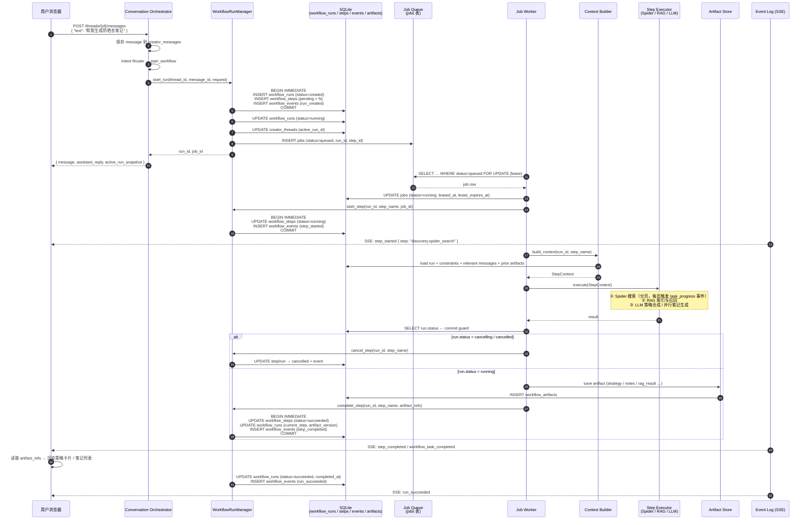
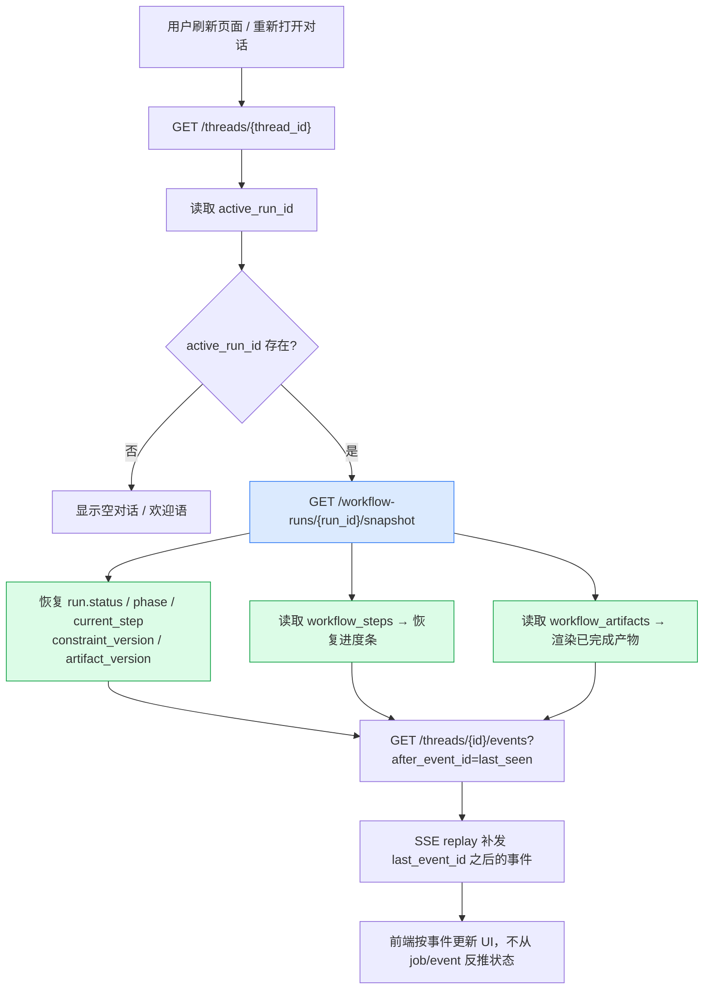
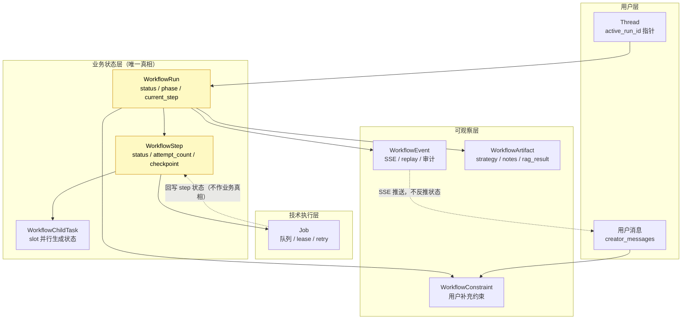
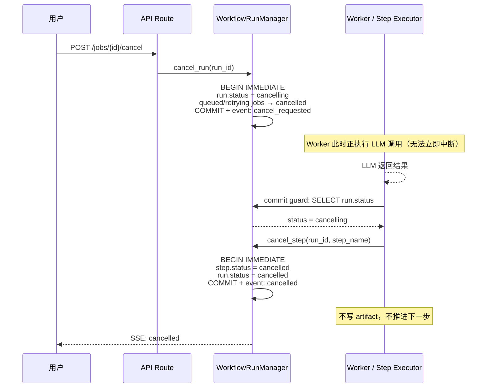

# 请求生命周期全链路流程图

日期：2026-05-18

基于 `20260517_restructure0.1.0.md` 和 `2026-05-16-frontend-scope-v1-v2-alignment.md` 的架构设计。

---

## 1. 主流程：用户请求 → 结果展示

---

## 2. 页面刷新 / 断线恢复

---

## 3. 状态权责分层

---

## 4. 中断 / 取消竞态保护

---

## 5. 数据表权责一览

| 表 | 职责 | 权威性 |
|---|---|---|
| `creator_threads` | 对话容器，持有 `active_run_id` 指针 | 对话路由入口 |
| `creator_messages` | 用户可见对话时间线 | 对话历史 |
| `workflow_runs` | **整体业务状态唯一真相** | ★ 最高 |
| `workflow_steps` | **细粒度执行节点唯一真相** | ★ 最高 |
| `workflow_child_tasks` | 并行生成 slot 状态 | ★ 并行唯一真相 |
| `jobs` | 队列调度 / lease / retry（技术层） | 技术执行 |
| `workflow_events` | SSE 推送 / 断线 replay / 审计 | 可观察，不反推状态 |
| `workflow_artifacts` | 结构化产物引用（strategy / notes / rag）| 产物存储 |
| `workflow_constraints` | 用户运行中补充约束（归一化） | 约束版本管理 |
