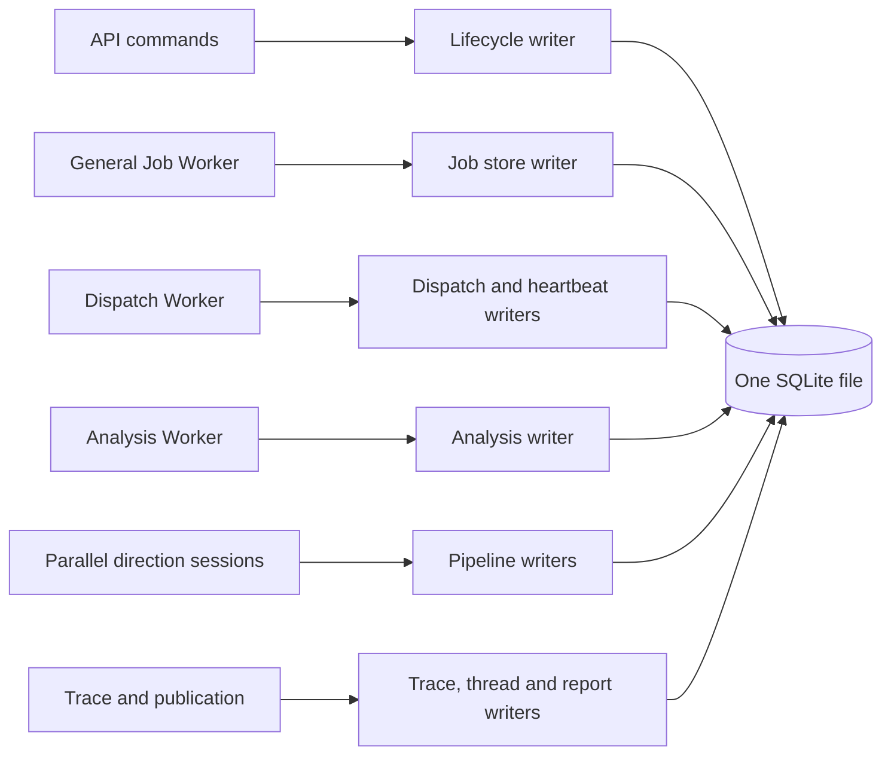
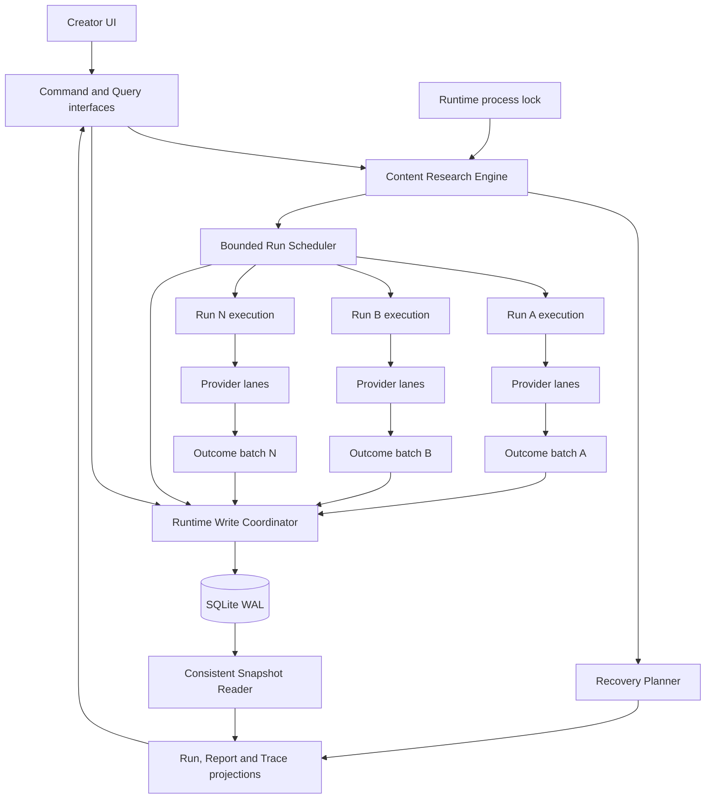
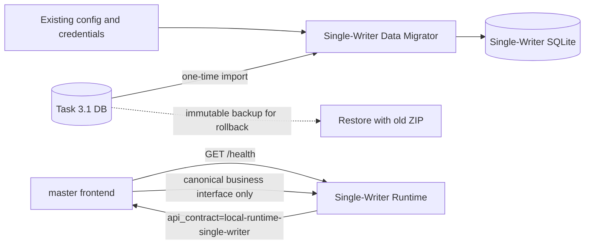
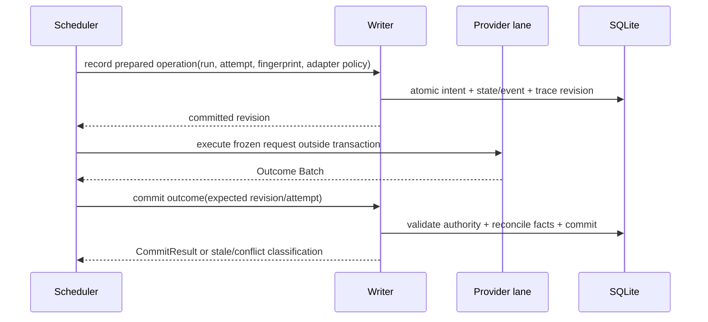

# SQLite Single-Writer Refactor Design

| Field | Decision |
| --- | --- |
| Status | `READY FOR IMPLEMENTATION` — re-audited 2026-08-30 after closing acceptance, cutover, recovery and Snapshot Reader/public-failure gaps |
| Risk | `L2` — persisted lifecycle, concurrent Runs, external calls, crash recovery, historical reads and migration |
| Parent mission | Content Research module refactor paused after Slice 3 |
| Return point | `4f28d5bacd942b8c456330662fd9c7b6d4834d38` |
| Target branch | `codex/refactor-sqlite-single-writer` |
| Capability baseline | Task 3.1 user-visible functions and persisted user data; internal schema/protocol parity is explicitly excluded |
| Release pair | Vercel `master` frontend and Runtime ZIP built from the same approved release SHA, both declaring `local-runtime-single-writer` |

## 1. Problem statement

The packaged Runtime is single-machine and single-user, but it is not single-writer.
One process currently starts independent job, dispatch and analysis workers; one
Content Research Run can fan out into concurrent directions; API commands,
heartbeats, lifecycle transitions, reports, Trace, usage and credentials use
multiple synchronous and asynchronous SQLite connections.

SQLite WAL permits concurrent readers but still permits only one write
transaction per database file. The current implementation leaves arbitration to
SQLite while each persistence module independently chooses connection type,
`BEGIN IMMEDIATE`, busy timeout, retry and transaction boundaries. This has
produced three different failure families:

1. idle workers acquire the only writer reservation and starve useful work;
2. an asynchronous connection yields while holding the writer reservation and
   the event loop enters a synchronous SQLite call, causing self-deadlock;
3. concurrent sessions read the same stale absence, create the same deterministic
   fact and treat an identical committed fact as an immutable conflict.

Point fixes remain correct, but they do not establish one owner for physical
writes, logical idempotency, lifecycle recovery and Trace truth.

## 2. Agreed product and runtime decisions

1. Multiple Content Research Runs may coexist and execute concurrently.
2. `run_id + attempt identity + state revision` isolate Run-owned facts and
   reject stale results.
3. Provider and LLM operations may execute concurrently and must never hold a
   SQLite transaction.
4. Every write to the configured Runtime SQLite file is committed through one
   process-wide writer. This is a physical persistence invariant, not a limit on
   Run concurrency.
5. The scheduler exposes a configurable positive `max_concurrent_runs`.
   Migration slices R1-R5 keep execution capacity at `1`; R6 may switch the
   default to `2` only after retrieval, analysis, publication and Trace all use
   the Writer. The R6 release gate proves two complete concurrent Runs. Later
   capacity changes are operational decisions, not persistence semantics.
6. Provider-specific concurrency and rate limits use independent semaphores.
7. Historical local data/contract conflicts do not expose Retry. A Run is
   recoverable only when a persisted, version-matched safe checkpoint yields an
   explicit Recovery Plan.
8. A new user prompt creates a new Run. Retry always targets the exact existing
   Run and failed attempt named by its Recovery Plan.
9. The target Runtime database remains one file. Existing Task 3.1 user data is
   imported once into the single-writer schema; the Runtime never keeps legacy rows,
   decoders or old write paths active alongside the new model.
10. No dual-write migration is permitted.
11. A mutation is externally accepted only when its transaction and receipt
    have committed. Enqueueing in process memory is not durable acceptance.
12. An interrupted Provider/LLM operation is not automatically retryable. It
    becomes `outcome_unknown` unless that adapter has a documented idempotency
    or reconciliation capability that proves replay safe.
13. Compatibility preserves user capabilities and data, not old implementation
    structure. Store methods, worker/lease protocol, legacy Trace fields, exact
    revision values, table layout, error text and arbitrary old clients are not
    compatibility contracts.
14. Vercel serves only the `master` frontend. The matching release Runtime and
    frontend use one business contract, `local-runtime-single-writer`; no
    dual-generation business endpoint compatibility is provided. `/health` remains the sole minimal
    cross-version bootstrap contract so an old Runtime receives an upgrade
    message before any business request.
15. All user-owned data needed by implemented features is imported: workspace,
    brand/channel/policy data, conversations/messages, completed artifacts and
    Content Research reports/citations/history, topic/decision/publish/
    performance data, and configuration/credentials. A Task 3.1 queued, running
    or recovery-pending Run is never resumed by the Run Scheduler: migration
    stops for user action, or an explicit `archive_incomplete` choice imports it
    as read-only `upgrade_interrupted`.
16. Snapshot read failure, a persisted domain failure and an executable Recovery
    Plan are three different public concepts. The Snapshot Reader returns a
    closed read result; a successful Run/Trace snapshot contains at most one
    typed `PublicFailure` selected by exact persisted authority; only a Recovery
    Plan grants Retry. The frontend maps stable codes to presentation and never
    infers top-level failure or recovery from worker rows, Provider detail order
    or raw error text.

## 3. Goals and non-goals

### Goals

- Make the Runtime SQLite file have one explicit write authority.
- Preserve parallel execution of independent Runs and directions.
- Make state, governed facts, public projection and Trace revision atomic at one
  logical safe boundary.
- Preserve Task 3.1 user capabilities: configuration/login, presearch, Brief and
  Scope decisions, retrieval/evidence, coverage decisions, analysis/report,
  citations, history, cancellation and safe recovery.
- Preserve all migrated user-owned data required by implemented Creator and
  Workspace Console capabilities without preserving old row/response shapes.
- Remove direct write connections, distributed busy retry and writer heartbeats
  after cutover.
- Make future persistence code cross one small interface and inherit the same
  idempotency and fencing rules.
- Define bounded admission, caller cancellation, fatal Writer failure and
  read-after-write behavior rather than leaving them to queue/library defaults.
- Give Run and Domain Trace one shared, typed public-failure projection while
  keeping read-plane uncertainty and Recovery Plan authority separate.

### Non-goals

- Moving to PostgreSQL or another database server.
- Serializing Provider or LLM execution.
- Globally limiting the product to one active Run.
- Redesigning evidence, report or marketing-analysis meaning.
- Retrying unknown external outcomes without a durable recovery contract.
- Supporting old business endpoints, worker-shaped Trace response fields or
  arbitrary old Runtime binaries after the single-writer database activates.
- Resuming a non-terminal Task 3.1 Run across the Scheduler architecture change.

## 4. Current and target architecture

### Current write topology



Every arrow can open its own connection and compete for the same writer
reservation.

### Target topology



Runs and external calls are concurrent. Logical commits are short and serialized
inside the Writer.

### Supported compatibility seams



There are exactly two compatibility seams in production artifacts:

1. an isolated, one-time Task 3.1 data Migrator that is not part of the normal
   persistence interface after the single-writer layout activates;
2. the minimal `/health` bootstrap response (`status`, `version`,
   `api_contract`) used only to accept the matching Runtime or show an upgrade
   message.

There is no legacy business adapter in the target Runtime. The frontend and
Runtime business interface move together as one release pair.

### Compatibility disposition

| Surface | Final policy |
| --- | --- |
| User capabilities | preserve through the capability-parity matrix |
| Workspace/brand/conversation/content/publish/performance data and LLM/XHS configuration | one-way import and expose through canonical projections |
| Non-terminal Task 3.1 Runs | stop migration or explicitly archive as `UPGRADE_INTERRUPTED`; never resume across schedulers |
| `/health` | retain as the minimal stable version/bootstrap interface |
| Semantically useful Content Research route names | may remain; response/command shape is canonical and not dual-generation |
| `runtime_steps`, `runtime_child_tasks`, `active_workflow_session_id`, `active_job_id` fallbacks | remove from the canonical Creator/Content Research interface |
| Legacy `POST /threads/{thread_id}/workflow` forwarding entrypoint | remove when the `master` frontend pairing gate proves no caller; it is not a supported external contract |
| Store methods, SQL connection access, table/column names, lease/heartbeat protocol | discard completely after internal cutover |
| Exact Trace revision values, worker event counts/order, internal error text | not compatibility contracts; preserve only monotonicity, causal truth and safe public error codes |
| Task 3.1 Runtime writing single-writer data / reverse migration | unsupported; rollback restores the immutable Task 3.1 backup |

Keeping a domain route whose meaning remains useful is cheaper than renaming it
for aesthetics. Compatibility is removed where it leaks obsolete worker,
persistence or lifecycle knowledge into the new interfaces.

### Naming standard

New code in this refactor must use responsibility/capability names, never
generation suffixes. The architecture gate rejects new identifiers or persisted
values containing `V1`, `V2`, `_v1`, `_v2`, `-v1` or `-v2` (case-insensitive).
This applies to types, functions, modules, fields, tables, feature flags,
contract values, events and test names.

| Avoid | Required semantic name |
| --- | --- |
| `RuntimeV2`, `runtime_v2` | `SingleWriterRuntime`, `single_writer_runtime` |
| `TraceV2`, `trace_v2` | `DomainTrace`, `domain_trace` |
| `writer_v2` | `writer_owned` |
| `schema_v2`, `schema_version="..._v2"` | `layout="single_writer"` or a named domain contract |
| `local-runtime-v2` | `local-runtime-single-writer` |
| `SQLITE_SINGLE_WRITER_V2` | `SQLITE_WRITE_COORDINATOR_ENABLED` |
| `compatibility gateway` | `Store Mutation Adapter` (internal and temporary) |

Migration ordering may use an internal monotonic migration number or timestamp,
but that number is not embedded in public/domain identifiers. The literal
existing paths under `app/v2/...` appear later only because the writer inventory
must name current files accurately; this refactor introduces no new numbered
identifier and does not expose those paths through an interface.

| ID | Naming evidence |
| --- | --- |
| `STD-NAME-01` | Every new/renamed identifier and persisted contract value in this refactor uses a semantic responsibility/capability name. |
| `ACC-NAME-01` | `test_single_writer_refactor_introduces_no_generation_suffix_identifier` scans new files and added diff lines; frozen fixtures and the literal pre-existing `app/v2/...` inventory paths are the only allowlisted text. |

## 5. Deep modules and interfaces

### 5.1 Runtime Process Lock

The Runtime resolves the configured SQLite database to a canonical database
identity before opening any write-capable connection: absolute real path after
resolving the data-root and symlinks, plus the platform file identity when the
file already exists. The process-lock key is derived from that identity, not
from the spelling of the data-directory path. The Runtime acquires the
exclusive operating-system lock before schema migration, bootstrap or workers.
A second Runtime targeting the same database through an alias or symlink must
exit with a stable, user-readable error. The operating system releases the lock
after process termination.

Before first single-writer activation, the lock identity is the canonical
runtime data manifest plus the Task 3.1 source identity, so two Migrators cannot
create or activate competing targets. After activation, it includes the
manifest-selected single-writer database identity. The same lock is held continuously across assessment,
backup, import, manifest activation and Writer startup.

Schema migrations are the sole pre-Writer write exception and execute under
this lock. In-memory tests use one Writer-owned connection (or one explicitly
shared-memory URI) and do not claim cross-process locking behavior.

This makes single-process ownership explicit and allows process-competition
leases to be removed after cutover. Attempt/revision fencing remains necessary
for late asynchronous work inside the process.

### 5.2 Runtime Write Coordinator

The Coordinator is a process-wide actor backed by a dedicated writer thread and
one SQLite connection. A dedicated thread supports current synchronous and
asynchronous callers without moving the connection between threads.

Its runtime interface is asynchronous and intentionally small:

```text
submit(typed_mutation) -> awaitable CommitResult
read_snapshot(projector, minimum_revision?) -> SnapshotResult
```

A typed mutation contains:

```text
mutation_id
mutation_kind
payload_fingerprint
run_id (optional only for genuinely global facts)
attempt identity (when execution-owned)
expected state revision (when lifecycle-owned)
recovery plan identity/fingerprint (when recovery-owned)
domain payload
```

Callers do not receive a SQLite connection or transaction callback. The
Coordinator owns queueing, connection and transaction mechanics only. Domain
modules own closed, typed mutation handlers registered through a restricted
internal registry; no generic SQL callback and no central `mutation_kind` giant
dispatcher is exposed. A Run-scoped mutation affects at most one Run and
atomically writes its idempotency receipt, domain facts, lifecycle transition,
safe event and that Run's Trace revision. A genuinely global mutation has no
Run Trace revision.

Mutation identity is `(mutation_kind, mutation_id)`. The receipt stores the
payload fingerprint, named result contract and small result/reference fields,
never credentials or large Provider payloads. Replaying the same identity and
fingerprint returns the committed result; reusing it with a different
fingerprint is a terminal mutation-identity conflict. Receipts are retained for
at least as long as the command, Run, job or historical object they protect is
recoverable; this refactor performs no receipt cleanup.

The queue is bounded. Queue saturation rejects before acceptance with
`LOCAL_PERSISTENCE_OVERLOADED`. Enqueue is not an acknowledgement. `CommitResult`
is returned only after the domain transaction and receipt are durable. If a
caller times out or cancels its await after enqueue, it does not cancel a
mutation already executing; replaying the same mutation identity determines
whether it committed. A process crash before commit leaves no receipt and the
same request can be replayed; a crash after commit returns the stored result on
replay. Durable job/Run rows, not the in-memory FIFO, are startup recovery truth.

The Coordinator owns:

- one FIFO command queue;
- one writer connection;
- `BEGIN IMMEDIATE`, commit and rollback;
- common `foreign_keys`, WAL, synchronous and busy configuration;
- mutation idempotency receipts;
- expected revision and attempt fencing;
- exact-content reconciliation for deterministic immutable facts;
- stable error classification;
- bounded/chunked transactions for large evidence sets;
- orderly shutdown: queued-but-not-started requests receive a stable rejection;
  the in-flight transaction either commits durably or rolls back.

The Coordinator never performs Provider, LLM, embedding or filesystem work.
If its thread dies, SQLite reports corruption, or persistence becomes
unavailable (for example disk full), Runtime enters `persistence_unavailable`,
rejects new mutations with a stable safe code, stops scheduling external work,
and requires restart or explicit operator recovery. Read-only diagnostics may
remain available; the UI must not offer a domain Retry for this runtime fault.

Synchronous schema migration runs before Writer startup. During R2, an internal
`StoreMutationAdapter` may temporarily preserve an existing Store method while
converting that method's input into one closed typed mutation submitted to this
same Coordinator. It never exposes a connection, SQL callback or generic
gateway, may block only off the event-loop thread, and is deleted when that
Store's callers adopt the canonical mutation interface. No
`StoreMutationAdapter` may remain in the release artifact. Production domain
code has no synchronous direct-write escape.

### 5.3 Consistent Snapshot Reader

Readers use read-only WAL connections. A Run, Report or Trace projection reads
all required tables inside one read transaction, so it cannot combine lifecycle
state from one revision with facts from another revision.

`CommitResult` includes the committed Run state/Trace revision when applicable.
Snapshots report their observed revision and can require a minimum revision.
The API/UI must not replace a newer projection with a response below that
minimum; this gives callers causal read-after-write behavior in addition to the
frontend request-epoch guard.

The Snapshot Reader is the only production path allowed to compose cross-table
public projections. Simple table-local reads may use internal read adapters, but
may not open a write-capable connection.

Its external seam is one deep interface:

```text
read_domain_trace(run_id, minimum_revision?) -> DomainTraceReadResult
```

`DomainTraceReadResult` is a closed result, not an exception-shaped generic
dictionary:

| Result | Meaning | HTTP/public mapping | Frontend behavior |
| --- | --- | --- | --- |
| `SnapshotFound(snapshot)` | one transaction produced a complete projection at `observed_revision` | `200` Domain Trace | may replace the displayed projection only when it is not older than the accepted revision |
| `SnapshotNotFound(run_id)` | the exact Run does not exist in this data generation | `404 CONTENT_RESEARCH_RUN_NOT_FOUND` | show not-found/history guidance; do not invent a failed Run |
| `SnapshotBehind(observed_revision, minimum_revision)` | bounded wait ended before the causal minimum became visible | `409 SNAPSHOT_MINIMUM_REVISION_NOT_REACHED`, safe revisions, `retryable_read=true` | retain the last trusted projection and retry the read; never regress UI state |
| `SnapshotUnavailable(code)` | a read-only connection, database or projection invariant prevented a trustworthy snapshot | `503 SNAPSHOT_UNAVAILABLE` or safe `500 DOMAIN_TRACE_PROJECTION_FAILED`; no raw exception | mark the read as uncertain and retain the last trusted projection; do not mark the Run failed or expose Retry |

Writer fatal state remains the global `PERSISTENCE_UNAVAILABLE` Runtime/health
condition from `STATE-SQL-09`; it is not rewritten as a Run or Provider failure.
If diagnostics remain readable, they may accompany the last committed snapshot
as Runtime availability metadata, but they do not create a `PublicFailure` or
Recovery Plan for that Run.

Only `SnapshotFound` can change a displayed Run/Report/Trace projection. The
Reader catches implementation exceptions inside the module and converts them
to the closed safe outcomes above. Routers do not expose `str(exception)`, SQL,
paths or arbitrary internal messages. The frontend distinguishes read retry
from domain recovery: `retryable_read` may repeat a GET, while only a current
Recovery Plan may submit a business Retry command.

### 5.4 Bounded Run Scheduler

The Scheduler owns durable execution ordering, not SQLite transactions.

- It may execute multiple Runs concurrently.
- R4 first cuts over with one Run execution slot; it proves queueing,
  cancellation and restart without changing externally observable concurrency.
- R6 enables two or more full Run slots only after every execution-stage writer
  and Trace projection has crossed the single-Writer boundary.
- Each Run advances through its own exact attempt and revision.
- Provider types have independent concurrency semaphores.
- Fairness is enforced at Run dispatch and Writer FIFO boundaries.
- Cancellation advances the Run revision; returned work with an older revision
  cannot commit.
- Restart recovers each Run independently from its durable safe boundary.

The Scheduler projects domain stages and execution units. It does not
synthesize legacy worker steps or child-task rows after cutover.

### 5.5 Provider Execution Lanes

A lane receives frozen input and returns an immutable Outcome Batch. It cannot
access a write-capable store.

An Outcome Batch contains Provider operation status, canonical sources,
direction projections, evidence packets, checkpoints, usage facts and a typed
failure classification. The Writer validates Run and attempt ownership before
committing it.

### 5.6 Recovery Planner

The Recovery Planner is the only authority for retry actions. It consumes a
consistent Run snapshot and produces either no action or one exact Recovery
Plan containing the failed stage, failure class, action, expected attempt,
expected revision and checkpoint references. It also has a stable
`recovery_plan_id` and fingerprint covering those fields. The recovery command
submits both values; the Writer re-derives and validates the exact current plan
inside the same transaction that creates the successor attempt. This prevents a
snapshot-to-command race.

Lifecycle projection, Trace and Creator render the same plan; the command path
validates the same plan. UI code must not infer retryability from a generic
`RECOVERY_REQUIRED` state or error string.

### 5.7 Single-Writer Data Migrator

The Migrator is an isolated module outside the normal Runtime persistence
interface:

```text
inspect(task_3_1_database) -> MigrationAssessment
migrate(source, target, incomplete_policy) -> MigrationReceipt
```

It accepts exactly the frozen Task 3.1 schema or an empty/fresh data root. It
never mutates or replaces the source database. The single-writer database uses
a distinct semantic path; a small atomic runtime data manifest selects it for
the Runtime, while an old ZIP continues to resolve only its Task 3.1 path. Under the
canonical process lock it:

1. requires the Task 3.1 Runtime to be stopped, rejects a busy source with
   `MIGRATION_SOURCE_BUSY`, and creates a consistent timestamped immutable
   source backup while holding the source's SQLite migration lock;
2. inventories every user-owned data family and all Run lifecycle states;
3. stops with `MIGRATION_INCOMPLETE_RUNS_PRESENT` when queued, running or
   recovery-pending Runs exist and no explicit policy was supplied;
4. with `archive_incomplete`, imports those Runs as read-only
   `upgrade_interrupted`, with no Retry or execution authority;
5. materializes user-owned data and completed/terminal history into only the single-writer
   schema while discarding legacy execution mechanics;
6. validates identities, per-family counts, cross-family references and content
   fingerprints, writes a MigrationReceipt, fsyncs and atomically replaces only
   the runtime data manifest to activate the target database.

| Migrated as user-owned data | Deliberately discarded as old mechanics |
| --- | --- |
| workspace/user identity, brands, channels and policy configuration | direct connection/store implementation details |
| threads, visible messages/timeline and completed workflow artifacts | active legacy session/job pointers used as execution authority |
| Content Research terminal/archived Runs, reports, citations and user-visible decisions | job leases, heartbeats, claims and busy-retry counters |
| topic pool, decision, ingestion, publish and performance records | raw worker steps/child tasks and exact event/revision history |
| LLM configuration, XHS credentials and user-relevant usage/accounting | incomplete checkpoints that cannot satisfy the canonical Recovery Plan contract |

A crash leaves the source/backup intact and an unactivated target that can be
rebuilt. Database/config backups remain inside the user data root with the
source's restrictive permissions and are excluded from logs and release
artifacts. After activation, normal Runtime code knows only the single-writer schema. The
Migrator is retained only for the declared Task 3.1 upgrade window and can be
removed without changing the Runtime Writer interface.

### 5.8 Release-Pair Bootstrap Interface

`GET /health` is the only cross-version interface. Its stable bootstrap fields
are `status`, `version` and `api_contract`. The `master` frontend requires
`local-runtime-single-writer`; mismatch renders an upgrade screen and performs zero
workspace or Content Research business requests.

All other HTTP command/query shapes are the canonical business interface and may drop
legacy paths and fields. The Vercel frontend and candidate Runtime ZIP must be
built and browser-tested from the same approved release SHA before production
promotion.

## 6. Data ownership and identity

| Data class | Identity and ownership | Duplicate rule |
| --- | --- | --- |
| Run lifecycle | exact `run_id + state_revision` | duplicate command returns committed projection; stale revision writes nothing |
| Execution attempt | exact Run, execution unit, attempt number and token/revision | at most one active attempt per execution unit; Retry creates a successor and never overwrites its predecessor; only the current attempt may commit |
| Direction-owned facts | Run, direction and attempt/revision | different Runs never alias |
| Run-owned canonical projections | Run plus canonical source identity | exact duplicate succeeds; changed fact fails |
| Globally canonical source identity | platform, source kind and platform source ID; only immutable identity/origin fields live here | exact identity succeeds across Runs; identity disagreement fails |
| Source observation | canonical source, Run, observation/version and captured-at | mutable body/metadata/metrics create a new observation; historical observations remain readable |
| Provider operation | Run, task/lane and operation fingerprint | a completed local result replays; an interrupted result follows the adapter recovery policy below |
| Analysis attempt | Run and analysis attempt number/token | at most one active analysis attempt; Retry creates a successor; readers select the effective non-superseded attempt |
| Report/publication | Run and publication attempt/identity | at most one effective published report per Run; a successor supersedes but does not overwrite history; stale publication is rejected |
| Runtime-global settings | explicit singleton identity | all writes still pass through the file-wide Writer |

`run_id` provides logical isolation but does not provide a physical SQLite write
lock. The Writer provides physical serialization. Shared global identities are
why identity idempotency remains necessary even when Runs are isolated. Mutable
source content, engagement counts and metadata are observations, not canonical
identity, so a later Run may legitimately capture a different version without a
local data conflict.

## 7. Transaction and external-effect protocol



No transaction spans an external call. The local database cannot prove whether
a process crash occurred just before request transmission or after the Provider
accepted or returned it. Therefore every Provider/LLM adapter declares one of:

| Adapter recovery capability | Restart rule |
| --- | --- |
| Provider idempotency key supported and persisted | reconcile/replay with the same key, then commit one result |
| Provider query/reconciliation supported | query the external operation ID and commit the observed result |
| Explicitly repeatable read with product-approved duplicate cost | Recovery Planner may expose an exact manual replay plan; never automatic |
| No proof of safe replay | project `outcome_unknown`; expose no Retry for that operation; user may start a new Run |

An operation is persisted as `prepared` before dispatch and terminal
`succeeded`/`failed` only with a committed outcome. On restart, any non-terminal
operation is conservatively `outcome_unknown` unless its declared adapter
capability proves reconciliation or replay safe. The operation fingerprint
detects duplicate local commands but does not prove the external outcome. Trace
and the normal Run projection expose the same public state and allowed action.

## 8. Contract Pack

### Frozen lifecycle and user state

The single-writer Runtime keeps one authoritative active lifecycle. These are its Run
states and public actions. `fail` may enter
`RECOVERY_REQUIRED` from any non-terminal state, but R0 makes its recovery
action optional and Planner-owned. `cancel` is legal for non-terminal states;
the UI exposes it only where listed. Migration may additionally materialize the
read-only terminal archive state `UPGRADE_INTERRUPTED`; it has no execution or
Retry transition and is never created by normal execution.

| State | Normal successor events | Public actions |
| --- | --- | --- |
| `PRESEARCH_RUNNING` | `presearch_completed` → `BRIEF_CONFIRMATION_REQUIRED` | cancel |
| `BRIEF_CONFIRMATION_REQUIRED` | `revise_subject` → presearch; `confirm_brief` → scope | `revise_subject`, `confirm_brief`, cancel |
| `SCOPE_CONFIRMATION_REQUIRED` | `replace_scope_draft` → same state; `confirm_scope` → `RETRIEVAL_QUEUED` | `replace_scope_draft`, `confirm_scope`, cancel |
| `RETRIEVAL_QUEUED` | worker claimed → `RETRIEVAL_RUNNING` | cancel |
| `RETRIEVAL_RUNNING` | retrieval completed → `COVERAGE_EVALUATING` | cancel |
| `COVERAGE_EVALUATING` | satisfied → report composing; insufficient → coverage decision | none |
| `COVERAGE_DECISION_REQUIRED` | `expand_coverage`/`relax_coverage` → retrieval queued; `generate_limited_report` → report composing | `expand_coverage`, `relax_coverage`, `generate_limited_report`, cancel |
| `REPORT_COMPOSING` | report published → `REPORT_READY` | cancel |
| `RECOVERY_REQUIRED` | exact Planner action → successor attempt/state | exact plan action when present, plus cancel |
| `REPORT_READY` | terminal | none |
| `CANCELLED_OR_FAILED` | terminal | none |
| `UPGRADE_INTERRUPTED` | migration-only read-only terminal archive | none |

| ID | Contract |
| --- | --- |
| `STATE-SQL-01` | Multiple Runs may coexist; capacity may be greater than one only after R6, and every projection is selected by exact `run_id`. |
| `STATE-SQL-02` | Scheduler capacity changes queue timing only; it never changes persisted Run meaning or retry authority. |
| `STATE-SQL-03` | Retry targets the exact failed Run/attempt in a Recovery Plan and creates a successor; a new prompt creates a new Run. |
| `STATE-SQL-04` | Local identity/data-contract conflicts are not recoverable and expose no Retry; their historical lifecycle state remains readable. |
| `STATE-SQL-05` | A cancelled Run remains terminal; late work cannot restore it or publish a report. |
| `STATE-SQL-06` | Task 3.1 user-owned workspace, brand, conversation, completed artifact, Content Research, topic/decision/publish/performance, configuration/credential and terminal-history data is imported and remains usable through canonical projections; old row/response shapes are not preserved. |
| `STATE-SQL-07` | The state/action table above is the frozen public lifecycle; `RECOVERY_REQUIRED` never implies a generic Retry. |
| `STATE-SQL-08` | An interrupted external operation without proven reconciliation is publicly `outcome_unknown` and exposes no automatic Retry. |
| `STATE-SQL-09` | Runtime persistence failure is `persistence_unavailable`, not a Run/provider failure, and exposes no domain Retry. |
| `STATE-SQL-10` | A Task 3.1 queued/running/recovery-pending Run blocks migration unless the user explicitly chooses `archive_incomplete`; archived Runs become read-only `UPGRADE_INTERRUPTED` with no Retry. |
| `STATE-SQL-11` | A `master` frontend/Runtime contract mismatch shows an upgrade state and sends no business request. |
| `STATE-SQL-12` | Snapshot not-found, causal-behind or unavailable is read-plane state, not a persisted Run failure; it never changes lifecycle meaning or grants domain Retry, and the frontend retains any newer trusted projection. |
| `STATE-SQL-13` | A successful normal Run and Domain Trace expose the same optional typed `PublicFailure`; its presence is independent of Retry, which remains authorized only by the optional Recovery Plan. |

### Authority and identity

| ID | Contract |
| --- | --- |
| `AUTH-SQL-01` | The process lock is keyed by canonical database identity and is acquired before migration/bootstrap. |
| `AUTH-SQL-02` | Once R2 activates, the Runtime Write Coordinator is the only write authority for the configured SQLite file. |
| `AUTH-SQL-03` | Run state is owned by exact `run_id + state_revision`; no latest-row inference is allowed. |
| `AUTH-SQL-04` | Execution output is owned by exact Run, execution/analysis attempt and revision. |
| `AUTH-SQL-05` | Recovery Planner is the only authority for public and executable recovery actions. |
| `AUTH-SQL-06` | Canonical source identity is immutable; changing content/metrics are versioned observations. |
| `AUTH-SQL-07` | `(mutation_kind, mutation_id, payload_fingerprint)` identifies one committed result; conflicting reuse is rejected. |
| `AUTH-SQL-08` | Each execution unit has at most one active attempt and each Run at most one effective report; successor history is retained. |
| `AUTH-SQL-09` | Coordinator owns physical queue/transaction mechanics; domain modules own closed typed mutation handlers. |
| `AUTH-SQL-10` | External acceptance occurs only after domain writes and receipt commit; in-memory enqueue is not acceptance. |
| `AUTH-SQL-11` | A committed revision and a Snapshot Reader minimum revision define causal read-after-write truth. |
| `AUTH-SQL-12` | The isolated Migrator is the sole authority allowed to read Task 3.1 schema and atomically activate a validated single-writer database. |
| `AUTH-SQL-13` | The approved release SHA and exact `api_contract=local-runtime-single-writer` identify the only supported `master` frontend/Runtime business pair; `/health` is the sole cross-generation interface. |
| `AUTH-SQL-14` | The Writer/domain mutation owns the exact `blocking_failure_id` for a Run revision; the Snapshot Reader follows and validates that reference, never `latest` or frontend-oriented ranking, to select zero or one top-level `PublicFailure`. |
| `AUTH-SQL-15` | The Snapshot Reader is the only production composer of cross-table public projections; the frontend maps stable public codes to presentation and has no authority to infer top-level failure, recoverability or Retry from detail rows or raw messages. |

### Transition invariants

| ID | From / event / guard / atomic writes / to |
| --- | --- |
| `INV-SQL-01` | Any state + mutation + matching authority / receipt, facts, transition, safe event and Run Trace revision / committed next state and acceptance. |
| `INV-SQL-02` | Runnable operation + current attempt / durable prepared intent before external call / operation non-terminal. |
| `INV-SQL-03` | Operation + Outcome Batch + current attempt/revision / result and dependent facts / next safe state. |
| `INV-SQL-04` | Any non-terminal Run + cancel + matching revision / cancel transition and fencing revision / terminal cancelled. |
| `INV-SQL-05` | Failed Run + exact plan ID/fingerprint still current / successor attempt and event / runnable recovery state. |
| `INV-SQL-06` | Report composing + verified publication + current attempt / publication, effective-report pointer, thread projection and state / report ready. |
| `INV-SQL-07` | Startup + non-terminal external intent / adapter policy proves reconciliation or classify conservatively / reconciled result or `outcome_unknown`. |
| `INV-SQL-08` | After the R7 trigger cutover, one successful Run-scoped logical mutation increments its Trace revision once; global, stale, conflict and rollback mutations increment zero. |
| `INV-SQL-09` | Retry/reclaim + exact failed/expired predecessor / create one successor and supersede predecessor / at most one active attempt. |
| `INV-SQL-10` | Snapshot request + optional minimum revision / one read transaction / internally consistent projection at or above that revision. |
| `INV-SQL-11` | Task 3.1 data root + process lock + migration policy / immutable backup, single-writer materialization, validation receipt and atomic activation / single-writer data root or unchanged source on failure. |
| `INV-SQL-12` | Frontend bootstrap + `/health` contract equality / enable canonical business interface / otherwise render upgrade state and perform no business call. |
| `INV-SQL-13` | Trace request + exact Run + optional minimum revision / one read transaction and closed `DomainTraceReadResult` / trusted snapshot at or above the minimum, not-found, causal-behind or safe unavailable without UI regression. |
| `INV-SQL-14` | Blocking domain failure + current Run/stage/attempt/revision / failure record, `blocking_failure_id`, transition/event and Trace revision atomically / Run and Domain Trace share one typed `PublicFailure`; Recovery Plan remains separately derived. |

### Failure behavior

| ID | Contract |
| --- | --- |
| `FAIL-SQL-01` | Duplicate mutation with the same fingerprint returns the original committed result and creates no duplicate fact/event. |
| `FAIL-SQL-02` | Same immutable identity converges; mutable source content becomes an observation; incompatible identity raises a data conflict. |
| `FAIL-SQL-03` | A stale attempt/revision produces zero business writes, publication or Trace revision delta. |
| `FAIL-SQL-04` | Crash before commit leaves no partial writes or acceptance; replay may execute. Crash after commit replays the receipt/result. Durable jobs, not queued commands, drive startup recovery. |
| `FAIL-SQL-05` | A non-terminal external intent is never blindly replayed; only a declared adapter policy can reconcile it. |
| `FAIL-SQL-06` | Failure/cancellation of Run A creates zero state, report, Recovery Plan or Trace delta for Run B. |
| `FAIL-SQL-07` | A second Runtime, including one using a path alias, cannot migrate, start workers or write the same database. |
| `FAIL-SQL-08` | R2 activates one file-wide path atomically; new Writer and legacy direct Writers are never simultaneously reachable. |
| `FAIL-SQL-09` | Shutdown rejects queued-not-started work; its sole in-flight transaction commits or rolls back and is resolved by replay. |
| `FAIL-SQL-10` | Public errors/receipts contain safe fields, never SQL, table contents, Provider payloads, credentials or secrets. |
| `FAIL-SQL-11` | Queue overload rejects before acceptance with `LOCAL_PERSISTENCE_OVERLOADED` and starts no external side effect. |
| `FAIL-SQL-12` | Writer death/corruption/disk-full makes Runtime `persistence_unavailable`, stops new scheduling and requires restart/operator recovery. |
| `FAIL-SQL-13` | Caller timeout/cancellation does not cancel an executing mutation; same-identity replay resolves the outcome. |
| `FAIL-SQL-14` | Reusing one mutation identity with a different payload fingerprint is a terminal conflict and performs zero business writes. |
| `FAIL-SQL-15` | A live/busy Task 3.1 source blocks migration; migration crash, validation failure or insufficient policy leaves the source/backup intact and never activates a partial single-writer database. |
| `FAIL-SQL-16` | A previous/unknown Runtime is never interpreted through canonical business shapes; mismatch fails fast at `/health` without a legacy business fallback. |
| `FAIL-SQL-17` | Snapshot not-found, minimum-revision timeout, read connection failure, corruption or projection-invariant failure returns a stable safe read outcome; it creates zero Run/report/failure/Recovery Plan/Trace-revision writes and cannot overwrite a newer frontend projection. |
| `FAIL-SQL-18` | Unknown internal or migrated failure classification becomes `unknown_safe_failure` with no inferred Retry or raw text; unknown future public codes receive a safe frontend fallback and no inferred action. |

### Acceptance evidence and contract mapping

Each high-risk contract is first made reachable only in the Slice named here.
The test name is the required observable proof, not a placeholder for a mock-only
unit test.

| ID | First Slice | Contract IDs proven | Observable proof / layer |
| --- | --- | --- | --- |
| `ACC-SQL-01` | R0 | `STATE-SQL-03`, `STATE-SQL-04`, `STATE-SQL-07`, `AUTH-SQL-05`, `INV-SQL-05`, `FAIL-SQL-10` | `test_recovery_plan_is_the_only_retry_authority` — owned stack + intercepted Creator |
| `ACC-SQL-02` | R1 | `AUTH-SQL-01`, `FAIL-SQL-07` | `test_two_runtime_processes_and_path_alias_cannot_share_database` — process integration before migration |
| `ACC-SQL-03` | R1/R2 | `AUTH-SQL-02`, `AUTH-SQL-09`, `FAIL-SQL-08` | `test_all_runtime_write_factories_share_one_writer` — real SQLite + connection instrumentation |
| `ACC-SQL-04` | R1 | `AUTH-SQL-07`, `AUTH-SQL-10`, `INV-SQL-01`, `FAIL-SQL-01`, `FAIL-SQL-04`, `FAIL-SQL-09`, `FAIL-SQL-13`, `FAIL-SQL-14` | `test_writer_admission_receipt_crash_and_caller_cancel_matrix` — fault-controlled Writer/process |
| `ACC-SQL-05` | R1 | `STATE-SQL-09`, `FAIL-SQL-10`, `FAIL-SQL-11`, `FAIL-SQL-12` | `test_writer_overload_and_fatal_failure_are_safe` — bounded queue + disk/thread faults |
| `ACC-SQL-06` | R3 | `STATE-SQL-05`, `AUTH-SQL-03`, `AUTH-SQL-08`, `INV-SQL-04`, `INV-SQL-09`, `FAIL-SQL-03`, `FAIL-SQL-06` | `test_two_runs_commands_attempts_and_cancel_are_isolated` — real owned stack |
| `ACC-SQL-07` | R4 | `STATE-SQL-02`, `AUTH-SQL-04`, `INV-SQL-02`, `FAIL-SQL-04`, `FAIL-SQL-06` | `test_single_slot_scheduler_cancel_crash_and_restart` — fault-controlled scheduler |
| `ACC-SQL-08` | R4/R5 | `STATE-SQL-08`, `INV-SQL-03`, `INV-SQL-07`, `FAIL-SQL-05` | `test_provider_unknown_outcome_policy_matrix` — adapter contract/fault process |
| `ACC-SQL-09` | R5 | `AUTH-SQL-06`, `FAIL-SQL-02` | `test_direction_batches_version_shared_source_observations` — concurrent real SQLite |
| `ACC-SQL-10` | R6 | `STATE-SQL-01`, `STATE-SQL-03`, `AUTH-SQL-08`, `INV-SQL-06`, `FAIL-SQL-06` | `test_two_full_runs_publish_effective_isolated_reports` — browser-to-owned-stack |
| `ACC-SQL-11` | R6/R7 | `AUTH-SQL-11`, `INV-SQL-08`, `INV-SQL-10`, `FAIL-SQL-03` | `test_trace_snapshot_causal_revision_and_trigger_cutover` — real SQLite + long poll |
| `ACC-SQL-12` | R6/R7 | `STATE-SQL-06`, `AUTH-SQL-03`, `AUTH-SQL-04`, `AUTH-SQL-08`, `AUTH-SQL-12`, `INV-SQL-09`, `INV-SQL-11` | `test_task_3_1_user_data_migrates_to_single_writer_capabilities` — copied release database + canonical owned-stack projections |
| `ACC-SQL-13` | R7 | `AUTH-SQL-02`, `AUTH-SQL-09`, `FAIL-SQL-08` | `test_runtime_db_has_no_legacy_write_connection_path` — static allowlist + runtime instrumentation |
| `ACC-SQL-14` | R1/R7 | `STATE-SQL-10`, `AUTH-SQL-12`, `INV-SQL-11`, `FAIL-SQL-15` | `test_migration_incomplete_run_archive_crash_and_backup_restore_matrix` — copied release databases + process faults |
| `ACC-SQL-15` | R7 | all persistence/lifecycle IDs above | capability-parity, backend/frontend, artifact and live credentialed browser gates |
| `ACC-SQL-16` | R7 | `STATE-SQL-11`, `AUTH-SQL-13`, `INV-SQL-12`, `FAIL-SQL-16` | `test_master_frontend_and_runtime_zip_share_single_writer_contract` — actual candidate ZIP + intended `master` frontend browser build |
| `ACC-SQL-17` | R6/R7 | `STATE-SQL-12`, `STATE-SQL-13`, `AUTH-SQL-14`, `AUTH-SQL-15`, `INV-SQL-13`, `INV-SQL-14`, `FAIL-SQL-10`, `FAIL-SQL-17`, `FAIL-SQL-18` | `test_domain_trace_read_outcome_and_public_failure_mapping_matrix` — fault-controlled Snapshot Reader + real owned stack + intended Creator browser |

## 9. Domain Trace interface

### Public capability contract

Domain Trace preserves user-visible observability without preserving the Task 3.1
worker-shaped response. Its interface contains:

- exact Run identity, lifecycle state, current domain stage and state revision;
- domain stage projections and execution units with effective attempts;
- sanitized Provider operations and logical checkpoints;
- evidence/report availability and effective publication identity;
- the same optional Recovery Plan used by commands and Creator;
- safe public failure state;
- Trace revision.

It does not expose or synthesize `runtime_steps`, `runtime_child_tasks`, leases,
heartbeats or raw workflow store rows. The intended `master` frontend moves to
Domain Trace in the same release pair. Migrated Task 3.1 terminal history
receives a canonical archived summary and retains its report/citations; exact
legacy event lists, revision numbers and response shape are not preserved. The
Runtime contains no legacy Trace decoder and the single-writer database
contains no mixed Trace layouts.

### Public failure projection

A successful Domain Trace and its normal Run projection expose the same
optional `public_failure`. It is a typed domain value, not a raw exception and
not a substitute for a Recovery Plan:

```json
{
  "failure_id": "failure_...",
  "scope": "provider",
  "code": "provider_auth_required",
  "stage": "retrieval",
  "status": "failed",
  "attempt_id": "attempt_...",
  "user_action": "reauthenticate_xhs",
  "safe_params": {}
}
```

The public fields are closed:

- `scope` is one of `run`, `stage`, `provider`, `external_operation`, or
  `migration`;
- `status` is one of `failed`, `outcome_unknown`, or `upgrade_interrupted`;
- `user_action` is one of `none`, `refresh`, `reauthenticate_xhs`,
  `configure_llm`, `start_new_run`, or `contact_support`;
- `code` comes from the stable public registry:
  `provider_auth_required`, `provider_timeout`, `provider_rate_limited`,
  `provider_unavailable`, `llm_configuration_required`, `analysis_failed`,
  `report_finalization_failed`, `identity_conflict`,
  `data_contract_conflict`, `outcome_unknown`, `upgrade_interrupted`, or
  `unknown_safe_failure`;
- `safe_params` contains only allowlisted display parameters and never SQL,
  filesystem paths, Provider payloads, credentials or raw exception text.

At each Run state revision there is zero or one authoritative top-level
`PublicFailure`. The Writer/domain mutation that blocks or terminates the Run
persists its exact `blocking_failure_id` atomically with the state transition.
The Snapshot Reader follows that reference and verifies its Run, stage, attempt
and revision ownership. It never chooses the newest failure row, scans detail
arrays for a convenient code or applies a UI-oriented priority ranking.

Multiple failed Provider operations may remain visible as sanitized detail,
but they cannot independently change the top-level Run status, UI action or
Recovery Plan. Imported `UPGRADE_INTERRUPTED` history receives one stable
migration-scoped failure. An unrecognized migrated/internal classification
becomes `unknown_safe_failure` with `user_action=contact_support`; its original
text remains private.

The frontend performs an exhaustive stable-code-to-copy mapping. Unknown future
codes use a safe generic failure presentation and no inferred action. It may
render `user_action`, but it renders a Retry control only from the separate
current Recovery Plan. Canonical Creator code contains no top-level failure
inference from `runtime_steps`, `runtime_child_tasks`, Provider array ordering,
report fallback fields or error-message substring matching.

### Consistent reads

Production Trace must be built from one Snapshot Reader transaction. It may not
open another connection while aggregating lifecycle, workflow, usage, analysis,
publication or evidence facts.

### Revision semantics

Task 3.1 trigger revisions are not a public compatibility contract. Internal
R1-R6 slices may temporarily keep trigger mode only as unreachable scaffolding
on disposable/copy databases; those artifacts are not user releases. Before the
single release, R7 performs one schema transaction under the process lock
that removes covered triggers and enables explicit Writer revisions. No
supported database ever has both mechanisms active. Domain Trace meaning is:

- commit increments once;
- rollback increments zero times;
- a stale or conflicting mutation increments zero times;
- the numeric sequence stays monotonic but callers must not infer row count from
  the delta.

Rollback does not make Task 3.1 understand Domain Trace. Stop the Runtime,
restore the immutable pre-migration database/config backup, then launch the old
ZIP. The single-writer database is never opened for writing by the old implementation.

### Recovery truth

Trace and the normal Run projection expose the same optional safe recovery
shape:

```json
{
  "recoverable": true,
  "action": "retry_retrieval",
  "reason_code": "provider_timeout",
  "recovery_plan_id": "recovery_...",
  "plan_fingerprint": "sha256:...",
  "attempt_no": 2,
  "expected_state_revision": 17
}
```

Creator renders recovery controls only from this shape. Internal SQLite errors,
SQL text, raw Provider payloads and credentials remain private.

`public_failure` and `recovery_plan` are related but independent. A failure can
require reauthentication, refresh, a new Run or operator help without granting
Retry. When a plan exists, its failed stage, attempt and reason must match the
same `blocking_failure_id` snapshot. A read-plane `SnapshotUnavailable` or
`SnapshotBehind` result never contains either object.

An interrupted Provider operation may instead contain
`{"status":"outcome_unknown","recoverable":false}`. This is not converted to
a generic `retry_retrieval` action.

### Concurrent-Run proof

Trace acceptance must run two Runs concurrently and prove:

- each response contains only its Run's stages, attempts, Provider operations
  and Recovery Plan;
- a globally shared canonical source can appear in both projections without
  cross-Run lifecycle state;
- cancelling or retrying one Run creates no revision delta in the other;
- each Trace response is internally consistent at its own revision.

## 10. Migration and rollback

1. Stop Task 3.1 Runtime, resolve canonical source/manifest identities, acquire
   the single-writer process lock and prove the source is not busy before inspection,
   backup, migration or schema bootstrap.
2. A fresh data root creates the single-writer database directly. An activated
   single-writer data root starts normally. Only
   the isolated Migrator may open the frozen Task 3.1 schema.
3. Before import, create an immutable timestamped database backup and preserve
   the existing configuration/credential source. Never migrate in place or
   reuse the Task 3.1 database path for the single-writer database.
4. If non-terminal legacy Runs exist, stop with
   `MIGRATION_INCOMPLETE_RUNS_PRESENT`. The user either finishes/cancels them in
   Task 3.1 or explicitly selects `archive_incomplete`; there is no silent
   cross-Scheduler resume.
5. Build a separate single-writer target containing only canonical tables and projections. Import
   every user-owned data family listed in Section 5.7; archive explicitly
   accepted incomplete Runs as `UPGRADE_INTERRUPTED` and discard their obsolete
   execution mechanics.
6. Validate the MigrationReceipt, content fingerprints, identity counts and
   references before atomically switching the runtime data manifest to the
   distinct single-writer database. A failed/interrupted import never becomes active and
   can be rebuilt from the unchanged source.
7. R1 introduces the Writer dormant. R2 preparatory family commits may use an
   internal `StoreMutationAdapter`, but it is unreachable in user releases and
   deleted before R7. One file-wide flag activates every physical writer path
   together on internal single-writer test databases; no per-store or mixed mode exists.
8. The static allowlist and runtime connection instrumentation become mandatory
   at R2 activation. Only the isolated Migrator before single-writer activation, the Writer
   implementation and verified read-only URI adapters are allowed.
9. The final artifact contains no legacy tables, decoder, business endpoint,
   lease/heartbeat writer, old mutation path or `StoreMutationAdapter`.
10. Rollback means stopping the Runtime, restoring the pre-migration configuration/data
    manifest as needed, and launching the old ZIP against its unchanged Task 3.1
    database. Old code never resolves or writes the single-writer database.

### Write-path inventory that R2 must close

The architecture gate covers the configured Runtime file, not only
`content_research`. The initial inventory is frozen below; implementation must
re-run the repository search and add any newly discovered writer before R2 can
activate.

| Family | Current write-capable locations to adapt or classify |
| --- | --- |
| Runtime jobs/workflows | `app/memory/job_store.py`, `thread_store.py`, `workflow_store.py`, `app/services/workflow_run_manager.py` |
| Session/checkpoint/context | `app/memory/session_state.py`, `session_data_store.py`, `app/services/context_builder.py`, including the write connection passed to `AsyncSqliteSaver` |
| Content Research lifecycle/execution | `app/content_research/lifecycle/coordinator.py`, `execution.py`, `execution_lease.py`, `async_dispatch.py`, `async_pipeline_store.py`, `runtime.py` |
| Content Research facts/publication/Trace | `stores/sqlite_store.py`, `analysis_persistence.py`, `reporting/publication_materializer.py`, `observation/trace_service.py` |
| API direct access | write-capable connections in `app/api/routes/router.py` |
| Runtime settings/accounting | `app/services/llm/configuration_store.py`, `usage_tracker.py`, `xhs_credentials.py` |
| Observation/alerts | `app/observe/alert_evaluator.py` |
| Existing foundation/discovery modules | `app/v2/foundation/bootstrap.py`, `app/v2/foundation/sqlite_store.py`, `app/v2/discovery/service.py` (literal pre-existing paths; not a naming template) |
| Bootstrap/migration exception | `app/content_research/bootstrap.py`, `migrations.py`, and the existing foundation bootstrap only while holding the process lock before Writer startup |

The proof instruments `sqlite3` and `aiosqlite` connection creation, transaction
start and commit against the canonical file identity. Static search alone is not
sufficient because libraries can receive an already-open write connection.

### Forward migration and rollback matrix

R6/R7 fixtures and artifact tests cover user capability/data preservation, not
physical schema or response-shape equality:

| Starting database / interruption | Required result |
| --- | --- |
| Fresh data root | creates one single-writer database; no Migrator/legacy schema is loaded |
| Task 3.1 Runtime/source still active | migration stops with `MIGRATION_SOURCE_BUSY`; no backup/target/manifest activation proceeds |
| Task 3.1 workspace/brand/thread/message/artifact/topic/decision/ingestion/publish/performance data | identities, visible content, relationships and current user-facing selections remain usable through canonical interfaces |
| Task 3.1 completed Run/report | report content, citations, Run identity and terminal history are usable through canonical projections |
| Task 3.1 cancelled/failed Run | imported as read-only terminal history with safe public error data |
| Task 3.1 presearch/confirmation/queued/running/recovery Run without policy | migration stops before activation and lists affected Runs |
| Same non-terminal set with explicit `archive_incomplete` | imported as read-only `UPGRADE_INTERRUPTED`, no Retry/execution authority; user may create a new Run |
| Existing LLM configuration and XHS credentials | remain configured after import without logging or copying secrets into the artifact/receipt |
| Corrupt source, missing reference or fingerprint mismatch | migration fails; source and backup remain intact; partial target is not activated |
| Crash before backup, during import, validation or manifest activation | restart resolves either the unchanged Task 3.1 source or a fully validated single-writer target, never a partial/mixed database |
| Repeat Migrator invocation | existing valid receipt/target converges; no duplicate Run, report, citation or setting |
| Rollback after single-writer activation | stop the Runtime, restore the old runtime data manifest/config selection and launch old ZIP against the unchanged Task 3.1 database; single-writer writes are intentionally not reverse-migrated |
| Domain Trace long-poll | monotonic logical revision, internally consistent response and no regression below requested minimum |

## 11. Ordered vertical slices

### R0 — Truthful recovery action

| Field | Contract |
| --- | --- |
| Outcome | Creator only offers an action that the backend will execute for the exact Run. |
| Contract IDs | `STATE-SQL-03`, `STATE-SQL-04`, `STATE-SQL-07`, `AUTH-SQL-05`, `INV-SQL-05`, `FAIL-SQL-10`, `ACC-SQL-01` |
| Transition | failed/recovery state + exact safe plan → successor recovery; no plan → no mutation/action |
| Authority / transaction | Recovery Planner reads one authoritative snapshot; existing coordinator owns mutation |
| Side effect | none until a valid retry command is accepted |
| Read / UI | Run and Trace expose one shared plan; right rail renders it |
| Failure rows | local immutable conflict, provider timeout, stale plan, historical Run |
| Acceptance RED | `test_recovery_plan_is_the_only_retry_authority` |
| Deployment safety | independent bug fix; no schema change; rollback restores previous projection only |

Inner commits: freeze recovery truth; add pure planner; route backend projection
and command validation; route Creator control; run real owned-stack and browser
proof.

### R1 — Forward-Migration, Runtime Lock and dormant Writer Kernel

| Field | Contract |
| --- | --- |
| Outcome | one Runtime owns the canonical database; an isolated Migrator proves safe one-way import; a dormant Writer proves admission, idempotency and fault behavior |
| Contract IDs | `STATE-SQL-10`, `AUTH-SQL-01`, `AUTH-SQL-07`, `AUTH-SQL-09`, `AUTH-SQL-10`, `AUTH-SQL-11`, `AUTH-SQL-12`, `INV-SQL-01`, `INV-SQL-10`, `INV-SQL-11`, `FAIL-SQL-01`, `FAIL-SQL-04`, `FAIL-SQL-07`, `FAIL-SQL-09`, `FAIL-SQL-10`, `FAIL-SQL-11`, `FAIL-SQL-12`, `FAIL-SQL-13`, `FAIL-SQL-14`, `FAIL-SQL-15`, `ACC-SQL-02`, `ACC-SQL-04`, `ACC-SQL-05`, `ACC-SQL-14` |
| Transition | startup → lock/assessment/migration or single-writer schema/Writer ready; second startup → rejected before inspection/mutation |
| Authority / transaction | process lock; isolated Migrator; dedicated writer thread |
| Side effect | immutable migration backup/target and test-only dormant mutations |
| Read / UI | stable startup, incomplete-Run and archive diagnostics; business behavior unchanged until the single-writer release |
| Failure rows | incomplete legacy Run, migration crash/validation, duplicate/conflicting mutation, caller cancel, queue saturation/shutdown, Writer death, double launch/alias |
| Acceptance RED | process-lock, migration fault matrix and Writer admission/receipt matrix |
| Deployment safety | Migrator/Writer are not registered as mixed production paths; source database is never modified |

Inner commits: lock contract; Migrator assessment/backup/receipt and incomplete
policy; Writer queue/connection; typed mutation receipt; Snapshot Reader; fault
tests; dormant wiring.

### R2 — Shared Runtime stores use one writer

| Field | Contract |
| --- | --- |
| Outcome | every production writer sharing the single-writer file crosses one physical Coordinator while user capability remains unchanged |
| Contract IDs | `AUTH-SQL-02`, `AUTH-SQL-09`, `FAIL-SQL-08`, `ACC-SQL-03`, `ACC-SQL-13` |
| Transition | existing domain mutation → typed Writer mutation → equivalent canonical capability result |
| Authority / transaction | file-wide Writer owns physical commit; domain store retains meaning |
| Side effect | none beyond existing local persistence |
| Read / UI | internal candidates may evolve shapes; only the final canonical interface is a release contract |
| Failure rows | idle polling, session saver, API direct write, credential/usage/alert/foundation update, rollback |
| Acceptance RED | `test_all_runtime_write_factories_share_one_writer` plus the complete single-Run Creator Browser owned-stack suite |
| Deployment safety | preparatory family commits stay dormant; one file-wide flag activates only after inventory/static/runtime gates and the Creator Browser composition gate pass |

Inner commits adapt (a) jobs, (b) thread/workflow/session, (c) settings, usage,
credentials, alerts and foundation modules, then (d) all Content Research/direct API factories.
Each family reruns external behavior tests, but no partial family set is a
shippable or reachable configuration. Immediately after file-wide activation,
the complete deterministic Creator Browser suite must cover presearch → Brief →
Scope → Scheduler claim → Pipeline → report publication before R3 starts.

### R3 — Lifecycle and command mutations use the writer

| Field | Contract |
| --- | --- |
| Outcome | concurrent commands for multiple Runs commit isolated, revision-fenced transitions through one Writer |
| Contract IDs | `STATE-SQL-05`, `STATE-SQL-07`, `AUTH-SQL-03`, `AUTH-SQL-07`, `AUTH-SQL-08`, `INV-SQL-01`, `INV-SQL-04`, `INV-SQL-09`, `FAIL-SQL-01`, `FAIL-SQL-03`, `FAIL-SQL-06`, `ACC-SQL-06` |
| Transition | command + expected state/revision → atomic transition/event/Trace revision |
| Authority / transaction | lifecycle handler inside Writer mutation |
| Side effect | none until durable command acceptance |
| Read / UI | canonical Run projection preserves lifecycle actions without preserving old response shape |
| Failure rows | duplicate, stale, Run A/Run B coexistence, cancel race |
| Acceptance RED | `test_two_runs_commands_attempts_and_cancel_are_isolated` |
| Deployment safety | command-family flag selects exactly one implementation |

### R4 — Scheduler ownership and restart recovery (one execution slot)

| Field | Contract |
| --- | --- |
| Outcome | the new Scheduler owns durable dispatch/cancel/restart while preserving the existing one-Run execution capacity |
| Contract IDs | `STATE-SQL-02`, `STATE-SQL-08`, `AUTH-SQL-04`, `INV-SQL-02`, `INV-SQL-04`, `INV-SQL-07`, `FAIL-SQL-04`, `FAIL-SQL-05`, `FAIL-SQL-06`, `ACC-SQL-07`, `ACC-SQL-08` |
| Transition | durable runnable job → bounded lane → result, interrupted recovery or fenced terminal |
| Authority / transaction | Scheduler owns capacity; Writer owns state; exact attempt/revision fences results |
| Side effect | Provider calls after durable intent only |
| Read / UI | domain stages expose queue/running state; no worker step/child projection |
| Failure rows | queued second Run, cancel during call, process crash, unknown result, starvation |
| Acceptance RED | `test_single_slot_scheduler_cancel_crash_and_restart` |
| Deployment safety | old Worker path disabled only when new Scheduler owns its exact job family |

### R5 — Direction Outcome Batches and shared facts

| Field | Contract |
| --- | --- |
| Outcome | directions return batches; shared identities converge and changing source content is versioned without direct pipeline writes |
| Contract IDs | `AUTH-SQL-04`, `AUTH-SQL-06`, `INV-SQL-02`, `INV-SQL-03`, `FAIL-SQL-02`, `FAIL-SQL-03`, `ACC-SQL-08`, `ACC-SQL-09` |
| Transition | frozen direction input → external outcome → fenced atomic batch commit |
| Authority / transaction | lane has no writer; Writer reconciles Run-owned and global identities |
| Side effect | concurrent XHS calls outside transaction |
| Read / UI | existing evidence, coverage and Provider operation projections |
| Failure rows | same source within/across Runs, changed observation, identity conflict, stale attempt, unknown Provider outcome |
| Acceptance RED | `test_direction_batches_version_shared_source_observations` plus the complete single-Run Creator Browser owned-stack suite |
| Deployment safety | one direction pipeline implementation per Runtime; Task 3.1 capability-parity and Creator Browser composition gates must pass before R5 is marked complete |

### R6 — Analysis, publication and Trace commit model

| Field | Contract |
| --- | --- |
| Outcome | after all execution-stage writers cross the boundary, enable two full Runs and publish isolated, internally consistent Trace snapshots |
| Contract IDs | `STATE-SQL-01`, `STATE-SQL-03`, `STATE-SQL-06`, `AUTH-SQL-04`, `AUTH-SQL-08`, `AUTH-SQL-11`, `INV-SQL-03`, `INV-SQL-06`, `INV-SQL-10`, `FAIL-SQL-03`, `FAIL-SQL-06`, `ACC-SQL-10`, `ACC-SQL-11`, `ACC-SQL-12` |
| Transition | frozen analysis/report input → fenced outcome → atomic publication/state/Trace revision |
| Authority / transaction | Writer owns analysis and publication commit; Snapshot Reader owns Trace projection |
| Side effect | LLM/embedding outside transaction; publication commit local and atomic |
| Read / UI | Domain Trace fields plus the shared Recovery Plan; imported terminal history uses canonical archived projections |
| Failure rows | stale analysis, publication successor race, Run isolation, imported history, stale long-poll response |
| Acceptance RED | `test_two_full_runs_publish_effective_isolated_reports` |
| Deployment safety | capacity remains `1` until in-slice retrieval/analysis/publication/Trace gates pass; then switch to `2`; any trigger-mode scaffolding remains internal and unshipped |

### R7 — Enforce single-writer architecture and remove legacy writers

| Field | Contract |
| --- | --- |
| Outcome | delete all transitional/legacy paths, activate Writer-Owned Trace revision, complete one-way import, and release the matching `master` frontend/Runtime pair |
| Contract IDs | `STATE-SQL-06`, `STATE-SQL-10`, `STATE-SQL-11`, `AUTH-SQL-12`, `AUTH-SQL-13`, `INV-SQL-08`, `INV-SQL-11`, `INV-SQL-12`, `FAIL-SQL-08`, `FAIL-SQL-15`, `FAIL-SQL-16`, `ACC-SQL-11`, `ACC-SQL-12`, `ACC-SQL-13`, `ACC-SQL-14`, `ACC-SQL-15`, `ACC-SQL-16` plus regression of all contracts |
| Transition | internal scaffolding/Task 3.1 source → validated single-writer database and one supported business interface |
| Authority / transaction | Migrator owns one-time activation; afterward process lock + Writer are the only physical authorities |
| Side effect | backup/import/atomic database activation and semantic `api_contract` release promotion |
| Read / UI | intended `master` frontend consumes only canonical projections; migrated terminal history remains usable |
| Failure rows | hidden direct writer, trigger double increment, incomplete/corrupt migration, backup restore, contract mismatch, old endpoint/decoder accidentally reachable |
| Acceptance RED | direct-write/legacy-surface gates, Trace cutover, migration matrix and actual candidate ZIP/frontend contract-pair browser test |
| Deployment safety | no mixed database/protocol; final candidate ZIP, capability parity, artifact gate, backup-restore proof and live browser gate required |

## 12. Tiny commit sequence

Each commit must leave the current reachable path green:

1. freeze Recovery Plan authority and historical local-conflict behavior;
2. derive backend allowed actions from the Recovery Planner;
3. render Creator recovery controls from the same plan;
4. define canonical database process-lock identity and alias/double-launch proof;
5. implement frozen Task 3.1 assessment, immutable backup and MigrationReceipt;
6. import every user-owned data family and enforce incomplete-Run stop-or-archive
   policy on a separate single-writer target;
7. introduce the dormant bounded Writer, typed handlers and dedicated connection;
8. add receipt/fingerprint, caller-cancel, rollback, shutdown and fatal-state tests;
9. introduce causal Consistent Snapshot Reader behavior;
10. add internal Store Mutation Adapters and connection instrumentation;
11. adapt generic job writes behind the still-dormant file flag;
12. adapt thread/workflow/session/checkpoint writes behind the flag;
13. adapt settings, usage, credentials, alerts and foundation writes behind the flag;
14. adapt Content Research and direct API connection factories, then atomically
    activate the file-wide flag and direct-write gate;
15. register lifecycle domain mutation handlers and remove lifecycle SQL callbacks;
16. freeze attempt/report successor cardinality and command isolation;
17. cut over Scheduler ownership with one execution slot;
18. add external-operation adapter policies and unknown-outcome recovery;
19. make Provider lanes return Outcome Batches and version source observations;
20. centralize analysis attempt/checkpoint commits;
21. centralize report publication/effective-report commit;
22. implement Domain Trace and move it to one causal Snapshot Reader while
    retaining legacy trigger revision mode;
23. update Creator to domain stages/recovery and remove old
    `runtime_steps`/`runtime_child_tasks` consumption;
24. enable two full Run slots and prove end-to-end isolation;
25. atomically switch Trace triggers to Writer-Owned Revision;
26. remove transitional adapters, legacy endpoints/decoders, leases, heartbeats,
    direct-write retries and tests that assert discarded implementation shapes;
27. make `ACC-NAME-01` green and rename every new generation-suffixed identifier
    to its semantic responsibility;
28. set the stable `/health` bootstrap and `local-runtime-single-writer` release-pair
    contract;
29. run migration/backup-restore, capability-parity, candidate ZIP/`master`
    browser and live gates; update operational/release docs.

R1-R6 artifacts are internal candidates, not supported user releases. Old
shallow-module tests are deleted once the equivalent behavior is covered
through the new Writer/Scheduler/Trace interfaces; tests are replaced, not
layered indefinitely.

## 13. Verification and release gates

Every observable Slice owns its Acceptance RED and runs focused unit/integration
proof before the existing prebuild gate. In addition:

- R0: real backend plus intercepted Creator recovery control;
- R1: Task 3.1 migration assessment/backup/incomplete/crash matrix,
  double-process and Writer admission/shutdown fault tests;
- R2: complete writer-factory inventory, connection instrumentation, idle
  general worker plus useful Content Research write through one Coordinator,
  followed by the complete deterministic single-Run Creator Browser journey;
- R3: concurrent commands for two Runs and stale revision matrix;
- R4: one execution slot, queued second Run, cancel/crash/restart and
  unknown-outcome policy matrix;
- R5: concurrent directions plus sequential Runs sharing canonical identity and
  versioning changed observations, followed again by the complete deterministic
  single-Run Creator Browser journey through report publication;
- R6: switch to two slots only after two complete published Reports, isolated
  Domain Trace snapshots, long-poll causality and migrated-history capability tests;
- R7: trigger-mode and migration/backup-restore fault matrix, naming,
  legacy-surface and direct-write gates, full backend/frontend, actual candidate ZIP against the
  intended `master` frontend build, artifact gate, capability-parity matrix and
  a live credentialed browser journey.

The R2 and R5 browser journeys are mandatory slice-exit composition gates, not
substitutes for the R7 live-credential release gate. A Provider credential or
network failure in the live canary is recorded separately; it cannot make the
deterministic owned-stack gate green, and a green deterministic gate cannot be
reported as a successful live Provider journey.

The capability-parity matrix verifies workspace/brand/channel state, visible
conversation/artifact history, topic/decision/ingestion/publish/performance
flows, configuration, XHS login, presearch, Brief/Scope revision and
confirmation, retrieval/evidence, coverage decisions, analysis/report/
citations, progress/history, cancel, exact safe Retry and single-writer Runtime restart recovery.
It deliberately ignores table shape, old endpoint/Trace JSON, worker/child-task
counts, exact revision numbers, internal event order and error message text.

Every candidate ZIP is built from a clean commit. The final ZIP and Vercel
frontend are built from the same approved release SHA and both declare
`local-runtime-single-writer`; production promotion is blocked until their real browser
journey passes. Test credentials and copied Runtime data stay in an isolated
temporary data root and are destroyed after the live gate; they never enter the
artifact.

## 14. Design audit closure

| Audit concern | Resolution in this design |
| --- | --- |
| in-memory queue could not recover “accepted” work | acceptance is now receipt/domain commit; enqueue is explicitly not accepted; replay matrix is frozen |
| partial store cutover could leave competing Writers | R2 uses dormant family adapters and one file-wide activation plus an early architecture gate |
| external call intent could not prove outcome | non-terminal calls default to `outcome_unknown`; only declared idempotency/reconciliation permits recovery |
| Trace triggers and Writer could double increment | trigger mode is unshipped internal scaffolding through R6; R7 removes triggers/enables Writer-Owned Revision atomically before the sole release |
| attempt/report cardinality and Retry successor were implicit | explicit one-active/one-effective rules, retained history and exact-plan transactional validation |
| canonical source content can change over time | immutable canonical identity is separated from versioned Run observations |
| writer inventory omitted non-Content-Research modules | inventory now includes session saver, alerts, API, settings/accounting and foundation families with runtime instrumentation |
| historical/rollback proof was one happy-path fixture | one-way import covers every user-owned data family; incomplete Runs require stop-or-archive; migration crash and backup restore are mandatory |
| Acceptance Pack did not map contracts to evidence | every Contract ID is mapped to a named proof and first reachable Slice |
| lock was keyed by data-directory spelling | lock is keyed by canonical database identity and rejects alias/symlink launches before migration |
| permanent legacy compatibility would leak old worker/schema complexity | only the isolated one-time Migrator and `/health` bootstrap remain; canonical interfaces contain no old adapter/decoder |
| Vercel/Runtime pairing was described as generic version skew | production supports only the `master` frontend and Runtime ZIP from the same approved SHA/`local-runtime-single-writer`; mismatch is an upgrade state, not a dual protocol |

## 15. Readiness verdict

`READY FOR IMPLEMENTATION`.

The re-audit found and closed the design-level gaps above. Identity,
cardinality, acceptance, backpressure, write authority, transaction boundaries,
external unknown outcomes, cancellation, retry, crash recovery, migration,
forward migration, backup restore, release pairing, migrated history, Trace
truth and test ownership are explicit. This
does not claim the implementation is already safe: each Slice stays blocked
until its named RED turns green, its owned-stack evidence passes and its
internal candidate preserves the Task 3.1 capability baseline defined above.
