# 架构重构方案 0.1.0

日期：2026-05-17

本文档记录本次 Creator Workbench 架构重构讨论中已经确认的方向，重点覆盖两个问题：

1. 流式消息处理与上下文保存。
2. 可中断、可恢复 Agent 工作流的统一状态管理。

目标是把当前偏产品体验原型的实现，升级为更适合长期迭代和维护的 Agent 工作流架构：状态权责清晰、任务可恢复、事件可追踪、上下文可组合。

## 1. 流式消息与上下文

### 当前判断

当前创作台并不是所有前后端通信都通过 SSE 完成。

现有通信方式如下：

| 信息流 | 通信方式 | 当前用途 |
| --- | --- | --- |
| 用户发送对话消息 | HTTP | `POST /threads/{thread_id}/messages` 保存消息，并返回一次性助手回复。 |
| 用户启动生成任务 | HTTP | `POST /threads/{thread_id}/workflow` 创建 session，并入队 strategy job。 |
| 用户控制任务 | HTTP | 暂停、继续、取消、完成、读取结果都属于命令或查询 API。 |
| workflow 进度 | SSE | `GET /threads/{thread_id}/events` 推送已持久化的 workflow events。 |
| workflow 结果 | HTTP | `GET /threads/{thread_id}/result` 读取结构化策略和笔记结果。 |

当前 SSE 流是“任务进度流”，不是 LLM token 流，也不是 chat message 流。

当前 SSE 事件表达的是：

- 任务准备中。
- 策略任务开始。
- 策略完成。
- 笔记生成任务开始。
- 笔记生成完成。
- 任务失败或取消。

它不会像普通 AI Chat 那样把模型输出逐 token 推给前端。

### 信息类型划分

系统需要明确区分以下信息类型：

| 信息类型 | 例子 | 保存位置 | 主要用途 |
| --- | --- | --- | --- |
| 用户消息 | “帮我生成防晒衣笔记” | Message Timeline | 恢复用户可见对话历史，并参与后续上下文构建。 |
| 助手消息 | “已收到，后台任务继续执行。” | Message Timeline | 恢复用户可见助手回复。 |
| 前端系统提示 | runtime 离线、读取失败 | 通常不持久化 | 本地 UI 反馈。 |
| Workflow event | “正在生成内容策略...” | Event Log | SSE replay、进度展示、审计调试。 |
| Job 控制命令 | pause、resume、cancel | Workflow / Job 状态 | 中断、恢复、取消执行。 |
| Artifact / Result | strategy、notes、proposals、reports | Artifact Store | 结构化产物保存和下游发布使用。 |
| Thread 元数据 | active run/session/job 指针 | Thread / Workflow 元数据 | 页面刷新、切换对话后的恢复入口。 |

### 已确认的目标模型

我们确认不把所有东西都塞进 chat message，也不只依赖 workflow artifact。

目标模型采用三层：

```text
Message Timeline
= 用户可见的对话时间线
= user / assistant / system / tool-status / artifact-reference 等消息

Artifact Store
= 结构化任务产物
= strategy / notes / proposals / similarity_report / publish_candidates / RAG records

Context Builder
= Agent 上下文编排层
= 从 messages + artifacts + constraints + workflow state 中构建本轮 Agent 可消费上下文
```

### 为什么选择这个模型

普通 AI Chat 产品通常会把模型回复保存成一条 assistant message，并把 token 逐步流式写入这条消息。这样做适合纯对话产品，因为 assistant message 天然会成为下一轮对话上下文。

本项目不只是普通对话，而是一个长链路小红书笔记生成工作流：

```text
用户需求
-> 数据搜索 / 采集
-> RAG 索引与召回
-> 策略生成
-> 提案规划
-> 并行笔记生成
-> 相似度检查与重写
-> 结果保存
-> 用户确认
-> 发布候选
```

这些产物需要结构化存储、可恢复、可重试、可版本化，并且后续要进入发布候选和数据闭环。如果全部保存成一条很长的 assistant message，会导致产物难以查询、校验、复用和追踪。

但如果只保存 Artifact，不保留对话时间线，用户后续追问和修改也会变弱。例如：

```text
基于刚才第 2 篇笔记，帮我改得更生活化一点。
```

这种需求同时依赖“用户可见的对话历史”和“结构化生成结果”。

因此最终设计原则是：

- Message Timeline 保留用户体验上的连续性。
- Artifact Store 保留工作流产物的可靠性和结构化能力。
- Context Builder 负责把二者组合成 Agent 可消费上下文。

### 当前必须修复的缺口

当前实现中，运行中用户补充消息会被识别为 `add_constraint`，并关联到 active session/job，但这些消息还没有真正被 Strategy Agent 或 Generation Agent 消费。

目标行为应该是：

```text
用户补充要求
-> 保存到 Message Timeline
-> 归一化为 workflow_constraints
-> 递增 constraint_version
-> Context Builder 在后续 step 或安全边界重规划时注入相关约束
```

因此后续架构必须区分三种上下文：

- 已记录的对话上下文。
- 可恢复的 workflow 上下文。
- Agent 真正消费的执行上下文。

## 2. 统一状态管理

### 当前问题

当前任务状态分散在多个对象里：

```text
creator_threads.status
creator_threads.active_workflow_session_id
creator_threads.active_job_id
sessions.stage
sessions.lifecycle_state
jobs.job_type
jobs.status
session_events.stage
frontend task.stage/status
```

这会导致恢复、展示、调度逻辑都需要互相猜测。

典型歧义场景：

```text
session.stage = strategy
strategy job = succeeded
generate job = queued/running
SSE event = workflow_stage_changed(generate)
thread.active_job_id = 仍然指向 strategy job
frontend task.stage = generation
```

页面刷新后，系统不应该从 job type、event 历史或前端 state 里推断当前业务阶段。必须有一个权威状态源。

### 已确认原则

我们确认引入集中式 workflow 状态管理：

```text
WorkflowRun 管整体业务状态。
WorkflowStep 管真实执行节点进度。
Job 管技术队列执行。
Event 管观察、SSE 和回放。
Artifact 管结构化产物。
Message 管用户可见对话时间线。
Context Builder 管 Agent 上下文编排。
```

关键原则：

- Event 是状态变化的结果，不是状态本身。
- Job 是技术执行单元，不是业务阶段真相。
- Thread 是用户对话容器，不承担 workflow 状态机。
- WorkflowRun 是业务状态唯一真相。
- WorkflowStep 是细粒度执行进度唯一真相。

### 目标分层

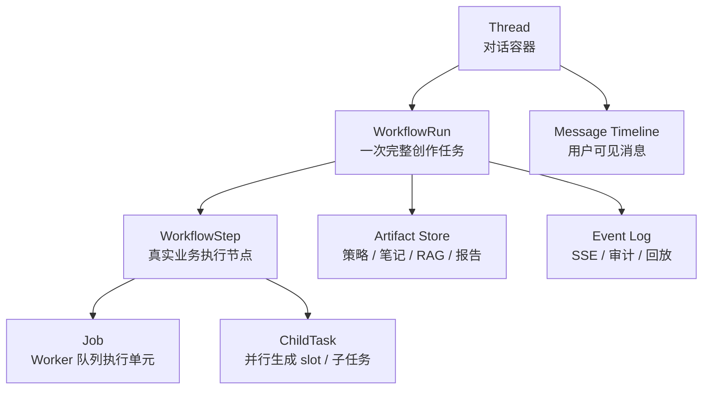

### WorkflowRun

`WorkflowRun` 表示一个 Thread 下的一次完整创作任务。

它负责回答：

- 这个任务整体还能不能继续？
- 当前处于哪个大阶段？
- 当前真实执行节点是什么？
- 当前哪个 job 正在执行？
- 当前使用哪个约束版本和产物版本？

建议字段：

```text
workflow_runs
- run_id
- thread_id
- status
- phase
- current_step
- active_job_id
- active_job_type
- constraint_version
- artifact_version
- interrupt_policy
- created_at
- updated_at
```

建议 `run_status`：

```text
created
running
waiting_user
pausing
paused
cancelling
cancelled
succeeded
failed
```

建议 `run_phase`：

```text
intake
context
discovery
retrieval
strategy
generation
finalization
review
```

`run_phase` 是产品和业务大阶段，不负责表达所有细节。细粒度进度交给 `WorkflowStep`。

### WorkflowStep

`WorkflowStep` 表示真实业务执行节点。Spider 搜索、RAG、LLM 策略生成、并行笔记生成、相似度检查、结果持久化都应该成为可跟踪 step。

建议 `step_status`：

```text
pending
running
retrying
skipped
succeeded
failed
cancelled
```

建议 step 枚举：

```text
intake.capture_request

context.build_context
context.load_constraints
context.load_previous_artifacts

discovery.plan_queries
discovery.spider_search
discovery.assess_source_quality
discovery.expand_queries
discovery.persist_sources

retrieval.rag_index
retrieval.rag_retrieve

strategy.prepare_prompt
strategy.llm_synthesize
strategy.validate_strategy
strategy.persist_strategy

generation.plan_proposals
generation.select_proposals
generation.generate_notes_parallel
generation.similarity_check
generation.rewrite_or_reselect
generation.aggregate_notes

finalization.persist_artifacts
finalization.emit_result_ready

review.await_user_acceptance
review.publish_candidates
```

这样系统可以清晰表达：

```text
run_phase = discovery
current_step = discovery.spider_search
step_status = retrying
```

或者：

```text
run_phase = generation
current_step = generation.generate_notes_parallel
step_status = running
```

### 并行生成 ChildTask

LLM 并行生成笔记不能藏在一个粗粒度 `generation` 状态里，否则无法知道 5 路生成里谁成功、谁失败、谁正在重试。

建议新增：

```text
workflow_child_tasks
- child_task_id
- run_id
- step_id
- task_type
- slot_index
- proposal_id
- status
- attempt_count
- max_attempts
- note_id
- error_code
- error_message
- created_at
- updated_at
```

建议 child task 状态：

```text
pending
running
retrying
succeeded
failed
skipped
cancelled
```

这样可以恢复和展示：

```text
slot 1 succeeded
slot 2 retrying
slot 3 failed
slot 4 running
slot 5 pending
```

### Job

`Job` 仍然需要保留，用来保障 worker 可靠执行：

```text
queued
running
retrying
paused
succeeded
failed
cancelled
```

但 `Job.status` 不再作为用户可见业务状态。它只负责：

- 队列调度。
- lease。
- retry。
- worker 崩溃恢复。
- 技术执行状态追踪。

UI 恢复应该读取 `WorkflowRun + WorkflowStep`，而不是从 `Job.status` 推断业务阶段。

### Event

`Event` 负责：

- SSE 推送。
- 断线 replay。
- 进度展示。
- 审计和调试。

Event 原则：

```text
先发生状态转换。
再追加 event。
不能反过来从 event 推断当前状态。
```

### WorkflowRunManager

所有状态转换必须集中到一个模块：

```text
WorkflowRunManager
```

API route、Worker、Agent 都不应该直接修改 workflow 状态表，而是调用 `WorkflowRunManager`。

建议方法：

```text
start_run(thread_id, user_message)

start_step(run_id, step_name)
complete_step(run_id, step_name, artifacts)
fail_step(run_id, step_name, error)
retry_step(run_id, step_name, retry_policy)
skip_step(run_id, step_name, reason)

pause_run(run_id)
resume_run(run_id)
cancel_run(run_id)

start_child_task(run_id, step_id, slot_index)
complete_child_task(...)
fail_child_task(...)

attach_artifact(run_id, artifact_type, artifact_id)
append_event(run_id, event_type, payload)
```

每个状态转换方法必须统一完成：

1. 校验当前状态是否允许转换。
2. 更新 `workflow_runs`、`workflow_steps` 和 child task 状态。
3. 必要时更新 active job 指针。
4. 必要时写入 artifact 或 artifact reference。
5. 追加 workflow event，供 SSE 和审计使用。

### WorkflowRunManager 接口定版

#### Run 级别

```text
start_run(thread_id, user_message_id, initial_request)
pause_run(run_id, reason)
resume_run(run_id)
cancel_run(run_id, reason)
fail_run(run_id, error)
complete_run(run_id)
get_run_snapshot(run_id)
```

#### Step 级别

```text
initialize_steps(run_id, workflow_template)
start_step(run_id, step_name, job_id)
complete_step(run_id, step_name, artifact_refs)
retry_step(run_id, step_name, error, next_retry_at)
fail_step(run_id, step_name, error)
skip_step(run_id, step_name, reason)
cancel_step(run_id, step_name, reason)
advance_to_next_step(run_id)
```

#### ChildTask 级别

```text
create_child_tasks(run_id, step_id, tasks)
start_child_task(child_task_id)
complete_child_task(child_task_id, artifact_refs)
retry_child_task(child_task_id, error)
fail_child_task(child_task_id, error)
cancel_child_task(child_task_id)
```

#### Artifact / Constraint 级别

```text
attach_artifact(run_id, artifact)
add_constraint(run_id, message_id, normalized_constraint)
mark_constraint_applied(run_id, constraint_id, step_id)
```

#### Event 级别

```text
append_event(run_id, event_type, payload)
list_events(run_id, after_event_id)
```

所有状态转换接口必须遵守：

```text
BEGIN IMMEDIATE
读取当前状态
校验转换
更新 run / step / child_task / artifact / constraint
插入 workflow_event
COMMIT
```

### 推荐数据表

最终设计应新增或收敛到：

```text
workflow_runs
workflow_steps
workflow_child_tasks
workflow_events
workflow_artifacts
workflow_constraints
```

当前已有的 `sessions`、`jobs`、`session_events`、`strategy_data`、`generation_data` 可以迁移或兼容桥接，但最终权责要明确：

| 表 / 概念 | 最终职责 |
| --- | --- |
| `threads` | 对话容器和 active run 指针。 |
| `workflow_runs` | 整体业务状态唯一真相。 |
| `workflow_steps` | 真实执行节点进度唯一真相。 |
| `jobs` | 队列执行可靠性。 |
| `workflow_events` | SSE、回放、审计。 |
| `workflow_artifacts` | 结构化产物引用。 |
| `workflow_constraints` | 从用户消息归一化出的任务约束。 |
| `messages` | 用户可见对话时间线。 |

### 新 Schema 定版

#### `workflow_runs`

```text
run_id PK
thread_id
user_id
status
phase
current_step
active_job_id nullable
active_job_type nullable
constraint_version default 0
artifact_version default 0
interrupt_policy
source_message_id
created_at
updated_at
started_at nullable
completed_at nullable
failed_at nullable
cancelled_at nullable
error_code nullable
error_message nullable
```

`status`：

```text
created
running
waiting_user
pausing
paused
cancelling
cancelled
succeeded
failed
```

`phase`：

```text
intake
context
discovery
retrieval
strategy
generation
finalization
review
```

#### `workflow_steps`

```text
step_id PK
run_id
step_name
phase
status
attempt_count
max_attempts
input_hash
checkpoint_json
output_artifact_refs_json
active_job_id nullable
started_at nullable
completed_at nullable
next_retry_at nullable
error_code nullable
error_message nullable
created_at
updated_at
```

`status`：

```text
pending
running
retrying
skipped
succeeded
failed
cancelled
```

#### `workflow_child_tasks`

```text
child_task_id PK
run_id
step_id
task_type
slot_index nullable
proposal_id nullable
status
attempt_count
max_attempts
input_hash nullable
checkpoint_json nullable
output_artifact_refs_json nullable
note_id nullable
started_at nullable
completed_at nullable
error_code nullable
error_message nullable
created_at
updated_at
```

#### `workflow_events`

```text
event_id integer autoincrement PK
run_id
thread_id
step_id nullable
child_task_id nullable
job_id nullable
event_type
event_level
payload_json
created_at
```

`workflow_events` 只负责 SSE、审计、回放，不作为状态真相。

#### `workflow_artifacts`

```text
artifact_id PK
run_id
thread_id
artifact_type
artifact_version
parent_artifact_id nullable
status
storage_table nullable
storage_key nullable
payload_json nullable
summary_text nullable
created_by_step_id nullable
created_at
updated_at
```

`artifact_type`：

```text
source_snapshot
rag_index
rag_result
strategy
proposal
generated_note
similarity_report
final_result
publish_candidate
```

#### `workflow_constraints`

```text
constraint_id PK
run_id
thread_id
message_id
constraint_version
raw_text
constraint_type
scope
target_artifact_id nullable
effective_from_step nullable
impact_level
status
confidence
normalized_json
created_at
applied_at nullable
```

`constraint_type`：

```text
style
topic_change
target_audience
format
forbidden_words
brand_policy
quantity_change
artifact_revision
```

### 迁移策略定版

采用“新模型主导 + 旧模型兼容桥接”，不继续在旧 `sessions.stage + jobs.status + session_events` 上打补丁。

#### 第一阶段：新增 workflow 表

新增：

```text
workflow_runs
workflow_steps
workflow_child_tasks
workflow_events
workflow_artifacts
workflow_constraints
```

旧表保留：

```text
creator_threads
creator_messages
sessions
jobs
session_events
strategy_data
generation_data
```

#### 第二阶段：Thread 增加新指针

给 `creator_threads` 增加：

```text
active_run_id
```

旧字段暂时保留：

```text
active_workflow_session_id
active_job_id
```

新逻辑只看 `active_run_id`，旧字段作为兼容 fallback。

#### 第三阶段：Job 增加关联字段

给 `jobs` 增加：

```text
run_id nullable
step_id nullable
child_task_id nullable
```

`Job` 仍然负责队列执行，但能回写到对应 step 或 child task。

#### 第四阶段：Artifact 兼容旧数据

旧的 `strategy_data`、`generation_data` 不急着删除。新 `workflow_artifacts` 可以通过引用旧表承载历史产物：

```text
storage_table = strategy_data
storage_key = strategy_id
```

或：

```text
storage_table = generation_data
storage_key = note_id
```

#### 第五阶段：新 workflow 全走新模型

新创建任务只走：

```text
Thread.active_run_id
-> WorkflowRun
-> WorkflowStep
-> Job(run_id / step_id / child_task_id)
-> WorkflowEvent
-> WorkflowArtifact
```

旧 session API 可以保留到稳定后再废弃。

### WorkflowRun 状态机

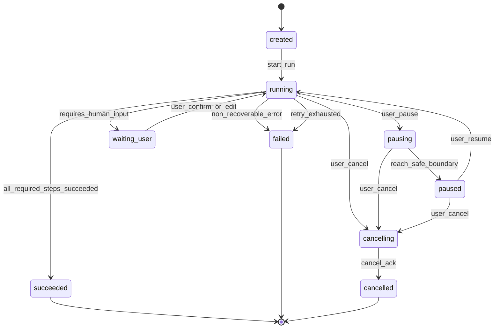

### 目标执行流程

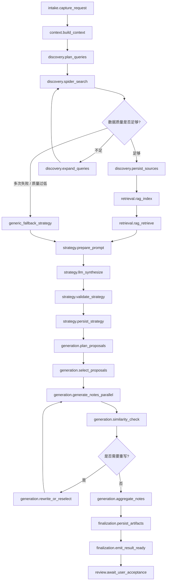

## 3. 可中断、可恢复工作流

### 业界共识

长任务中断恢复的主流共识不是依赖前端状态，也不是依赖 SSE 本身，而是：

```text
后端持久化 workflow/run 状态
+ step/task 状态
+ event/history
+ artifact/checkpoint
+ retry/interrupt/cancel 语义
```

典型开源项目和框架的设计思想：

| 系统 | 相关概念 | 对本项目的启发 |
| --- | --- | --- |
| Temporal | Workflow Execution、Activity、Signal、Event History | Workflow 编排与外部副作用分离；中断通过 signal/cancel request，在安全边界生效。 |
| LangGraph | Graph state、checkpoint、interrupt、resume | 每个节点可持久化状态，人工中断后可从 checkpoint 恢复。 |
| Airflow | DAG Run、Task Instance、task states、retry | 顶层 run 和具体 task 分层，task 有独立状态和 retry 生命周期。 |
| Prefect | Flow Run、Task Run、state lifecycle | Flow/Task 状态分层，任务失败、重试、取消都显式建模。 |

对应到本项目：

| 业界概念 | 本项目目标设计 |
| --- | --- |
| Workflow Execution / Flow Run / DAG Run | `WorkflowRun` |
| Activity / Task / Node / Task Instance | `WorkflowStep` |
| Parallel / mapped task | `WorkflowChildTask` |
| Event History / Logs | `WorkflowEvent` |
| Durable checkpoint | `WorkflowRun + WorkflowStep + Artifact` |
| Signal / interrupt / cancel request | `pause_run / cancel_run / waiting_user` |
| Retry policy | step retry policy + job retry |
| Artifact output | `WorkflowArtifact` |
| Executor / Queue | `Job` |

因此，当前确认的新方案与业界长任务编排共识一致：`WorkflowRunManager + WorkflowStep + ChildTask + Event + Artifact + Job Queue` 可以作为项目内轻量 durable workflow engine。

### 核心契约

可中断、可恢复工作流必须具备四个契约：

1. **状态真相契约**：当前任务在哪一步、是否暂停、是否取消、是否失败，只看 `WorkflowRun / WorkflowStep`。
2. **安全边界契约**：LLM、Spider 等外部调用通常不能物理立即停止，只能在安全边界响应暂停或取消。
3. **幂等执行契约**：每个 step 必须定义成功后是否可跳过、重试是否会重复写数据、artifact 是否可 upsert。
4. **恢复重放契约**：UI 恢复靠 snapshot，进度补发靠 event replay，不能从 event 反推当前状态。

### 中断语义

需要明确区分：

```text
pause
= 用户希望暂时停住任务，之后还能继续。

cancel
= 用户希望终止任务，不再继续后续 step。

retry
= 系统遇到可恢复错误，自动重试当前 step/job。

recover
= worker 崩溃、服务重启、页面刷新后，从 DB 还原状态。

rerun
= 用户基于同一 Thread 再跑一次新版本 workflow。
```

这些不能混成一个“停止”。

### 暂停流程

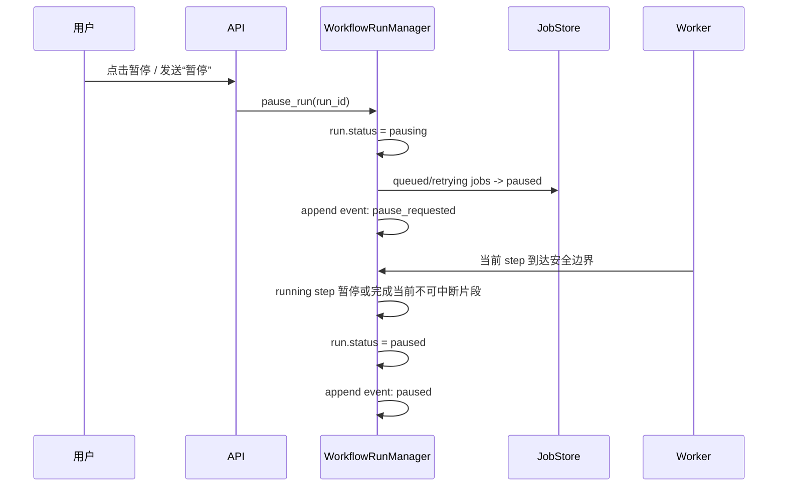

暂停不是强制杀掉正在执行的外部调用。对于 LLM 和 Spider 这类调用，通常是当前调用返回后，在安全边界进入 paused。

### 取消流程

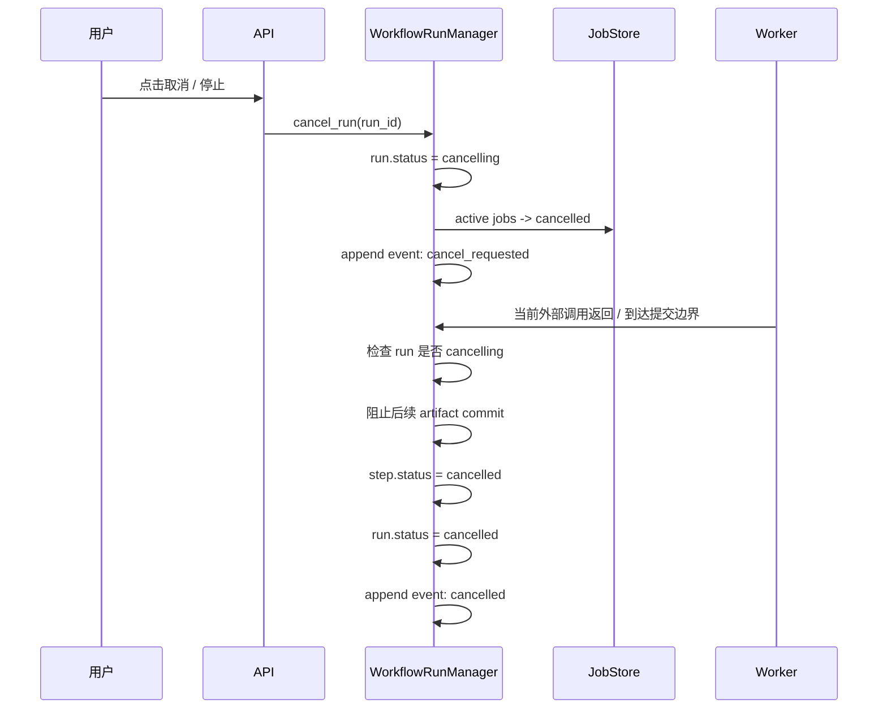

取消需要 commit guard：

```text
外部调用返回
-> 准备写 artifact
-> 先检查 run.status
-> 如果 run.status 是 cancelling/cancelled，不写成功产物，不推进下一步
```

### 安全边界

每个 step 都应该声明自己的中断策略：

| 中断策略 | 适用场景 | 行为 |
| --- | --- | --- |
| `immediate` | 尚未开始、排队中、等待用户中 | 立即暂停或取消。 |
| `cooperative` | 可循环检查状态的任务 | 在循环或子任务边界检查 run status。 |
| `step_boundary` | LLM、Spider 等单次外部调用 | 当前调用结束后生效。 |
| `non_interruptible` | 极短或必须原子提交的动作 | 完成后再处理暂停或取消。 |

建议映射：

| Step | 建议中断策略 |
| --- | --- |
| `discovery.spider_search` | `step_boundary` 或 `cooperative` |
| `strategy.llm_synthesize` | `step_boundary` |
| `generation.generate_notes_parallel` | `cooperative` + child task boundary |
| `finalization.persist_artifacts` | `non_interruptible`，但必须幂等 |
| `review.await_user_acceptance` | `immediate` |

### 恢复机制

恢复分三类。

#### 页面刷新恢复

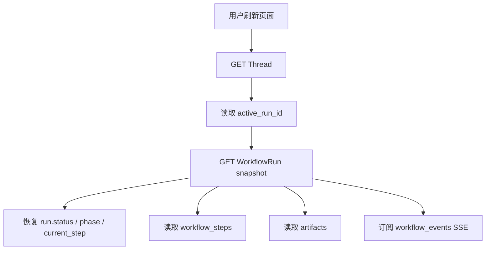

UI 不从 job/event 猜状态，而是读取权威 snapshot。

#### SSE 断线恢复

```text
前端保存 last_event_id
-> SSE 重连
-> 后端 replay workflow_events where event_id > last_event_id
```

SSE 只负责补发进度，不决定当前状态。

#### Worker 崩溃恢复

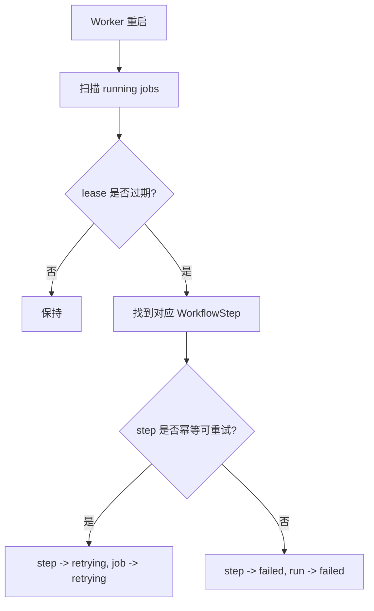

Worker 恢复依赖 `WorkflowStep` checkpoint 和幂等规则，而不是简单从头重跑。

### Step 幂等规则

每个 step 要保存足够的恢复信息：

```text
step_name
status
attempt_count
max_attempts
input_hash
checkpoint_json
output_artifact_refs
started_at
completed_at
error_code
error_message
```

每个 step 要定义：

```text
如果 step.status = succeeded，且 output_artifact_refs 完整，
恢复时是否可以直接复用结果并跳过执行。
```

这就是“succeeded 是否可跳过”。

例如：

| Step | succeeded 后是否可跳过 | 原因 |
| --- | --- | --- |
| `discovery.spider_search` | 可以，但必须有 source artifact | 已保存搜索结果后，恢复时不必重新搜。 |
| `retrieval.rag_index` | 可以，但要检查 index_version | 索引已构建则复用。 |
| `strategy.llm_synthesize` | 可以 | 策略 artifact 已保存，避免 LLM 重生成导致不一致。 |
| `generation.generate_notes_parallel` | 部分可以 | 已成功的 slot 跳过，失败或未完成 slot 重跑。 |
| `finalization.persist_artifacts` | 可以重复执行，但必须幂等 | 用 upsert / unique key / artifact version 防重复写入。 |
| `review.await_user_acceptance` | 不叫跳过，应该恢复等待状态 | 继续等待用户确认。 |

推荐执行逻辑：

```text
run_step(step):
  if step.status == succeeded and step.output_artifact_refs 完整:
      return step.output_artifact_refs

  execute_step()
```

### 并行生成恢复

并行生成必须依赖 child task 状态恢复：

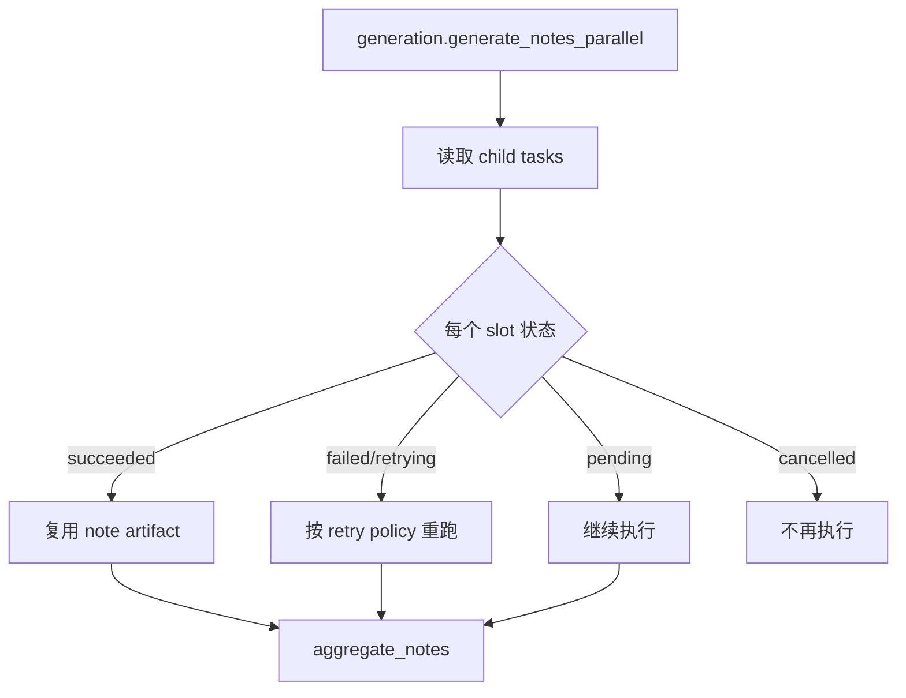

这样服务中断后，不需要把 5 篇笔记全部重跑。

### WorkflowRunManager 执行循环

所有 step 应遵守统一执行模式：

```text
run_step(run_id, step_name):
  manager.start_step(run_id, step_name)

  if manager.should_stop(run_id):
    manager.pause_or_cancel_at_boundary(run_id, step_name)
    return

  result = execute_step()

  if manager.should_cancel_before_commit(run_id):
    manager.cancel_step(run_id, step_name)
    return

  manager.attach_artifact(...)
  manager.complete_step(run_id, step_name)
  manager.advance_to_next_step(run_id)
```

### 最终设计效果

用户点击暂停：

```text
running -> pausing -> paused
```

用户点击继续：

```text
paused -> running
从 current_step 或下一个 pending step 继续
```

用户点击取消：

```text
running / pausing / paused -> cancelling -> cancelled
不再推进后续 step
```

Worker 崩溃：

```text
running job lease expired
-> step retrying 或 failed
-> run 仍可恢复
```

页面刷新：

```text
Thread -> active_run_id -> WorkflowRun snapshot
直接恢复 UI
```

## 4. 任务状态转换与异常时序

### Command 与 Transition 分离

所有状态变化都必须通过 `WorkflowRunManager`。

```text
Command = 请求发生某事
Transition = 确认某事已经发生
```

示例：

| 类型 | 例子 | 来源 |
| --- | --- | --- |
| Command | `pause_run` | 用户点击暂停或发送“暂停”。 |
| Command | `cancel_run` | 用户点击停止或发送“取消”。 |
| Command | `resume_run` | 用户点击继续或发送“继续”。 |
| Command | `add_constraint` | 用户补充要求。 |
| Transition | `step_started` | Worker 确认 step 开始执行。 |
| Transition | `step_completed` | Worker 确认 step 成功完成。 |
| Transition | `step_failed` | Worker 确认 step 失败。 |
| Transition | `step_retry_scheduled` | Manager 安排 step/job 重试。 |
| Transition | `run_succeeded` | 所有 required steps 完成。 |
| Transition | `run_cancelled` | 取消已在安全边界生效。 |

必须避免把“请求”和“已发生”混在一起：

```text
用户点击暂停 != 任务已经暂停
用户点击取消 != 外部调用已经停止
LLM 返回结果 != 结果一定可以 commit
SSE 发出事件 != 状态已经改变
```

正确顺序：

```text
Command
-> 状态校验
-> 状态转换
-> 写 Event
-> SSE 展示
```

### WorkflowRun 状态转换表

`WorkflowRun.status`：

```text
created
running
waiting_user
pausing
paused
cancelling
cancelled
succeeded
failed
```

转换表：

| From | To | 触发 | 允许条件 |
| --- | --- | --- | --- |
| `created` | `running` | `start_run` | run 已创建，至少有首个 pending step。 |
| `running` | `pausing` | `pause_run` | 当前 run 可暂停。 |
| `pausing` | `paused` | `pause_ack` | 当前 step 到达安全边界。 |
| `paused` | `running` | `resume_run` | run 未 cancelled / failed / succeeded。 |
| `running` | `cancelling` | `cancel_run` | 当前 run 可取消。 |
| `pausing` | `cancelling` | `cancel_run` | 暂停过程中用户取消。 |
| `paused` | `cancelling` | `cancel_run` | 暂停后用户取消。 |
| `cancelling` | `cancelled` | `cancel_ack` | active step/job 已终止或被 commit guard 拦截。 |
| `running` | `waiting_user` | `require_user_input` | step 明确需要人工确认。 |
| `waiting_user` | `running` | `user_continue` | 用户提交确认或编辑。 |
| `running` | `succeeded` | `complete_run` | 所有 required steps 成功。 |
| `running` | `failed` | `fail_run` | 不可恢复错误或重试耗尽。 |
| `pausing` | `failed` | `fail_run` | 暂停途中发生不可恢复错误。 |

终态：

```text
cancelled
succeeded
failed
```

终态不允许再转换。用户如果要继续，应创建新的 `WorkflowRun`。

### WorkflowStep 状态转换表

`WorkflowStep.status`：

```text
pending
running
retrying
skipped
succeeded
failed
cancelled
```

转换表：

| From | To | 触发 | 允许条件 |
| --- | --- | --- | --- |
| `pending` | `running` | `start_step` | `run.status = running`。 |
| `retrying` | `running` | `start_step` | 到达 retry 时间。 |
| `running` | `succeeded` | `complete_step` | run 未 cancelling/cancelled，commit guard 通过。 |
| `running` | `retrying` | `retry_step` | 可恢复错误，attempt 未超限。 |
| `running` | `failed` | `fail_step` | 不可恢复错误或重试耗尽。 |
| `running` | `cancelled` | `cancel_step` | `run.status = cancelling/cancelled`。 |
| `pending` | `skipped` | `skip_step` | 上游条件决定不需要执行。 |
| `pending` | `cancelled` | `cancel_run` | run 进入 cancelling。 |
| `retrying` | `cancelled` | `cancel_run` | run 进入 cancelling。 |
| `failed` | `retrying` | `manual_retry` | 只有人工或策略明确允许。 |

Step 终态：

```text
succeeded
skipped
failed
cancelled
```

原则：

```text
Step 一旦 succeeded，不要改回 running。
如果要重新生成，创建新的 run 或新的 step_attempt / artifact version。
```

### Job 状态转换表

`Job` 是技术执行状态，不是业务状态。

`Job.status`：

```text
queued
running
retrying
paused
succeeded
failed
cancelled
```

转换表：

| From | To | 触发 |
| --- | --- | --- |
| `queued` | `running` | Worker lease。 |
| `retrying` | `running` | retry 时间到达后 Worker lease。 |
| `running` | `succeeded` | Worker ack success。 |
| `running` | `retrying` | retryable error。 |
| `running` | `failed` | permanent error 或 retry exhausted。 |
| `queued` | `paused` | `pause_run`。 |
| `retrying` | `paused` | `pause_run`。 |
| `paused` | `queued` | `resume_run`。 |
| `queued` | `cancelled` | `cancel_run`。 |
| `retrying` | `cancelled` | `cancel_run`。 |
| `paused` | `cancelled` | `cancel_run`。 |
| `running` | `cancelled` | `cancel_run` 或 lease cancel。 |
| `running` | `retrying` | lease expired 且允许 retry。 |
| `running` | `failed` | lease expired 且 retry exhausted。 |

重要原则：

```text
Job.succeeded 不能直接推出 Step.succeeded。
必须由 WorkflowRunManager 在 commit guard 通过后 complete_step。
```

原因：可能出现 LLM 技术调用成功，但用户已经取消。此时 job 技术上结束，但 step 不应该成功，也不应该 commit artifact。

### 异常时序处理

#### 重复点击暂停

时序：

```text
running -> pausing
再次 pause_run
```

处理：

```text
如果 run.status 已经是 pausing / paused，则 pause_run 幂等返回当前状态。
不重复写状态，也不重复写 pause_requested event。
```

#### 暂停后立刻取消

时序：

```text
running -> pausing -> cancelling
```

处理：

```text
cancel_run 优先级高于 pause_run。
run.status = cancelling。
active queued / retrying / paused jobs -> cancelled。
running step 到安全边界后 cancel_ack。
```

#### 取消时 LLM 正好返回成功

这是核心竞态。

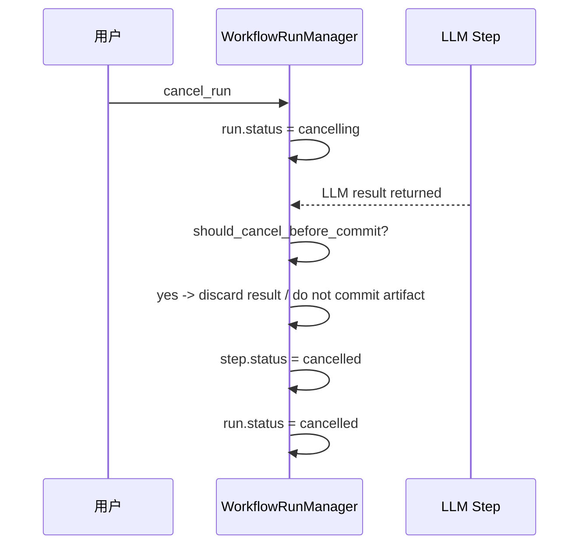

规则：

```text
commit 前必须检查 run.status。
如果 run.status in cancelling/cancelled，禁止 complete_step。
```

#### Worker 崩溃，job 一直 running

处理：

```text
worker heartbeat / lease 过期
-> Job running -> retrying 或 failed
-> 对应 WorkflowStep running -> retrying 或 failed
-> WorkflowRun 保持 running 或进入 failed
```

是否 retry 由 step retry policy 决定。

#### SSE 断线

处理：

```text
不影响业务状态。
前端用 last_event_id 重连 replay。
重新进入页面时先 GET WorkflowRun snapshot，再接 SSE。
```

#### 前端切换 Thread 后旧事件到达

处理：

```text
前端检查 event.run_id / thread_id。
不匹配当前 active thread/run 的 event 直接丢弃。
```

后端也应该按 `thread_id + active_run_id` 订阅，减少串流。

#### Step 状态写成功，但 Event 写失败

处理：

```text
状态表是权威。
Event 写失败不能回滚已经成功的状态。
需要 event_outbox 或补偿任务补写 event。
```

如果暂时不做复杂 outbox，至少要保证 UI 可通过 snapshot 恢复，而不是依赖 event。

#### Event 写成功，但状态写失败

必须禁止。

原因：

```text
Event 是状态变化的影子。
不能让影子先出现，而实体没变。
```

如果 event 写成功但状态写失败，会导致：

- 前端通过 SSE 看到一个并不存在的完成/失败/取消事件。
- 刷新后 snapshot 又回到旧状态，用户看到状态跳变。
- 后续逻辑可能基于虚假 event 触发非法转换。
- 审计日志不再可信。

规则：

```text
状态先变，event 后写。
最好状态更新和 event append 在同一个事务里完成。
```

推荐事务：

```text
BEGIN IMMEDIATE;
  UPDATE workflow_runs ...
  UPDATE workflow_steps ...
  INSERT INTO workflow_events ...
COMMIT;
```

如果中间任何一步失败：

```text
ROLLBACK;
```

最终保证：

```text
要么状态和 event 都成功。
要么状态和 event 都不成功。
```

SQLite 可以用 `BEGIN IMMEDIATE` 提前拿写锁，避免两个状态转换同时写入。

耗时外部调用不能放在事务里：

```text
事务 1：mark step running + append step_started event
事务外：执行 LLM / Spider
事务 2：commit guard + 保存 artifact refs + mark step succeeded/failed + append event
```

不要这样：

```text
BEGIN;
调用 LLM 等 30 秒;
UPDATE 状态;
COMMIT;
```

这会长时间持有 SQLite 写锁。

#### 重复启动 workflow

同一个 Thread 里用户再次说“重新生成”时，推荐：

```text
创建新的 WorkflowRun。
旧 run 如果 running，则要求用户取消/完成，或自动 archived/cancelled。
Thread.active_run_id 指向新 run。
```

不要复用旧 run 直接覆盖。

### 状态转换优先级

多个事情同时发生时，优先级建议：

```text
cancel > fail > pause > retry > success > progress
```

含义：

- `cancel` 最高，因为用户明确要求终止。
- `fail` 高于 pause，因为不可恢复错误无法暂停后继续。
- `pause` 高于 retry/success 展示，因为用户想停住流程。
- `success` 只有在 commit guard 通过后才算数。
- `progress` 只是观察事件，优先级最低。

### WorkflowRunManager 事务模型

每次状态转换必须统一封装：

```text
transition(run_id, action):
  BEGIN IMMEDIATE

  load run with write lock
  validate transition
  update run
  update step / job / child_task if needed
  append event

  COMMIT
```

如果失败：

```text
ROLLBACK
```

需要同事务的操作：

```text
WorkflowRun.status 更新
WorkflowRun.current_step 更新
WorkflowStep.status 更新
WorkflowChildTask.status 更新
WorkflowArtifact 引用写入
WorkflowEvent 追加
```

不应放进状态事务的操作：

```text
LLM 调用
Spider 请求
外部 API 请求
长耗时计算
```

### 最终规则

1. 前端只发 command，不改权威状态。
2. Worker 只报告 transition，不绕过 `WorkflowRunManager`。
3. `WorkflowRun` 是整体业务状态真相。
4. `WorkflowStep` 是真实执行节点真相。
5. `Job` 只表达技术执行状态。
6. `Event` 只表达状态变化记录，不反推状态。
7. 所有成功提交前必须执行 commit guard。
8. 所有状态转换必须幂等，并在事务中完成。

## 5. Agent Loop 与对话循环

### 核心判断

当前项目更像：

```text
Chat 触发异步 workflow
```

而不是完整的：

```text
对话驱动 Agent loop
```

下一版目标是：

```text
Conversation Loop 负责理解用户意图与持续交互。
Workflow Loop 负责可恢复任务执行。
Context Builder 把 message / constraint / artifact / state 组合成 Agent 每一步可消费上下文。
```

### 两个 Loop 分工

#### Conversation Loop

Conversation Loop 负责回答：

```text
用户这句话是什么意思？
是启动任务、补充约束、暂停、继续、取消、追问状态，还是修改产物？
```

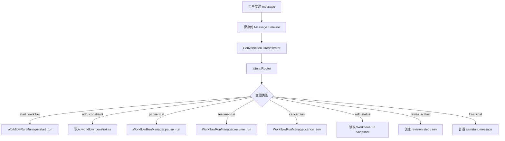

Conversation Loop 的核心模块：

```text
Message Timeline
Conversation Orchestrator
Intent Router
Constraint Normalizer
Artifact Reference Resolver
Status Summarizer
Workflow Command Dispatcher
```

#### Workflow Loop

Workflow Loop 负责回答：

```text
当前 workflow 应该执行哪个 step？
这个 step 需要什么上下文？
执行后产物怎么保存？
失败、中断、恢复怎么处理？
```

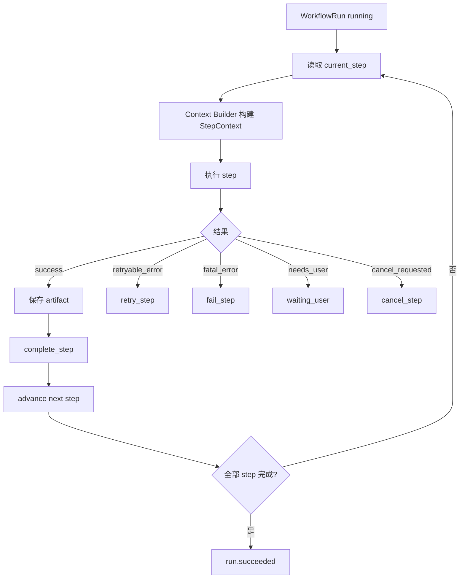

Workflow Loop 的核心模块：

```text
WorkflowRunManager
WorkflowStep Executor
Context Builder
Artifact Store
Retry Policy
Interrupt Policy
Boundary Evaluator
Event Log
```

### 当前实现的问题

当前 Conversation Loop 不够完整：

1. 启动 workflow 由前端关键词 `生成/选题/策略/文案/笔记/脚本/内容` 判断，不应该由前端决定。
2. `add_constraint` 只保存成 message，没有进入结构化 constraint，也不会影响后续 Agent step。
3. 结果 artifact 没有在 Message Timeline 中形成标准 artifact reference message。
4. Thread 只记录 active session/job，没有清晰的 active run / active artifact / active constraint version。
5. Strategy / Generation Agent 不通过 Context Builder 读取统一上下文。

旧模型：

```text
Chat UI -> Workflow API -> Worker -> Agent
```

目标模型：

```text
Conversation Orchestrator
-> WorkflowRunManager
-> Workflow Loop
-> Context Builder
-> Agent Executors
```

### 目标 Agent Loop 总图

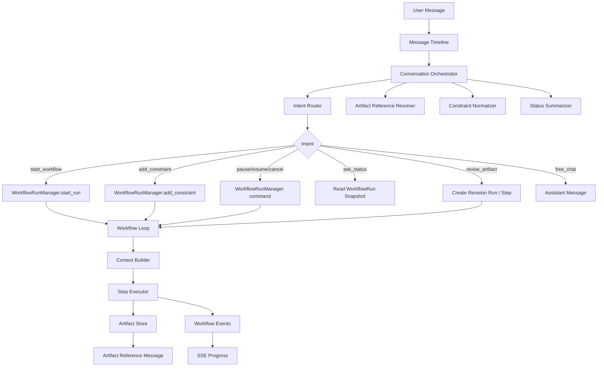

### Intent 类型升级

当前 intent 太少：

```text
pause_job
resume_job
cancel_job
ask_status
add_constraint
free_chat
```

下一版建议：

```text
start_workflow
add_constraint
pause_run
resume_run
cancel_run
ask_status
revise_artifact
regenerate_artifact
compare_versions
accept_result
reject_result
free_chat
unknown
```

| Intent | 例子 | 处理 |
| --- | --- | --- |
| `start_workflow` | “帮我生成 5 篇防晒衣笔记” | 创建新 `WorkflowRun`。 |
| `add_constraint` | “语气更年轻一点” | 写入 `workflow_constraints`。 |
| `pause_run` | “先停一下” | 调用 `pause_run`。 |
| `resume_run` | “继续” | 调用 `resume_run`。 |
| `cancel_run` | “不要生成了” | 调用 `cancel_run`。 |
| `ask_status` | “现在到哪了？” | 读取 snapshot 并总结。 |
| `revise_artifact` | “把第 2 篇改生活化” | 创建 revision step/run。 |
| `regenerate_artifact` | “重新生成一版” | 创建新 run/version。 |
| `compare_versions` | “对比一下两版哪个好” | 读取 artifact versions。 |
| `accept_result` | “就用这版” | 进入 publish candidates。 |
| `reject_result` | “这版不行” | 标记 rejected 或创建新 revision。 |
| `free_chat` | “你能做什么？” | 普通 assistant 回复。 |

### Context Builder

Context Builder 是 Agent 上下文编排层。它不应该简单把全部聊天记录塞进 prompt，而是按 step 选择上下文。

目标接口：

```text
build_context(run_id, step_name):
  load workflow_run
  load current constraints
  load relevant messages
  load required artifacts
  load source/RAG data
  load prior step outputs
  produce structured StepContext
```

不同 step 需要不同上下文：

| Step | 需要的上下文 |
| --- | --- |
| `discovery.plan_queries` | 初始用户需求 + 品牌信息 + constraints。 |
| `discovery.spider_search` | query plan。 |
| `retrieval.rag_retrieve` | source artifact refs。 |
| `strategy.llm_synthesize` | 用户需求 + constraints + RAG summary + source quality。 |
| `generation.plan_proposals` | strategy artifact + constraints。 |
| `generation.generate_notes_parallel` | proposal + strategy + target style constraints。 |
| `generation.similarity_check` | generated note + source/RAG candidates。 |
| `revision.rewrite_note` | target note artifact + user revision instruction + previous version。 |
| `review.await_user_acceptance` | result summary + artifact refs。 |

### StepContext 数据结构定版

Context Builder 输出结构化 `StepContext`，而不是给 Agent 一整段未处理聊天记录。

```text
StepContext
- run
- step
- user_request
- brand_context
- constraints
- relevant_messages
- input_artifacts
- prior_artifacts
- source_context
- rag_context
- generation_targets
- revision_targets
- output_requirements
```

不同 step 的上下文选择：

| Step | StepContext 重点内容 |
| --- | --- |
| `discovery.plan_queries` | `user_request + brand_context + constraints` |
| `strategy.llm_synthesize` | `user_request + constraints + source_context + rag_context` |
| `generation.generate_notes_parallel` | `strategy artifact + proposal artifact + style constraints + forbidden_words` |
| `revision.rewrite_note` | `target note artifact + user revision instruction + previous version` |
| `review.await_user_acceptance` | `final_result artifact + note summaries` |

Context Builder 原则：

```text
不盲目塞全部 messages。
只取与当前 step 有关的 messages、constraints、artifacts。
所有输入都带 version/hash，便于恢复和幂等。
```

### 运行中消息如何影响 Agent

运行中用户补充要求时，不应只保存 message，也不应粗暴打断所有 step。

目标流程：

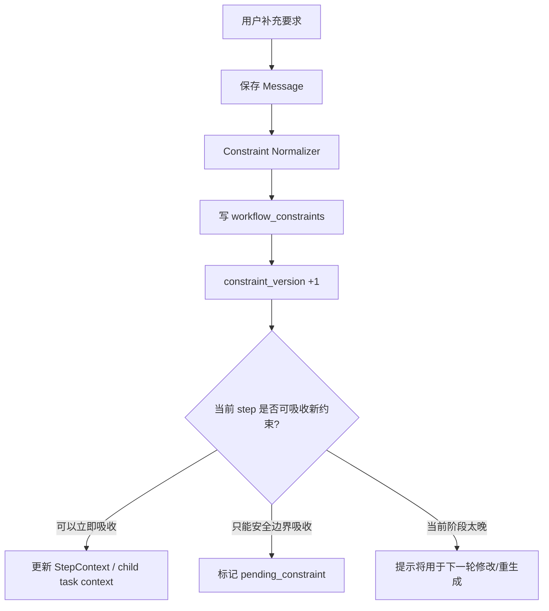

示例：

| 当前阶段 | 用户补充“语气更年轻” | 处理 |
| --- | --- | --- |
| 还在搜索 | 后续策略/生成吸收，不重跑搜索。 |
| 正在策略 LLM 调用 | 当前调用无法吸收，安全边界后判断是否重跑策略。 |
| 正在并行生成 | 未开始 slot 可吸收，已完成 slot 需要 revision。 |
| 已完成结果 | 创建 revision step/run。 |
| 已 accepted | 创建新版本 run。 |

### 安全边界

安全边界是系统可以安全停下来、重新规划、吸收新约束、重试、取消，且不会留下半成品或不一致状态的点。

安全边界类型：

| 边界类型 | 含义 |
| --- | --- |
| Step Boundary | 一个 workflow step 完成后、下一个 step 开始前。 |
| Child Task Boundary | 并行生成中某个 slot 完成后。 |
| Transaction Boundary | artifact commit 前后，用于 commit guard。 |
| Human Boundary | 等待用户确认的节点。 |

每个 step executor 至少在这些点检查边界：

```text
before_step_start
after_external_call_return
before_artifact_commit
after_step_complete
before_next_step
```

安全边界由三类机制共同决定：

```text
Step Definition 定义边界能力。
Constraint Classifier 判断用户补充影响范围。
Boundary Evaluator 在边界做决策。
WorkflowRunManager 执行状态转换。
```

### Constraint Classifier 第一版方案

稳定上线优先，第一版采用混合方案：

```text
规则优先兜底
+ LLM 结构化分类处理自然语言
+ 低置信度时进入保守策略
```

规则适合明确命令：

```text
暂停
取消
继续
完成
查进度
重新生成
```

自然语言约束交给 `Constraint Classifier / Constraint Normalizer`：

```text
style
topic_change
target_audience
format
forbidden_words
brand_policy
quantity_change
artifact_revision
```

示例输出：

```json
{
  "constraint_type": "style",
  "artifact_target": null,
  "scope": "generation",
  "impact_level": "medium",
  "confidence": 0.86
}
```

关键原则：

```text
模型判断“用户想表达什么”。
规则判断“系统现在允许怎么做”。
```

模型不能直接决定 workflow 状态转换。状态转换必须由 `WorkflowRunManager + Boundary Evaluator` 用确定性规则执行。

### Artifact Reference Message

生成结果不要直接塞成一条巨大的 assistant message，但 Message Timeline 中必须有一条 artifact reference message。

示例：

```text
role = assistant
message_type = artifact_result
text = "已生成 1 份策略和 5 篇笔记。"
artifact_refs = [
  strategy: xxx,
  note: note_1,
  note: note_2,
  ...
]
run_id = xxx
```

好处：

- 对话时间线完整。
- 结果结构化保存。
- 后续“改第 2 篇”可以解析到 `note_2`。
- 恢复时读 messages 就知道这里有一次结果输出，再读 artifact refs 渲染卡片。
- Context Builder 可以精准引用 artifact，而不是解析长文本。

### Artifact Version / Revision / Rerun 定版

产物修改、重新生成和重跑必须分开建模。

#### Revision

用户针对已有 artifact 修改：

```text
把第 2 篇改生活化。
```

处理：

```text
创建新 artifact version。
parent_artifact_id = 原 note artifact_id。
artifact_type = generated_note。
artifact_version = old + 1。
不覆盖原 note。
```

#### Regenerate

用户要求重新生成一版结果：

```text
重新生成一版。
```

处理：

```text
创建新的 WorkflowRun。
run_type = regenerate。
parent_run_id = previous_run_id。
Thread.active_run_id 指向新 run。
旧 run 保留。
```

#### Rerun

用户换主题、换目标人群、推翻大方向：

```text
不要防晒衣了，改成徒步鞋。
```

处理：

```text
创建新的 WorkflowRun。
run_type = rerun。
继承 Thread 和部分 brand context。
不继承旧 strategy/generation artifact。
```

#### Artifact 状态

```text
draft
active
superseded
rejected
accepted
archived
```

用户点击完成后：

```text
final_result / generated_note -> accepted
创建 publish_candidate artifact
```

### 前端新协议定版

前端不再从 job/event 推断任务状态，而是读取 snapshot。

#### 页面进入

```text
GET /threads
GET /threads/{thread_id}
GET /threads/{thread_id}/timeline
GET /workflow-runs/{run_id}/snapshot
GET /workflow-runs/{run_id}/events
```

#### Snapshot 返回

```json
{
  "run": {
    "run_id": "run_x",
    "status": "running",
    "phase": "generation",
    "current_step": "generation.generate_notes_parallel",
    "constraint_version": 2,
    "artifact_version": 4
  },
  "steps": [],
  "child_tasks": [],
  "artifacts": [],
  "constraints": [],
  "active_job": {}
}
```

#### Timeline 返回

Message Timeline 同时包含普通消息和 artifact reference message：

```json
{
  "message_id": "msg_x",
  "role": "assistant",
  "message_type": "artifact_result",
  "text": "已生成 1 份策略和 5 篇笔记。",
  "run_id": "run_x",
  "artifact_refs": [
    {"artifact_type": "strategy", "artifact_id": "art_strategy_x"},
    {"artifact_type": "generated_note", "artifact_id": "art_note_1"}
  ]
}
```

#### SSE

```text
GET /workflow-runs/{run_id}/events?after_event_id=xxx
```

SSE 只补 workflow events。

#### 用户发送消息

```text
POST /threads/{thread_id}/messages
```

后端 `Conversation Orchestrator` 返回：

```json
{
  "message": {},
  "assistant_reply": {},
  "command_result": {},
  "active_run_snapshot": {}
}
```

前端只按返回的 snapshot 渲染，不自行推断。

### Agent Loop 最终形态

最终形态是一个“对话驱动的 durable workflow loop”：

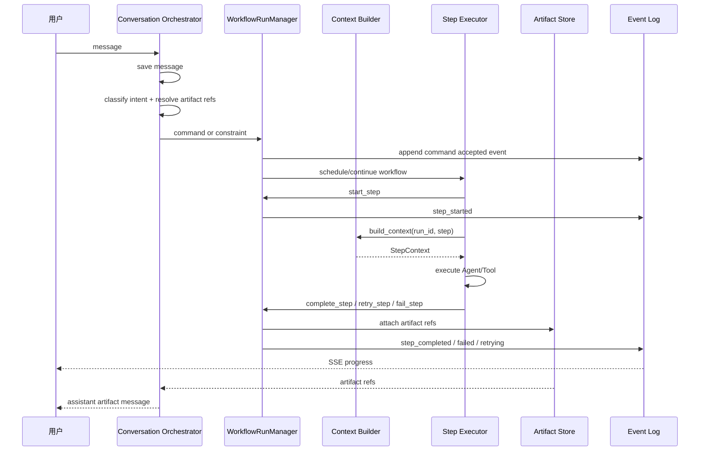

### Agent Loop 最终原则

1. 用户消息永远先保存到 Message Timeline。
2. 后端 Conversation Orchestrator 负责 intent，不再由前端关键词启动 workflow。
3. 用户消息被转换成 command、constraint、artifact revision request 或 free chat。
4. `WorkflowRunManager` 是 command 的唯一执行入口。
5. Agent 执行不直接读取原始 message 表，而是通过 Context Builder 获取结构化上下文。
6. Artifact 不塞进普通 message，但 Message Timeline 必须保存 artifact reference message。
7. 运行中约束进入 `workflow_constraints`，并通过 `constraint_version` 影响安全边界后的 step。
8. 已完成 artifact 的修改走 revision step/run，不直接覆盖原产物。
9. SSE 只推 workflow event，不承担对话 message token streaming。
10. 如果未来需要 ChatGPT 式逐 token 回复，可以作为 `assistant_message_stream` 单独实现，不和 workflow event stream 混用。

## 6. 已确认决策

以下内容作为本次重构基线：

1. 使用双层模型：Message Timeline + Artifact Store。
2. 新增 Context Builder，把 messages、artifacts、constraints、workflow state 转为 Agent 上下文。
3. SSE 用于 workflow events 和 replay，不作为唯一通信通道。
4. 当前 baseline 不要求 LLM token streaming；未来可作为独立 assistant-message streaming 能力加入。
5. 新增 `WorkflowRunManager`，作为唯一状态转换入口。
6. `WorkflowRun` 管整体业务状态。
7. `WorkflowStep` 管细粒度真实执行进度。
8. `Job` 只管队列执行可靠性。
9. `Event` 只管可观察性、SSE 和 replay。
10. 并行笔记生成必须用 child task 表达，不能隐藏在粗粒度 generation 状态里。
11. 用户补充要求必须进入 `workflow_constraints`，不能只保存成 chat message。
12. 后续恢复路径应是 `Thread -> active_run_id -> WorkflowRun / Steps / Artifacts / Events`，不再从分散的 job、event、frontend state 中推断状态。
13. Conversation Orchestrator 负责 intent 和 artifact reference 解析，前端不再用关键词决定是否启动 workflow。
14. Constraint Classifier 第一版采用规则 + LLM 结构化分类，状态转换仍由确定性规则执行。
15. 生成结果以 artifact reference message 进入 Message Timeline，而不是把完整 artifact 塞进普通 assistant message。

## 7. 讨论闭环状态

本轮架构问题的闭环情况：

| 问题 | 状态 | 说明 |
| --- | --- | --- |
| 流式消息与上下文模型 | 已闭环 | 采用 Message Timeline + Artifact Store + Context Builder。 |
| 统一状态管理 | 已闭环 | 采用 WorkflowRunManager + WorkflowRun + WorkflowStep + ChildTask。 |
| 可中断、可恢复机制 | 已闭环 | 明确 pause/cancel/recover/retry、safe boundary、commit guard、幂等规则。 |
| 任务状态转换与异常时序 | 已闭环 | 明确 Command/Transition、状态转换表、异常分支、事务原子性。 |
| Agent loop 与对话循环 | 已闭环 | 明确 Conversation Loop / Workflow Loop / Context Builder / Constraint Classifier。 |

## 8. 落地实施闭环

本轮将 7 个落地问题也定版为实施基线：

| 实施问题 | 状态 | 定版结论 |
| --- | --- | --- |
| 新 schema | 已闭环 | 新增 workflow 六表：`workflow_runs`、`workflow_steps`、`workflow_child_tasks`、`workflow_events`、`workflow_artifacts`、`workflow_constraints`。 |
| 迁移策略 | 已闭环 | 新模型主导 + 旧模型兼容桥接；Thread 增加 `active_run_id`，Job 增加 `run_id / step_id / child_task_id`。 |
| `WorkflowRunManager` 接口 | 已闭环 | 按 Run / Step / ChildTask / Artifact / Constraint / Event 六类接口收口，状态转换同事务完成。 |
| `StepContext` | 已闭环 | Context Builder 输出结构化 `StepContext`，按 step 精准选择上下文。 |
| `Constraint Classifier` 第一版 | 已闭环 | 规则优先 + LLM structured output + 低置信度保守策略；模型不直接决定状态转换。 |
| Artifact 版本模型 | 已闭环 | Revision 创建 artifact version；Regenerate/Rerun 创建新的 WorkflowRun；旧产物不覆盖。 |
| 前端新协议 | 已闭环 | Timeline 管消息，Snapshot 管状态，Artifact refs 管结果，SSE 管事件。 |

后续进入实现阶段时，需要把本方案拆成工程任务：

1. 数据库迁移与模型定义。
2. `WorkflowRunManager` 和事务测试。
3. `Conversation Orchestrator` 与 intent/constraint 归一化。
4. `Context Builder` 与 Step Executor 改造。
5. Artifact reference message 与前端 timeline/snapshot 协议改造。
6. SSE 从 thread/session event 迁移到 workflow event。
7. 回归测试：恢复、取消、暂停、重试、重复事件、并行 child task、artifact revision。
