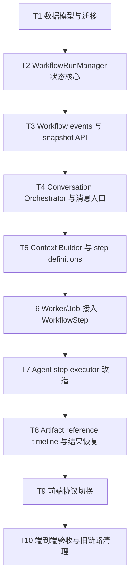

# 架构重构 0.1.0 实现计划

日期：2026-05-17

关联蓝图：[20260517_restructure0.1.0.md](./20260517_restructure0.1.0.md)

本文档把架构重构方案拆成可执行任务。拆分原则：

1. 每个任务完成后都能独立测试。
2. 任务之间有明确依赖顺序。
3. 不按“模块名”泛泛拆分，而按可交付的闭环能力拆分。
4. 新模型先兼容旧链路，再逐步切换入口。

## 总体顺序



## T1 数据模型与迁移

### 目标

新增 workflow 六表，并为旧表增加必要兼容字段，但不改变现有业务入口。

### 范围

新增表：

```text
workflow_runs
workflow_steps
workflow_child_tasks
workflow_events
workflow_artifacts
workflow_constraints
```

修改旧表：

```text
creator_threads.active_run_id
jobs.run_id
jobs.step_id
jobs.child_task_id
```

### 交付

- 数据表初始化逻辑。
- Pydantic / dataclass 模型。
- Store 层基础 CRUD。
- 幂等建表与旧库兼容迁移。

### 测试

新增单测：

```text
tests/unit/test_workflow_schema.py
tests/unit/test_workflow_store.py
```

覆盖：

- 空库能创建所有新表。
- 旧库缺列时能自动补列。
- workflow run / step / child task / event / artifact / constraint 可创建和读取。
- 重复初始化不报错。

### 完成标准

```bash
pytest -q tests/unit/test_workflow_schema.py tests/unit/test_workflow_store.py
```

通过。

## T2 WorkflowRunManager 状态核心

### 依赖

T1。

### 目标

实现集中状态转换，不接入真实 Agent，只验证状态机和事务。

### 范围

实现：

```text
WorkflowRunManager.start_run
WorkflowRunManager.pause_run
WorkflowRunManager.resume_run
WorkflowRunManager.cancel_run
WorkflowRunManager.complete_run
WorkflowRunManager.fail_run
WorkflowRunManager.initialize_steps
WorkflowRunManager.start_step
WorkflowRunManager.complete_step
WorkflowRunManager.retry_step
WorkflowRunManager.fail_step
WorkflowRunManager.cancel_step
WorkflowRunManager.skip_step
WorkflowRunManager.advance_to_next_step
```

状态转换必须：

```text
BEGIN IMMEDIATE
更新 run/step/child_task/artifact/constraint
插入 workflow_event
COMMIT
```

### 交付

- `WorkflowRunManager`。
- 状态转换校验。
- 事务封装。
- commit guard：`cancelling/cancelled` 下禁止成功 commit。

### 测试

新增单测：

```text
tests/unit/test_workflow_run_manager.py
tests/unit/test_workflow_transitions.py
```

覆盖：

- 合法 run 状态转换。
- 非法状态转换被拒绝。
- 重复 pause/cancel 幂等。
- cancel 与 complete_step 竞态下 cancel 优先。
- 状态更新和 event append 同事务成功。
- 人为制造 event append 失败时状态回滚。

### 完成标准

```bash
pytest -q tests/unit/test_workflow_run_manager.py tests/unit/test_workflow_transitions.py
```

通过。

## T3 Workflow Events 与 Snapshot API

### 依赖

T1、T2。

### 目标

前端和测试可以通过新 API 读取 workflow 权威状态和事件流。

### 范围

新增 API：

```text
GET /workflow-runs/{run_id}/snapshot
GET /workflow-runs/{run_id}/events
```

Snapshot 返回：

```text
run
steps
child_tasks
artifacts
constraints
active_job
```

SSE 只读取 `workflow_events`，支持 `Last-Event-ID` 或 `after_event_id`。

### 交付

- Snapshot response schema。
- Workflow event SSE。
- event replay。
- thread/run 不匹配时返回清晰错误。

### 测试

新增测试：

```text
tests/e2e/test_workflow_snapshot_api.py
tests/e2e/test_workflow_events_api.py
```

覆盖：

- 创建 run 后 snapshot 能恢复当前状态。
- 多个 event 按 event_id 顺序返回。
- SSE replay 只返回指定 event_id 之后的事件。
- run 不存在返回 404。

### 完成标准

```bash
pytest -q tests/e2e/test_workflow_snapshot_api.py tests/e2e/test_workflow_events_api.py
```

通过。

## T4 Conversation Orchestrator 与消息入口

### 依赖

T1、T2、T3。

### 目标

后端接管对话意图判断和 workflow command 分发，前端不再用关键词决定启动任务。

### 范围

新增：

```text
ConversationOrchestrator
IntentRouter v2
ConstraintClassifier v1
ArtifactReferenceResolver v1
```

改造：

```text
POST /threads/{thread_id}/messages
```

使其返回：

```text
message
assistant_reply
command_result
active_run_snapshot
```

### 第一版规则

规则优先处理：

```text
暂停
取消
继续
完成
查进度
重新生成
```

自然语言约束用 LLM structured output；测试中使用 fake classifier。

### 交付

- `start_workflow` 从后端触发 `WorkflowRunManager.start_run`。
- `add_constraint` 写入 `workflow_constraints`。
- pause/resume/cancel 变成 run command。
- ask_status 读取 snapshot 并生成简短回复。

### 测试

新增测试：

```text
tests/unit/test_conversation_orchestrator.py
tests/e2e/test_creator_message_workflow_v2.py
```

覆盖：

- 生成需求创建 active_run。
- 运行中补充要求写入 constraint。
- 暂停/继续/取消调用 run command。
- 查状态返回 snapshot 摘要。
- 低置信度 constraint 不改变 workflow 状态。

### 完成标准

```bash
pytest -q tests/unit/test_conversation_orchestrator.py tests/e2e/test_creator_message_workflow_v2.py
```

通过。

## T5 Context Builder 与 Step Definitions

### 依赖

T1、T2、T4。

### 目标

定义每个 step 的上下文输入、约束吸收策略、安全边界和重试策略。

### 范围

新增：

```text
StepDefinition
StepContext
ContextBuilder
BoundaryEvaluator
```

第一版 step definitions：

```text
intake.capture_request
context.build_context
discovery.plan_queries
discovery.spider_search
discovery.assess_source_quality
discovery.expand_queries
discovery.persist_sources
retrieval.rag_index
retrieval.rag_retrieve
strategy.prepare_prompt
strategy.llm_synthesize
strategy.validate_strategy
strategy.persist_strategy
generation.plan_proposals
generation.select_proposals
generation.generate_notes_parallel
generation.similarity_check
generation.rewrite_or_reselect
generation.aggregate_notes
finalization.persist_artifacts
finalization.emit_result_ready
review.await_user_acceptance
```

### 交付

- `build_context(run_id, step_name)`。
- step 输入版本和 input_hash。
- constraint filtering。
- boundary decision：commit / pause / cancel / rerun_step / apply_downstream。

### 测试

新增测试：

```text
tests/unit/test_context_builder.py
tests/unit/test_boundary_evaluator.py
```

覆盖：

- 不同 step 只取所需 context。
- style constraint 在 generation step 生效。
- topic_change 在中后期建议 restart/rerun。
- cancel 在 before_commit 被 commit guard 拦截。
- input_hash 对相同输入稳定。

### 完成标准

```bash
pytest -q tests/unit/test_context_builder.py tests/unit/test_boundary_evaluator.py
```

通过。

## T6 Worker/Job 接入 WorkflowStep

### 依赖

T1、T2、T5。

### 目标

Job 不再直接代表业务阶段，而是执行某个 `WorkflowStep` 或 `WorkflowChildTask`。

### 范围

改造：

```text
JobStore.enqueue
JobWorker.run_once
JobWorker._execute_job
Orchestrator.run_job
```

Job payload 绑定：

```text
run_id
step_id
child_task_id nullable
step_name
```

### 交付

- Worker lease job 后调用 `WorkflowRunManager.start_step`。
- step 执行成功后调用 `complete_step`。
- retryable error 调用 `retry_step`。
- fatal error 调用 `fail_step`。
- running job lease expired 时同步 step retrying/failed。

### 测试

新增/改造：

```text
tests/integration/test_workflow_job_worker.py
tests/unit/test_job_store.py
```

覆盖：

- queued job 执行后 step succeeded。
- retryable error 后 job/step retrying。
- permanent error 后 job/step failed。
- cancel_run 后 running job 返回成功也不能 complete_step。
- lease expired 同步 step 状态。

### 完成标准

```bash
pytest -q tests/integration/test_workflow_job_worker.py tests/unit/test_job_store.py
```

通过。

## T7 Agent Step Executor 改造

### 依赖

T5、T6。

### 目标

把现有 StrategyAgent / GenerationAgent 从“大函数执行”改造成可跟踪 step 执行。

### 范围

按 step 拆执行器：

```text
DiscoveryStepExecutor
RetrievalStepExecutor
StrategyStepExecutor
GenerationStepExecutor
FinalizationStepExecutor
```

保留现有 agent 内部能力，但通过 `StepContext` 输入、`Artifact` 输出。

### 交付

- Spider 搜索结果写 source artifact。
- RAG 写 rag artifact。
- strategy 写 strategy artifact。
- proposal/note/similarity 写对应 artifacts。
- 并行生成使用 child task。

### 测试

新增/改造：

```text
tests/integration/test_workflow_strategy_steps.py
tests/integration/test_workflow_generation_steps.py
tests/unit/test_generation_agent.py
tests/unit/test_strategy_agent.py
```

覆盖：

- strategy step 链路可从 fake spider/fake llm 生成 artifact。
- generation 并行 child tasks 可部分成功、部分重试。
- succeeded child task 恢复时跳过。
- similarity rewrite 生成新 artifact version。

### 完成标准

```bash
pytest -q tests/integration/test_workflow_strategy_steps.py tests/integration/test_workflow_generation_steps.py
pytest -q tests/unit/test_generation_agent.py tests/unit/test_strategy_agent.py
```

通过。

## T8 Artifact Reference Timeline 与结果恢复

### 依赖

T4、T7。

### 目标

结果以 artifact reference message 进入 Message Timeline，恢复时能从 timeline + artifact refs 渲染结果。

### 范围

改造：

```text
creator_messages
thread timeline API
thread result API
complete endpoint
publish candidate creation
```

### 交付

- message 支持 `message_type`、`run_id`、`artifact_refs_json`。
- workflow 完成后写 assistant artifact_result message。
- `GET /threads/{thread_id}/timeline` 返回普通消息和 artifact reference。
- 完成时从 accepted artifacts 创建 publish candidates。

### 测试

新增测试：

```text
tests/e2e/test_thread_timeline_artifacts.py
tests/e2e/test_creator_complete_workflow_v2.py
```

覆盖：

- 结果不塞进普通 text，但有 artifact_result message。
- 刷新后 timeline 能恢复结果卡片引用。
- complete 后 artifacts accepted，并生成 publish candidate。
- revision 后旧 artifact 不被覆盖。

### 完成标准

```bash
pytest -q tests/e2e/test_thread_timeline_artifacts.py tests/e2e/test_creator_complete_workflow_v2.py
```

通过。

## T9 前端协议切换

### 依赖

T3、T4、T8。

### 目标

前端从旧 `thread.active_job_id + session events` 切到新 `active_run_id + snapshot + timeline + workflow events`。

### 范围

改造：

```text
frontend/src/lib/api.ts
frontend/src/app/creator/page.tsx
```

### 交付

- 页面加载读取 timeline 和 active run snapshot。
- 发送消息后使用 `active_run_snapshot` 更新 UI。
- SSE 改订阅 `/workflow-runs/{run_id}/events`。
- 结果气泡由 artifact reference message 渲染。
- 前端删除关键词 `inferTaskIntent` 启动 workflow 逻辑。

### 测试

新增/改造：

```text
frontend lint/build
tests/e2e/test_creator_thread_api.py
tests/e2e/test_creator_message_workflow_v2.py
```

如有 Playwright 环境，再补：

```text
frontend creator page smoke
```

### 完成标准

```bash
cd frontend && npm run lint && npm run build
pytest -q tests/e2e/test_creator_thread_api.py tests/e2e/test_creator_message_workflow_v2.py
```

通过。

## T10 端到端验收与旧链路清理

### 依赖

T1 - T9。

### 目标

验证完整创作台闭环，清理旧推断逻辑，保留必要兼容层。

### 范围

新增验收：

```text
tests/acceptance/test_creator_workflow_v2_full_loop.py
```

覆盖完整路径：

```text
创建 Thread
发送生成需求
创建 WorkflowRun
执行 strategy/generation fake workflow
SSE replay
刷新恢复 snapshot
运行中 add_constraint
cancel / resume / retry 分支
生成 artifact_result message
点击完成进入 publish candidates
```

### 清理

- 前端不再使用 `inferTaskIntent`。
- 后端不再从 job/event 推断业务阶段。
- 旧 `/threads/{id}/workflow` 只作为兼容入口，内部转发到 `WorkflowRunManager.start_run`。
- README / API 文档更新。

### 完成标准

```bash
pytest -q tests/acceptance/test_creator_workflow_v2_full_loop.py
pytest -q tests/e2e/test_creator_message_workflow_v2.py tests/e2e/test_thread_timeline_artifacts.py
cd frontend && npm run lint && npm run build
```

通过。

## 任务依赖总结

| 任务 | 可独立测试 | 依赖 |
| --- | --- | --- |
| T1 数据模型与迁移 | 是 | 无 |
| T2 WorkflowRunManager 状态核心 | 是 | T1 |
| T3 Workflow events 与 snapshot API | 是 | T1, T2 |
| T4 Conversation Orchestrator 与消息入口 | 是 | T1, T2, T3 |
| T5 Context Builder 与 step definitions | 是 | T1, T2, T4 |
| T6 Worker/Job 接入 WorkflowStep | 是 | T1, T2, T5 |
| T7 Agent Step Executor 改造 | 是 | T5, T6 |
| T8 Artifact Reference Timeline 与结果恢复 | 是 | T4, T7 |
| T9 前端协议切换 | 是 | T3, T4, T8 |
| T10 端到端验收与旧链路清理 | 是 | T1 - T9 |

## 实施原则

1. 每个任务必须带测试一起提交。
2. 每个任务完成后旧主流程不能破坏，直到 T10 统一切换。
3. 所有新状态转换必须通过 `WorkflowRunManager`。
4. 所有 workflow event 必须由状态事务产生。
5. 新增 API 优先与旧 API 并存，不直接删除旧入口。
6. Agent 执行改造时先使用 fake LLM/fake spider 保证确定性测试，再接真实服务。
