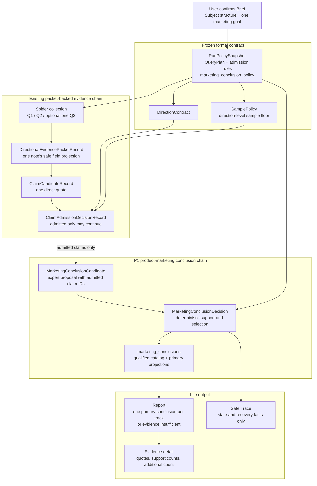
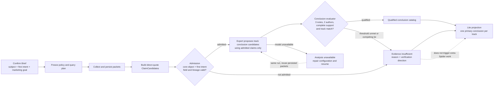

# F003 Lite Product-Marketing Conclusions Design

## Goal

Turn the Lite `product_marketing` report from a list of single-note expressions
into a short, evidence-backed marketing analysis. The user explicitly chooses
one primary marketing goal. The published Lite report then answers three
marketing questions with at most one governed conclusion each:

1. What need or concern appears in the sampled content?
2. What product value proposition is directly supportable?
3. What content expression appears in the sampled content?

The result must remain small, repeatable, and honest about uncertainty. It is
not a full marketing-consulting report and must not create extra Spider work to
fill empty sections.

## Confirmed Product Decisions

- The marketing goal is chosen by the user at Brief confirmation. Lite accepts
  one primary goal for a run.
- All three questions are always considered. Each is a separate report track:
  `need`, `value`, and `message`.
- A track displays one primary conclusion or an explicit insufficient-evidence
  result. It never fills the space with a weak title or generic observation.
- One conclusion requires at least three distinct canonical notes and two
  independent author identities. Each supporting quote must directly support
  both the frozen core object and the frozen first research intent.
- A single note may support more than one track, but counts only once within
  each track's note and author totals.
- All qualified conclusions remain durable. Lite only projects the primary
  conclusion for each track and publicly shows the number of additional
  qualified conclusions.
- A conclusion-analysis model failure is `analysis_unavailable`, never
  `insufficient_evidence`. The user may repair model configuration and resume
  the same run.
- New P1 names do not add a `v1` or `v2` suffix. Migration removes obsolete
  Lite report artifacts and does not keep a second, legacy report contract.

## Scope and Non-Goals

P1 consumes the existing formal, packet-backed `product_marketing` pipeline.
It retains the frozen `2 + 1` query plan, existing collection budgets, and
packet-only historical replay constraints.

P1 does not:

- infer consumer-wide preference, conversion, causal lift, or market size;
- make more Spider calls once persisted candidates and packets are exhausted;
- add embeddings, fixed business vocabularies, adaptive query rewrites, or an
  admission-time LLM;
- present a multi-theme strategy deck, segment matrix, or cross-direction
  synthesis; those are future full-analysis capabilities.

The first track therefore describes **needs or concerns expressed in sampled
content**, not a claim that all consumers have the same concern. Only a future
UGC/comment evidence contract may make consumer-population claims.

## Terminology and Ownership

| Object | Ownership | Meaning |
|---|---|---|
| `ClaimCandidateRecord` | Existing formal pipeline | One direct quote from one packet/canonical note. It is the smallest admission unit. |
| `ClaimAdmissionDecisionRecord` | Existing deterministic admission | States whether that one claim is admitted, downgraded, or rejected. |
| `MarketingConclusionCandidate` | P1 product-marketing expert | One proposed conclusion for one track, referencing several admitted claim IDs. It cannot self-rank or self-admit. |
| `MarketingConclusionDecision` | P1 deterministic conclusion evaluator | Validates a conclusion candidate, computes its support, gives a stable state/reason, and selects no more than one primary conclusion per track. |
| `marketing_conclusions` | P1 governed snapshot field | The complete qualified conclusion catalog plus primary-track projections. It is data, not a second report implementation. |
| `marketing_conclusion_policy` | Frozen run policy | The user goal, tracks, thresholds, and display cap used by the evaluator. |

`MarketingConclusionCandidate` is intentionally an aggregation. A conclusion
may be ranked only after its referenced claims are resolved to multiple notes
and authors; a single `ClaimCandidateRecord` must never be treated as a
marketing conclusion.

## Frozen Policy

Brief confirmation stores the user's primary goal and freezes the following
policy with the existing formal run policy:

```json
{
  "primary_marketing_goal": "content_seeding",
  "tracks": ["need", "value", "message"],
  "minimum_notes_per_conclusion": 3,
  "minimum_independent_authors_per_conclusion": 2,
  "require_core_and_first_intent_support": true,
  "maximum_primary_conclusions_per_track": 1
}
```

The concrete goal catalog is a narrow, user-facing choice. A goal can influence
the final action recommendation and presentation priority, but never weakens
the evidence requirements for any track.

## Architecture



## Data Flow



For a historical eligible run, P1 starts from persisted packets and replays
admission, conclusion governance, composition, audit, and publication. Before
and after replay, provider-operation and packet identity sets must be equal.

## Evidence and Selection Rules

### Admission gate

The existing admission remains deterministic. P1 strengthens relevance so that
an allowed direct quote must support both the core-object anchor and the
first-intent anchor. QueryGroup provenance remains necessary but is never
evidence by itself.

A core-only quote is rejected or downgraded with
`first_intent_not_supported`; it cannot enter a conclusion candidate. An
intent-only quote remains rejected by the core-object rule.

### Candidate proposal

The expert receives only admitted claims and their safe quote metadata. It
returns structured proposals of the following shape for each track:

```json
{
  "track": "need",
  "statement": "A bounded, evidence-scoped conclusion.",
  "supporting_claim_ids": ["claim_a", "claim_b", "claim_c"]
}
```

It may not set a confidence score, rank, author count, evidence state, or
admission result. The model cannot invent a source or use raw provider data.

### Deterministic conclusion evaluation

For each proposed conclusion, the evaluator resolves all claim IDs and rejects
the proposal unless all of the following are true:

- every claim has an `admitted` decision;
- every quote supports the frozen core object and first intent;
- supporting claims resolve to at least three distinct canonical notes;
- those notes resolve to at least two independent author identities;
- each quote field is allowed by the direction contract;
- the proposal is compatible with its requested track;
- the statement introduces no entity, comparison, scope, or causal result
  absent from its supporting claims.

Qualified candidates are compared lexicographically by independent-author
count, distinct-note count, and the number of notes whose allowed supporting
quote comes from the body rather than only a title. Exact duplicates are
merged. If distinct, competing candidates remain tied after these criteria, the
track has no primary conclusion and returns
`no_single_primary_conclusion`; the implementation must not pick arbitrarily.
The user-selected marketing goal shapes the single action recommendation, not
the evidence ranking inside an individual track.

## Report Contract

The report is no longer a list of raw note titles or direct quote cards. A title
or body excerpt is evidence only. The report body shows the selected conclusion
and the evidence details remain expandable.

Illustrative structure only; it is not a claim about a real run:

```text
夏季凉感 T 恤 · 产品营销调研
营销目标：内容种草与转化

1. 场景与需求
结论：在已采样内容中，高温通勤场景反复将闷热、黏腻描述为
对“凉感”体验的具体期待。
证据强度：3 篇笔记 · 2 位独立作者 · 另有 1 条合格结论
[证据详情] [查看原笔记]

2. 可被相信的产品卖点
结论：……
证据强度：4 篇笔记 · 3 位独立作者 · 另有 2 条合格结论

3. 内容表达
结论：……
证据强度：3 篇笔记 · 2 位独立作者

优先行动建议
围绕用户选择的营销目标给出一条建议；它必须引用上面的已治理结论，
并明确仍需实验验证。

范围与限制
本轮结论仅描述已采样内容，不代表全量消费者偏好或转化效果。
```

For an insufficient track:

```text
暂无可验证结论
原因：支持首要意图的独立作者不足（3 篇笔记 / 1 位作者）
建议：补充不同作者的直接体验表达后再验证。
```

The report exposes `additional_qualified_count` to users but does not expand
those extra conclusions in Lite. Their evidence remains durable for future
full-analysis projections.

## Observability

Trace must contain only facts that change user understanding, recovery, or
diagnosis. P1 adds one logical checkpoint, `marketing_conclusion`; candidate
generation and candidate ranking are internal implementation details rather
than separate public trace stages.

Successful and degraded states project only:

```json
{
  "stage": "marketing_conclusion",
  "status": "completed",
  "tracks": {
    "need": {
      "state": "selected",
      "supporting_note_count": 3,
      "independent_author_count": 2
    },
    "value": {
      "state": "insufficient_evidence",
      "reason_codes": ["first_intent_support_unmet"]
    },
    "message": {
      "state": "no_single_primary_conclusion",
      "reason_codes": ["conclusion_support_tied"]
    }
  }
}
```

When model analysis is unavailable:

```json
{
  "stage": "marketing_conclusion",
  "status": "waiting_user",
  "reason_codes": ["marketing_analysis_unavailable"],
  "recovery_action": "repair_model_configuration_and_resume"
}
```

For a packet-only replay, the same checkpoint additionally reports only the
meaningful proof that no collection was introduced:

```json
{
  "replayed_from_persisted_packets": true,
  "provider_operation_count_delta": 0,
  "packet_count_delta": 0
}
```

Trace must not show candidate counts, policy/input hashes, conclusion text,
quotes, raw subject input, full queries, note IDs, author IDs, prompts,
credentials, provider payloads, or arbitrary internal model output. The report
and evidence drawer, not Trace, own conclusion text and citations.

## Recovery and Idempotency

- The conclusion stage fingerprints frozen policy and the admitted-claim
  identity set internally. Repeating the same run or refresh reuses the same
  result rather than creating a second catalog, report message, or model
  attempt.
- A candidate or governance failure must publish the corresponding per-track
  evidence state. It must not re-run Spider.
- A model/configuration failure is recoverable at the conclusion stage and
  resumes from persisted admitted claims after repair.
- Historical replay never invokes a source-provider adapter and fails closed
  when packet, policy, or identity checks do not match.

## Acceptance Criteria

For `夏季凉感T恤` with confirmed structure `T恤｜凉感｜夏季` and the selected
`product_marketing` direction:

1. A quote supporting both `T恤` and `凉感` may support a conclusion; generic
   T-shirt material/style quotes and intent-only quotes cannot.
2. A primary conclusion contains at least three distinct note references and
   two independent authors; a repeated quote from one note cannot inflate a
   count.
3. The report presents at most one conclusion for each of `need`, `value`, and
   `message`, plus one clearly labelled action recommendation.
4. A track below threshold shows its evidence-insufficient reason and a
   verification direction; it does not display a raw title as a conclusion.
5. Extra qualified conclusions remain persisted and the report shows their
   count without expanding them.
6. An unavailable conclusion-analysis model produces a recoverable state, not
   an evidence-insufficient publication.
7. Trace projects only the compact, actionable `marketing_conclusion` state;
   recursive safety tests find no forbidden raw data.
8. Historical packet-only replay changes neither provider-operation identities
   nor packet identities and reports zero deltas.
9. Refresh and repeated actions preserve the same primary conclusions,
   publication, and Trace projection.

## Test Plan

- Unit-test first-intent relevance, per-track support counting, author/note
  deduplication, candidate validation, duplicate merge, competing ties, and
  every stable insufficient-evidence reason.
- Integration-test frozen marketing goal/policy, admitted-claim-only expert
  input, conclusion persistence, idempotent resume, model recovery, and
  packet-only replay without provider calls.
- Test the Lite read model and Creator report for the three primary cards,
  evidence-insufficient card, evidence-strength text, and user-visible
  additional-qualified count.
- Snapshot-test the Trace projection for selected, insufficient, tied,
  unavailable, and replay states; assert forbidden fields never cross the API.
- Run one real Creator acceptance using configured OpenAI/Xiaohongshu adapters
  after focused deterministic tests pass. The external run must report its
  real evidence state rather than being used to force a complete report.
