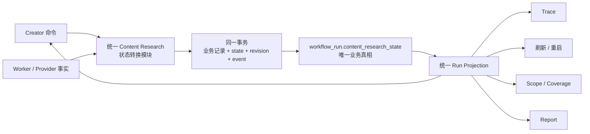

# Content Research 主流程可靠性设计

## 状态

**已确认，可进入实现计划。**

本设计记录 2026-08-23 围绕 Creator Content Research 真实运行页面、原型、
SQLite 写竞争、Trace 失真和旧规格残留问题达成的最终产品与工程约定。

本设计定义三个主任务：

1. 唯一状态机整改；
2. Content Research 主流程 SQLite 写协调整改；
3. Trace 真实执行投影整改。

三个任务可以分阶段开发和提交，但在三者全部通过发布门禁之前，不得宣称
Content Research 主流程已经稳定交付。Task 1 与 Task 2 尤其不能作为两个可独立
发布的安全检查点：Task 1 定义唯一状态语义，Task 2 使这些转换在 SQLite 上可靠。

## 替代关系

本设计在生命周期、SQLite 写协调和 Trace 语义上优先于以下旧设计或实现判断：

- 用户可见的 `confirm_subject_structure` / “还需要你确认调研主体”阶段；
- 从 Brief、Scope、checkpoint、dispatch 或前端本地状态分别推断当前阶段；
- Brief 确认后提前启动 `formal_research`；
- Scope 确认与正式检索分成两个用户动作；
- dispatch 失败但父 Run 继续显示 `running`；
- Trace 通过多张表 fallback 推断生命周期；
- 以“旧规格测试失败”为理由保留旧生产行为。

[`2026-08-15-lite-research-scope-contract-design.md`](./2026-08-15-lite-research-scope-contract-design.md)
中已经确认的 Scope v2 组合语义继续有效：产品营销使用核心搜索词、可用的
“核心搜索词 + 产品或体验补充词”、可用的“核心搜索词 + 场景或人群补充词”；
只有核心搜索词是候选笔记硬性准入条件，两个补充词均为可选检索扩展。历史 v1
数据只允许通过显式只读兼容路径读取，不得继续驱动新 Run。

本设计替代该 Scope 设计中“existing Trace UI remains unchanged”的限制。Trace
必须按本文整改为唯一状态机的真实执行投影。

### 继续有效的 Scope v2 查询合同

- “A/B/C”只允许作为内部合同速记，不得出现在前端。页面使用“核心搜索词”、
  “产品或体验补充词（可选）”、“场景或人群补充词（可选）”。
- 核心搜索词是候选笔记准入时唯一必须满足的对象条件。
- 产品或体验补充词必须是用户可能实际搜索的具体短语，例如 `凉感`、`显瘦`；
  它不是“重点了解什么”或抽象分析目标。
- 场景或人群补充词必须是具体场景、受众或使用语境，例如 `夏季通勤`。
- 后端唯一查询编译器固定生成“核心搜索词”、可用时的“核心搜索词 + 产品或体验
  补充词”、可用时的“核心搜索词 + 场景或人群补充词”；空格表示普通词组组合，
  不承诺来源平台支持 Boolean AND。
- 两个补充词缺失时，Scope 卡解释其含义并提供可选输入；不为了凑满三组而生成
  抽象词，只保留一至两组合法查询。
- 用户只编辑三个结构化搜索词。页面中的最终搜索词是后端编译结果的只读预览，
  不再提供逐组覆盖入口；修改结构化词后，用最新 request ticket 同步刷新预览。
- 系统生成的结构必须保留 `analysis_state` 和 reason codes；无效建议不得伪装成
  可靠拆解。系统可以有界修复一次，仍无效时在同一 Scope 卡提示用户修正，不恢复
  已废弃的独立主体结构确认阶段。
- 用户显式编辑后的结构由用户拥有语义决定权；后端只做非空、长度、版本、数量和
  编译一致性校验，不以“搜索质量”为由拒绝用户选择。
- 页面只展示会进入冻结 Scope 的 `final_query`。不会原样发送的研究问题、
  “上身感受”等分析目标不得伪装成可执行搜索词展示。
- 后续检索逐组原样发送冻结的 `final_query`；按笔记 ID 去重，并保留命中的
  query group。B/C 不作为候选准入条件，也不单独触发 Coverage 不足。
- 来源记录保持 query-group 粒度：`suggested_query` 保存系统建议，`final_query`
  保存用户确认文本，`origin` 在整组层面区分 `system_suggested` 与
  `user_edited`；不新增 A/B/C slot 级来源模型。

## 问题陈述

一次真实手工 Run 暴露了以下非法组合：

```text
等待确认旧调研主体结构
+ Scope 已冻结
+ 专家调研进行中
+ dispatch 实际已经失败
+ 没有任何笔记或 evidence 落库
```

这不是四个独立 UI Bug，而是同一个系统问题的不同表现：Content Research 没有
唯一生命周期权威。Subject checkpoint、Brief、Scope、Workflow、dispatch、subagent
和前端本地状态都能单独推进；一个业务转换又被拆成多次提交；失败无法向父 Run
收敛；Trace 最后只能拼装相互矛盾的记录。

真实 Run 还证明 SQLite tech debt 已经成为主流程阻断项。worker 领取 dispatch 后，
在进入可审计 provider 调用前等待 SQLite 写锁约 30 秒，最终以
`database is locked` 失败。dispatch 进入 `failed`，但父 Run 和子任务没有同步失败，
Trace 继续显示执行中。

## 目标

- 后端只维护一套 Content Research 业务状态机。
- 前端、Trace、刷新恢复和 worker 全部服从同一个状态与 revision。
- 正常流程严格遵循已确认原型：输入研究对象 → PreResearch → Brief 确认 →
  搜索词确认 → 检索笔记 → Coverage（仅不足时）→ 报告。
- 用户确认搜索词的一次操作原子冻结 Scope 并创建检索执行，不存在第二个启动动作。
- Content Research 主流程的 SQLite 写入具备统一事务、连接、重试、fencing 和恢复语义。
- Trace 准确展示当前状态、状态转换、provider/LLM 执行、安全错误和具体笔记引用。
- 删除全部已废弃的新 Run 实现路径与对应旧规格测试；旧测试不得阻塞新规格开发。
- 每个主任务保持模型配置、LLM 调用和小红书登录基础功能正常。

## 非目标

- 不重构全仓库所有 SQLite store。
- 不迁移到 PostgreSQL。
- 不实现多机或多进程 writer 协调。
- 不重构普通内容生成、V2 ingestion/discovery/topic pool。
- 不恢复无 Scope 的历史 mutation/repair 入口。
- 不把 Cookie、LLM Key、provider 请求头或原始 provider payload 暴露到 Trace。
- 不把用户可见的 Coverage 决策变成正常流程的必经阶段；内部覆盖评估仍在检索后执行。

## 产品主流程

```mermaid
stateDiagram-v2
    direction LR

    [*] --> PRESEARCH: 用户提交研究对象\n创建并激活 Run

    state "PreResearch 运行中\npresearch_running" as PRESEARCH
    state "等待确认 Brief\nbrief_confirmation_required" as BRIEF
    state "等待确认搜索词\nscope_confirmation_required" as SCOPE
    state "检索排队中\nretrieval_queued" as QUEUED
    state "检索笔记中\nretrieval_running" as RETRIEVING
    state "评估样本覆盖\ncoverage_evaluating" as EVALUATING
    state "等待 Coverage 决策\ncoverage_decision_required" as COVERAGE
    state "生成报告中\nreport_composing" as COMPOSING
    state "报告已发布\nreport_ready" as READY
    state "需要恢复\nrecovery_required" as RECOVERY
    state "已取消 / 不可恢复失败\ncancelled_or_failed" as TERMINAL

    PRESEARCH --> BRIEF: PreResearch 成功
    PRESEARCH --> RECOVERY: LLM / 本地持久化失败

    BRIEF --> SCOPE: 确认主体、竞品和方向
    BRIEF --> PRESEARCH: 补充或修正研究对象

    SCOPE --> QUEUED: 确认搜索词\n冻结 Scope + 创建执行
    QUEUED --> RETRIEVING: worker 领取执行权
    QUEUED --> RECOVERY: 排队或持久化重试耗尽

    RETRIEVING --> EVALUATING: 检索和笔记落库完成
    RETRIEVING --> RECOVERY: 登录 / provider / 持久化失败\n或 outcome unknown

    EVALUATING --> COMPOSING: 样本充分
    EVALUATING --> COVERAGE: 样本不足

    COVERAGE --> QUEUED: Expand\n同一 Scope，新执行单元
    COVERAGE --> QUEUED: Relax\n后继 Scope
    COVERAGE --> COMPOSING: Limited\n记录受限报告决定

    COMPOSING --> READY: 报告与引用发布
    COMPOSING --> RECOVERY: LLM / publication 失败

    RECOVERY --> PRESEARCH: 服务端允许重试 PreResearch
    RECOVERY --> QUEUED: 服务端允许重试冻结 Scope
    RECOVERY --> COMPOSING: 服务端允许重试报告
    RECOVERY --> TERMINAL: 结束或不可恢复

    READY --> [*]
    TERMINAL --> [*]
```



## Contract Pack

### 用户状态

| ID | 唯一状态 | 用户可见投影 | 允许操作 | 明确禁止 |
|---|---|---|---|---|
| `STATE-CR-01` | `presearch_running` | 正在进行轻量预检索 | 等待、取消 | Brief、搜索词、冻结 Scope、调研运行卡 |
| `STATE-CR-02` | `brief_confirmation_required` | 原型中的 Brief 卡：主体、竞品、调研方向 | 确认；补充或修正研究对象 | 旧主体结构卡、冻结 Scope、provider 调用 |
| `STATE-CR-03` | `scope_confirmation_required` | 三个结构化搜索词输入和一至三组后端编译的只读实际搜索词；系统建议异常显示安全提示 | 编辑核心词；补充可选词；确认并开始检索 | A/B/C 代号、逐组编辑、冻结标识、dispatch、调研运行状态 |
| `STATE-CR-04` | `retrieval_queued` | 已冻结 Scope，等待执行 | 等待、取消 | 编辑冻结搜索词、前置确认卡 |
| `STATE-CR-05` | `retrieval_running` | 真实搜索进度、返回数量和安全笔记引用 | 等待、取消 | Brief/Scope 编辑、未发生的 provider 事件 |
| `STATE-CR-06` | `coverage_evaluating` | 正在评估样本和作者覆盖 | 无用户 mutation | 提前显示 Coverage 决策或报告 |
| `STATE-CR-07` | `coverage_decision_required` | 精确 Coverage 缺口和服务端允许的动作 | Expand、Limited、Relax | 普通 Scope 确认、浏览器自造 retry |
| `STATE-CR-08` | `report_composing` | 正在生成/发布报告 | 等待 | 再次检索、发布未核验报告 |
| `STATE-CR-09` | `report_ready` | 已发布报告、Scope、引用和 Trace | 只读 | 修改历史结果或重新执行同一 attempt |
| `STATE-CR-10` | `recovery_required` | 真实失败阶段、安全错误、恢复动作 | 仅服务端投影的精确恢复动作 | 继续显示运行中；浏览器推断 retry |
| `STATE-CR-11` | `cancelled_or_failed` | 已取消或不可恢复终态 | 新建 Run | 继续当前 Run 的 provider/报告写入 |

### 唯一权威

| ID | 规则 |
|---|---|
| `AUTH-CR-01` | `workflow_run.content_research_state` 与单调递增的 `state_revision` 是唯一业务状态权威。 |
| `AUTH-CR-02` | 前端、Trace、刷新恢复、Scope/Report 读取不得从其他表推断当前生命周期。 |
| `AUTH-CR-03` | Brief、Scope、dispatch、subagent、checkpoint、execution fact 是状态转换事实或执行机制，不是并列业务状态机。 |
| `AUTH-CR-04` | 机械记录可以保存 lease/job 局部状态，但其变化只能经统一转换模块提交，并且不能单独驱动 UI。 |
| `AUTH-CR-05` | `ResearchScopeContract.query_groups[].final_query` 是唯一检索词权威；SubjectStructure 只提供内部建议。 |
| `AUTH-CR-06` | 一个 Run 同时最多有一个有效 execution attempt；worker 写入必须匹配 Run、Scope、attempt、lease 和预期 revision。 |
| `AUTH-CR-07` | 用户提交研究对象并成功创建 Run B 时，Run B 立即成为 `thread.active_run_id`；历史 Run A 只保留在 Timeline。 |
| `AUTH-CR-08` | 所有公共 mutation 必须提交预期状态与 revision；旧 revision、旧 Run、旧 Scope、旧 Draft 或旧 attempt 在第一笔业务写入前被拒绝。 |
| `AUTH-CR-09` | 后端查询编译器是 Draft query bundle 的唯一权威；前端不得自行生成可提交的 `final_query`。结构化词、Scope constraint、`targeted_required_terms` 和 query groups 必须来自同一次编译。 |
| `AUTH-CR-10` | 用户确认的 `final_query`、冻结 Scope、dispatch、Spider 实际参数和 Trace request fact 必须保持同一 query identity；Task 2 只负责确认前 Draft，Task 3 才建立冻结与执行链。 |
| `AUTH-CR-11` | 系统生成搜索结构必须先产生有序词元，再将词元映射为核心对象、产品/体验词、场景/人群词；有空格输入以空格分段为词元，无空格输入由模型分词。可执行结构只能由这些词元组成，词元按原始顺序拼接必须机械还原用户输入。若模型把多个相邻词元重新拼为复合核心词，后端只做机械归一化：剔除已明确映射到产品/体验或场景/人群的词元，以剩余词元作为核心对象；该规则不作用于用户手工输入。 |
| `AUTH-CR-12` | Creator 的结构化输入保存采用单一串行 latest-write-wins 队列。队列中的最新本地快照是未落库输入的临时权威；每次请求必须使用上一响应返回的最新 Draft ID 和 Run revision，旧响应不得覆盖更新的本地输入。若写入结果不确定，必须先读取后端当前 Scope 恢复 authority：已提交则继续最新快照，未提交且无更新快照时最多重试一次。 |

### 状态转换与原子边界

| ID | From → event → To | Guard 与原子写入 | 外部副作用 |
|---|---|---|---|
| `INV-CR-01` | 无 Run → `submit_research_subject` → `presearch_running` | 创建 Run、初始 transition event、`thread.active_run_id` 在一个事务提交 | 事务提交后才调用 LLM |
| `INV-CR-02` | `presearch_running` → `presearch_completed` → `brief_confirmation_required` | 保存 SubjectStructure 候选、analysis state/reasons、Brief Draft、状态和 revision；无效系统建议不得丢失诊断；不创建 Scope Contract/dispatch | 无 provider 调用；结构无效时最多追加一次 LLM 定向修复 |
| `INV-CR-03` | `brief_confirmation_required` → `confirm_brief` → `scope_confirmation_required` | 校验 revision；由后端编译并保存确认 Brief、Plan、Scope Draft、结构分析提示、transition event；不得启动 formal research | 无 provider 调用 |
| `INV-CR-04` | `brief_confirmation_required` → `revise_subject` → `presearch_running` | 保存用户补充、增加 revision、使旧 Brief command 失效 | 事务提交后重新 PreResearch |
| `INV-CR-05` | `scope_confirmation_required` → `confirm_scope` → `retrieval_queued` | 精确 Draft identity、一至三组非空词；冻结 Scope、创建唯一 dispatch/task、更新 Run 和 event | 事务提交后唤醒 worker |
| `INV-CR-06` | `retrieval_queued` → `worker_claimed` → `retrieval_running` | dispatch claim、subagent running、Run state/revision、attempt/lease fact 同一事务 | 无；领取完成后才可进入 provider 边界 |
| `INV-CR-07` | `retrieval_running` → `provider_request_recorded` → `retrieval_running` | 请求指纹、query group、attempt、sequence 在短事务提交 | 提交后才调用小红书 |
| `INV-CR-08` | `retrieval_running` → `provider_outcome_recorded` → `retrieval_running` | 保存安全 outcome、来源引用、笔记批次和 event；必须匹配 attempt/lease/revision | provider 已在事务外完成 |
| `INV-CR-09` | `retrieval_running` → `retrieval_completed` → `coverage_evaluating` | 任务终态、冻结笔记集合、Run state/revision 同一事务 | 无 |
| `INV-CR-10` | `coverage_evaluating` → `coverage_satisfied` → `report_composing` | Coverage snapshot、state/revision/event 一起提交 | 提交后调用报告 LLM |
| `INV-CR-11` | `coverage_evaluating` → `coverage_insufficient` → `coverage_decision_required` | 未满足条件、样本/作者计数、允许动作与 state 一起提交 | 无 |
| `INV-CR-12` | `coverage_decision_required` → Expand → `retrieval_queued` | 同一 Scope、新 execution unit、精确补搜词和唯一 dispatch 同一事务 | 提交后唤醒 worker |
| `INV-CR-13` | `coverage_decision_required` → Relax → `retrieval_queued` | 创建后继 Scope、决策、execution unit、dispatch 和 state 同一事务 | 提交后唤醒 worker |
| `INV-CR-14` | `coverage_decision_required` → Limited → `report_composing` | 受限报告决定、限制说明、state/revision/event 同一事务 | 提交后生成报告 |
| `INV-CR-15` | `report_composing` → `report_published` → `report_ready` | draft、faithfulness、publication、Timeline 引用与 Run 终态按 publication 合约提交 | 无重复 publication |
| `INV-CR-16` | 任意非终态 → 已知失败 → `recovery_required` | Run、相关 task/job、错误契约、transition event 一起收敛 | 不自动执行未授权 recovery |
| `INV-CR-17` | `recovery_required` → 精确恢复命令 → 对应阶段 | 仅服务端投影的动作；沿用精确 Run/Scope/attempt authority | 是否重放由 outcome 语义决定 |
| `INV-CR-18` | 任意非终态 → cancel → `cancelled_or_failed` | 状态、取消原因和所有未开始执行一起提交；迟到 worker 被 fenced | 已记录 request 的未知外部结果只追加诊断 |
| `INV-CR-19` | `scope_confirmation_required` → `replace_scope_draft` → `scope_confirmation_required` | 请求只提交核心词和两个可选补充词；后端在同一事务保存由它编译的 constraint、targeted terms、query groups、后继 Draft、state revision 和 event | 无 provider 调用；迟到响应由 request ticket 丢弃 |
| `INV-CR-20` | `presearch_running` → 系统分词映射 → `presearch_completed` | 空格输入直接分段；无空格输入返回有序词元；映射结果只能引用词元。复合核心词先按 `AUTH-CR-11` 机械归一化；仍无法还原原文、有效词未映射或同一词元被冲突映射时最多定向修复一次，仍无效则保留诊断供 Scope 卡修正 | 无 provider 调用；用户后续显式编辑不经过系统语义校验 |

### 状态投影



前端不得复制第二套状态枚举。页面组件只根据服务端 `state`、`state_revision`、
`allowed_actions` 和相应只读 projection 渲染。客户端临时态仅允许表示请求 pending、
输入框内容和每个读取 channel 的 request ticket。

## SQLite 主流程写协调

### 范围

整改只覆盖 Content Research 主流程及执行期间必然参与同一 SQLite 文件的写入者：

- workflow run/step/event；
- Brief、Plan、Scope Draft/Contract；
- dispatch、subagent、attempt、lease heartbeat；
- provider request/outcome；
- source、note、checkpoint、evidence、Coverage；
- report publication、active Run 和 Timeline；
- 主流程中的 LLM usage 和 XHS auth-stale 更新。

其他产品模块暂不迁移，但不得在 Content Research 主事务中被同步调用。

### 深模块与 seam

建立 `ContentResearchPersistenceCoordinator` 深模块。其外部 interface 只暴露：

```text
apply(command) -> TransitionResult
record(execution_event) -> TransitionResult
load(run_id) -> RunProjection
```

模块 implementation 内部统一负责连接、事务、revision/lease guard、SQLite
BUSY/LOCKED 重试、状态事件、错误分类和启动恢复。调用者不得绕过该 seam 推进
Content Research 生命周期。

### SQLite 合约

| ID | 规则 |
|---|---|
| `SQL-CR-01` | Content Research 主流程写入统一经过 coordinator；API、worker、heartbeat 不各自定义事务语义。 |
| `SQL-CR-02` | 读取连接不得执行 `BEGIN IMMEDIATE`；lease 的只读预检使用普通 SELECT，mutation 事务内必须重新校验。 |
| `SQL-CR-03` | 写事务只包含数据库校验与写入，不得等待 LLM、小红书、网络或 sleep。 |
| `SQL-CR-04` | provider 调用前先提交 request fact，调用后另开短事务提交 outcome。 |
| `SQL-CR-05` | 所有同步和异步连接都必须显式关闭；持续 Trace 轮询时文件句柄保持有界。 |
| `SQL-CR-06` | WAL、busy timeout、foreign keys 和错误分类使用统一连接策略。 |
| `SQL-CR-07` | `SQLITE_BUSY/LOCKED` 使用有界退避；瞬时竞争对用户透明，耗尽后进入 `recovery_required`。 |
| `SQL-CR-08` | 同一进程的主流程 writers 通过 coordinator 串行进入写事务；不得建立全仓库全局重构。 |
| `SQL-CR-09` | 如果进程在状态提交边界退出，启动 reconciler 根据最新 revision、lease 和 operation fact 恢复或进入 `recovery_required`。 |
| `SQL-CR-10` | 已记录 provider request、未记录 outcome 的 attempt 是 `outcome_unknown`，不得自动重放。 |

## Trace 真实执行投影

### Trace 不是状态机

Trace 是只读 projection，信息分为四类：

```text
Run state                 现在处于什么状态
State transition events   为什么来到这里
Operation facts           后端实际执行了什么
Source references         具体返回了哪些笔记
```

Trace 顶层状态只读取 `workflow_run.content_research_state` 与 `state_revision`。
它不得从 Brief status、Scope 是否存在、checkpoint、dispatch status 或前端缓存 fallback
推断当前阶段。

### Trace 数据来源

| ID | 数据 | 权威来源 | 公共投影 |
|---|---|---|---|
| `TRACE-CR-01` | 当前状态 | `workflow_run.state/revision` | state、revision、entered_at、current_stage、reason_code |
| `TRACE-CR-02` | 转换时间线 | 与状态同事务写入的 transition events | from、to、event、revision、timestamp、attempt |
| `TRACE-CR-03` | LLM 调用 | 安全 usage/operation facts | provider、model、status、latency、token count、安全错误 |
| `TRACE-CR-04` | 小红书调用 | provider request/outcome facts | query group、operation、状态、数量、重试、安全错误 |
| `TRACE-CR-05` | 笔记 | canonical source/evidence 的安全引用 | source id、标题、作者名、URL、检索来源、处理状态 |
| `TRACE-CR-06` | Coverage/报告 | Coverage snapshot/publication facts | 样本数、作者数、缺口、决策、报告状态 |

### Trace 错误契约

Trace 必须返回安全、准确、可操作的错误：

```json
{
  "code": "LOCAL_PERSISTENCE_BUSY",
  "stage": "retrieval",
  "operation": "start_subagent_task",
  "message": "本地数据写入暂时繁忙，自动重试未成功。",
  "retryable": true,
  "automatic_attempts": 3,
  "recovery_action": "retry_retrieval",
  "occurred_at": "..."
}
```

原始异常只进入内部日志。公共 Trace 禁止 Cookie、LLM Key、请求头、原始 provider
payload 和未脱敏错误，但不得因此删除安全错误码、失败阶段、操作、重试次数或恢复动作。

### 笔记投影

Trace 不复制原始笔记正文，只引用持久化来源：

```json
{
  "event": "query_results_received",
  "query_group_id": "qg_product_experience",
  "query": "T恤 凉感",
  "returned_count": 20,
  "deduplicated_count": 16,
  "notes": [
    {
      "source_id": "note_123",
      "title": "夏季凉感 T 恤实测",
      "author_name": "用户昵称",
      "source_url": "https://www.xiaohongshu.com/...",
      "result_state": "detail_pending"
    }
  ]
}
```

笔记可继续变为 `detail_completed`、`eligible`、`excluded` 或 `admitted`；每个状态必须
来自持久化事实，不能由前端猜测。

## 失败、恢复、共存与历史

| ID | 规则 |
|---|---|
| `FAIL-CR-01` | 非法状态组合不能被写入，也不能被 read model 拼装出来。 |
| `FAIL-CR-02` | 重复 Brief/Scope/Coverage 命令按 identity/revision 幂等；不得创建重复 dispatch 或 publication。 |
| `FAIL-CR-03` | 刷新和重启只恢复 durable active Run 及其唯一状态；不得从本地缓存或历史报告改变业务状态。 |
| `FAIL-CR-04` | Run A 历史结果与 Run B 当前执行可共存，但所有当前投影严格绑定 selected/active Run。 |
| `FAIL-CR-05` | retry 必须绑定失败 attempt 的精确 Run、Scope、execution unit 和 provider outcome；不得沿用旧 Scope/任务。 |
| `FAIL-CR-06` | 小红书登录在执行中失效时，已知 auth failure 收敛到 `recovery_required` 并投影 login-then-retry。 |
| `FAIL-CR-07` | 迟到 worker 或过期 lease 的写入在事务内被 fenced，不得覆盖新 attempt。 |
| `FAIL-CR-08` | 同一 Run 或跨 Run 的迟到 Scope/Trace/Report 响应被 request ticket 丢弃。 |
| `FAIL-CR-09` | SQLite 短锁自动恢复；重试耗尽后所有相关记录与 Run 一起进入可恢复状态。 |
| `FAIL-CR-10` | provider outcome unknown 不自动重放；刷新/重启后保持人工恢复语义。 |
| `FAIL-CR-11` | publication 失败不能产生 `report_ready` 或成功 Timeline 消息。 |
| `FAIL-CR-12` | 历史 v1 数据只通过显式只读 decoder/projection 存在；不能重新启用旧新 Run 交互或 mutation。 |
| `FAIL-CR-13` | SubjectStructure 已检测为 `needs_confirmation` 时不得丢弃 reason codes 或将候选结构投影成可靠拆解；删除旧确认阶段后，其修正职责必须由当前 Scope 卡承接。 |
| `FAIL-CR-14` | 修改核心搜索词不得只改变页面或某一条 query；Scope core constraint、targeted required terms 和全部派生 query 必须整体替换。 |
| `FAIL-CR-15` | 系统不得从 `夏季凉感T恤` 生成原始词元中不存在的 `透气性/舒适度`；这类映射必须进入一次定向修复，不能作为可靠建议投影。 |
| `FAIL-CR-15A` | 模型已分出 `夏季/凉感/T恤`，但又把核心对象写成 `凉感T恤` 且把 `凉感` 重复分给体验词时，不得把复合词直接投影为核心对象；机械归一化后必须得到 `T恤/凉感/夏季`。 |
| `FAIL-CR-16` | 上一份 Draft 保存进行中时产生的新输入不得静默丢弃、重复派发同一快照或被旧响应回滚；只允许串行提交最新未保存快照。 |
| `FAIL-CR-17` | `waiting_user` 不得显示为等待恢复或执行中，也不得从 `started_at` 持续累计执行时长。 |
| `FAIL-CR-18` | Creator Trace 不得暴露 `scope_confirm`、`formal_research`、`coverage`、`report` 或“安全执行阶段”等内部名称；必须投影为统一的中文用户阶段。 |
| `FAIL-CR-19` | Scope 保存已在后端提交但响应丢失时，前端不得继续使用旧 Draft/revision 使最新编辑因 409 丢失；恢复读取失败或有界重试失败必须保留本地输入并显示错误。 |

## 旧规格删除契约

### 定义

“旧规格”指已经被本文和 Scope v2 明确替代、且仍影响新 Run 的行为、类型、字段、
分支、测试 fixture 或断言，包括但不限于：

- 用户可见 `confirm_subject_structure` 卡片及命令；
- `core_object / research_intent / usage_context` 二次确认表单；
- `primary_marketing_goal`、`custom_research_question`、固定“上身感受”检索 facet；
- Brief 确认后提前创建或启动 formal research；
- 独立 `start_formal_research` 用户动作；
- Scope 确认前渲染“已冻结”或“专家调研进行中”；
- Trace 使用旧 checkpoint 或 Brief status 推断当前阶段；
- B/C 是候选硬性条件或缺失时禁止确认；
- 新 Run 继续执行 Scope v1 查询编译。

### 删除规则

| ID | 规则 |
|---|---|
| `OLD-CR-01` | 首个替代该行为的 Task 必须同时删除旧生产分支、旧公共类型、旧前端组件和旧测试。 |
| `OLD-CR-02` | 不允许 `skip`、`xfail`、降低断言或增加兼容分支来保住旧新 Run 行为。 |
| `OLD-CR-03` | 当前契约测试必须使用当前请求/响应 schema；旧 fixture 返回 422 视为测试未迁移，而不是可接受基线。 |
| `OLD-CR-04` | 每个 Task 开发前维护 impact inventory；所有命中项必须分类为 current、read-only historical 或 delete。没有“稍后处理”。 |
| `OLD-CR-05` | delete 类测试必须删除或重写为当前契约测试；其失败不得进入任务的已知失败清单。 |
| `OLD-CR-06` | read-only historical 测试只证明旧持久化数据可读取且不会产生 mutation；它不是旧规格行为测试。 |
| `OLD-CR-07` | Task 验收时，受影响测试范围内旧规格失败数必须为零；不能以“不阻塞主功能”为理由留下未迁移旧用例。 |
| `OLD-CR-08` | 广泛测试中的无关基线失败可以按 delta 管理，但必须证明与本次入口无关；凡命中本 Spec inventory 的失败一律阻断。 |

旧规格清理不是独立的最后任务。每个主任务在修改相应入口时，立即删除它拥有的旧代码
和旧测试，避免旧用例在后续阶段反复阻塞开发。

## 验收 Contract Pack

### Task 1：唯一状态机整改

以下场景全部是 Task 1 当前契约测试，不得推迟到最终 E2E：

| ID | 场景 | 必须观察到的结果 | 证明层 |
|---|---|---|---|
| `ACC-STATE-01` | 正常主线 | 输入 → PreResearch → Brief → 搜索词确认；前置阶段无旧卡/冻结 Scope | Browser-to-owned-stack |
| `ACC-STATE-02` | 每个非终态刷新 | 刷新前后 Run、state、revision 和允许动作一致 | Browser-to-owned-stack |
| `ACC-STATE-03` | 每个执行态重启 | 重启后从 durable state/attempt 恢复，不重复外部调用 | Real owned stack restart |
| `ACC-STATE-04` | 重复 Brief/Scope 确认 | 只创建一个 Plan、Scope 和 dispatch；revision 单调 | Router/SQLite concurrency |
| `ACC-STATE-05` | Run A/Run B 共存 | Run B 自提交起为 active；Run A 只在 Timeline | Browser-to-owned-stack |
| `ACC-STATE-06` | 失败后重试 | 只使用失败 attempt 对应的冻结 Scope 和允许动作 | Router/SQLite/worker |
| `ACC-STATE-07` | 登录执行中失效 | Run 进入 `recovery_required`；不继续显示 running | Fault-controlled XHS adapter + browser |
| `ACC-STATE-08` | 迟到 worker | 旧 lease/revision 零业务写入，不能覆盖新 attempt | SQLite/worker concurrency |
| `ACC-STATE-09` | 迟到 Scope/Trace/Report 响应 | 当前 selected Run 和最新 ticket 投影不变 | Frontend async ordering |
| `ACC-STATE-10` | 过期 checkpoint 共存 | checkpoint 只进历史时间线，不生成旧卡或当前状态 | Real projection test |
| `ACC-STATE-11` | dispatch/subagent 失败 | Run、相关任务、错误和 Trace 同步收敛 | Fault-controlled owned stack |
| `ACC-STATE-12` | 非法组合构造 | Brief 待确认 + frozen Scope/running 等组合在写入与读取两端都被拒绝 | Transition unit + read model integration |
| `ACC-STATE-13` | 旧规格删除扫描 | 旧命令、字段、组件和新 Run fixture 不再存在 | Static inventory + focused suites |
| `ACC-STATE-14` | 模型分词正确但把 `凉感T恤` 作为复合核心词并重复映射 `凉感` | 系统机械归一化为 `T恤 / 凉感 / 夏季`；Scope 首次投影即为三组正确检索词，不恢复旧主体确认阶段 | 真实 LLM browser-to-owned-stack + PreResearch unit |
| `ACC-STATE-15` | Scope 修改核心词和可选补充词 | 后端返回只读 `T恤`、`T恤 凉感`、`T恤 夏季`；constraint 与 targeted terms 同步，零 Scope Contract/dispatch/XHS | Router/SQLite + browser |
| `ACC-STATE-16` | 连续编辑产生乱序响应 | 旧 Draft 响应不能覆盖最新结构化词或 query 预览 | Frontend async ordering |
| `ACC-STATE-17` | 无空格和有空格的同义输入 | `夏季凉感T恤` 先分为 `夏季/凉感/T恤`；`夏季 凉感 T恤` 直接使用三个分段；两者映射并编译为同一搜索结构 | PreResearch unit + API E2E |
| `ACC-STATE-18` | 保存中连续修改两个或三个结构化字段 | 网络中最多一份替换请求；完成后只追加最新快照，使用最新 Draft/revision，最终 UI 与持久化 Draft 等于最后输入 | Frontend controlled-deferred test + browser-to-owned-stack |
| `ACC-STATE-19` | Run 在 `scope_confirmation_required`，runtime step 为 `waiting_user` | Trace 显示“等待用户确认/等待用户操作”，不显示恢复或执行中，不累计等待时间 | Frontend Trace unit + browser-to-owned-stack |
| `ACC-STATE-20` | Trace 包含所有主流程 runtime step | 用户只看到“识别调研主体与候选方向、确认调研需求、确认检索范围、采集与分析公开内容、检查证据完整性、生成调研报告”及对应中文分组 | Frontend Trace unit + browser-to-owned-stack |
| `ACC-STATE-21` | Scope 写入已提交但响应丢失，期间又产生最新编辑 | GET 当前 Scope 恢复最新 Draft/revision；不重复旧快照，最新编辑使用恢复后的 authority 成功落库 | Frontend controlled failure/recovery test |

### Task 2：SQLite 主流程整改

| ID | 场景 | 必须观察到的结果 | 证明层 |
|---|---|---|---|
| `ACC-SQL-01` | PreResearch/Brief 短 writer lock | 有界重试后成功，只产生一次转换 | Fault-injected SQLite integration |
| `ACC-SQL-02` | Scope confirm/worker claim 短锁 | 一个 Scope、一个 dispatch、一个 attempt、一次 provider 调用 | Real Router/SQLite/worker |
| `ACC-SQL-03` | 锁超过预算 | `recovery_required` + `LOCAL_PERSISTENCE_BUSY`，不假运行 | Fault-injected owned stack + Trace |
| `ACC-SQL-04` | 高频 Scope/Trace/Report 读取 | 只读连接不阻塞 worker 写入 | Concurrency integration |
| `ACC-SQL-05` | heartbeat 与笔记批次并行 | lease 和笔记均不丢失，无重复调用 | Fault-controlled worker |
| `ACC-SQL-06` | provider request 后崩溃 | outcome unknown，不自动重放 | Restart + recording adapter |
| `ACC-SQL-07` | 持续轮询 | SQLite 连接/文件句柄数量保持有界 | Runtime resource test |
| `ACC-SQL-08` | Coverage/report 写竞争 | 决策、publication 和 Run 状态原子一致 | SQLite integration |

### Task 3：Trace 整改

| ID | 场景 | 必须观察到的结果 | 证明层 |
|---|---|---|---|
| `ACC-TRACE-01` | 每个 Run state | Trace 顶层 state/revision 与唯一 Run 完全一致 | Trace API integration |
| `ACC-TRACE-02` | 状态转换 | 时间线 from/to/event/revision 与持久化 transition 一致 | Router/SQLite/Trace |
| `ACC-TRACE-03` | 真实小红书搜索 | 展示精确冻结 query、调用状态和返回数量 | Recording provider adapter |
| `ACC-TRACE-04` | 具体笔记 | 展示安全 note refs、详情/准入状态，不泄露原始 payload | Owned stack + schema redaction |
| `ACC-TRACE-05` | SQLite/LLM/XHS 错误 | 展示安全 code、stage、operation、retry 和 recovery action | Fault-controlled adapters |
| `ACC-TRACE-06` | dispatch 已失败 | Trace 不得显示 running；错误和 Run 状态已收敛 | Fault-controlled owned stack |
| `ACC-TRACE-07` | 过期 checkpoint / 迟到响应 | 不能覆盖当前 state 或当前 Run | Backend projection + frontend ordering |
| `ACC-TRACE-08` | secret redaction | Cookie、Key、header、raw error/raw payload 永不出现在响应 | API/security tests |

### 每个主任务的基础门禁

- LLM configuration 可验证、workspace scoped、错误可恢复且 Key 脱敏；
- 小红书 QR/Cookie 登录正常、重启可恢复且 Cookie 脱敏；
- Trace 读取不产生写入；
- active Run 与历史 Timeline 隔离；
- 当前契约前端测试通过；
- 当前契约 Browser-to-owned-stack 主线通过；
- 受影响范围内旧规格代码/测试扫描为零；
- 不以 mock Router 200 替代真实 Router/SQLite/worker 组合证明。

## 三个主任务与工作量基线

| 主任务 | 生产代码修改 | 测试/规格修改 | 总改动量 | 有效工程日 |
|---|---:|---:|---:|---:|
| 1. 状态机整改 | 1,200–1,800 行 | 1,200–2,000 行 | 2,400–3,800 行 | 8–12 天 |
| 2. SQLite 主流程整改 | 800–1,400 行 | 800–1,300 行 | 1,600–2,700 行 | 6–9 天 |
| 3. Trace 整改 | 800–1,300 行 | 700–1,200 行 | 1,500–2,500 行 | 5–8 天 |
| 去除重叠后 | 2,600–4,100 行 | 2,200–3,400 行 | 4,800–7,500 行 | 19–29 天 |

### Task 1 内部顺序

1. 状态 enum、revision、transition module 和迁移；
2. PreResearch → Brief → Scope；
3. Scope → retrieval → Coverage → report；
4. 统一 Run projection 和前端渲染；
5. 删除所有旧生命周期实现与旧测试；
6. 完成 `ACC-STATE-*` 和基础门禁。

### Task 2 内部顺序

1. 统一连接策略、只读连接和显式 close；
2. coordinator seam 与有界 BUSY/LOCKED 重试；
3. Scope confirm → dispatch → worker claim；
4. provider request/outcome → note batches → Coverage；
5. report publication、启动 reconciliation 和资源测试；
6. 完成 `ACC-SQL-*` 和基础门禁。

### Task 3 内部顺序

1. Trace response contract：state/revision/error/transitions；
2. operation facts 和安全笔记引用；
3. 前端 Trace 映射；
4. 删除旧 stage inference 和 fallback；
5. 完成 `ACC-TRACE-*` 和基础门禁；
6. 真实 LLM + 已认证小红书主流程 canary。

## 发布判定

只有以下条件全部成立，才能记录“Content Research 主流程稳定完成”：

1. 三个主任务的所有当前契约 Acceptance 通过；
2. 旧规格生产分支、公共类型、前端组件和旧新 Run 测试已经删除；
3. 受影响范围不存在旧规格失败；
4. 状态机不存在非法组合；
5. SQLite 短竞争可恢复、长竞争真实收敛；
6. Trace 展示唯一状态、真实错误和具体笔记引用；
7. LLM 与小红书基础能力未回归；
8. 至少一条真实 Creator → Router → SQLite → worker → 小红书 → note →
   Coverage/report → Trace canary 完成，并保存脱敏证据。

## Readiness

**READY for implementation planning.**

产品状态、转换、authority、SQLite 范围、Trace 数据来源、失败恢复、历史共存、旧规格
删除规则和验收证据均已明确。实现计划不得把旧规格清理、状态收敛、SQLite 可靠性或
Trace 真相推迟到最后一个“收尾”任务。
