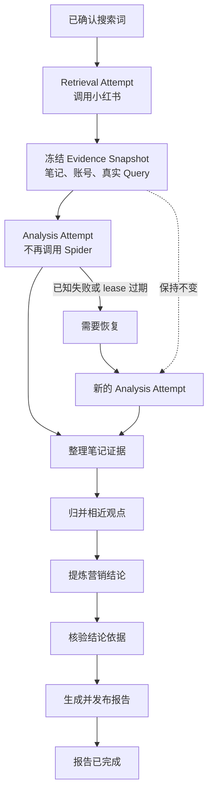
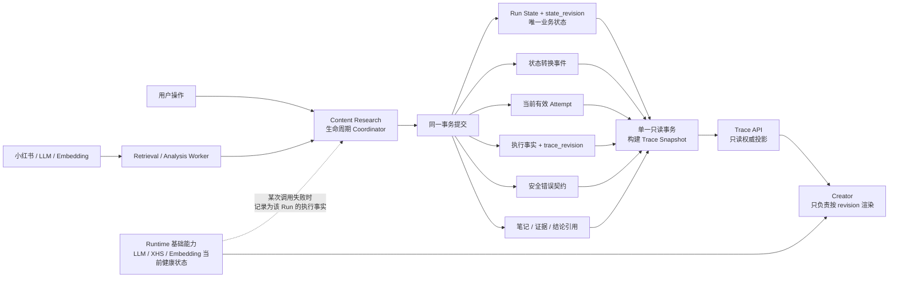

# Task 3.1 营销结论生成与真实 Trace 设计

## 状态

**READY（L2）。关键产品语义和承重 Contract Pack 已确认。**

本轮已确认“三轨是三个分析视角，不是发布配额”。上一轮审计发现的 Evidence Snapshot
内容冻结、checkpoint 复用身份、取消/重试竞态、版本化恢复、Research Embedding 边界和
历史 Trace 等承重合同已按本文统一收敛。

本设计整理 2026-08-25 围绕营销结论质量、Embedding Runtime、检索与分析
attempt 分离、worker 失联恢复、Trace 真实性和回归保护达成的约定。

它是以下文档的 Task 3.1 增量规格：

- [Content Research 主流程可靠性设计](./2026-08-23-content-research-mainline-reliability-design.md)
- [营销结论质量调研](../../release/2026-08-25-product-marketing-conclusion-quality-research.md)
- [营销结论聚合设计](./2026-08-08-f003-marketing-conclusion-aggregation-design.md)

如旧文档在营销分析可选性、空结论发布、attempt 边界、Trace fallback 或 embedding
加载时机上与本文冲突，以本文为准。

## 目标

从已经冻结的真实笔记生成有原文依据、适用条件和反向证据的产品营销结论，并保证：

1. 检索和分析是两个独立 attempt；
2. 分析重试只重放冻结证据，不再次调用 Spider；
3. LLM 只提议语义，后端验证引用、计数和发布资格；
4. Trace 只投影唯一状态机和当前有效 attempt 的持久化事实；
5. worker、LLM、Embedding 或 SQLite 失败真实收敛，不永久显示执行中；
6. 三个计划轨道都必须完成技术执行；至少一个轨道形成可核验结论时可以发布部分核验
   报告，只有方向性线索或零轨正常不足时只能发布受限报告；任一计划轨技术失败或分析
   未运行时不得发布成功报告；
7. 新增能力不得破坏已经完成的主流程、LLM、小红书登录、SQLite 协调、历史读取和 UI 风格。

## 非目标

- 不引入 BERTopic、HDBSCAN、xQuAD、RRF 或向量数据库。
- 不产生市场占比、总体趋势、统计概率或因果功效结论。
- 不自动补搜或修改冻结 Scope。
- 不迁移 PostgreSQL，不重构全仓库 SQLite，不实现多机 worker。
- 不为 Task 3.1 新建另一套业务状态机或新的用户流程阶段。
- 不增加 Design Spec 中不存在的页面框架、按钮或内部阶段名称。

## 主流程



## Runtime 基础能力

### Research Embedding Adapter

Task 3.1 新增薄边界 `SentenceTransformerResearchEmbeddingAdapter`。它属于 Research
Runtime 能力，不是新的用户生命周期阶段，也不改造现有 RAG/Chroma 服务。

进程启动时必须：

1. 从 Research 配置加载一个中文语义表现合格的 embedding 模型；
2. 使用固定中文短句预热；
3. 校验输出维度、有限数值和归一化结果；
4. 注册进程级单例 Research adapter；
5. 投影 `loading | ready | unavailable`、模型名、版本、维度和预热时间；
6. 停止 Runtime 时释放模型资源。

adapter 负责固定 title/body 输入规范、批量调用模型、校验返回数量/维度/有限数值、暴露
模型 revision/维度/归一化/输入格式组成的 fingerprint，并把失败转换为安全错误码。分析
模块只依赖 adapter 接口，不直接依赖 SentenceTransformer SDK。模型不可用时不得返回
全零向量、静默换模型或继续分析；analysis attempt 必须失败并进入可恢复状态。

adapter 不抓取笔记、不裁决结论、不写报告、不管理现有 RAG/Chroma 索引，也不在 Trace
保存完整向量。Task 3.1 不改变现有 RAG 的加载、fallback、索引或 fingerprint 行为。

adapter 不可用时应用可以以 degraded 模式启动，Runtime health 显示 Research Embedding
unavailable；已到分析阶段的 Run 必须 fail fast 进入恢复，检索、历史读取和其他不依赖该
adapter 的功能继续可用。

基础能力当前状态与 Run 历史执行事实分离。服务后来恢复不能覆盖某个 Run 已经发生的
失败事实。

## 权威对象与身份

### Evidence Snapshot

检索完成后创建不可变 Evidence Snapshot，至少绑定：

```text
workflow_run_id
scope_contract_id
retrieval_execution_unit_id
retrieval_attempt_no
frozen query groups
admitted note IDs
frozen title/body fields used by analysis
per-field source text hashes
source URL and captured-at timestamp
note -> account identity
note -> actual query provenance
snapshot fingerprint
```

同一 note 命中多个 query group 时只计算一篇独立笔记，但保留所有 query provenance。
作者独立性只表示不同小红书账号，不表示已验证的独立自然人或总体样本。

Snapshot 必须直接保存本次分析实际读取的 title/body 字段副本，不能只保存指向可变笔记表
的 ID。`snapshot fingerprint` 覆盖规范化后的字段文本、字段 hash、note/account identity、
全部 query provenance、来源 URL、采集时间和 Scope/retrieval identity。Snapshot 创建后
不可增删或覆盖；分析、重试、引用核验和历史复现都只能读取 Snapshot，不得重新调用
Spider 或用当前笔记表替换冻结文本。

原始来源后来修改、删除或暂时无法访问时，已冻结 quote 仍可用于本次报告的历史审计，
但 UI 必须把外部跳转标为不可用，不得声称已经重新验证当前页面内容。未来若引入法务
删除或数据保留策略，必须通过显式 tombstone/invalidation 合同处理，不能静默改写
Snapshot。

### Analysis Unit 与 Attempt

一个 analysis unit 由以下不可变输入唯一确定：

```text
Run + Evidence Snapshot + policy version + prompt content hash + schema hash
+ Research embedding fingerprint + analysis algorithm/threshold version + verifier version
```

analysis attempt 是一次具体执行机会。每个 analysis unit 同时最多有一个有效 attempt；
重试创建 successor attempt，不覆盖旧 attempt。新 attempt 生效后，旧 attempt、旧 lease
和旧 revision 的写入必须被 fenced。

Retrieval attempt 与 analysis attempt 分离：前者拥有 Spider 外部副作用，后者只读取
冻结证据并调用 LLM/Embedding。两者仍由同一个 Content Research 状态机推进。

## 分析合同

### 1. 原子证据抽取

对已准入笔记按有界批次调用 LLM，返回严格结构化的句子或短句级证据：

```json
{
  "quote": "跑步出汗以后后背会贴着",
  "field": "body",
  "aspect": "出汗后的贴身感",
  "evidence_type": "pain",
  "polarity": "negative",
  "qualifiers": {
    "audience": ["运动人群"],
    "scenario": ["夏季跑步"]
  },
  "proposed_tracks": ["need"]
}
```

后端拒绝以下证据：

- quote 不是命名字段的精确原文子串；
- note、Run、Snapshot 或核心对象不匹配；
- 模型补写原文没有表达的因果、功效或结果；
- 已完成 checkpoint 的 analysis unit/track/stage/input identity 不匹配，或提交者不是当前
  lease attempt。

### 2. 中文观点归并

首版流程固定为：

```text
证据类型 / aspect / qualifiers / polarity 兼容分区
→ 中文 embedding
→ cosine similarity
→ 固定阈值的层次归并
→ LLM 只命名观点组
```

相似度阈值必须由真实中文句对的人工标签校准并版本化，不能由一次 Run 动态决定。
Embedding 只提供语义相似度，不决定真实性、立场或发布状态。

### 3. 支持与反向证据

每个观点组保存支持证据 ID、反向证据 ID、适用人群和场景。后端从证据关系计算：

- 去重后的笔记数；
- 去重后的账号数；
- query group 覆盖；
- 支持与反向证据数量；
- 原文/body 引用数量。

计数可物化供读取，但权威始终是证据关系，LLM 提供的计数不可信。

### 4. 三轨语义

| 用户方向 | 允许的证据链 | 明确禁止 |
|---|---|---|
| 用户需求 | 人群/场景 → 困扰、任务或期望结果 | 推断产品已经解决需求 |
| 产品价值 | 属性 → 用户明确体验 → 价值与限制 | 原文没有的因果或功效 |
| 内容表达 | 用户原话/问题框架 → 可测试表达角度 | 推断互动、转化或投放效果 |

一条结论只描述一个兼容观点组，不为了凑齐三轨而跨组拼接。

三轨是可独立演进的分析视角，不是一次 Run 的输出配额。首版固定
`planned_tracks = [need, value, message]`，三个轨道都必须完成技术执行，但允许稀疏输出：
只要至少一个轨道形成可发布的 primary conclusion，其他轨道可以正常判定为没有可发布
结论。正常 Run 不得出现 `not_evaluated`；该状态仅保留给未来由版本化 policy 显式关闭
某轨的场景。系统不得为了满足轨道数量而跨观点组拼接、放宽证据门槛或生成占位结论。

原子证据抽取与观点归并是三轨共享 checkpoint；之后每个 planned track 使用独立、可重放
的 synthesis + verifier 操作。一个多轨 LLM 响应不得部分提交为多个成功轨道，否则无法在
单轨技术失败后安全复用其余轨道。只有该轨 verifier 与后端裁决一起提交后，轨道 checkpoint
才算 completed。

### 5. 独立核验与后端裁决

独立 verifier 将结论与其支持、反向证据配对，输出：

- `supported`；
- `refuted`；
- `not_enough_information`。

最终 primary conclusion 决定只能由后端产生：

- `selected`：通过治理阈值和证据校验；
- `directional`：存在真实方向但未达到治理阈值，只能作为“样本线索”，不是已核验结论；
- `contested`：兼容条件下支持与反向证据均达到规定门槛；
- `no_publishable_conclusion`：该轨道已评估，但没有可形成结论的有效证据；
- `analysis_failed`：该轨道已开始评估，但模型、Embedding、持久化或协议执行失败。

现有三篇独立笔记、两个不同账号是产品治理阈值，不是统计置信度。任何有效反向证据都
必须作为限制展示；只有支持与反向证据分别达到治理阈值时，主状态才升级为 `contested`。

Track analysis coverage 以每轨单一记录持久化，避免同时维护多组容易矛盾的数组：

```json
{
  "need": {
    "execution": "completed",
    "decision": "selected",
    "publication_role": "verified"
  },
  "value": {
    "execution": "completed",
    "decision": "directional",
    "publication_role": "lead"
  },
  "message": {
    "execution": "completed",
    "decision": "no_publishable_conclusion",
    "publication_role": "omitted"
  }
}
```

`published/evaluated/omitted` 列表只可从上述权威记录派生，不作为第二份持久化事实。
coverage 必须包含全部 `planned_tracks`；计划内轨道不得以 `not_evaluated` 结束。
`not_evaluated` 不得显示为“证据不足”，`analysis_failed` 也不得伪装成未评估。每轨最多
一个 primary conclusion；支持、反向证据和限制可以有多条。

## 生命周期与发布门禁

Task 3.1 不增加新的用户业务状态。营销分析发生在 `report_composing` 内部，公共中文
阶段固定为：

```text
整理笔记证据
归并相近观点
提炼营销结论
核验结论依据
生成调研报告
```

只有以下事实同时存在，才能从 `report_composing` 转换为 `report_ready`：

1. 当前 analysis attempt 以 `succeeded` 终止，全部计划轨均完成技术执行；
2. 至少一个轨道形成 `selected | contested` primary conclusion，或者分析正常完成并明确
   判定只有 `directional` 样本线索/零轨均无可发布结论；
3. 每条可见结论通过引用核验；
4. 每轨 coverage 的 execution、decision、publication role 与 conclusion/verifier 事实完整一致；
5. 全部引用属于绑定的 Evidence Snapshot；
6. report draft、faithfulness、publication、Timeline 和状态转换原子提交。

一至三个轨道有 `selected | contested` 时都发布 `partial_verified_report`，用户文案为
“已生成可核验结论”，不得显示“已完整核验”。只有 `directional` 或零轨正常不足时，
可以发布明确标为“样本线索/证据不足”的受限报告。任一计划轨分析未运行、技术失败或
协议缺失时不得发布，必须原子关闭 operation/attempt，并把 Run、错误和 transition 收敛为
`recovery_required`；失败不得改写成证据不足。

## Worker、Heartbeat、Lease 与恢复

Task 3.1 复用现有 worker lease 基础设施和初始参数：

```text
lease：120 秒
heartbeat：每 lease / 3，即 40 秒
recovery scan：每 5 秒
```

这些参数先通过 SQLite 并发和 fake-clock 故障测试验证；若要修改，必须更新本规格与
验收证据，不能散落为前后端魔法常量。

Heartbeat 属于整个 analysis attempt，不为每条证据或每个 LLM 调用创建独立心跳。
普通异常由代码立即记录；heartbeat/lease 只兜底进程被 kill、重启、OOM 或无法执行
异常收敛的情况。

lease 过期后，后台 reconciler 把 Run 收敛为 `recovery_required`。恢复创建新的 analysis
attempt 并绑定同一 Evidence Snapshot；每轨通过 verifier 后原子提交不可变 checkpoint。
只要 Snapshot、analysis contract fingerprint、轨道输入 fingerprint 和 verifier 版本完全
一致，successor 必须复用成功轨道，只重跑失败轨道；Trace 记录
`reused_from_attempt_id/reused_checkpoint_id`。任一身份变化则 checkpoint 失效，不能静默
复用。未完成或结果未知的外部调用不得假设成功。分析恢复的 Spider operation delta
必须为零。

Task 3.1 的普通重试只允许完全相同的 analysis contract。部署应用本身不影响重试资格；
只有 prompt/schema/model/输入格式/算法阈值/verifier 等 fingerprint 变化才视为不兼容。
本期不提供“旧 Snapshot 按新契约重分析”的入口；不兼容时给出安全说明并要求创建新 Run，
不把新分析伪装成旧 attempt 的 retry。

LLM/Embedding 调用发生在数据库事务外。调用超时或进程在响应后、checkpoint 提交前退出
时，结果视为未知且不得推断成功；successor 可以再次调用，因此分析保证业务幂等，但不
承诺 provider 计费 exactly-once。provider 支持幂等 request ID 时使用稳定的调用身份。

用户取消通过带 `command_id + expected_state + expected_revision + actor` 的 Coordinator
命令提交；后台故障或 lease expiry 是失败收敛，不伪装成“用户取消”。取消与 publication
竞争时第一笔成功提交的事务获胜：取消先提交则 fence worker 且禁止 publication；发布先
提交则迟到取消返回 stale conflict，客户端刷新服务端状态。

## Trace 真实投影

### 正确的 Trace 架构



这张图表达四个不可拆分的边界：

1. Coordinator 是唯一生命周期状态转换入口并授予有效 attempt/lease 身份；分析、报告和
   publication 模块可以写各自拥有的领域记录，但必须通过该身份和 fencing guard；Trace
   不直接修改任何业务记录；
2. `Run State + state_revision` 是唯一业务状态，Attempt/Operation/Checkpoint 不是并列状态机；
3. Trace Snapshot 在一个只读事务中选择当前有效 attempt 的事实，旧 attempt 只进入历史；
4. Runtime 健康状态描述“服务现在是否可用”，Run facts 描述“该次执行实际发生了什么”，两者不得互相覆盖。

### 单一快照

建立一个只读入口：

```text
ContentResearchPersistenceCoordinator.load_trace_snapshot(run_id)
```

它在同一个只读事务中读取：Run state/revision、effective attempt、当前 attempt facts、
状态转换、安全错误、证据计数摘要、三轨决定、coverage 和 publication identity。大量
证据正文和引用详情通过绑定 publication/attempt 的只读分页接口取得；不在长事务中加载
完整向量或全部冻结文本。

Research embedding 阶段的 Trace 记录 Snapshot/input fingerprint、embedding fingerprint、
文档数、批次数、成功/失败数、耗时、安全错误码和复用 checkpoint 身份。Trace 只保存
向量结果引用、维度和 checksum，不保存完整向量、模型本地路径、请求头或原始异常栈。

Trace 不再从 Brief status、`workflow.current_step`、最新 checkpoint、dispatch status 或
前端缓存推断当前状态，也不分别打开多个连接后拼接不同时间点的事实。

### 版本与前端顺序

Trace 返回：

```json
{
  "state_revision": 8,
  "trace_revision": 27,
  "effective_attempt": {
    "kind": "analysis",
    "attempt_no": 2
  }
}
```

`state_revision` 只在业务状态转换时增加；`trace_revision` 在任何公共 Trace 事实提交时
单调增加，它不是第二套状态机。前端必须丢弃较小 revision 的迟到响应。

Trace 轮询连续三次读取失败后显示“暂时无法确认最新状态”和最后同步时间，不得继续
把缓存的 `running` 当作事实。成功读取后恢复服务端权威状态。

旧 Run 使用 `legacy_v1` 只读投影，`effective_attempt` 为 `null`；只展示历史中实际记录的
事实，并明确提示“旧调研缺少新版分析明细”。不得回填新版 coverage、推断 attempt 或给
旧 Run 开放分析重试。

新 Run 的 publication 是不可变 revision lineage：同一 Run 同时只有一个
`current_publication_id`。首次发布和同一命令重放必须返回同一 identity。发布后检测到完整
性损坏时，旧 publication 保持历史记录但标记 `integrity_flagged`，当前报告停止展示；仅
服务端授权的 `repair_publication` 命令可以从同一组仍有效的 verified outputs 创建 successor
并原子切换 current pointer。若 verified outputs 本身无效，则不能修复，用户只能创建新 Run。

### 用户可视化

正常状态只显示真实事实和计数：

```text
调研报告生成中
当前：提炼营销结论

● 整理笔记证据    40 篇笔记 / 63 条有效原文证据
● 归并相近观点    8 个观点组
● 提炼营销结论    用户需求已完成；产品价值分析中；内容表达等待处理
○ 核验结论依据    尚未开始
○ 生成调研报告    尚未开始
```

不显示无法证明的百分比进度。存在分歧时显示支持/不同体验的独立笔记和不同账号数量，
不暴露账号 ID。恢复动作只使用后端 `allowed_actions`，不由浏览器发明。

## Contract Pack

### 用户状态

| ID | 状态/子阶段 | 用户投影 | 允许操作 | 禁止 |
|---|---|---|---|---|
| `STATE-31-01` | `report_composing` / analysis queued | 正在准备分析已采集笔记 | 等待、取消 | 再次检索、显示报告完成 |
| `STATE-31-02` | `report_composing` / analysis running | 五个中文分析子阶段及真实计数 | 等待、取消 | 内部阶段名、虚构百分比 |
| `STATE-31-03` | `recovery_required` / analysis | 失败阶段、安全错误、最后完成事实 | 服务端授权的重试分析 | 重新 Spider、继续显示运行中 |
| `STATE-31-04` | `report_ready` | 稀疏轨道结论或诚实的零结论受限报告；显示限制、支持/反向引用和轨道覆盖 | 只读 | 声称未完成轨道已核验、重开旧 attempt、改写历史证据 |
| `STATE-31-05` | `cancelled_or_failed` / reason=user_cancelled | 用户已取消；显示取消时间，不显示技术失败 | 只读 | retry、publication、successor worker 写入 |
| `STATE-31-06` | `report_ready` / publication integrity flagged | 报告暂时不可用，无法确认其完整性 | 只读；服务端可授权 repair | 继续展示旧报告、客户端自行修复、覆盖旧 publication |
| `STATE-31-07` | `recovery_required` / incompatible contract | 分析版本已更新，本次结果不能按原版本重试 | 创建新 Run | 普通 retry、复用不兼容 checkpoint |

### 权威

| ID | 规则 |
|---|---|
| `AUTH-31-01` | Run state/revision 仍是唯一业务状态权威；analysis attempt 不是状态机。 |
| `AUTH-31-02` | Evidence Snapshot 是分析输入的唯一证据权威；它冻结实际 title/body 字段副本、字段 hash、来源与 query provenance，创建后不可变，分析不得回读可变笔记表。 |
| `AUTH-31-03` | 同一 analysis unit 同时最多一个有效 attempt；重试创建 successor。当前 lease attempt 才能提交；迟到 attempt 被 fenced。 |
| `AUTH-31-04` | 当前 Trace 明细只选择 Run 明确指向的有效 attempt，不选择 `latest`。 |
| `AUTH-31-05` | LLM 提议语义；后端拥有引用、计数、状态和发布资格。 |
| `AUTH-31-06` | Runtime 健康状态与 Run 执行事实分离。 |
| `AUTH-31-07` | Trace Snapshot 的 state、attempt、facts、error 和 publication 来自同一只读事务。 |
| `AUTH-31-08` | Track analysis coverage 是轨道完成范围权威；首版 planned tracks 固定三轨且必须完成技术执行，但不是输出配额。每轨最多一个 primary conclusion。 |
| `AUTH-31-09` | 完整且通过 verifier 的轨道 checkpoint 属于 analysis unit + track + stage + input fingerprint，不属于单次 attempt；身份完全一致的 successor 必须复用。 |
| `AUTH-31-10` | Coordinator 独占生命周期迁移权；领域模块在有效 attempt/lease/fencing 身份下写入自己拥有的记录，不把 Coordinator 扩张为唯一物理写入者。 |
| `AUTH-31-11` | analysis contract 是否兼容只由内容 fingerprint 决定；app version 仅审计，不参与普通重试 identity。 |
| `AUTH-31-12` | 每个 mutation command 由 command_id、actor、expected state/revision 定位；同一 command 重放返回同一结果，stale command 不猜测目标。 |
| `AUTH-31-13` | 每个 Run 同时一个 current publication；publication revision 不可变，修复创建 successor 并切换显式 pointer，不选择 `latest`。 |
| `AUTH-31-14` | 一个 retrieval attempt 只能冻结一个 Snapshot；一个完整 analysis contract 对应一个 analysis unit；每个 unit 同时一个有效 attempt；每个 unit/track/stage/input identity 最多一个 completed checkpoint。 |
| `AUTH-31-15` | Track analysis decision 与 publication disposition 是两个独立权威：前者记录冻结证据上的不可变分析事实，后者记录某个不可变 publication revision 是否发布该轨。faithfulness 不得把 `selected` 改写成 `analysis_unavailable`。 |

### 转换与原子边界

| ID | From → event → To | Guard 与原子写入 | 副作用 |
|---|---|---|---|
| `INV-31-01` | Coverage 满足/接受受限结果 → `analysis_queued` → `report_composing` | 在同一事务冻结完整 Evidence Snapshot manifest、创建 analysis unit/attempt、更新 Run/event；重复命令返回同一 Snapshot identity | 提交后唤醒 analysis worker |
| `INV-31-02` | queued → worker claim → running | claim、lease、attempt state、Run fact 同事务 | 无 |
| `INV-31-03` | running → track/stage completed → running | stage output、不可变 checkpoint、fact、trace revision 同事务 | LLM/Embedding 在事务外执行 |
| `INV-31-04` | running → all planned tracks completed → report composing | 三轨决定、verifier result、track coverage、attempt succeeded 同事务；任一计划轨技术失败不得走此转换 | 无 |
| `INV-31-05` | composing → publication committed → `report_ready` | 至少一轨 selected/contested，或只有 directional/零轨正常不足；report/faithfulness/publication/track coverage/每轨 publication disposition/Timeline/state 同事务。审计撤回只写 publication disposition=`withheld_by_faithfulness`，不修改 analysis decision/checkpoint | 无重复 publication；最终报告状态按仍可见轨道计算 |
| `INV-31-06` | 任意分析阶段 → 已知失败/lease expiry → `recovery_required` | operation、attempt、Run、error、event 一起收敛 | 不自动 Spider |
| `INV-31-07` | recovery → retry analysis → `report_composing` | successor attempt 绑定同一 Snapshot/contract；复用成功轨 checkpoint，只调度失败轨；旧 attempt fenced | 仅重放失败分析，不调用 Spider |
| `INV-31-08` | analysis complete → coverage validation failed → `recovery_required` | 拒绝 coverage/attempt success，写 `TRACK_COVERAGE_INCONSISTENT`、error、event 与 Run 状态 | 不创建 report/publication/message |
| `INV-31-09` | published → integrity defect detected → `report_ready` | 保留历史 Run 终态；publication 原子标记 `integrity_flagged` 并停止对外展示 | 仅 `INV-31-11` 可创建 successor publication，不覆盖原记录 |
| `INV-31-10` | running/composing → user cancel → `cancelled_or_failed` / user_cancelled | command identity、expected revision、Run/event、attempt fencing 同事务 | 取消提交后禁止 worker checkpoint、publication 和 Timeline message |
| `INV-31-11` | integrity flagged → repair publication → `report_ready` | 仅复用仍有效 verified outputs；创建不可变 successor、切换 current pointer、写 Timeline/result 同事务 | 不调用 Spider/LLM/Embedding |

### 失败、共存与历史

| ID | 规则 |
|---|---|
| `FAIL-31-01` | LLM/Embedding/协议失败必须关闭 operation 和 attempt，不得生成空成功报告。 |
| `FAIL-31-02` | 进程消失后 lease 过期必须在有界时间内收敛为恢复状态。 |
| `FAIL-31-03` | SQLite 锁重试耗尽后投影安全持久化错误，不得保持假运行。 |
| `FAIL-31-04` | 旧 attempt、旧 lease、Run A 和迟到响应不得覆盖当前 analysis attempt。 |
| `FAIL-31-05` | 分析重试的 Spider operation delta 必须为零；已完成共享/成功轨 checkpoint 的 LLM/Embedding 调用 delta 也必须为零；失败或未知调用允许重放。 |
| `FAIL-31-06` | Trace API 不可读时浏览器显示无法确认，不沿用缓存 running。 |
| `FAIL-31-07` | 历史报告只读兼容，不自动回填或用新算法重写。 |
| `FAIL-31-08` | Cookie、Key、Prompt、请求头、原始 provider payload 和未脱敏错误不得进入公共 Trace。 |
| `FAIL-31-09` | 任一计划轨技术失败都进入恢复且禁止 publication；已成功轨 checkpoint 保留并由兼容 successor 复用。未评估、证据不足和失败不得互换。 |
| `FAIL-31-10` | 原始笔记变化、删除或外链失效不得改变冻结分析输入；历史 quote 保留，外部导航降级；禁止静默刷新 Snapshot。 |
| `FAIL-31-11` | coverage 缺失或矛盾是显式后端完整性错误，不得只靠“不生成报告”掩盖；发布前进入恢复，发布后 integrity flag 并停止展示。 |
| `FAIL-31-12` | analysis contract fingerprint 不兼容时禁止普通 retry；Task 3.1 不用当前版本静默重算旧 Snapshot，用户需创建新 Run。 |
| `FAIL-31-13` | 旧 Run 仅 legacy_v1 只读；不得从 Brief/current step/最新 checkpoint 推断新版 attempt 或 coverage。 |
| `FAIL-31-14` | cancel/publication、retry/reconciler 和重复命令均由 expected revision + command idempotency + first-commit-wins 裁决；迟到方返回当前投影，不覆盖胜者。 |
| `FAIL-31-15` | provider 返回未知时不得提交猜测结果；兼容 successor 可再次调用，业务结果幂等但可能产生重复 provider 计费。 |
| `FAIL-31-16` | integrity repair 只允许从仍通过 Snapshot、citation、coverage 校验的 verified outputs 生成；否则 publication 保持 flagged 且要求新 Run。 |
| `FAIL-31-17` | `withheld_by_faithfulness` 表示分析已完成但本 publication 未采用，不得映射为技术失败、证据不足或 `analysis_unavailable`；不得仅因此授权 analysis retry。历史 publication 缺少 disposition 时只读地从其冻结 section/omission 推导，不回填、不重算。 |

### 回归保护

| ID | 必须保持的能力 |
|---|---|
| `REG-31-01` | PreResearch → Brief → Scope 的交互与状态不变。 |
| `REG-31-02` | 冻结 query、Spider query 和 Trace query 保持同一 identity。 |
| `REG-31-03` | 核心搜索词是唯一硬性对象条件，两个补充词继续可选。 |
| `REG-31-04` | LLM 配置、连接验证、Key 脱敏保持正常。 |
| `REG-31-05` | 小红书 Cookie/扫码登录、重启恢复和脱敏保持正常。 |
| `REG-31-06` | 现有 retrieval attempt 的 dispatch/lease/heartbeat 语义不回归。 |
| `REG-31-07` | 历史 Run、Scope、报告与笔记引用保持只读可用。 |
| `REG-31-08` | Trace 读取保持只读、连接有界且不制造 SQLite 写竞争。 |
| `REG-31-09` | 数据库迁移只增量扩展，不重写历史记录。 |
| `REG-31-10` | 当前有效测试无新增失败；废弃旧规格测试删除或重写，不作为已知失败保留。 |

### 验收证据

| ID | 场景 | 必须观察到的结果 | 证明层 |
|---|---|---|---|
| `ACC-31-01` | 正常 Creator 主线 | 真实 query → 冻结证据 → analysis attempt → 至少一轨可核验结论 → 部分报告 → Trace 完成 | Browser-to-owned-stack |
| `ACC-31-02` | 分析 LLM/协议失败 | `recovery_required`、安全错误、无 publication | Fault-controlled adapter + real SQLite |
| `ACC-31-03` | Embedding 启动/调用失败 | 基础能力 unavailable；Run 分析失败；无零向量降级 | Runtime integration + browser projection |
| `ACC-31-04` | analysis worker 中途退出 | lease 过期后有界收敛；Trace 不永久 running | Fake clock + worker/SQLite |
| `ACC-31-05` | 分析恢复 | successor attempt 使用同一 Snapshot；Spider delta 为零 | Recording provider + real worker |
| `ACC-31-06` | 迟到 attempt/Run A | 写入被 fenced；当前 Run/Trace/报告不变 | Concurrency integration |
| `ACC-31-07` | SQLite 锁/发布失败 | 错误、attempt、Run 原子一致；无假报告 | Fault-injected SQLite |
| `ACC-31-08` | 支持与反向证据 | `contested`/限制真实展示且可打开精确原文 | Deterministic model + browser |
| `ACC-31-09` | Trace 乱序/连续失败 | 旧 revision 被丢弃；三次失败后显示无法确认 | Frontend async tests + intercepted UI |
| `ACC-31-10` | 营销分析缺失或任一计划轨技术失败 | 不得进入 `report_ready` | Real service/publication integration |
| `ACC-31-11` | 基础回归矩阵 | LLM/XHS/Scope/History/Trace/SQLite 当前契约全部通过 | Focused suites + authenticated canary |
| `ACC-31-12` | Secret redaction | 公共 API/DOM 无 Cookie、Key、Prompt、raw payload/error | API/security/browser tests |
| `ACC-31-13` | 只有一轨形成结论 | 发布 `partial_verified_report`；其余轨道记录真实 omitted reason；不显示“已完整核验” | Real service + browser |
| `ACC-31-14` | 零轨正常不足与零轨失败 | 前者发布受限无结论报告；后者进入恢复；两者不可互换 | Deterministic model + fault adapter |
| `ACC-31-15` | 原始笔记在 Snapshot 后变化/删除 | 重试和历史报告仍使用原字段 hash/quote；不调用 Spider；外链投影为不可用 | Real SQLite + mutable source fixture |
| `ACC-31-16` | 一轨 verifier 成功、另一轨技术失败后重试 | 首次无 publication；成功轨 checkpoint 身份不变且 LLM/Embedding 调用 delta 为零；仅失败轨重跑 | Recording adapters + real SQLite |
| `ACC-31-17` | 只有 directional 线索 | 只发布受限“样本线索”报告；不显示“已核验结论”，不计入 verified 指标 | Real service + browser |
| `ACC-31-18` | 反向证据低于 contested 门槛 | primary 可保持 selected/directional，但限制区仍展示全部有效反向引用 | Deterministic model + browser |
| `ACC-31-19` | coverage 矛盾 | 后端返回 `TRACK_COVERAGE_INCONSISTENT`、Run 恢复、无 artifact/message；已发布存量则 integrity flag 并停止展示 | Real SQLite + publication integration |
| `ACC-31-20` | app 升级但 analysis fingerprints 未变/已变 | 前者普通 retry 并复用 checkpoint；后者拒绝 retry 且不静默重算 | Versioned adapter integration |
| `ACC-31-21` | legacy_v1 历史 Run | effective attempt 为 null、提示缺少新版明细、只读且无 retry | API + history browser |
| `ACC-31-22` | cancel 与 publication 竞态 | 两种提交顺序分别证明 first-commit-wins；取消胜出后无 artifact/message，发布胜出后 stale cancel 不改历史 | Barrier-controlled SQLite integration |
| `ACC-31-23` | provider 响应后、checkpoint 前 crash | 未知结果不出现；successor 仅重跑未提交调用；已提交轨道仍复用；允许观测到重复 provider 调用 | Fault-controlled adapter + real SQLite |
| `ACC-31-24` | publication integrity repair | flagged 报告停止展示；有效 outputs 创建唯一 successor 并原子切换；无效 outputs 拒绝修复 | Publication integration + browser |
| `ACC-31-25` | selected 轨道被 faithfulness 撤回 | analysis checkpoint/Trace 仍为 selected；publication disposition 为 `withheld_by_faithfulness`；报告明确“分析已选定但本次未发布”，不显示分析不可用、不授权分析重试；最终 publication state 按剩余可见轨道计算 | Real publication/read model + API + browser |

## 旧规格删除

Task 3.1 首次替代相应行为时，必须删除或重写：

- 新 Run 通过 `template_only` 或缺失 policy 静默跳过营销分析的路径；
- 营销分析为空或只完成部分轨道仍发布 `complete_verified_report` 的逻辑和测试；
- 当前阶段从 Brief、runtime current step 或旧 checkpoint fallback 推断的 Trace 逻辑；
- 把旧/最新 checkpoint 当作当前 attempt 的路径；
- 前端泄露 `marketing_conclusion`、`formal_research`、`coverage`、`report` 等内部阶段名；
- 与 `contested`、`analysis_failed` 和独立 analysis attempt 冲突的旧 fixtures。

历史数据读取 decoder 可以保留，但不得继续驱动新 Run mutation。

## Readiness Gate

**READY。风险级别为 L2。** Gate 结论：

1. 用户状态、allowed actions、directional/verified/insufficient 投影已明确；
2. Snapshot、analysis unit/attempt、per-track checkpoint、publication identity 与唯一性已明确；
3. stage completion、失败、取消、发布、repair 的事务边界已明确；
4. Spider、LLM/Embedding、publication 的幂等与 unknown-outcome 语义已明确；
5. crash、lease、迟到 worker、竞态、版本不兼容、legacy history 与 migration 已明确；
6. 高风险 invariant 已映射至 `ACC-31-*` 的可观察 proof layer；
7. 3.1-A 保持不可达，3.1-B 首次可达时一次性交付 fencing、恢复、Trace 和发布门禁。

未解决的 load-bearing spec hole：**无**。实现中若发现需要改变上述状态、身份、cardinality、
恢复或 publication 语义，必须重新降级为 NOT READY，而不是在代码中自行选择默认值。
