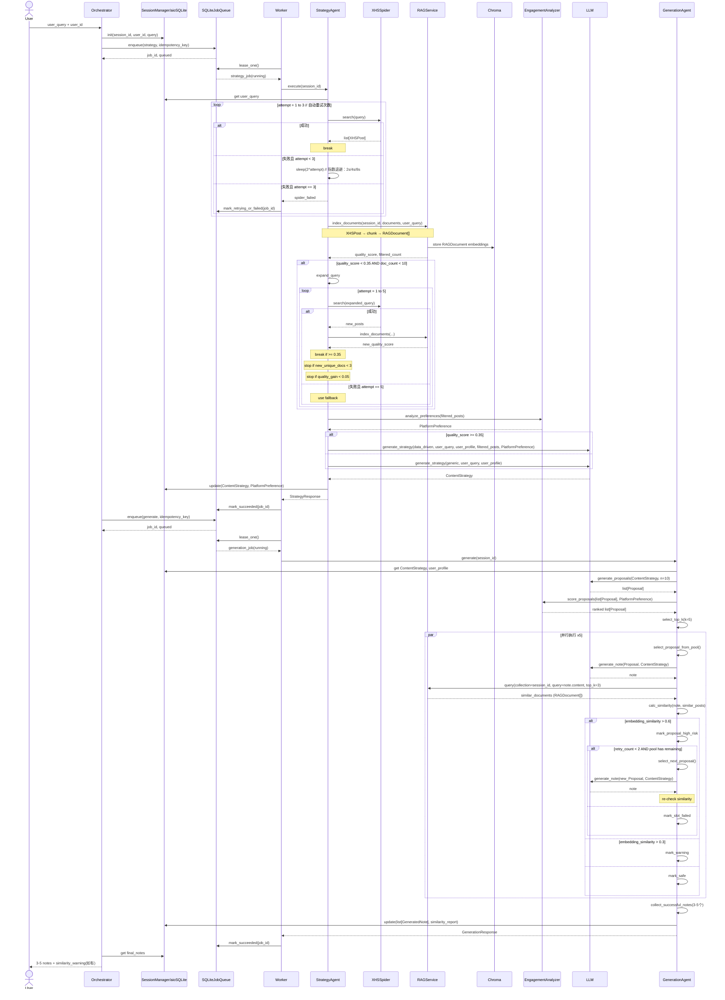

# XHS Note Generator V1

## 1. System Architecture

### 1.1 Overview
Multi-agent system for Xiaohongshu content strategy, topic exploration, and post generation. Supports two first-class modes: EDITING MODE (data-driven strategy + generation) and EXPLORATION MODE (research planner for topic discovery). The deployment-state ground truth is [Deployment Spec §1 Product & Deployment Definition](../deployment/deployment_spec.md#1-product--deployment-definition).

Current frontend alignment:

- The current product frontend maps V1 primarily to the `Creator Workbench` (`/creator`).
- The Creator Workbench MVP uses `EDITING MODE` first: `session -> strategy -> generation -> SSE progress -> generated notes`.
- `EXPLORATION MODE` remains a designed capability but is not part of the initial Creator Workbench MVP surface. It should be introduced later as a dedicated "topic exploration" sub-mode with candidate cards, refine/refresh, and confirm-to-strategy handoff.
- V1 acts as the Local Agent Runtime in the deployment architecture defined in `docs/deployment/deployment_spec.md`.

Deployment alignment notes:

- Earlier `轻量，单机部署` wording is superseded by [Deployment Spec §1.2 Core Positioning](../deployment/deployment_spec.md#12-core-positioning): V1 is the local Agent Runtime in a cloud UI + local runtime + cloud LLM inference architecture.
- Any V1 mention of Redis, Celery, Gunicorn workers, PostgreSQL, sharding, or object storage is future migration context only. The MVP runtime decisions are defined by [Deployment Spec §6 Technical Decisions](../deployment/deployment_spec.md#6-technical-decisions).
- The local API boundary, loopback binding, browser-to-local-runtime call path, and CORS/PNA constraints are defined by [Deployment Spec §3.1 Cloud Frontend Modules](../deployment/deployment_spec.md#31-cloud-frontend-modules), [§7.1 PNA and Browser Access to Localhost](../deployment/deployment_spec.md#71-pna-and-browser-access-to-localhost), and [§7.2 CORS and Local Security Boundary](../deployment/deployment_spec.md#72-cors-and-local-security-boundary).
- Chroma is a local vector index owned by the local runtime. It must not be described as a separate deployed service on the same `127.0.0.1:8000` API port; see [Deployment Spec §1.4 Deployment Model](../deployment/deployment_spec.md#14-deployment-model).

### 1.2 High-Level Architecture

```
┌─────────────────────────────────────────────────────────────────────────────┐
│                              API Layer (FastAPI)                             │
├─────────────────────────────────────────────────────────────────────────────┤
│  POST /sessions                │  POST /sessions/{id}/explore                │
│  POST /sessions/{id}/strategy  │  POST /sessions/{id}/generate               │
│  POST /sessions/{id}/exploration/confirm  │  POST /sessions/{id}/resume      │
│  GET  /sessions/{id} /jobs/{job_id} /sessions/{id}/events                    │
└─────────────────────────────────────────────────────────────────────────────┘
                                       │
                                       ▼
┌─────────────────────────────────────────────────────────────────────────────┐
│                               Orchestrator                                   │
│  - Route requests to appropriate agents                                      │
│  - Manage session lifecycle                                                  │
│  - Handle mode switching (exploration | editing)                             │
└─────────────────────────────────────────────────────────────────────────────┘
                                       │
                                       ▼
┌─────────────────────────────────────────────────────────────────────────────┐
│                              LangGraph Workflow                              │
│  ┌─────────────┐    ┌──────────────────┐    ┌─────────────┐    ┌──────────┐ │
│  │   START     │───→│  EXPLORATION     │───→│  STRATEGY   │───→│ GENERATE │ │
│  └─────────────┘    │  (optional path) │    └─────────────┘    └────┬─────┘ │
│          │          └─────────┬────────┘            │                 │       │
│          │                    │                     │                 ▼       │
│          └────────────────────┴─────────────────────┴────────────→ COMPLETED │
│              exploring -> confirm -> candidate_selected -> strategy         │
│                strategy path may expand query on low quality_score          │
└─────────────────────────────────────────────────────────────────────────────┘
                                       │
                   ┌───────────────────┼───────────────────┐
                   ▼                   ▼                   ▼
          ┌─────────────────┐ ┌─────────────────┐ ┌─────────────────┐
          │ Exploration     │ │  StrategyAgent  │ │    Session /    │
          │ Planner         │ │                 │ │  State Store    │
          │ - plan          │ │ - retrieve      │ │ - SQLite        │
          │ - evaluate      │ │ - rank          │ │ - Checkpointer  │
          │ - handoff       │ │ - analyze       │ │ - recovery      │
          └─────────────────┘ └─────────────────┘ └─────────────────┘
                   │                   │                   │
                   ▼                   ▼                   ▼
          ┌─────────────────┐ ┌─────────────────┐ ┌─────────────────┐
          │ Search /        │ │ GenerationAgent │ │  SQLite DB      │
          │ Synthesis       │ │                 │ │  + Chroma       │
          │ Workers         │ │ - parallel gen  │ │                 │
          │                 │ │ - similarity chk│ │                 │
          └─────────────────┘ └─────────────────┘ └─────────────────┘
                   │                   │
                   ▼                   ▼
          ┌─────────────────┐ ┌─────────────────┐
          │ XHS / Web /     │ │      LLM        │
          │ Cache Providers │ │ Unified Client  │
          └─────────────────┘ └─────────────────┘
```

### 1.3 Project Structure

``` tree
xhs_note_generator/
├── app/
│   ├── __init__.py
│   ├── main.py                          # FastAPI 入口，应用初始化和中间件
│   ├── config.py                        # Pydantic Settings，环境变量配置
│   │
│   ├── api/                             # REST API 层
│   │   ├── __init__.py
│   │   └── routes/
│   │       ├── __init__.py
│   │       └── router.py                # API 端点定义：POST /sessions, /explore, /exploration/confirm, /strategy, /generate, /resume, GET /sessions, /jobs/{id}, /sessions/{id}/events
│   │
│   ├── agents/                          # Agent 实现
│   │   ├── __init__.py
│   │   ├── orchestrator.py              # Orchestrator：会话生命周期管理、任务分发、错误处理
│   │   ├── exploration_planner.py       # Exploration Planner：研究型选题探索、动作决策、handoff
│   │   ├── content_strategy_agent.py    # StrategyAgent：数据检索、互动评分、RAG索引、策略生成
│   │   └── content_generation_agent.py  # GenerationAgent：提案生成、并行生成、相似度检查、失败重选
│   │
│   ├── services/                        # 业务服务层
│   │   ├── __init__.py
│   │   ├── web_search/                  # 统一 Web Search 能力抽象、provider、编排与 evidence pipeline
│   │   ├── exploration_search_worker.py # SearchWorker：provider 选择、检索、去重、排序、摘要、证据持久化
│   │   ├── exploration_synthesis_worker.py # SynthesisWorker：候选生成、去同质化、fallback 卡片
│   │   ├── xhs_spider.py                # XHS Spider 封装：Git submodule 调用、指数退避重试
│   │   ├── rag_service.py               # RAG 服务：Chroma collection 管理、文档索引、相似度查询
│   │   └── engagement_analyzer.py       # 互动分析：Engagement 评分、平台偏好分析、提案评分
│   │
│   ├── memory/                          # 状态持久化
│   │   ├── __init__.py
│   │   ├── session_state.py             # SessionManager：aiosqlite CRUD + LangGraph Checkpointer
│   │   ├── exploration_state_store.py   # ExplorationStateStore：session/turn snapshot、refs、recovery anchor
│   │   └── job_store.py                 # JobStore：SQLite 持久任务队列（入队/抢占/恢复）
│   │
│   ├── workers/                         # 后台任务执行
│   │   ├── __init__.py
│   │   └── job_worker.py                # JobWorker：轮询 jobs 表并执行 explore/strategy/generation
│   │
│   ├── graph/                           # LangGraph 工作流
│   │   ├── __init__.py
│   │   ├── state.py                     # AgentState TypedDict 定义
│   │   ├── workflow.py                  # StateGraph 编译、节点连接
│   │   └── edges.py                     # 条件边逻辑：quality_score 判断、阶段流转
│   │
│   ├── models/                          # 数据模型
│   │   ├── __init__.py
│   │   ├── exploration.py               # Exploration 模型：SearchPlan, EvidenceSummary, TopicCandidate, ExplorationTurn, ExplorationTrace
│   │   └── schemas.py                   # 通用 Pydantic 模型：Session, ContentStrategy, GeneratedNote, SimilarityCheck 等
│   │
│   ├── prompts/                         # LLM 提示词
│   │   ├── __init__.py
│   │   ├── strategy.py                  # 策略生成提示词：query expansion, strategy generation
│   │   └── generation.py                # 内容生成提示词：proposal generation, note generation
│   │
│   └── llm/                             # LLM 客户端
│       ├── __init__.py
│       └── client.py                    # 统一 LLM 客户端：Anthropic, DeepSeek, MiniMax, Kimi 多提供商支持
│
├── third_party/                         # 第三方代码（Git submodule）
│   └── Spider_XHS/                      # XHS Spider 库：https://github.com/cv-cat/Spider_XHS
│       └── ...                          # 爬虫实现，由上游维护
│
├── data/                                # 运行时数据（gitignored）
│   ├── xhs_agent.db                     # SQLite 数据库：会话状态、checkpoint 数据
│   └── chroma/                          # Chroma 持久化目录：单 collection 向量索引数据
│
├── tests/                               # 测试（具体文件/矩阵以 docs/testing_strategy.md 为准）
│   ├── conftest.py                      # Pytest 配置：共享 fixtures、mock 工具
│   ├── fixtures/                        # 测试数据
│   │   └── sample_documents/            # 测试文档
│   ├── unit/                            # 单元测试（开发即测）
│   ├── integration/                     # 集成测试（模块完成即测）
│   ├── e2e/                             # 端到端测试
│   └── acceptance/                      # 真实依赖验收测试（如启用）
│
├── docs/                                # 文档
│   ├── api_schemas.md                   # API 参考：数据模型定义、接口契约
│   ├── data_model_diagram.md            # 数据流：ER图，流程图，存储架构设计
│   ├── schema_design_notes.md           # Schema 设计策略和决策记录
│   └── CHANGELOG.md                     # 版本历史
│
├── dev_spec.md                          # 开发规范：架构、时序图、实现清单、错误处理、存储架构
├── .env.example                         # 环境变量模板：所有配置项及默认值
├── .gitmodules                          # Git submodule 配置：Spider_XHS 引用
├── requirements.txt                     # Python 依赖：aiosqlite, langgraph, chromadb 等
├── pyproject.toml                       # 项目元数据：名称、版本、构建配置
└── README.md                            # 快速开始：安装、运行、基本用法
```

### 1.4 Module Design

| 模块 | 职责 | 关键技术点 |
|------|------|-----------|
| **API Router** | 提供 RESTful API 端点，处理 HTTP 请求/响应，参数校验，触发任务入队 | FastAPI, Pydantic Schema, Idempotency-Key |
| **Orchestrator** | 路由请求到对应 Agent，管理会话生命周期，协调多阶段工作流 | Job dispatch, Session 状态机, 错误统一处理 |
| **JobStore** | 持久化任务入队、抢占、状态流转、崩溃恢复 | SQLite jobs 表, Lease 机制, 原子更新 |
| **JobWorker** | 轮询任务并执行 Strategy/Generation 工作流 | Polling Loop, Retry Backoff, Idempotent Execution |
| **ExplorationPlanner** | 选题探索主循环、动作决策、候选收敛与 handoff | Planning loop, turn orchestration, fail-soft recovery |
| **SearchWorker** | provider 选择、检索、标准化、去重、排序、摘要、证据持久化 | Multi-provider retrieval, dedupe, ranking, persistence hooks |
| **SynthesisWorker** | 从证据摘要生成候选卡片、去同质化、模板回退 | LLM synthesis, candidate diversification, deterministic fallback |
| **StrategyAgent** | 数据检索、互动分析、内容策略生成；支持数据驱动/通用双模式 | Query Expansion, engagement_rate 评分, quality_score 阈值判断 |
| **GenerationAgent** | 提案生成、5路并行笔记生成、相似度检查与重选 | Asyncio 并发, Temperature 映射, Proposal 池管理 |
| **SessionManager** | 会话 CRUD、生命周期管理（alive/frozen/purged）、LangGraph Checkpointer 集成 | aiosqlite, Pydantic, SQLite WAL 模式 |
| **ExplorationStateStore** | exploration session/turn 状态持久化、trace anchor、恢复读写 | turn snapshot, evidence refs, recovery anchor |
| **XHSSpider** | 封装第三方 Spider，提供带重试的搜索接口，错误分类 | 指数退避 (详见 §10.4.1), 错误分类 (Transient/Permanent), 3+2 次重试 |
| **RAGService** | 向量索引、相似度查询、质量评分计算 | ChromaDB, 单 Collection + 复合 ID + metadata 过滤, Embedding 向量 |
| **EngagementAnalyzer** | 笔记互动评分、平台偏好分析、提案排序 | `engagement_rate = λ*norm_likes + (1-λ)*norm_collects`, Min-Max 归一化, 统计聚合 |
| **LLMClient** | 统一多提供商 LLM 调用接口，支持 Kimi/Anthropic/DeepSeek/MiniMax | Factory 模式, 异步客户端, 温度/模型参数配置 |
| **Workflow** | LangGraph 状态图定义、节点编排、条件边路由 | StateGraph, TypedDict State, Checkpoint 持久化 |

**模块依赖关系**:
```
API Router → JobStore → JobWorker → Orchestrator → [ExplorationPlanner | StrategyAgent | GenerationAgent]
                              ↓
                    [SessionManager | XHSSpider | Web Search | RAGService]
                              ↓
              [EngagementAnalyzer | LLMClient]
```

### 1.4.1 Frontend Coverage and MVP Scope

The current frontend maps V1 capabilities to the Creator Workbench, not to the V2 growth console.

MVP scope for `/creator`:

- Create or reuse a workflow session.
- Enqueue strategy and generation jobs.
- Subscribe to session/job events through SSE.
- Keep the chat input available while long-running jobs execute.
- Render generated strategy, generated notes, job state, and failure/degraded states.

Deferred V1 capabilities:

- `EXPLORATION MODE` and its branch/roll/candidate model.
- `ExplorationPlanner`, `ExplorationStateStore`, `SearchWorker`, and `SynthesisWorker` as user-facing creator features.
- Exploration candidate cards, refine/refresh actions, multi-branch history, and confirm-to-strategy handoff.

When exploration is introduced, it must be a distinct Creator Workbench sub-mode. It must not be treated as already covered by the current chat-and-generation MVP.

---

## 1.5 技术栈架构 (Technical Architecture)

本节按模块详细说明技术架构设计，包含核心设计原则、技术选型、关键决策与实现方案。

---

### 1.5.1 API Router (Web 层)

**核心设计原则**：异步优先、任务持久化、实时反馈

**技术选型**：
- **FastAPI** (>=0.104)：ASGI 框架，原生支持 `async/await`
- **Pydantic v2**：请求/响应模型校验与序列化
- **SQLite Job Queue**：单机持久任务队列（无外部中间件）
- **Server-Sent Events (SSE)**：流式进度推送（正式接口）

**关键决策项**：
| 决策 | 选择 | 理由 |
|------|------|------|
| 同步 vs 异步 | 异步 | I/O 密集型（LLM 调用、Spider、DB），避免阻塞 |
| 长任务触发 | API 入队 + Worker 执行 | 避免请求阻塞，进程重启后任务可恢复 |
| 流式协议 | SSE | 比 WebSocket 简单，适合单向推送任务进度 |
| 重连游标 | `Last-Event-ID` | 遵循 SSE 标准，客户端自动重连兼容性最好 |
| 部署方式 | 本地 FastAPI Runtime | 端口、loopback 绑定、CORS/PNA 与浏览器直连路径以 [Deployment Spec §8.1](../deployment/deployment_spec.md#81-phase-1-cloud-frontend-connects-to-local-runtime) 为准 |

**实现方案**：
```python
@app.post("/sessions/{id}/strategy")
async def execute_strategy(session_id: str):
    # 仅入队，不直接执行长任务
    job = await job_store.enqueue(
        session_id=session_id,
        job_type="strategy",
        idempotency_key=request.headers.get("Idempotency-Key")
    )
    return {
        "session_id": session_id,
        "job_id": job.id,
        "job_status": "queued"
    }
```

**单机实现约束（必须）**：
- **禁用裸 `asyncio.create_task()`**：所有策略/生成任务必须先持久化到 SQLite `jobs` 表
- **Worker lease 抢占**：通过事务 + `lease_expires_at` 避免多 worker 重复消费
- **SSE 事件流**：`GET /sessions/{id}/events` 推送 `stage_changed/task_progress/task_failed/task_completed`
- **SSE 重连标准化**：仅 `Last-Event-ID`，服务端补发未消费事件后再进入实时流

**未来可优化**：
- **任务队列迁移**：Redis/arq/Celery 只属于未来协作或多机迁移选项；MVP 继续遵循 [Deployment Spec §6](../deployment/deployment_spec.md#6-technical-decisions) 的 SQLite Queue + Worker。
- **流式细化**：增加 token 级别生成事件，提升交互细粒度

---

### 1.5.2 Workflow Engine (LangGraph)

**核心设计原则**：状态可恢复、节点幂等、 checkpoint 精简

**技术选型**：
- **LangGraph**：状态图工作流引擎
- **AsyncSqliteSaver**：异步 SQLite Checkpoint 持久化

**关键决策项**：
| 决策 | 选择 | 理由 |
|------|------|------|
| 自研 vs LangGraph | LangGraph | Checkpoint 自动持久化、条件边路由、与 LangChain 生态兼容 |
| Checkpoint 粒度 | 关键节点保存 | 只在 `spider_node`、`strategy_node`、`generate_node` 保存，减少 I/O |
| State 设计 | 精简引用模式 | AgentState 仅存流程推进所需引用（如 `spider_note_ids`），完整业务数据外置 |
| 幂等性 | UPSERT 写入 | 节点重复执行不重复插入数据 |
| 任务执行模型 | 任务出队后再进入图执行 | 将“触发”和“执行”解耦，重启可恢复 |


**实现方案**：
```python
class AgentState(TypedDict):
    session_id: str
    stage: Literal["init", "exploring", "candidate_selected", "strategy", "generation", "completed", "failed"]
    spider_note_ids: List[str]        # 引用，非完整数据
    strategy_id: Optional[str]        # 引用
    # 完整数据存 SQLite session_data 表

# Checkpoint 配置
workflow.compile(
    checkpointer=AsyncSqliteSaver(conn),
    interrupt_before=["strategy_node"]  # 关键节点可恢复
)
```

```python
# Worker 轮询并驱动 LangGraph 执行
while True:
    job = await job_store.lease_one()  # queued/retrying -> running
    if not job:
        await asyncio.sleep(POLL_INTERVAL)
        continue
    await orchestrator.run_job(job)
```

**未来可优化**：
- **PostgreSQL Checkpointer**：仅作为未来协作云 Runtime 迁移路径；MVP 不要求 Postgres，详见 [Deployment Spec §1.3 Non-Goals](../deployment/deployment_spec.md#13-non-goals) 与 [§10 Project Positioning Statement](../deployment/deployment_spec.md#10-project-positioning-statement)。
- **State 分片**：超大 State（如 1000+ notes）可拆分为多个 checkpoint 分页

---

### 1.5.3 LLM Client (抽象层)

**核心设计原则**：厂商无关、统一接口、容错切换、预算可控

**技术选型**：
- **抽象基类 `BaseLLMClient`**：定义统一接口
- **OpenAI SDK** / **Anthropic SDK** / **MiniMax API**：底层实现
- **Pydantic**：统一响应模型 `StandardResponse`

**关键决策项**：
| 决策 | 选择 | 理由 |
|------|------|------|
| 抽象层设计 | 工厂模式 + 基类 | 开发者可插拔自定义厂商，系统内置 OpenAI/Claude/MiniMax |
| 响应统一 | `StandardResponse` | 屏蔽厂商差异（OpenAI `arguments` 字符串 vs Claude `input` dict） |
| 容错策略 | 纯文本可切换，工具调用固定 | 工具调用对准确性要求高，切换厂商可能导致参数解析错误 |
| 流式支持 | 统一 `AsyncIterator[str]` | 为后续 SSE 实时推送预留接口 |
| 路由策略 | 静态任务路由 | 轻量可控，减少运行时不确定性 |
| 预算策略 | 会话级硬预算 | 防止单会话 token 失控，优先保证系统稳态 |

**实现方案**：
```python
class BaseLLMClient(ABC):
    @abstractmethod
    async def chat(self, messages, system=None, **kwargs) -> StandardResponse:
        pass

class StandardResponse:
    content: Optional[str]
    tool_calls: List[StandardToolCall]  # 统一格式，已解析为 dict
    usage: TokenUsage
    provider: str  # 实际使用的厂商
```

```python
# 静态路由（不启用阶段级软预算）
TASK_MODEL_ROUTE = {
    "strategy_generation": "high_quality_model",
    "query_expansion": "high_quality_model",
    "proposal_generation": "balanced_model",
    "note_generation": "low_cost_model",
    "fallback_generic": "balanced_model",
}

class SessionTokenBudget:
    def __init__(self, session_budget: int):
        self.session_budget = session_budget
        self.used_tokens = 0

    def consume(self, usage: TokenUsage) -> None:
        self.used_tokens += usage.input_tokens + usage.output_tokens
        if self.used_tokens > self.session_budget:
            raise BudgetExceededError("SESSION_TOKEN_BUDGET exceeded")
```

**预算闸门策略（单机稳态）**：
- 仅启用 **会话级硬预算**，不启用阶段级软预算
- 达到预算上限前，按固定顺序降级：先降低并行数（5→3），再切换低成本模型
- 超出硬预算后，返回 `BUDGET_EXCEEDED` 并终止后续生成
- 使用厂商返回的 usage 字段累计；缺失 usage 时允许估算并标记 `usage_estimated=true`

**未来可优化**：
- **智能路由**：根据任务类型自动选择最优厂商（策略生成用 Claude，快启用 GPT-3.5）
- **Token 缓存**：重复请求缓存响应，降低成本

---

### 1.5.4 RAG Service (向量检索)

**核心设计原则**：中文优化、本地运行、轻量存储

**技术选型**：
- **bge-base-zh-v1.5** (BAAI)：中文 Embedding 模型，768 维
- **ChromaDB**：开源向量数据库，HNSW 索引
- **Sentence-Transformers**：本地模型加载与推理

**关键决策项**：
| 决策 | 选择 | 理由 |
|------|------|------|
| 本地 vs API | 本地 bge-base-zh | 中文效果更好、零 API 成本、768 维省 50% 存储 |
| Chunk 策略 | 标题 + 第一段 + 标签 | 小红书"钩子在第一段"，避免长文本噪声 |
| Chroma 设计 | 单 Collection + 复合 ID | 统一 collection `xhs_documents`，文档 ID 为 `{session_id}:{note_id}`，靠 metadata 过滤隔离 session |
| ID 设计 | 复合 ID | 简单优先，接受跨 session 重复存储（MVP 可接受） |

**接口定义**（Python Protocol）：

```python
from typing import Protocol, List, Optional
from dataclasses import dataclass

class RAGService(Protocol):
    """RAG 服务接口契约"""
    
    async def index_documents(
        self,
        session_id: str,
        documents: List[RAGDocument]
    ) -> IndexResult:
        """
        索引文档到 Chroma
        
        Args:
            session_id: 用于 metadata 过滤
            documents: 已 chunk 的 RAGDocument 列表
            
        Returns:
            IndexResult: indexed_count, quality_score
            
        Raises:
            EmbeddingError: embedding 生成失败（单条跳过，批量重试3次）
            ChromaError: 向量存储失败（抛异常，外层回滚 SQLite）
        """
        ...
    
    async def query_similar(
        self,
        session_id: str,
        query_embedding: List[float],
        top_k: int = 3
    ) -> List[RAGQueryResult]:
        """
        查询相似文档
        
        Args:
            session_id: 用于 metadata filter {"session_id": session_id}
            query_embedding: 查询文本的 embedding 向量
            top_k: 返回最相似的 k 个文档
            
        Returns:
            List[RAGQueryResult]: 按相似度降序排列
            
        Note:
            如果 Chroma 查询超时，返回空列表（降级处理，不阻塞生成）
        """
        ...

@dataclass
class RAGDocument:
    """RAG 文档结构"""
    note_id: str
    note_title: str
    note_1st_paragraph: str  # 截断至 1000 字符
    tags: List[str]
    embedding_vector: Optional[List[float]] = None  # 由 service 填充
    author_nick_name: Optional[str] = None  # metadata
    engagement_score: float = 0.0  # metadata，用于 quality_score 计算

@dataclass  
class IndexResult:
    indexed_count: int
    quality_score: float  # 0-1，基于 engagement_score 均值
```

**数据映射**（XHSPost → RAGDocument）：

| XHSPost 字段 | RAGDocument 字段 | 处理方式 | 说明 |
|-------------|-----------------|---------|------|
| note_title | note_title | 直接复制 | 主检索字段 |
| note_desc | note_1st_paragraph | 取第一行，截断1000字符 | 语义检索核心内容 |
| note_tags | tags | 直接复制 | 增强检索 |
| author_nick_name | author_nick_name | 存入 metadata | 结果展示用 |
| note_liked_count, collected_count | engagement_score | 计算 `engagement_rate = λ*norm_likes + (1-λ)*norm_collects` 后存入 | quality_score 计算用 |
| note_image_list | - | 丢弃 | 不用于文本检索 |
| video_url | - | 丢弃 | 不用于文本检索 |
| note_url | - | 丢弃 | 可从 note_id 重建 |

**实现代码**：详见 §6.2 RAG索引与质量评分

**未来可优化**：
- **全局去重**：当前各 session 独立存储，后续可改为 SQLite 全局表记录已索引 note，复用 embedding 向量，节省 30%+ 存储
- **GPU 加速**：批量 >500 条时，ONNX/TensorRT 推理比 CPU 快 5-10 倍
- **混合检索**：向量相似度 + BM25 关键词匹配，提升短文本召回率

---

### 1.5.5 Strategy Agent (策略生成)

**核心设计原则**：数据质量驱动、自动重试、降级兜底

**技术选型**：
- **XHSSpider** (Git Submodule)：第三方爬虫库
- **EngagementAnalyzer**：engagement_rate 评分 + 平台偏好分析
- **指数退避重试**：2s/4s/8s 间隔，总计 5 次限制

**关键决策项**：
| 决策 | 选择 | 理由 |
|------|------|------|
| 重试策略 | 指数退避 (2/4/8/16/32s) | 平衡用户体验与反爬规避 |
| 重试次数 | 总计 5 次（自动 3 + 用户 2），超限进入 30 分钟 spider cooldown | 防止无限重试触发平台风控 |
| Query Expansion | quality < 0.35 且数量 < 10 时触发 | 长尾话题避免过早降级，且控制无效扩展成本 |
| 冷却期 | 同 session 内 spider 调用间隔 ≥3s | 防止短时间内高频请求 |
| 降级策略 | quality < 0.35 时 fallback 至通用策略 | 保证用户体验，不阻塞流程 |

**实现方案**：详见 §10.4.1 Spider 错误处理规范、§8.2 quality_score 决策流程

**关键参数**：
- 自动重试：3次（间隔 2s/4s/8s）
- 用户重试：2次（间隔 16s/32s）
- 触发条件：quality_score < 0.35 且文档数 < 10
- 停止条件1：新增 unique 文档 < 3 时停止后续 expansion
- 停止条件2：quality_score 提升 < 0.05 时停止后续 expansion

**未来可优化**：
- **代理池**：多 IP 轮换，降低单 IP 风控概率
- **智能 Query Expansion**：基于用户画像历史行为生成更精准的扩展查询
- **缓存热门查询**：相同关键词直接返回缓存结果，零成本

---

### 1.5.6 Generation Agent (内容生成)

**核心设计原则**：多样性并行、相似度去重、Proposal 池容错

**技术选型**：
- **asyncio.Semaphore**：并发控制（最大 4 路并行 LLM 调用）
- **Embedding 相似度主判定**：语义相似度作为重选唯一硬门槛
- **Lexical Overlap（辅助）**：仅 warning，不触发重选
- **ProposalPool**：加锁保护，高相似度时自动重选

**关键决策项**：
| 决策 | 选择 | 理由 |
|------|------|------|
| 并行度 | 5 路 slot 并行，semaphore 限制 LLM 并发 ≤4 | 平衡速度与 API rate limit |
| Temperature 映射 | [0.3, 0.5, 0.7, 0.9, 1.1] | 不同 slot 探索不同创意程度 |
| 相似度阈值 | embedding >0.6 重选，0.3-0.6 警告，<0.3 安全 | 规则轻量、可解释、易调参 |
| Proposal 池 | 10 提案预生成，Top 5 进入池，高相似度标记后移除 | 避免反复重写同一提案 |
| 重试机制 | 每 slot 最多 2 次重选，池耗尽则失败 | 防止无限循环 |

**关键组件实现**：

**1. ProposalPool（并发安全）**

```python
import asyncio
from typing import List, Optional, Set

class ProposalPool:
    """
    Proposal 池 - 管理可用提案和高风险标记
    
    并发安全：使用 asyncio.Lock（非 threading.Lock）
    系统是 asyncio 单线程，asyncio.Lock 足够且性能更好
    """
    
    def __init__(self, proposals: List[Proposal]):
        self._available = proposals[:5]      # Top 5 进入生成池
        self._remaining = proposals[5:]      # 5 个候补
        self._high_risk: Set[str] = set()    # 被标记的 proposal id
        self._lock = asyncio.Lock()          # 保护池状态变更
    
    async def select_proposal(self, slot_id: int) -> Optional[Proposal]:
        """
        为 slot 选择 proposal
        
        加锁范围：只保护池状态变更（< 1ms），不包含 LLM 调用
        返回 None 表示池已耗尽
        """
        async with self._lock:
            # 从 available 中选未被标记的
            for p in self._available:
                if p.proposal_id not in self._high_risk:
                    return p
            
            # available 耗尽，从 remaining 补充
            if self._remaining:
                return self._remaining.pop(0)
            
            return None  # 池耗尽
    
    async def mark_high_risk(self, proposal: Proposal):
        """标记为高风险，后续不会选中"""
        async with self._lock:
            self._high_risk.add(proposal.proposal_id)
```

**2. SimilarityCalculator（轻量相似度）**

```python
import difflib
from dataclasses import dataclass

@dataclass
class SimilarityResult:
    embedding_similarity: float   # 语义相似度（0-1）
    lexical_overlap: float        # 字符级重合率（0-1）
    is_plagiarism: bool           # embedding > 0.6
    needs_warning: bool           # embedding > 0.3 or lexical warning

class SimilarityCalculator:
    def __init__(self, embedder: BaseEmbedder):
        self.embedder = embedder
    
    async def calculate(
        self, 
        generated_note: GeneratedNote, 
        rag_documents: List[RAGDocument]
    ) -> SimilarityResult:
        # 1. Embedding 相似度（主判定）
        query_text = f"{generated_note.title}\n{generated_note.content}"
        query_embedding = await self.embedder.embed_query(query_text)
        
        vector_scores = []
        for doc in rag_documents:
            score = cosine_similarity(query_embedding, doc.embedding_vector)
            vector_scores.append(score)
        
        max_vector = max(vector_scores) if vector_scores else 0.0
        
        # 2. 字符级重合率（辅助 warning）
        char_scores = []
        for doc in rag_documents:
            score = self._char_overlap_rate(
                generated_note.content, 
                doc.note_1st_paragraph
            )
            char_scores.append(score)
        
        max_char = max(char_scores) if char_scores else 0.0
        
        return SimilarityResult(
            embedding_similarity=max_vector,
            lexical_overlap=max_char,
            is_plagiarism=max_vector > 0.6,
            needs_warning=(max_vector > 0.3) or (max_char > 0.4)
        )
    
    def _char_overlap_rate(self, text1: str, text2: str) -> float:
        """
        字符级重复率
        
        使用 difflib.SequenceMatcher（不是 LCS）
        LCS 对顺序敏感，小红书内容顺序不重要
        """
        matcher = difflib.SequenceMatcher(None, text1, text2)
        return matcher.ratio()  # 0-1
```

**3. 并发控制**

```python
# 5 路 slot 并行，但限制 LLM 并发 ≤4
llm_semaphore = asyncio.Semaphore(4)

async def _generate_single(slot_id: int, pool: ProposalPool):
    for retry in range(2):  # 最多 2 次重选
        proposal = await pool.select_proposal(slot_id)
        if not proposal:
            return None  # 池耗尽
        
        # LLM 调用在 semaphore 保护下
        async with llm_semaphore:
            note = await llm.generate_note(proposal)
        
        # 相似度检查（不需要 semaphore）
        similar_docs = await rag_service.query_similar(...)
        result = await similarity_calculator.calculate(note, similar_docs)
        
        if result.is_plagiarism and retry < 1:
            await pool.mark_high_risk(proposal)
            continue  # 重试
        
        return note
```

**关键参数**：
- 并发控制：semaphore 限制 LLM 并发 ≤4
- 主判定：embedding_similarity（重选阈值 0.6，警告阈值 0.3）
- 辅助信号：lexical_overlap（仅 warning，不触发重选）
- 重选次数：每 slot 最多 2 次

**未来可优化**：
- **动态温度调整**：根据历史数据学习最优 temperature 分布
- **多模态相似度**：图片内容也参与相似度计算（CLIP 向量）
- **A/B 测试框架**：自动生成多版本笔记，根据实际互动数据反馈优化

---

### 1.5.7 Session Manager (存储层)

**核心设计原则**：双存储分离、Checkpoint 精简、幂等写入、任务持久化

**技术选型**：
- **SQLite (aiosqlite)**：业务数据持久化，JSON 字段存储复杂对象
- **ChromaDB**：向量索引，单 collection + metadata 过滤
- **AsyncSqliteSaver**：LangGraph Checkpoint 持久化
- **SQLite Jobs Table**：任务队列持久化（`queued/running/retrying/...`）

**关键决策项**：
| 决策 | 选择 | 理由 |
|------|------|------|
| 数据库 | SQLite vs PostgreSQL | MVP 零配置，WAL 模式支持并发足够 |
| 数据分离 | 双存储：SQLite（业务）+ Chroma（向量） | OLTP 与检索职责分离，故障隔离 |
| Checkpoint 策略 | 精简 State 存引用，完整数据存 `session_data` 表 | Checkpoint 从 5MB 降至 1KB，写入快 40 倍 |
| 幂等性 | UPSERT 替换 INSERT | 节点重复执行不产生重复数据 |
| 生命周期策略 | `alive` 24h，`frozen` 24h-10d，`purged` >10d | 兼顾恢复能力与存储成本 |
| 队列语义 | At-least-once + 业务幂等 | 保证不丢任务，允许安全重放 |
| 崩溃恢复 | lease 过期回收 running 任务 | 单机进程异常退出后可恢复 |

**双存储一致性策略**：

| 策略 | 决策 | 理由 |
|------|------|------|
| **一致性模型** | 最终一致性 | Chroma 是检索缓存，可从 SQLite 重建 |
| **写入顺序** | 先 SQLite → 后 Chroma | SQLite 是主存储，Chroma 可重建 |
| **失败处理** | SQLite 失败则回滚，Chroma 失败则标记 | 保证业务数据完整，向量可补建 |
| **补偿机制** | `pending` + 后台重建 | Chroma 失败不阻塞主流程 |
| **补偿上限** | `REINDEX_MAX_ATTEMPTS=3` | 控制重建成本，超限进入 deadletter |

**Chroma 补偿状态机（简化）**：
- `ok`：索引可用
- `pending`：待重建（含进行中/失败待重试）
- `deadletter`：超过 `REINDEX_MAX_ATTEMPTS`，停止自动重建，等待人工处理

**Session / Job 状态职责划分**：
- `Session.stage`：表达会话当前业务阶段，仅用于主链路推进与 API 合法性判断（`init -> strategy -> generation -> completed/failed`）
- `Job.job_type`：表达后台任务类型（如 `strategy` / `generate`）
- `Job.status`：表达任务执行状态（`queued/running/retrying/succeeded/failed/...`）
- 诊断问题时优先联合观察 `Session.stage + Job.job_type + Job.status + reindex_state`

**Session 生命周期状态机（保留与恢复）**：
- `alive`：存在 `queued/retrying/running` 任一任务时始终为 `alive`；否则仅在最近一次真实用户交互 `<=24h` 时保持 `alive`
- `frozen`：不存在 `queued/retrying/running`，且用户活动时间在 `(24h, 10d]`；或用户已显式请求暂停且当前 active job 已全部收尾
- `purged`：不存在 `queued/retrying/running`，且用户活动时间 `>10d`（不可恢复）

**生命周期规则（按判定顺序）**：

**一、判定主线**
1. 规则 1：`active job` 仅包含 `queued/retrying/running`，`paused` 不计入活跃任务。
   生命周期判定只关心“系统是否仍有主链路工作未完成”，而不是所有后台状态。
2. 规则 2：只要存在任意 `active job`，Session 就保持 `alive`。
   只要系统仍有未完成的主链路任务，会话就不能被视为冻结。
3. 规则 3：`retrying` 即使 `not_before` 还未到，也仍算 `active job`。
   它只是“等待重试窗口”，不是“任务已结束”。
4. 规则 4：用户显式暂停且此时仍有 `active job` 时，进入 `pause_requested` 过渡态，不立刻进入 `frozen`。
   当前任务允许安全收尾，但系统必须立刻停止继续扩散新的工作。
5. 规则 5：`pause_requested=true` 且当前已无 `active job` 后，Session 转为 `frozen`。
   这样可以把“用户请求暂停”与“系统真正静止”拆成两个明确阶段。
6. 规则 6：在没有 `active job` 的前提下，再根据 `last_user_activity_at` 判定：`<=24h` 保持 `alive`，`(24h, 10d]` 转为 `frozen`。
   只有在系统没有未完成工作时，用户活跃度才应该成为生命周期主判据。
7. 规则 7：在没有 `active job` 且用户无交互 `>10d` 时，Session 转为 `purged`。
   此时会话既无执行价值，也超出恢复窗口，应进入不可恢复清理态。

**二、不影响生命周期判定的状态**
- `reindex_state/reindex_attempts` 属于系统补偿状态，不计入 `active job`。
  补偿任务是后台修复链路，不应长期阻止会话冻结。
- `spider_cooldown_until` 不等同于 `frozen`；Spider 失败时仅设置冷却窗口（API 在窗口内返回 429）。
  外部依赖临时不可用，不代表该用户会话已经停止。
- `last_user_activity_at` 只允许由真实用户动作刷新（如 create/explore/exploration-confirm/strategy/generate/resume/显式 pause/cancel）；前端轮询、SSE keep-alive、自动重连不得刷新。
  连接保活不应被误判成用户仍在主动使用会话。

**三、显式暂停 / 取消规则**
- `pause_requested`（或等价内部控制语义）不是对外暴露的 `lifecycle_state`，而是“用户要求暂停但仍有 active job”的过渡标记。
  对外状态保持简单，同时保留收尾期控制能力。
- 显式 `cancel` 与 `pause` 必须分离：`pause` 走“收尾后冻结”，`cancel` 直接将当前未完成 job 置为 `cancelled` 或停止继续重试，不复用 `frozen` 语义。
  两者一个是可恢复暂停，一个是终止当前执行，语义不同。
- `POST /sessions/{id}/resume` 视为用户触发活动：刷新 `last_user_activity_at`，并尝试恢复 `paused -> queued`。
  恢复操作本身就是明确的重新激活信号。
- `resume` 必须幂等：重复调用仅返回 `resumed_jobs=0`，不重复激活任务。
  便于客户端安全重试，不制造重复工作。
- 允许状态转移：`ALIVE -> FROZEN`、`FROZEN -> PURGED`、`FROZEN -> ALIVE`；不允许 `PURGED -> *`。
  `purged` 之后数据已进入清理语义，不能再被恢复。
- 超过 10d 进入 `purged` 后，清理 SQLite + Chroma + jobs 数据。
  `purged` 不只是标志位，还代表完整的数据清理承诺。

**四、执行期约束**
- Worker 抢占任务前必须校验 `lifecycle_state == 'alive'`，否则跳过并记录日志。
  避免会话已冻结时仍被 worker 误执行。
- Worker 必须依赖 `lease_expires_at` 做过期回收：超时 `running` 必须回收为 `retrying` 或 `failed`。
  否则僵尸 `running` 会让 Session 永久误判为 `alive`。
- 会话进入 `frozen` 后：`queued/retrying -> paused` 立即生效。
  尚未开始的工作必须立刻停住，避免冻结后继续推进。
- 会话进入 `frozen` 时：`running` 任务允许完成当前步骤，但不得派生下一阶段任务。
  保证收尾安全，同时防止冻结瞬间任务链继续扩散。
- Strategy 完成后若原本要自动派生 Generation，则必须再次校验 `lifecycle_state == 'alive'` 且 `pause_requested == false`；否则不得自动 enqueue 下一阶段。
  自动派生必须服从最新生命周期与用户暂停意图。
- 同一 `session_id` 任意时刻最多一个 `running` 任务（防竞态）。
  保证单会话执行顺序稳定，避免并发竞争导致状态混乱。
    - 先保持“多 session 并行、单 session 串行”，把吞吐提升放在 session 之间，而不是 session 内部。
    - 给 session_id 做分片或 worker 亲和，让同一 session 的 job 尽量落到同一条执行 lane，减少跨 worker 竞态。
      - 分片的核心是：把“同一个会话相关的所有 job”尽量固定分到某一部分执行资源上，而不是让所有 worker 都去抢。最常见的做法是按 session_id 做哈希：
      - 为什么分片：1 减少竞争：同一个 session 不会被多个 worker 频繁同时碰到。2 更容易保证顺序：这个 session 的 job 天然按一个方向排队。3 更容易扩展：不同 session 可以并行跑，吞吐靠横向扩 worker 提升。
    - worker亲和：尽量让同一 session 回到同一个 worker，分片是“按规则分配到某个池子” 亲和是“尽量回到同一个执行者”。
      - 少重复加载上下文，性能更好。减少跨 worker 的状态同步成本。对“一个 session 连续多步处理”的任务特别友好。

    - 再把“单 running”从查询约束升级成更强的数据库约束或 session 级 lease，避免只靠扫描判断。
      - 因为“先查一下，再决定要不要跑”这种模式，本质上是有竞态窗口的。如果存在：换成更高并发的数据库，worker 变多，任务来源变多，代码里某个路径忘了加同样的扫描条件
      - 数据库约束：比如 jobs(session_id) 上加一个“只允许一个 running”的唯一约束或部分唯一索引。
      - session 级 lease：单独建一张 session_locks / session_leases 表，谁先拿到这个 session 的 lease，谁才允许推进该 session 的 job。
    - 如果未来真的要让单 session 内也并发，就不要直接放开整个 session，而是把 job 拆成不同 lane/step，只让关键临界区保持互斥。
      - 不是所有工作都必须串行。我们只让“会互相冲突的那一小段”互斥，其他部分尽量并行。
      
        你可以把一个 job 想成流水线：
        step 1: 读取 session 数据
        step 2: 生成候选方案
        step 3: 校验相似度
        step 4: 写回最终结果

        其中有些步骤其实可以并发，但有些步骤必须串行：
        可以并行的：多个候选方案生成、多个外部查询、多个独立计算
        必须互斥的：更新同一个 session 的最终状态、提交最终选中结果、推进 stage

        这时候就可以把任务拆成不同 lane：
        compute lane：做重计算、可并行
        io lane：拉数据、查 RAG、查外部资源
        commit lane：只负责最后写 session 状态，强互斥
        - 场景1:
          一个 generate job 可能拆成：
          lane A：并行生成 10 个 proposal
          lane B：并行做相似度检查
          lane C：最后选 top-5，写入 generated_notes，更新 stage
          这里 lane C 就是关键临界区，只允许一个写入者；lane A/B 可以放开并行，不互相挡。
        - 场景2:
          两个不同的 job 都在处理同一个 session：
          job 1 在做 spider 数据预处理
          job 2 在做最终发布写库
          如果完全并行，可能都想改 generated_note_ids、stage、last_activity_at，就会打架。

          如果拆成 lane：
          预处理放到一个可并行 lane
          最终写回放到 commit lane
          commit lane 永远串行

      - 什么时候该放开并行，什么时候必须互斥？
        - 只读或生成中间结果，通常可以并行。
        - 会修改同一份 session/job 终态的数据，就应该互斥。
        - 会推进状态机边界的步骤，最好放到互斥 lane。


**实现方案**：

```python
class SessionManager:
    async def index_with_fallback(self, session_id: str, posts: List[XHSPost]):
        """
        双存储写入，处理一致性
        """
        # 1. 先写 SQLite（主存储）
        try:
            note_ids = await self.data_store.save_spider_results(session_id, posts)
        except Exception as e:
            # SQLite 失败，直接抛异常，不写入 Chroma
            logger.error(f"SQLite 写入失败: {e}")
            raise
        
        # 2. 再写 Chroma（缓存）
        try:
            documents = [chunk_post(p) for p in posts]
            await self.rag_service.index_documents(session_id, documents)
        except Exception as e:
            # Chroma 失败，记录日志，标记需要重建
            logger.warning(f"Chroma 索引失败，可后续重建: {e}")
            await self.mark_rag_needs_rebuild(session_id)
            # 不抛异常，业务数据已保存

    async def reindex_session(self, session_id: str):
        """
        Chroma 补偿重建：
        pending -> ok/deadletter
        """
        ...
```

```python
class JobStore:
    async def enqueue(self, session_id: str, job_type: str, payload: dict, idempotency_key: str | None):
        """
        任务入队（幂等）
        UNIQUE(session_id, job_type, idempotency_key)
        """
        ...

    async def lease_one(self):
        """
        事务内抢占一个可执行任务：
        queued/retrying -> running，并写 lease_expires_at
        """
        ...

    async def recover_expired_running_jobs(self):
        """启动时或周期性回收 lease 已过期的 running 任务"""
        ...
```

**Checkpoint 精简实现**：

```python
# 精简 AgentState（Checkpoint 存的是它的持久化快照，~1KB）
class AgentState(TypedDict):
    session_id: str
    stage: str
    spider_note_ids: List[str]      # 引用，非完整数据
    strategy_id: Optional[str]      # 引用
    # 完整数据按需从 SQLite 加载

# SessionDataStore 按需加载
class SessionDataStore:
    async def get_spider_results(self, session_id, note_ids) -> List[XHSPost]:
        # 从 SQLite 加载完整数据
        rows = await db.fetchall("SELECT data FROM spider_data WHERE note_id IN (...)")
        return [XHSPost.model_validate_json(r[0]) for r in rows]
    
    async def save_spider_results(self, session_id, posts):
        # UPSERT 幂等写入
        for post in posts:
            await db.execute(
                "INSERT OR REPLACE INTO spider_data (session_id, note_id, data) VALUES (?, ?, ?)",
                (session_id, post.note_id, post.model_dump_json())
            )
```

```
┌─────────────────────────────────────────────────────────────┐
│  LangGraph Checkpoint（精简）                                │
│  ─────────────────────                                       │
│  只存轻量级引用和进度标记，不存完整业务数据                      │
│                                                              │
│  AgentState:                                                 │
│    session_id: "sess_001"                                    │
│    stage: "strategy"                                    │
│    spider_note_ids: ["note_1", "note_2"]   ← 只存ID          │
│    strategy_id: "strat_001"                ← 只存ID          │
│    # 不存 XHSPost[] 完整数据！                                │
└─────────────────────────────────────────────────────────────┘
                              │
                              ▼
┌─────────────────────────────────────────────────────────────┐
│  SQLite - session_data（外部存储）                            │
│  ─────────────────────────────                               │
│  按数据类型分表存储，按需加载                                   │
│                                                              │
│  spider_data 表:                                             │
│    session_id | note_id | title | content | author | ...     │
│                                                              │
│  strategy_data 表:                                           │
│    strategy_id | session_id | content_strategy_json          │
│                                                              │
│  generation_data 表:                                         │
│    proposal_id | session_id | proposal_json                  │
└─────────────────────────────────────────────────────────────┘
```

**数据表设计原则**：
| 表名 | 用途 | 关键字段 |
|------|------|---------|
| `spider_data` | 存储 XHSPost 完整数据 | session_id, note_id, data(JSON) |
| `strategy_data` | 存储策略 | strategy_id, content_strategy(JSON) |
| `proposal_data` | 存储提案 + 评分 | proposal_id, proposal(JSON), platform_fit_score |
| `generation_data` | 存储生成笔记 | note_id, generated_note(JSON) |

**详细 SQL Schema**：§7.4.1

**未来可优化**：
- **PostgreSQL 迁移**：仅作为未来协作云 Runtime 路径；MVP 系统记录仍是本地 SQLite，详见 [Deployment Spec §6](../deployment/deployment_spec.md#6-technical-decisions)。
- **分表分库**：仅在未来云协作、多工作区吞吐成为目标时评估；不属于 V1 MVP 部署要求。
- **冷热分离**：对象存储归档属于未来云同步/云协作能力；默认 MVP 不自动同步本地数据，详见 [Deployment Spec §3.4 Optional Cloud Sync Module](../deployment/deployment_spec.md#34-optional-cloud-sync-module)。

---

### 1.5.8 Spider (爬虫层)

**核心设计原则**：第三方维护、指数退避、冷却控制

**架构定位补充**：在后续 `Web Search` 架构优化中，Spider 从“被业务直接依赖的检索入口”收敛为 `discover provider` 的底层实现；业务层统一通过 `SearchOrchestrator` 调用，不再直接绑定 `XHSSpiderClient`。

**技术选型**：
- **Spider_XHS** (Git Submodule)：第三方小红书爬虫库
- **指数退避**：2s/4s/8s 重试间隔
- **冷却期**：同 session 内调用间隔 ≥3s

**关键决策项**：
| 决策 | 选择 | 理由 |
|------|------|------|
| 自研 vs 第三方 | 第三方 Spider_XHS | 反爬策略持续更新，无需维护 |
| 版本管理 | Git Submodule 锁定 commit | 避免上游更新破坏稳定性 |
| 调用方式 | `asyncio.to_thread()` 包装同步调用 | 避免阻塞事件循环 |
| 风控处理 | 5 次重试后冻结 30 分钟 | 防止无限重试触发平台封禁 |

**实现方案**：详见 §1.5.8 Spider 服务封装、§10.4.1 错误处理规范

**关键参数**：
- 冷却期：同 session 内调用间隔 ≥3s
- 重试策略：指数退避（详见 §10.4.1）

**未来可优化**：
- **代理池**：多 IP 轮换（住宅代理 + 数据中心代理），成功率从 85% 提升至 99%
- **无头浏览器**：Selenium/Playwright 模拟真人行为，绕过部分风控
- **缓存层**：Redis 只属于未来扩展选项；MVP 不引入 Redis，详见 [Deployment Spec §1.3 Non-Goals](../deployment/deployment_spec.md#13-non-goals)。

### 1.5.9 Logging (日志与可观测性)

**核心设计原则**：分层日志、关键路径可追溯、错误可定位

**日志契约（必须）**：
- 全部生产日志必须为单行 JSON，不允许混入非结构化文本日志
- 关键路径事件必须携带 `trace_id + session_id + job_id`（如无 job_id，填 `null`）
- 时间统一 UTC ISO8601（毫秒），字段名统一 snake_case
- 每条日志必须包含 `event_name`，便于聚合统计和告警规则匹配

**必填字段规范**：

| 字段 | 类型 | 必填 | 说明 |
|------|------|------|------|
| `timestamp` | string | 是 | UTC ISO8601，毫秒精度 |
| `level` | string | 是 | DEBUG/INFO/WARNING/ERROR |
| `event_name` | string | 是 | 事件名（见下表） |
| `trace_id` | string | 是 | 单次请求/任务链路 ID |
| `session_id` | string | 是 | 会话 ID |
| `job_id` | string/null | 是 | 任务 ID（无则 null） |
| `stage` | string/null | 是 | init/strategy/generation/... |
| `component` | string | 是 | api/router/worker/llm/spider/rag |
| `duration_ms` | number/null | 否 | 操作耗时 |
| `error_code` | string/null | 否 | 规范化错误码 |
| `error_message` | string/null | 否 | 错误摘要（避免敏感信息） |
| `provider` | string/null | 否 | LLM 提供商 |
| `model` | string/null | 否 | 模型名 |
| `token_used` | number/null | 否 | 本次调用 token 总量 |
| `token_budget` | number/null | 否 | 会话预算上限 |
| `budget_remaining` | number/null | 否 | 会话预算剩余 |
| `usage_estimated` | bool/null | 否 | usage 是否为估算值 |

**事件清单（必须实现）**：

| event_name | 级别 | 触发时机 | 关键字段 |
|-----------|------|---------|---------|
| `session_created` | INFO | 创建 session | session_id, user_id |
| `stage_changed` | INFO | stage 变更 | from_stage, to_stage |
| `session_frozen` | WARNING | 会话从 alive 进入 frozen | session_id, frozen_at |
| `session_resumed` | INFO | 会话被手动恢复为 alive | session_id, resumed_jobs |
| `session_purged` | WARNING | 会话超过保留期被清理 | session_id, purged_at |
| `job_enqueued` | INFO | 任务入队 | job_id, job_type, idempotency_key |
| `job_leased` | INFO | worker 抢占任务 | job_id, lease_expires_at |
| `job_retry_scheduled` | WARNING | 任务重试 | attempts, next_run_at, error_code |
| `job_completed` | INFO | 任务完成 | job_id, stage |
| `job_failed` | ERROR | 任务失败 | attempts, error_code |
| `llm_call_completed` | INFO | 单次 LLM 调用成功 | provider, model, duration_ms, token_used |
| `llm_call_failed` | WARNING/ERROR | 单次 LLM 调用失败 | provider, model, error_code |
| `budget_degrade_applied` | WARNING | 预算降级触发 | degrade_action, budget_remaining |
| `budget_exceeded` | ERROR | 预算超限 | token_used, token_budget, stage |
| `recovery_started` | INFO | 启动恢复 running 任务 | recovered_candidates |
| `recovery_completed` | INFO | 恢复流程结束 | recovered_count, recovery_success_count |
| `reindex_scheduled` | WARNING | 标记 `pending` 后入补偿队列 | session_id, reindex_attempts |
| `reindex_started` | INFO | 开始执行 Chroma 重建 | session_id, reindex_attempts |
| `reindex_succeeded` | INFO | 重建成功 | session_id, rebuilt_docs |
| `pending` | ERROR | 单次重建失败 | session_id, reindex_attempts, error_code |
| `reindex_deadlettered` | ERROR | 达到最大重试次数后停止自动重建 | session_id, reindex_attempts |
| `sse_heartbeat` | DEBUG | SSE 心跳发送 | session_id, connection_id |

**日志级别规范**：

| 场景 | 级别 | 内容 | 示例 |
|------|------|------|------|
| Session 创建/状态变更 | INFO | trace_id, session_id, stage, timestamp | `Session sess_001 created, stage=init` |
| 任务入队/出队/完成 | INFO | trace_id, session_id, job_id, status | `Job job_7f20 leased, status=running` |
| Spider 重试 | WARNING | attempt, wait_time, error_type | `Spider retry attempt=2, wait=4s, error=Timeout` |
| LLM 调用成功 | INFO | provider, model, latency_ms, job_id, tokens_used, budget_remaining | `LLM call completed: claude-3-sonnet, 1200ms` |
| 预算降级触发 | WARNING | session_id, degrade_action, budget_remaining | `Budget guardrail applied: parallel_slots 5->3` |
| 预算超限 | ERROR | session_id, token_used, token_budget, stage | `BUDGET_EXCEEDED at generation stage` |
| 相似度触发重选 | DEBUG | similarity, proposal_id | `High similarity 0.75, retrying proposal_003` |
| 严重错误 | ERROR | exception, stack_trace, context | `Chroma connection failed: ConnectionRefused` |
| 性能指标 | DEBUG | operation, duration | `RAG query completed: 45ms, results=3` |

**日志格式**：

```python
# 结构化日志，便于后续分析
{
    "timestamp": "2026-03-01T14:30:00.123Z",
    "level": "INFO",
    "logger": "app.services.rag_service",
    "trace_id": "trc_22f1",
    "session_id": "sess_abc123",  # 关键：关联 session
    "job_id": "job_7f20",
    "operation": "index_documents",
    "duration_ms": 2450,
    "token_used": 5820,
    "token_budget": 120000,
    "budget_remaining": 114180,
    "indexed_count": 50,
    "quality_score": 0.78
}
```

**实现方案**：

```python
import logging
import structlog

# 配置结构化日志
structlog.configure(
    processors=[
        structlog.processors.TimeStamper(fmt="iso"),
        structlog.processors.add_log_level,
        structlog.processors.JSONRenderer()
    ]
)

logger = structlog.get_logger()

# 使用示例
class RAGService:
    async def index_documents(self, session_id: str, documents: List[RAGDocument]):
        logger.info(
            "Starting document indexing",
            session_id=session_id,
            document_count=len(documents)
        )
        
        try:
            # ... 处理逻辑
            logger.info(
                "Indexing completed",
                session_id=session_id,
                indexed_count=len(documents),
                quality_score=quality_score,
                duration_ms=duration
            )
        except Exception as e:
            logger.error(
                "Indexing failed",
                session_id=session_id,
                error=str(e),
                exc_info=True  # 包含堆栈
            )
            raise
```

**日志输出**：
- **开发环境**：控制台输出（可读格式）
- **生产环境**：JSON 输出到文件，由日志收集器（如 Fluentd）摄取

**最小可观测指标集（单机）**：
- `job_success_rate`：任务最终成功率
- `job_recovery_success_rate`：恢复任务成功率
- `llm_p95_latency_ms`：LLM 调用 P95 延迟
- `job_retry_rate`：任务重试比例
- `budget_exceeded_count`：预算超限次数
- `budget_degrade_count`：预算降级触发次数
- `reindex_backlog_count`：`pending` 积压数量
- `reindex_success_rate`：重建成功率（按日）

**指标口径定义（必须统一）**：

| 指标 | 计算公式 | 统计窗口 | 备注 |
|------|---------|---------|------|
| `job_success_rate` | `succeeded_jobs / (succeeded_jobs + failed_jobs)` | 5 分钟滚动窗口 | 排除 `INVALID_STAGE`、`SESSION_NOT_FOUND` 等用户调用错误 |
| `job_recovery_success_rate` | `recovered_and_succeeded_jobs / recovered_jobs` | 24 小时窗口 | `recovered_jobs` 指 lease 过期后被回收的任务 |
| `llm_p95_latency_ms` | LLM 调用耗时 P95 | 5 分钟滚动窗口 | 按 `provider+model` 分维度统计 |
| `job_retry_rate` | `retried_jobs / total_jobs` | 5 分钟滚动窗口 | retried_jobs=至少发生过一次 retry 的 job |
| `budget_exceeded_count` | `count(event_name='budget_exceeded')` | 5 分钟滚动窗口 | 应接近 0，异常上升需排查 |
| `budget_degrade_count` | `count(event_name='budget_degrade_applied')` | 5 分钟滚动窗口 | 反映预算压力趋势 |
| `reindex_backlog_count` | `count(state='pending')` | 5 分钟滚动窗口 | 持续上升说明 Chroma 健康异常 |
| `reindex_success_rate` | `reindex_succeeded / reindex_started` | 24 小时窗口 | 低于阈值需人工介入 |

**指标计算实现路径（简化，必须）**：
- 数据来源优先级：
- 一级：SQLite 事实表（`jobs`, `session_events`）
- 二级：结构化日志（仅用于补充上下文与排障）
- 执行方式：
- 仅保留 `alert_evaluator` 周期作业（每 1 分钟）
- 每次运行直接查询最近窗口（5m/10m/24h）并实时计算指标，不落 `metrics_minute` 聚合表
- 幂等要求：
- 同一规则在同一分钟最多一个 `open` 告警（`rule_name + minute_bucket + status='open'`）

**告警评估规则（必须）**：
1. `alert_evaluator` 固定窗口评估：5m（吞吐/延迟/预算）、10m（持续积压）、24h（恢复成功率/重建成功率）。
2. 规则触发：若窗口内连续命中阈值则写 `alerts(status='open')`，并记录 `payload_json.window_start/window_end/current_value/threshold`。
3. 规则恢复：若同规则在后续窗口恢复正常，则将最近 `open` 告警置为 `resolved` 并写 `resolved_at`。
4. 规则抑制：同规则若已存在 `open`，仅更新其 `payload_json.last_seen_at`，不重复插入新告警。
5. 告警执行失败不可影响主流程：评估器异常仅记录 `ERROR` 日志并在下一周期重试。

**告警执行器行为（必须）**：
- 规则命中：写入 `alerts(status='open')`，同时输出结构化 ERROR/WARNING 日志
- 规则恢复：将对应告警更新为 `resolved` 并写 `resolved_at`
- 告警抑制：支持 `suppressed` 状态，避免重复噪音告警

**告警阈值（单机默认）**：
- `job_success_rate < 0.99` 持续 15 分钟触发告警
- `job_recovery_success_rate < 0.99`（24 小时）触发高优先级告警
- `llm_p95_latency_ms > 8000` 持续 10 分钟触发告警
- `budget_exceeded_count > 5 / 5分钟` 触发告警并检查预算配置或模型路由
- `reindex_backlog_count > 20` 持续 10 分钟触发告警
- `reindex_success_rate < 0.95`（24 小时）触发告警

**未来可优化**：
- **链路追踪**：OpenTelemetry 集成，追踪跨服务调用
- **指标监控**：Prometheus 暴露关键指标（QPS、延迟、错误率）
- **告警**：关键错误（如 Spider 连续失败）触发告警通知

---

## 1.6 Web Search 架构优化 (Web Search Architecture Optimization)

### 1.6.1 架构定位

当前项目的联网检索能力已不应继续由业务代码直接绑定到某一个具体实现（例如 `XHS Spider`）。随着后续能力扩展，项目需要同时容纳多种不同形态的 Web Search 工具，例如：

- `XHS Spider`：自动化 API / Spider 检索
- `Browser Capture / MVP`：浏览器页面采集与人工导入
- `Playwright`：真实浏览器导航、抓取与交互
- 后续其他 `fetch/browser automation/import` 类 provider

这些工具在能力形态、输入输出和运行约束上并不相同，因此本项目不采用“所有工具都实现一个单一 `search()`”的粗粒度抽象，而采用：

- **按能力（capability）拆分**
- **按 provider 接入**
- **由编排层统一调度**
- **最终沉淀为统一 `Evidence` 模型**

该架构的目标不是替换当前 Strategy/Exploration 逻辑，而是为它们提供统一、可扩展、可插拔的 Web Search 底座。

### 1.6.2 设计目标与约束

**设计目标**：

- 让不同 Web Search 工具可以以统一协议接入当前项目
- 避免 `StrategyAgent`、未来 `ExplorationSearchWorker` 直接依赖某个具体工具
- 让自动检索、浏览器采集、手动补充等能力最终都能转为统一证据流
- 为后续 `Playwright` / `CDP` / 多平台 provider 扩展保留稳定接入边界

**设计约束**：

- Provider 必须是可插拔模块，业务层不得直接调用底层工具
- 工具选择优先由配置驱动，不在 v1 中直接交给 planner/LLM 决策
- 所有 provider 结果必须统一转成 `Evidence`
- `Evidence` 先按 `session` 作用域隔离，不做跨 session 共享
- provider 采用静态注册 + 配置启停/顺序，不做动态插件加载

### 1.6.3 分层架构

统一 Web Search 模块拆分为 4 层：

| 层 | 职责 | 不负责 |
|------|------|------|
| `Capabilities` | 定义工具能力语义，如 `discover/fetch/capture/browser_action` | 具体工具调用 |
| `Providers` | 具体实现某一类能力，例如 Spider provider、Capture provider | 全局 fallback、多 provider 合并 |
| `SearchOrchestrator` | 根据 intent、配置、provider 能力执行选路、fallback、trace 聚合 | 具体站点抓取细节 |
| `Evidence Pipeline` | 统一证据模型、去重、补字段、持久化，供 Strategy / Exploration / RAG 消费 | provider 决策 |

关系如下：

```text
Intent/Workflow
   -> SearchOrchestrator
      -> Provider(capability-specific)
         -> raw result
      -> normalize to Evidence
      -> EvidenceStore / RAG / downstream consumers
```

### 1.6.4 Capability 抽象

v1 固定 4 类 capability：

| Capability | 含义 | 首批对应 provider |
|------|------|------|
| `discover` | 根据 query 发现候选内容或页面 | `XhsSpiderDiscoverProvider` |
| `fetch` | 读取已知 URL / 已知对象详情 | 预留，后续可由 Playwright 或其他 fetch provider 实现 |
| `capture` | 从浏览器采集、人工导入、外部 payload 导入证据 | `BrowserCaptureProvider` |
| `browser_action` | 真实浏览器导航、点击、滚动、表单操作 | 预留给 `PlaywrightProvider` |

说明：

- `XHS Spider` 是 Web Search 的一种实现方式，不再是系统唯一检索入口
- `MVP Browser Capture` 是 Web Search 的另一种实现方式，其角色属于 `capture provider`
- `Playwright` 在本 spec 中先锁定 capability 接口，不在当前阶段实现运行时 provider

### 1.6.5 核心模型与接入协议

统一类型如下：

- `SearchIntent`
  - `query`
  - `platform`
  - `goal`
  - `subject_type`
  - `seed_entities`
  - `aliases`
  - `known_urls`
  - `session_id`
  - `workflow_stage`
  - `coverage_goal`
  - `exploration_hypotheses`
  - `freshness_policy`
  - `diversity_policy`
  - `risk_policy`
  - `budget`
  - `constraints`

- `CapabilityRequest`
  - `capability`
  - `intent`
  - `limit`
  - `cursor`
  - `provider_hint`
  - `payload`（仅 `capture` 使用）

- `CapabilityResult`
  - `capability`
  - `provider`
  - `status`
  - `items`
  - `failure_reason`
  - `trace`

- `Evidence`
  - `evidence_id`
  - `session_id`
  - `platform`
  - `source_kind`
  - `source_provider`
  - `source_url`
  - `canonical_id`
  - `title`
  - `content_text`
  - `author`
  - `tags`
  - `metrics`
  - `media`
  - `query_used`
  - `captured_at`
  - `raw_payload`

- `ProviderDescriptor`
  - `provider_name`
  - `supported_capabilities`
  - `platforms`
  - `priority`
  - `enabled`

所有 provider 统一实现：

```python
class WebSearchProvider(Protocol):
    def describe(self) -> ProviderDescriptor: ...
    def supports(self, capability: str, intent: SearchIntent) -> bool: ...
    async def execute(self, request: CapabilityRequest) -> CapabilityResult: ...
```

约束：

- provider 只负责调用底层工具、返回原子结果、映射为统一 `Evidence`
- provider 不负责全局 fallback、跨 provider merge、业务错误码映射
- 业务层不得直接 import/use Spider、MVP service、Playwright runtime

### 1.6.6 编排规则与配置驱动选路

`SearchOrchestrator` 是全局唯一的 Web Search 调度入口。

其职责包括：

- 根据 `SearchIntent` 和当前 workflow stage 选择 capability plan
- 根据配置选择 provider 顺序
- 归一化失败原因
- 聚合 trace
- 把多个 provider 的结果统一转为 `Evidence`

v1 选路规则：

- `strategy` 默认 capability plan 为 `discover`
- `capture` 只有在调用方显式提供外部 payload 时才执行
- `fetch` / `browser_action` 仅预留，不在当前阶段默认启用
- provider 顺序与启停由配置控制，不由 planner/LLM 直接决定

配置项约定：

- `WEB_SEARCH_PROVIDER_ORDER`
- `WEB_SEARCH_PROVIDER_ENABLED`
- `WEB_SEARCH_CAPABILITY_POLICY`

统一失败原因：

- `empty_result`
- `transient_error`
- `permanent_error`
- `auth_required`
- `rate_limited`
- `unsupported_capability`

trace 至少记录：

- `provider`
- `capability`
- `status`
- `latency_ms`
- `item_count`
- `failure_reason`

v1 trace 只进入结构化日志，不要求暴露到外部 API。

### 1.6.7 Evidence 持久化、去重与合并语义

统一 `Evidence` 使用主库 `SQLite` 新表存储，不复用 session JSON 字段，也不只写入 RAG。

设计原则：

- `Evidence` 以 `session` 为隔离边界
- Strategy、未来 Exploration、RAG 都从统一 `Evidence` 入口读取
- `capture/manual` 导入为同步写入，不经过 job queue
- SearchWorker 只输出压缩后的 `EvidenceSummary`、`refs` 和 `search_stats`，不向上游暴露全量原始结果

去重顺序固定为：

1. `canonical_id`
2. 规范化 `source_url`
3. `(title + author + query_used)` 稳定 hash 兜底

当 `Spider` 与 `Capture` 命中同一条内容但字段不一致时：

- `Spider` 保留基础结构和高置信字段
- `Capture` 只补 Spider 缺失字段或更丰富字段
- 不采用“Capture 永远覆盖”或“Spider 永远覆盖”的全量替换策略

### Search Boundary and Decision Chain

SearchIntent 到 SearchWorker 的决策链必须显式区分搜索边界、证据覆盖和候选推荐三层语义。

- `Intent` 定边界：定义品牌 / 品类 / 目标人群的搜索对象、覆盖目标和扩展假设
- `Provider` 定来源：按 capability 选择可用 provider，平台顺序与启停由配置控制
- `Orchestrator` 定调度和 fallback：负责 capability plan、provider 顺序、失败归一与 trace 聚合
- `Evidence Pipeline` 定去重、排序、聚类、摘要：只处理统一后的 `Evidence`，不保留原始平台噪音给上游

### 1.6.8 对现有模块的影响

对当前项目的模块影响固定如下：

- `StrategyAgent`
  - 不再直接调用 `XHSSpiderClient`
  - 统一通过 `SearchOrchestrator` 请求 `discover`
  - 可消费 `discover` 结果与当前 session 中已导入 evidence 的并集

- `ExplorationSearchWorker`（future）
  - 必须复用 `SearchIntent -> Orchestrator -> Evidence` 这套架构
  - 不允许单独再实现一套 provider/router/evidence 流程

- `Spider`
  - 从“被业务直接依赖的爬虫层”收敛为 `discover provider` 的底层实现

- `Browser Capture / MVP`
  - 从实验性旁路能力收敛为正式 `capture provider` 的字段来源与交互原型
  - 不作为长期独立运行时架构存在

### 1.6.9 阶段落地计划（Phase 1-3）

#### Phase 1：统一内核与 Spider Provider

目标：

- 定义 capability、provider 协议、统一 `Evidence` 模型
- 把 Spider 收敛到 provider 层
- 让 Strategy 先完成“从直连 Spider 到统一入口”的迁移

交付：

- `web_search` 基础模型与 provider 协议
- `XhsSpiderDiscoverProvider`
- 最小版统一搜索服务
- Strategy 对 Spider 的直接依赖移除

#### Phase 2：编排层、配置选路与 trace

目标：

- 引入 `SearchOrchestrator`
- 把 provider 调用、选路、trace、失败归一统一到编排层
- 为后续 Exploration 与更多 provider 扩展建立稳定边界

交付：

- `SearchOrchestrator`
- provider 静态注册与配置选路
- failure reason / trace 归一化
- Strategy 切换到 orchestrator

#### Phase 3：正式接入 Browser Capture Provider

目标：

- 把浏览器采集与手动补充纳入正式 `capture provider`
- 让其作为统一 Web Search 架构的一种接入方式，而非独立旁路

交付：

- `POST /sessions/{session_id}/web-search/capture`
- `BrowserCaptureProvider`
- `EvidenceStore`
- Strategy 对 `discover + capture/manual evidence` 混合输入的支持
- `PlaywrightProvider` descriptor 预留但默认 disabled

**当前实现进度（2026-04-06）**：

- 已完成：Phase 1 基础骨架已落地，`StrategyAgent` 已通过统一 `web_search` 入口调用 Spider discover provider，不再直接绑定 `XHSSpiderClient`
- 未开始：Phase 2 的配置驱动多 provider 编排、Phase 3 的 `capture provider` / `EvidenceStore` / 导入 API 仍保持未启动状态
- 执行约束：在 Phase 2/3 明确开始前，生产代码保持 Spider-only 的 Phase 1 运行时边界

### 1.6.10 当前边界与非目标

当前阶段明确不做：

- 不实现 `PlaywrightProvider` 的运行时逻辑
- 不把 provider 选择直接交给 planner/LLM
- 不做动态插件式 provider 热加载
- 不做跨 session evidence 共享
- 不让手动链接在 v1 自动触发 `fetch`
- 不让 Spider 失败时自动触发浏览器自动化

以上能力若后续需要，引入时必须继续遵守本章节定义的 capability / provider / orchestrator / evidence 边界。

---

## 2. EDITING MODE Workflow

### 2.1 Sequence Diagram



---

## 3. EXPLORATION MODE Workflow

### 3.1 Sequence Diagram
```mermaid
sequenceDiagram
    actor U as User
    participant IR as Orchestrator
    participant SM as SessionManager/aioSQLite
    participant JQ as SQLiteJobQueue
    participant WK as Worker
    participant EP as ExplorationPlanner
    participant SW as SearchWorker
    participant SY as SynthesisWorker
    participant ES as ExplorationStateStore
    participant SP as Search Providers
    participant LLM

    U ->> IR: user_query + user_id + mode=exploration
    IR ->> SM: init(session_id, user_id, query, mode)
    IR ->> JQ: enqueue(explore, action=initial)
    JQ -->> IR: job_id, queued
    WK ->> JQ: lease_one()
    JQ -->> WK: exploration_job(running)
    WK ->> EP: execute(session_id)
    EP ->> ES: load active branch + latest two rolls + trace

    loop planning rounds
        EP ->> EP: evaluate(stage=exploring, turn_status, evidence quality, budget)
        alt next_action = search
            EP ->> SW: SearchPlan(initial/refine/refresh)
            SW ->> SP: multi-platform search
            SP -->> SW: raw evidence
            SW ->> SW: select providers + normalize + dedupe + rank + summarize
            SW ->> ES: persist turn snapshot + evidence refs
            SW -->> EP: EvidenceSummary
        else next_action = synthesize
            EP ->> SY: EvidenceSummary + recent user constraints
            SY ->> LLM: generate topic candidates
            LLM -->> SY: candidate cards
            SY ->> SY: diversify + bind evidence refs
            SY ->> ES: persist current roll + previous roll anchor
            SY -->> EP: TopicCandidate[]
        end
    end

    EP ->> ES: mark turn_status=awaiting_user_input
    EP -->> WK: exploration turn completed
    WK ->> JQ: mark_succeeded(job_id)
    IR -->> U: 1-5 candidate cards or zero-result rewrite suggestions

    alt user submits refine/refresh while current round still running
        U ->> IR: POST /explore (action=refine|refresh)
        IR ->> JQ: enqueue next-round request
        Note over IR,JQ: backend receive order decides execution order
        Note over IR,JQ: multiple queued refine requests collapse to latest refine
        IR -->> U: queued-next-round banner + input disabled
    else user refine or refresh after results are shown
        U ->> IR: POST /explore (action=refine|refresh)
        IR ->> JQ: enqueue(explore, action=refine|refresh)
    else user confirms card
        U ->> IR: POST /exploration/confirm
        IR ->> SM: validate active candidate + mark stage=candidate_selected
        IR ->> JQ: enqueue(strategy for confirmed candidate)
        Note over IR,SM: confirm is irreversible within that branch
        Note over IR,JQ: strategy auto-starts; failure stays on page with Restart Strategy
    end
```

### 3.2 Exploration 状态机

探索模式是 **PC-only localhost 工作台**，同时覆盖浏览器和终端。业务状态仍严格收敛为两层后端状态：
- `Session.stage`：表达整个会话当前处于探索、写作还是完成
- `ExplorationTurnStatus`：表达 exploration 当前这一轮是搜索中、收敛中还是等待用户输入

补充原则：
- `Session.stage` 与 `ExplorationTurnStatus` 仍是唯一业务真相源
- 前端不得复制第二套业务状态机；页面只能由后端状态加少量 UI 瞬时态派生
- `queued next round`、`previous roll 可见性`、`branch 列表高亮` 属于产品交互语义，不新增新的业务状态枚举
- 恢复优先级固定为 `jobs > sessions > exploration_*`：`jobs` 决定任务恢复，`sessions` 决定当前 branch/turn/candidate 指针，exploration 三表只保存展示与历史

```
init ──► exploring ──► candidate_selected ──► strategy ──► generation ──► completed
  │          │                │                    │
  │          │                │                    └──► failed
  │          │                └── POST /sessions/{id}/exploration/confirm
  │          └── POST /sessions/{id}/explore (initial/refine/refresh)
  └── POST /sessions
```

**Session.stage 定义**：
- `init`：会话刚创建，尚未进入探索或编辑链路
- `exploring`：用户仍在探索工作台；一个 session 可持有多个 exploration branches，但只有 active branch 接收 refine / refresh / confirm
- `candidate_selected`：当前 branch 已有不可逆确认的候选，系统将基于同一候选自动 handoff 到 strategy
- `strategy`：用户已选定方向，进入 editing mode 的策略阶段
- `generation`：沿用 editing mode 的内容生成阶段
- `completed`：editing mode 全链路完成
- `failed`：探索或后续阶段因不可恢复错误失败；若失败发生在 confirm 之后，页面保留已确认候选并提供 `Restart Strategy`

**ExplorationTurnStatus 定义**：
- `searching`：SearchWorker 正在搜索、清洗、排序并压缩证据
- `synthesizing`：SynthesisWorker 正在生成候选卡片
- `awaiting_user_input`：本轮候选已返回，等待用户 refine / refresh / confirm
- `degraded`：当前轮发生部分 provider 失败或 fallback，但仍可继续交付，且用户侧必须明确看到降级警告
- `failed`：当前轮不可恢复失败

**状态转换规则**：
- `POST /sessions` with `mode=exploration`：创建 `init` 会话
- `POST /sessions/{id}/explore` with `action=initial`：`init -> exploring`，并创建该 session 的第一个 exploration branch
- `POST /sessions/{id}/explore` with `action=refine|refresh`：保持 `exploring`
- SearchWorker / SynthesisWorker 完成本轮后：`ExplorationTurnStatus -> awaiting_user_input`
- `POST /sessions/{id}/exploration/confirm`：`exploring -> candidate_selected`，随后自动 handoff 到 `strategy`
- `candidate_selected -> strategy`：由 confirm 后的自动 strategy job 驱动；exploration 用户路径不要求手动再点一次 strategy
- `strategy -> generation -> completed`：沿用 editing mode
- 用户在某个 confirmed branch 之后重新回到 exploration：在同一 session 下创建新 branch，并回到 `exploring`
- exploration 过程中若遇不可恢复错误：`exploring -> failed`

**强约束**：
- `exploring` 阶段禁止直接调用 `/generate`
- `awaiting_user_input` 只是 turn 状态，不是 session 主状态
- 候选卡片生成完成后，会话仍停留在 `exploring`
- 队列化、previous roll 可见性与 branch 切换都建立在现有后端状态之上，不引入新的 frontend business enum

### 3.3 Planner 决策模型

探索模式收敛为 3 个核心模块 + 2 个横切能力：
- `ExplorationPlanner`
- `SearchWorker`
- `SynthesisWorker`
- `ExplorationStateStore`
- `Trace / Recovery`

**模块分工**：
- `ExplorationPlanner`：维护 `Session.stage` 和当前轮 `ExplorationTurnStatus`，决定下一动作，区分 `initial / refine / refresh / confirm`
- `SearchWorker`：内部完成 provider 选择、检索、标准化、去重、排序、聚类、摘要和证据持久化
- `SynthesisWorker`：从 `EvidenceSummary` 生成目标为 5 张、实际可为 1-5 张的真实候选卡片，并负责去同质化
- `ExplorationStateStore`：持久化 active branch、当前轮 / 上一轮快照、证据引用、已确认候选和恢复锚点
- `Trace / Recovery`：横切记录 query、provider、fallback、latency、turn status、branch 切换和 `last_completed_action`

**持久化与恢复约束**：
- `sessions` 只保留 exploration 轻量指针：`active_branch_id`、`current_turn_id`、`turn_status`、`last_completed_action`、`selected_candidate_id`
- exploration 重数据进入三层表结构：`exploration_branches -> exploration_rolls -> exploration_candidates`
- 旧 branch 长期保留；branch 内只保留最近两轮 roll
- orphan roll / candidate 不展示、不允许 confirm、不参与恢复
- 任一关键指针失效时不得自动猜测修复，直接 fail-safe 到 `EXPLORATION_STATE_INCONSISTENT`

**ExplorationPlanner 正式动作集合**：
- `search`：调度 SearchWorker 执行 initial / refine / refresh 对应的搜索计划
- `synthesize`：把当前 `EvidenceSummary` 收敛成候选卡片
- `await_user`：本轮结果已可展示，等待用户继续输入或确认卡片
- `handoff`：用户确认卡片后进入 `candidate_selected`

`Evaluator` 每轮在动作选择前运行，输入以下结构化信号：
- `ambiguity_score`
- `evidence_coverage`
- `evidence_diversity`
- `candidate_confidence`
- `top_candidate_gap`
- `search_budget_remaining`
- `latency_budget_remaining`
- `error_flags / degraded_mode`

输出：
- `next_action`
- `decision_reason`
- `degrade_action`（如有）

**planning 原则**：
- 首次 query 进入 `search` 时即创建新 branch；首次成功 round 返回该 branch 的第一批候选卡
- 初始 query、用户 refine 和 refresh 都先进入 `search`
- 已有足够证据摘要时进入 `synthesize`
- 候选返回后默认进入 `await_user`
- 用户确认某张卡片时进入 `handoff`
- `refresh` 是整批 reroll，不改变用户意图；`refine` 更新意图并推进下一轮
- 候选目标数是 5，但绝不为了凑满 5 张而填充弱候选或伪候选
- 新一轮 refresh / refine 成功返回后，上一轮卡片在该 branch 内立即变为 stale，不可再确认

说明：
- `await_user` 是 exploration 的稳定停靠点；候选卡片和对话框都在此状态展示
- rewrite suggestions 是零结果兜底输出，不是新的 planner action
- 前端若展示输入提示，只能作为 refine 输入框 hint / placeholder，不应升级为独立业务组件

### 3.4 Context Engineering 与 Subagent 分工

为避免主流程上下文窗口被大批原始搜索结果污染，探索模式采用 context offloading，并把旧设计中的 `SearchProvider Router`、`EvidenceNormalizer`、`EvidenceRanker`、`Top Evidence Summary` 收敛到 `SearchWorker` 内部。

- 主流程不持有全量原始搜索结果；原始 evidence 进入 `ExplorationStateStore`
- `SearchWorker` 只返回：
  - `EvidenceSummary`
  - `cluster summaries`
  - `freshness / confidence flags`
  - `evidence refs`
  - `adjacent leads / contrast signals / gap prompts`
- `SynthesisWorker` 只读取证据摘要和引用，不直接读取全量原始结果
- `ExplorationPlanner` 只读取：
  - `IntentSnapshot`
  - `DecisionState`
  - `SearchPlan`
  - `EvidenceSummary`
  - `TopicCandidate`
  - `DecisionTrace`

**SearchWorker 内部职责**：
- provider 选择
- 多平台检索
- 去重 / 标准化
- 时间窗过滤
- relevance / freshness / diversity 排序
- 初步聚类
- 摘要与缺口分析
- 输出 `EvidenceSummary + refs`
- 持久化当前轮 evidence refs 和 search stats

### 3.5 异常分支与降级策略

探索模式默认采用 fail-soft 策略：优先降级继续，其次返回当前轮真实候选，最后返回零结果改写建议；单一 provider 失败不应导致整条探索链路直接失败。

| 场景 | 默认处理 | 用户可见结果 |
|------|----------|-------------|
| provider timeout / failure | 标记 `degraded_mode`，SearchWorker 切换备用 provider 或基于剩余证据继续 | 返回候选或零结果兜底，并明确显示 degraded 警告；degraded 候选仍可 `Choose` |
| 搜索结果为空 | 先做一轮 query rewrite + 单轮重搜；仍为空则返回零结果兜底 | 不展示空卡，占位区改为 2-3 个英文 rewrite suggestion chips |
| 候选不足 5 张 | 保留真实可交付候选，禁止弱凑齐 | 返回 1-4 张真实候选卡，不补假卡 |
| 多平台结果冲突 | 保留冲突标签，降低候选 confidence，不强行合并 | 返回带分歧提示的候选卡片 |
| 候选过度同质化 | SearchWorker 重新排序或 SynthesisWorker 重新去同质化；仍同质化则减少候选数 | 返回更少但更清晰的候选卡 |
| synthesis 输出解析失败 | 回退到 deterministic template，从 evidence cluster 直接拼装候选；若仍不可交付则走零结果兜底 | 返回基础卡片 + degraded 警告，或 rewrite suggestions |
| 预算耗尽 | 禁止继续扩搜，强制用当前证据收敛 | 返回当前最优 1-5 张候选，若仍无结果则返回零结果兜底 |

### 3.6 Frontend UI Design

exploration mode 的前端页面定位为 **PC-only 的 localhost 探索工作台**，覆盖浏览器与终端，不做移动端适配，也不向用户暴露工程态字段。页面目标只有三件事：看候选、补 refine、确认一个方向自动进入 strategy。

所有按钮与 CTA 一律使用英文，至少包括：`Refresh`、`View Evidence`、`Choose`、`Restart Strategy`。

**UI 设计原则**：
- 页面保持极简，避免同一信息重复出现
- 不展示 `stage`、`turn_status`、`job_status`、`alive`、provider、latency、activity trace 等工程信息
- 后端状态机是唯一业务真相源；前端不再复制一套业务状态枚举
- 前端页面展示由后端返回的原始状态做派生计算，不额外维护 `candidates_ready`、`strategy_running` 之类前端业务态
- `clarification_question` 不单独做组件，而是隐式体现在 refine 输入框的提示文案中
- 候选卡片默认精简展示，仅保留用户做决策需要的信息
- 任何 degraded 结果都必须有明确、用户可见的警告，不做“静默降级”
- 浏览器页面与终端页面都只支持桌面布局语义，不做响应式移动端设计

**前端状态原则**：
- 前端直接持有后端返回的原始状态：
  - `stage`
  - `turn_status`
  - `job_status`
  - `exploration_result`
  - `selected_candidate_id`
- 页面展示通过派生逻辑计算，不新增第二套业务状态机
- 前端仅允许保留纯 UI 瞬时状态，且不得与业务状态混用，例如：
  - `refine_input_value`
  - `is_evidence_drawer_open`
  - `active_branch_id`
  - `active_candidate_id`
  - `queued_next_round_banner_visible`
  - `last_stream_event_id`

说明：
- `stage=exploring + turn_status=awaiting_user_input` 即可推导出“展示当前 branch 的候选结果或零结果改写建议 + refine 输入框”
- `stage=exploring + turn_status=degraded` 或 `exploration_result.degraded_mode=true` 即可推导出“展示候选 + 明确降级提示”
- `stage=candidate_selected|strategy` 即可推导出“已确认候选锁定并自动 handoff 到 strategy”
- 前端不得把这些派生显示态重新持久化成另一套业务字段

**页面主结构**：
- 浏览器：左侧 branch list + 中间 active branch 主面板 + 右侧 evidence drawer
- 终端：active branch 单列主面板 + 卡片内联 evidence 展开
- 主面板只承载当前 active branch 的当前轮结果，以及该 branch 的上一轮只读回看入口

**浏览器页面布局**：
- 左侧使用 branch list 展示当前 session 的 exploration branches
- 中间 active branch 候选区采用目标为 5 卡的 `3 + 2` 布局，但实际每轮只渲染 1-5 张真实候选卡
- 整个候选区右上角仅保留 1 个批量 `Refresh` 按钮
- refine 输入框位于卡片区下方
- 当下一轮已经排队但当前轮尚未结束时，主面板顶部显示英文 banner，且输入框暂时禁用
- zero-result round 不显示空卡占位，只显示英文 rewrite suggestion chips 与输入框

**终端页面布局**：
- 候选卡片纵向单列排列
- 不做多列布局
- `View Evidence` 在当前卡片下方展开 inline evidence details
- 不引入侧边抽屉语义

**候选卡片默认展示字段**：
- `title`
- 一句话理由：由 `angle + why_now` 压缩生成，供用户快速比较
- `View Evidence`
- `Choose`

默认不展示：
- `fit_score`
- `confidence_score`
- `competition_score`
- `novelty_score`
- `trace_summary`
- `search_stats`
- `recommended_next_step` 全量文案

这些信息进入证据详情区域后再展示。卡片高度应随真实内容自然增长，不强制等高，也不显示 “weak candidate” 之类标签。

**clarification question 呈现方式**：
- 不单独占据一行，不单独做 banner 或对话气泡
- 仅作为 refine 输入框的 placeholder / hint 出现
- 示例：`如果你想更偏向上班族、可复制、不要太高冷，就继续说一句...`

**refresh 交互**：
- 采用批量刷新，不支持单卡刷新
- 刷新按钮位于整个候选卡片区右上角
- 点击一次，基于当前 query 与当前 refine 约束，重新生成当前 branch 的整批候选
- refresh 不改变当前用户意图，只触发 `POST /sessions/{id}/explore` with `action=refresh`

说明：
- 批量刷新比单卡刷新更适合 exploration 语义，因为 5 张卡片属于同一轮候选结果，应该整体比较，而不是混合多个批次来源

**refine 输入区交互**：
- 不提供单独的 refine 按钮
- 用户输入一句补充要求后，按 `Enter` 触发 refine
- `Shift+Enter` 仅用于换行
- zero-result suggestion chip 点击后只回填输入框，不自动提交
- 当 next round 已排队时，输入框暂时禁用，用户不能再继续叠加更多输入

**候选详情交互**：
- 点击 `View Evidence` 后，在浏览器页面右侧打开详情抽屉
- 抽屉中展示：
  - `angle`
  - `why_now`
  - `evidence_refs`
  - `recommended_next_step`
  - `degraded_mode` 对应的降级说明（若有）
- `evidence_refs` 以标题 + 可点击真实链接展示
- 不解释 “why this differs from last round”
- 不跳转新页面，不打开独立详情页

**候选确认交互**：
- 点击 `Choose` 后，当前卡片进入 selected 状态，其余卡片弱化
- 页面随后进入 `candidate_selected/strategy` handoff 过程
- 同一 branch 内 confirm 不可逆，用户不能回到该 branch 重新选择其他卡片
- exploration 阶段不允许直接进入 generation

**基于后端状态的页面派生规则**：
- `stage=init`
  - 展示空白初始态，不展示候选卡
- `stage=exploring + turn_status=searching`
  - 候选区展示加载态；若 active branch 有 previous roll，则只允许同时回看上一轮
- `stage=exploring + turn_status=synthesizing`
  - 保留 loading 态；若 next round 已排队则显示英文 top banner 并禁用输入
- `stage=exploring + turn_status=awaiting_user_input`
  - 展示当前轮 1-5 张候选卡片，或展示零结果改写建议与 refine 输入框
- `stage=exploring + turn_status=degraded`
  - 展示当前轮候选与 refine 输入框，并在页面显著位置说明“部分平台检索失败，已基于可用证据继续生成候选”
- `stage=exploring + turn_status=failed`
  - 展示错误提示与可继续 refine 的输入框
- `stage=candidate_selected|strategy`
  - 高亮并锁定已选卡片，同时展示 strategy 进行中状态
- `stage=failed` 且失败发生在 confirm 之后
  - 页面停留在错误态，并展示 `Restart Strategy`
- `stage=generation|completed`
  - exploration 工作台退出主视图，只保留必要摘要或进入下一阶段页面

**前端验收要求**：
- 页面不重复呈现同一条引导信息
- 所有用户可见按钮与 CTA 使用英文
- 浏览器页面使用左 branch list + 中间主面板 + 右 evidence drawer
- 浏览器候选区使用 `3 + 2` 目标布局，但实际交付允许 1-5 张真实候选
- 终端页面候选卡纵向单列
- 前端不维护第二套业务状态机；页面展示仅由后端原始状态派生
- 不出现独立的 `Clarifying question` 组件
- 不出现 refine 按钮
- 不出现显式 `停止` 按钮
- 卡片区存在且仅存在 1 个批量刷新按钮
- 不出现 per-card refresh
- zero-result round 不出现空卡占位
- `View Evidence` 使用右侧抽屉或终端 inline 展开，不跳独立页面
- queued-next-round 时浏览器出现英文 top banner，且输入暂时禁用
- 页面不展示工程态字段

### 3.7 Scenario Rules

本小节是 Exploration Mode 的产品语义真相源。若后续实现规划、API 细化或 UI 方案与本小节冲突，以本小节为准。

**Round Output Count**

| 场景 | 规则 |
|------|------|
| initial exploration | 用户第一条 exploration query 会创建新 branch，并驱动该 branch 的首轮搜索 |
| candidate target | 每轮目标是 5 张候选卡，但交付数量允许为 1-5 张 |
| candidate shortage | 只返回真实候选，禁止为了凑满 5 张而补弱候选、假候选或空白占位 |
| current vs previous roll | 用户在 active branch 内最多可见当前轮和上一轮；更旧轮次不再保留给前端 |

**Zero-Result Fallback**

| 场景 | 规则 |
|------|------|
| zero-result round | 当前轮无可交付候选时，不显示空卡占位 |
| rewrite suggestions | 返回 2-3 个英文 rewrite suggestion chips |
| chip interaction | 点击 suggestion chip 只回填 refine 输入框，不自动提交 |

**Queued Request Behavior**

| 场景 | 规则 |
|------|------|
| input while searching/synthesizing | 新请求不打断当前轮，而是排队为 next round |
| queued refine cancelation | 已排队的 refine 在 v1 不可取消 |
| multiple refine submissions | 若当前轮结束前收到多个 refine，只保留最新的 refine |
| refresh then refine | refresh 若先于 refine 被后端接收，则按接收顺序先执行 refresh，再执行最新 refine |
| queued-next-round UX | 浏览器显示英文 top banner，并在 next round 已排队时暂时禁用输入框 |

**Persistence / Recovery Rules**

| 场景 | 规则 |
|------|------|
| truth source priority | 恢复与当前状态判定必须先看 `jobs`，再看 `sessions`，最后再按指针读取 exploration 三表 |
| session storage boundary | `sessions` 只保存轻量指针，不保存完整 branch / roll / candidate 历史 |
| exploration storage hierarchy | `session 1:N branches`、`branch 1:N rolls`、`roll 1:N candidates` |
| old branch retention | 旧 branch 长期保留到 session purge；只裁剪 branch 内更老 roll |
| orphan data | 不能被当前 `sessions` 指针引用到的 roll / candidate 视为 orphan，不展示、不允许 confirm、不参与恢复 |
| inconsistent pointers | `active_branch_id`、`current_turn_id`、`selected_candidate_id` 任一关键指针失效时，直接进入 `EXPLORATION_STATE_INCONSISTENT` |

**Transactional Write Rules**

| 事务 | 固定写入顺序 |
|------|-------------|
| new branch + initial | insert `exploration_branches` -> insert 首个 `exploration_rolls` -> update `sessions.active_branch_id/current_turn_id/stage/turn_status` |
| roll completion | insert/update 当前 `exploration_rolls` -> insert 当前轮 `exploration_candidates` -> stale 上一轮 -> update `sessions.current_turn_id/turn_status/last_completed_action` -> 执行 latest-two retention |
| confirm candidate | 校验 active + non-stale -> update `exploration_candidates.is_selected` -> update `exploration_branches.confirmed_candidate_id/status` -> update `sessions.selected_candidate_id/stage` |
| post-confirm strategy enqueue | 同一事务内 insert `strategy` job -> update `exploration_branches.status=strategy` -> 保证不存在 confirm 成功但 strategy job 缺失的半状态 |

**Stale-Card Invalidation**

| 场景 | 规则 |
|------|------|
| refresh / refine completes | 同一 branch 内旧一轮卡片立即失效，成为 stale candidates |
| stale confirm | 对 stale card 的 confirm 必须被硬拒绝，不得悄悄映射到新卡或旧结果 |

**Degraded Confirm Rules**

| 场景 | 规则 |
|------|------|
| degraded result visibility | 任意 degraded 结果都必须明确告知用户，不区分 severity level |
| degraded selection | degraded 候选仍然可 `Choose`，不因为 degraded 而禁止确认 |

**Strategy Restart Rules**

| 场景 | 规则 |
|------|------|
| post-confirm handoff | 用户点击 `Choose` 后自动进入 strategy，无需再次手动发起 strategy |
| strategy failure after confirm | 页面停留在错误态，并展示 `Restart Strategy` |
| restart behavior | `Restart Strategy` 始终针对同一个 confirmed candidate 重跑 strategy，不允许借此回到重新选题 |

**Branch Creation Rules**

| 场景 | 规则 |
|------|------|
| multi-branch session | 一个 session 可包含多个 exploration branches |
| return to exploration | 用户在某个 branch confirm 之后再次回到 exploration，会创建新 branch，而不是重开已确认 branch |
| branch navigation | 浏览器通过左侧 branch list 在不同 branches 间切换查看 |

**Roll-Retention Rules**

| 场景 | 规则 |
|------|------|
| backend retention | 后端每个 branch 只保留最近两轮 roll |
| user-visible history | 用户只能查看 active branch 的上一轮，不跨 branch 查看 previous roll |

**Irreversible Confirm Rules**

| 场景 | 规则 |
|------|------|
| branch-local irreversibility | 一旦某个 branch 的候选被 confirm，该 branch 不能再回到“重新选同批卡片”的状态 |
| explore again after confirm | 用户若想继续探索新方向，必须创建新 branch，而不是回退已确认 branch |

---

## 4. Data Models Overview

本节概述系统核心数据模型及其关系。详细 Schema 定义请参考 [api_schemas.md](./docs/api_schemas.md)，存储架构与实体关系请参考 [data_model_diagram.md](./docs/data_model_diagram.md)。

### 4.1 核心实体关系

```
┌─────────────────────────────────────────────────────────────────────────────┐
│                              Session (会话)                                  │
├─────────────────────────────────────────────────────────────────────────────┤
│  session_id (PK)                                                            │
│  ├── user_query ─────► 用户原始查询                                          │
│  ├── stage ──────────► 状态机当前阶段 [init|exploring|candidate_selected|strategy|generation|completed|failed] │
│  ├── active_branch_id ─► 当前 active exploration branch                        │
│  ├── lifecycle_state ─► 生命周期 [alive|frozen|purged]               │
│  ├── current_turn_id ─► 当前 exploration turn 锚点（如存在）                 │
│  ├── exploration_turn_status ─► turn 状态 [searching|synthesizing|awaiting_user_input|degraded|failed] │
│  ├── spider_cooldown_until ─► Spider 冷却窗口结束时间（若存在）             │
│  ├── reindex_state ─► 索引补偿状态 [ok|pending|deadletter]                    │
│  ├── reindex_attempts ─► 当前重建尝试次数                                     │
│  ├── exploration_result ─► ExplorationResult (最近一轮候选 / rewrite suggestions / trace) │
│  ├── selected_candidate_id ─► 用户确认的探索候选                               │
│  ├── spider_notes ───► XHSPost[] (爬取结果)                                 │
│  ├── content_strategy ─► ContentStrategy (策略输出)                         │
│  ├── proposals ──────► Proposal[] (生成提案)                                │
│  └── generated_notes ─► GeneratedNote[] (最终笔记)                          │
└─────────────────────────────────────────────────────────────────────────────┘
```

补充说明：
- `sessions` 是 exploration 当前运行态真相源，只保存轻量指针
- branch / roll / candidate 历史不直接塞回 `sessions`，而是进入 `exploration_branches`、`exploration_rolls`、`exploration_candidates`
- `GET /sessions/{id}` 组装 exploration 快照时，必须先读 `sessions`，再按 `active_branch_id/current_turn_id` 读取 branch 与 current/previous roll

### 4.2 模型分类

| 类别 | 模型 | 用途 | 详细定义 |
|------|------|------|----------|
| **输入数据** | `XHSPost` | Spider 爬取的小红书笔记（原始数据） | [api_schemas.md §1.1](./docs/api_schemas.md#11-xhspost) |
| | `RAGDocument` | 精简后的 RAG 文档（标题+首段+标签+向量） | [api_schemas.md §2.6](./docs/api_schemas.md#26-ragservice-rag服务) |
| | `UserProfile` | 用户画像 | [api_schemas.md §1.11](./docs/api_schemas.md#111-userprofile-用户画像) |
| **探索产出** | `IntentSnapshot` | 探索模式中的用户目标快照与初始假设 | [api_schemas.md §1.4](./docs/api_schemas.md#14-intentsnapshot) |
| | `EvidenceSummary` | 多平台证据的压缩摘要与引用 | [api_schemas.md §1.5](./docs/api_schemas.md#15-evidencesummary) |
| | `TopicCandidate` | 候选选题卡片 | [api_schemas.md §1.6](./docs/api_schemas.md#16-topiccandidate) |
| | `ExplorationResult` | exploration 当前轮交付给前端的候选结果 | [api_schemas.md §1.7](./docs/api_schemas.md#17-explorationresult-探索结果) |
| **策略产出** | `ContentStrategy` | 内容策略建议 | [api_schemas.md §1.8](./docs/api_schemas.md#18-contentstrategy-内容策略) |
| | `PlatformPreference` | 平台偏好分析 | [api_schemas.md §1.3](./docs/api_schemas.md#13-platformpreference) |
| **生成过程** | `Proposal` | 内容生成提案 | [api_schemas.md §1.9](./docs/api_schemas.md#19-proposal-生成提案) |
| | `GeneratedNote` | 生成的笔记 | [api_schemas.md §1.10](./docs/api_schemas.md#110-generatednote-生成的笔记) |
| **评分数据** | `EngagementScore` | 互动评分 | [api_schemas.md §1.2](./docs/api_schemas.md#12-engagementscore) |

### 4.3 数据流图

```
[Spider] ──► XHSPost ──┬──► [EngagementAnalyzer] ──► EngagementScore
                       │
                       ├──► [RAGService] ──► chunk & embed ──► RAGDocument[]
                       │                                       │
                       │                                       ▼
                       │                                 vector index ──► quality_score
                                              │
                                              ▼
[LLM] ◄── ContentStrategy ◄── [StrategyAgent] ◄── PlatformPreference
  │                                              ▲
  ▼                                              │
Proposal ──► [GenerationAgent] ──► GeneratedNote ─┤
                                              │
                                              └──► RAG Query (RAGDocument[])
                                              similarity_check
```

---

## 5. API 与 Session 状态机设计

### 5.1 架构定位

API 层是系统的统一入口，对应 [§1.5 Module Design](#15-module-design) 中的 **API Router** 和 **Orchestrator**：

| 模块 | 职责 | 所在文件 |
|------|------|----------|
| **API Router** | HTTP 协议处理、参数校验、响应序列化 | `app/api/routes/router.py` |
| **Orchestrator** | Session 生命周期管理、阶段状态检查、错误统一处理 | `app/agents/orchestrator.py` |

API 设计遵循 **Session 状态机** 模式，每个端点对应状态流转的一个触发点。状态流转详细图见 [data_model_diagram.md §2](./docs/data_model_diagram.md#2-状态流转图)。

单机部署下，`explore/strategy/generate` 均采用 **持久化入队** 触发，实际执行由后台 worker 完成。

为保证运行期可观测与问题定位，文档中的状态字段分工固定如下：
- `Session.stage`：表达会话主链路推进到哪一阶段
- `Session.turn_status`：表达 exploration 当前这一轮是否仍在搜索、收敛或等待用户输入
- `Job.job_type`：表达当前后台任务属于探索、策略还是生成
- `Job.status`：表达该任务是否已入队、运行中、重试中或失败
- `spider_cooldown_until`：表达 Spider 失败后的临时冷却窗口，不等同于 `frozen`
- `reindex_state/reindex_attempts`：表达 Chroma 补偿重建状态

### 5.2 Session 生命周期与 API 调用关系

```
状态流转(阶段):
  init ──► exploring ──► candidate_selected ──► strategy ──► generation ──► completed
   ▲          │                 │                      │             │
   │          │                 │                      ▼             ▼
   │          │                 └── POST /sessions/{id}/exploration/confirm (auto-enqueue strategy)
   │          ├── POST /sessions/{id}/explore (initial/refine/refresh)
   │          └── POST /sessions/{id}/exploration/confirm
   └──── POST /sessions (创建)                                  POST /sessions/{id}/generate

生命周期流转(保活):
  active_jobs(queued/retrying/running)>0 ──► alive
  explicit_pause + active_jobs>0          ──► pause_requested(内部过渡态)
  pause_requested + no active jobs        ──► frozen
  no active jobs + user_idle<=24h          ──► alive
  no active jobs + user_idle(24h,10d]      ──► frozen
  no active jobs + user_idle>10d           ──► purged
  frozen -- POST /sessions/{id}/resume --> alive
```

补充约束：
- `pause_requested` 不是新的公开生命周期枚举，而是冻结前的内部控制位；它存在时，当前 `running` 可收尾，但任何自动派生任务都必须被拦截
- `retrying` 即使处于 `not_before` 冷却窗口，也仍视为 active job
- 页面轮询、SSE 保活、自动重连不计入“用户交互”，不得刷新 `last_user_activity_at`

| 当前状态 | 可调用的 API | 禁止的操作 | 状态变更 |
|----------|-------------|-----------|----------|
| `alive + init + mode=editing` | `POST /sessions/{id}/strategy` | 直接调用 generate | `stage=strategy` + 生成 strategy job |
| `alive + init + mode=exploration` | `POST /sessions/{id}/explore` | 直接调用 strategy/generate | `stage=exploring` + 生成 exploration job |
| `alive + exploring + turn_status=searching|synthesizing` | `POST /sessions/{id}/explore`, `GET /sessions/{id}`, `GET /jobs/{job_id}` | confirm / generate | 新 explore 请求进入 next-round queue；当前轮继续执行，不被取消 |
| `alive + exploring + turn_status=awaiting_user_input|degraded` | `POST /sessions/{id}/explore`, `POST /sessions/{id}/exploration/confirm`, `GET /sessions/{id}` | 直接调用 generate | refine/refresh 维持 `exploring`；confirm 仅允许 active branch 的非 stale candidate，并自动进入 `candidate_selected -> strategy` handoff |
| `alive + candidate_selected` | `GET /sessions/{id}` | 再次 confirm / 直接调用 generate | 该状态对 exploration 用户路径是过渡态；Orchestrator 自动 enqueue strategy job |
| `alive + strategy` | `POST /sessions/{id}/generate` | 重复调用 strategy | `stage=generation` + 生成 generation job |
| `frozen` | `POST /sessions/{id}/resume`, `GET /sessions/{id}` | 直接 strategy/generate 入队 | resume 后回到 `alive` |
| `purged` | 无 | 任何操作 | 返回 `SESSION_PURGED` |
| `completed` | `GET /sessions/{id}` | 任何修改操作 | 无 |

### 5.3 端点详细规范

#### 5.3.1 Create Session

创建会话，初始化状态机。对应 [api_schemas.md §2.1](./docs/api_schemas.md#21-orchestrator-协调入口) `InitSessionRequest`。

```http
POST /sessions
Content-Type: application/json

{
  "user_id": "string",
  "user_query": "string",
  "platform": "xiaohongshu",
  "mode": "editing | exploration"
}
```

**Response 201 Created:**
```json
{
  "session_id": "uuid-v4-string",
  "user_id": "user_123",
  "user_query": "巴黎时装周户外穿搭",
  "platform": "xiaohongshu",
  "mode": "editing",
  "stage": "init",
  "lifecycle_state": "alive",
  "alive_until": "2026-02-27T15:30:00Z",
  "purge_after": "2026-03-08T15:30:00Z",
  "created_at": "2026-02-26T15:30:00Z",
  "updated_at": "2026-02-26T15:30:00Z"
}
```

#### 5.3.2 Execute Exploration

执行探索阶段。该接口只负责入队；后台 worker 调用 [§6 Exploration Planner](#6-exploration-planner研究型选题探索与-handoff) 完成 research planning、证据检索、候选收敛与降级交付。

```http
POST /sessions/{session_id}/explore
Content-Type: application/json

{
  "action": "initial | refine | refresh",
  "input_text": "string | null"
}
```

**Response 202 Accepted (Enqueued):**
```json
{
  "session_id": "uuid-v4-string",
  "stage": "exploring",
  "job_id": "job_exp_01",
  "job_status": "queued"
}
```

**Response 409 Conflict (Stage Invalid):**
```json
{
  "error": "invalid_stage",
  "message": "当前状态不支持探索执行"
}
```

**Response 423 Locked (Session Frozen):**
```json
{
  "error": "session_frozen",
  "message": "会话已冻结，请先调用 /resume"
}
```

补充语义：
- 若 `POST /explore` 到达时当前轮仍处于 `searching|synthesizing`，请求进入 next-round queue，而不是中断当前轮
- 当前轮结束前若收到多个 refine，请求只保留最新 refine；已排队 refine 在 v1 不可取消
- refresh 与 refine 的执行顺序以后台接收顺序为准；例如 refresh 先到、refine 后到，则先执行 refresh，再执行最新 refine
- `action=initial` 始终创建新 branch，并把 `sessions.active_branch_id` 切到新 branch；旧 branch 保留

#### 5.3.3 Confirm Exploration Candidate

用于把 exploration 阶段的候选正式 handoff 到 editing mode。该接口是 exploration -> strategy 的唯一正式入口；确认成功后会自动触发 strategy job。

```http
POST /sessions/{session_id}/exploration/confirm
Content-Type: application/json

{
  "candidate_id": "cand_001",
  "constraints": {
    "tone": "professional",
    "target_audience": "职场新人"
  }
}
```

**Response 200 OK:**
```json
{
  "session_id": "uuid-v4-string",
  "stage": "candidate_selected",
  "selected_candidate_id": "cand_001",
  "job_id": "job_st_01",
  "job_status": "queued"
}
```

**Response 409 Conflict (Stage Invalid):**
```json
{
  "error": "exploration_confirm_invalid_stage",
  "message": "当前轮候选尚未就绪，请等待或先完成本轮探索"
}
```

**Response 404 Not Found (Candidate Missing):**
```json
{
  "error": "exploration_candidate_not_found",
  "message": "候选不存在或已失效"
}
```

补充语义：
- confirm 只接受 active branch 当前轮中的有效候选；对 stale candidate 的 confirm 必须硬拒绝
- confirm 在该 branch 内不可逆；用户不能确认后再回到同一 branch 重新选其他卡
- 若 confirm 之后 strategy 失败，页面停留在错误态，`Restart Strategy` 仅重跑同一个 `selected_candidate_id`

#### 5.3.4 Execute Strategy

执行策略阶段。该接口只负责入队；后台 worker 调用 [§8 Strategy Agent](#8-strategy-agent数据质量驱动的策略决策) 完成数据检索、分析和策略生成。

```http
POST /sessions/{session_id}/strategy
```

**Response 202 Accepted (Enqueued):**
```json
{
  "session_id": "uuid-v4-string",
  "stage": "strategy",
  "job_id": "job_7f20",
  "job_status": "queued"
}
```

**Response 409 Conflict (Stage Invalid):**
```json
{
  "error": "invalid_stage",
  "message": "当前状态不支持策略执行"
}
```

**Response 423 Locked (Session Frozen):**
```json
{
  "error": "session_frozen",
  "message": "会话已冻结，请先调用 /resume"
}
```

#### 5.3.5 Execute Generation

执行生成阶段。该接口只负责入队；后台 worker 调用 [§7 Generation Agent](#7-generation-agent多样性与原创性平衡机制) 完成提案生成、并行笔记生成和相似度检查。

```http
POST /sessions/{session_id}/generate
```

**Response 202 Accepted (Enqueued):**
```json
{
  "session_id": "uuid-v4-string",
  "stage": "generation",
  "job_id": "job_a102",
  "job_status": "queued"
}
```

**Response 409 Conflict (Stage Invalid):**
```json
{
  "error": "invalid_stage",
  "message": "当前状态不支持生成，请先完成策略阶段"
}
```

**Response 423 Locked (Session Frozen):**
```json
{
  "error": "session_frozen",
  "message": "会话已冻结，请先调用 /resume"
}
```

> 异步执行失败（如 Spider/LLM 超时）通过 `GET /jobs/{job_id}` 返回，不在入队接口同步返回。

#### 5.3.6 Get Session Status

查询会话状态和数据。用于客户端轮询或恢复会话。

```http
GET /sessions/{session_id}
```

**Response 200 OK:**
```json
{
  "session_id": "uuid-v4-string",
  "user_id": "user_123",
  "stage": "exploring",
  "active_branch_id": "branch_exp_02",
  "current_turn_id": "turn_exp_03",
  "turn_status": "awaiting_user_input",
  "last_completed_action": "await_user",
  "lifecycle_state": "alive",
  "alive_until": "2026-03-07T10:18:00Z",
  "spider_cooldown_until": null,
  "purge_after": "2026-03-16T10:18:00Z",
  "job_status": "succeeded",
  "current_job_id": "job_exp_01",
  "token_used": 8420,
  "token_budget": 120000,
  "budget_remaining": 111580,
  "budget_degraded": false,
  "reindex_state": "ok",
  "reindex_attempts": 0,
  "branch_summaries": [
    {
      "branch_id": "branch_exp_01",
      "title": "office lunch ideas",
      "status": "selected",
      "subtitle": "confirmed and handed off",
      "last_updated_at": "..."
    },
    {
      "branch_id": "branch_exp_02",
      "title": "budget skincare angles",
      "status": "exploring",
      "subtitle": "refresh queued",
      "last_updated_at": "..."
    }
  ],
  "exploration_result": {
    "active_branch_id": "branch_exp_02",
    "current_turn": {
      "turn_id": "turn_exp_03",
      "action": "refresh",
      "turn_status": "awaiting_user_input",
      "degraded_mode": false,
      "rewrite_suggestions": [],
      "search_stats": null
    },
    "previous_turn": {
      "turn_id": "turn_exp_02",
      "action": "refine",
      "turn_status": "awaiting_user_input",
      "degraded_mode": false,
      "rewrite_suggestions": [],
      "search_stats": null
    },
    "candidates": [],
    "rewrite_suggestions": [],
    "degraded_mode": false,
    "queued_next_round": true,
    "queued_action": "refresh",
    "trace_summary": []
  },
  "created_at": "...",
  "updated_at": "...",
  "error": null
}
```

**Response 410 Gone (Purged):**
```json
{
  "error": "session_purged",
  "message": "会话已被清理，无法恢复"
}
```

**Corner Case - Spider Cooldown Active:**
```json
{
  "session_id": "uuid-v4-string",
  "stage": "strategy",
  "lifecycle_state": "alive",
  "spider_cooldown_until": "2026-03-07T10:48:00Z",
  "reindex_state": "ok",
  "reindex_attempts": 0
}
```

#### 5.3.7 Get Job Status

查询任务状态与失败原因（重试次数、错误码）。

```http
GET /jobs/{job_id}
```

**Response 200 OK:**
```json
{
  "job_id": "job_7f20",
  "session_id": "uuid-v4-string",
  "job_type": "explore",
  "status": "retrying",
  "attempts": 2,
  "max_attempts": 5,
  "last_error_code": "LLM_TIMEOUT",
  "last_error_message": "provider timeout"
}
```

#### 5.3.8 Resume Session

用于显式“用户触发恢复”。接口会记录用户活动并尝试将任务从 `paused` 恢复为 `queued`。
该接口必须幂等：重复调用不重复激活任务，返回 `resumed_jobs=0`。

```http
POST /sessions/{session_id}/resume
```

**Response 200 OK:**
```json
{
  "session_id": "uuid-v4-string",
  "lifecycle_state": "alive",
  "resumed_jobs": 2,
  "alive_until": "2026-03-07T15:30:00Z",
  "purge_after": "2026-03-16T15:30:00Z"
}
```

**Response 410 Gone:**
```json
{
  "error": "session_purged",
  "message": "会话已被清理，无法恢复"
}
```

#### 5.3.9 Stream Session Events (SSE)

基于标准 SSE 协议推送会话进度事件。重连仅使用 `Last-Event-ID`，不使用 query 游标。

```http
GET /sessions/{session_id}/events
Accept: text/event-stream
Last-Event-ID: 12345   # 可选；断线重连时由客户端自动携带
```

**Response 200 OK:**
- `Content-Type: text/event-stream`
- `Cache-Control: no-cache`
- `Connection: keep-alive`

**事件格式（SSE 标准）**:
```text
id: 12346
event: stage_changed
data: {"event_id":12346,"event_name":"stage_changed","session_id":"uuid","job_id":"job_1","stage":"exploration","timestamp":"2026-03-06T10:00:00Z","payload":{"from_stage":"init","to_stage":"exploration"}}
```

**heartbeat 帧（keep-alive，非持久化事件）**:
```text
event: heartbeat
data: {"event_id":12346,"event_name":"heartbeat","session_id":"uuid","job_id":null,"stage":null,"timestamp":"2026-03-06T10:00:15Z","payload":{"message":"heartbeat","progress":null,"error_code":null,"details":{}}}
```

说明：
- heartbeat 用于保活连接，不写入 `session_events`
- heartbeat 默认不输出 SSE `id:` 行；浏览器/客户端不得用 heartbeat 更新重连游标
- heartbeat `data.event_id` 应回显“最近一次已持久化事件”的 `event_id`；若当前连接尚未见过持久化事件，可回显 `Last-Event-ID` 或 `0`

**`session_events.payload_json` 最小 Schema（必须）**：

```json
{
  "type": "object",
  "required": ["message", "progress", "error_code", "details"],
  "properties": {
    "message": { "type": "string", "minLength": 1 },
    "progress": { "type": ["number", "null"], "minimum": 0, "maximum": 100 },
    "error_code": { "type": ["string", "null"] },
    "details": { "type": "object" }
  },
  "additionalProperties": true
}
```

说明：
- `message`：人类可读摘要
- `progress`：0-100，不适用时为 `null`
- `error_code`：失败事件填错误码，非失败事件为 `null`
- `details`：事件特有字段（如 `from_stage/to_stage`、`degrade_action`）
- 公共字段（`event_id/event_name/session_id/job_id/stage/timestamp`）不放在 `payload_json`

**支持事件类型**：
- `stage_changed`
- `task_progress`
- `task_failed`
- `task_completed`
- `session_frozen`
- `session_resumed`
- `session_purged`
- `heartbeat`

**`event_id` / `id:` 规则（强约束）**：
- 所有写入 `session_events` 的业务事件必须分配单调递增 `event_id`
- 对于持久化业务事件，SSE 帧必须输出 `id: {event_id}`
- 对于 heartbeat，服务端默认不输出 `id:`；heartbeat 不参与重放，也不推进客户端重连游标
- 客户端应仅用“最近一个带 `id:` 的持久化事件”更新本地 last seen cursor
- `data.event_id` 仅用于诊断与展示，不替代 SSE 标准 `id:` 的重连语义

**重连语义（标准）**：
- 仅支持 `Last-Event-ID` 作为重放游标
- 连接建立后，服务端先补发 `event_id > Last-Event-ID` 的历史事件（上限 `SSE_REPLAY_LIMIT`）
- 补发完成后进入实时推送
- 推送语义为 `at-least-once`，客户端需按 `event_id` 去重
- 客户端断线后重新连接时，`Last-Event-ID` 必须取“最近一个带 `id:` 的持久化事件”；不得取 heartbeat 的 `data.event_id`

#### 5.3.10 Corner Cases & Edge Semantics

| 场景 | 行为约定 | 目的 |
|------|----------|------|
| Session 不存在 | 所有 `/sessions/*` 端点返回 `SESSION_NOT_FOUND` / 404 | 避免客户端误判为临时失败 |
| Spider 冷却窗口内再次入队 | `explore/strategy/generate` 返回 429，并暴露 `spider_cooldown_until` | 明确是临时冷却，不是 `frozen` |
| `exploring` 直接调用 `generate` | 返回 `409` + `INVALID_STAGE` | 必须先 confirm 候选并进入 strategy |
| `Idempotency-Key` 重复提交 | 返回已有 `job_id`，不重复创建新任务 | 防止网络重试产生重复 job |
| `resume` 时没有 `paused` 任务 | 返回 200 + `resumed_jobs=0` | 保持接口幂等 |
| `running` job 卡死或 worker 崩溃 | 依赖 `lease_expires_at` 回收为 `retrying/failed`，且回收逻辑需周期执行 | 避免 Session 因僵尸 `running` 永远保持 `alive` |
| `retrying` 但 `not_before` 尚未到 | 仍算 active job，不得触发 `frozen` | 避免“等待重试”被误判为“无任务” |
| 用户显式暂停时仍有 `running` job | 先记录 `pause_requested=true`（或等价语义），禁止派生下一阶段；待 active job 清空后再进入 `frozen` | 明确“请求暂停”不等于“立刻冻结” |
| 上一阶段刚完成准备自动派生下一阶段 | 若已满足冻结条件，或 `pause_requested=true`，则禁止自动 enqueue | 避免冻结瞬间继续扩散任务链 |
| Session 进入 `frozen` 时已有 `running` 任务 | 允许当前步骤收尾，但不得派生下一阶段任务 | 避免冻结瞬间的半完成状态失控 |
| Session 进入 `purged` 时仍有未完成任务 | 统一 `cancelled`，并清理 Chroma 文档 | 保证清理语义完整 |
| Job 因 lease 过期被回收后重放 | 允许 `at-least-once` 重放，业务写入必须幂等 | 保证单机崩溃恢复能力 |
| exploration orphan roll / candidate 存在 | 组装快照时忽略 orphan 数据，不允许 confirm | 避免脏历史反向污染当前分支 |
| `active_branch_id/current_turn_id/selected_candidate_id` 指向失效 | fail-safe 到 `EXPLORATION_STATE_INCONSISTENT`，禁止自动猜测修复 | 保证确认不可逆与恢复正确性 |
| `reindex_state=pending` | 主流程可继续，但状态接口必须可见，且不计入 active job | 避免补偿任务不可观测且错误阻止冻结 |
| `reindex_state=deadletter` | 检索能力可能降级，需暴露状态并提示人工介入 | 保证补偿失败可定位 |
| 前端轮询 / SSE keep-alive 持续存在 | 不刷新 `last_user_activity_at` | 避免“页面挂着不动”导致 Session 永不冻结 |
| 用户显式取消当前任务 | `queued/paused/retrying/running -> cancelled`，不复用 `frozen` 语义 | 区分“可恢复暂停”和“终止当前执行” |
| SSE 断线重连 | 服务端先补发历史事件，再进入实时流；客户端按 `event_id` 去重 | 保证事件流可恢复且不丢不乱 |
| SSE heartbeat | 用于 keep-alive，不写入 `session_events`、不输出 `id:`、不推进 `Last-Event-ID` | 避免保活帧污染重放游标 |

---

## 6. Exploration Planner：研究型选题探索与 Handoff

### 6.1 架构定位与职责

对应 [§1.4 Module Design](#14-module-design) 中的 **Exploration Planner**。该模块不是通用多 agent swarm，而是一个简洁的 research planner。

| 角色 | 职责 | 设计约束 |
|------|------|----------|
| `Planner/Coordinator` | 维护 `DecisionState`，决定下一动作，输出 `DecisionTrace` | 不直接消费全量原始搜索结果 |
| `SearchWorker` | 多平台检索、provider 选择、去重、标准化、时间窗过滤、初步聚类、摘要与证据持久化 | 只回传 `EvidenceSummary + refs + search_stats` |
| `SynthesisWorker` | 从证据摘要生成目标 5 张、实际 1-5 张的候选卡片，去同质化并绑定引用 | 只输出轻量候选或 rewrite suggestions，不输出长篇报告 |
| `ExplorationStateStore` | 持久化 branch-level stage、最近两轮 snapshot、evidence refs 与恢复锚点 | 不承担 planner 业务决策 |
| `Trace / Recovery` | 横切记录 query、provider、fallback、latency、turn status 与 branch 变化 | 依赖 `current_turn_id + last_completed_action` 恢复 |

**核心目标**：
- 当用户“不知道写什么”时，先提供可选候选而不是直接进入生成
- 将高上下文负载环节下放到 subagent，保护主流程上下文窗口
- 在异常分支下优先降级继续，而不是整条链路失败
- Phase 1 先落地 deterministic exploration engine，完整覆盖 branch/roll/queue/stale/zero-result/degraded 语义；Phase 2 再替换为真实 planner/search/synthesis

### 6.1.1 Search Boundary Templates

SearchWorker 在不同对象类型下使用不同的搜索边界模板，默认将证据空间划分为 `core / adjacent / contrast / trend` 四类桶。

**品牌模板**
- `core`：品牌名、简称、官方账号、主推 SKU、核心卖点
- `adjacent`：同价位竞品、上下游、联名、替代品牌
- `contrast`：吐槽、测评、避雷、复购、对比
- `trend`：近期活动、新品、舆情、季节性
- 停止条件：见 6.1.2 的品牌认知稳定阈值

**品类模板**
- `core`：品类词、子类词、价格带、功能词
- `adjacent`：相邻品类、混搭方案、上下游方案
- `contrast`：不同预算、不同风格、不同功能取舍
- `trend`：季节、节日、平台热点、爆款词
- 停止条件：见 6.1.2 的价格带覆盖阈值

**目标人群模板**
- `core`：年龄、身份、场景、消费阶段
- `adjacent`：兴趣圈层、生活方式、职业语境
- `contrast`：反感点、焦虑点、拒绝点、替代选择
- `trend`：近期关注点、平台偏好、情绪变化
- 停止条件：见 6.1.2 的主要诉求清晰阈值

### 6.1.2 Quantized Stop Rules

SearchWorker 只能在量化阈值满足时停止扩搜；具体阈值分别见品牌认知稳定、价格带全面覆盖、主要诉求清晰和通用停搜条件。

#### 品牌认知稳定

- `core_attribute_agreement >= 0.75`：品牌定位、核心人群、主场景、核心卖点四类核心属性中，至少 75% 的证据簇给出一致判断
- `core_contradiction_rate <= 0.20`：核心属性中互相矛盾的证据占比不超过 20%
- `new_core_signal_delta < 0.15` 且连续 2 轮成立：新增核心证据对现有结论的改写幅度低于 15%，且连续两轮没有明显变化
- `core_attribute_support >= 2`：定位、人群、场景、卖点等关键属性至少各有 2 条独立支持证据，且最好来自 2 个以上 provider

判定方式：
- 先按品牌核心属性聚类，再计算每个属性的主结论占比与反向证据占比
- 若主结论占比达到阈值，且新一轮搜索没有引入新的主张簇，则视为品牌认知稳定
- 若任一核心属性仍有高冲突（> 20%），则不得停止，必须继续补证据或改写 query

#### 价格带全面覆盖

- `price_band_coverage >= 0.80`：预期价格带桶（低 / 中 / 高，或领域自定义的价格层级）中，至少 80% 的桶已经有足够证据
- `price_band_completeness = all_active_bands_supported`：所有被判定为活跃的价格带都至少有 2 条独立证据支撑，或 1 条官方证据 + 1 条市场对照证据
- `dominant_band_share >= 0.70`：仅适用于天然单价格带对象；若该品牌/品类天然只有单一主价格带，则主价格带证据占比应达到 70% 以上
- `outlier_band_share <= 0.15`：明显偏离主价格带的异常样本占比不超过 15%，且这些异常样本不能成为新的主结论

判定方式：
- 先按价格表达、SKU、促销口径、平台成交信息归并到价格桶
- 再看是否每个活跃桶都被证据覆盖，而不是只被单条内容提及
- 若尚未覆盖到中间价格带、入门价格带或高端价格带中的任一关键桶，则不得停止

#### 主要诉求清晰

- `top_need_cluster_share >= 0.80`：前 3 个需求簇合计覆盖至少 80% 的证据权重
- `top_need_gap >= 0.15`：第一需求簇与第二需求簇之间的权重差至少 15%，说明主诉求足够突出
- `new_need_cluster_share <= 0.15`：最近一轮搜索中新出现且未被归并的需求簇权重不超过 15%
- `need_conflict_rate <= 0.20`：主诉求相关证据中明显冲突的比例不超过 20%

判定方式：
- 先把用户反馈、评论、测评、问答、笔记中的诉求语句归并成需求簇
- 再判断是否已经形成稳定的主簇和次簇结构
- 若最近一轮只是在重复已有诉求，而没有出现新的高权重需求簇，则可以停止扩搜

#### 通用停搜条件

以下任一条件满足即可停止扩搜，但必须同时记录 `stop_reason` 到 trace：
- `coverage_score` / `marginal_gain` / `budget` / `cluster_stability` 的阈值统一见 6.1.2；6.2 只定义 evaluator 如何消费这些信号。
- `marginal_gain < 0.15` 连续 2 轮成立，表示继续搜索带来的新增信息不足
- `budget.remaining_rounds == 0` 或 `budget.remaining_latency_ms <= 0`
- 主主题簇稳定，且没有新的强冲突簇进入前列
- SearchWorker 已经输出足够的 `adjacent leads`、`contrast signals` 和 `gap prompts`，再搜只会增加重复度


### 6.2 决策动作与收敛原则

Exploration Planner 只允许 4 个正式动作：

| 动作 | 含义 | 触发条件 |
|------|------|----------|
| `search` | 拉取或重拉证据 | `initial/refine/refresh` 触发，或 `evidence_coverage` 不足 |
| `synthesize` | 将当前证据收敛成候选卡片 | 已形成主题簇但尚未收敛 |
| `await_user` | 交付当前轮结果并等待用户下一次输入 | 当前轮已形成可展示候选，或已确定零结果兜底输出 |
| `handoff` | 将已确认候选移交 strategy | 用户对 active branch 中的有效候选执行 confirm |

`Evaluator` 是 `Planner` 内部策略模块，不是独立 agent。每轮在动作选择前运行，输入：
- `ambiguity_score`
- `evidence_coverage`
- `evidence_diversity`
- `candidate_confidence`
- `top_candidate_gap`
- `search_budget_remaining`
- `latency_budget_remaining`
- `error_flags / degraded_mode`

输出：
- `next_action`
- `decision_reason`
- `degrade_action`（如有）

**收敛原则**：
- 候选目标数为 5，但可交付结果允许为 1-5 个真实候选
- 若只形成 1-4 个真实候选，则直接交付，不做弱补齐
- 若无法形成任何可交付候选，则交付零结果兜底，2-3 个英文 rewrite suggestions + refine 输入引导
- `clarification_question` 仅作为输入提示文案来源，不是独立 planner action
- confirm 后直接进入 `handoff`，并自动启动 strategy；不要求用户再次手动触发 strategy
- SearchWorker 只应输出覆盖结果、相邻角度和下一步建议，不输出原始结果堆给上游
- 停止扩搜的具体阈值统一见 6.1.2；当 evaluator 判定已满足停止条件时，应交付当前最优结果。
- provider 失败优先 degraded continue；证据不足时优先 query rewrite + retry retrieve，再退回零结果兜底
- 恢复时必须先恢复 `jobs`，再读取 `sessions` 指针，然后按 `active_branch_id/current_turn_id` 装配 branch、roll 和 candidate；不得从三表倒推当前状态

### 6.3 Context Offloading 机制

探索模式的关键设计不是“更多 agent”，而是“更干净的主流程上下文”。

**主流程仅保留**：
- `IntentSnapshot`
- `DecisionState`
- `EvidenceSummary`
- `TopicCandidate`
- `DecisionTrace`

**禁止直接回流主流程的数据**：
- 原始长文本搜索结果
- 全量网页片段
- 冗长中间推理
- 未去重的跨平台重复证据

**搜索与推荐的结合方式**：
- SearchWorker 不只找 `direct hits`，还要输出 `adjacent leads`、`contrast signals` 和 `gap prompts`
- 上游消费的是覆盖结果和下一步建议，而不是原始结果堆
- `EvidenceSummary` 负责表达“已经覆盖了什么、还缺什么、下一步该补什么”
- `TopicCandidate` 负责表达“可以继续走哪个方向”，而不是重新暴露搜索过程

这样做的目的：
- 降低 Planner prompt 的上下文压力
- 避免主流程被噪音证据污染
- 提升异常恢复时的可回放性和可解释性

### 6.4 异常恢复树

```
provider failure / timeout
    ├─> 仍有可用证据 ──► degraded continue
    └─> 证据不足 ──► zero-result rewrite suggestions

no evidence
    ├─> query rewrite once ──► retry retrieve
    └─> still empty ──► zero-result rewrite suggestions

synthesis parse failure
    ├─> deterministic candidate template fallback
    └─> still not deliverable ──► zero-result rewrite suggestions

budget exhausted
    └─> force synthesize best available result or zero-result fallback
```

默认恢复策略：
- 优先降级继续
- 其次交付当前最优 1-5 个真实候选
- 最后返回零结果改写建议
- orphan roll / candidate 不参与恢复；关键指针失效时直接 fail-safe 到 `EXPLORATION_STATE_INCONSISTENT`

---

## 7. Generation Agent：多样性与原创性平衡机制

### 7.1 架构定位与职责

对应 [§1.5 Module Design](#15-module-design) 中的 **GenerationAgent** (`app/agents/content_generation_agent.py`)。

**核心挑战**：如何在生成多样内容的同时保证原创性？

| 设计目标 | 实现机制 | 关键技术 |
|----------|----------|----------|
| **多样性** | 5路并行生成，不同 temperature | `asyncio.gather` + temperature 映射 |
| **原创性** | RAG 相似度检查，避免与热门内容过度相似 | Chroma 向量查询 + 阈值判断 |
| **容错性** | Proposal 池机制，高相似度时自动重选 | Proposal 池状态管理 |

数据模型详见 [api_schemas.md §1.9 Proposal](./docs/api_schemas.md#19-proposal-生成提案)、[§1.10 GeneratedNote](./docs/api_schemas.md#110-generatednote-生成的笔记)。

### 7.2 Proposal 池与重选策略

#### 7.2.1 设计原理

传统单路生成的问题是：如果生成结果相似度过高，只能重写，容易陷入反复重写的循环。

**Proposal 池方案**：
1. 预生成 10 个 diverse proposals（不同角度、情感触发点）
2. 评分后选择 Top 5 进入生成池
3. 每个 slot 独立从池中取 proposal 生成
4. 相似度过高时，标记当前 proposal 为 high-risk，从剩余池中选择下一个重新生成

#### 7.2.2 重选流程

```
┌──────────────┐    评分排序    ┌────────────────┐    生成笔记    ┌─────────────────┐
│  LLM生成10个  │ ────────────► │ 选择Top 5进入   │ ────────────► │  相似度检查      │
│  Proposal    │               │  生成池        │               │                 │
└──────────────┘               └────────────────┘               └────────┬────────┘
                                                                         │
                              ┌─────────────────────────────────────────┘
                              │ embedding_similarity > 0.6 (过高)
                              ▼
                    ┌─────────────────┐
                    │ 标记当前Proposal │ ────► 从剩余池选下一个Proposal
                    │ 为 high-risk    │       重新生成（最多2次重试）
                    └─────────────────┘
```

### 7.3 相似度阈值与处理流程

#### 7.3.1 阈值设计

| 相似度范围（embedding） | 状态 | 处理 | 用户可见 |
|-----------|------|------|----------|
| < 0.3 | `safe` | 保留笔记 | 无 |
| 0.3 - 0.6 | `warning` | 保留笔记，标记警告 | 黄色提示：与热门内容有相似之处 |
| > 0.6 | `high_similarity` | 丢弃当前笔记，从提案池选下一个重新生成（最多2次重试）| 无（重试后正常或失败）|

**辅助指标**：
- `lexical_overlap` 仅用于 warning，不参与重选硬判定
- 当 `lexical_overlap > LEXICAL_WARNING_THRESHOLD` 时，记录 `similarity_warning`

#### 7.3.2 High Similarity 处理流程

```
generate_note(Proposal A) → embedding_similarity > 0.6
    ↓
标记 Proposal A 为 high-risk
    ↓
从剩余提案池选择 Proposal B
    ↓
重新生成（retry_count += 1）
    ↓
├─> embedding_similarity <= 0.6: 保留笔记
└─> embedding_similarity > 0.6 且 retry_count < 2: 再试一次
    ↓
    仍失败 → 该 slot 返回失败（该位置无笔记）
```

**最终结果**：可能返回 3-5 个笔记（部分 slot 可能失败）。

---

## 8. Strategy Agent：数据质量驱动的策略决策

### 8.1 架构定位与职责

对应 [§1.5 Module Design](#15-module-design) 中的 **StrategyAgent** (`app/agents/content_strategy_agent.py`)。

**核心决策**：根据爬取数据的质量，选择生成策略类型。

```
┌─────────────┐     ┌─────────────┐     ┌─────────────────────────────┐
│  XHSSpider  │────►│  RAGService │────►│  计算 quality_score          │
│  爬取笔记    │     │  向量索引    │     │  (索引笔记的Engagement均值)   │
└─────────────┘     └─────────────┘     └──────────────┬──────────────┘
                                                       │
                              ┌────────────────────────┼────────────────────────┐
                              ▼                        ▼                        ▼
                       quality_score >= 0.5      0.35 <= score < 0.5      quality_score < 0.35
                              │                        │                        │
                              ▼                        ▼                        ▼
                       数据驱动策略             数据驱动 + 通用补充           doc_count < 10 时 Query Expansion
                       (基于真实数据)            (混合策略)                  或降级通用策略
```

### 8.2 quality_score 计算与决策树

#### 8.2.1 计算公式

```
quality_score = mean(归一化后的 Engagement Score of 索引笔记)
```

Engagement Score 计算详见 [api_schemas.md §1.2](./docs/api_schemas.md#12-engagementscore)。

#### 8.2.2 决策函数（简化）

为便于维护，统一采用参数化决策函数，不再使用多分支分段树：

```python
should_expand = (quality_score < 0.35 and doc_count < 10)
stop_expand = (new_unique_docs < 3) or (quality_gain < 0.05)
```

**参数表（可配置）**：
- `QUALITY_SCORE_THRESHOLD = 0.35`
- `EXPANSION_DOC_COUNT_MAX = 10`
- `EXPANSION_MIN_NEW_UNIQUE_DOCS = 3`
- `EXPANSION_MIN_QUALITY_GAIN = 0.05`

### 8.3 Query Expansion 与降级策略

#### 8.3.1 Query Expansion 流程

> 触发条件与重试策略详见 §1.5.5

当 `should_expand=true` 时，系统自动扩展查询并重试：

```
Spider 成功但 should_expand=true
    ↓
扩展查询（LLM 生成 3-5 个相关查询变体）
    ↓
重试 Spider → 去重并重新计算 quality_score
    ↓
├─> 新增 unique 文档 < 3: 停止扩展，进入最终判定
├─> quality_score 提升 < 0.05: 停止扩展，进入最终判定
├─> 重试后 quality_score >= 0.35: 使用数据驱动策略
└─> 最终 quality_score < 0.35: 降级为通用策略 (LLM 基于通用知识生成)
```

#### 8.3.2 降级策略细节

**数据驱动策略**（`quality_score >= 0.35`）：
- 使用真实爬取数据作为上下文
- 参考高互动笔记的内容模式
- 输出具体的平台偏好洞察

**通用策略**（`quality_score < 0.35` 且最终判定未达标）：
- 仅基于用户 query 和 user_profile
- 使用 LLM 预训练知识生成通用建议
- 标记 `used_fallback = true`

---

## 9. 双存储持久化架构

### 9.1 架构定位与设计原理

对应 [§1.5 Module Design](#157-session-manager-存储层) 中的 **SessionManager** (`app/memory/session_state.py`)。

**为什么需要 SQLite + Chroma 双存储？**

| 存储 | 适用场景 | 技术特性 | 选择理由 |
|------|----------|----------|----------|
| **SQLite (aiosqlite)** | Session 状态、业务数据 | OLTP，行级事务，JSON 支持 | LangGraph Checkpointer 原生支持，零配置 |
| **Chroma** | 向量索引、相似度查询 | 向量检索，ANN 搜索 | 开源 Embedding 数据库，单 collection + metadata 过滤，降低管理复杂度 |

设计原则：
- **职责分离**：业务状态（OLTP）与向量索引（检索）独立管理
- **生命周期绑定**：Session 删除时同时清理 SQLite 记录和 Chroma collection
- **故障隔离**：单存储故障不影响另一存储的数据完整性

实体关系详见 [data_model_diagram.md §1](./docs/data_model_diagram.md#1-实体关系图-er-diagram)，存储架构详见 [data_model_diagram.md §3](./docs/data_model_diagram.md#3-存储架构)，存储生命周期管理见[data_model_diagram.md §6](./docs/data_model_diagram.md#6-存储生命周期管理)。

### 9.2 Session 状态流转与数据映射

对应 [data_model_diagram.md §2 状态流转图](./docs/data_model_diagram.md#2-状态流转图)。

```
阶段流转与数据存储位置：

INIT ──► SQLite: 插入 session 记录 (stage=init)
           │
           ▼
STRATEGY ──► SQLite: 存储 spider_results (JSON 字段)
           │   Chroma: 单 collection `xhs_documents`，复合ID `{sess}:{note}`
           │   SQLite: 存储 content_strategy, platform_preference
           │
           ▼
GENERATION ──► Chroma: 相似度查询 (query_similar)
             │   SQLite: 存储 proposals, generated_notes
             │
             ▼
COMPLETED ──► SQLite: stage=completed
              (保留X小时后由清理任务自动清理)
```

### 9.3 Checkpointer 与故障恢复

**LangGraph SqliteSaver 集成**：
- 工作流中断后可从任意节点恢复
- Checkpoint 自动持久化到 SQLite，异步操作，避免阻塞主进程
  `from langgraph.checkpoint.sqlite.aio import AsyncSqliteSaver`
- 支持并发访问（WAL 模式）

故障恢复场景详见 [data_model_diagram.md §6.3](./docs/data_model_diagram.md#63-故障恢复)。

### 9.4 实现细节

#### 9.4.1 SQLite Schema

> **架构背景**：本章为 §1.5.7 存储架构的详细实现，实现 Checkpoint 精简与业务数据分离。

**1. sessions 表（Checkpoint + 元数据）**

```sql
CREATE TABLE sessions (
    session_id TEXT PRIMARY KEY,
    user_id TEXT NOT NULL,
    user_query TEXT NOT NULL,
    platform TEXT NOT NULL DEFAULT 'xiaohongshu',
    mode TEXT NOT NULL DEFAULT 'editing',
    stage TEXT NOT NULL DEFAULT 'init',
    lifecycle_state TEXT NOT NULL DEFAULT 'alive',   -- alive|frozen|purged
    alive_until TIMESTAMP,                           -- 最近活动 + 24h
    purge_after TIMESTAMP,                           -- 创建/最近活动 + 10d
    frozen_at TIMESTAMP,
    purged_at TIMESTAMP,
    pause_requested BOOLEAN NOT NULL DEFAULT FALSE,  -- 用户要求暂停但 active job 尚未清空
    pause_requested_at TIMESTAMP,
    last_user_activity_at TIMESTAMP DEFAULT CURRENT_TIMESTAMP,
    
    -- 精简 State 存储（引用ID，非完整数据，详见 §1.5.7）
    spider_note_ids TEXT,           -- JSON 数组，如 ["note_1", "note_2"]
    strategy_id TEXT,               -- 引用 strategy_data 表
    proposal_ids TEXT,              -- JSON 数组
    generated_note_ids TEXT,        -- JSON 数组
    
    -- 质量、补偿和错误元数据
    quality_score REAL DEFAULT 0.0,
    used_fallback BOOLEAN DEFAULT FALSE,
    reindex_state TEXT NOT NULL DEFAULT 'ok',       -- ok|pending|deadletter
    reindex_attempts INTEGER NOT NULL DEFAULT 0,
    error TEXT,
    error_code TEXT,
    
    created_at TIMESTAMP DEFAULT CURRENT_TIMESTAMP,
    updated_at TIMESTAMP DEFAULT CURRENT_TIMESTAMP,
    last_activity_at TIMESTAMP DEFAULT CURRENT_TIMESTAMP
);

CREATE INDEX idx_sessions_user_id ON sessions(user_id);
CREATE INDEX idx_sessions_stage ON sessions(stage);
CREATE INDEX idx_sessions_lifecycle ON sessions(lifecycle_state);
CREATE INDEX idx_sessions_last_activity ON sessions(last_activity_at);
```

**2. 业务数据表（外部存储，按需加载）**

```sql
-- Spider 数据存储
CREATE TABLE spider_data (
    id INTEGER PRIMARY KEY AUTOINCREMENT,
    session_id TEXT NOT NULL,
    note_id TEXT NOT NULL,
    data TEXT NOT NULL,           -- JSON 序列化的 XHSPost
    created_at TIMESTAMP,
    UNIQUE(session_id, note_id)
);
CREATE INDEX idx_spider_session ON spider_data(session_id);

-- 策略数据存储
CREATE TABLE strategy_data (
    strategy_id TEXT PRIMARY KEY,
    session_id TEXT NOT NULL,
    content_strategy TEXT NOT NULL,     -- JSON
    platform_preference TEXT NOT NULL,  -- JSON
    created_at TIMESTAMP
);
CREATE INDEX idx_strategy_session ON strategy_data(session_id);

-- 提案数据存储（含评分字段，详见 §1.5.7 优化设计）
CREATE TABLE proposal_data (
    proposal_id TEXT PRIMARY KEY,
    session_id TEXT NOT NULL,
    proposal TEXT NOT NULL,             -- 只存原始 Proposal（一次）
    
    -- 评分字段（单独存，可为空，表示尚未评分）
    platform_fit_score REAL,
    uniqueness_score REAL,
    overall_score REAL,
    scored_at TIMESTAMP,
    created_at TIMESTAMP
);
CREATE INDEX idx_proposal_session ON proposal_data(session_id);

-- 生成笔记存储
CREATE TABLE generation_data (
    note_id TEXT PRIMARY KEY,
    session_id TEXT NOT NULL,
    proposal_id TEXT,
    generated_note TEXT NOT NULL,       -- JSON
    similarity_check TEXT,              -- JSON
    created_at TIMESTAMP
);
CREATE INDEX idx_generation_session ON generation_data(session_id);
```

**3. jobs 表（持久任务队列）**

```sql
CREATE TABLE jobs (
    id TEXT PRIMARY KEY,
    session_id TEXT NOT NULL,
    job_type TEXT NOT NULL CHECK (job_type IN ('explore', 'strategy', 'generate')),
    payload_json TEXT NOT NULL,
    status TEXT NOT NULL CHECK (status IN ('queued', 'paused', 'running', 'retrying', 'succeeded', 'failed', 'cancelled')),
    priority INTEGER NOT NULL DEFAULT 100,
    attempts INTEGER NOT NULL DEFAULT 0,
    max_attempts INTEGER NOT NULL DEFAULT 5,
    not_before TIMESTAMP DEFAULT CURRENT_TIMESTAMP,
    lease_expires_at TIMESTAMP,
    idempotency_key TEXT,
    last_error_code TEXT,
    last_error_message TEXT,
    cancel_reason TEXT,
    created_at TIMESTAMP DEFAULT CURRENT_TIMESTAMP,
    updated_at TIMESTAMP DEFAULT CURRENT_TIMESTAMP
);

CREATE INDEX idx_jobs_runnable ON jobs(status, not_before, priority, created_at);
CREATE INDEX idx_jobs_lease ON jobs(lease_expires_at);
CREATE UNIQUE INDEX uq_jobs_dedupe
    ON jobs(session_id, job_type, idempotency_key)
    WHERE idempotency_key IS NOT NULL;
```

**4. 任务抢占与恢复 SQL（单机 worker）**

```sql
-- 事务内抢占一个可执行任务，避免重复消费
WITH candidate AS (
    SELECT j.id
    FROM jobs j
    JOIN sessions s ON s.session_id = j.session_id
    WHERE j.status IN ('queued', 'retrying')
      AND j.not_before <= CURRENT_TIMESTAMP
      AND s.lifecycle_state = 'alive'
      AND NOT EXISTS (
          SELECT 1 FROM jobs r
          WHERE r.session_id = j.session_id
            AND r.status = 'running'
      )
    ORDER BY j.priority ASC, j.created_at ASC
    LIMIT 1
)
UPDATE jobs
SET status = 'running',
    lease_expires_at = DATETIME(CURRENT_TIMESTAMP, '+60 seconds'),
    updated_at = CURRENT_TIMESTAMP
WHERE id IN (SELECT id FROM candidate)
RETURNING *;

-- 启动时/周期性回收 lease 已过期的 running 任务
UPDATE jobs
SET status = CASE
        WHEN attempts >= max_attempts THEN 'failed'
        ELSE 'retrying'
    END,
    not_before = CASE
        WHEN attempts >= max_attempts THEN not_before
        ELSE CURRENT_TIMESTAMP
    END,
    lease_expires_at = NULL,
    last_error_code = COALESCE(last_error_code, 'LEASE_EXPIRED'),
    last_error_message = COALESCE(last_error_message, 'worker lease expired before ack'),
    updated_at = CURRENT_TIMESTAMP
WHERE status = 'running'
  AND lease_expires_at < CURRENT_TIMESTAMP;

-- 会话冻结时，暂停未执行任务
UPDATE jobs
SET status = 'paused',
    updated_at = CURRENT_TIMESTAMP
WHERE session_id = :session_id
  AND status IN ('queued', 'retrying');

-- 会话恢复时，重新激活暂停任务
UPDATE jobs
SET status = 'queued',
    not_before = CURRENT_TIMESTAMP,
    updated_at = CURRENT_TIMESTAMP
WHERE session_id = :session_id
  AND status = 'paused';

-- 会话超过 10d 被清理时，取消未完成任务
UPDATE jobs
SET status = 'cancelled',
    cancel_reason = 'session_purged',
    updated_at = CURRENT_TIMESTAMP
WHERE session_id = :session_id
  AND status IN ('queued', 'paused', 'retrying', 'running');
```

**5. SSE 事件流存储（标准重连）**

```sql
CREATE TABLE session_events (
    event_id INTEGER PRIMARY KEY AUTOINCREMENT,
    session_id TEXT NOT NULL,
    job_id TEXT,
    event_name TEXT NOT NULL,
    stage TEXT,
    payload_json TEXT NOT NULL,
    created_at TIMESTAMP DEFAULT CURRENT_TIMESTAMP
);

CREATE INDEX idx_session_events_session_id ON session_events(session_id, event_id);
```

说明：
- `session_events` 仅存储可重放的业务事件；heartbeat 不入库
- 因此 `event_id` 是“可重放业务事件”的游标，而不是“所有已发送 SSE frame”的游标

**SSE 补发查询（基于 Last-Event-ID）**：

```sql
SELECT event_id, session_id, job_id, event_name, stage, payload_json, created_at
FROM session_events
WHERE session_id = :session_id
  AND event_id > :last_event_id
ORDER BY event_id ASC
LIMIT :replay_limit;
```

**6. alerts 表（告警执行器输出）**

```sql
CREATE TABLE alerts (
    id INTEGER PRIMARY KEY AUTOINCREMENT,
    rule_name TEXT NOT NULL,
    severity TEXT NOT NULL,              -- info|warning|critical
    status TEXT NOT NULL,                -- open|resolved|suppressed
    minute_bucket TEXT NOT NULL,
    fired_at TIMESTAMP DEFAULT CURRENT_TIMESTAMP,
    resolved_at TIMESTAMP,
    payload_json TEXT NOT NULL
);

CREATE INDEX idx_alerts_rule_status ON alerts(rule_name, status, minute_bucket);
CREATE UNIQUE INDEX uq_alerts_open_rule_bucket
ON alerts(rule_name, minute_bucket)
WHERE status = 'open';
```

#### 9.4.2 存储配置

```python
# LangGraph SqliteSaver 配置
SQLITE_CONFIG = {
    "db_path": "./data/xhs_agent.db",
    "journal_mode": "WAL",        # 启用 WAL 模式支持并发
    "synchronous": "NORMAL",      # 平衡性能与安全
    "busy_timeout": 5000,         # 锁等待 5 秒
}

# 单机任务队列配置
JOB_QUEUE_CONFIG = {
    "poll_interval_ms": 500,
    "lease_seconds": 60,
    "max_retries": 5,
    "recovery_on_startup": True,
}

# Chroma 配置
CHROMA_CONFIG = {
    "persist_directory": "./data/chroma",
}

# Collection 命名规则
# 方案：单 Collection + 复合 ID（详见 §1.5.4）
COLLECTION_NAME = "xhs_documents"

def build_document_id(session_id: str, note_id: str) -> str:
    """复合ID：{session_id}:{note_id}"""
    return f"{session_id}:{note_id}"
```

---

## 10. Error Handling：分层错误分类与恢复策略

### 10.1 架构定位与职责

错误处理贯穿整个系统，由 **Orchestrator** (`app/agents/orchestrator.py`) 统一协调：

```
┌─────────────────────────────────────────────────────────┐
│                    Error Handling 架构                   │
├─────────────────────────────────────────────────────────┤
│                                                         │
│  组件层错误 ──► 错误分类 ──► 恢复策略 ──► 用户响应      │
│      │              │            │            │         │
│      ▼              ▼            ▼            ▼         │
│  ┌────────┐   ┌──────────┐  ┌─────────┐  ┌─────────┐   │
│  │Spider  │   │Transient │  │ 重试    │  │友好提示 │   │
│  │LLM     │──►│Permanent │──►│降级     │──►│错误码   │   │
│  │Storage │   │Business  │  │终止     │  │HTTP状态 │   │
│  └────────┘   └──────────┘  └─────────┘  └─────────┘   │
│                                                         │
└─────────────────────────────────────────────────────────┘
```

**设计原则**：
1. **分层分类**：区分临时错误（可重试）和永久错误（不可重试）
2. **自动恢复**：临时错误自动重试，业务错误降级处理
3. **用户透明**：最终错误转换为用户友好的提示信息

### 10.2 Error Codes

| Code | HTTP Status | Description | Retryable | 处理策略 |
|------|-------------|-------------|-----------|----------|
| `SPIDER_SERVICE_UNAVAILABLE` | 503 | Spider failed after 5 retries | Yes | 指数退避重试，最终提示换关键词 |
| `SPIDER_RATE_LIMITED` | 429 | Request rate limit hit | Yes (backoff) | 等待后重试 |
| `INVALID_STAGE` | 409 | Operation not allowed for current stage | No | 返回当前状态，指导正确调用顺序 |
| `SESSION_NOT_FOUND` | 404 | Session ID does not exist | No | 提示重新创建会话 |
| `SESSION_FROZEN` | 423 | Session is frozen (24h~10d) | No | 提示先调用 resume 再继续任务 |
| `SESSION_PURGED` | 410 | Session purged after retention window | No | 提示会话已清理，不可恢复 |
| `LLM_TIMEOUT` | 504 | LLM API timeout | Yes | 重试或切换备用模型 |
| `LLM_RATE_LIMITED` | 429 | LLM API rate limit | Yes | 指数退避重试 |
| `EXPLORATION_PROVIDER_UNAVAILABLE` | 503 | Exploration provider unavailable after fallback | Yes | 切备用 provider 或降级输出 |
| `EXPLORATION_NO_EVIDENCE` | 422 | No usable evidence after rewrite retry | No | fail-soft 返回改写建议 |
| `EXPLORATION_CANDIDATE_NOT_FOUND` | 404 | Confirm target candidate missing | No | 提示重新选择候选 |
| `EXPLORATION_CONFIRM_INVALID_STAGE` | 409 | Confirm called before `turn_status=awaiting_user_input` in `exploring` | No | 提示先完成当前轮探索 |
| `EXPLORATION_BUDGET_EXHAUSTED` | 429 | Exploration search/latency budget exhausted | No | 强制 stop 返回当前候选 |
| `BUDGET_EXCEEDED` | 429 | Session token budget exceeded | No | 停止后续生成并返回已完成结果（如有） |
| `REINDEX_DEADLETTER` | 503 | Chroma reindex max attempts exceeded | No | 标记 deadletter，提示稍后重试或人工处理 |
| `JOB_NOT_FOUND` | 404 | Job ID does not exist | No | 提示检查 job_id 或重新发起任务 |
| `JOB_MAX_RETRIES_EXCEEDED` | 500 | Job failed after max retries | No | 返回失败原因，允许用户新建任务 |
| `GENERATION_PARTIAL_FAILURE` | 206 | Some notes failed, partial results | No | 返回成功生成的笔记，标记失败数量 |
| `INSUFFICIENT_DATA` | 422 | Quality too low even after expansion | No | 降级为通用策略或提示换关键词 |

### 10.3 User-Facing Messages

```python
ERROR_MESSAGES = {
    "SPIDER_SERVICE_UNAVAILABLE": "搜索服务繁忙，请换关键词或稍后重试",
    "SPIDER_RATE_LIMITED": "请求过于频繁，请稍后再试",
    "INVALID_STAGE": "当前状态不支持此操作",
    "SESSION_NOT_FOUND": "会话不存在，请重新创建",
    "SESSION_FROZEN": "会话已冻结，请先恢复会话",
    "SESSION_PURGED": "会话已被清理，无法恢复",
    "EXPLORATION_PROVIDER_UNAVAILABLE": "部分平台检索失败，已基于可用结果继续分析",
    "EXPLORATION_NO_EVIDENCE": "当前证据不足，建议缩小范围或换个角度",
    "EXPLORATION_CANDIDATE_NOT_FOUND": "候选不存在，请重新选择一个方向",
    "EXPLORATION_CONFIRM_INVALID_STAGE": "当前轮候选尚未准备好，请先完成探索",
    "EXPLORATION_BUDGET_EXHAUSTED": "探索预算已用尽，已返回当前最优候选",
    "BUDGET_EXCEEDED": "生成预算已用尽，请缩小范围或重试",
    "REINDEX_DEADLETTER": "索引重建失败，请稍后重试",
    "JOB_NOT_FOUND": "任务不存在，请重新发起",
    "JOB_MAX_RETRIES_EXCEEDED": "任务多次失败，请稍后重试",
    "INSUFFICIENT_DATA": "该话题数据较少，建议换个角度或扩大范围",
}
```

### 10.4 重试与降级策略详解

> **规范出处**：本章为系统重试策略的权威定义，其他章节（§1.5.5、§2.1、§6.x、§8.x）引用本章。

#### 10.4.1 Spider 错误处理

**重试策略规范**（§1.5.5 的实现依据）：

| 阶段 | 次数 | 间隔计算 | 触发方式 |
|------|------|---------|---------|
| 自动重试 | 3次 | 2^attempt 秒（2s/4s/8s） | 系统后台自动 |
| 用户重试 | 2次 | 2^attempt 秒（16s/32s） | 用户点击"重试"按钮 |
| 超限冷却 | - | 30分钟 | 5次后设置 `spider_cooldown_until`，冷却窗口内拒绝 explore/strategy/generate 入队 |

```
search(query)
    │
    ├── 成功 ──► 返回 posts
    │
    └── 失败 ──► 错误分类
         │
         ├── TransientError (网络超时、连接错误)
         │      │
         │      └── 重试 (最多3次自动，间隔 2^attempt 秒)
         │
         └── PermanentError (认证失败、无效参数)
                │
                └── 直接抛出，转换为 503 错误
```

#### 10.4.2 Exploration 降级处理

当 exploration 遇到部分 provider 失败、证据不足或 synthesis 解析失败时：
- 优先使用剩余 provider 与已归一化证据继续产生候选
- 若候选可交付，则返回 `stage=exploring` + `turn_status=awaiting_user_input` + `degraded_mode=true`
- degraded 结果必须显式告知用户，且 degraded 候选仍允许被确认
- 若无法形成候选，则返回零结果兜底：2-3 个英文 rewrite suggestions；不返回空卡占位
- rewrite suggestions 只用于帮助用户改写下一轮 refine，不自动触发提交
- orphan roll / candidate 不参与恢复，也不进入用户可见快照
- 若 `active_branch_id/current_turn_id/selected_candidate_id` 任一关键指针失效，直接 fail-safe 为 `EXPLORATION_STATE_INCONSISTENT`

#### 10.4.3 Generation 部分失败处理

当 5 路并行生成中部分 slot 失败时：
- 返回 HTTP 206 Partial Content
- `notes` 数组包含成功生成的笔记
- `failed_count` 指示失败数量
- 客户端可提示用户"已生成 X 个笔记，部分生成失败"

#### 10.4.4 模块级错误处理决策树

**RAGService 错误处理**：

| 错误场景 | 处理策略 | 日志级别 | 用户感知 |
|---------|---------|---------|---------|
| Embedding API 失败（单条） | 跳过该文档，继续处理其他 | WARNING | 无（quality_score 会反映） |
| Embedding API 失败（批量） | 重试 3 次，仍失败则抛出 | ERROR | "服务暂时不可用" |
| Chroma 写入失败 | 标记 `pending`，进入补偿状态机 | ERROR | 无（异步重建） |
| Chroma 查询超时 | 返回空列表（降级处理） | WARNING | 无（相似度检查跳过） |
| Reindex 连续失败 | `pending` 并指数退避，最多 `REINDEX_MAX_ATTEMPTS=3` | ERROR | 无（主流程继续） |
| Reindex 超限 | `deadletter`，停止自动重建 | ERROR | 可能检索能力下降 |

**LLMClient 错误处理**：

| 错误场景 | 处理策略 | 日志级别 | 用户感知 |
|---------|---------|---------|---------|
| Rate Limit | 指数退避重试 3 次 | WARNING | 延迟增加 |
| Timeout | 切换备用厂商（纯文本节点） | WARNING | 无（自动切换） |
| 格式解析错误（JSON） | 返回 raw text，外层尝试正则提取 | ERROR | 可能质量下降 |
| 全部厂商失败 | 抛异常，中断当前任务 | ERROR | "服务繁忙，请重试" |

**SessionManager 错误处理**：

| 错误场景 | 处理策略 | 日志级别 | 用户感知 |
|---------|---------|---------|---------|
| SQLite 写入失败 | 立即抛异常，不回滚（已写入的在事务中） | ERROR | "保存失败，请重试" |
| SQLite 查询超时 | 重试 1 次，仍失败则抛异常 | WARNING | "加载失败，请刷新" |
| Checkpoint 保存失败 | 记录日志，继续执行（可接受部分丢失） | ERROR | 无（下次从上次成功点恢复） |
| 会话冻结（24h~10d） | 拒绝入队并返回 `SESSION_FROZEN` | INFO | "会话已冻结，请先恢复会话" |
| 会话清理（>10d） | 拒绝操作并返回 `SESSION_PURGED` | WARNING | "会话已被清理，无法恢复" |

**Spider 错误处理**：详见 §10.4.1

#### 10.4.5 任务队列错误处理（单机持久队列）

**执行语义**：
- `at-least-once`：任务可能被重放，业务层必须幂等（UPSERT）
- 去重依赖 `UNIQUE(session_id, job_type, idempotency_key)`

**状态流转**：
- `queued -> running -> succeeded`
- `queued/running -> retrying -> running`
- `running/retrying -> failed`（达到 `max_attempts` 或永久错误）
- `queued/retrying -> paused`（会话进入 frozen）
- `paused -> queued`（调用 resume 后恢复）
- `queued/paused/retrying/running -> cancelled`（会话进入 purged）

**生命周期对齐规则（必须）**：
- Worker 抢占任务时必须二次校验 `sessions.lifecycle_state='alive'`，避免冻结瞬间误执行
- `retrying` 即使尚未到 `not_before`，仍属于 active job，不可触发冻结
- `pause_requested=true` 时允许当前 `running` 收尾，但必须阻断下一阶段自动派生
- 会话进入 `frozen` 后，`running` 任务只允许完成当前步骤，不得派生下一阶段任务
- 同一 `session_id` 同时仅允许一个 `running` 任务（SQL 抢占条件强约束）
- `resume` 接口幂等：若无 `paused` 任务，返回 `resumed_jobs=0`

**重试策略**：
- `TransientError`：指数退避重试（2s/4s/8s/16s/32s，上限 60s）
- `PermanentError`：直接失败，不重试

**崩溃恢复**：
- Worker 启动时执行 lease 回收 SQL，并周期性回收超时 `running`
- lease 过期后的任务必须转为 `retrying` 或 `failed`，不能无限保留在 `running`

#### 10.4.6 LLM 预算闸门与降级策略

**预算计量来源**：
- 优先使用 LLM 厂商返回的 usage（input/output tokens）
- usage 缺失时可估算，并记录 `usage_estimated=true`

**降级顺序（固定）**：
1. 并行数降级：`5 -> 3`
2. 模型降级：切换到低成本模型
3. 仍超限：抛出 `BUDGET_EXCEEDED`

**说明**：
- 仅启用会话级硬预算，不启用阶段级软预算
- 预算事件必须写入结构化日志，便于审计和成本追踪

---

## 11. Implementation Roadmap

> **测试先行策略**
> 
> 本规范采用「开发即测」原则：
> 1. **单元测试**：每完成一个代码文件，立即补齐对应单测，具体设计见 [docs/testing_strategy.md §7](./docs/testing_strategy.md#7-unit-test-design)
> 2. **集成测试**：每完成一个模块或工作流，立即补齐组件协作验证，详见 [docs/testing_strategy.md §8](./docs/testing_strategy.md#8-integration-test-design)
> 3. **E2E 测试**：API 路由和 Orchestrator 主链路形成后立即覆盖用户主流程，详见 [docs/testing_strategy.md §9](./docs/testing_strategy.md#9-e2e-test-design)
> 
> 各任务的测试设计统一维护在 [docs/testing_strategy.md §12](./docs/testing_strategy.md#12-roadmap-test-matrix)。本规范保留任务验收标准；配置项不再在本规范重复展开，统一以 [.env.example](./.env.example) 为模板来源。

### 11.0 规范同步规则（Source of Truth）

- 运行时数据模型（Pydantic class）以 `app/models/*.py` 为唯一真源。
- 文档（`docs/api_schemas.md`、`docs/*.md`）必须与当前运行时模型一致；若设计未来扩展结构，必须使用 `*V2`（或明确 `Planned`）命名，禁止与当前生效模型同名。
- 当文档与代码冲突时，先修正文档并补充迁移说明，再推进后续任务开发。
- 测试目录结构、具体测试文件、场景矩阵、分层职责与执行规则，统一以 [docs/testing_strategy.md](./docs/testing_strategy.md) 为唯一真源；`dev_spec.md` 仅保留 phase 级测试要求与验收口径。
- `§11.4 遗留开发任务跟踪` 是后续开发的持续输入：任何 task 即使标记 `Done`，只要仍存在未兑现的功能/契约差异，必须记录在该表，直到后续 task 明确关闭。
- guide 生成阶段必须读取 `§11.4` 中与当前 task、其依赖 task、或本次修改文件/契约相关的 `OPEN` 遗留项，并将其纳入当轮 guide 的必做范围或显式 blocker。
- progress-tracker 阶段必须在任务收口时对 `§11.4` 做双向更新：新增本轮发现但未完成的遗留项；对已完成的遗留项标记 `DONE` 并记录关闭任务/日期。
- 除非 guide 明确判定某遗留项与当前 task 无关，否则 `OPEN` 遗留项不能因任务状态流转而被隐式忽略。

### 11.1 阶段总览

| 阶段 | 名称 | 目的 | 关键产出 | 工期 |
|------|------|------|----------|------|
| Phase 0 | 项目初始化 | 建立可运行的开发环境 | 代码骨架、配置模板、README | 1-2 天 |
| Phase 1 | 基础设施 | 实现基础服务 + 持久任务队列 | Spider/Session/RAG + JobQueue 可用 | 2-3 天 |
| Phase 2 | 策略引擎 | 实现 Strategy Agent | 数据驱动/通用双模式策略生成 | 2-3 天 |
| Phase 3 | 生成引擎 | 实现 Generation Agent | 5路并行生成+相似度重选 | 3-4 天 |
| Phase 4 | 工作流集成 | LangGraph + API | 完整工作流 + REST 接口 | 2-3 天 |
| Phase 5 | 测试交付 | 全面测试 + 文档 | 测试覆盖 >80%、使用文档 | 2-3 天 |

---

### 11.2 进度跟踪表

| 编号 | 任务 | 状态 | 完成时间 | 依赖 | 备注 |
|------|------|------|----------|------|------|
| **Phase 0: 项目初始化** |
| P0-1 | Git 子模块配置 | ✅ D | 2026-02-27 | - | 子模块配置 + 稳定 commit |
| P0-2 | 依赖配置 | ✅ D | 2026-03-07 | P0-1 | 已补齐 `requirements.txt`、`.env.example`、`setup_env.sh` 并完成脚本语法校验 |
| P0-3 | 项目骨架 | ✅ D | 2026-02-27 | - | 目录结构 + pyproject.toml + .gitignore |
| P0-4 | 测试单元准备 | ✅ D | 2026-03-01 | - | pytest 基座 + test_smoke_imports.py (8个测试) ✅ |
| P0-5 | 环境验证 | ✅ D | 2026-03-07 | P0-2, P0-3 | 已补齐 README 快速开始与配置说明，并与当前架构文档对齐 |
| **Phase 1: 基础设施** |
| P1-1 | Spider 服务封装 | ✅ D | 2026-03-01 | P0-1, P0-4 | 3+2次重试（§10.4.1）+ 错误分类 + test_spider.py (17个测试) ✅ |
| P1-2 | Session 状态管理 | ✅ D | 2026-03-15 | P0-4 | 已对齐运行时 `Session`/`SessionManager` 到 `pause_requested` + `reindex_state/reindex_attempts`，保留旧 `rag_*` wrapper 兼容；`test_session_state.py` + 相关协作测试通过 ✅ |
| P1-3 | RAG 服务 | ✅ D | 2026-03-07 | P1-2 | 单Collection + 复合ID（§1.5.4）+ bge-base-zh-v1.5 + test_rag_service.py (8个测试) ✅ |
| P1-4 | 配置系统 | ✅ D | 2026-03-07 | P1-1, P1-2, P1-3 | Settings 全量对齐（阈值/生命周期/告警）+ 路径校验 + test_config.py (4个测试) ✅ |
| P1-5 | Logging 模块 | ✅ D | 2026-03-07 | P0-4 | 新增 `app/logging_config.py` 并按 §1.5.9 契约对齐 + test_logging.py/test_logging_config.py (38个测试) ✅ |
| P1-6 | SQLite 持久任务队列 | ✅ D | 2026-03-15 | P1-2, P1-4 | 已对齐 JobStore bootstrap schema 到 `pause_requested` + `reindex_state/reindex_attempts`，lease 过期恢复支持 `retrying/failed`；`test_job_store.py` + `test_job_worker.py` 通过 ✅ |
| **Phase 2: 策略引擎** |
| P2-1 | Engagement 分析器 | ✅ D | 2026-03-07 | P1-1, P1-3 | `EngagementAnalyzer` 对齐 `engagement_rate = λ*norm_likes + (1-λ)*norm_collects` + Min-Max 归一化 + 偏好统计 + 提案排序，`test_engagement.py` (6个测试) 通过 ✅ |
| P2-2 | Strategy Agent | ✅ D | 2026-03-08 | P2-1, P1-5 | `content_strategy_agent.py` 对齐 Query Expansion 触发/停止条件 + generic fallback + Spider失败触发 `spider_cooldown_until`（非直接冻结）+ Checkpoint精简；`test_strategy_agent.py`/`test_strategy_workflow.py` 通过 ✅ |
| P2-3 | Strategy Prompts | ✅ D | 2026-03-09 | P2-2 | 已对齐 expansion 规则 (触发/停止条件) + 输出格式与 ContentStrategy schema 一致 + test_strategy_prompts.py (6个测试) ✅ |
| **Phase 3: 生成引擎** |
| P3-1 | 提案生成与管理 | ✅ D | 2026-03-18 | P2-1 | 已在 `content_generation_agent.py` 实现 `generate_proposals()` / `score_proposals()` / `select_top_k()`，补齐 proposal 归一化与 top-k 选择，并通过 `test_generation_agent.py` 锁定 10 条提案结构、评分排序和筛选逻辑 ✅ |
| P3-2 | 并行笔记生成 | ✅ D | 2026-03-18 | P3-1, P1-5 | 已在 `content_generation_agent.py` 实现 `temperature_to_hint()`、`_generate_single()`、`_parallel_generate()`，补齐 5 路 temperature 映射、note prompt 注入与单 slot 失败隔离，并通过 `test_generation_agent.py` 锁定并发与失败容忍行为 ✅ |
| P3-3 | 相似度处理 | ✅ D | 2026-03-18 | P1-3, P3-2 | 已在 `content_generation_agent.py` 实现 `ProposalPool`、`_check_similarity()`、`_handle_high_similarity()`、`_select_next_proposal()` 与 slot 级重选上限；通过 `test_generation_agent.py` 锁定 embedding 重选、warning 语义、high-risk proposal 去重与最多 2 次重选 ✅ |
| P3-4 | Generation Agent | ✅ D | 2026-03-18 | P3-1, P3-2, P3-3 | 已在 `content_generation_agent.py` 打通 `execute()` / `generate()` / `SessionTokenBudget` / `_collect_results()` 完整链路，覆盖 session 写回、partial 语义与预算闸门；`test_generation_agent.py` (30个测试，coverage 86%) + `test_generation_workflow.py` (4个测试) 通过 ✅ |
| P3-5 | Generation Prompts | ✅ D | 2026-03-16 | P3-4 | 已补齐 prompt 渲染入口 `get_temperature_hint()` / render helpers，并新增 `test_generation_agent.py` 锁定 proposal/note prompt 契约与 temperature 差异 ✅ |
| **Phase 4: 工作流集成** |
| P4-1 | LangGraph State & Nodes | ✅ D | 2026-03-18 | P2-2, P3-4 | 已补齐轻量 `AgentState` 投影、`init_node()` / `strategy_node()` / `generate_node()` / `error_node()`，节点通过 `SessionManager` 按需加载并保持重复执行幂等；`test_nodes.py` (7个测试，graph coverage 82%) 通过 ✅ |
| P4-2 | Workflow 编排 | ✅ D | 2026-03-18 | P4-1 | 已实现 `create_workflow()` 与条件边函数 `should_expand_query()` / `should_regenerate()`，补齐 LangGraph interrupt/resume checkpoint 恢复验证；`test_edges.py` + `test_checkpoint_recovery.py` 通过，graph workflow/edges coverage 96% ✅ |
| P4-3 | API 路由实现 | ✅ D | 2026-03-18 | P4-2, P1-5, P1-6 | `router.py` 已补齐 `POST /sessions`、`POST /strategy`、`POST /generate`、`POST /resume`、`GET /sessions/{id}`、`GET /jobs/{job_id}`、`GET /sessions/{id}/events` 与统一 `ErrorResponse`/SSE replay 契约；`test_router.py` (8个测试，router coverage 95%) 通过 ✅ |
| P4-4 | Orchestrator 集成 | ✅ D | 2026-03-19 | P4-3 | 已打通 `router -> queue -> worker -> orchestrator -> agent.execute(session_id)` 主链路，`app/main.py` 使用 lifespan 启停 worker，补齐 worker `task_progress/task_completed/task_failed` 事件、`Idempotency-Key` replay，并将 SSE 修正为 spec 对齐的 replay 后持续实时推送 + 周期 heartbeat（heartbeat 不推进 reconnect cursor）；`resume_and_lifecycle` / `idempotency_and_concurrency` / `error_contracts` E2E 与新增 `test_sse_stream.py` 通过 ✅ |
| **Phase 5: 测试交付** |
| P5-1 | 单元测试补全 | ✅ D | 2026-03-21 | P1-4, P1-5, P2-3 | 已补齐 router 预算字段 / `Last-Event-ID` / purge cleanup / worker retry exhausted / lifecycle+budget+llm+reindex logs 的 unit 覆盖，修复 `app/config.py` / `.env.example` 契约测试漂移，将 legacy `test_content_strategy.py` 重写为当前 `ContentStrategyAgent` 的有效 unit 回归，并新增 `alert_evaluator` + `test_alert_evaluator.py`；全量 unit `205 passed` ✅ |
| P5-2 | 集成测试 | ✅ D | 2026-03-21 | P5-1 | 已补齐 `session_frozen/session_purged` 的 `session_events` 持久化与 SSE replay/live 集成验证，新增 reindex compensation integration suite，并补强 purge-job 与 checkpoint recovery 场景；全量 integration `31 passed` ✅ |
| P5-3 | E2E 测试 | ✅ D | 2026-03-21 | P5-2 | 已补齐 session / strategy / generation / resume / SSE / error contract / 并发幂等 E2E，新增 `test_sse_uvicorn.py` 验证真实 Uvicorn 下 SSE 长连接与 live event；全量 e2e `14 passed` ✅ |
| P5-4 | 文档交付 | ✅ D | 2026-03-22 | P5-3 | 已补齐 README / CHANGELOG / troubleshooting 文档，覆盖启动、配置、API/SSE、测试命令、错误排查、已知限制与 residual 审计；文档演练通过 ✅ |

**状态说明**: ⏳ P = Pending (待开始), 🔄 IP = In Progress (进行中), ✅ D = Done (已完成)

**测试策略**:
- 单元测试要求见 [docs/testing_strategy.md §7](./docs/testing_strategy.md#7-unit-test-design)
- 集成测试要求见 [docs/testing_strategy.md §8](./docs/testing_strategy.md#8-integration-test-design)
- E2E 测试要求见 [docs/testing_strategy.md §9](./docs/testing_strategy.md#9-e2e-test-design)
- Roadmap 对应关系见 [docs/testing_strategy.md §12](./docs/testing_strategy.md#12-roadmap-test-matrix)

---

### 11.3 任务详情

以下任务详情保留实现范围与验收标准；测试设计统一链接到 [docs/testing_strategy.md §12](./docs/testing_strategy.md#12-roadmap-test-matrix) 的具体任务标题。

#### 11.3.0 任务详情编写约定

每个任务详情至少需要覆盖以下信息，implementation 在生成 guide 时必须把这些字段转成可执行条目，不得保留模糊描述：

- **任务目标**: 这轮开发真正要关闭的业务/技术问题。
- **范围内 / 范围外**: 明确本任务必须做什么、不应该顺手扩做什么。
- **必做交付物**: 生产代码、测试代码、spec/docs 更新分别要交付哪些内容。
- **涉及文件 / 契约**: 不仅列路径，还要说明触达的状态机、错误契约、SSE/日志/持久化字段等联动面。
- **验收标准**: 必须可验证、可测试，避免“补齐”“完善”这类不可判定表述单独出现。
- **遗留处理要求**: 如果任务完成后仍存在未闭环问题，必须通过 `§11.4` 登记并持续追踪；后续 guide 必须主动考虑相关 `OPEN` 项，`DONE` 项仅作审计保留。

#### P0-1 Git 子模块配置
- **任务内容**: 添加 Spider_XHS 为 git submodule，初始化并锁定到稳定版本，验证可导入
- **修改文件**: `.gitmodules`, `third_party/`
- **实现类/函数**: 无需新代码，纯配置
- **验收标准**: `git submodule update --init` 可执行成功；Spider 模块可导入；子模块锁定到具体 commit。
- **测试设计**: 见 [docs/testing_strategy.md / P0-1](./docs/testing_strategy.md#ts-p0-1)

#### P0-2 依赖配置
- **任务内容**: 创建 `requirements.txt`、`.env.example`、虚拟环境初始化脚本
- **修改文件**: `requirements.txt`, `.env.example`, `setup_env.sh`
- **实现类/函数**: 无需新代码
- **验收标准**: `pip install -r requirements.txt` 可在干净环境成功；`.env.example` 覆盖必要配置；`setup_env.sh` 可完成初始化。
- **测试设计**: 见 [docs/testing_strategy.md / P0-2](./docs/testing_strategy.md#ts-p0-2)

#### P0-3 项目骨架
- **任务内容**: 创建目录和空 `__init__.py`，配置 `pyproject.toml`、`.gitignore`
- **修改文件**: `pyproject.toml`, `.gitignore`, `__init__.py`
- **实现类/函数**: 无需新代码
- **验收标准**: 目录结构与架构文档一致；`import app` 无报错；`.gitignore` 正确排除运行时产物。
- **测试设计**: 见 [docs/testing_strategy.md / P0-3](./docs/testing_strategy.md#ts-p0-3)

#### P0-4 测试单元准备
- **任务内容**: 引入 pytest 并建立测试目录约定
- **任务目标**: 建立 `tests/unit|integration|e2e|fixtures` 目录与 pytest 运行基座
- **修改文件**: `pyproject.toml`, `tests/unit/test_smoke_imports.py`, `tests/fixtures/sample_documents/`
- **实现类/函数**: 无
- **验收标准**: pytest 基座可运行；关键模块可离线导入；markers 和 testpaths 可直接用于后续分层执行。
- **测试设计**: 见 [docs/testing_strategy.md / P0-4](./docs/testing_strategy.md#ts-p0-4)

#### P0-5 环境验证
- **任务内容**: 编写 README 快速开始指南，验证完整开发环境可运行
- **修改文件**: `README.md`
- **实现类/函数**: 无需新代码
- **验收标准**: 新成员可按 README 完成环境搭建；`pytest` 可运行；配置文件可正确加载。
- **测试设计**: 见 [docs/testing_strategy.md / P0-5](./docs/testing_strategy.md#ts-p0-5)

#### P1-1 Spider 服务封装
- **任务内容**: 实现 `xhs_spider.py`，封装第三方 Spider，实现 §1.5.5 / §10.4.1 定义的重试策略
- **修改文件**: `app/services/xhs_spider.py`, `tests/unit/test_spider.py`
- **实现类/函数**: `XHSSpiderClient`, `search()`, `search_with_retry()`
- **验收标准**: 返回标准化 `XHSPost[]`；实现 3+2 重试和 `2/4/8/16/32s` 退避；区分临时/永久错误；失败超限后写入 cooldown。
- **测试设计**: 见 [docs/testing_strategy.md / P1-1](./docs/testing_strategy.md#ts-p1-1)

#### P1-2 Session 状态管理
- **任务内容**: 实现 `session_state.py`，整合 SQLite + LangGraph Checkpointer，落地轻量状态存储与业务数据外置方案
- **修改文件**: `app/memory/session_state.py`, `app/memory/session_data_store.py`, `app/models/schemas.py`, `tests/unit/test_session_state.py`
- **实现类/函数**: `SessionManager`, `SessionDataStore`, `AgentState`
- **验收标准**: CRUD、UPSERT 和生命周期判定正确；AgentState 仅保留轻量引用；Checkpoint 可基于轻量状态持久化；双存储一致性成立；`reindex_state/reindex_attempts` 可追踪并可恢复；`alive/frozen/purged` 转换满足 §5.2/§10.4.5 全部语义；进入 `purged` 时不存在 `queued/retrying/running` job，必要时通过队列层取消未完成任务；生命周期时间戳和状态变化可被后续 API/SSE/日志层可靠消费。
- **测试设计**: 见 [docs/testing_strategy.md / P1-2](./docs/testing_strategy.md#ts-p1-2)

#### P1-3 RAG 服务
- **任务内容**: 实现 `rag_service.py`，支持单 Chroma collection + 复合 ID，文档 chunk 与 embedding
- **修改文件**: `app/services/rag_service.py`, `app/models/schemas.py`, `tests/unit/test_rag_service.py`
- **实现类/函数**: `RAGDocument`, `RAGService`, `chunk_posts()`, `generate_embedding()`, `index_documents()`, `query_similar()`
- **验收标准**: chunk、索引、检索、quality_score 和删除清理行为正确；复合 ID 和 session 过滤生效。
- **测试设计**: 见 [docs/testing_strategy.md / P1-3](./docs/testing_strategy.md#ts-p1-3)

#### P1-4 配置系统
- **任务内容**: 完善 `config.py`，以 Pydantic Settings 管理配置项
- **修改文件**: `app/config.py`, `tests/unit/test_config.py`, `.env.example`
- **实现类/函数**: `Settings`
- **验收标准**: 所有配置项具备类型与默认值；支持 `.env` 和环境变量覆盖；非法配置会被拒绝；路径校验正确。
- **测试设计**: 见 [docs/testing_strategy.md / P1-4](./docs/testing_strategy.md#ts-p1-4)

#### P1-5 Logging 模块
- **任务内容**: 实现 logging 配置，结构化日志与关键事件覆盖
- **修改文件**: `app/logging_config.py`, `app/main.py`, 相关业务模块
- **实现类/函数**: `setup_logging()`, `get_logger()`
- **验收标准**: 日志字段、事件名和环境切换行为符合契约；关键路径具备可追踪上下文；敏感字段已脱敏；`REQUIRED_EVENTS` 中的关键事件不只声明存在，还必须在真实业务路径被 emit，至少包括 `session_frozen`、`session_resumed`、`session_purged`、`sse_heartbeat`、`job_*`、`budget_*`。
- **测试设计**: 见 [docs/testing_strategy.md / P1-5](./docs/testing_strategy.md#ts-p1-5)

#### P1-6 SQLite 持久任务队列
- **任务内容**: 实现 SQLite jobs 表 + worker 轮询消费，替换裸 `asyncio.create_task()` 触发方式
- **修改文件**: `app/memory/job_store.py`, `app/workers/job_worker.py`, `app/agents/orchestrator.py`, `app/api/routes/router.py`, `tests/unit/test_job_store.py`, `tests/integration/test_job_worker.py`
- **实现类/函数**: `JobStore.enqueue()`, `JobStore.lease_one()`, `JobStore.recover_expired_running_jobs()`, `JobWorker.run_loop()`, `JobWorker._execute_job()`
- **验收标准**: 入队、抢占、重试、恢复和幂等执行语义正确；同 session 仅一个 running job；API 能以任务形式触发 explore/strategy/generate；`queued/paused/retrying/running -> cancelled` 的 `purged` 清理语义按 §10.4.5 生效；队列状态变化可供生命周期和 SSE 正确观测。
- **测试设计**: 见 [docs/testing_strategy.md / P1-6](./docs/testing_strategy.md#ts-p1-6)

#### P2-1 Engagement 分析器
- **任务内容**: 实现 `engagement_analyzer.py`，engagement_rate 评分与平台偏好分析
- **修改文件**: `app/services/engagement_analyzer.py`, `tests/unit/test_engagement.py`
- **实现类/函数**: `EngagementAnalyzer`, `score_posts()`, `analyze_platform_preferences()`
- **验收标准**: `engagement_rate` 公式正确；归一化边界正确；平台偏好和提案排序输出可信。
- **测试设计**: 见 [docs/testing_strategy.md / P2-1](./docs/testing_strategy.md#ts-p2-1)

#### P2-2 Strategy Agent
- **任务内容**: 整合 `content_strategy_agent.py`，实现完整策略工作流
- **修改文件**: `app/agents/content_strategy_agent.py`, `tests/unit/test_strategy_agent.py`, `tests/integration/test_strategy_workflow.py`
- **实现类/函数**: `StrategyAgent`, `execute()`, `_retrieve_data()`, `_chunk_and_index()`, `_generate_strategy()`
- **验收标准**: data-driven、expansion 和 fallback 分支正确；Spider cooldown 生效；结果可成功写回 session。
- **测试设计**: 见 [docs/testing_strategy.md / P2-2](./docs/testing_strategy.md#ts-p2-2)

#### P2-3 Strategy Prompts
- **任务内容**: 完善 `strategy.py` prompts，调优并验证效果
- **修改文件**: `app/prompts/strategy.py`, `tests/unit/test_strategy_agent.py`
- **实现类/函数**: `QUERY_EXPANSION_PROMPT`, `CONTENT_STRATEGY_DATA_DRIVEN`, `CONTENT_STRATEGY_GENERIC`
- **验收标准**: expansion 输出有效替代 query；data-driven 与 generic 输出均可解析并满足 schema。
- **测试设计**: 见 [docs/testing_strategy.md / P2-3](./docs/testing_strategy.md#ts-p2-3)

#### P3-1 提案生成与管理
- **任务内容**: 实现提案生成和评分选择逻辑
- **修改文件**: `app/agents/content_generation_agent.py`, `tests/unit/test_generation_agent.py`
- **实现类/函数**: `generate_proposals()`, `score_proposals()`, `select_top_k()`
- **验收标准**: proposal 数量、结构和 top-k 选择逻辑正确；评分排序符合设计。
- **测试设计**: 见 [docs/testing_strategy.md / P3-1](./docs/testing_strategy.md#ts-p3-1)

#### P3-2 并行笔记生成
- **任务内容**: 实现 5 路并行生成，每路使用不同 temperature
- **修改文件**: `app/agents/content_generation_agent.py`, `tests/unit/test_generation_agent.py`
- **实现类/函数**: `_parallel_generate()`, `_generate_single()`, `temperature_to_hint()`
- **验收标准**: 5 路并行和 temperature 映射正确；hint 注入正确；单 slot 失败不阻塞其他 slot。
- **测试设计**: 见 [docs/testing_strategy.md / P3-2](./docs/testing_strategy.md#ts-p3-2)

#### P3-3 相似度处理
- **任务内容**: 实现相似度检查与提案重选逻辑
- **修改文件**: `app/agents/content_generation_agent.py`, `tests/unit/test_generation_agent.py`
- **实现类/函数**: `_check_similarity()`, `_handle_high_similarity()`, `_select_next_proposal()`
- **验收标准**: 相似度阈值、warning 语义和重选上限符合设计；high-risk proposal 不会被重复选中。
- **测试设计**: 见 [docs/testing_strategy.md / P3-3](./docs/testing_strategy.md#ts-p3-3)

#### P3-4 Generation Agent
- **任务内容**: 整合 `content_generation_agent.py`，实现完整生成功能
- **修改文件**: `app/agents/content_generation_agent.py`, `tests/unit/test_generation_agent.py`, `tests/integration/test_generation_workflow.py`
- **实现类/函数**: `GenerationAgent`, `execute()`, `_collect_results()`
- **验收标准**: 生成主链路正确；部分失败可容忍；`similarity_report` 写回成功；预算超限行为和 partial result 正确。
- **测试设计**: 见 [docs/testing_strategy.md / P3-4](./docs/testing_strategy.md#ts-p3-4)

#### P3-5 Generation Prompts
- **任务内容**: 完善 `generation.py` prompts，调优并验证效果
- **修改文件**: `app/prompts/generation.py`, `tests/unit/test_generation_agent.py`
- **实现类/函数**: `PROPOSAL_GENERATION_PROMPT`, `NOTE_GENERATION_SYSTEM_PROMPT`, `TEMPERATURE_HINTS`
- **验收标准**: proposal 和 note prompt 输出稳定可解析；符合 XHS 风格；不同 temperature 产生差异化结果。
- **测试设计**: 见 [docs/testing_strategy.md / P3-5](./docs/testing_strategy.md#ts-p3-5)

#### P4-1 LangGraph State & Nodes
- **任务内容**: 实现 `state.py` 和 `nodes.py`，基于既有轻量 AgentState 定义工作流节点与按需加载逻辑
- **修改文件**: `app/graph/state.py`, `app/graph/nodes.py`, `tests/unit/test_nodes.py`
- **实现类/函数**: `AgentState`, `init_node()`, `strategy_node()`, `generate_node()`, `error_node()`
- **验收标准**: 节点输入输出正确；按需加载生效；节点幂等；错误出口统一；与 P1-2 定义的轻量 AgentState / Checkpoint 精简方案一致。
- **测试设计**: 见 [docs/testing_strategy.md / P4-1](./docs/testing_strategy.md#ts-p4-1)

#### P4-2 Workflow 编排
- **任务内容**: 实现 `workflow.py` 和 `edges.py`，编排 StateGraph
- **修改文件**: `app/graph/workflow.py`, `app/graph/edges.py`, `tests/unit/test_edges.py`, `tests/integration/test_checkpoint_recovery.py`
- **实现类/函数**: `create_workflow()`, `should_expand_query()`, `should_regenerate()`
- **验收标准**: 条件边路由和阈值边界正确；checkpoint 可恢复；恢复结果与一次性执行一致。
- **测试设计**: 见 [docs/testing_strategy.md / P4-2](./docs/testing_strategy.md#ts-p4-2)

#### P4-3 API 路由实现
- **任务内容**: 实现 `router.py`，提供所有 REST / SSE 端点
- **修改文件**: `app/api/routes/router.py`, `app/models/schemas.py`, `tests/unit/` 相关测试文件
- **实现类/函数**: `create_session()`, `execute_strategy()`, `execute_generation()`, `resume_session()`, `get_session()`, `get_job()`, `stream_session_events()`
- **验收标准**: 核心 REST / SSE 端点状态码正确；响应 schema 稳定；错误契约符合规范；`GET /sessions/{id}` 返回的预算字段为真实运行值而非占位值；SSE 事件类型覆盖 spec 列出的生命周期/任务事件；`Last-Event-ID` 等输入 header 的非法值有统一错误契约，不允许泄露 500；SSE replay/heartbeat/cursor 语义满足 §4.3.7。
- **测试设计**: 见 [docs/testing_strategy.md / P4-3](./docs/testing_strategy.md#ts-p4-3)

#### P4-4 Orchestrator 集成
- **任务内容**: 实现 `orchestrator.py` 和 `main.py`，整合所有组件，并补齐 Orchestrator 主链路相关 E2E
- **修改文件**: `app/agents/orchestrator.py`, `app/main.py`, `tests/e2e/` 相关测试文件
- **实现类/函数**: `Orchestrator`, FastAPI app 实例
- **验收标准**: 用户主链路、生命周期、SSE、并发和错误契约全部符合 spec；应用可稳定启动并运行；guide 生成时已纳入与本任务相关的 `OPEN` 遗留项；若存在无法在本轮关闭的差异，必须在 `§11.4` 明确登记，不得以测试通过代替 contract 完成。
- **测试设计**: 见 [docs/testing_strategy.md / P4-4](./docs/testing_strategy.md#ts-p4-4)

#### P5-1 单元测试补全
- **任务目标**: 把当前代码库中仍缺乏单元级锁定的核心边界、失败路径、日志/生命周期契约补齐，并优先处理可在 unit 层发现或关闭的 `OPEN` 遗留项。
- **范围内**:
  - 为 `P1`~`P4` 已完成模块补齐缺失的 unit 场景，尤其是生命周期、预算、错误码、日志事件、边界阈值、队列/恢复边界。
  - 对为关闭遗留项所必须的小范围生产代码修复一并落地，但不得扩展成新的架构改造。
  - 补齐 `§11.4` 中可由 unit 层直接验证或发现的 residual closure evidence / newly-opened residual。
- **范围外**:
  - 不承担 workflow 多组件协作、长连接时序和真实 API 主链路验证，这些归 `P5-2/P5-3`。
  - 不做与遗留问题无关的大规模重构或风格性改写。
- **必做交付物**:
  - `tests/unit/` 相关测试补充与必要 fixture 扩展。
  - 为关闭 unit 级遗留项所需的最小生产代码修复。
  - `dev_spec.md` `§11.2/§11.4` 的状态与遗留同步。
- **优先纳入的 OPEN 遗留项**:
  - `RES-P1-2-001`: `purged` 后 active job 清理一致性。
  - `RES-P4-3-002`: session 预算字段返回真实值所需的 unit 级计算/映射锁定。
  - `RES-P4-3-003`: `Last-Event-ID` 非法值的统一错误契约。
  - `RES-P1-5-001`: required logs 是否在真实路径 emit 的 unit 可验证部分。
- **修改文件**:
  - `tests/unit/test_session_state.py`
  - `tests/unit/test_job_store.py`
  - `tests/unit/test_job_worker.py`
  - `tests/unit/test_router.py`
  - `tests/unit/test_logging.py`
  - `tests/unit/test_logging_config.py`
  - 其他在 [docs/testing_strategy.md / P5-1](./docs/testing_strategy.md#ts-p5-1) 中列出的 unit 文件
  - 必要时触达对应生产模块以修复被测试锁定的 contract 缺口
- **实现类/函数**: 各类 `test_*.py`；必要时补齐与测试直接对应的 helper / contract 函数
- **验收标准**:
  - 单测覆盖率达到或维持核心逻辑 `>= 80%`，且新增 case 明确覆盖当前 backlog 中的边界/失败路径。
  - 每个新增或仍未关闭的遗留项都有 unit 级证据：要么被测试关闭，要么被 progress checker 写回 `§11.4` 并说明为何仍需后续阶段继续处理。
  - 日志、错误码、预算字段、生命周期状态转换、队列边界值至少各有一类自动化断言落地。
  - 如果本轮发现新的 unit 级 contract 缺口，不得仅留在结果说明中，必须登记到 `§11.4`。
- **测试设计**: 见 [docs/testing_strategy.md / P5-1](./docs/testing_strategy.md#ts-p5-1)

#### P5-1 Progress Record
- **Date**: 2026-03-21
- **Implemented**:
  - `router.py` 现已返回真实 `token_used/token_budget/budget_remaining/budget_degraded`，并为非法 `Last-Event-ID` 返回统一 `INVALID_LAST_EVENT_ID`
  - `SessionManager.refresh_lifecycle_state()` 进入 `purged` 时会取消未完成 jobs
  - 真实路径已补齐 `session_created`、`stage_changed`、`session_resumed`、`session_frozen`、`session_purged`、`sse_heartbeat`、`budget_degrade_applied`、`budget_exceeded`、`llm_call_*`、`reindex_*` 日志
  - 新增 `tests/unit/test_job_worker.py`，并将 `tests/unit/test_content_strategy.py` 重写为当前 `ContentStrategyAgent` 的有效 unit 回归
  - `.env.example` 已调整为 `Settings` 可直接解析的格式，配置路径测试与自动建目录行为对齐
  - 新增 `app/observe/alert_evaluator.py` 与 `tests/unit/test_alert_evaluator.py`，补齐告警打开 / 恢复 / 抑制 / 阈值映射的 unit 合同
- **Validation**:
  - `pytest tests/unit/test_config.py tests/unit/test_project_setup_acceptance.py tests/unit/test_content_strategy.py tests/unit/test_logging.py tests/unit/test_session_state.py -q`
  - 结果：`58 passed`
  - `pytest tests/unit/test_alert_evaluator.py -q`
  - 结果：`4 passed`
  - `pytest tests/unit -q`
  - 结果：`205 passed`
- **Still Open**:
  - `P5-1` 范围内无新增 OPEN residual；后续进入 `P5-2` 集成测试阶段

#### P5-2 集成测试
- **任务目标**: 用真实内部组件协作把单测无法充分证明的状态一致性、补偿、恢复和 SSE 时序补齐，并继续消化 `OPEN` 遗留项。
- **范围内**:
  - 补齐 queue/worker/session lifecycle 之间的一致性验证。
  - 补齐 `reindex` 补偿、checkpoint 恢复、SSE replay/live 衔接、purged 触发后的 job 清理联动。
  - 关闭或继续推进 `P5-1` 未能闭环的 residual，并为仍未完成的问题生成更具体的 carry-forward 记录。
- **范围外**:
  - 不承担真实用户 HTTP 入口和端到端并发验证，这些归 `P5-3`。
  - 不接真实外部 Spider / LLM / RAG 依赖。
- **必做交付物**:
  - `tests/integration/` 新增或补强的协作链路测试。
  - 关闭遗留项所需的最小生产代码修复。
  - `dev_spec.md` `§11.4` 遗留项状态刷新与 carry-forward 更新。
- **优先纳入的 OPEN 遗留项**:
  - `RES-P1-2-001`: `purged` 与 job queue 一致性。
  - `RES-P4-3-001`: `session_frozen/session_purged` 生命周期事件发出路径。
  - `RES-P1-5-001`: lifecycle / SSE required logs 的真实路径落地。
- **修改文件**:
  - `tests/integration/test_job_worker.py`
  - `tests/integration/test_checkpoint_recovery.py`
  - `tests/integration/test_sse_stream.py`
  - `tests/integration/test_reindex_compensation.py`
  - 其他在 [docs/testing_strategy.md / P5-2](./docs/testing_strategy.md#ts-p5-2) 中列出的 integration 文件
  - 必要时触达 `app/memory/`, `app/workers/`, `app/api/routes/`, `app/agents/` 等协作模块
- **实现类/函数**: 各类 `test_*.py`；必要时补齐集成测试所依赖的应用层 helper
- **验收标准**:
  - purge/job cancellation、SSE replay/live、reindex compensation、checkpoint recovery 至少各有一条真实内部组件协作链路被自动化锁定。
  - 对 `OPEN` 遗留项的处理结果可审计：关闭则有集成证据，未关闭则在 `§11.4` 中明确 carry-into 目标和未闭环原因。
  - 不允许仅通过 mock 掩盖跨模块状态不一致；关键断言必须落在持久化状态、事件序列或对外 contract 上。
- **测试设计**: 见 [docs/testing_strategy.md / P5-2](./docs/testing_strategy.md#ts-p5-2)

#### P5-2 Progress Record
- **Date**: 2026-03-21
- **Implemented**:
  - `SessionManager` 在 lifecycle 变化时会持久化 `session_frozen` / `session_purged` 到 `session_events`
  - 新增 `tests/integration/test_sse_replay.py`，锁定 replay、`Last-Event-ID`、live lifecycle 事件与事件顺序
  - 新增 `tests/integration/test_reindex_compensation.py`，锁定 pending / success / deadletter / 主流程降级返回
  - 扩充 `tests/integration/test_job_worker.py`，验证 `purged` 后 paused jobs 统一 `cancelled` 且 worker 不再消费
  - 扩充 `tests/integration/test_checkpoint_recovery.py`，补齐第二个 interrupt 点恢复场景
- **Validation**:
  - `pytest tests/integration/test_sse_replay.py tests/integration/test_reindex_compensation.py tests/integration/test_job_worker.py tests/integration/test_checkpoint_recovery.py -q`
  - 结果：`13 passed`
  - `pytest tests/integration -q`
  - 结果：`31 passed`
  - `pytest tests/unit -q`
  - 结果：`205 passed`
- **Still Open**:
  - `P5-2` 范围内无新增 OPEN residual；后续进入 `P5-3` E2E 测试阶段

#### P5-3 E2E 测试
- **任务目标**: 站在真实用户入口验证 API / worker / session / SSE 主链路与错误契约，确认前面阶段关闭的 residual 在端到端场景下真实成立。
- **范围内**:
  - 回归 session / strategy / generation / resume / SSE / error contracts / idempotency / concurrency。
  - 验证预算字段、生命周期事件、错误码、`Last-Event-ID` 行为在真实 API 入口下与 spec 一致。
  - 继续记录任何只在 E2E 暴露的 contract 缺口。
- **范围外**:
  - 不接真实外部依赖，不把 acceptance 级真实调用混入本阶段。
  - 不做文档交付类工作，这些归 `P5-4`。
- **必做交付物**:
  - `tests/e2e/` 相关回归测试补强。
  - 为关闭 E2E contract gap 所需的最小生产代码修复。
  - `dev_spec.md` `§11.2/§11.4` 同步。
- **优先纳入的 OPEN 遗留项**:
  - `RES-P4-3-001`: 生命周期事件是否真的可被 SSE 客户端观察。
  - `RES-P4-3-002`: `GET /sessions/{id}` 预算字段是否反映真实运行值。
  - `RES-P4-3-003`: 非法 `Last-Event-ID` 是否返回稳定错误契约且不泄露 500。
- **修改文件**:
  - `tests/e2e/test_session_flow.py`
  - `tests/e2e/test_strategy_api.py`
  - `tests/e2e/test_generation_api.py`
  - `tests/e2e/test_resume_and_lifecycle.py`
  - `tests/e2e/test_sse_api.py`
  - `tests/e2e/test_sse_uvicorn.py`
  - `tests/e2e/test_idempotency_and_concurrency.py`
  - `tests/e2e/test_error_contracts.py`
  - 必要时触达 `app/main.py`, `app/api/routes/router.py`, `app/agents/orchestrator.py` 等用户入口路径
- **实现类/函数**: E2E 测试函数与必要的测试 harness
- **验收标准**:
  - 用户主链路、生命周期、SSE、并发、错误契约回归完整，且已知 residual 在 E2E 层面得到关闭证明或继续登记。
  - 所有新发现的端到端可见缺口都被写回 `§11.4`，不得只体现在测试失败记录或开发总结里。
  - 至少验证一次“前阶段关闭的 residual 在 E2E 入口下仍成立”，防止只在 unit/integration 层假关闭。
- **测试设计**: 见 [docs/testing_strategy.md / P5-3](./docs/testing_strategy.md#ts-p5-3)

#### P5-3 Progress Record
- **Date**: 2026-03-21
- **Implemented**:
  - 新增/补强 `tests/e2e/test_session_flow.py`，覆盖 session 创建、缺失与 `purged` 后重复访问
  - 新增/补强 `tests/e2e/test_strategy_api.py` / `tests/e2e/test_generation_api.py`，锁定 strategy/generate happy path、无策略保护与 worker 持久化结果
  - 新增/补强 `tests/e2e/test_resume_and_lifecycle.py` / `tests/e2e/test_idempotency_and_concurrency.py`，验证 frozen resume 幂等、重复提交 replay 与同 session 防双跑
  - 新增/补强 `tests/e2e/test_error_contracts.py` / `tests/e2e/test_sse_api.py`，验证 404/409/410/423/429、预算超限、重试耗尽、`Last-Event-ID` 与 SSE 基础契约
  - 新增 `tests/e2e/test_sse_uvicorn.py`，在真实 Uvicorn 进程下验证 SSE replay 后持续 live 推送、heartbeat 与 reconnect cursor 行为
- **Validation**:
  - `pytest tests/e2e -q`
  - 结果：`14 passed`
  - `pytest tests/integration -q`
  - 结果：`31 passed`
- **Still Open**:
  - `P5-3` 范围内无新增 OPEN residual；后续进入 `P5-4` 文档交付阶段

#### P5-4 文档交付
- **任务目标**: 形成可交付的项目文档，让后续开发者和使用者能看懂当前能力边界、操作方式、错误处理与已知遗留。
- **范围内**:
  - 更新 README、CHANGELOG、API 使用示例、故障排除与开发说明。
  - 把 residual backlog 的关闭结果、仍未完成项和规避方式写入文档。
  - 确保文档与当前代码/接口/测试结果一致。
- **范围外**:
  - 不新增功能；仅为让文档与当前实现和 residual 事实对齐而做必要的小修正。
- **必做交付物**:
  - `README.md`
  - `docs/CHANGELOG.md`
  - 需要补充的 API/故障排除文档
  - 若 `§11.4` 仍有 `OPEN` 项，文档中必须出现对应已知限制/后续计划说明
- **修改文件**: `README.md`, `docs/CHANGELOG.md`, `docs/` 相关文档
- **实现类/函数**: 无需新代码
- **验收标准**:
  - README、API 示例、开发环境说明、故障排除指南与当前实现一致，可被新成员按文档复现。
  - 文档明确说明当前已关闭 residual 的证据来源，以及仍 `OPEN` 的限制、影响和建议后续动作。
  - 不允许出现“测试都完成了”但 `§11.4` 仍有未说明 `OPEN` 项的交付状态。
- **测试设计**: 见 [docs/testing_strategy.md / P5-4](./docs/testing_strategy.md#ts-p5-4)

#### P5-4 Progress Record
- **Date**: 2026-03-22
- **Implemented**:
  - 重写 `README.md`，补齐环境初始化、`.env` 配置、启动命令、session/strategy/generate/SSE 流程、分层测试命令与已知限制
  - 更新 `docs/CHANGELOG.md`，记录 2026-03-21~2026-03-22 的测试交付与文档收口结果
  - 新增 `docs/troubleshooting.md`，覆盖生命周期错误、Spider cooldown、预算超限、`Last-Event-ID`、SSE reconnect 与常见 warning
  - 文档中明确说明 `§11.4` 当前无 `OPEN residual`，并指向关闭证据来源
- **Validation**:
  - `pytest tests/unit/test_project_setup_acceptance.py -q`
  - 结果：`7 passed`
  - `pytest tests/e2e/test_session_flow.py tests/e2e/test_strategy_api.py tests/e2e/test_generation_api.py tests/e2e/test_resume_and_lifecycle.py tests/e2e/test_sse_api.py tests/e2e/test_error_contracts.py tests/e2e/test_idempotency_and_concurrency.py -q`
  - 结果：`13 passed`
  - `pytest tests/e2e/test_sse_uvicorn.py -q`
  - 结果：`1 passed`（在允许绑定 localhost 端口的环境中补跑）
- **Still Open**:
  - `P5-4` 范围内无新增 OPEN residual；当前 roadmap 任务已全部完成

### 11.4 遗留开发任务跟踪

该表用于记录“任务已推进，但 spec/实现仍未完全对齐”的持续性遗留项。`OPEN` 项必须被后续 guide 主动考虑；`DONE` 项仅作为审计记录保留。

#### 11.4.1 使用规则

- **登记时机**: 只要当前任务完成后仍有 guide 范围内未闭环事项，就必须登记到该表；不能只写在聊天结论或临时笔记里。
- **登记粒度**: 一条 residual 应描述单一、可验证的 contract gap，避免把多个无关问题揉成一项。
- **后续消费规则**: implementation 在制定后续 guide 时，必须考虑所有相关 `OPEN` residual，尤其是同 owner task、同 phase、依赖任务和同文件/同契约触达的项。
- **关闭规则**: 只有在代码/测试/文档证据齐全时才能改成 `DONE`；同时填写 `Closure Evidence` 与 `Resolved By`。`DONE` 项下一轮 implementation 不再纳入必做范围，除非出现新的回归。
- **Carry Into 规则**: 只要 residual 仍 `OPEN`，就必须有明确 `Carry Into` 目标，指向下一个合理处理它的任务或阶段。
- **Progress Checker 责任**: progress checker 必须把本轮发现但未完成的当前任务/当前阶段遗留一并写回这里，不能遗漏。

| Residual ID | Owner Task | Phase | Status | Introduced | Summary | Affected Files/Contracts | Carry Into | Closure Criteria | Closure Evidence | Resolved By |
|-------------|------------|-------|--------|------------|---------|---------------------------|------------|------------------|------------------|-------------|
| RES-P1-2-001 | P1-2 | Phase 1 | DONE | 2026-03-21 | Session 进入 `purged` 后，未完成 jobs 需统一 `cancelled`，不得残留 active jobs | `SessionManager.refresh_lifecycle_state()`, `JobStore.cancel_session_jobs()`, §5.2, §10.4.5 | - | `purged` 触发时 job queue 与 session lifecycle 状态一致，自动化测试覆盖 | `tests/unit/test_session_state.py::test_purged_transition_cancels_unfinished_jobs`; `tests/unit/test_job_store.py::test_cancel_session_jobs_marks_all_unfinished_jobs_cancelled` | P5-1 |
| RES-P4-3-001 | P4-3 | Phase 4 | DONE | 2026-03-21 | SSE 缺少 `session_frozen` / `session_purged` 生命周期事件发出路径 | `router.py`, lifecycle event contract, §4.3.7 | - | 生命周期变化能写入并推送对应 SSE 事件，测试覆盖 replay/live 与 API 入口 | `tests/integration/test_sse_replay.py::test_sse_replay_then_live_lifecycle_event`; `tests/integration/test_sse_replay.py::test_sse_reconnect_with_last_event_id_replays_remaining_lifecycle_state` | P5-2 |
| RES-P4-3-002 | P4-3 | Phase 4 | DONE | 2026-03-21 | `GET /sessions/{id}` 的 `token_used/budget_remaining/budget_degraded` 仍为占位值 | `router.py`, session status schema, §4.3.4 | - | 返回真实预算状态并与 generation/runtime 数据一致，至少具备 unit 级回归覆盖 | `tests/unit/test_router.py::test_get_session_uses_runtime_budget_fields_from_similarity_report` | P5-1 |
| RES-P4-3-003 | P4-3 | Phase 4 | DONE | 2026-03-21 | `Last-Event-ID` 非法值缺少统一错误契约，存在 500 风险 | `stream_session_events()`, error contract, §4.3.7 | - | 非法 header 返回稳定错误响应并有自动化测试覆盖 | `tests/unit/test_router.py::test_sse_invalid_last_event_id_returns_uniform_error_schema` | P5-1 |
| RES-P1-5-001 | P1-5 | Phase 1 | DONE | 2026-03-21 | lifecycle / heartbeat / budget required logs 已接入真实路径，但 `llm_call_*` 与 `reindex_*` required logs 仍未在真实业务路径 emit | `logging_config.py`, `router.py`, `session_state.py`, `content_generation_agent.py`, `llm/client.py`, reindex compensation paths, §1.5.9 | - | 所有当前要求的 lifecycle / job / budget / llm / reindex required logs 在真实业务路径落地并有自动化验证 | `tests/unit/test_logging.py::test_router_paths_emit_session_stage_resume_and_heartbeat_logs`; `tests/unit/test_logging.py::test_session_lifecycle_paths_emit_frozen_and_purged_logs`; `tests/unit/test_logging.py::test_generation_execute_emits_budget_logs`; `tests/unit/test_logging.py::test_llm_client_chat_emits_completed_and_failed_logs`; `tests/unit/test_session_state.py::test_reindex_paths_emit_required_logs` | P5-1 |
| RES-P5-1-001 | P5-1 | Phase 5 | DONE | 2026-03-21 | `docs/testing_strategy.md` 指定的 `tests/unit/test_alert_evaluator.py` / `alert_evaluator` backlog 当前仓库仍未落地，P5-1 尚未完成该条 unit 收口 | `docs/testing_strategy.md` `ts-p5-1`, observability/alert evaluator contract | - | `alert_evaluator` 能力与对应 unit tests 落地，或 spec/test matrix 明确改写其交付边界 | `tests/unit/test_alert_evaluator.py`; `app/observe/alert_evaluator.py` | P5-1 |
| RES-P5-1-002 | P5-1 | Phase 5 | DONE | 2026-03-21 | `app/config.py` 的路径/环境变量契约与现有 unit/acceptance 测试不一致：缺失父目录时会自动建目录，`.env.example` 中 `PARALLEL_TEMPERATURES` 也不是 `Settings` 可直接解析的格式 | `app/config.py`, `.env.example`, `tests/unit/test_config.py`, `tests/unit/test_project_setup_acceptance.py` | - | `Settings` 对路径校验和 `.env.example` 示例值的行为与测试/README 契约一致，相关测试恢复通过 | `tests/unit/test_config.py::test_settings_path_existence_validation`; `tests/unit/test_project_setup_acceptance.py::test_p0_5_config_file_loadable_from_example` | P5-1 |
| RES-P5-1-003 | P5-1 | Phase 5 | DONE | 2026-03-21 | legacy `tests/unit/test_content_strategy.py` 仍依赖当前实现中已不存在的 `chromadb/AsyncOpenAI/TavilyClient` patch 点，导致整组单测在 fixture 初始化阶段报错，无法作为当前 `ContentStrategyAgent` 的有效回归证据 | `tests/unit/test_content_strategy.py`, `app/agents/content_strategy_agent.py` | - | 该 suite 按当前 `ContentStrategyAgent` 契约重写，或补兼容层使其可运行并验证真实行为 | `tests/unit/test_content_strategy.py` | P5-1 |
| RES-ARCH-WS-001 | Architecture Optimization | Future | OPEN | 2026-04-06 | Web Search 架构优化已完成 Phase 1 基础收口：`StrategyAgent` 已通过统一 `web_search` 入口调用 Spider provider；Phase 2 的配置驱动多 provider 编排与 Phase 3 的 capture/evidence 能力仍未开始 | `dev_spec.md` §1.3, §1.5.8, §1.6, `app/services/web_search/`, Strategy / Exploration 检索入口 | Web Search Unification Phase 2 | 在不破坏 Phase 1 Spider-only 运行时边界的前提下，完成配置驱动编排、trace 策略与后续 capture/evidence 设计对应实现 | `tests/unit/test_web_search.py`; `tests/unit/test_strategy_agent.py`; `tests/integration/test_strategy_workflow.py` | - |

---

## 12. Future Enhancements

1. **Multi-platform Support**: Extend exploration retrieval beyond Xiaohongshu-first evidence
2. **Template Library for Exploration**: Cache high-frequency research workflows and fallback plans
3. **User Feedback Loop**: Allow users to rate generated notes for improvement
4. **A/B Testing Framework**: Compare different generation strategies
5. **Streaming API**: Progress events via WebSocket
