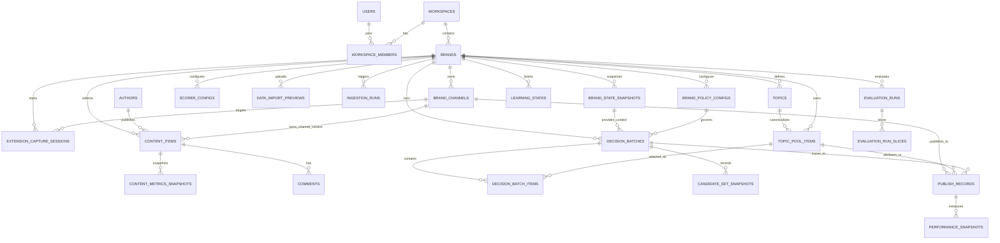
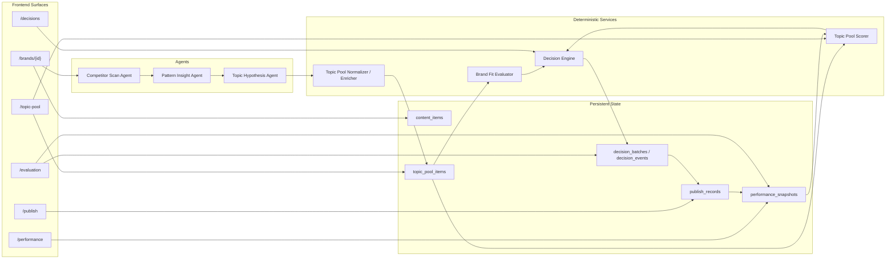
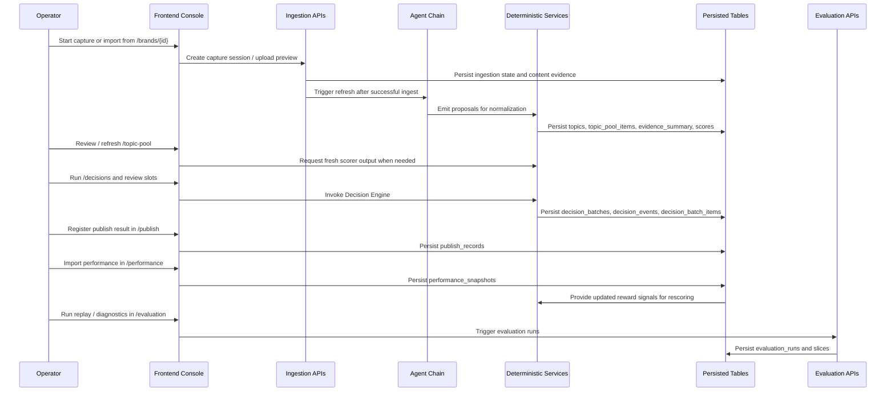

# XHS Growth Agent V2

## 1. Product Definition

### 1.1 Overview

It is a decision loop system for independent brands on Xiaohongshu:

`data ingestion -> structured insight -> topic candidate generation -> decision policy -> publish feedback -> learning -> evaluation`

The system goal is to help a brand build its own content data flywheel rather than optimize a single generation session.

### 1.2 Core Positioning

- A Xiaohongshu growth agent for independent brands
- Converts content data into structured insights
- Generates and ranks topic candidates
- Balances exploration and exploitation with contextual bandit policies
- Learns from real post performance and updates topic scores
- Evaluates policies with offline replay and online experiments


## 2. Architecture

### 2.1 Four-Layer System

1. `Data layer`
Collect notes, authors, topics, comments, publish times, and interaction signals into a brand-scoped knowledge base and topic pool.

2. `Agent layer`
- Run three core agents:
    - `Competitor Scan Agent`
    - `Pattern Insight Agent`
    - `Topic Hypothesis Agent`

- Also run one deterministic service:
    - `Decision Engine`

3. `Learning layer`
Maintain topic scoring and policy learning with:
- baseline ranking
- Thompson Sampling
- LinUCB or other contextual bandit policies

4. `Evaluation layer`
Provide:
- offline replay evaluation
- self-normalized IPS
- online experiments
- reward validity monitoring
- failure case analysis

### 2.2 Deployment Model

The deployment-state ground truth is [Deployment Spec §1 Product & Deployment Definition](../deployment/deployment_spec.md#1-product--deployment-definition). V2 describes the product/runtime shape under that ground truth and keeps future collaboration migration notes explicitly separated from the MVP deployment state.

Deployment alignment notes:

- The active MVP deployment is [Deployment Spec §1.2 Core Positioning](../deployment/deployment_spec.md#12-core-positioning): cloud-hosted UI, browser-side calls to the local Agent Runtime, local SQLite/Chroma/Worker, and cloud LLM inference.
- Any previous wording that implies a required cloud SaaS Agent service, cloud Postgres, Redis, hosted vector database, or cloud worker fleet for MVP is superseded by [Deployment Spec §1.3 Non-Goals](../deployment/deployment_spec.md#13-non-goals).
- Workspace Console pages that depend on local runtime data must use browser-side data fetching, not Vercel Server Components calling `localhost`; see [Deployment Spec §3.1 Cloud Frontend Modules](../deployment/deployment_spec.md#31-cloud-frontend-modules) and [§7.3 Server Components Accessing Local API](../deployment/deployment_spec.md#73-server-components-accessing-local-api).
- Postgres, pgvector, Redis, cloud workers, authentication, and multi-user collaboration are future `Collaborative Cloud Runtime` migration concerns unless a later deployment spec revision promotes them into the active deployment state.

V2 supports two deployment profiles, but only the first profile is the active MVP deployment target:

1. `Local-first MVP`

- Cloud-hosted Next.js frontend
- Browser-side calls to the local Agent Runtime
- Local FastAPI API
- Local SQLite system of record for the MVP runtime
- Local Chroma vector index
- Cloud LLM inference only
- Single-user or personal workspace by default

2. `Collaborative Cloud Runtime`

- Cloud API
- `Postgres` system of record
- Postgres-backed jobs or a dedicated worker queue
- Optional `pgvector` or separate vector store
- Optional Redis only if required by throughput
- Multi-user workspace collaboration and role-based access

The current frontend implementation targets the `Local-first MVP` profile first. In that profile, the V2 console is the operator-facing workbench for local runtime data.

`Postgres` is the system of record only for the future `Collaborative Cloud Runtime` profile. It is not a blocker for the local-first MVP deployment and must not be treated as the default runtime dependency unless [Deployment Spec §10 Project Positioning Statement](../deployment/deployment_spec.md#10-project-positioning-statement) is revised.

### 2.3 Multi-User Model

Single-node deployment does not mean single-user.

The isolation boundary is:

- `workspace_id`
- `brand_id`

All data rows that represent user-owned business state must be scoped by `workspace_id`, and most brand data must also be scoped by `brand_id`.

Interpretation:

- `workspace` is the top-level isolation and collaboration boundary in V2.
- V2 does not define any persisted isolation model beyond `workspace`; all collaboration and data isolation discussions should use `workspace` terminology.
- `users` identifies people, `workspaces` identifies collaboration spaces, and `workspace_members` maps users to workspaces with role-based access.

### 2.4 Frontend Delivery Surface

V2 also requires an operator-facing growth console in addition to the backend API.

The frontend implementation direction is:

- framework: `Next.js 14+` with App Router
- language: `TypeScript` with strict type checking
- styling: `Tailwind CSS`
- state management: `React Context API` initially, with `Zustand` allowed when page and cross-route state become materially complex
- data fetching: `SWR` for polling, cache reuse, and dashboard-friendly refresh behavior

The frontend is the primary human-facing control surface for:

- brand management
- topic pool review
- decision execution and slot review
- publish record management
- performance feedback review
- offline evaluation review

Current frontend alignment:

- V2 maps to the `Workspace Console`: `/brands`, `/brands/{id}`, `/data-sources`, `/data-processing`, `/topic-pool`, `/decisions`, `/publish`, `/performance`, and `/evaluation`.
- V1 maps to the `Creator Workbench` (`/creator`) and is intentionally separate from the V2 console loop.
- In the local-first deployment profile, all runtime API reads and writes must happen from browser-side client code. Vercel Server Components must not fetch `http://localhost:8000` because that address resolves inside the Vercel runtime, not on the user's machine.
- Server-rendered pages may be used only for static or cloud-owned content that does not depend on the local Agent Runtime.

The console routes, route-level workflow, runtime data rules, and operator interaction requirements are defined centrally in `9.7 Frontend Console Direction` and must remain consistent with the backend lifecycle defined in this spec.

## 3. Core Domain Model

Overview relationship map:

The diagram below is intentionally high-level. It shows the primary table relationships and avoids repeating every workspace-scoping edge that already appears in the table definitions.



### 3.1 Workspace and Access Tables

#### `users`

```sql
CREATE TABLE users (
    id UUID PRIMARY KEY,
    email TEXT NOT NULL UNIQUE,
    display_name TEXT NOT NULL,
    status TEXT NOT NULL DEFAULT 'active',
    created_at TIMESTAMPTZ NOT NULL DEFAULT NOW(),
    updated_at TIMESTAMPTZ NOT NULL DEFAULT NOW()
);
```

#### `workspaces`

```sql
CREATE TABLE workspaces (
    id UUID PRIMARY KEY,
    name TEXT NOT NULL,
    slug TEXT NOT NULL UNIQUE,
    timezone TEXT NOT NULL DEFAULT 'Asia/Shanghai',
    status TEXT NOT NULL DEFAULT 'active',
    created_at TIMESTAMPTZ NOT NULL DEFAULT NOW(),
    updated_at TIMESTAMPTZ NOT NULL DEFAULT NOW()
);
```

#### `workspace_members`

```sql
CREATE TABLE workspace_members (
    workspace_id UUID NOT NULL REFERENCES workspaces(id),
    user_id UUID NOT NULL REFERENCES users(id),
    role TEXT NOT NULL,
    created_at TIMESTAMPTZ NOT NULL DEFAULT NOW(),
    PRIMARY KEY (workspace_id, user_id)
);
```

Interpretation:

- `users` and `workspaces` are intentionally separated so one user may belong to multiple workspaces.
- `workspace_members` is the canonical access-control mapping for workspace-scoped business data.
- The system should use `workspace_id` as the canonical isolation key for all user-owned business rows.

### 3.2 Brand and Channel Tables

#### `brands`

```sql
CREATE TABLE brands (
    id UUID PRIMARY KEY,
    workspace_id UUID NOT NULL REFERENCES workspaces(id),
    name TEXT NOT NULL,
    category TEXT,
    stage TEXT NOT NULL,
    target_audience JSONB NOT NULL DEFAULT '{}'::jsonb,
    brand_voice JSONB NOT NULL DEFAULT '{}'::jsonb,
    goals JSONB NOT NULL DEFAULT '{}'::jsonb,
    created_at TIMESTAMPTZ NOT NULL DEFAULT NOW(),
    updated_at TIMESTAMPTZ NOT NULL DEFAULT NOW()
);

CREATE INDEX idx_brands_workspace_id ON brands(workspace_id);
```

`stage` examples:

- `cold_start`
- `validation`
- `growth`
- `scaled`

Rules:

- `target_audience` is sourced from brand-side manual input
- `brand_voice` is a structured style-control contract consumed by content generation and agent prompting
- runtime executable constraints must be defined only in `brand_policy_configs`
- `brand_voice` and `brand_policy_configs` do not auto-sync
- if `brand_voice` and `brand_policy_configs` conflict, the execution layer must follow `brand_policy_configs`
- `goals` is a structured list of growth objectives rather than free-form notes

#### Brand Profile JSON Schemas (v1)

`target_audience`:

```jsonc
{
  "age_ranges": ["18-24", "25-34"],
  // 枚举值：["13-17", "18-24", "25-34", "35-44", "45+"]
  // 必填，至少选一个

  "gender_skew": "female",
  // 枚举值："female" | "male" | "neutral"
  // 必填

  "interests": ["轻量户外", "城市通勤", "可持续生活"],
  // 自由标签数组，品牌手工填写
  // 必填，至少一条，每条不超过 20 字

  "consumption_level": "mid_to_high",
  // 枚举值："budget" | "mid" | "mid_to_high" | "high"
  // 必填

  "geographic_focus": ["华东", "华南"],
  // 枚举值：["华北", "华东", "华南", "华西", "华中", "全国", "海外"]
  // 可选，缺省视为"全国"

  "lifestyle_descriptors": ["喜欢尝试新品", "注重性价比", "内容消费活跃"]
  // 自由文本数组，来自品牌对核心用户的主观描述
  // 可选，用于 Pattern Insight Agent 的 audience signal 对照
  // 每条不超过 30 字，最多 10 条
}
```

Example:

```jsonc
{
  "age_ranges": ["25-34"],
  "gender_skew": "female",
  "interests": ["轻量户外", "城市通勤"],
  "consumption_level": "mid_to_high",
  "geographic_focus": ["华东", "全国"],
  "lifestyle_descriptors": ["愿意尝试新品牌", "偏好实用型内容"]
}
```

`brand_voice`:

```jsonc
{
  "tone": ["authentic", "informative"],
  // 枚举值（多选）：
  //   "authentic"（真实感）| "playful"（轻松活泼）| "inspiring"（激励型）
  //   "informative"（干货向）| "premium"（高端克制）| "community"（社群感）
  // 必填，至少选一个
  // 用于 Topic Hypothesis Agent 生成 title/angle 时的语气约束

  "preferred_formats": ["测评", "场景故事", "攻略"],
  // 枚举值（多选）：
  //   "测评" | "场景故事" | "攻略" | "开箱" | "好物推荐"
  //   "对比" | "避坑" | "教程" | "日常vlog" | "数据向"
  // 必填，至少选一个
  // 影响 topic_pool_items 的 angle 生成方向

  "lexical_preferences": {
    "preferred_terms": ["轻量", "实用", "日常"],
    // 品牌希望内容里多出现的词汇，自由文本数组
    // 可选，每条不超过 10 字，最多 20 条

    "avoided_terms": ["奢华", "极限挑战", "硬核"]
    // 品牌希望内容里避免出现的词汇，自由文本数组
    // 可选，每条不超过 10 字，最多 20 条
  },

  "forbidden_claims": {
    "preset": ["最好用", "全网最低价", "100% 天然"],
    // 预设选项（多选）：
    //   "最好用" | "第一" | "全网最低价" | "100% 天然"
    //   "无副作用" | "医学认证" | "绝对安全"
    // 可选

    "custom": ["超越所有竞品"]
    // 品牌自定义的禁止声明，自由文本数组
    // 可选，每条不超过 50 字，最多 10 条
  },
  // forbidden_claims 仅作为生成提示与人工审核参考
  // 不自动映射到 runtime hard filters

  "compliance_constraints": {
    "preset": ["不得涉及医疗功效", "不得承诺具体收益"],
    // 预设选项（多选）：
    //   "不得涉及医疗功效" | "不得承诺具体收益" | "不得比较竞品价格"
    //   "不得使用极限词" | "不得暗示官方认证"
    // 可选

    "custom": ["所有成分描述须经内部审核"]
    // 自定义合规约束，自由文本数组
    // 可选，每条不超过 100 字，最多 5 条
  }
  // compliance_constraints 仅作为生成提示与人工审核参考
  // runtime 执行层仍只读取 brand_policy_configs
}
```

`goals`:

```jsonc
{
  "goals": [
    {
      "type": "follower_growth",
      // 枚举值：
      //   "follower_growth"（涨粉）| "engagement_rate"（互动率）
      //   "content_volume"（发布频次）| "conversion_proxy"（转化代理）
      //   "brand_awareness"（品牌曝光，方向性）
      // 必填

      "target_value": 5000,
      // 目标数值，数字类型
      // "brand_awareness" 类型时可为 null（方向性目标）

      "unit": "followers",
      // 枚举值："followers" | "%" | "posts_per_month" | "clicks" | null
      // 与 type 对应，"brand_awareness" 时为 null

      "window_days": 90,
      // 目标周期，单位天
      // 必填，建议值：30 | 60 | 90 | 180

      "priority": 1
      // 当存在多个 goals 时的优先级排序，1 = 最高
      // 必填，不允许重复
    }
  ]
  // goals 数组，至少一条，最多 5 条
  // 用于 brand_state_snapshot 的 stage 判断参考
  // 以及 Decision Engine 在 topic_type_targets 权重分配时的方向依据
}
```

#### `brand_channels`

```sql
CREATE TABLE brand_channels (
    id UUID PRIMARY KEY,
    workspace_id UUID NOT NULL REFERENCES workspaces(id),
    brand_id UUID NOT NULL REFERENCES brands(id),
    platform TEXT NOT NULL,
    external_account_id TEXT,
    account_name TEXT,
    profile_url TEXT,
    status TEXT NOT NULL DEFAULT 'active',
    metadata JSONB NOT NULL DEFAULT '{}'::jsonb,
    created_at TIMESTAMPTZ NOT NULL DEFAULT NOW(),
    updated_at TIMESTAMPTZ NOT NULL DEFAULT NOW()
);

CREATE INDEX idx_brand_channels_brand_id ON brand_channels(brand_id);
```

Rules:

- `profile_url` is the canonical operator-facing link for opening the brand's Xiaohongshu homepage
- homepage navigation must come directly from persisted `profile_url`; the product must not synthesize a homepage URL from display-name-like fields at runtime
- `brand_channels` remains the storage layer for channel linkage, but the main brand-detail page should surface only the operator-useful homepage jump action rather than a raw channel table

### 3.3 Brand State and Policy Tables

#### `brand_state_snapshots`

```sql
CREATE TABLE brand_state_snapshots (
    id UUID PRIMARY KEY,
    workspace_id UUID NOT NULL REFERENCES workspaces(id),
    brand_id UUID NOT NULL REFERENCES brands(id),
    state_version TEXT NOT NULL,
    stage TEXT NOT NULL,
    state_features JSONB NOT NULL DEFAULT '{}'::jsonb,
    source_type TEXT NOT NULL DEFAULT 'rule_engine',
    source_version TEXT NOT NULL,
    computed_at TIMESTAMPTZ NOT NULL,
    valid_from TIMESTAMPTZ NOT NULL,
    valid_to TIMESTAMPTZ,
    created_at TIMESTAMPTZ NOT NULL DEFAULT NOW()
);

CREATE INDEX idx_brand_state_snapshots_brand_id ON brand_state_snapshots(brand_id, valid_from DESC);
```

Rules:

- brand state is produced by a deterministic rule engine
- every decision-time `brand_stage` must trace back to one `brand_state_snapshots.id`
- `decision_batches.context_snapshot` and `decision_events.context_features` must be derived from the latest valid snapshot

#### `brand_policy_configs`

```sql
CREATE TABLE brand_policy_configs (
    id UUID PRIMARY KEY,
    workspace_id UUID NOT NULL REFERENCES workspaces(id),
    brand_id UUID NOT NULL REFERENCES brands(id),
    policy_name TEXT NOT NULL,
    policy_version TEXT NOT NULL,
    hard_filter_rules JSONB NOT NULL DEFAULT '{}'::jsonb,
    brand_fit_rules JSONB NOT NULL DEFAULT '{}'::jsonb,
    exploration_preset_override JSONB NOT NULL DEFAULT '{}'::jsonb,
    topic_type_targets JSONB NOT NULL DEFAULT '{}'::jsonb,
    is_active BOOLEAN NOT NULL DEFAULT TRUE,
    created_at TIMESTAMPTZ NOT NULL DEFAULT NOW(),
    updated_at TIMESTAMPTZ NOT NULL DEFAULT NOW()
);

CREATE INDEX idx_brand_policy_configs_brand_id ON brand_policy_configs(brand_id, is_active);
```

Rules:

- hard filters run before stochastic sampling
- filtered-out candidates must not appear in slot-level `candidate_set`
- `brand_fit_violation_rate` must be computed against the active `brand_policy_configs` row used for the decision
- `brand_policy_configs` is the only runtime executable policy source
- `brand_voice` may contain semantically similar guidance, but it must not auto-populate or mutate any policy field
- operators should see `brand_voice` as `品牌表达偏好`
- operators should see `brand_policy_configs` as `执行策略`
- the active `brand_policy_configs` row must come from explicit user-maintained input in the console or an explicit template-init action
- `brand_policy_configs` must not be silently derived from `brand_voice`, `target_audience`, or `goals`

#### Policy JSON Schemas (v1)

`hard_filter_rules`:

```jsonc
{
  "blocked_topic_types": ["competitor"],
  // 枚举值：topics.topic_type 的子集
  //   "core" | "scenario" | "problem" | "audience" | "competitor" | "trend"
  // 匹配的 topic_type 在进入 candidate 前直接过滤
  // 可选，缺省为空（不阻断任何 topic_type）

  "blocked_claims": ["超越所有竞品", "最好用"],
  // runtime blocked claims 列表，由运营或系统管理员直接维护
  // execution layer only evaluates this field itself
  // 可选，缺省为空

  "recency_repetition_guard": {
    "window_days": 30,
    // 近期窗口，检查最近多少天内已发布或已选中的选题
    // 必填（若启用此规则）

    "similarity_threshold": 0.85,
    // 相似度阈值，[0,1]，超过此值判定为重复
    // 相似度计算粒度：同一 topic_type 下的 normalized_name 语义相似度
    // 必填（若启用此规则）

    "scope": "published_and_selected"
    // 枚举值："published_only" | "selected_only" | "published_and_selected"
    // "selected"：已被 Decision Engine 选入 decision_batch 但尚未发布的选题也纳入检查
    // 必填（若启用此规则）
  },
  // recency_repetition_guard 可选，整块缺省时不启用重复检查

  "min_evidence_count": 3,
  // 候选选题的 supporting_evidence_ids 数量下限
  // 低于此值的候选直接过滤，不进入 candidate_set
  // 可选，缺省为 1

  "platform_scope": ["xhs"]
  // 枚举值示例：["xhs"]
  // 未来扩展时添加其他平台，过滤器只对指定平台的内容生效
  // 可选，缺省为 ["xhs"]
}
```

`brand_fit_rules`:

```jsonc
{
  "min_brand_fit_score": 0.6,
  // 候选选题的品牌契合度最低分，[0,1]
  // 低于此值的候选不进入 candidate_set
  // 由 Brand Fit Evaluator 以确定性规则计算
  // 必填

  "compliance_constraints": ["不得涉及医疗功效", "不得使用极限词"],
  // runtime compliance 约束列表，由运营或系统管理员直接维护
  // 候选 hypothesis 或 angle 命中任意一条 → brand_fit_violation 记录
  // 违反计入 brand_fit_violation_rate 在线监控
  // 可选，缺省为空

  "required_voice_alignment": {
    "tone": ["authentic"],
    // 候选内容的推断语气必须与此列表有交集
    // 枚举值同 brands.brand_voice.tone
    // 可选，缺省不强制

    "preferred_formats": ["测评", "场景故事"]
    // 候选内容的推断格式必须与此列表有交集
    // 枚举值同 brands.brand_voice.preferred_formats
    // 可选，缺省不强制
  }
  // required_voice_alignment 可选，整块缺省时不做语气格式约束
}
```

`topic_type_targets`:

```jsonc
{
  "targets": [
    {
      "topic_type": "scenario",
      // 枚举值：topics.topic_type 全集

      "min_ratio": 0.3,
      // 该 topic_type 在每次 decision_batch 中的最低占比
      // [0,1]，所有 topic_type 的 min_ratio 之和不超过 1.0
      // 可选，缺省为 0

      "max_ratio": 0.6,
      // 该 topic_type 在每次 decision_batch 中的最高占比
      // [0,1]，必须 >= min_ratio
      // 可选，缺省为 1.0

      "priority_boost": 0.1
      // 在 baseline_rule_v1 排序时对该 topic_type 候选的额外加分
      // [-0.5, 0.5]，正数提权，负数降权
      // 可选，缺省为 0
    },
    {
      "topic_type": "problem",
      "min_ratio": 0.2,
      "max_ratio": 0.4,
      "priority_boost": 0.0
    }
  ]
  // targets 数组，可选，缺省为空（不强制分配）
  // Decision Engine 在 slot 填充时先满足 min_ratio 约束，
  // 再按 score + priority_boost 排序填充剩余 slot
  // 违反 min_ratio 时触发 topic_type_coverage_under_exploration 告警
}
```

Constraint semantics:

- If a `topic_type` has no `targets` entry, it does not participate in quota constraints and competes only by score.
- If a `topic_type` has a `targets` entry with `min_ratio = 0`, it participates in the quota framework, is still constrained by `max_ratio`, and still receives `priority_boost`, but has no guaranteed minimum allocation.
- Static validation on config write:
  - reject the config when `sum(min_ratio) > 1.0`
  - reject the config when any `max_ratio < min_ratio`
- Slot rounding for a batch with `total_slots = requested_slot_count`:
  - `min_slots[type] = ceil(min_ratio[type] * total_slots)`
  - `max_slots[type] = floor(max_ratio[type] * total_slots)`
  - when `min_ratio[type] > 0`, force `min_slots[type] = max(1, min_slots[type])`
- Runtime infeasibility handling:
  - if `sum(min_slots) > total_slots`, emit `constraint_infeasible`
  - reduce guarantees in this order until feasible:
    1. lower `priority_boost` first
    2. lower `min_ratio` first among equal `priority_boost`
    3. `topic_type` lexical order as deterministic tie-break
  - each reduction step applies `min_slots[type] = max(0, min_slots[type] - 1)`
  - current V2 temporarily uses `priority_boost` as the proxy for constraint-trimming order
  - this does not make `priority_boost` the long-term sole semantic for constraint handling
  - if future policy control needs independent trimming precedence, introduce `constraint_priority`
- Candidate-pool availability correction:
  - `actual_min_slots[type] = min(min_slots[type], available_candidates[type])`
  - release any deficit back to the global remaining pool
  - emit `under_exploration` when `actual_min_slots[type] < min_slots[type]`
- Remaining-slot fill:
  - first fill all guaranteed `actual_min_slots`
  - then fill remaining slots by global rank on `score + priority_boost`
  - never exceed `max_slots[type]`

### 3.4 Data Layer Tables

#### `extension_capture_sessions`

```sql
CREATE TABLE extension_capture_sessions (
    id UUID PRIMARY KEY,
    workspace_id UUID NOT NULL REFERENCES workspaces(id),
    brand_id UUID NOT NULL REFERENCES brands(id),
    channel_id UUID REFERENCES brand_channels(id),
    capture_token TEXT NOT NULL,
    status TEXT NOT NULL,
    preview_payload JSONB NOT NULL DEFAULT '{}'::jsonb,
    ingestion_receipt JSONB,
    error_summary JSONB NOT NULL DEFAULT '{}'::jsonb,
    expires_at TIMESTAMPTZ NOT NULL,
    captured_at TIMESTAMPTZ,
    created_at TIMESTAMPTZ NOT NULL DEFAULT NOW(),
    updated_at TIMESTAMPTZ NOT NULL DEFAULT NOW()
);

CREATE INDEX idx_extension_capture_sessions_brand_id
    ON extension_capture_sessions(brand_id, created_at DESC);
```

Rules:

- this table is the persisted workspace-lane anchor for `浏览器采集`
- page refresh must be able to recover the latest lane state from this table without depending on browser memory
- when a lane fails, `capture_session_id` is the primary operator-visible recovery anchor

#### `data_import_previews`

```sql
CREATE TABLE data_import_previews (
    id UUID PRIMARY KEY,
    workspace_id UUID NOT NULL REFERENCES workspaces(id),
    brand_id UUID NOT NULL REFERENCES brands(id),
    file_name TEXT NOT NULL,
    status TEXT NOT NULL,
    parsed_row_count INTEGER NOT NULL DEFAULT 0,
    preview_payload JSONB NOT NULL DEFAULT '{}'::jsonb,
    ingestion_receipt JSONB,
    field_errors JSONB NOT NULL DEFAULT '[]'::jsonb,
    error_summary JSONB NOT NULL DEFAULT '{}'::jsonb,
    uploaded_at TIMESTAMPTZ NOT NULL,
    created_at TIMESTAMPTZ NOT NULL DEFAULT NOW(),
    updated_at TIMESTAMPTZ NOT NULL DEFAULT NOW()
);

CREATE INDEX idx_data_import_previews_brand_id
    ON data_import_previews(brand_id, created_at DESC);
```

Rules:

- this table is the persisted workspace-lane anchor for `历史数据上传`
- page refresh must be able to recover the latest lane state from this table without depending on browser memory
- when a lane fails, `preview_id` is the primary operator-visible recovery anchor

#### `ingestion_runs`

```sql
CREATE TABLE ingestion_runs (
    id UUID PRIMARY KEY,
    workspace_id UUID NOT NULL REFERENCES workspaces(id),
    brand_id UUID NOT NULL REFERENCES brands(id),
    entry_type TEXT NOT NULL,
    source_type TEXT NOT NULL,
    source_adapter TEXT,
    dedupe_key TEXT,
    source_config JSONB NOT NULL DEFAULT '{}'::jsonb,
    stats JSONB NOT NULL DEFAULT '{}'::jsonb,
    error_summary JSONB NOT NULL DEFAULT '{}'::jsonb,
    status TEXT NOT NULL,
    started_at TIMESTAMPTZ,
    finished_at TIMESTAMPTZ,
    created_at TIMESTAMPTZ NOT NULL DEFAULT NOW()
);

CREATE INDEX idx_ingestion_runs_brand_id ON ingestion_runs(brand_id, created_at DESC);
```

Rules:

- `entry_type` values are `source_sync` or `data_import`
- `source_sync` is used for data capture or crawl-style acquisition
- `data_import` is used for manually prepared historical records
- all captured or imported records must be normalized through the same ingestion contract before landing in `content_items`
- browser-extension capture may be implemented as one formal `source_sync` adapter, but the storage contract remains adapter-agnostic

#### `authors`

```sql
CREATE TABLE authors (
    id UUID PRIMARY KEY,
    workspace_id UUID NOT NULL REFERENCES workspaces(id),
    platform TEXT NOT NULL,
    platform_author_id TEXT NOT NULL,
    display_name TEXT,
    profile_url TEXT,
    follower_count BIGINT,
    metadata JSONB NOT NULL DEFAULT '{}'::jsonb,
    first_seen_at TIMESTAMPTZ NOT NULL DEFAULT NOW(),
    last_seen_at TIMESTAMPTZ NOT NULL DEFAULT NOW(),
    UNIQUE (workspace_id, platform, platform_author_id)
);
```

Interpretation:

- `authors` stores the normalized publisher identity for collected content.
- It supports deduplication across repeated ingestion runs and provides a stable join key for competitor, market, and owned-account analysis.
- `authors` is primarily an analysis entity rather than an access-control entity.

#### `topics`

```sql
CREATE TABLE topics (
    id UUID PRIMARY KEY,
    workspace_id UUID NOT NULL REFERENCES workspaces(id),
    brand_id UUID NOT NULL REFERENCES brands(id),
    normalized_name TEXT NOT NULL,
    display_name TEXT NOT NULL,
    topic_type TEXT NOT NULL,
    metadata JSONB NOT NULL DEFAULT '{}'::jsonb,
    created_at TIMESTAMPTZ NOT NULL DEFAULT NOW(),
    updated_at TIMESTAMPTZ NOT NULL DEFAULT NOW()
);

CREATE INDEX idx_topics_brand_id ON topics(brand_id);
CREATE UNIQUE INDEX uq_topics_brand_name ON topics(brand_id, normalized_name);
```

`topic_type` examples:

- `core`
- `scenario`
- `problem`
- `audience`
- `competitor`
- `trend`

Interpretation:

- `topics` stores the normalized topic vocabulary for one brand workspace.
- It is the canonical semantic layer for grouping related content ideas, avoiding duplicate topic names, and computing topic-type level metrics.
- `topic_type` is used by candidate diversity, topic-type coverage, repetition controls, and downstream evaluation slices.
- topic-pool presentation must allow operators to inspect the source lineage behind each candidate rather than treating topics as opaque model output.

#### `content_items`

```sql
CREATE TABLE content_items (
    id UUID PRIMARY KEY,
    workspace_id UUID NOT NULL REFERENCES workspaces(id),
    brand_id UUID REFERENCES brands(id),
    channel_id UUID REFERENCES brand_channels(id),
    author_id UUID REFERENCES authors(id),
    platform TEXT NOT NULL,
    platform_content_id TEXT NOT NULL,
    source_type TEXT NOT NULL,
    source_url TEXT,
    title TEXT,
    body_text TEXT,
    published_at TIMESTAMPTZ,
    collected_at TIMESTAMPTZ NOT NULL DEFAULT NOW(),
    content_hash TEXT,
    tags JSONB NOT NULL DEFAULT '[]'::jsonb,
    topic_ids JSONB NOT NULL DEFAULT '[]'::jsonb,
    raw_payload JSONB NOT NULL DEFAULT '{}'::jsonb,
    metadata JSONB NOT NULL DEFAULT '{}'::jsonb,
    UNIQUE (workspace_id, platform, platform_content_id)
);

CREATE INDEX idx_content_items_brand_id ON content_items(brand_id);
CREATE INDEX idx_content_items_author_id ON content_items(author_id);
CREATE INDEX idx_content_items_published_at ON content_items(published_at);
```

`source_type` examples:

- `owned_post`
- `competitor_post`
- `market_post`
- `manual_import`

Source provenance rules:

- every `content_item` must preserve enough source metadata to let operators distinguish platform-captured evidence from manually imported historical evidence
- `content_items.source_type` identifies the business origin category of the record
- `content_items.metadata` must preserve ingestion provenance fields needed by operator-facing evidence views, including when available:
  - `source_adapter`
  - `evidence_origin`
  - `query_text`
  - `page_type`
  - `captured_at` or `imported_at`
  - `normalized_source_url`
- the operator-facing product must be able to render one explicit source badge per evidence row, such as platform-captured, owned historical content, or manual import
- source provenance must survive normalization and deduplication; once a `content_item` is used as supporting evidence for topic-pool output, the corresponding provenance fields must remain queryable

#### `content_metrics_snapshots`

```sql
CREATE TABLE content_metrics_snapshots (
    id UUID PRIMARY KEY,
    workspace_id UUID NOT NULL REFERENCES workspaces(id),
    content_item_id UUID NOT NULL REFERENCES content_items(id),
    snapshot_at TIMESTAMPTZ NOT NULL,
    likes BIGINT NOT NULL DEFAULT 0,
    comments BIGINT NOT NULL DEFAULT 0,
    collects BIGINT NOT NULL DEFAULT 0,
    shares BIGINT NOT NULL DEFAULT 0,
    views BIGINT,
    follows_gained BIGINT,
    reward_components JSONB NOT NULL DEFAULT '{}'::jsonb,
    created_at TIMESTAMPTZ NOT NULL DEFAULT NOW()
);

CREATE INDEX idx_content_metrics_content_item_id ON content_metrics_snapshots(content_item_id);
CREATE INDEX idx_content_metrics_snapshot_at ON content_metrics_snapshots(snapshot_at);
```

#### `comments`

```sql
CREATE TABLE comments (
    id UUID PRIMARY KEY,
    workspace_id UUID NOT NULL REFERENCES workspaces(id),
    content_item_id UUID NOT NULL REFERENCES content_items(id),
    platform_comment_id TEXT NOT NULL,
    author_name TEXT,
    body_text TEXT NOT NULL,
    commented_at TIMESTAMPTZ,
    sentiment_label TEXT,
    metadata JSONB NOT NULL DEFAULT '{}'::jsonb,
    UNIQUE (workspace_id, content_item_id, platform_comment_id)
);
```

### 3.5 Topic Pool and Decision Tables

#### `topic_pool_items`

```sql
CREATE TABLE topic_pool_items (
    id UUID PRIMARY KEY,
    workspace_id UUID NOT NULL REFERENCES workspaces(id),
    brand_id UUID NOT NULL REFERENCES brands(id),
    topic_id UUID REFERENCES topics(id),
    title TEXT NOT NULL,
    angle TEXT NOT NULL,
    hypothesis TEXT NOT NULL,
    evidence_summary JSONB NOT NULL DEFAULT '{}'::jsonb,
    source_agent TEXT NOT NULL,
    source_run_id UUID,
    status TEXT NOT NULL DEFAULT 'candidate',
    novelty_score DOUBLE PRECISION NOT NULL DEFAULT 0,
    fit_score DOUBLE PRECISION NOT NULL DEFAULT 0,
    trend_score DOUBLE PRECISION NOT NULL DEFAULT 0,
    historical_reward_score DOUBLE PRECISION NOT NULL DEFAULT 0,
    policy_score DOUBLE PRECISION NOT NULL DEFAULT 0,
    final_score DOUBLE PRECISION NOT NULL DEFAULT 0,
    last_scored_at TIMESTAMPTZ,
    created_at TIMESTAMPTZ NOT NULL DEFAULT NOW(),
    updated_at TIMESTAMPTZ NOT NULL DEFAULT NOW()
);

CREATE INDEX idx_topic_pool_items_brand_id ON topic_pool_items(brand_id);
CREATE INDEX idx_topic_pool_items_status ON topic_pool_items(status);
CREATE INDEX idx_topic_pool_items_final_score ON topic_pool_items(final_score DESC);
```

`status` examples:

- `candidate`
- `approved`
- `scheduled`
- `published`
- `archived`

#### `scorer_configs`

```sql
CREATE TABLE scorer_configs (
    id UUID PRIMARY KEY,
    workspace_id UUID NOT NULL REFERENCES workspaces(id),
    brand_id UUID NOT NULL REFERENCES brands(id),
    scorer_name TEXT NOT NULL,
    scorer_version TEXT NOT NULL,
    topic_type TEXT,
    confidence_threshold INTEGER NOT NULL,
    max_age_seconds INTEGER NOT NULL,
    is_active BOOLEAN NOT NULL DEFAULT TRUE,
    metadata JSONB NOT NULL DEFAULT '{}'::jsonb,
    created_at TIMESTAMPTZ NOT NULL DEFAULT NOW(),
    updated_at TIMESTAMPTZ NOT NULL DEFAULT NOW()
);

CREATE INDEX idx_scorer_configs_brand_id ON scorer_configs(brand_id, is_active);
CREATE INDEX idx_scorer_configs_topic_type ON scorer_configs(brand_id, topic_type, is_active);
```

Rules:

- `scorer_configs` is the source of truth for deterministic scorer runtime configuration
- `confidence_threshold` controls the shrinkage strength used by `historical_reward_score`
- `max_age_seconds` controls freshness checks for on-demand scorer refresh
- `topic_type IS NULL` represents the brand-level default config
- a row with a concrete `topic_type` overrides the default for that topic type
- each brand needs at least one active config, either default-only or default plus topic-type overrides

#### `decision_batches`

```sql
CREATE TABLE decision_batches (
    id UUID PRIMARY KEY,
    workspace_id UUID NOT NULL REFERENCES workspaces(id),
    brand_id UUID NOT NULL REFERENCES brands(id),
    brand_state_snapshot_id UUID NOT NULL REFERENCES brand_state_snapshots(id),
    brand_policy_config_id UUID NOT NULL REFERENCES brand_policy_configs(id),
    objective TEXT NOT NULL,
    exploration_mode TEXT NOT NULL,
    context_snapshot JSONB NOT NULL DEFAULT '{}'::jsonb,
    policy_name TEXT NOT NULL,
    policy_version TEXT NOT NULL,
    candidate_count INTEGER NOT NULL,
    chosen_count INTEGER NOT NULL,
    requested_slot_count INTEGER NOT NULL,
    batch_status TEXT NOT NULL DEFAULT 'completed',
    created_by_type TEXT NOT NULL,
    created_by_id UUID,
    created_at TIMESTAMPTZ NOT NULL DEFAULT NOW()
);

CREATE INDEX idx_decision_batches_brand_id ON decision_batches(brand_id);
```

#### `decision_batch_items`

```sql
CREATE TABLE decision_batch_items (
    batch_id UUID NOT NULL REFERENCES decision_batches(id),
    topic_pool_item_id UUID NOT NULL REFERENCES topic_pool_items(id),
    selected_slot_index INTEGER NOT NULL,
    final_rank_position INTEGER NOT NULL,
    source_decision_event_id UUID,
    review_status TEXT NOT NULL DEFAULT 'pending',
    reviewed_at TIMESTAMPTZ,
    reviewed_by_type TEXT,
    reviewed_by_id UUID,
    edited_title TEXT,
    edited_angle TEXT,
    edited_hypothesis TEXT,
    review_notes TEXT,
    score DOUBLE PRECISION NOT NULL,
    reason_codes JSONB NOT NULL DEFAULT '[]'::jsonb,
    metadata JSONB NOT NULL DEFAULT '{}'::jsonb,
    PRIMARY KEY (batch_id, topic_pool_item_id)
);

CREATE INDEX idx_decision_batch_items_slot ON decision_batch_items(batch_id, selected_slot_index);
```

`decision_batch_items` stores the final chosen topics returned to the user.

All slot-level sampling probabilities, candidate pools, and replay-critical fields live in `decision_events`, not in `decision_batch_items`.

#### `candidate_set_snapshots`

```sql
CREATE TABLE candidate_set_snapshots (
    id UUID PRIMARY KEY,
    workspace_id UUID NOT NULL REFERENCES workspaces(id),
    brand_id UUID NOT NULL REFERENCES brands(id),
    decision_batch_id UUID NOT NULL REFERENCES decision_batches(id),
    decision_event_id UUID,
    snapshot_scope TEXT NOT NULL,
    slot_index INTEGER,
    candidate_count INTEGER NOT NULL,
    candidate_set JSONB NOT NULL,
    metrics JSONB NOT NULL DEFAULT '{}'::jsonb,
    created_at TIMESTAMPTZ NOT NULL DEFAULT NOW()
);

CREATE INDEX idx_candidate_set_snapshots_batch_id ON candidate_set_snapshots(decision_batch_id);
CREATE INDEX idx_candidate_set_snapshots_scope ON candidate_set_snapshots(snapshot_scope, slot_index);
```

`snapshot_scope` values:

- `session`
- `slot`

### 3.6 Publish and Feedback Tables

#### `publish_records`

```sql
CREATE TABLE publish_records (
    id UUID PRIMARY KEY,
    workspace_id UUID NOT NULL REFERENCES workspaces(id),
    brand_id UUID NOT NULL REFERENCES brands(id),
    channel_id UUID NOT NULL REFERENCES brand_channels(id),
    topic_pool_item_id UUID REFERENCES topic_pool_items(id),
    decision_event_id UUID REFERENCES decision_events(id),
    decision_batch_id UUID REFERENCES decision_batches(id),
    content_item_id UUID REFERENCES content_items(id),
    publish_status TEXT NOT NULL,
    published_at TIMESTAMPTZ,
    creative_variant TEXT,
    metadata JSONB NOT NULL DEFAULT '{}'::jsonb,
    created_at TIMESTAMPTZ NOT NULL DEFAULT NOW(),
    updated_at TIMESTAMPTZ NOT NULL DEFAULT NOW()
);

CREATE INDEX idx_publish_records_brand_id ON publish_records(brand_id);
CREATE INDEX idx_publish_records_decision_batch_id ON publish_records(decision_batch_id);
```

Rules:

- system-selected posts should persist both `decision_batch_id` and `decision_event_id`
- manual or organic posts may keep `decision_event_id = null`
- `decision_event_id` is the canonical slot-level attribution key for learning and evaluation

#### `performance_snapshots`

```sql
CREATE TABLE performance_snapshots (
    id UUID PRIMARY KEY,
    workspace_id UUID NOT NULL REFERENCES workspaces(id),
    brand_id UUID NOT NULL REFERENCES brands(id),
    publish_record_id UUID NOT NULL REFERENCES publish_records(id),
    observation_window_hours INTEGER NOT NULL,
    snapshot_at TIMESTAMPTZ NOT NULL,
    impressions BIGINT,
    clicks BIGINT,
    likes BIGINT NOT NULL DEFAULT 0,
    comments BIGINT NOT NULL DEFAULT 0,
    collects BIGINT NOT NULL DEFAULT 0,
    shares BIGINT NOT NULL DEFAULT 0,
    follows_gained BIGINT,
    conversion_proxy DOUBLE PRECISION,
    conversion_proxy_type TEXT,
    conversion_proxy_source TEXT,
    short_term_reward DOUBLE PRECISION,
    long_term_reward DOUBLE PRECISION,
    composite_reward DOUBLE PRECISION,
    created_at TIMESTAMPTZ NOT NULL DEFAULT NOW()
);

CREATE INDEX idx_performance_snapshots_publish_record_id ON performance_snapshots(publish_record_id);
CREATE INDEX idx_performance_snapshots_brand_id ON performance_snapshots(brand_id);
```

`conversion_proxy` rules:

- `conversion_proxy` is a brand-configured downstream business proxy metric, not an ad hoc caller-defined number
- supported values are rate-like proxies in `[0, 1]`
- supported examples:
  - `profile_click_rate`
  - `store_click_rate`
  - `lead_submit_rate`
  - `add_to_cart_rate`
  - `purchase_rate`
  - `custom_rate`
- `conversion_proxy_type` identifies which proxy definition the brand is using
- `conversion_proxy_source` identifies where the imported value came from, such as `manual_import`, `analytics_export`, or `crm_sync`
- the raw imported `conversion_proxy` value must still be normalized by the reward pipeline before it is used as `normalized_conversion_proxy`
- the same `reward_version` must not mix incompatible proxy definitions for the same brand and channel without an explicit version change

Interpretation:

- `conversion_proxy` represents a downstream business-action proxy that is closer to commercial value than engagement-only metrics.
- It does not proxy generic engagement. It proxies a stable business outcome definition such as profile click, store click, lead submit, add to cart, or purchase rate.
- Its purpose is to let learning optimize toward business value when direct revenue outcomes are unavailable or intentionally deferred.

### 3.7 Learning and Evaluation Tables

#### `learning_states`

```sql
CREATE TABLE learning_states (
    id UUID PRIMARY KEY,
    workspace_id UUID NOT NULL REFERENCES workspaces(id),
    brand_id UUID NOT NULL REFERENCES brands(id),
    policy_name TEXT NOT NULL,
    policy_version TEXT NOT NULL,
    state_blob JSONB NOT NULL,
    trained_until TIMESTAMPTZ,
    created_at TIMESTAMPTZ NOT NULL DEFAULT NOW(),
    updated_at TIMESTAMPTZ NOT NULL DEFAULT NOW(),
    UNIQUE (brand_id, policy_name, policy_version)
);
```

#### `evaluation_runs`

```sql
CREATE TABLE evaluation_runs (
    id UUID PRIMARY KEY,
    workspace_id UUID NOT NULL REFERENCES workspaces(id),
    brand_id UUID REFERENCES brands(id),
    evaluation_type TEXT NOT NULL,
    policy_name TEXT NOT NULL,
    policy_version TEXT NOT NULL,
    baseline_policy_name TEXT,
    baseline_policy_version TEXT,
    dataset_start_at TIMESTAMPTZ,
    dataset_end_at TIMESTAMPTZ,
    sample_count INTEGER NOT NULL DEFAULT 0,
    status TEXT NOT NULL,
    summary JSONB NOT NULL DEFAULT '{}'::jsonb,
    created_by_type TEXT NOT NULL,
    created_by_id UUID,
    created_at TIMESTAMPTZ NOT NULL DEFAULT NOW(),
    finished_at TIMESTAMPTZ
);
```

#### `evaluation_run_slices`

```sql
CREATE TABLE evaluation_run_slices (
    id UUID PRIMARY KEY,
    evaluation_run_id UUID NOT NULL REFERENCES evaluation_runs(id),
    slice_key TEXT NOT NULL,
    slice_value TEXT NOT NULL,
    sample_count INTEGER NOT NULL,
    metrics JSONB NOT NULL DEFAULT '{}'::jsonb,
    created_at TIMESTAMPTZ NOT NULL DEFAULT NOW()
);
```

## 4. Event Logging Specification

### 4.1 Principles

Evaluation quality depends on logging quality. The system must be able to replay decisions, estimate off-policy outcomes, and inspect failures.

Therefore V2 must log:

- the decision context
- the full candidate set
- the selected action
- the action probability or propensity
- the observed reward
- the policy version

### 4.2 Event Tables

#### `agent_runs`

```sql
CREATE TABLE agent_runs (
    id UUID PRIMARY KEY,
    workspace_id UUID NOT NULL REFERENCES workspaces(id),
    brand_id UUID REFERENCES brands(id),
    agent_name TEXT NOT NULL,
    agent_version TEXT NOT NULL,
    run_type TEXT NOT NULL,
    input_payload JSONB NOT NULL DEFAULT '{}'::jsonb,
    output_payload JSONB NOT NULL DEFAULT '{}'::jsonb,
    status TEXT NOT NULL,
    started_at TIMESTAMPTZ NOT NULL,
    finished_at TIMESTAMPTZ,
    error_code TEXT,
    error_message TEXT
);
```

#### `decision_events`

```sql
CREATE TABLE decision_events (
    id UUID PRIMARY KEY,
    workspace_id UUID NOT NULL REFERENCES workspaces(id),
    brand_id UUID NOT NULL REFERENCES brands(id),
    decision_batch_id UUID NOT NULL REFERENCES decision_batches(id),
    brand_state_snapshot_id UUID NOT NULL REFERENCES brand_state_snapshots(id),
    brand_policy_config_id UUID NOT NULL REFERENCES brand_policy_configs(id),
    slot_index INTEGER NOT NULL,
    serving_policy_name TEXT NOT NULL,
    serving_policy_version TEXT NOT NULL,
    logging_policy_name TEXT NOT NULL,
    logging_policy_version TEXT NOT NULL,
    shadow_policy_name TEXT,
    shadow_policy_version TEXT,
    decision_mode TEXT NOT NULL,
    exploration_mode TEXT NOT NULL,
    objective TEXT NOT NULL,
    context_features JSONB NOT NULL,
    candidate_set JSONB NOT NULL,
    ranked_list JSONB NOT NULL,
    chosen_action_id UUID NOT NULL,
    exploration_flags JSONB NOT NULL DEFAULT '[]'::jsonb,
    propensities JSONB NOT NULL,
    expected_rewards JSONB NOT NULL DEFAULT '{}'::jsonb,
    reward_version TEXT NOT NULL,
    normalization_window_spec JSONB NOT NULL DEFAULT '{}'::jsonb,
    sampling_metadata JSONB NOT NULL DEFAULT '{}'::jsonb,
    created_at TIMESTAMPTZ NOT NULL DEFAULT NOW()
);

CREATE INDEX idx_decision_events_brand_id ON decision_events(brand_id);
CREATE INDEX idx_decision_events_policy ON decision_events(serving_policy_name, serving_policy_version);
```

#### `feedback_events`

```sql
CREATE TABLE feedback_events (
    id UUID PRIMARY KEY,
    workspace_id UUID NOT NULL REFERENCES workspaces(id),
    brand_id UUID NOT NULL REFERENCES brands(id),
    publish_record_id UUID NOT NULL REFERENCES publish_records(id),
    decision_event_id UUID REFERENCES decision_events(id),
    event_type TEXT NOT NULL,
    observation_window_hours INTEGER,
    reward_version TEXT NOT NULL,
    reward_window_start_at TIMESTAMPTZ,
    reward_window_end_at TIMESTAMPTZ,
    reward_payload JSONB NOT NULL,
    created_at TIMESTAMPTZ NOT NULL DEFAULT NOW()
);

CREATE INDEX idx_feedback_events_publish_record_id ON feedback_events(publish_record_id);
```

Interpretation:

- `serving_policy_*` identifies the policy version that actually controlled online action selection.
- `logging_policy_*` identifies the probability distribution recorded for replay and off-policy evaluation.
- In `baseline_rule_v1`, serving and logging distributions are identical by design, but the fields remain separate so future shadowing, intervention, or alternative logging strategies remain representable.

### 4.3 Required `decision_events` Fields

Each decision event must include at least:

- `workspace_id`
- `brand_id`
- `decision_batch_id`
- `brand_state_snapshot_id`
- `brand_policy_config_id`
- `slot_index`
- `serving_policy_name`
- `serving_policy_version`
- `logging_policy_name`
- `logging_policy_version`
- `exploration_mode`
- `objective`
- `context_features`
- `candidate_set`
- `ranked_list`
- `chosen_action_id`
- `propensities`
- `reward_version`
- `normalization_window_spec`
- `sampling_metadata`
- `created_at`

### 4.4 Example `context_features`

```json
{
  "brand_stage": "growth",
  "recent_post_count_14d": 8,
  "recent_avg_reward_14d": 0.41,
  "recent_topic_entropy_14d": 0.63,
  "dominant_formats": ["图文"],
  "audience_segments": ["成分党", "敏感肌"],
  "seasonality": "618_preheat",
  "competitor_intensity_score": 0.72
}
```

### 4.5 Example `candidate_set`

```json
[
  {
    "topic_pool_item_id": "uuid-1",
    "features": {
      "novelty_score": 0.81,
      "fit_score": 0.74,
      "trend_score": 0.62,
      "historical_reward_score": 0.33
    }
  },
  {
    "topic_pool_item_id": "uuid-2",
    "features": {
      "novelty_score": 0.29,
      "fit_score": 0.88,
      "trend_score": 0.51,
      "historical_reward_score": 0.71
    }
  }
]
```

### 4.6 Reward Design

V2 tracks three levels of reward:

- `short_term_reward`
- `long_term_reward`
- `composite_reward`

Default `reward_v1` formula:

```text
short_term_reward =
  1.0 * normalized_likes +
  2.0 * normalized_collects +
  2.0 * normalized_shares +
  1.5 * normalized_comments

long_term_reward =
  2.0 * normalized_follows_gained +
  3.0 * normalized_conversion_proxy

composite_reward =
  0.7 * short_term_reward + 0.3 * long_term_reward
```

Reward versions must be explicit and reproducible.

Default reward configuration:

- canonical reward version: `reward_v1`
- canonical evaluation window: `168h composite_reward`
- auxiliary diagnostic windows: `24h early_indicator`, `72h early_indicator`

Normalization must be computed within clearly versioned windows, such as:

- same brand
- same 30-day period
- same platform

The normalization method must be saved in metadata so evaluation remains reproducible.

#### `reward_v1` Normalization Semantics

In `reward_v1`, every `normalized_*` metric is a cohort-relative score in `[0, 1]`.

Covered fields:

- `normalized_likes`
- `normalized_comments`
- `normalized_collects`
- `normalized_shares`
- `normalized_follows_gained`
- `normalized_conversion_proxy`

Effective-post definition:

- a reference post must be an owned published post
- it must belong to the same brand workspace
- it must have a valid `reward_v1` performance snapshot for the canonical `168h` window
- it must fall within the trailing `90 days`

`effective_post_count_90d` is the count of reference posts that satisfy the rules above.

For each raw metric `x`, the system computes:

- `brand_norm_x`
- `market_norm_x`

Default `reward_v1` normalization method:

- `brand_norm_x` = percentile rank of raw metric `x` within the brand-level reference cohort
- `market_norm_x` = percentile rank of raw metric `x` within the market-level reference cohort

Default cohort definitions:

- brand-level cohort: owned posts from the same `brand_id`, same platform, trailing `90 days`
- market-level cohort: market posts from the same platform, same brand `category`, trailing `90 days`

If the market-level cohort is additionally segmented by format or subcategory in implementation, that narrower definition must be versioned and recorded in normalization metadata.

Brand-level normalization should only be used when the relevant metric has enough rate-compatible evidence in the brand-level cohort.

If a metric lacks the denominator or auxiliary evidence required for a meaningful brand-level comparison, the delivery plan may constrain serving to market-level only until that evidence is available.

Final normalized metric:

```text
normalized_x =
  w_brand * brand_norm_x +
  w_market * market_norm_x
```

where:

```text
w_market = 1 - w_brand
```

Traffic-stage rules for `w_brand`:

1. Cold start

Condition:

- `effective_post_count_90d < 20`

Rule:

```text
w_brand = 0.0
w_market = 1.0
```

2. Transition

Condition:

- `20 <= effective_post_count_90d <= 49`

Rule:

```text
alpha = (effective_post_count_90d - 20) / 30
w_brand = alpha
w_market = 1 - alpha
```

3. Stable

Condition:

- `effective_post_count_90d >= 50`

Rule:

```text
w_brand = 0.8
w_market = 0.2
```

This weighting rule applies uniformly to every normalized reward component in `reward_v1`.

`normalized_conversion_proxy` follows the same normalization path as other `normalized_*` fields:

- compute `brand_norm_conversion_proxy` within the brand-level proxy cohort
- compute `market_norm_conversion_proxy` within the market-level proxy cohort
- mix them using the same `w_brand / w_market` weighting rule
- never use the raw proxy value directly in `long_term_reward`

Required normalization metadata:

- `reward_version`
- `observation_window_hours`
- `effective_post_count_90d`
- `normalization_stage`
- `w_brand`
- `w_market`
- brand-level cohort definition
- market-level cohort definition

#### `conversion_proxy` Definition

`conversion_proxy` represents a downstream business-action proxy that is closer to commercial value than on-platform engagement metrics.

It is not intended to be a free-form metric chosen independently on each API call.

Instead, each brand should use one stable proxy definition per active reward configuration, such as:

- `profile_click_rate`
- `store_click_rate`
- `lead_submit_rate`
- `add_to_cart_rate`
- `purchase_rate`

Current contract constraint:

- only rate-like proxy values in `[0, 1]` are supported
- count-based or currency-based proxy values are out of scope until a later reward version

Source of truth:

- the caller imports the observed raw proxy value
- the backend validates the value against the brand's configured proxy type
- the reward pipeline normalizes it within the same brand, platform, and versioned comparison window
- `long_term_reward` uses `normalized_conversion_proxy`, not the raw imported value

If a brand changes from one proxy definition to another, that change must trigger a new reward or policy version so offline evaluation does not mix incompatible semantics.

#### `historical_note_import_v1`

This is the canonical platform-neutral import contract for manually prepared historical note data.

Required fields:

- `published_at`
- `title`
- `body_text`
- `likes`
- `collects`
- `comments`

Optional fields:

- `platform_content_id`
- `source_url`
- `author_handle`
- `author_name`
- `shares`
- `tags`

Import semantics:

- missing `impressions`, `clicks`, or `conversion_proxy` must not block import
- imported rows must create or update normalized `content_items`
- imported engagement fields must create or update `content_metrics_snapshots`
- optional comments may be imported later through a separate enrichment flow

Deduplication priority:

1. `platform + platform_content_id`
2. `platform + normalized source_url`
3. `content_hash(title + body_text + published_at + author_handle)`

### 4.7 Metric Definitions

The following metrics are normative and must use the definitions below.

#### `unsupported_rate`

Fraction of evaluation samples where the target policy's chosen action has zero support under the logged propensity distribution.

```text
unsupported_rate =
  unsupported_sample_count / total_sample_count
```

#### `exploration_entropy`

Average Shannon entropy of slot-level propensity distributions.

```text
exploration_entropy =
  mean(-sum(p_i * log(p_i)))
```

where `p_i` is each action probability in `decision_events.propensities`.

#### `brand_fit_violation_rate`

Fraction of chosen actions that violate the active `brand_policy_configs.hard_filter_rules` or minimum brand-fit thresholds.

```text
brand_fit_violation_rate =
  violating_chosen_action_count / total_chosen_action_count
```

#### `topic_repetition_rate`

Fraction of selected topics whose normalized topic key appeared in the same brand's published topics in the trailing 30 days.

```text
topic_repetition_rate =
  repeated_selected_topic_count / total_selected_topic_count
```

Default lookback window: `30 days`.

#### `candidate_pool_size`

Count of unique candidates in a session-level candidate snapshot.

```text
candidate_pool_size =
  count(distinct topic_pool_item_id)
```

#### `duplicate_topic_rate`

Duplicate rate within the session-level candidate snapshot after normalizing topic keys.

```text
duplicate_topic_rate =
  1 - (unique_normalized_topic_keys / candidate_pool_size)
```

#### `candidate_novelty_score`

Mean `novelty_score` over all candidates in the session-level candidate snapshot.

```text
candidate_novelty_score =
  mean(candidate.novelty_score)
```

#### `candidate_diversity_score`

Normalized Shannon entropy over `topic_type` distribution in the session-level candidate snapshot.

```text
candidate_diversity_score =
  H(topic_type_distribution) / log(number_of_observed_topic_types)
```

If fewer than two topic types are observed, diversity is `0`.

#### Storage Rules

- candidate-set metrics must be persisted in `candidate_set_snapshots.metrics`
- evaluation aggregates must be persisted in `evaluation_runs.summary`
- slice-level evaluation aggregates must be persisted in `evaluation_run_slices.metrics`

## 5. Agent and Decision Responsibilities

The schemas in this section are normative and are required before implementation work begins.

System interaction map:



End-to-end operator sequence:



### 5.1 Competitor Scan Agent

Role:

- extract reusable external evidence from competitor and market content
- provide high-signal examples and lightweight benchmarks for downstream insight generation
- do not directly score candidates for the `Decision Engine`

Triggering:

- automatic after a successful `source_sync` or `data_import` that materially changes competitor or market evidence
- manual via `POST /brands/{id}/topic-pool/refresh`

Input schema:

```jsonc
{
  "brand_id": "uuid",                          // 品牌唯一标识，所有数据查询和写入都以此为 scope
  "channel_id": "uuid",                        // 当前操作的品牌渠道，决定平台上下文
  "brand_state_snapshot_id": "uuid",           // 本次 agent run 绑定的品牌状态快照，确保决策可溯源
  "competitor_sources": [
    {
      "source_type": "registered_competitor",  // 品牌在系统里预先维护的竞品账号，来自 brand 配置
      "author_id": "uuid"                      // 对应 authors 表的 id
    },
    {
      "source_type": "ad_hoc",                 // 用户本次临时指定的对标账号，不写入持久竞品列表
      "platform": "xhs",
      "account_name": "string",
      "profile_url": "https://www.xiaohongshu.com/user/profile/..."
    }
  ],
  // 两种 source_type 可同时存在；registered_competitor 优先，ad_hoc 作为补充
  "scan_window_days": 90,                      // 只采集该时间窗口内发布的内容，默认 90 天
  "max_items_per_source": 50                   // 每个竞品账号最多采集条目数，防止单一账号占比过大
}
```

Output schema:

```jsonc
{
  "agent_run_id": "uuid",                      // 本次 run 的唯一标识，用于幂等重试和溯源
  "brand_id": "uuid",
  "scanned_at": "timestamptz",                 // agent run 完成时间
  "source_count": 4,                           // 本次实际扫描的竞品账号数量
  "item_count": 167,                           // 本次采集并落库的去重内容条目总数
  "scan_summary": {
    "top_topic_types": ["scenario", "problem", "trend"],
    // 按 engagement_signal 均值降序排列的 topic_type 列表
    // 来源：本次采集的竞品 content_items，按 topic_type 分组

    "avg_engagement_by_topic_type": {
      "scenario": 0.72,
      "problem": 0.58
    },
    // 计算方式：
    //   1. 对每条竞品 content_item，取最新 content_metrics_snapshot
    //   2. 计算原始 engagement_signal：
    //        likes + 2*collects + 2*shares + 1.5*comments
    //      （此处使用原始值，不做 percentile normalization，
    //        因为 Competitor Scan Agent 没有足够 cohort 数据）
    //   3. 按 topic_type 分组取均值
    //   4. 对各组均值做 min-max 压缩到 [0,1]
    // 语义：本次扫描样本内的相对互动强度，是探索性信号，
    //       不等同于 reward_v1 的 normalized score，不可直接用于 reward 计算

    "high_signal_items": [
      {
        "content_item_id": "uuid",
        "normalized_name": "轻量徒步装备选择",  // 来自 topics 表的 normalized_name
        "topic_type": "scenario",
        "engagement_signal": 0.91,             // 同上，min-max 压缩后的相对值
        "evidence_url": "https://..."          // 原始笔记 URL，来自 content_items.source_url
      }
    ]
    // high_signal_items：engagement_signal 排名前 10% 的条目
    // 作为 Pattern Insight Agent 的优先参考证据
  },
  "status": "completed",                       // completed | partial | failed
  // partial：部分 source 采集失败，已采集部分仍有效
  // failed：全部失败，不写入任何新数据

  "error_summary": null
  // failed 或 partial 时写入错误原因
  // 不影响已有 content_items，幂等重试通过 agent_run_id
}
```

Failure rules:

- every run must persist to `agent_runs`
- retries must be idempotent by `agent_run_id` or an equivalent stable run identity
- a failed run must not delete or invalidate existing topic-pool state

### 5.2 Pattern Insight Agent

Role:

- transform owned-post history, market evidence, and audience signals into structured insight
- identify effective topic types, rising patterns, audience cues, and content gaps
- provide an intermediate reasoning layer for topic generation rather than direct execution decisions

Triggering:

- after successful competitor scan completion
- after a manual `topic-pool/refresh`
- after meaningful owned-post feedback updates when fresh insight is needed

Input schema:

```jsonc
{
  "brand_id": "uuid",
  "brand_state_snapshot_id": "uuid",           // 绑定本次分析的品牌状态快照
  "brand_profile": {
    "target_audience": {},                      // 来自 brands.target_audience JSONB，品牌手工录入
    "brand_voice": {},                          // 来自 brands.brand_voice JSONB
    "goals": {}                                 // 来自 brands.goals JSONB
  },
  "owned_content_window_days": 90,             // 分析品牌自有内容的时间窗口
  "market_content_window_days": 90,            // 分析市场和竞品内容的时间窗口
  "audience_signal_sources": [
    "brand_profile",      // 品牌手工录入的目标受众描述
    "comment_signal",     // 从 comments 文本中提取的受众信号
    "behavior_inference"  // 从历史内容表现差异中推断的受众偏好
  ]
}
```

Audience signal sources are limited to:

- `brand.target_audience`
- comment text and comment-derived labels
- behavior inference from historical content performance

Output schema:

```jsonc
{
  "agent_run_id": "uuid",
  "brand_id": "uuid",
  "analyzed_at": "timestamptz",
  "insight_summary": {
    "owned_content_patterns": {
      "high_performing_topic_types": ["scenario", "audience"],
      "underperforming_topic_types": ["trend"],
      // 来源：品牌自有 publish_records + performance_snapshots
      // 只统计有完整 168h canonical reward snapshot 的 owned posts
      // 按 composite_reward 均值高低划分 high / underperforming

      "avg_composite_reward_by_type": {
        "scenario": { "value": 0.68, "sample_count": 12 },
        "audience":  { "value": 0.61, "sample_count": 4  }
      }
      // 计算方式：
      //   1. 从 performance_snapshots 取 reward_version = reward_v1、
      //      observation_window_hours = 168 的记录
      //   2. 按 topic_type 分组，取 composite_reward 均值
      //   3. sample_count 为该组可用样本数
      // 语义：品牌历史发布中各类选题的真实 reward 表现
      // 注意：品牌尚无 canonical reward 数据时此字段为空；
      //       sample_count < 5 时下游应降低置信权重
    },

    "market_patterns": {
      "rising_topic_types": ["problem", "scenario"],
      "saturation_signals": ["trend"],
      // 计算方式（启发式规则，非统计显著性检验）：
      //   1. 取 market_content_window_days 内的市场和竞品 content_items
      //   2. 将窗口切为三段：0-30天 / 31-60天 / 61-90天
      //   3. 统计每个 topic_type 在各段的帖子数量和 engagement_signal 均值
      //   4. 近 30 天数量和 engagement_signal 均值双升 → rising
      //   5. 数量多但 engagement_signal 持续下降 → saturation
      // 语义：市场侧近期趋势方向，作为选题方向的参考信号
    },

    "audience_signals": {
      "source": ["comment_signal"],            // 实际使用的信号来源（可多个）
      "inferred_segments": ["轻量户外爱好者", "城市通勤人群"],
      // 从 comments 文本中提取的受众特征描述，由 LLM 归纳
      "confidence": "low"
      // low：仅来自 comment_signal 或 behavior_inference，样本少
      // medium：多个来源交叉印证
      // high：brand_profile + 两种信号均支持
    },

    "content_gap_hypotheses": [
      {
        "gap_type": "underserved_scenario",
        // 品牌未覆盖、但市场有效互动较高的场景类型
        "description": "品牌未覆盖的城市通勤轻量场景，市场有效互动较高",
        "supporting_evidence_count": 12
        // 支撑该 gap 判断的 content_items 数量
      }
    ],
    // content_gap_hypotheses 是 Topic Hypothesis Agent 的核心输入
    // 每条 gap 对应一个或多个待生成的 topic_pool_item
  },
  "status": "completed",   // completed | partial | failed
  // partial：部分分析完成，insight_summary 字段可能不完整
  //          Topic Hypothesis Agent 消费前需检查关键字段是否存在
  "error_summary": null
}
```

### 5.3 Topic Hypothesis Agent

Role:

- generate candidate topic proposals from `insight_summary`
- output topic names, titles, angles, hypotheses, and supporting evidence
- optionally emit explanation-only generation hints
- do not output final executable fit decisions or final scorer-owned fields

Triggering:

- after successful pattern insight completion
- after a manual `topic-pool/refresh`

Input schema:

```jsonc
{
  "brand_id": "uuid",
  "brand_state_snapshot_id": "uuid",
  "brand_policy_config_id": "uuid",            // 当前品牌执行策略配置，仅作为生成上下文引用
  "insight_summary": {},                        // 直接使用 Pattern Insight Agent 的 output
  "existing_topic_pool_summary": {
    "inventory_item_count": 24,                // 当前 pool 中 status ∈ {candidate, approved, scheduled} 的条目数
    "oldest_unselected_days": 45,              // 最久未被决策引擎选中的条目已存在天数
    "topic_type_distribution": {
      "scenario": 10,
      "problem": 8,
      "audience": 6
    },
    // 用于避免生成与现有 pool 高度重复的候选
  },
  "max_new_hypotheses": 10,                    // 本次最多生成的新候选数量
  "archive_threshold_days": 20                 // 超过此天数未被选中的条目进入归档候选列表
}
```

Output schema:

```jsonc
{
  "agent_run_id": "uuid",
  "brand_id": "uuid",
  "generated_at": "timestamptz",
  "merge_action": "incremental",
  // 始终为 incremental：新条目写入，旧条目按 archive_candidates 归档
  // 不做全量替换，确保部分失败不破坏现有 pool

  "new_items": [
    {
      "normalized_name": "城市通勤轻量装备测评",
      // 标准化名称，用于 topics 表去重（uq_topics_brand_name）

      "display_name": "城市通勤场景下的轻量装备怎么选",
      // 面向用户展示的选题标题

      "topic_type": "scenario",
      // 对应 topics.topic_type 枚举：core | scenario | problem | audience | competitor | trend

      "title": "上下班也能穿的户外装备",
      // LLM 生成的笔记标题建议，作为内容创作参考

      "angle": "从功能性切入，强调日常适用性",
      // 写作角度建议，说明该选题的切入方向

      "hypothesis": "城市通勤人群对轻量户外装备有未被满足的内容需求，竞品覆盖不足",
      // 该选题成立的核心假设，来自 content_gap_hypotheses 的具体化

      "supporting_evidence_ids": ["uuid1", "uuid2"],
      // 支撑该假设的 content_items uuid 列表，来自 high_signal_items 和 market 数据

      "fit_rationale": "与品牌当前增长阶段和场景教育方向一致",
      // 可选解释字段，仅供人工审阅、调试和 trace 使用
      // 不作为 Brand Fit Evaluator 的执行输入

      "risk_flags": ["claim_needs_review"]
      // 可选风险提示，仅供人工审阅、调试和 trace 使用
      // 不直接驱动 Decision Engine 或 scorer
    }
  ],

  "archive_candidates": [
    {
      "topic_pool_item_id": "uuid",
      "reason": "unselected_for_60_days",
      // 超过 archive_threshold_days 未被 Decision Engine 选中
      "last_score": 0.31
      // 归档时的最新评分，保留用于历史分析
    }
  ],
  // archive_candidates 执行后状态置为 archived，不删除
  // 保留完整历史，支持后续 offline evaluation 溯源

  "status": "completed",   // completed | partial | failed
  // partial：部分候选生成失败，已生成的仍正常写入
  // failed：全部失败，不修改现有 pool

  "error_summary": null
  // 包含生成过程中的异常信息
}
```

Mapping rules:

- `new_items[]` is a proposal layer, not the final executable candidate state
- `new_items[]` must map deterministically to `topics` and persisted `topic_pool_items`
- missing `normalized_name`, `display_name`, `topic_type`, `title`, `angle`, or `hypothesis` makes the candidate invalid
- invalid candidates must be rejected before persistence rather than stored as partial rows
- optional `fit_rationale` and `risk_flags` are explanation-only fields
- explanation-only fields must not be treated as execution inputs by `Brand Fit Evaluator` or `Decision Engine`

Failure rules:

- failed hypothesis generation must leave the existing topic pool unchanged
- retries must either create the same canonical candidates or no candidates

### 5.4 Deterministic Services Responsibilities

Deterministic services, not agents, decide executable state transitions.

`topic_pool_items` is not a raw agent-output cache.

It is a normalized, deduplicated, rescored, long-lived candidate inventory that can be repeatedly selected, rejected, rescored, archived, and evaluated.

#### 5.4.1 Topic Pool Normalizer / Enricher

Responsibilities:

- deduplicate by `normalized_name`
- create or reuse canonical `topics`
- assemble `evidence_summary` from `supporting_evidence_ids`
- persist proposal lineage through `source_agent` and `source_run_id`
- map agent proposals into durable `topic_pool_items`
- execute `archive_candidates` status transitions
- do not perform final brand-fit execution checks
- do not compute final scorer-owned score columns

Persistence Mapping:

| Persisted field | Source |
| --- | --- |
| `topics.normalized_name` | `new_items[].normalized_name` |
| `topics.display_name` | `new_items[].display_name` |
| `topics.topic_type` | `new_items[].topic_type` |
| `topic_pool_items.topic_id` | create or reuse `topics.id` |
| `topic_pool_items.title` | `new_items[].title` |
| `topic_pool_items.angle` | `new_items[].angle` |
| `topic_pool_items.hypothesis` | `new_items[].hypothesis` |
| `topic_pool_items.evidence_summary` | deterministic summary assembled from `new_items[].supporting_evidence_ids` |
| `topic_pool_items.source_agent` | fixed value `topic_hypothesis_agent` |
| `topic_pool_items.source_run_id` | `agent_run_id` |
| `topic_pool_items.status` | fixed value `candidate` on create |
| `topic_pool_items.novelty_score` | written later by `Topic Pool Scorer` |
| `topic_pool_items.fit_score` | written later by `Brand Fit Evaluator` / `Topic Pool Scorer` pipeline |
| `topic_pool_items.trend_score` | written later by `Topic Pool Scorer` |
| `topic_pool_items.historical_reward_score` | written later by `Topic Pool Scorer` |
| `topic_pool_items.policy_score` | written later by `Topic Pool Scorer` |
| `topic_pool_items.final_score` | written later by `Topic Pool Scorer` |

`evidence_summary` schema:

```jsonc
{
  "sources": [
    {
      "item_id": "uuid",
      "signal_type": "engagement",
      "weight": 0.6,
      "source_url": "https://www.xiaohongshu.com/explore/abc",
      "title": "通勤徒步鞋怎么选",
      "source_badge": "platform_captured"
    }
  ],
  "source_count": 2,
  "dominant_signal_type": "engagement",
  "snapshot_at": "timestamptz"
}
```

Rules:

- `sources[]` is derived deterministically from `supporting_evidence_ids`
- each `sources[].item_id` must reference one supporting `content_item`
- `signal_type` is a normalized evidence label such as `engagement`, `trend`, `gap`, or `owned_performance`
- each source row must preserve enough fields for an operator-facing evidence provenance table, including source link, original title, signal type, and relative contribution
- `source_count` must equal the number of unique `sources[].item_id`
- `dominant_signal_type` is the highest-weight signal type in the assembled summary
- `snapshot_at` records when the summary was assembled
- source weights must be deterministic and traceable to stored evidence
- when no stronger weighting signal is available, equal weights may be used and each source weight is `1 / source_count`
- topic-pool UI may format `sources[].weight` as a contribution score for operator interpretation, but the rendered contribution must remain traceable to the deterministic stored weight

#### 5.4.2 Brand Fit Evaluator

Responsibilities:

- read only `brand_policy_configs.hard_filter_rules`
- read only `brand_policy_configs.brand_fit_rules`
- apply deterministic executable brand-fit checks
- output `brand_fit_check`
- output `brand_fit_violations`
- output `fit_score`

Rules:

- it must not depend on `brand_voice`
- it must not depend on `fit_rationale` or `risk_flags`

#### 5.4.3 Topic Pool Scorer

Responsibilities:

- compute `novelty_score`
- compute `trend_score`
- compute `historical_reward_score`
- compute `policy_score`
- compute `final_score`
- expose score-component values in a form that can be rendered to operators

Trigger:

- scorer refresh must run through a dedicated scorer-service boundary rather than be embedded inside `Decision Engine`
- `max_age` is read from `scorer_configs`, using a topic-type-specific row when present and the brand default otherwise
- target architecture is event-driven scorer refresh after canonical `performance_snapshots` writes

Rules:

- `historical_reward_score` is driven by canonical `performance_snapshots` under the active scorer contract
- if a later version wants to fuse `performance_snapshots` with other signals such as `feedback_events`, that scorer contract must define a new explicit formula and version
- operator-facing topic-pool views must not render `final_score` as an opaque number; they must provide a score breakdown tied to the scorer-owned component fields

Current scorer computation:

- aggregate `composite_reward` from canonical `performance_snapshots` by `topic_type`
- compute `historical_reward_mean` as the mean `168h composite_reward` for the candidate's `topic_type`
- compute `global_mean` as the mean `168h composite_reward` across all eligible brand-owned posts in scope
- compute:

```text
effective_historical_reward =
    historical_reward_mean * confidence_weight
    + global_mean * (1 - confidence_weight)

confidence_weight = min(1.0, sample_count / confidence_threshold)
```

- `sample_count` is the number of canonical samples contributing to the candidate's `topic_type`
- `confidence_threshold` is read from the active `scorer_configs` row
- if no `topic_type` samples exist, use `global_mean` directly
- if no eligible brand-owned samples exist, fall back to `0` until brand history is available
- the angle dimension is reserved for future extension; the current scorer aggregates by `topic_type` only

#### 5.4.4 Decision Engine

Responsibilities:

- consume persisted candidate pool state, not raw agent proposals
- apply hard filters
- apply quota / min-max ratio handling
- fill slots
- persist `decision_batches`, `decision_events`, and `decision_batch_items`
- expose one batch-oriented response even though logging remains slot-oriented

Inputs:

- brand context
- `brand_state_snapshot`
- active `brand_policy_config`
- candidate topic pool
- active policy

Outputs:

- ranked candidate list
- chosen items for next batch
- persisted `decision_batch`
- persisted slot-level `decision_events`

The canonical learning and evaluation unit is a `single-action decision event`.

A single user-facing recommendation request is represented as one `decision_batch`, which acts as a `decision_session`.

If a session returns multiple topics, the system must fill them sequentially:

- `slot_1` selects one topic
- the selected topic is removed from the remaining candidate pool
- `slot_2` selects one topic from the remaining pool
- continue until the requested number of topics is reached

This is a `without replacement` process.

A topic selected for an earlier slot must not appear in any later slot candidate set within the same session.

API and frontend behavior remain batch-oriented: the full set of chosen topics may still be returned together in one response.

Each slot-level decision event is the canonical replay and policy-evaluation sample.

`without replacement` introduces cross-slot dependence. Current evaluation contracts treat slot events as independent samples under the logged slot-level candidate set and propensity distribution.

When `topic_type_targets` is configured, the Decision Engine must apply quota handling before each batch is finalized:

1. Build the eligible candidate pool after hard filters.
2. Compute `min_slots` and `max_slots` from `topic_type_targets`.
3. Resolve `constraint_infeasible` if rounded guarantees exceed `requested_slot_count`.
4. Adjust guarantees to `actual_min_slots` based on available candidates per topic type.
5. Fill guaranteed slots first, without replacement.
6. Fill remaining slots by global score while respecting `max_slots`.

This quota logic is deterministic and must produce reproducible results for the same candidate pool, policy config, and requested slot count.

## 6. Learning Layer Design

### 6.1 Supported Policy Family

V2 supports the following policy family:

1. `baseline_rule_v1`
2. `thompson_sampling_v1`
3. `linucb_v1`

The system is designed around contextual bandit-style decision making with reproducible logging and evaluation.

### 6.2 Baseline Rule Policy

Default baseline policy:

```text
final_score =
  0.30 * novelty_score +
  0.25 * fit_score +
  0.20 * trend_score +
  0.25 * historical_reward_score
```

This gives a stable reference point for all later evaluations.

Operator transparency rule:

- when `final_score` is displayed in the topic-pool UI, the product must expose the component breakdown that produced the score
- the rendered breakdown must be derived from persisted scorer component fields rather than free-form model narration
- the product may localize or relabel component names for UX clarity, but operators must be able to inspect the numeric contribution of each major score component

### 6.2.1 Baseline Serving and Logging Behavior

The baseline serving policy uses `constrained stochastic serving`.

The serving flow is:

1. rank eligible candidates with `baseline_rule_v1`
2. restrict the stochastic action pool to `top_n` eligible candidates
3. sample from that restricted pool using constrained softmax
4. record the full probability distribution used for sampling

Business hard filters must be applied before stochastic sampling.

Candidates excluded by hard filters must not appear in the stochastic action pool.

Interpretation:

- Business hard filters are non-negotiable eligibility constraints, not soft ranking preferences.
- Their role is to block unsafe, off-brand, low-evidence, overly repetitive, or otherwise ineligible candidates before exploration begins.
- A candidate removed by hard filters must not appear in `candidate_set`, slot-level propensity logging, or the final stochastic action pool.

The logging distribution is identical to the serving distribution for `baseline_rule_v1`.

```python
# baseline_rule_v1 behavior
serving_distribution = constrained_softmax_sampling(
    eligible_candidates,
    min_prob=preset.min_prob,
    top_n=preset.top_n,
)
logging_distribution = serving_distribution
```

### 6.2.2 Exploration Presets

Each `decision_batch` must resolve one session-level `exploration_mode` before any slot is filled.

All slots inside the same session share the same preset.

Default exploration presets:

```python
min_prob_presets = {
    "cold_start": 0.08,
    "experiment_mode": 0.05,
    "performance_mode": 0.01,
    "conservative": 0.005,
}
```

Default `top_n`:

- `top_n = 5`

The preset can be derived from:

- `brand_stage`
- explicit experiment configuration
- manual override
- campaign safety mode

`min_prob` is applied independently at each slot-level decision event.

It is not applied as a cross-slot joint constraint.

The per-slot execution order is:

1. construct the current remaining candidate pool
2. apply hard filters to obtain eligible candidates
3. keep top `N` eligible candidates
4. compute raw softmax probabilities
5. apply `min_prob` to each candidate in the slot-level pool
6. renormalize probabilities to sum to 1
7. sample one action
8. remove the chosen action from the remaining pool

Cross-slot dependency is represented only through `without replacement`, not through a shared exploration budget.

Rationale:

- The cross-slot behavior that is required for V2 is primarily duplicate avoidance within the same batch.
- Modeling that dependency through `without replacement` preserves simple slot-level logging, slot-level propensities, and slot-level replay samples.
- A shared exploration budget would require session-level joint probability accounting and would materially complicate offline evaluation, OPE diagnostics, and implementation complexity for limited additional value in the current V2 scope.

### 6.3 Thompson Sampling State

For a simple topic-level bandit:

- maintain posterior parameters per `topic_pool_item` or per `topic cluster`
- update after reward observation
- log posterior parameters in `learning_states`

### 6.4 LinUCB State

For contextual bandit:

- action features: topic and content features
- context features: brand stage, recent performance, format mix, seasonality, audience signals
- update model state after each observed reward

## 7. Evaluation Layer Design

### 7.1 Goals

V2 evaluation covers three layers:

1. `candidate quality evaluation`
2. `policy evaluation`
3. `reward validity evaluation`

The evaluation layer must answer:

1. Is a new decision policy better than the current one?
2. In which slices does it fail?
3. Is it safe to roll out online?
4. Are observed gains coming from real policy improvement rather than logging artifacts or topic distribution drift?

### 7.2 Offline Evaluation

#### 7.2.1 Required Dataset

Offline evaluation requires historical data with:

- complete decision context
- complete candidate set at decision time
- chosen action
- full propensity distribution
- downstream reward
- policy version

Without these fields, replay and SNIPS are not reliable.

Scorer / evaluation boundary:

- policy replay and lineage may read `feedback_events`
- `historical_reward_score` generation must follow the active scorer contract and version

#### 7.2.2 Offline Pipeline

```text
1. Build evaluation dataset from decision_events + feedback_events
2. Validate snapshot completeness and reward window consistency
3. Simulate baseline and candidate policies on the same historical contexts
4. Estimate policy value using:
   - replay
   - self-normalized IPS
5. Slice by brand stage / category / cold-start / topic type
6. Produce an evaluation report
```

#### 7.2.3 Offline Run Types

`evaluation_type` values:

- `replay`
- `snips`
- `slice_analysis`

#### 7.2.4 Offline Report Metrics

Each evaluation run should output:

- `estimated_policy_value`
- `baseline_policy_value`
- `delta_vs_baseline`
- `sample_count`
- `coverage_rate`
- `effective_sample_size`
- `ess_ratio`
- `p95_importance_weight`
- `max_importance_weight`
- `unsupported_rate`
- `failure_slices`

Default slice definitions:

- `brand_stage`
- `category`
- `cold_start vs established`
- `topic_type`

Required additional reporting:

- `exploration_entropy`
- `topic_type_coverage_under_exploration`

### 7.3 Candidate Quality Evaluation

#### 7.3.1 Final Objective

Candidate generation quality determines the upper bound of policy performance.

#### 7.3.2 Candidate Metrics

Candidate quality must include metrics that can be computed directly from the generated candidate pool:

- `candidate_diversity_score`
- `candidate_novelty_score`
- `topic_type_coverage`
- `candidate_pool_size`
- `duplicate_topic_rate`

These metrics must be stored at either:

- session level
- candidate-set snapshot level

#### 7.3.3 Topic Type Coverage Definition

Topic type coverage uses the following definition:

```python
topic_type_coverage = (
    len(unique_topic_types_in_selected)
    / len(all_available_topic_types_in_candidate_pool)
)
```

Rules:

- the denominator is the set of topic types that actually appear in the candidate pool for that session
- the metric is computed at the session level
- if the denominator is 0, coverage is `null`

### 7.4 Online Evaluation

#### 7.4.1 Rollout Stages

1. `shadow`
New policy scores candidates but does not control selection.

2. `small_ab`
New policy receives a controlled percentage of decision traffic.

3. `controlled_rollout`
Increase rollout only when offline and online guardrails pass.

#### 7.4.2 Online Experiment Tables

#### `experiments`

```sql
CREATE TABLE experiments (
    id UUID PRIMARY KEY,
    workspace_id UUID NOT NULL REFERENCES workspaces(id),
    brand_id UUID REFERENCES brands(id),
    name TEXT NOT NULL,
    status TEXT NOT NULL,
    objective TEXT NOT NULL,
    start_at TIMESTAMPTZ NOT NULL,
    end_at TIMESTAMPTZ,
    created_at TIMESTAMPTZ NOT NULL DEFAULT NOW()
);
```

#### `experiment_arms`

```sql
CREATE TABLE experiment_arms (
    id UUID PRIMARY KEY,
    experiment_id UUID NOT NULL REFERENCES experiments(id),
    arm_name TEXT NOT NULL,
    policy_name TEXT NOT NULL,
    policy_version TEXT NOT NULL,
    allocation DOUBLE PRECISION NOT NULL,
    created_at TIMESTAMPTZ NOT NULL DEFAULT NOW()
);
```

#### `experiment_assignments`

```sql
CREATE TABLE experiment_assignments (
    id UUID PRIMARY KEY,
    experiment_id UUID NOT NULL REFERENCES experiments(id),
    experiment_arm_id UUID NOT NULL REFERENCES experiment_arms(id),
    decision_batch_id UUID NOT NULL REFERENCES decision_batches(id),
    assigned_at TIMESTAMPTZ NOT NULL DEFAULT NOW()
);
```

#### 7.4.3 Online Guardrails

Online evaluation must monitor at least:

- `average_composite_reward_168h`
- `brand_fit_violation_rate`
- `topic_repetition_rate`
- `exploration_entropy`
- `topic_type_coverage_under_exploration`
- `unsupported_rate`
- `effective_sample_size`

### 7.5 Reward Validity

#### 7.5.1 Reward Levels

V2 tracks three levels of reward:

- `short_term_reward`
- `long_term_reward`
- `composite_reward`

#### 7.5.2 Canonical Reward

- `reward_version = reward_v1`
- canonical evaluation reward = `168h composite_reward`

#### 7.5.3 Early Reward Proxies

The system must also record:

- `24h early_indicator`
- `72h early_indicator`

These proxies are used only for:

- fast debugging
- early stop-loss monitoring
- reward proxy validation

#### 7.5.4 Reward Proxy Monitoring

Reward proxy monitoring must include:

- `corr(24h, 168h)`
- `corr(72h, 168h)`
- ranking consistency between early indicators and final `168h composite_reward`

### 7.6 ESS Monitoring and Adjustment Policy

#### 7.6.1 ESS Requirement

`ESS` is a required diagnostic.

Every evaluation run must report:

- overall `effective_sample_size`
- overall `ess_ratio`
- slice-level ESS by:
  - `brand_stage`
  - `category`
  - `topic_type`

#### 7.6.2 Guardrail Role

ESS metrics are guardrails for evaluation reliability.

Low ESS does not automatically imply poor policy quality.

It indicates that OPE estimates may be unstable or under-supported.

#### 7.6.3 Adjustment Policy

If ESS becomes too low, the system must:

- raise an alert
- trigger manual review
- allow configuration-driven adjustment of:
  - `min_prob`
  - `top_n`
  - exploration preset mapping

### 7.7 Failure Case Analysis

Failure analysis must be a first-class pipeline, not an ad hoc debug step.

For each failed slice, persist:

- `slice definition`
- `sample count`
- `observed reward delta`
- `common failure patterns`
- `example topic_pool_items`
- `recommended mitigation`

Typical slices:

- brand stage
- category
- post format
- topic type
- high-competition vs low-competition
- cold-start vs established

### 7.8 State Recognition Note

`brand_stage` and other state features are important for slicing and adaptive policies.

These fields must be:

- versioned
- logged in `context_features`
- traceable to their source logic

## 8. Online and Offline Data Requirements

### 8.1 Online Required Data

- decision logs
- serving and logging policy versions
- brand state snapshot lineage
- policy config lineage
- candidate set features
- experiment assignment if enabled
- publish records
- reward snapshots
- guardrail metrics

### 8.2 Offline Required Data

- historically versioned decision logs
- observed rewards
- propensity values
- brand state snapshot lineage
- policy config lineage
- reward normalization metadata
- slice labels
- ESS diagnostics

### 8.3 Data Quality Requirements

The system must reject or flag evaluation datasets when:

- candidate set is missing
- chosen action is missing
- propensity is null for stochastic policy
- propensity values do not sum to 1
- reward window is inconsistent
- reward version is missing
- state snapshot lineage is missing
- policy config lineage is missing
- policy version is missing

### 8.4 Implementation Validation Rules

The following rules are implementation-blocking validation points for V2:

- all spec references must use the canonical field name `brand_policy_config_id`
- `Topic Hypothesis Agent` output must not contain executable fields such as `initial_score`, `brand_fit_check`, or `brand_fit_violations`
- `Topic Hypothesis Agent` may emit `fit_rationale` and `risk_flags`, but scorer and evaluator logic must not depend on them
- `Topic Pool Normalizer / Enricher` must deterministically map `new_items[]` into `topics` and `topic_pool_items`
- `topic_pool_items.evidence_summary` must follow the normative schema defined in `Topic Pool Normalizer / Enricher`
- any output labeled as a Xiaohongshu platform conclusion or a high-CTR recommendation must include a traceable evidence chain
- any output without a traceable evidence chain must be labeled only as a model hypothesis or a suggestion pending validation
- every topic-pool candidate must support an expanded evidence view that exposes source samples and `source_url` values
- quota implementation must preserve the `topic_type_targets` semantics defined in `3.3`, including the distinction between `min_ratio = 0` and an omitted target entry

## 9. API Direction

V2 API should pivot from session endpoints to workspace and brand workflows.

Representative endpoints:

- `POST /workspaces`
- `POST /brands`
- `PATCH /brands/{id}`
- `PATCH /brands/{id}/channels/{channel_id}`
- `PUT /brands/{id}/policy-configs/active`
- `GET /brands/{id}/workspace`
- `POST /brands/{id}/extension-capture-sessions`
- `GET /brands/{id}/extension-capture-sessions/{session_id}`
- `POST /extension-captures`
- `POST /brands/{id}/source-syncs`
- `POST /brands/{id}/data-import-previews`
- `GET /brands/{id}/data-import-previews/{preview_id}`
- `POST /brands/{id}/data-imports`
- `POST /brands/{id}/topic-pool/refresh`
- `POST /brands/{id}/decisions/run`
- `PATCH /decision-batches/{id}/items/{slot_index}`
- `POST /publish-records`
- `POST /performance/import`
- `POST /evaluation-runs`
- `GET /brands/{id}/topic-pool`
- `GET /brands/{id}/decision-batches`
- `GET /evaluation-runs/{id}`

### 9.0 Brand Config Ingestion Workflow

The brand configuration page `/brands/{id}` is the formal operator entry point for:

- brand profile editing
- target audience editing
- brand expression editing
- business goals editing
- homepage link management

The formal operator data-intake path then continues across:

- `/data-sources` for `浏览器采集` and `历史数据上传`
- `/data-processing` for preview, validation, and processing history

These pages must not expose the ingestion flow as raw developer-only JSON triggers.

Instead, the shipped runtime must provide one data-entry workspace with two dedicated lanes:

- `浏览器采集`
- `历史数据上传`

Each lane must contain:

- an entry action area
- a read-only normalized preview area
- a status card
- a latest receipt area
- a collapsible technical-detail area

Normative workflow:

1. the operator starts the lane action from `/data-sources`
2. the system produces a capture session or import preview
3. the runtime automatically fills the JSON preview with the canonical ingestion payload
4. the system automatically calls the formal ingestion endpoint
5. `/data-sources` and `/data-processing` surface the result through status cards, previews, and receipts rather than a manual `Sync` confirmation button

Normative rules:

- both lanes must use `automatic fill + automatic sync`
- the normalized preview must show the exact payload that will be or was submitted to the formal ingestion contract
- the normalized preview is read-only by default in the formal operator workflow
- operators must never be asked to manually edit request JSON, swap API endpoints, or trigger page-to-page workflow steps by hand outside the UI; all transitions must happen through explicit page controls and route-driven screens
- success and failure must be visible on-page through status cards and latest receipts; toast-only feedback is insufficient
- mock payload rendering is allowed only in automated tests or isolated component verification; the delivered runtime workflow must always bind to the real ingestion contracts and real lane state
- the formal operator flow must be completed through the shipped `/brands/{id}` -> `/data-sources` -> `/data-processing` path; the isolated MVP tool is not the canonical production entry surface
- the default business-language labels are:
  - `导入状态`
  - `最近一次导入结果`
  - `标准化预览`
  - `查看技术详情`
- raw `lane status`, `receipt`, and similar developer-language labels must not be the primary shipped UI copy
- failure states must preserve operator-visible recovery anchors:
  - `capture_session_id`
  - `preview_id`
  - `ingestion_run_id`

#### 9.0.1 `POST /brands/{id}/extension-capture-sessions`

This endpoint creates one extension capture session for the runtime data-source page.

Response body:

```json
{
  "capture_session_id": "uuid",
  "capture_token": "opaque-token",
  "status": "pending_capture",
  "expires_at": "2026-04-12T10:15:00+08:00"
}
```

Rules:

- one request creates one new capture session
- the response must include a token or equivalent secret that allows the extension to submit one capture result
- the session must remain scoped to one `workspace_id` and one `brand_id`
- the data-source page uses this response to enter a waiting state for extension return

#### 9.0.2 `GET /brands/{id}/extension-capture-sessions/{session_id}`

This endpoint returns the latest extension lane state for the runtime data-source / data-processing pages.

Response body:

```json
{
  "capture_session_id": "uuid",
  "status": "accepted",
  "expires_at": "2026-04-12T10:15:00+08:00",
  "captured_at": "2026-04-12T10:03:00+08:00",
  "preview_payload": {},
  "ingestion_receipt": {
    "ingestion_run_id": "uuid",
    "entry_type": "source_sync",
    "status": "accepted",
    "imported_item_count": 3,
    "deduped_item_count": 1
  },
  "error_summary": null
}
```

Rules:

- this endpoint is the canonical polling or refresh target for the runtime data-entry pages
- `preview_payload` must represent the normalized payload used by the formal `source-syncs` ingestion contract
- `ingestion_receipt` must be present after automatic sync has completed, whether success or failure
- `status` must support at least:
  - `pending_capture`
  - `captured`
  - `syncing`
  - `accepted`
  - `failed`
  - `expired`

#### 9.0.3 `POST /extension-captures`

This endpoint is called by the browser extension after a capture session has been created.

Request body:

```json
{
  "capture_session_id": "uuid",
  "capture_token": "opaque-token",
  "capture_payload": {
    "page_type": "search_result",
    "captured_at": "2026-04-12T10:03:00+08:00",
    "items": []
  }
}
```

Rules:

- the token must be validated against the capture session before accepting payload data
- this endpoint must normalize the capture into the canonical `source-syncs` request shape
- after normalization, the system must automatically trigger one `POST /brands/{id}/source-syncs`
- this endpoint must update the capture-session status so the runtime data-entry pages can render waiting, syncing, accepted, failed, and expired states
- repeated submissions for the same valid session may be accepted only if the implementation explicitly treats them as retries; otherwise they must be rejected deterministically

### 9.1 `POST /brands/{id}/source-syncs`

Request body:

```json
{
  "source_type": "xhs_extension_capture",
  "source_adapter": "extension_source_sync_adapter_v1",
  "channel_id": "uuid",
  "capture_payload": {
    "page_type": "search_result",
    "captured_at": "2026-04-11T10:00:00+08:00",
    "items": []
  }
}
```

Rules:

- `source_type` is required
- `xhs_extension_capture` is one supported market-data `source_sync` adapter
- source-sync payloads must be normalized through the shared ingestion contract before persistence
- this endpoint must create one `ingestion_run`
- when called from the formal `浏览器采集` lane, this endpoint must be triggered automatically after a successful capture preview is available
- the resulting `ingestion_run` receipt must be queryable from the capture-session status endpoint so the operator can audit the run without leaving the shipped data-entry flow

Response body:

```json
{
  "ingestion_run_id": "uuid",
  "entry_type": "source_sync",
  "status": "accepted"
}
```

#### 9.1.1 `POST /brands/{id}/data-import-previews`

This endpoint accepts a user-uploaded historical content file and converts it into the canonical `historical_note_import_v1` payload before formal ingestion.

The request may be implemented as file upload or raw binary transport, but the semantic input is one operator-selected spreadsheet file from the runtime data-source page.

Response body:

```json
{
  "preview_id": "uuid",
  "file_name": "historical-notes.xlsx",
  "status": "parsed",
  "uploaded_at": "2026-04-12T10:08:00+08:00",
  "parsed_row_count": 24,
  "preview_payload": {
    "import_type": "historical_note_import_v1",
    "platform": "xiaohongshu",
    "rows": []
  },
  "field_errors": []
}
```

Rules:

- this endpoint must be the canonical entry point for `历史数据上传` from the runtime data-source page
- the response must return the normalized payload preview that the page displays in the read-only JSON area
- the spreadsheet parser must follow a fixed template with a limited alias map for supported column names
- the parser must not require operator-driven free-form column mapping for this contract
- if the file cannot produce a valid canonical payload, the endpoint must return structured validation errors and must not create an `ingestion_run`
- after a successful preview is created, the formal operator workflow must automatically continue to `POST /brands/{id}/data-imports`

#### 9.1.2 `GET /brands/{id}/data-import-previews/{preview_id}`

This endpoint returns the latest historical-import lane state for the runtime data-source / data-processing pages.

Response body:

```json
{
  "preview_id": "uuid",
  "file_name": "historical-notes.xlsx",
  "status": "accepted",
  "uploaded_at": "2026-04-12T10:08:00+08:00",
  "parsed_row_count": 24,
  "preview_payload": {
    "import_type": "historical_note_import_v1",
    "platform": "xiaohongshu",
    "rows": []
  },
  "ingestion_receipt": {
    "ingestion_run_id": "uuid",
    "entry_type": "data_import",
    "status": "accepted",
    "accepted_row_count": 24,
    "imported_item_count": 20,
    "deduped_item_count": 4
  },
  "error_summary": null
}
```

Rules:

- this endpoint is the canonical polling or refresh target for the historical-import lane
- `preview_payload` must represent the exact canonical payload shown to the operator and used for automatic sync
- `status` must support at least:
  - `uploaded`
  - `parsed`
  - `syncing`
  - `accepted`
  - `failed`
- `ingestion_receipt` must remain available after automatic sync completes so the operator can audit the latest run from the shipped data-entry flow

### 9.2 `POST /brands/{id}/data-imports`

This endpoint implements the canonical `historical_note_import_v1` contract.

Request body:

```json
{
  "import_type": "historical_note_import_v1",
  "platform": "xiaohongshu",
  "rows": [
    {
      "published_at": "2025-09-10T12:00:00+08:00",
      "title": "换季敏感肌稳定住了",
      "body_text": "正文内容",
      "likes": 320,
      "collects": 96,
      "comments": 28,
      "shares": 31,
      "source_url": "https://www.xiaohongshu.com/explore/abc"
    }
  ]
}
```

Rules:

- `import_type`, `platform`, and `rows` are required
- each row must satisfy the `historical_note_import_v1` required-field contract
- missing `impressions`, `clicks`, or `conversion_proxy` must not block import
- imported rows must deduplicate using the canonical priority order defined in the reward section
- this endpoint must create one `ingestion_run`
- when called from the formal `历史数据上传` lane, this endpoint must be triggered automatically after a successful import preview is available
- the resulting `ingestion_run` receipt must be queryable from the preview status endpoint so the operator can audit the run without leaving the shipped data-entry flow

Response body:

```json
{
  "ingestion_run_id": "uuid",
  "entry_type": "data_import",
  "status": "accepted",
  "accepted_row_count": 1
}
```

### 9.3 `POST /brands/{id}/decisions/run`

Request body:

```json
{
  "objective": "next_batch_selection",
  "requested_slot_count": 3,
  "channel_id": "uuid",
  "decision_mode": "serve",
  "policy_name": "baseline_rule_v1",
  "policy_version": "v1",
  "dry_run": false
}
```

Rules:

- `objective`, `requested_slot_count`, `channel_id`, and `decision_mode` are required
- `policy_name` and `policy_version` are optional only when the brand has a configured default policy
- `dry_run=true` must execute ranking and logging preparation without creating publish-linked state
- the response must represent one `decision_batch` and its selected topics

Response body:

```json
{
  "decision_batch_id": "uuid",
  "exploration_mode": "cold_start",
  "policy_name": "baseline_rule_v1",
  "policy_version": "v1",
  "selected_topics": [
    {
      "topic_pool_item_id": "uuid",
      "selected_slot_index": 1,
      "title": "topic title",
      "angle": "topic angle",
      "hypothesis": "topic hypothesis",
      "score": 0.82
    }
  ]
}
```

### 9.4 `PATCH /decision-batches/{id}/items/{slot_index}`

Request body:

```json
{
  "action": "edit_and_accept",
  "edited_title": "修改后的标题",
  "edited_angle": "修改后的角度",
  "edited_hypothesis": "修改后的假设",
  "review_notes": "更贴近本周活动节奏"
}
```

Rules:

- `action` is required
- allowed actions are `accept`, `reject`, and `edit_and_accept`
- `edited_*` fields are only valid when `action = edit_and_accept`
- the endpoint must update the corresponding `decision_batch_items` review fields without mutating the original `decision_event`

Response body:

```json
{
  "decision_batch_id": "uuid",
  "slot_index": 1,
  "review_status": "edit_and_accept",
  "edited_title": "修改后的标题",
  "edited_angle": "修改后的角度",
  "edited_hypothesis": "修改后的假设"
}
```

### 9.5 `POST /publish-records`

Request body:

```json
{
  "brand_id": "uuid",
  "channel_id": "uuid",
  "topic_pool_item_id": "uuid",
  "decision_event_id": "uuid",
  "decision_batch_id": "uuid",
  "publish_status": "published",
  "published_at": "2026-04-10T09:30:00+08:00",
  "content_item_id": "uuid",
  "creative_variant": "v1"
}
```

Rules:

- `brand_id`, `channel_id`, and `publish_status` are required
- `decision_event_id` is nullable only for manual or organic posts
- if `decision_event_id` is present, `decision_batch_id` should also be persisted when available
- the endpoint must return the canonical persisted `publish_record`

Response body:

```json
{
  "publish_record_id": "uuid",
  "brand_id": "uuid",
  "channel_id": "uuid",
  "topic_pool_item_id": "uuid",
  "decision_event_id": "uuid",
  "decision_batch_id": "uuid",
  "publish_status": "published",
  "published_at": "2026-04-10T09:30:00+08:00",
  "content_item_id": "uuid",
  "creative_variant": "v1"
}
```

### 9.6 `POST /performance/import`

Request body:

```json
{
  "publish_record_id": "uuid",
  "observation_window_hours": 168,
  "snapshot_at": "2026-04-17T09:30:00+08:00",
  "reward_version": "reward_v1",
  "metrics": {
    "impressions": 12000,
    "clicks": 850,
    "likes": 320,
    "comments": 28,
    "collects": 96,
    "shares": 31,
    "follows_gained": 12,
    "conversion_proxy": {
      "value": 0.08,
      "type": "store_click_rate",
      "source": "manual_import"
    }
  }
}
```

Rules:

- `publish_record_id`, `observation_window_hours`, `snapshot_at`, and `reward_version` are required
- raw metrics are required in a dedicated `metrics` object
- `metrics.conversion_proxy` is optional, but when present it must be a structured object with:
  - `value`
  - `type`
  - `source`
- `metrics.conversion_proxy.value` must be a rate in `[0, 1]`
- `metrics.conversion_proxy.type` must match the active proxy definition used by the brand and reward version
- normalized reward components must be computed using the `reward_v1` 90-day brand/market cohort weighting rule
- the endpoint must normalize and persist a canonical `performance_snapshot`
- if a linked `decision_event_id` exists, the same import flow must also make the reward reconstructable for evaluation

Response body:

```json
{
  "performance_snapshot_id": "uuid",
  "publish_record_id": "uuid",
  "observation_window_hours": 168,
  "snapshot_at": "2026-04-17T09:30:00+08:00",
  "reward_version": "reward_v1",
  "normalized_rewards": {
    "short_term_reward": 0.44,
    "long_term_reward": 0.19,
    "composite_reward": 0.365
  }
}
```

### 9.7 Frontend Console Direction

This section preserves the current approved static page reference and the planned dynamic frontend implementation direction. The HTML example below is a canonical UI reference snapshot and must be retained in the spec as-is while the actual implementation migrates to `Next.js 14+`, `TypeScript`, and `Tailwind CSS`.

Interpretation rule:

- the preserved HTML snapshot is visual reference only; shipped implementation must follow the normative route, data, and error-handling requirements in `2.4`, `9.0`, and `9.7.2-9.7.3`, even where the snapshot still shows inline demo handlers such as `alert(...)`, `switchPage(...)`, or static sample rows


#### 9.7.1 Final Page Reference

```html
<!DOCTYPE html>
<html lang="zh-CN">
<head>
    <meta charset="UTF-8">
    <meta name="viewport" content="width=device-width, initial-scale=1.0">
    <title>XHS Growth Agent V2</title>
    <style>
        /* Reset and Globals */
        * { box-sizing: border-box; margin: 0; padding: 0; }
        body { font-family: -apple-system, BlinkMacSystemFont, 'Segoe UI', Roboto, Helvetica, Arial, sans-serif; line-height: 1.6; color: #333; background: #f5f5f5; }
        a { text-decoration: none; color: inherit; }
        ul { list-style: none; }
        button { border: none; background: none; cursor: pointer; font: inherit; }
        input, button { font-family: inherit; }

        /* Layout */
        .app-container { display: flex; flex-direction: column; height: 100vh; }
        .top-nav { display: flex; justify-content: space-between; align-items: center; padding: 0 20px; height: 60px; border-bottom: 1px solid #eee; background: white; z-index: 100; }
        .main-layout { display: flex; flex: 1; overflow: hidden; }
        .sidebar { width: 220px; background: #f9f9f9; border-right: 1px solid #eee; overflow-y: auto; flex-shrink: 0; }
        .content-area { flex: 1; overflow-y: auto; background: #fff; padding: 20px; }

        /* Top Nav Styles */
        .nav-left { display: flex; align-items: center; gap: 20px; }
        .workspace-name { font-weight: 600; font-size: 1.1em; color: #1a1a1a; }
        .nav-links { display: flex; gap: 20px; }
        .nav-links a { font-size: 0.95em; color: #555; padding: 5px 0; border-bottom: 2px solid transparent; }
        .nav-links a.active { color: #1a1a1a; border-bottom: 2px solid #1a1a1a; }
        .nav-right { display: flex; align-items: center; gap: 15px; }
        .user-avatar { width: 32px; height: 32px; border-radius: 50%; background: #eee; color: #999; display: flex; align-items: center; justify-content: center; font-size: 0.9em; }

        /* Sidebar Styles */
        .sidebar-menu { padding: 20px 0; }
        .menu-title { padding: 0 20px 10px; font-size: 0.85em; color: #666; text-transform: uppercase; letter-spacing: 0.5px; }
        .menu-list-item { padding: 12px 20px; display: flex; align-items: center; gap: 12px; color: #555; font-size: 0.95em; cursor: pointer; }
        .menu-list-item:hover, .menu-list-item.active { background: #eef2f5; color: #1a1a1a; }
        .menu-icon { width: 20px; height: 20px; background: #ccc; border-radius: 4px; font-size: 0.8em; display: flex; align-items: center; justify-content: center; color: #666; }

        /* Content Styles */
        .page-header { margin-bottom: 20px; border-bottom: 1px solid #eee; padding-bottom: 15px; display: flex; justify-content: space-between; align-items: center; }
        .page-title { font-size: 1.4em; font-weight: 500; color: #1a1a1a; }
        .action-bar { display: flex; gap: 10px; }
        .btn { padding: 8px 16px; border-radius: 4px; font-size: 0.9em; border: 1px solid #ddd; background: white; color: #333; cursor: pointer; }
        .btn-primary { background: #1a1a1a; color: white; border-color: #1a1a1a; }
        .btn:hover { opacity: 0.9; background: #f0f0f0; }

        /* Data Tables */
        .data-table { width: 100%; border-collapse: collapse; margin-bottom: 20px; font-size: 0.9em; }
        .data-table th { text-align: left; padding: 12px 15px; font-weight: 500; color: #555; border-bottom: 1px solid #eee; font-size: 0.85em; background: #fafafa; }
        .data-table td { padding: 12px 15px; border-bottom: 1px solid #eee; color: #444; }
        .data-table tr:hover td { background: #f9f9f9; }
        .text-muted { color: #888; font-size: 0.9em; }
        .status { padding: 2px 8px; border-radius: 12px; font-size: 0.8em; font-weight: 500; }
        .status-success { background: #e6f7ee; color: #006640; }
        .status-pending { background: #fff7e6; color: #d48806; }
        .status-error { background: #fff1f0; color: #cf1322; }

        /* Form Elements */
        .form-group { margin-bottom: 15px; }
        .form-label { display: block; margin-bottom: 5px; font-weight: 500; color: #333; }
        .form-input, .form-select { width: 100%; padding: 10px; border: 1px solid #ddd; border-radius: 4px; font-size: 0.95em; background: #fdfdfd; }
        .form-input:focus, .form-select:focus { outline: 1px solid #1a1a1a; background: white; }

        /* Dashboard Grid */
        .stats-grid { display: grid; grid-template-columns: repeat(auto-fit, minmax(200px, 1fr)); gap: 15px; margin-bottom: 20px; }
        .stat-card { background: white; border: 1px solid #eee; border-radius: 6px; padding: 15px; }
        .stat-value { font-size: 1.5em; font-weight: 600; margin-bottom: 5px; }
        .stat-label { font-size: 0.9em; color: #666; }

        /* Hidden by default */
        .hidden { display: none; }

        /* Detail View */
        .detail-grid { display: grid; grid-template-columns: 1fr 1fr; gap: 20px; margin-top: 20px; }
        .card { background: white; border: 1px solid #eee; border-radius: 6px; padding: 15px; }
        .card h3 { margin-bottom: 10px; color: #333; }
    </style>
</head>
<body>

<div class="app-container">
    <!-- Top Navigation -->
    <nav class="top-nav">
        <div class="nav-left">
            <div class="workspace-name">品牌增长实验室</div>
            <div class="nav-links">
                <a href="#" class="active">工作台</a>
            </div>
        </div>
        <div class="nav-right">
            <div class="user-avatar">U</div>
        </div>
    </nav>

    <div class="main-layout">
        <!-- Sidebar -->
        <aside class="sidebar">
            <nav class="sidebar-menu">
                <div class="menu-title">核心业务</div>
                <ul class="menu-list">
                    <li><a href="#" class="menu-list-item active" data-page="brands">
                        <div class="menu-icon">B</div> 品牌管理
                    </a></li>
                    <li><a href="#" class="menu-list-item" data-page="topic-pool">
                        <div class="menu-icon">T</div> 选题库
                    </a></li>
                    <li><a href="#" class="menu-list-item" data-page="decisions">
                        <div class="menu-icon">D</div> 决策运行
                    </a></li>
                    <li><a href="#" class="menu-list-item" data-page="publish">
                        <div class="menu-icon">P</div> 发布记录
                    </a></li>
                    <li><a href="#" class="menu-list-item" data-page="performance">
                        <div class="menu-icon">R</div> 绩效反馈
                    </a></li>
                    <li><a href="#" class="menu-list-item" data-page="evaluation">
                        <div class="menu-icon">V</div> 离线评估
                    </a></li>
                </ul>
            </nav>
        </aside>

        <!-- Content Area -->
        <main class="content-area">

            <!-- 1. 品牌管理页面 -->
            <div id="brands" class="page-content">
                <div class="page-header">
                    <h1 class="page-title">品牌与配置 (Brands)</h1>
                    <div class="action-bar">
                        <button class="btn btn-primary" onclick="alert('新建品牌配置')">+ 新建品牌</button>
                    </div>
                </div>

                <div class="stats-grid">
                    <div class="stat-card">
                        <div class="stat-value">3</div>
                        <div class="stat-label">活跃品牌</div>
                    </div>
                    <div class="stat-card">
                        <div class="stat-value">12</div>
                        <div class="stat-label">接入账号</div>
                    </div>
                </div>

                <table class="data-table">
                    <thead>
                        <tr>
                            <th>品牌名称</th>
                            <th>阶段</th>
                            <th>目标受众</th>
                            <th>状态</th>
                            <th>操作</th>
                        </tr>
                    </thead>
                    <tbody>
                        <tr>
                            <td>轻量户外</td>
                            <td>增长期 (Growth)</td>
                            <td>25-34岁 女性</td>
                            <td><span class="status status-success">运行中</span></td>
                            <td><button class="btn">配置</button></td>
                        </tr>
                    </tbody>
                </table>
            </div>

            <!-- 2. 选题库页面 -->
            <div id="topic-pool" class="page-content hidden">
                <div class="page-header">
                    <h1 class="page-title">选题候选库 (Topic Pool)</h1>
                    <div class="action-bar">
                        <button class="btn" onclick="switchPage('decisions')">执行决策</button>
                        <button class="btn btn-primary" onclick="alert('生成中...')">刷新选题</button>
                    </div>
                </div>

                <div class="stats-grid">
                    <div class="stat-card">
                        <div class="stat-value">142</div>
                        <div class="stat-label">总候选数</div>
                    </div>
                    <div class="stat-card">
                        <div class="stat-value">0.88</div>
                        <div class="stat-label">最高得分</div>
                    </div>
                </div>

                <table class="data-table">
                    <thead>
                        <tr>
                            <th>选题标题</th>
                            <th>类型</th>
                            <th>核心假设</th>
                            <th>综合得分</th>
                            <th>来源</th>
                        </tr>
                    </thead>
                    <tbody>
                        <tr>
                            <td>通勤场景下的轻量装备选择</td>
                            <td>场景 (Scenario)</td>
                            <td>痛点：通勤与户外切换不便</td>
                            <td>0.88 <span class="text-muted">(高)</span></td>
                            <td>竞品分析</td>
                        </tr>
                        <tr>
                            <td>敏感肌换季护肤攻略</td>
                            <td>问题 (Problem)</td>
                            <td>缺口：缺乏温和配方推荐</td>
                            <td>0.76 <span class="text-muted">(中)</span></td>
                            <td>评论洞察</td>
                        </tr>
                    </tbody>
                </table>
            </div>

            <!-- 3. 决策运行页面 -->
            <div id="decisions" class="page-content hidden">
                <div class="page-header">
                    <h1 class="page-title">决策批次 (Decision Batches)</h1>
                    <div class="action-bar">
                        <button class="btn btn-primary" onclick="alert('决策流已启动')">
                            执行决策流 (Run Decision)
                        </button>
                    </div>
                </div>

                <div class="stats-grid">
                    <div class="stat-card">
                        <div class="stat-value">0.45</div>
                        <div class="stat-label">预期奖励分</div>
                    </div>
                    <div class="stat-card">
                        <div class="stat-value">3</div>
                        <div class="stat-label">已选数量</div>
                    </div>
                    <div class="stat-card">
                        <div class="stat-value">0.08</div>
                        <div class="stat-label">探索概率</div>
                    </div>
                </div>

                <h3>本次选题结果</h3>
                <table class="data-table">
                    <thead>
                        <tr>
                            <th>选题</th>
                            <th>策略得分</th>
                            <th>模式</th>
                            <th>操作</th>
                        </tr>
                    </thead>
                    <tbody>
                        <tr>
                            <td>轻量徒步装备实测</td>
                            <td>0.91 (Baseline)</td>
                            <td>利用 (Exploitation)</td>
                            <td><button class="btn">发布</button></td>
                        </tr>
                        <tr>
                            <td>办公室瑜伽 10分钟</td>
                            <td>0.65 (Exploration)</td>
                            <td>探索 (Exploration)</td>
                            <td><button class="btn">预览</button></td>
                        </tr>
                    </tbody>
                </table>
            </div>

            <!-- 4. 发布记录页面 -->
            <div id="publish" class="page-content hidden">
                <div class="page-header">
                    <h1 class="page-title">发布记录 (Publish Records)</h1>
                    <div class="action-bar">
                        <button class="btn btn-primary">手动发布</button>
                    </div>
                </div>

                <table class="data-table">
                    <thead>
                        <tr>
                            <th>内容标题</th>
                            <th>渠道</th>
                            <th>发布时间</th>
                            <th>决策来源</th>
                            <th>状态</th>
                        </tr>
                    </thead>
                    <tbody>
                        <tr>
                            <td>周末露营好物分享</td>
                            <td>小红书-官方号</td>
                            <td>2026-04-10 09:30</td>
                            <td>Batch #20260410A</td>
                            <td><span class="status status-success">已发布</span></td>
                        </tr>
                    </tbody>
                </table>
            </div>

            <!-- 5. 绩效反馈页面 -->
            <div id="performance" class="page-content hidden">
                <div class="page-header">
                    <h1 class="page-title">绩效与反馈 (Performance)</h1>
                    <div class="action-bar">
                        <button class="btn btn-primary">导入数据</button>
                    </div>
                </div>

                <div class="stats-grid">
                    <div class="stat-card">
                        <div class="stat-value">4.5%</div>
                        <div class="stat-label">平均互动率</div>
                    </div>
                    <div class="stat-card">
                        <div class="stat-value">0.365</div>
                        <div class="stat-label">复合奖励分 (168h)</div>
                    </div>
                </div>

                <table class="data-table">
                    <thead>
                        <tr>
                            <th>关联选题</th>
                            <th>曝光/点击</th>
                            <th>转化代理</th>
                            <th>奖励分</th>
                        </tr>
                    </thead>
                    <tbody>
                        <tr>
                            <td>轻量徒步装备</td>
                            <td>12,000 / 850</td>
                            <td>8.0% (加购)</td>
                            <td>0.44 (短期)</td>
                        </tr>
                    </tbody>
                </table>
            </div>

            <!-- 6. 离线评估页面 -->
            <div id="evaluation" class="page-content hidden">
                <div class="page-header">
                    <h1 class="page-title">离线评估 (Evaluation)</h1>
                    <div class="action-bar">
                        <button class="btn btn-primary" onclick="alert('开始评估')">运行评估</button>
                    </div>
                </div>

                <div class="detail-grid">
                    <div class="card">
                        <h3>策略对比</h3>
                        <p>Baseline vs Thompson Sampling</p>
                        <ul style="margin-top: 10px; color: #555;">
                            <li>样本量: 1,200</li>
                            <li>覆盖率: 98%</li>
                            <li>ESS Ratio: 0.85</li>
                        </ul>
                    </div>
                    <div class="card">
                        <h3>评估结果</h3>
                        <p>新策略提升: <strong style="color: #006640;">+12.4%</strong></p>
                        <p style="font-size: 0.9em; color: #888;">主要收益来自 Problem 类型的选题优化</p>
                    </div>
                </div>

                <h3>失败案例分析</h3>
                <table class="data-table">
                    <thead>
                        <tr>
                            <th>切片维度</th>
                            <th>问题描述</th>
                            <th>建议措施</th>
                        </tr>
                    </thead>
                    <tbody>
                        <tr>
                            <td>受众: 学生群体</td>
                            <td>探索率过低导致样本不足</td>
                            <td>增加 min_prob 配额</td>
                        </tr>
                    </tbody>
                </table>
            </div>

        </main>
    </div>

    <script>
        // 简单的页面切换逻辑
        document.querySelectorAll('[data-page]').forEach(button => {
            button.addEventListener('click', function(e) {
                e.preventDefault();
                const targetPage = this.getAttribute('data-page');

                // 移除所有页面的 active
                document.querySelectorAll('.page-content').forEach(page => {
                    page.classList.add('hidden');
                });
                // 移除所有菜单的 active
                document.querySelectorAll('.menu-list-item').forEach(item => {
                    item.classList.remove('active');
                });

                // 显示目标页面
                document.getElementById(targetPage).classList.remove('hidden');
                // 高亮当前菜单
                this.classList.add('active');
            });
        });
    </script>
</body>
</html>
```

#### 9.7.2 Functional Modules

This section defines the real operator-facing behavior rather than a development-only demo.

- 页面切换必须通过可点击的 UI 控件和正式路由完成，不得要求用户手动修改 API 地址、请求参数、JSON 内容或浏览器地址栏来“跳页”
- 每个页面展示的数据都必须来自真实后端接口；允许在单元测试、组件测试中使用 mock，但正式开发完成后的应用运行态不得保留 mock/fallback 数据分支
- 当接口失败、权限不足或数据为空时，页面必须展示真实状态与真实错误信息，不得用伪造成功态或示例数据掩盖问题
- 正式运行态的主文案默认全部为中文；只有一个英文单词即可清晰表达含义的状态标记才允许保留英文
- 内部 lineage、内部配置名、开发术语不得直接作为主界面模块名暴露给运营

品牌管理 (Brands):
对应文档 `3.2 Brand and Channel Tables`。
展示品牌列表，并允许用户维护基础品牌主数据。列表必须至少支持：

- 编辑 `品牌名称`
- 编辑 `阶段`
- 编辑 `目标受众`
- 保存后刷新页面仍读取到最新后端结果

点击品牌 `配置` 后，必须进入品牌详情页 `/brands/{id}`。

品牌详情页 `/brands/{id}` 对应品牌档案的正式维护入口，必须承载：

- `品牌基础信息`
- `目标受众`
- `品牌表达`
- `业务目标`
- `品牌主页`

品牌详情页主界面不得把以下内部结构作为主模块展示：

- `Active Policy`
- `State Snapshots`
- `Connected Channels`
- `品牌摘要`

品牌详情页右侧或顶部必须提供 `打开小红书主页` 跳转动作，来源是 `brand_channels.profile_url`。

数据源页 `/data-sources` 对应数据入口工作台，必须承载：

- `搜索观察台`
- `拓展搜索`
- `热榜`
- `浏览器采集`
- `历史数据上传`
- `最近进入系统的数据`

数据源页中的 `浏览器采集` 与 `历史数据上传` 必须承接 `9.0 Brand Config Ingestion Workflow` 定义的双 lane workflow，并以页面内状态卡、标准化预览入口、最近回执和真实错误信息呈现后端状态。
搜索观察台中的热榜应按 `点赞最高 / 收藏最高 / 评论最高` 分栏展示；当前运行态以前端现有三列布局为 canonical。
搜索观察台中的自动 `拓展搜索` 词条不得依赖固定硬编码词表直接拼接；正式运行态应由 LLM 先规划候选查询，再经过系统侧的分类、去重、过滤和 fallback 规则后写入 `expanded_queries`。
搜索观察台的主视图默认应为空状态。页面刷新、浏览器关闭后重新进入时，前端不得自动恢复任何历史 discovery task 作为默认任务；运营需要显式重新创建搜索任务，旧任务如需保留只能作为服务端历史记录存在，不能自动占据当前页面入口。

数据处理页 `/data-processing` 对应处理中间态页面，必须承载：

- `浏览器采集预览`
- `历史上传预览`
- `校验结果`
- `处理历史`

数据处理页负责承接最近一次采集/上传的预览、校验提示、结构化错误与处理记录；品牌详情页本身不得再次重复放置正式数据入口 lane。

选题库 (Topic Pool):
对应文档 `3.5 Topic Pool and Decision Tables`。
展示 Topic Hypothesis Agent 生成并经 deterministic services 归一化后的候选选题，包含 `title`、`angle`、`hypothesis`、`topic_type` 和 `final_score`。
每个候选项都必须支持展开查看证据溯源，至少包括来源样本与 `source_url`，以便用户验证候选结论对应的真实平台内容来源。
展开态中的证据溯源视图应支持 evidence provenance table，至少覆盖证据来源、原始标题、互动数据、信号类型与贡献分。
Topic Pool 中展示 `final_score` 时，必须允许用户查看分项得分拆解，而不是只显示单个总分数字。
- `类型` 与 `来源` 列必须使用中文展示，并提供简短说明 tooltip，帮助用户理解各分类含义
- `查看依据` 类动作如果不是跳站外链接，就必须明确表达为展开行为；真正的站外跳转应使用明确链接文案，例如 `打开小红书原帖`

决策运行 (Decisions):
对应文档 `3.5 Topic Pool and Decision Tables` 与 `5.4.4 Decision Engine`。
展示 `decision_batch` 的汇总结果、slot 级 review 动作，以及 session 级 `exploration_mode`。

发布记录 (Publish):
对应文档 `3.6 Publish and Feedback Tables`。
聚焦 `publish_records` 的创建、查看和归因链路展示，必须让运营清楚看到内容记录与 `decision_batch` / `topic_pool_item` 的关联关系。

绩效反馈 (Performance):
对应文档 `3.6 Publish and Feedback Tables` 与 `4.6 Reward Design`。
展示已发布内容的表现快照与 reward 相关指标，是闭环学习的数据来源。该页面的主要动作是导入和查看表现数据。

离线评估 (Evaluation):
对应文档 `3.7 Learning and Evaluation Tables` 与 `7. Evaluation Layer Design`。
展示离线 replay / SNIPS 等评估结果，支持评估运行触发、摘要查看和失败切片定位。

#### 9.7.3 Implementation Approach

Technical baseline:

- 框架: `Next.js 14+` with App Router
- 语言: `TypeScript`
- 样式: `Tailwind CSS`
- 状态管理: `React Context API` initially, with `Zustand` allowed when page and cross-route state become materially complex
- 数据获取: `SWR`

Implementation constraints:

- App Router 是正式页面切换机制；页面导航必须通过 `Link`、`router.push`、表格行操作按钮、表单提交完成
- 前端运行时只允许调用真实 API 服务层；测试替身必须留在 `tests/`、组件测试夹具或 Storybook 等隔离环境中
- 页面必须明确展示 loading、empty、error、retry 状态，并保留真实后端返回的核心错误信息
- 页面级 workflow、文案和交互责任以 `9.7.2` 为准；`浏览器采集 / 历史数据上传` 的正式 lane workflow 以 `9.0` 为准

Reference directory shape:

```text
/src
  /app
    /brands          # 品牌管理路由
    /brands/[id]     # 品牌配置：品牌概览、目标受众、品牌表达、业务目标、品牌主页
    /data-sources    # 数据源：搜索观察台、浏览器采集、历史数据上传
    /data-processing # 数据处理：预览、校验结果、处理历史
    /topic-pool      # 选题库路由
    /decisions       # 决策运行路由
    /publish         # 发布记录路由
    /performance     # 绩效反馈路由
    /evaluation      # 离线评估路由
    layout.tsx       # 根布局
    page.tsx         # 重定向或首页
  /components
    /ui             # 通用 UI 组件 (Button, Card, Table)
    /layout         # 布局组件 (Sidebar, TopNav)
    /dashboard      # 仪表盘专用组件 (StatCard, DataTable)
    /brand          # 品牌相关组件
    /topic          # 选题相关组件
  /lib
    types.ts        # 全局类型定义 (Brand, Topic, Decision, Record)
    api.ts          # 正式 API 服务层（对接真实后端契约）
  /hooks
    useSidebar.ts   # 侧边栏逻辑 Hook
    usePageData.ts  # 页面数据获取 Hook
```

Frontend contract notes:

- 前端类型可以使用 `camelCase`，但字段语义必须与本 spec 中的 canonical schema / API 一一对应
- 页面级 contract 不得自造与后端无关的 demo 字段、枚举或状态值
- 页面级 contract 可以在 API transport schema 之上增加面向页面的组合视图，但 route ownership、字段来源与命名语义必须与当前 shipped frontend 一致

Canonical page-data TypeScript contract example:

```ts
interface BrandProfileData {
  id: string;
  name: string;
  category?: string;
  stage: 'seed' | 'growth' | 'mature';
  targetAudience: Record<string, unknown>;
  brandExpression: Record<string, unknown>;
  businessGoals: Record<string, unknown>;
  updatedAt: string;
}

interface BrandChannelOption {
  id: string;
  platform: string;
  accountName?: string;
  profileUrl?: string;
}

interface IngestionAcceptedResult {
  ingestion_run_id: string;
  entry_type: 'source_sync' | 'data_import';
  status: string;
  accepted_row_count?: number;
  imported_item_count?: number;
  deduped_item_count?: number;
}

interface ExtensionCaptureSessionState {
  captureSessionId: string;
  captureToken?: string;
  status: 'pending_capture' | 'captured' | 'syncing' | 'accepted' | 'failed' | 'expired';
  expiresAt: string;
  capturedAt?: string;
  previewPayload?: Record<string, unknown>;
  ingestionReceipt?: IngestionAcceptedResult;
  errorSummary?: { type?: string; message: string };
}

interface DataImportPreviewState {
  previewId: string;
  fileName: string;
  status: 'uploaded' | 'parsed' | 'syncing' | 'accepted' | 'failed';
  uploadedAt: string;
  parsedRowCount: number;
  previewPayload?: Record<string, unknown>;
  ingestionReceipt?: IngestionAcceptedResult;
  fieldErrors: Array<Record<string, unknown>>;
  errorSummary?: { type?: string; message: string };
}

interface BrandDetailPageData {
  brand: BrandProfileData;
  channels: BrandChannelOption[];
  latestExtensionCaptureSession?: ExtensionCaptureSessionState;
  latestDataImportPreview?: DataImportPreviewState;
  source: 'live';
}

interface DataSourcesPageData {
  brand: BrandProfileData;
  channels: BrandChannelOption[];
  latestExtensionCaptureSession?: ExtensionCaptureSessionState;
  latestDataImportPreview?: DataImportPreviewState;
  recentIngestionRuns: Array<{
    id: string;
    type: string;
    sourceLabel: string;
    status: string;
    createdAt: string;
    importedCount: number;
    dedupedCount: number;
  }>;
  source: 'live';
}

interface DataProcessingPageData extends DataSourcesPageData {}

interface DiscoveryWorkspaceData {
  taskId?: string;
  topic: string;
  token?: string;
  expandedQueries: Array<{
    id: string;
    text: string;
    category: string;
  }>;
  hotspots: Array<{
    metric: string;
    items: Array<{
      title: string;
      sourceUrl: string;
      author: string;
      likes: number;
      comments: number;
      collections: number;
    }>;
  }>;
  statusLabel: string;
}
```

Implementation notes:

- `TopNav` 和 `Sidebar` 负责承接 approved HTML reference 的信息架构，active state 必须跟随正式 route state
- `/brands`、`/brands/[id]`、`/data-sources`、`/data-processing`、`/topic-pool`、`/decisions`、`/publish`、`/performance`、`/evaluation` 都应作为独立 route page 承载真实 workflow
- 跨页面动作例如从品牌列表进入详情页、从选题库进入决策页，都必须通过正式路由跳转完成
- 按钮和表格动作必须绑定真实 mutation 或 route action，不允许长期保留 `alert(...)`、`console.log(...)` 或伪造成功态
- mock 数据只允许存在于测试与隔离验证环境；交付运行态必须只读取真实 API 结果

## 10. Delivery Planning

Implementation phases, rollout scope, and backlog sequencing are tracked in:

- [development_tasks.md](/Users/czx/Documents/agentic/content_strategy_generation/docs/v2/development_tasks.md)

## 11. Non-Negotiable V2 Rules

1. Runtime deployment dependencies must follow [Deployment Spec §1.4 Deployment Model](../deployment/deployment_spec.md#14-deployment-model) and [§6 Technical Decisions](../deployment/deployment_spec.md#6-technical-decisions). `Postgres` is required only for the future `Collaborative Cloud Runtime` profile, not for the active local-first MVP.
2. Every business row must be scoped by `workspace_id`.
3. Brand decision rows must also be scoped by `brand_id`.
4. Every policy-controlled decision must log candidate set, chosen action, and full propensity distribution.
5. No learning policy may ship without offline evaluation against a baseline policy.
6. No online policy expansion may proceed without guardrail metrics, ESS diagnostics, and failure slice review.
