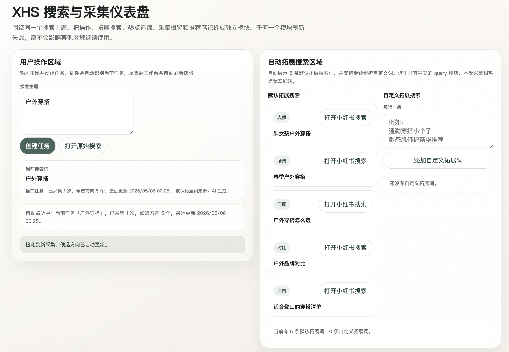
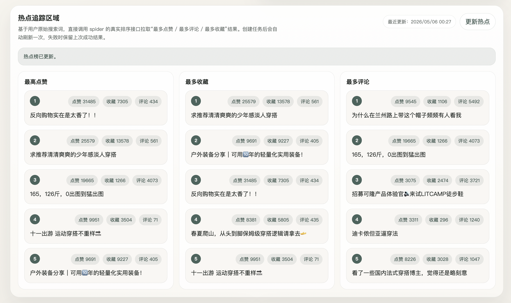
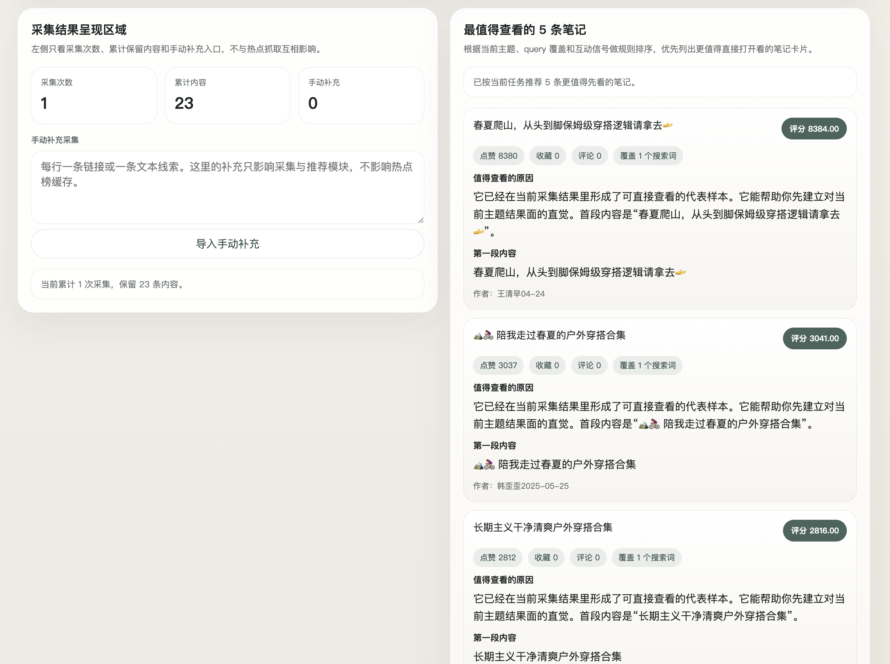

# XHS Extension MVP

一个面向“小红书内容研究 / 选题验证 / 竞品观察”的浏览器插件 MVP。

它不追求把小红书做成一个全自动爬虫接口，而是验证一条更贴近日常研究工作的链路：

```text
浏览器插件 + 用户主动采集 + 拓展搜索词 + 本地去重入库 + 候选方向生成
```

## 1. 为什么有这个 MVP？

调研了 GitHub 上已有的小红书相关项目，大致能分成几类：

- 请求封装 / 爬虫库：例如 [ReaJason/xhs](https://github.com/ReaJason/xhs)，主打对小红书 Web 端请求做封装。
- CLI / 数据命令工具：例如 [jackwener/xhs-cli](https://github.com/jackwener/xhs-cli)，可以在终端里搜索、阅读、点赞、收藏、评论，并支持 JSON 输出。
- MCP / Agent 工具：例如 [aicu-icu/xhs-mcp-server](https://github.com/aicu-icu/xhs-mcp-server)、[autoclaw-cc/xiaohongshu-skills](https://github.com/autoclaw-cc/xiaohongshu-skills)，重点是把小红书能力接给 AI 助手或自动化工作流。
- 自动化运营 / 发布系统：例如矩阵号发布、自动浏览、自动互动、多账号运营类项目。

这些项目很有价值，但它们通常默认用户已经知道自己要“抓什么字段、调什么接口、跑什么命令、接什么 Agent”。而我们真正遇到的问题更前置：

> 内容运营或策略研究人员打开小红书搜索页，看到了很多笔记，却很难把“眼前这些有价值的样本”快速沉淀成结构化证据、可复用链接和下一步选题方向。

所以这个 MVP 不是为了再造一个通用小红书爬虫，而是为了：

- 用户在真实浏览器里看到内容时，能不能一键采集当前页面可见样本？
- 采集后的样本能不能自动去重、保留来源链接和搜索词上下文？
- 系统能不能基于样本生成“候选选题方向”，而不是只给一堆原始数据？

## 2. 解决了什么场景下的什么问题？

### 典型场景

适合这些“小规模、高意图、需要人工判断”的小红书研究场景：

- 内容选题：搜索 `敏感肌护肤`、`通勤穿搭`、`租房收纳`，观察真实用户在问什么、晒什么、避什么坑。
- 竞品观察：打开竞品关键词、品牌词、品类词，收集当前可见的高相关笔记。
- 热点追踪：对一个原始搜索词查看点赞、评论、收藏维度下的热门样本。
- 人群 / 场景词扩展：围绕原始主题补充 `学生党`、`小个子`、`油皮`、`换季`、`避坑` 等更贴近平台语感的搜索词。
- AI 内容策略前置采样：先把可信样本沉淀下来，再进入选题生成、内容分析或后续 RAG 流程。

## 4. 怎么部署 & 安装

### 4.1 进入项目根目录

先进入这个仓库根目录，也就是包含 `app/`、`experiments/`、`setup_env.sh` 的目录：

```bash
cd /Users/czx/Documents/agentic/xhs_note_generator
```

如果你的本地路径不同，把上面的路径替换成自己的仓库路径即可。

### 4.2 初始化并激活虚拟环境

第一次使用时执行：

```bash
./setup_env.sh
source .venv/bin/activate
```

说明：

- `./setup_env.sh` 会创建 `.venv`、安装 `requirements.txt`，并在缺少 `.env` 时自动从 `.env.example` 复制。
- `source .venv/bin/activate` 会把当前终端切换到项目自己的 Python 环境。
- 如果关闭终端后重新打开，需要再次执行 `source .venv/bin/activate`。

### 4.3 启动 MVP 服务

在仓库根目录执行：

```bash
uvicorn experiments.xhs_extension_mvp.server.app:app --host 127.0.0.1 --port 8010
```

打开工作台：

```text
http://127.0.0.1:8010/
```

首次运行会创建：

```text
data/xhs_extension_mvp.db
data/xhs_extension_mvp.log
```

### 4.4 在 Chrome 安装插件

1. 打开 Chrome，进入 `chrome://extensions/`
2. 打开右上角 `开发者模式`
3. 点击 `加载已解压的扩展程序`
4. 选择目录：

```text
experiments/xhs_extension_mvp/extension
```

5. 确认扩展列表里出现 `XHS Extension MVP`

这一步只需要做一次。后续如果只是正常使用，不需要每次重新选择目录。

### 4.5 更新后怎么继续使用

如果只改了 `server/`、`web/` 或 README：

1. 停掉旧的 `uvicorn` 进程
2. 重新执行启动命令
3. 刷新工作台页面

如果改了插件代码：

1. 打开 `chrome://extensions/`
2. 找到 `XHS Extension MVP`
3. 点击扩展卡片上的 `重新加载`
4. 回到已经打开的小红书页面，手动刷新一次页面

最容易漏掉的是第 4 步。插件重新加载后，当前页面里的 content script 可能还是旧的，刷新页面后才会重新挂载。

## 5. 使用方式 / 步骤

### 5.1 首次采集完整流程

1. 打开工作台：`http://127.0.0.1:8010/`
2. 输入搜索主题，点击 `创建任务`
3. 创建任务成功后，系统会把该任务设为当前 active task，插件会自动同步任务上下文
4. 如果系统生成的 `拓展搜索` 不够贴合，可以在 `自定义拓展词` 输入框里补充搜索词，每行一条
5. 在工作台右侧 `拓展搜索` 里选一个搜索词，点击 `打开小红书搜索`
6. 小红书页面右下角会出现 `XHS 采集助手`
7. 在页面浮层里点击 `采集当前页`
8. 工作台会自动检测采集版本变化，并刷新候选方向
9. 在 `候选方向` 区域查看推荐理由、可写角度、证据概览和代表样本

### 5.2 日常使用链路

后续日常使用时，一般重复下面这条链路：

1. 启动 MVP 服务
2. 打开工作台
3. 创建任务
4. 补充自定义拓展词
5. 打开一个小红书搜索页或笔记详情页
6. 在页面右下角 `XHS 采集助手` 点击 `采集当前页`
7. 回到工作台查看自动刷新的采集结果和候选方向
8. 如需查看当前原始搜索词下的真实热门结果，点击 `更新热点`

如果你在小红书页面继续向下滚动，页面上出现了新的可见笔记，可以再次点击 `采集当前页`。系统会自动合并去重。

### 5.3 自定义拓展词

如果系统生成的 `拓展搜索` 不够符合你的搜索习惯，可以在工作台直接添加 `自定义拓展词`：

- 每行输入一条搜索词
- 点击 `添加自定义拓展词` 后，会和系统生成的词一起显示
- 自定义拓展词可以直接点开搜索
- 重复的词不会重复添加
- 自定义拓展词支持单独删除
- 自定义拓展词不会参与 `热点榜` 抓取

适合用在这些场景：

- 你已经知道平台上更容易搜到结果的口语化词
- 系统生成的搜索词还不够贴题
- 你想补一些具体的人群词、场景词、品牌词或问题词

### 5.4 手动补充

如果插件不可用，可以在工作台使用 `手动补充`：

- 每行粘贴一个链接，或一条文本线索
- 点击 `导入手动补充`
- 这些内容会进入同一套候选生成逻辑

注意：

- `自定义拓展词` 是为了补搜索词，帮助你去搜更合适的结果
- `手动补充` 是为了直接导入链接或文本线索，跳过插件采集做降级验证

### 5.5 当前边界

当前 MVP 有意保持克制：

- 只支持 Chrome 桌面版
- 只采集当前页面可见内容
- 不自动滚动
- 不自动翻页
- 不模拟点击
- 不处理验证码
- 不绕过登录或权限
- 不验证长期稳定性和规模化

### 5.6 常见问题

#### 小红书页面没有出现 `XHS 采集助手`

- 确认插件已在 `chrome://extensions/` 启用
- 确认当前页面是 `https://www.xiaohongshu.com/` 下的搜索页或笔记页
- 如果刚刚重新加载过插件，请刷新小红书页面，让 content script 重新挂载

#### 工作台里没有候选

- 先确认你已经在小红书页面浮层里成功点击过一次 `采集当前页`
- 工作台会自动监听采集版本变化并刷新候选方向，通常不需要手动操作
- 如果搜索页当前可见内容太少，可以继续向下滚动后再次采集
- 如果系统给的 `拓展搜索` 不够贴切，可以先补几条 `自定义拓展词` 再去搜
- 也可以先用 `手动补充` 输入链接或文本线索做降级验证

#### 热点榜和拓展搜索为什么不是一回事？

- `拓展搜索` 是为了帮你打开更多搜索入口
- `热点榜` 只基于用户输入的 `原始搜索词`
- 热点榜直接调用 spider 的真实排序接口，分别拉取 `最多点赞`、`最多评论`、`最多收藏`
- 创建任务后会自动刷新一次，后续也可以手动点击 `更新热点`
- 如果刷新失败，会保留上一次成功结果

## 6. 预留的网页截图

截图暂时先预留位置，后续可以在功能稳定后补充真实界面图。

### 6.1 工作台首页



### 6.2 拓展搜索词与热点追踪





### 6.3 小红书页面内采集助手


### 6.4 候选方向与证据样本



## 调试日志

- 服务端会把结构化日志同时输出到终端和 `data/xhs_extension_mvp.log`
- 可通过环境变量覆盖日志路径：

```bash
export XHS_EXTENSION_MVP_LOG_PATH=/tmp/xhs_extension_mvp.log
```

- 插件侧调试日志会输出到：
  - 当前小红书页面的 DevTools Console
  - 插件 popup 的 DevTools Console
