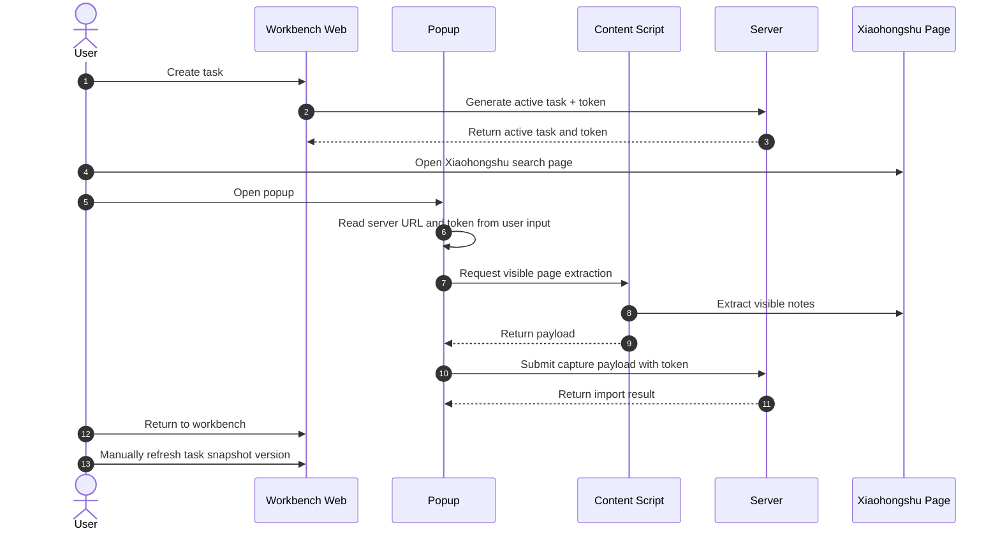
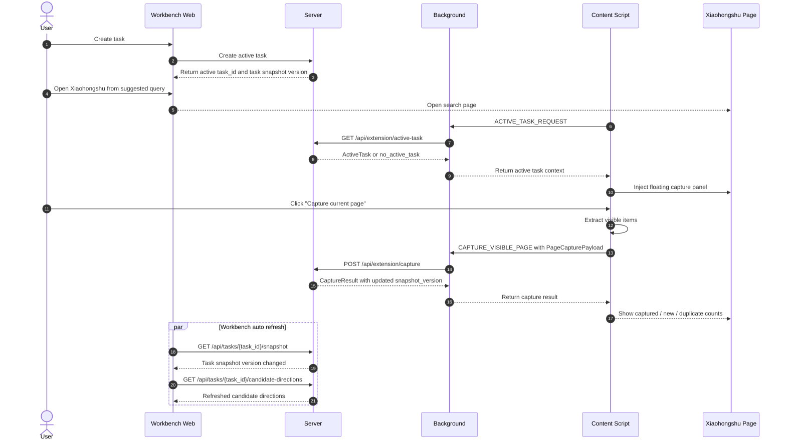

# XHS Extension MVP UX Optimization Spec

## 1. Product Definition

### 1.1 Overview

This document defines the UX optimization direction for the `XHS Extension MVP` experiment.

The current MVP validates a simple chain:

`browser extension + user-triggered capture + deterministic query expansion + local candidate generation`

The optimization goal is not to add more features. The goal is to make the product feel like:

> I create a task in the workbench, open Xiaohongshu, capture naturally on the page, and the system brings the result back automatically.
>
> I do not need to understand tokens, reopen popup repeatedly, or manually refresh task snapshots.

### 1.2 Current Positioning

The current experiment is intentionally isolated from the main production system:

- It does not connect to `app/api/routes/router.py`
- It does not connect to the existing `Session / Job / Worker / LangGraph` flow
- It does not write to the formal `data/xhs_agent.db`

The current MVP surface consists of:

- `server/`: standalone FastAPI service
- `web/`: single-page workbench
- `extension/`: Chrome MV3 extension

### 1.3 Target UX

The target user experience is:

1. User creates a task in the workbench
2. Workbench generates expanded search terms
3. User opens Xiaohongshu from a suggested search term
4. A capture floating panel appears inside the Xiaohongshu page
5. User clicks `Capture current page`
6. The system captures visible items, deduplicates, and stores the result
7. The workbench automatically refreshes candidates and insights
8. User keeps scrolling and capturing without switching to popup as the main action surface

### 1.4 Success Criteria

The optimization is successful if the following become true:

- Users no longer need to copy or paste a token during the normal flow
- Popup is no longer the primary capture entry point
- Workbench refresh is automatic instead of user-triggered
- Content script lifecycle issues are handled by runtime fallback instead of user troubleshooting
- The extension feels like a product workflow, not a debugging tool

### 1.5 Scope

In scope:

- Reframe the extension runtime around active task state
- Move the main capture entry from popup to page-level floating UI
- Auto-refresh the workbench after capture via task snapshot version changes
- Productize content script injection and recovery behavior
- Clarify runtime responsibilities across workbench, server, background, content script, and popup

Out of scope:

- Full multi-task switching as a first-stage requirement
- Automatic scrolling, page turning, or simulated clicking
- Real browser-extension return path beyond the MVP improvement proposal
- Real file upload parsing
- Replacing the experiment’s standalone MVP boundary with the formal product backend

### 1.6 User Experience Principles

- Users should express intent, not move state around manually
- The system should own active task context, not the user
- The entry point should live where the work happens
- Debug surfaces should remain available, but should not dominate normal operation
- Runtime instability should be handled by the system, not surfaced as a user burden

## 2. Current Experience Problems

### 2.1 Token Exposure Makes the Flow Feel Technical

The current flow exposes token as a user-facing step:

```text
Create task
→ system generates token
→ user copies token
→ open popup
→ paste token
→ click capture
```

This creates a product smell:

- The user feels like they are configuring a tool, not using a product
- The token is really active task context, but it is handled manually
- The system should know the active task, search query, and capture target automatically

The information that should be system-owned includes:

- Which task is currently active
- Which search query is currently active
- Which task the current capture belongs to

### 2.2 Popup Is Not the Right Primary Entry

Popup is appropriate for:

- Connection status
- Server URL configuration
- Current active task status
- Debug buttons

Popup is not appropriate as the main capture surface because the user’s real context is on the Xiaohongshu page:

```text
I see search results
→ I feel a page is valuable
→ I want to capture the visible content
```

The natural primary entry should therefore live on the Xiaohongshu page itself.

### 2.3 Workbench Refresh Should Not Require Manual Action

The current flow requires returning to the workbench and clicking refresh after capture.

That step should be automated:

```text
Capture completes
→ server updates task snapshot version
→ web auto-detects version change
→ candidates refresh automatically
```

The user should never need to understand the concept of a manual task snapshot version refresh.

### 2.4 Content Script Lifecycle Needs Productized Recovery

The current MVP already exhibits common extension runtime issues:

- After extension reload, the content script on an already-open page may be stale
- Popup may show `Could not establish connection. Receiving end does not exist.`
- The current workaround is to inject `content.js` again and retry

This means the product must treat content script lifecycle as a runtime concern:

- Background should handle injection fallback
- Users should not need to know whether content script is mounted
- Runtime recovery should be automatic where possible

### 2.5 Current Flow Fragmentation

The current flow requires the user to move across three surfaces:

- Workbench
- Popup
- Xiaohongshu page

The experience currently looks like this:

```text
Create task
→ generate token
→ open Xiaohongshu
→ open popup
→ confirm server URL
→ paste token
→ click capture
→ return to workbench
→ click refresh
```

This is the main friction the optimization aims to remove.

## 3. Target UX and User Journey

### 3.1 New End-to-End Flow

The target flow is the same chain shown in the target sequence diagram:

```text
1. User opens the workbench
2. User enters a topic and clicks "Create task"
3. Workbench creates and activates the task, then generates expanded search terms
4. User clicks "Open Xiaohongshu" next to a suggested query
5. The Xiaohongshu page opens, and the content script initializes by requesting the active task from background
6. Background syncs active task from the server and returns active task context to the content script
7. A capture floating panel appears inside the Xiaohongshu page
8. User clicks "Capture current page"
9. The page shows captured count, new count, and duplicate count
10. The server updates capture state and task snapshot version
11. The workbench automatically refreshes candidate directions when the task snapshot version changes
12. User scrolls further and captures again
```

The target journey removes the following from the normal path:

- Token copy/paste
- Popup as mandatory entry
- Manual refresh of task snapshot version
- Manual understanding of content script status

### 3.2 Target User Perception

The user should feel:

- The workbench is the place where tasks are created and tracked
- Xiaohongshu is the place where capture happens
- The system keeps context aligned across surfaces
- The extension behaves like a natural part of the workflow

### 3.3 Sequence Diagram: Current Flow



### 3.4 Sequence Diagram: Target Flow



## 4. Architecture and Responsibilities

### 4.1 Overall Architecture Principle

The extension should be structured as:

```text
workbench triggers intent
background maintains runtime state
content script extracts page data and renders the page-level UI
server owns active task state and capture persistence
popup shows status, debug controls, and fallback entry points
```

This is the main architecture principle borrowed from the SummerIce-style runtime separation.

### 4.2 Borrowed Design Ideas

The optimization borrows the following architectural ideas:

#### Background as runtime orchestration center

The important rule is that popup should not own business-state transfer.
Instead:

- Popup triggers intent
- Background keeps request state
- Content script gets page content
- Background calls server
- Popup only displays result

#### requestId / activeRequests / AbortController style runtime safety

Even though this capture flow is simpler than a long-running LLM workflow, it still needs runtime safety for:

- Repeated capture clicks
- Switching tabs while a capture is in progress
- Repeated capture on the same page
- Popup closing during capture
- Server unavailable
- Content script unavailable

The runtime should maintain at least the following concepts:

- `activeTask`
- `activeCapturesByTab`
- `lastCaptureResultByTab`
- `requestId`
- `AbortController`

These are needed to prevent:

- Duplicate submission
- Duplicate merging
- Cross-task contamination
- Workbench and page state divergence

#### Popup as status panel

Popup should become:

```text
XHS Extension MVP

Server: connected http://127.0.0.1:8010
Current active task: Light hiking sun protection clothing
Current page: Xiaohongshu search page
Visible notes: 18

[Capture current page]
[Open workbench]
[Resync task]
```

The `Capture Token` field should be removed from the normal UI and moved, if needed at all, into a developer-only area.

### 4.3 Component Responsibilities

#### Workbench Web

Responsible for:

- Creating tasks
- Showing expanded search terms
- Opening Xiaohongshu search pages
- Showing candidate directions
- Auto-refreshing snapshots

Not responsible for:

- Making users copy tokens
- Forcing users to understand plugin state transfer

#### Server

Responsible for:

- Maintaining task state
- Maintaining active task
- Generating capture token
- Validating capture token
- Receiving capture payload
- Deduplicating and merging captures
- Updating task snapshot version
- Returning candidate directions and summaries

#### Background

Responsible for:

- Synchronizing active task
- Maintaining `activeTaskCache`
- Handling capture requests
- Handling content script injection
- Handling server connection state
- Handling repeated requests and concurrent requests

#### Content Script

Responsible for:

- Identifying Xiaohongshu page type
- Extracting visible notes
- Injecting the floating capture panel
- Displaying capture state
- Sending capture intent to background

Not responsible for:

- Saving token
- Deciding task ownership directly
- Complex business logic

#### Popup

Responsible for:

- Showing connection state
- Showing active task
- Providing connection status, active task status, resync, and workbench entry
- Providing open-workbench entry
- Showing debug controls

Not responsible for:

- Being the primary capture entry point
- Asking the user to paste capture token

### 4.4 Runtime State Model

The background runtime state uses the minimum contract below:

```js
const runtimeState = {
  serverUrl: "http://127.0.0.1:8010",
  activeTask: null,
  activeTaskFetchedAt: 0,
  activeCapturesByTab: new Map(),
  lastCaptureResultByTab: new Map(),
  lastHealthCheckAt: 0,
  connectionState: "unknown"
};
```

Rules:

- `serverUrl` is configurable, but the MVP default remains `http://127.0.0.1:8010`.
- `activeTask` is populated only from `GET /api/extension/active-task`; popup and content script must not create it locally.
- `activeTaskFetchedAt` records the last successful active-task sync time so popup/content initialization and pre-capture resync can reason about freshness.
- `activeCapturesByTab` is keyed by Chrome `tabId` and stores the current `request_id`, `task_id`, `AbortController`, and status for the in-flight capture.
- `lastCaptureResultByTab` is display state only; it must not be treated as persistence.
- `connectionState` supports `unknown`, `connected`, and `disconnected`.
- The MVP supports exactly one active task at a time. Multi-task switching is a future enhancement and must not be inferred in Phase 1.

## 5. Runtime Contracts and Data Flow

### 5.1 Active Task Contract

The new system must introduce an active task contract:

- The server exposes the current active task.
- The background synchronizes it into local runtime state.
- The content script asks for it during initialization.
- The page UI uses it to show the current context.

Server API:

```text
GET /api/extension/active-task
POST /api/tasks/{task_id}/activate
POST /api/tasks/{task_id}/active-search-context
```

`GET /api/extension/active-task` returns `200` with an active task when one exists:

```json
{
  "active_task": {
    "task_id": "task_123",
    "capture_token": "opaque-runtime-token",
    "topic": "light hiking sun protection clothing",
    "created_at": "2026-05-05T10:00:00+08:00",
    "activated_at": "2026-05-05T10:01:00+08:00",
    "status": "active",
    "snapshot_version": 3,
    "capture_count": 2,
    "candidate_count": 8
  }
}
```

If no task is active, the endpoint returns `200` with:

```json
{
  "active_task": null,
  "error_summary": {
    "code": "no_active_task",
    "message": "No active task detected. Please return to the workbench and create a task first."
  }
}
```

`POST /api/tasks/{task_id}/activate` makes a task the single active task and returns the same `active_task` shape. Activation is idempotent for the same `task_id`.

`POST /api/tasks/{task_id}/active-search-context` records the search intent opened from the workbench:

```json
{
  "query": "light hiking sun protection clothing",
  "source": "expanded_query",
  "opened_at": "2026-05-05T10:04:00+08:00"
}
```

The endpoint returns the active task plus the stored active search context. Workbench must call it before opening the normal Xiaohongshu URL for a suggested query.

Supported active task statuses:

- `active`
- `missing`
- `expired`

### 5.2 Capture Token Contract

Token should no longer be a user-managed input in the normal flow.

It remains a runtime credential used by the system for capture submission:

- The server issues the token
- The background uses the token when submitting capture requests
- The user should not manually paste it during the normal workflow
- The popup must not show a token input in the normal UI
- A developer-only debug token field is allowed only if it is visually separated from the product flow
- Invalid or expired token failures must map to `capture_token_invalid` and trigger an active-task resync before asking the user to act

### 5.3 Page Payload Contract

The content script must extract only the current visible content that the MVP already supports.

The `PageCapturePayload` contains:

```json
{
  "page_url": "https://www.xiaohongshu.com/search_result?keyword=...",
  "page_type": "search_result",
  "query_text": "light hiking sun protection clothing",
  "captured_at": "2026-05-05T10:08:00+08:00",
  "visible_items": [
    {
      "source_id": "xhs_note_id_or_url_hash",
      "title": "string",
      "body_text": "string",
      "author": "string",
      "likes": 120,
      "collects": 32,
      "comments": 8,
      "shares": 3,
      "source_url": "https://www.xiaohongshu.com/explore/...",
      "raw": {}
    }
  ]
}
```

The current page extraction behavior already supports:

- Search result pages
- Note detail pages

The page payload should preserve the existing MVP boundary:

- Only visible content
- No automatic scrolling
- No page turning
- No simulated clicking

Supported `page_type` values are:

- `search_result`
- `note_detail`
- `unsupported`

When `page_type` is `unsupported`, content script should return a typed failure to background and must not submit a capture request.

### 5.4 Snapshot Version Contract

The workbench must stop depending on manual task snapshot refresh.

Instead:

- Capture completion increments task snapshot version
- Workbench polls for task snapshot changes
- Version changes trigger automatic candidate refresh

Server APIs:

```text
GET /api/tasks/{task_id}/snapshot
GET /api/tasks/{task_id}/candidate-directions
```

`GET /api/tasks/{task_id}/snapshot` returns:

```json
{
  "task_id": "task_123",
  "snapshot_version": 4,
  "updated_at": "2026-05-05T10:09:00+08:00",
  "candidate_count": 12,
  "capture_count": 3,
  "last_capture_result": {
    "request_id": "req_456",
    "captured_count": 18,
    "new_count": 12,
    "duplicate_count": 6,
    "status": "accepted"
  }
}
```

Workbench polling rule:

- Polling is the MVP contract; SSE is explicitly out of scope for this optimization pass.
- The initial polling interval is `2000ms`.
- A changed `snapshot_version` triggers `GET /api/tasks/{task_id}/candidate-directions`.
- A same-version response must not refresh candidates.
- Manual snapshot refresh is not part of the shipped workflow; the workbench refreshes from `snapshot_version` changes.

### 5.5 Health Check Contract

The runtime should expose health information so that users do not have to diagnose connection failure themselves.

Health endpoint:

```text
GET /api/extension/health
```

Response:

```json
{
  "status": "ok",
  "server_time": "2026-05-05T10:10:00+08:00",
  "active_task_available": true,
  "version": "xhs-extension-mvp"
}
```

The health check is needed to distinguish:

- Server not started
- Popup or background not connected
- Content script not available

If the server is unreachable, background maps the failure to `server_unavailable` and surfaces the user-facing message defined in §6.1.

### 5.6 Capture Submission Contract

Server API:

```text
POST /api/extension/capture
```

Request body:

```json
{
  "task_id": "task_123",
  "request_id": "req_456",
  "tab_id": 123,
  "page_url": "https://www.xiaohongshu.com/search_result?keyword=...",
  "page_type": "search_result",
  "query_text": "light hiking sun protection clothing",
  "visible_items": []
}
```

Response body:

```json
{
  "task_id": "task_123",
  "request_id": "req_456",
  "ingestion_run_id": "ing_789",
  "snapshot_version": 4,
  "captured_count": 18,
  "new_count": 12,
  "duplicate_count": 6,
  "status": "accepted",
  "error_summary": null
}
```

Rules:

- `request_id` is generated by background for each capture attempt and is required.
- Background submits the runtime token with the `X-Capture-Token` header. The request body must not require users or UI code to handle the token directly.
- The server must treat repeated `request_id` submissions for the same `task_id` as deterministic retries, not as new captures.
- `captured_count` is the number of extracted visible items submitted by the page.
- `new_count` is the number of items newly merged into the task snapshot.
- `duplicate_count` is the number of submitted items already known to the task.
- Successful capture increments `snapshot_version`.
- Failed capture does not increment `snapshot_version`.
- Supported response statuses are `accepted`, `duplicate_only`, and `failed`.

### 5.7 Extension Message Contract

Background/content/popup message types:

```text
HEALTH_CHECK
ACTIVE_TASK_REQUEST
ACTIVE_TASK_RESYNC
PAGE_STATUS_REQUEST
CAPTURE_VISIBLE_PAGE
CAPTURE_CANCEL
CAPTURE_RESULT
CONTENT_SCRIPT_ENSURE
```

Rules:

- Content script sends `ACTIVE_TASK_REQUEST` during initialization.
- Popup sends `HEALTH_CHECK`, `ACTIVE_TASK_RESYNC`, and `PAGE_STATUS_REQUEST`; page capture sends `CAPTURE_VISIBLE_PAGE`.
- Content script owns page extraction; background owns HTTP submission.
- Background must attempt `CONTENT_SCRIPT_ENSURE` when a tab message fails because the content script is missing or stale.
- `CAPTURE_VISIBLE_PAGE` must be rejected while `activeCapturesByTab` already contains an in-flight capture for the same `tabId`.

### 5.8 URL Binding and Search Context

The workbench should associate search intent with active task context in a way that does not require manual token transfer.

The implementation uses the following decision:

- Server maintains active task and active search context
- Workbench records active search context through `POST /api/tasks/{task_id}/active-search-context`
- Workbench opens a normal Xiaohongshu search URL after recording that context
- Content script / background re-sync active task context through the server

That keeps page URLs simpler and avoids leaking task identifiers into the user-visible URL when not needed.

URL parameter binding is out of scope for this MVP optimization unless a later spec explicitly reopens the decision.

## 6. Failure Handling and Recovery

### 6.1 Server Not Started

If the server is unavailable, the UI should show a clear connection failure:

```text
Not connected to local service
Please start the MVP server first
[Retry connection]
```

Popup should show the same state.

### 6.2 No Active Task

If no active task exists, the UI should not expose a token error.

It should show:

```text
No active task detected
Please return to the workbench and create a task first
[Open workbench]
```

### 6.3 Non-Xiaohongshu Page

If the current page is not supported, the UI should say:

```text
This page is not supported for capture
Please open a Xiaohongshu search result page or note detail page
```

### 6.4 Content Script Not Mounted

If the content script is missing or stale, background should attempt injection automatically.

The user should not have to solve this manually during normal usage.

### 6.5 Repeated Capture, Concurrency, and Tab Switching

The runtime must handle the following cases:

- User clicks capture repeatedly
- User switches tabs during capture
- Same page is captured multiple times
- Popup closes during capture
- Server is offline
- Content script is not mounted

The runtime should use request-level and tab-level tracking to avoid:

- Duplicate submission
- Duplicate merge
- Task contamination
- State inconsistency between page and workbench

### 6.6 Existing Extension Reload Recovery

The current README already documents that after extension reload, the target Xiaohongshu page may need a refresh because the old content script may still be present.

The optimization should reduce the need for this manual recovery step by:

- Making background responsible for fallback injection
- Making runtime state explicit
- Showing status rather than requiring user debugging

### 6.7 Failure Message Design Principle

Error messages should stay close to user intent:

- Say what is missing
- Say what the user should do next
- Avoid exposing raw extension runtime internals as the primary message

## 7. Priorities and Recommended Rollout

### 7.1 P0: Must Do

These items are the highest priority because they remove the biggest interaction breaks:

- Remove manual token pasting
- Establish background active task synchronization
- Make popup show state rather than asking for token input
- Automate workbench task snapshot refresh
- Add server health check behavior

### 7.2 P1: Strongly Recommended

These items provide the biggest product-quality improvement after the runtime foundation exists:

- Inject a floating capture panel into Xiaohongshu pages
- Display active task and visible notes count in the panel
- Show added content count after scrolling
- Automatically recover when content script is unavailable

### 7.3 P2: Future Enhancements

These items are explicitly later-stage enhancements:

- Support multiple task switching
- Replace polling with SSE if needed later
- Automatically detect search-term and task association
- Preview candidate directions directly inside the page

### 7.4 Recommended Implementation Order

The recommended implementation sequence is:

```text
Step 1: Add active-task endpoint on the server
Step 2: Background auto-sync active task
Step 3: Remove token input from popup
Step 4: Add task snapshot polling and auto-refresh in the workbench
Step 5: Inject floating capture panel into Xiaohongshu page
Step 6: Implement page-level capture and result feedback
Step 7: Handle server down / no task / non-XHS / content script missing
```

This order matches the core UX dependency chain:

1. Task context must exist
2. Runtime must know the active task
3. Popup must stop being the main action surface
4. Workbench must update automatically
5. Page capture must become the primary action path
6. Failures must be understandable and recoverable

## 8. Development Plan

### 8.1 Phase 0: Spec Freeze and Interface Finalization

Goal:

- Confirm the final UX boundary before implementation starts

Deliverables:

- Finalized active task data model
- Finalized runtime responsibility split
- Finalized API surface
- Finalized sequence diagram

Acceptance:

- The target flow is explicit and stable
- The implementation team does not need to make new product decisions during coding

Frozen interface record:

- Active task model is frozen in §5.1.
- Runtime state ownership is frozen in §4.3 and §4.4.
- API surface is frozen in §5.1, §5.4, §5.5, and §5.6.
- Extension message contract is frozen in §5.7.
- URL binding, polling, token visibility, single-active-task scope, and visible-content-only capture decisions are frozen in §5.2, §5.3, §5.4, and §5.8.
- Phase 1 implementation may add code against these contracts without reopening product decisions.

### 8.2 Phase 1: Active Task Runtime Foundation

Goal:

- Remove manual token transfer from the normal flow

Main work:

- Add server-side active task support
- Sync active task in background runtime
- Initialize content script with active task lookup
- Store runtime state in background

Acceptance:

- The system knows the active task automatically
- The user does not paste token during normal usage
- Popup can show active task and connection state

Implementation record:

- Server active task foundation is implemented through `GET /api/extension/active-task`, `POST /api/tasks/{task_id}/activate`, `POST /api/tasks/{task_id}/active-search-context`, `GET /api/extension/health`, and `POST /api/extension/capture`.
- Creating an MVP task now marks it as the single active task and stores a runtime capture token for the extension background.
- Chrome MV3 background runtime now owns active task sync, health checks, content-script injection fallback, and capture submission with `X-Capture-Token`.
- Popup can show server connection state and active task, then request capture without requiring a pasted token.
- Content script requests active task context during initialization while preserving the existing visible-content extraction behavior.
- Verified by `pytest tests/unit/test_xhs_extension_mvp.py -q` and `pytest tests/unit/test_xhs_extension_mvp_hotspots.py -q`.

### 8.3 Phase 2: Popup Downgrade to Status Panel

Goal:

- Remove popup from the critical path

Main work:

- Remove token input field
- Keep server URL in settings or advanced debug area only
- Retain connection state, active task, resync, and workbench entry
- Improve fallback messages for no-task / server-down / unsupported page

Acceptance:

- Popup no longer owns the business-state transfer
- Users can use the product without opening popup as the mandatory action surface

Implementation record:

- Popup now presents itself as `Runtime Status` rather than a capture tool.
- Server URL is moved into an advanced connection settings disclosure.
- Popup displays connection state, active task, current page status, and visible note count.
- Popup keeps `Open Workbench` and `Resync Active Task` controls; page capture is handled by the Xiaohongshu floating panel.
- User-facing fallback messages now cover local service unavailable, no active task, unsupported page, and content-script helper recovery.
- Verified by `pytest tests/unit/test_xhs_extension_mvp.py -q` and `pytest tests/unit/test_xhs_extension_mvp_hotspots.py -q`.

### 8.4 Phase 3: Xiaohongshu Page Capture Floating Panel

Goal:

- Move the main capture entry into the page where the user is actually working

Main work:

- Inject floating panel from content script
- Show active task state and visible notes count
- Capture visible content from the page
- Submit via background to server
- Return capture result on page

Acceptance:

- Users can capture directly in the Xiaohongshu page
- No popup is needed for the primary capture action
- The page shows useful capture feedback

Implementation record:

- Content script now injects `#xhs-mvp-capture-panel` as a fixed Xiaohongshu page capture panel.
- The panel shows active task state, current visible note count, newly visible count after scroll, and capture feedback.
- The panel capture button sends `CAPTURE_VISIBLE_PAGE` to the background runtime and renders captured/new/duplicate counts on the page.
- The panel can be collapsed, and visible count refresh remains bounded to current visible content only.
- Popup capture has been removed; the primary capture path is page-level.
- Verified by `pytest tests/unit/test_xhs_extension_mvp.py -q` and `pytest tests/unit/test_xhs_extension_mvp_hotspots.py -q`.

### 8.5 Phase 4: Auto-Refresh Workbench Snapshot

Goal:

- Remove manual snapshot refresh from the user’s workflow

Main work:

- Add task snapshot version to the server response
- Increment task snapshot version after capture success
- Poll task snapshot version from the workbench
- Auto-refresh candidate directions when the task snapshot version changes

Acceptance:

- Workbench updates automatically after capture
- Users no longer click refresh manually

Implementation record:

- Server task snapshots now expose `snapshot_version`, `updated_at`, `candidate_count`, and `capture_count`.
- Added lightweight polling endpoint `GET /api/tasks/{task_id}/snapshot`.
- Added refresh endpoint `GET /api/tasks/{task_id}/candidate-directions` for version-change workbench updates.
- Workbench starts a `2000ms` snapshot-version poll after task load and refreshes collection/recommendation/candidate modules when the version changes.
- Workbench top status now shows current task, capture count, candidate count, recent update time, and whether auto-listening is active.
- Manual snapshot refresh has been removed from the shipped workflow; capture-to-workbench refresh is automatic.
- Verified by `pytest tests/unit/test_xhs_extension_mvp.py -q` and `pytest tests/unit/test_xhs_extension_mvp_hotspots.py -q`.

### 8.6 Phase 5: Failure Handling and Runtime Stability

Goal:

- Make the MVP feel like a product instead of a demo

Main work:

- Handle server unavailable state
- Handle missing active task
- Handle non-Xiaohongshu pages
- Handle content script injection recovery
- Handle repeated capture / concurrency / tab changes

Acceptance:

- Common failure modes are understandable
- Users do not need to debug extension runtime behavior manually
- Duplicate operations do not corrupt task or capture state

Implementation record:

- Background runtime now returns typed failure codes for `server_unavailable`, `no_active_task`, `unsupported_page`, `content_script_unavailable`, `capture_already_running`, `capture_token_invalid`, `capture_task_mismatch`, and `capture_submit_failed`.
- Page status and capture paths now attempt content-script injection recovery before surfacing helper-unavailable errors.
- Same-tab capture concurrency remains guarded by `activeCapturesByTab`, while capture submission continues to use generated `request_id` values for server-side idempotency.
- Popup status messages and page-panel feedback now explain server-down, no-task, unsupported-page, helper-recovery, duplicate-capture, and submit/auth failures without falling back to the removed manual capture/token flow.
- The Xiaohongshu floating panel now includes retry/resync and open-workbench recovery actions for common runtime failures.
- Verified by `pytest tests/unit/test_xhs_extension_mvp.py -q`, `pytest tests/unit/test_xhs_extension_mvp_hotspots.py -q`, and `python3 -m compileall experiments/xhs_extension_mvp/server tests/unit/test_xhs_extension_mvp.py`.

### 8.7 Phase 6: Testing, Verification, and UX Acceptance

Goal:

- Validate the new flow end to end

Main work:

- Add backend tests for active task, capture, task snapshot, and recovery paths
- Add frontend validation for popup state, page panel, and auto refresh
- Run an end-to-end acceptance pass through the new flow

Acceptance:

- Create task
- Open Xiaohongshu
- Capture on page
- Workbench auto-updates
- No fallback to token-based manual flow

Implementation record:

- Added a Phase 6 acceptance flow test that creates a task, reads the active task for the extension runtime, submits visible Xiaohongshu page content through `POST /api/extension/capture`, verifies deterministic retry behavior, and confirms snapshot/candidate refresh metadata.
- Added a Phase 6 UI/runtime contract test that verifies the manifest, background runtime, page floating panel, popup status panel, and workbench auto-refresh are wired to the new active-task/page-panel flow.
- Locked absence of the deleted manual flow in shipped code: no popup token field, no fallback capture button, no manual snapshot refresh button, no `/mvp/captures`, and no `/capture-token` route.
- Updated workbench auto-refresh failure copy so it no longer tells users to manually refresh a deleted control.
- Verified by `pytest tests/unit/test_xhs_extension_mvp.py -q`, `pytest tests/unit/test_xhs_extension_mvp_hotspots.py -q`, `python3 -m compileall experiments/xhs_extension_mvp/server tests/unit/test_xhs_extension_mvp.py`, and `node --check` for background/content/popup scripts.

### 8.8 Phase Priority Summary

Recommended implementation order:

1. Phase 1
2. Phase 2
3. Phase 3
4. Phase 4
5. Phase 5
6. Phase 6

This order keeps the runtime foundation ahead of UI polish, and keeps the user-facing path aligned with the actual state model.

### 8.9 Responsibilities by Subsystem

#### Web workbench

- Task creation
- Search-term display
- Open Xiaohongshu
- Snapshot polling
- Candidate refresh

#### Server

- Active task
- Capture token issuance
- Capture validation
- Deduplication and merge
- Snapshot version management
- Health endpoint

#### Background

- Active task sync
- Runtime state
- Capture orchestration
- Content script injection fallback
- Connection status

#### Content script

- Page type detection
- Visible item extraction
- Floating panel injection
- Capture button interaction

#### Popup

- Status display
- Connection display
- Manual resync
- Workbench shortcut

#### Current MVP / Future Relationship Note

This spec describes the UX optimization direction for the standalone MVP experiment.

It does not replace the formal production development track. The experiment’s role remains:

- Validate whether the capture workflow is naturally usable
- Validate whether the runtime model is product-like
- Validate whether the capture-to-workbench loop is smooth enough

The optimization should therefore strengthen the experiment, not collapse it into the formal system.
